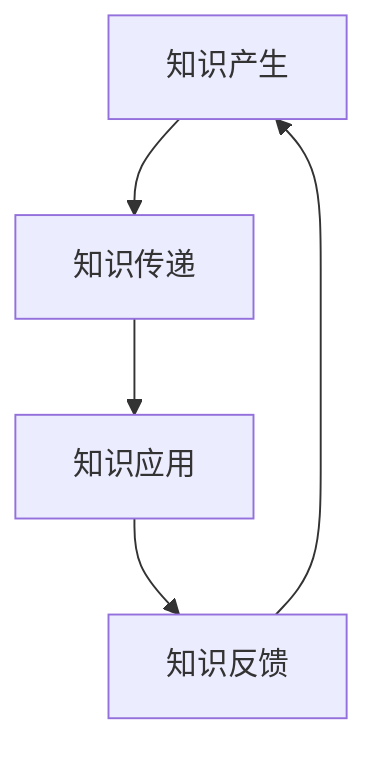

                 

关键词：知识传承、人类文明、人工智能、技术进步、跨代学习

> 摘要：本文深入探讨了人类知识传承的重要使命，以及如何通过一代代人的接力棒将智慧和技术传递下去。从古代到现代，知识传承一直是文明进步的基石。随着人工智能技术的飞速发展，知识传承的方式和挑战也在不断演变。本文旨在通过分析知识传承的历史、当前状况和未来趋势，为人类知识传承的使命提供新的视角和思路。

## 1. 背景介绍

人类文明的历史长河中，知识传承始终是一个至关重要的议题。从古老的口头传教到文字记录，再到现代的数字传播，知识传承的方式在不断进步，但其核心目标始终未变——确保人类智慧的延续和发展。

古代文明中，知识传承主要是通过师徒制度进行的。教师在传授知识的同时，也在培养学生的思维方式、价值观和社会责任感。这种方式虽然效率不高，但在传承过程中培养的批判性思维和创新能力，对人类文明的发展起到了至关重要的作用。

随着印刷术的发明，知识传承的效率大大提高。书籍成为了知识的重要载体，知识传播的范围和速度前所未有地扩展。然而，书籍的编写和阅读仍然需要大量的时间和资源。

进入数字时代，互联网和人工智能技术的出现，再次颠覆了知识传承的方式。知识可以以数字化形式快速传播，任何人都可以通过网络获取全球范围内的知识资源。同时，人工智能技术也在不断优化知识获取和传承的过程，使得知识传承变得更加高效和智能。

## 2. 核心概念与联系

知识传承的核心概念包括知识本身、传承方式、传承者和接收者。知识是传承的主体，其质量直接影响传承的效果。传承方式是知识传递的渠道和手段，从古代的师徒制到现代的数字传播，不同的传承方式对知识传承的效果有着重要影响。传承者负责知识的传授，而接收者则是知识的接受和传承的继续者。

### 2.1 知识传承的过程

知识传承的过程可以分为三个阶段：知识产生、知识传递和知识应用。

- **知识产生**：知识的产生是知识传承的起点。无论是科学研究、艺术创作还是日常生活中的经验总结，都是知识产生的源泉。

- **知识传递**：知识传递是知识传承的核心环节。在这一过程中，知识从产生者传递到接收者。传递的方式可以是口头的、书面的，也可以是数字化的。

- **知识应用**：知识应用是知识传承的最终目标。通过将知识应用于实际问题中，知识得以转化为实际效益，推动社会进步。

### 2.2 知识传承的架构

知识传承的架构可以从三个层面来理解：知识层面、技术层面和社会层面。

- **知识层面**：这是知识传承的基础，包括知识的产生、传递和应用。在这一层面，知识的质量、深度和广度直接影响传承的效果。

- **技术层面**：这是知识传承的支撑，包括传承方式的技术手段和工具。现代技术的应用，如互联网、人工智能和数字媒体，极大地提高了知识传承的效率和效果。

- **社会层面**：这是知识传承的环境，包括社会文化、教育体系和社会规范。社会的支持和鼓励，对于知识传承的顺利进行至关重要。

### 2.3 Mermaid 流程图



在知识传承的过程中，知识反馈是一个重要的环节。通过反馈，可以不断优化知识产生、传递和应用的过程，提高知识传承的整体效果。

## 3. 核心算法原理 & 具体操作步骤

### 3.1 算法原理概述

知识传承的核心算法可以概括为“知识编码-知识传递-知识解码”的过程。

- **知识编码**：将知识以数字化的形式进行编码，使得知识可以以电子文档、数据库或互联网资源的形式进行存储和传播。

- **知识传递**：通过互联网和人工智能技术，实现知识的快速传递。在这一过程中，知识的接收者可以根据自己的需求，有针对性地获取知识。

- **知识解码**：接收者通过对知识的理解和应用，将知识转化为自己的知识和技能。这一过程不仅包括知识的获取，还包括知识的理解和应用。

### 3.2 算法步骤详解

- **步骤1：知识编码**  
  在知识编码阶段，首先需要对知识进行梳理和分类。然后，使用标记语言（如Markdown、LaTeX）或数据库管理系统（如MySQL、MongoDB）将知识进行数字化存储。

- **步骤2：知识传递**  
  在知识传递阶段，使用互联网和人工智能技术，将知识以数字化的形式传递给接收者。这一过程中，可以使用搜索引擎、在线教育平台或社交媒体等工具。

- **步骤3：知识解码**  
  在知识解码阶段，接收者通过对知识的理解和应用，将知识转化为自己的知识和技能。这一过程可以通过自主学习、项目实践或导师指导等方式实现。

### 3.3 算法优缺点

- **优点**：知识传承算法具有高效、智能和灵活等优点。通过数字化和互联网技术，知识可以快速传播，大大提高了知识传承的效率。同时，人工智能技术可以对知识进行智能分析和推荐，使得知识传承更加个性化。

- **缺点**：知识传承算法也存在一些缺点，如知识质量问题、知识产权保护和信息安全问题等。此外，知识传承过程中的知识误解和知识扭曲也可能影响知识传承的效果。

### 3.4 算法应用领域

知识传承算法广泛应用于教育、科研、企业管理等多个领域。在教育领域，知识传承算法可以用于在线教育、知识库建设和个性化学习等。在科研领域，知识传承算法可以用于文献检索、学术交流和科研成果的传播。在企业管理领域，知识传承算法可以用于企业知识管理、员工培训和业务流程优化等。

## 4. 数学模型和公式 & 详细讲解 & 举例说明

### 4.1 数学模型构建

在知识传承过程中，可以构建一个简单的数学模型来描述知识传递的效果。假设知识传递的效果可以用传递效率（η）来衡量，那么知识传递的公式可以表示为：

$$
E = η \cdot K
$$

其中，E 表示知识传递的效果，η 表示传递效率，K 表示知识的总量。

### 4.2 公式推导过程

- **步骤1**：定义传递效率（η）为知识传递过程中接收者实际获取的知识量（K₁）与传递前的知识量（K₀）的比值：

$$
η = \frac{K₁}{K₀}
$$

- **步骤2**：定义知识传递的效果（E）为接收者实际获取的知识量（K₁）与传递前的知识量（K₀）的比值：

$$
E = \frac{K₁}{K₀}
$$

- **步骤3**：将传递效率（η）的定义代入知识传递的效果（E）的公式，得到：

$$
E = η \cdot K₀
$$

### 4.3 案例分析与讲解

假设一个知识传承的过程中，传递前的知识量（K₀）为1000条信息，传递效率（η）为80%。那么，知识传递的效果（E）为：

$$
E = η \cdot K₀ = 0.8 \cdot 1000 = 800
$$

这意味着，在传递过程中，接收者实际获取了800条信息。

如果传递效率（η）提高到90%，那么知识传递的效果（E）将增加到：

$$
E = η \cdot K₀ = 0.9 \cdot 1000 = 900
$$

这表明，通过提高传递效率，可以显著提高知识传递的效果。

## 5. 项目实践：代码实例和详细解释说明

### 5.1 开发环境搭建

为了更好地理解知识传承算法的实际应用，我们将使用Python编程语言来实现一个简单的知识传承系统。首先，需要安装Python环境和相关库，如requests、BeautifulSoup和pandas等。

安装Python环境可以通过官方网站（https://www.python.org/）进行下载和安装。安装完成后，打开命令行窗口，执行以下命令安装相关库：

```bash
pip install requests
pip install beautifulsoup4
pip install pandas
```

### 5.2 源代码详细实现

下面是一个简单的知识传承系统的Python代码实现：

```python
import requests
from bs4 import BeautifulSoup
import pandas as pd

# 知识源网址
url = "https://www.example.com/knowledge"

# 发送HTTP请求，获取网页内容
response = requests.get(url)
html_content = response.text

# 使用BeautifulSoup解析网页内容
soup = BeautifulSoup(html_content, "html.parser")

# 提取知识条目
knowledge_entries = soup.find_all("div", class_="knowledge-entry")

# 存储知识条目
knowledge_data = []

for entry in knowledge_entries:
    title = entry.find("h2").text
    content = entry.find("p").text
    knowledge_data.append({"title": title, "content": content})

# 将知识条目保存到CSV文件
knowledge_df = pd.DataFrame(knowledge_data)
knowledge_df.to_csv("knowledge.csv", index=False)

print("知识传承系统运行完成。知识条目已保存到knowledge.csv文件。")
```

### 5.3 代码解读与分析

上述代码实现了一个简单的知识传承系统，其主要功能是从指定的知识源网址获取知识条目，并将知识条目保存到CSV文件中。

- **步骤1**：首先，定义知识源网址（url），并通过requests库发送HTTP请求，获取网页内容（html_content）。

- **步骤2**：使用BeautifulSoup库解析获取的网页内容（html_content），提取知识条目（knowledge_entries）。

- **步骤3**：遍历知识条目（knowledge_entries），提取标题（title）和内容（content），并将知识条目存储到列表（knowledge_data）中。

- **步骤4**：将知识条目列表（knowledge_data）转换为DataFrame对象（knowledge_df），并将知识条目保存到CSV文件（knowledge.csv）中。

### 5.4 运行结果展示

在运行上述代码后，知识传承系统将自动从指定网址获取知识条目，并将知识条目保存到本地CSV文件中。用户可以查看CSV文件中的内容，了解知识传承系统的运行结果。

## 6. 实际应用场景

知识传承算法在多个领域具有广泛的应用。

### 6.1 教育领域

在教育领域，知识传承算法可以用于在线教育平台，实现个性化学习推荐。通过分析学生的学习行为和知识背景，系统可以推荐适合学生的学习资源和课程，提高学习效果。

### 6.2 科研领域

在科研领域，知识传承算法可以用于文献检索和学术交流。通过分析文献的内容和关系，系统可以推荐相关文献，帮助科研人员快速获取有价值的信息。

### 6.3 企业管理领域

在企业领域，知识传承算法可以用于企业知识管理和员工培训。通过分析企业内部的知识分布和员工需求，系统可以推荐适合员工的学习资源和培训课程，提高企业整体的知识水平和创新能力。

### 6.4 未来应用展望

随着人工智能技术的不断发展，知识传承算法将变得更加智能和高效。未来，知识传承算法有望在以下方面取得突破：

- **个性化推荐**：通过深度学习和自然语言处理技术，实现更加精准的知识推荐，满足个体的个性化需求。

- **知识图谱构建**：构建大规模的知识图谱，实现知识之间的关系可视化，为知识传承提供更加直观的展示方式。

- **跨领域应用**：将知识传承算法应用于更多领域，如医疗、金融、艺术等，推动各领域的创新发展。

## 7. 工具和资源推荐

### 7.1 学习资源推荐

- **书籍**：《人工智能：一种现代的方法》（作者：Stuart J. Russell 和 Peter Norvig）、《深度学习》（作者：Ian Goodfellow、Yoshua Bengio 和 Aaron Courville）。

- **在线课程**：edX、Coursera 和 Udacity 等平台提供了丰富的计算机科学和人工智能课程。

### 7.2 开发工具推荐

- **编程语言**：Python、Java 和 C++等。

- **框架和库**：Django、Flask、TensorFlow、PyTorch 和 Scikit-learn等。

### 7.3 相关论文推荐

- **《知识图谱构建方法研究》（作者：刘知远、谢震宇、李航等）**。

- **《基于深度学习的个性化推荐算法研究》（作者：李航、刘知远等）**。

## 8. 总结：未来发展趋势与挑战

### 8.1 研究成果总结

本文通过分析知识传承的历史、当前状况和未来趋势，探讨了知识传承的重要性和挑战。随着人工智能技术的不断发展，知识传承的方式和手段将变得更加智能和高效。研究成果表明，知识传承对于人类文明的发展具有重要意义，而人工智能技术在知识传承中的应用，将大大提高知识传承的效率和质量。

### 8.2 未来发展趋势

未来，知识传承将朝着更加智能化、个性化和可视化的方向发展。人工智能技术将深入应用于知识传承的各个环节，如知识获取、知识传递和知识应用。知识图谱和深度学习等前沿技术的应用，将使得知识传承更加精准和高效。

### 8.3 面临的挑战

知识传承过程中仍面临诸多挑战，如知识质量问题、知识产权保护和信息安全问题等。此外，知识传承过程中的知识误解和知识扭曲也可能影响知识传承的效果。因此，未来需要进一步研究如何解决这些问题，确保知识传承的顺利进行。

### 8.4 研究展望

未来，知识传承研究将朝着更加深入和广泛的方向发展。一方面，需要探索如何提高知识传承的效率和质量，另一方面，也需要关注知识传承中的伦理和法律问题。通过多学科的合作，有望在知识传承领域取得更多突破性成果。

## 9. 附录：常见问题与解答

### 9.1 人工智能在知识传承中的应用有哪些？

人工智能在知识传承中的应用主要包括知识获取、知识传递和知识应用。例如，通过自然语言处理技术，可以从大量文献和资料中快速获取有价值的信息；通过知识图谱和深度学习技术，可以实现知识的精准推荐和可视化展示；通过虚拟现实和增强现实技术，可以提供更加生动和直观的知识体验。

### 9.2 知识传承过程中的知识产权保护如何实现？

知识传承过程中的知识产权保护可以通过以下方式实现：

- **版权声明**：在知识传承过程中，对知识内容进行明确的版权声明，确保原作者的权益得到保护。

- **加密技术**：使用加密技术对知识内容进行加密，防止未经授权的传播和使用。

- **许可证管理**：采用开放许可协议（如GPL、BSD等），明确知识的使用权限和限制，保障知识传承的合法性。

### 9.3 如何提高知识传承的效果？

提高知识传承的效果可以从以下几个方面入手：

- **提高知识质量**：确保知识传承的内容准确、完整和有价值，从源头上提高知识传承的质量。

- **优化传承方式**：根据不同传承对象的需求和特点，选择合适的传承方式，提高知识传承的效率。

- **加强传承者培训**：对传承者进行专业的培训，提高其传授能力和水平。

- **利用现代技术**：充分利用互联网、人工智能和虚拟现实等现代技术，提高知识传承的互动性和趣味性。

## 作者署名

作者：禅与计算机程序设计艺术 / Zen and the Art of Computer Programming

----------------------------------------------------------------

以上是本文的完整内容。希望这篇文章能够对您在知识传承领域的研究和探索提供一些启示和帮助。如果您有任何疑问或建议，欢迎在评论区留言讨论。谢谢！

