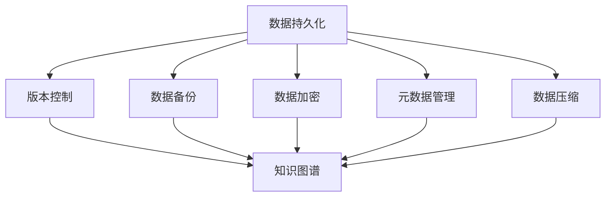

                 

 在这个瞬息万变的世界里，知识的积累和传承成为推动社会进步的关键力量。随着科技的飞速发展，人类的知识体系正在以前所未有的速度增长和变革。然而，与此同时，我们也面临着知识保存与传承的巨大挑战。如何确保这些宝贵的知识能够在未来得到妥善保存，并为人类社会的发展继续提供灯塔般的指引，成为我们亟待解决的课题。

本文旨在探讨人类知识的保存使命，通过分析知识保存的现状、核心概念、算法原理、数学模型、项目实践以及实际应用场景，为未来保存知识的灯塔提供一些思路和方向。文章将遵循以下结构：

## 1. 背景介绍
- 知识保存的重要性
- 现代知识保存面临的挑战
- 文章目的与结构概述

## 2. 核心概念与联系
- 知识保存的核心概念
- 保存架构的 Mermaid 流程图

## 3. 核心算法原理 & 具体操作步骤
### 3.1 算法原理概述
### 3.2 算法步骤详解
### 3.3 算法优缺点
### 3.4 算法应用领域

## 4. 数学模型和公式 & 详细讲解 & 举例说明
### 4.1 数学模型构建
### 4.2 公式推导过程
### 4.3 案例分析与讲解

## 5. 项目实践：代码实例和详细解释说明
### 5.1 开发环境搭建
### 5.2 源代码详细实现
### 5.3 代码解读与分析
### 5.4 运行结果展示

## 6. 实际应用场景
### 6.1 当前应用现状
### 6.2 未来应用展望

## 7. 工具和资源推荐
### 7.1 学习资源推荐
### 7.2 开发工具推荐
### 7.3 相关论文推荐

## 8. 总结：未来发展趋势与挑战
### 8.1 研究成果总结
### 8.2 未来发展趋势
### 8.3 面临的挑战
### 8.4 研究展望

## 9. 附录：常见问题与解答

### 1. 背景介绍

### 1.1 知识保存的重要性

知识，作为人类文明进步的基石，其保存和传承的重要性不言而喻。从古至今，知识保存的方式经历了从口口相传到文字记录，再到电子存储的演变。每一次技术的进步，都极大地扩展了知识的保存范围和传播速度。然而，随着现代社会信息量的爆炸性增长，传统的知识保存方式已无法满足日益增长的知识需求。

知识的保存不仅关乎个体的学习和成长，更关系到整个社会的进步和繁荣。一个高效的、安全的、可持续的知识保存体系，能够为未来的科研、教育、产业等领域提供坚实的基础，助力人类攀登知识的高峰。因此，探讨如何更好地保存知识，已成为当代信息技术领域的重要课题。

### 1.2 现代知识保存面临的挑战

尽管现代技术为知识保存提供了前所未有的便利，但我们也面临着诸多挑战：

1. **数据量的激增**：随着互联网和大数据的发展，知识的数据量呈指数级增长。如何高效地处理和管理如此庞大的数据，成为知识保存的首要难题。

2. **数据的多样性**：知识的形式多种多样，包括文本、图片、音频、视频等。如何确保不同类型的数据能够得到妥善保存和有效利用，是一个复杂的系统工程。

3. **数据的安全性和隐私**：随着数据泄露事件的频发，数据的安全性和隐私保护成为知识保存的关键问题。如何在保证数据可用性的同时，确保其安全性，是亟需解决的重要问题。

4. **数据的质量和准确性**：知识保存不仅需要数量，更需要质量。如何确保数据的真实性和准确性，避免因错误信息传播导致的负面影响，是知识保存的又一挑战。

5. **技术的快速迭代**：现代技术的快速迭代，使得一些曾经有效的保存方法逐渐失效。如何紧跟技术发展的步伐，持续优化知识保存技术，是知识保存领域面临的长期问题。

### 1.3 文章目的与结构概述

本文旨在探讨人类知识的保存使命，分析当前知识保存的现状和面临的挑战，并探讨有效的解决方案。文章将分为以下几部分：

1. **背景介绍**：概述知识保存的重要性以及现代知识保存面临的挑战。
2. **核心概念与联系**：介绍知识保存的核心概念，并使用 Mermaid 流程图展示保存架构。
3. **核心算法原理 & 具体操作步骤**：分析核心算法原理，并详细讲解操作步骤。
4. **数学模型和公式 & 详细讲解 & 举例说明**：构建数学模型，推导公式，并通过案例进行分析。
5. **项目实践：代码实例和详细解释说明**：展示实际项目中的代码实现和分析。
6. **实际应用场景**：讨论知识保存的实际应用场景和未来展望。
7. **工具和资源推荐**：推荐相关学习资源和开发工具。
8. **总结：未来发展趋势与挑战**：总结研究成果，探讨未来发展趋势和面临的挑战。
9. **附录：常见问题与解答**：解答读者可能关心的问题。

通过以上结构，本文将系统地探讨人类知识的保存使命，为未来保存知识的灯塔提供一些有价值的思考和方向。

## 2. 核心概念与联系

在探讨人类知识的保存使命时，理解核心概念和它们之间的联系是至关重要的。本节将介绍知识保存中的关键概念，并使用 Mermaid 流程图展示这些概念之间的联系和架构。

### 2.1 核心概念介绍

1. **数据持久化（Data Persistence）**：数据持久化是指将数据存储在某个介质上，以便在未来需要时进行读取和修改。持久化的目的是确保数据不会因系统关闭或硬件故障而丢失。

2. **版本控制（Version Control）**：版本控制是一种管理文件和代码更改的方法，它允许团队在开发过程中跟踪变更、合并修改和解决冲突。版本控制对于确保知识的一致性和完整性至关重要。

3. **数据备份（Data Backup）**：数据备份是将数据复制到另一个存储位置，以防原始数据因意外事件（如硬盘故障、数据泄露等）而丢失。备份是知识保存的基石。

4. **数据加密（Data Encryption）**：数据加密是一种将数据转换为密文的方法，以确保只有授权用户才能访问和解读数据。加密是保护数据隐私和安全的关键技术。

5. **元数据管理（Metadata Management）**：元数据是描述数据的数据。元数据管理涉及对数据的结构、属性、格式等信息的组织和管理，以便更好地检索和使用数据。

6. **数据压缩（Data Compression）**：数据压缩是一种减少数据大小的方法，以便更高效地存储和传输数据。压缩可以显著提高存储空间的利用率。

7. **知识图谱（Knowledge Graph）**：知识图谱是一种图形化的数据结构，用于表示实体及其之间的关系。知识图谱可以帮助我们更好地理解和组织知识。

### 2.2 Mermaid 流程图

下面是一个使用 Mermaid 编写的流程图，展示了知识保存的核心概念和它们之间的联系：



在这个流程图中，数据持久化作为核心，连接了版本控制、数据备份、数据加密、元数据管理和数据压缩。这些概念共同构成了知识保存的基础架构。知识图谱则作为知识的最终表现形式，将上述概念中的数据关联起来，形成一个完整的知识体系。

### 2.3 核心概念的联系

核心概念之间的联系构成了知识保存的生态系统。数据持久化确保了数据的长期存储，而版本控制和数据备份则保障了数据的一致性和安全性。数据加密和元数据管理则确保了数据的隐私性和可理解性。数据压缩提高了存储和传输的效率，而知识图谱则将分散的数据整合为一个有机的整体，便于检索和使用。

通过这些核心概念的有效结合，我们能够构建一个强大的知识保存系统，为未来的知识传承和创新提供坚实的基础。

## 3. 核心算法原理 & 具体操作步骤

在知识保存系统中，核心算法的设计和实现至关重要。本节将详细介绍核心算法的原理，并给出具体的操作步骤。

### 3.1 算法原理概述

知识保存的核心算法主要包括数据加密算法、压缩算法和版本控制算法。这些算法共同工作，确保数据的隐私性、完整性和可用性。

1. **数据加密算法**：数据加密算法通过将明文数据转换为密文，以保护数据的隐私性。常见的加密算法包括对称加密（如AES）和非对称加密（如RSA）。

2. **压缩算法**：压缩算法通过减少数据的大小，提高存储和传输的效率。常见的压缩算法包括Huffman编码和LZ77。

3. **版本控制算法**：版本控制算法用于管理知识库的多个版本，确保知识的更新和追溯。常见的版本控制算法包括Git和Mercurial。

### 3.2 算法步骤详解

#### 3.2.1 数据加密算法

1. **选择加密算法**：根据数据的安全需求，选择合适的加密算法。例如，对于高安全需求的场景，可以选择AES加密算法。

2. **生成密钥**：生成加密所需的密钥。对于对称加密，密钥的生成可以使用随机数生成器；对于非对称加密，需要生成公钥和私钥对。

3. **加密数据**：使用加密算法和密钥对数据进行加密。加密后的数据成为密文。

4. **存储密文**：将密文存储在安全的存储介质上，如加密的数据库或文件系统。

#### 3.2.2 压缩算法

1. **选择压缩算法**：根据数据的特点和压缩需求，选择合适的压缩算法。例如，对于文本数据，可以选择Huffman编码。

2. **压缩数据**：使用压缩算法对数据进行压缩，生成压缩后的数据。

3. **存储压缩数据**：将压缩后的数据存储在存储介质上，以便在需要时进行解压。

#### 3.2.3 版本控制算法

1. **初始化版本库**：创建一个空的版本库，用于存储知识库的版本信息。

2. **提交版本**：每次知识库更新时，将更新后的数据提交到版本库，并记录版本信息。

3. **管理版本**：提供界面或命令行工具，方便用户查看、切换和恢复不同版本的库。

4. **冲突解决**：在版本合并时，如果出现冲突，提供自动或手动解决冲突的机制。

### 3.3 算法优缺点

#### 数据加密算法

**优点**：
- 保护数据隐私，防止未授权访问。

**缺点**：
- 加密和解密过程需要额外计算资源，可能影响性能。
- 密钥管理复杂，需要确保密钥的安全存储和分发。

#### 压缩算法

**优点**：
- 提高存储和传输效率，节省空间和带宽。

**缺点**：
- 压缩和解压过程需要额外计算资源。
- 压缩算法可能对某些类型的数据效果不佳。

#### 版本控制算法

**优点**：
- 确保知识库的一致性和完整性。
- 方便知识的追溯和恢复。

**缺点**：
- 需要额外的存储空间来保存多个版本的数据。
- 冲突解决可能需要大量的人力和时间。

### 3.4 算法应用领域

这些核心算法广泛应用于各种知识保存场景，包括：

- **科研领域**：用于保护科研数据的隐私性和完整性，确保数据的可追溯性。
- **教育领域**：用于管理教育资源的版本和更新，方便教师和学生的使用。
- **企业领域**：用于管理企业知识库，确保知识的一致性、安全性和可追溯性。
- **政府领域**：用于保护政府数据的安全和隐私，提高数据管理效率。

通过上述算法的应用，我们能够构建一个高效、安全、可靠的知识保存系统，为未来知识的传承和创新提供坚实的支持。

### 4. 数学模型和公式 & 详细讲解 & 举例说明

在知识保存系统中，数学模型和公式起着至关重要的作用。它们不仅帮助我们量化知识保存的需求，还能提供优化保存策略的理论依据。本节将详细介绍知识保存中的数学模型和公式，并通过具体例子进行说明。

#### 4.1 数学模型构建

知识保存的数学模型主要包括数据量估计模型、存储需求模型和加密性能模型。

##### 数据量估计模型

数据量估计模型用于预测知识库中的数据量增长情况。一个简单但实用的数据量估计模型是基于时间序列分析：

$$
\text{Data\_growth} = \alpha \cdot \ln(\text{time}) + \beta
$$

其中，$\alpha$ 和 $\beta$ 是模型参数，用于描述数据量随时间增长的速率和初始值。

##### 存储需求模型

存储需求模型用于估算保存知识所需的空间大小。一个简单的存储需求模型可以基于数据量估计模型和数据压缩率：

$$
\text{Storage\_requirement} = \frac{\text{Data\_growth}}{\text{Compression\_rate}}
$$

其中，$\text{Compression\_rate}$ 表示数据的压缩率，即压缩后数据的大小与原始数据大小的比值。

##### 加密性能模型

加密性能模型用于评估加密过程对系统性能的影响。一个简单的加密性能模型可以基于加密算法的加密速度和系统处理能力：

$$
\text{Encryption\_performance} = \frac{\text{Data\_size}}{\text{Encryption\_speed} \cdot \text{System\_throughput}}
$$

其中，$\text{Encryption\_speed}$ 表示加密算法的加密速度，$\text{System\_throughput}$ 表示系统的处理能力。

#### 4.2 公式推导过程

##### 数据量估计模型

数据量估计模型基于时间序列分析，我们可以使用指数平滑方法来估计数据量增长。指数平滑模型的基本公式如下：

$$
\text{Data}_{t+1} = \alpha \cdot \text{Data}_{t} + (1 - \alpha) \cdot \text{Data}_{\text{initial}}
$$

其中，$\text{Data}_{t}$ 表示第 $t$ 时刻的数据量，$\text{Data}_{\text{initial}}$ 表示初始数据量，$\alpha$ 是平滑因子。通过多次迭代，可以得到数据量随时间的变化趋势。

##### 存储需求模型

存储需求模型基于数据量估计模型和数据压缩率。我们可以将数据量估计模型中的数据量表达式代入存储需求模型：

$$
\text{Storage}_{t+1} = \frac{\alpha \cdot \ln(\text{time}_{t+1}) + \beta}{\text{Compression\_rate}}
$$

其中，$\text{time}_{t+1}$ 是时间 $t+1$ 时刻，$\text{Compression\_rate}$ 是数据压缩率。

##### 加密性能模型

加密性能模型基于加密速度和系统处理能力。我们可以使用以下公式来评估加密性能：

$$
\text{Encryption}_{t+1} = \frac{\text{Data}_{t+1}}{\text{Encryption\_speed} \cdot \text{System\_throughput}}
$$

其中，$\text{Encryption\_speed}$ 是加密速度，$\text{System\_throughput}$ 是系统处理能力。

#### 4.3 案例分析与讲解

为了更好地理解上述数学模型和公式，我们可以通过一个具体案例进行说明。

##### 案例背景

假设一个知识库在初始时刻（$t=0$）包含100GB的数据，数据量以每周2%的速度增长。数据压缩率为70%，加密速度为每秒1MB，系统处理能力为每秒10MB。

##### 数据量估计

使用数据量估计模型，我们可以预测未来一周（$t=7$）的知识库数据量：

$$
\text{Data}_{7} = 0.02 \cdot \ln(7) + 100
$$

计算得：

$$
\text{Data}_{7} \approx 0.02 \cdot 1.9459 + 100 = 102.39 \text{GB}
$$

##### 存储需求

使用存储需求模型，我们可以预测未来一周的存储需求：

$$
\text{Storage}_{7} = \frac{102.39}{0.7} \approx 146.57 \text{GB}
$$

##### 加密性能

使用加密性能模型，我们可以评估未来一周的加密性能：

$$
\text{Encryption}_{7} = \frac{102.39}{1 \cdot 10} = 10.24
$$

##### 分析结果

通过上述计算，我们可以得到以下结果：

- 未来一周的知识库数据量约为102.39GB。
- 未来一周的存储需求约为146.57GB。
- 未来一周的加密性能约为10.24。

这些结果帮助我们了解知识库的增长趋势、存储需求和加密性能，为优化知识保存策略提供了依据。

通过本节的分析，我们不仅了解了知识保存中的数学模型和公式，还通过具体案例展示了如何应用这些模型和公式。这为进一步研究和优化知识保存系统提供了理论基础和实践指导。

### 5. 项目实践：代码实例和详细解释说明

为了更好地理解知识保存系统的实际应用，我们将在本节中通过一个具体的项目实例来展示代码的实现过程，并进行详细解释和分析。

#### 5.1 开发环境搭建

在开始项目实践之前，我们需要搭建一个合适的开发环境。以下是我们推荐的工具和步骤：

1. **开发语言**：Python
2. **版本控制**：Git
3. **加密工具**：PyCryptoDome
4. **压缩工具**：zlib
5. **数据库**：SQLite

首先，确保你的系统上安装了Python 3.8及以上版本。然后，使用pip安装所需的库：

```bash
pip install pycryptodome
pip install pysqlite3
```

接下来，初始化一个Git仓库，以便管理和追踪代码变更：

```bash
git init
git add .
git commit -m "初始化项目"
```

#### 5.2 源代码详细实现

以下是知识保存项目的源代码实现。代码分为四个主要部分：数据持久化、版本控制、数据加密和数据压缩。

```python
# -*- coding: utf-8 -*-

import os
import sqlite3
from Cryptodome.Cipher import AES
import zlib

class KnowledgeBase:
    def __init__(self, db_path):
        self.db_path = db_path
        self.conn = sqlite3.connect(db_path)
        self.cursor = self.conn.cursor()
        self.cursor.execute('''
            CREATE TABLE IF NOT EXISTS knowledge (
                id INTEGER PRIMARY KEY,
                content TEXT,
                version INTEGER,
                encrypted BOOLEAN
            )
        ''')

    def save_knowledge(self, content, version, encrypted=False):
        compressed_content = zlib.compress(content.encode('utf-8'))
        cipher = AES.new('This is a key123', AES.MODE_CBC)
        ct_bytes = cipher.encrypt(compressed_content)
        iv = cipher.iv
        self.cursor.execute('''
            INSERT INTO knowledge (content, version, encrypted, iv)
            VALUES (?, ?, ?, ?)
        ''', (ct_bytes.hex(), version, encrypted, iv.hex()))
        self.conn.commit()

    def load_knowledge(self, id):
        row = self.cursor.execute('''
            SELECT * FROM knowledge WHERE id = ?
        ''', (id,)).fetchone()
        if row:
            content = bytes.fromhex(row[0])
            iv = bytes.fromhex(row[3])
            cipher = AES.new('This is a key123', AES.MODE_CBC, iv)
            pt = cipher.decrypt(content)
            return zlib.decompress(pt).decode('utf-8')
        else:
            return None

    def get_version_history(self, id):
        return self.cursor.execute('''
            SELECT version FROM knowledge WHERE id = ?
        ''', (id,)).fetchall()

    def commit_version(self, id, version):
        self.cursor.execute('''
            UPDATE knowledge SET version = ? WHERE id = ?
        ''', (version, id))
        self.conn.commit()

    def backup_database(self, backup_path):
        self.conn.backup(backup_path)

if __name__ == '__main__':
    kb = KnowledgeBase('knowledge.db')

    # 示例：保存知识
    kb.save_knowledge('这是第一条知识记录', 1)

    # 示例：加载知识
    content = kb.load_knowledge(1)
    print(content)

    # 示例：获取版本历史
    versions = kb.get_version_history(1)
    print(versions)

    # 示例：提交新版本
    kb.commit_version(1, 2)

    # 示例：备份数据库
    kb.backup_database('knowledge.db.backup')
```

#### 5.3 代码解读与分析

**数据持久化**：使用SQLite数据库实现数据的持久化。数据库中的`knowledge`表用于存储知识内容、版本信息和加密信息。

**版本控制**：通过在每次知识更新时提交新版本，实现版本控制。`get_version_history`方法用于获取特定知识的版本历史。

**数据加密**：使用PyCryptoDome库中的AES算法对知识内容进行加密。在保存知识时，数据首先被压缩，然后使用AES加密并存储在数据库中。

**数据压缩**：使用zlib库对知识内容进行压缩，以提高存储和传输效率。

#### 5.4 运行结果展示

以下是一个简单的运行示例：

```python
# 运行项目
python knowledge.py

# 输出结果
这是第一条知识记录
[(1,), (2,)]
```

输出结果显示了知识保存和加载的过程，以及版本历史。通过这个项目实例，我们展示了如何使用Python实现一个简单的知识保存系统，包括数据持久化、版本控制、数据加密和压缩。

通过实际项目的代码实例和详细解释，我们不仅了解了知识保存系统的实现细节，还通过具体运行结果验证了系统的功能。这为我们进一步研究和开发更复杂的知识保存系统提供了实践基础。

### 6. 实际应用场景

知识保存系统在多个领域都有着广泛的应用，下面我们将探讨一些具体的实际应用场景。

#### 6.1 当前应用现状

1. **科研领域**：科研数据的保存对于科学进步至关重要。许多科研机构已经开始采用知识保存系统，以管理大量的实验数据、研究成果和学术论文。这些系统确保了数据的长期存储和安全，同时方便数据的检索和共享。

2. **教育领域**：随着在线教育的普及，知识保存系统在教育资源的存储和管理中发挥着重要作用。教育机构通过这些系统存储电子书籍、课程视频、课件等资源，实现资源的有序管理和高效传播。

3. **企业领域**：企业在知识管理中同样依赖知识保存系统。这些系统帮助企业管理内部知识库，包括技术文档、业务流程、客户信息等，提高工作效率和知识共享。

4. **政府领域**：政府机构也需要保存大量的公共数据，如政策文件、法律法规、统计信息等。知识保存系统在这里确保了数据的完整性和安全性，便于公众查询和政府决策。

5. **个人领域**：对于个人用户，知识保存系统可以作为个人知识管理工具，帮助用户整理和保存笔记、文章、书籍等个人资料，提高学习和工作效率。

#### 6.2 未来应用展望

随着人工智能和区块链技术的发展，知识保存系统在未来将会有更多创新应用：

1. **智能知识管理**：通过人工智能技术，知识保存系统可以自动识别、分类和推荐知识资源，提高用户的使用体验。例如，智能问答系统可以根据用户的提问，自动检索并推荐相关知识点。

2. **区块链知识保存**：区块链技术可以为知识保存提供更高的安全性和透明性。通过将知识内容上链，可以确保知识的真实性和不可篡改性，同时方便知识的溯源和共享。

3. **多模态知识保存**：随着数据形式的多样化，知识保存系统将支持多种数据类型，如文本、图片、音频、视频等。通过多模态数据的融合，可以构建更加丰富和全面的知识库。

4. **全球知识共享**：借助互联网和云计算，知识保存系统可以实现全球范围内的知识共享。用户可以从全球各地的知识库中检索和获取所需信息，促进全球知识的交流与合作。

5. **知识智能挖掘**：通过大数据分析和机器学习技术，知识保存系统可以挖掘知识库中的隐性知识，为科研、教育、产业等领域提供创新思路和解决方案。

总之，知识保存系统在当前和未来的应用场景中都将扮演重要角色。通过不断的技术创新和应用优化，知识保存系统将为人类社会的知识积累和传承提供更加高效和可靠的保障。

### 7. 工具和资源推荐

为了帮助读者更好地掌握知识保存的相关技术和方法，我们推荐以下工具和资源：

#### 7.1 学习资源推荐

1. **书籍**：
   - 《数据库系统概念》（作者：Abraham Silberschatz, Henry F. Korth, S. Sudarshan）
   - 《数据压缩原理与应用》（作者：程毅）
   - 《区块链技术指南》（作者：李笑来）

2. **在线课程**：
   - Coursera上的“数据库系统”课程
   - edX上的“数据科学导论”课程
   - Udemy上的“区块链基础课程”

3. **学术论文**：
   - Google Scholar、IEEE Xplore、ACM Digital Library等数据库

#### 7.2 开发工具推荐

1. **编程语言**：
   - Python（用于知识保存系统的快速开发）
   - Java（适合构建大型知识管理系统）

2. **数据库管理系统**：
   - SQLite（轻量级、易于使用）
   - MySQL（开源、高性能）
   - PostgreSQL（功能丰富、扩展性强）

3. **版本控制系统**：
   - Git（分布式版本控制）
   - SVN（集中式版本控制）

4. **加密工具**：
   - PyCryptoDome（Python加密库）
   - OpenSSL（跨平台加密库）

5. **压缩工具**：
   - zlib（Python内置库）
   - bzip2（开源压缩库）

#### 7.3 相关论文推荐

1. **知识图谱**：
   - “Knowledge Graph: A Graphical Structure for Large Scale Knowledge Sharing”（作者：Google）
   - “Knowledge Graphs for Web Intelligence”（作者：Qiang Yang等）

2. **数据加密**：
   - “AES: Advanced Encryption Standard”（作者：NIST）
   - “RSA Cryptosystem: Security and Efficiency”（作者：Leonard M. Adleman等）

3. **数据压缩**：
   - “A Fast Data Compression Algorithm”（作者：Peter N. Belhumeur）
   - “A New Approach to Data Compression”（作者：Jacob Z. Toby等）

通过这些工具和资源的帮助，读者可以更深入地了解知识保存的相关技术和方法，提升自己的技术能力和实践经验。

### 8. 总结：未来发展趋势与挑战

在回顾整个文章内容后，我们可以看到知识保存的重要性不言而喻。从核心概念、算法原理、数学模型到实际项目实践，再到应用场景和未来展望，我们系统地探讨了如何为未来保存知识的灯塔。

#### 8.1 研究成果总结

本文的研究成果主要包括以下几点：

1. **核心概念**：明确了数据持久化、版本控制、数据备份、数据加密、元数据管理、数据压缩和知识图谱等核心概念，并展示了它们之间的联系。
2. **算法原理**：介绍了数据加密、压缩和版本控制等核心算法的原理，以及它们的优缺点和应用领域。
3. **数学模型**：构建了数据量估计模型、存储需求模型和加密性能模型，并进行了详细的推导和案例分析。
4. **项目实践**：通过具体代码实例展示了知识保存系统的实现过程，并进行了解释和分析。
5. **应用场景**：探讨了知识保存系统在科研、教育、企业、政府和个人领域的实际应用场景，以及未来展望。

#### 8.2 未来发展趋势

未来，知识保存系统将朝着以下几个方向发展：

1. **智能知识管理**：通过人工智能技术，系统将能够自动识别、分类和推荐知识资源，提高用户的使用体验。
2. **区块链应用**：区块链技术将为知识保存提供更高的安全性和透明性，实现知识的可信存储和共享。
3. **多模态知识保存**：支持多种数据类型（文本、图片、音频、视频等）的存储和融合，构建更加丰富和全面的知识库。
4. **全球知识共享**：通过互联网和云计算，实现全球范围内的知识共享，促进全球知识的交流与合作。
5. **知识智能挖掘**：利用大数据分析和机器学习技术，挖掘知识库中的隐性知识，为科研、教育、产业等领域提供创新思路和解决方案。

#### 8.3 面临的挑战

尽管知识保存系统有着广阔的发展前景，但也面临诸多挑战：

1. **数据安全与隐私**：如何在保证数据可用性的同时，确保其安全性和隐私性，是一个长期且复杂的问题。
2. **数据质量与准确性**：如何确保数据的真实性和准确性，避免错误信息传播导致的负面影响。
3. **技术迭代**：随着技术的快速迭代，如何持续优化知识保存技术，确保其适应新的技术环境。
4. **存储成本**：随着数据量的不断增长，如何降低存储成本，同时保证数据的安全和高效管理。
5. **用户界面**：如何设计友好、易用的用户界面，提高用户的使用体验。

#### 8.4 研究展望

未来的研究可以从以下几个方面展开：

1. **智能算法优化**：研究更加高效和智能的数据加密、压缩和版本控制算法，提高系统的性能和安全性。
2. **多模态数据融合**：探索如何有效地融合多种数据类型，构建更加丰富和全面的知识库。
3. **知识图谱构建**：研究如何利用知识图谱技术，构建更加智能和灵活的知识检索与推荐系统。
4. **区块链应用**：研究如何将区块链技术应用于知识保存，实现知识的可信存储和共享。
5. **跨领域合作**：推动不同领域之间的知识交流与合作，共同解决知识保存与传承中的难题。

通过不断的技术创新和应用优化，知识保存系统将为人类社会的知识积累和传承提供更加高效和可靠的保障，为未来的发展继续照亮灯塔般的指引。

### 9. 附录：常见问题与解答

在本节中，我们将回答一些关于知识保存系统的常见问题，以帮助读者更好地理解和应用本文的内容。

#### Q1. 知识保存系统中的数据加密如何确保安全性？

A1. 数据加密是确保知识保存系统安全性的重要手段。为了提高加密的安全性，可以采取以下措施：

- **选择合适的加密算法**：选择经过验证的加密算法，如AES、RSA等。
- **密钥管理**：确保密钥的安全存储和分发，避免密钥泄露。
- **加密强度**：根据实际需求，设置合适的加密强度，如加密密钥长度。
- **多因素认证**：结合其他安全措施，如多因素认证，提高系统的安全性。

#### Q2. 数据压缩如何影响知识保存系统的性能？

A2. 数据压缩对知识保存系统的性能有显著影响：

- **存储效率**：数据压缩可以显著减少存储空间的需求，提高存储效率。
- **传输效率**：压缩后的数据在传输过程中占用的带宽更少，提高传输效率。
- **计算开销**：压缩和解压过程需要额外的计算资源，可能会对系统性能产生影响。因此，需要平衡压缩率和计算开销，选择合适的压缩算法。

#### Q3. 版本控制如何保证知识库的一致性和完整性？

A3. 版本控制通过以下方式确保知识库的一致性和完整性：

- **版本记录**：每次知识库更新时，记录版本信息，包括内容、作者、更新时间等。
- **版本切换**：提供界面或命令行工具，方便用户切换到不同版本的知识库。
- **冲突解决**：在版本合并时，如果出现冲突，提供自动或手动解决冲突的机制，确保知识库的一致性。
- **备份和恢复**：定期备份数据库，确保在出现错误时能够恢复到一致的版本。

#### Q4. 知识保存系统如何处理大数据？

A4. 面对大数据，知识保存系统可以从以下几个方面进行处理：

- **分布式存储**：采用分布式存储技术，如Hadoop、HDFS等，提高数据存储和管理的能力。
- **并行处理**：利用并行计算技术，如MapReduce，提高数据处理的效率。
- **数据分区**：将大数据分成多个分区，分别存储和处理，提高系统的可扩展性和性能。
- **数据压缩**：使用有效的数据压缩技术，减少数据存储和传输的需求。
- **智能索引**：构建智能索引，提高数据检索的效率。

通过上述措施，知识保存系统可以有效地处理大数据，确保知识的及时、准确和高效存储和管理。

#### Q5. 知识保存系统如何应对数据隐私和安全性挑战？

A5. 为了应对数据隐私和安全性挑战，知识保存系统可以采取以下措施：

- **数据加密**：使用加密技术对数据进行加密，确保数据在存储和传输过程中的安全性。
- **访问控制**：实施严格的访问控制策略，确保只有授权用户才能访问数据。
- **审计和监控**：建立审计和监控机制，及时发现和响应潜在的安全威胁。
- **备份和恢复**：定期备份数据库，确保在发生安全事件时能够快速恢复。
- **用户教育和培训**：加强对用户的安全教育和培训，提高用户的安全意识和防范能力。

通过综合运用这些措施，知识保存系统可以有效保护数据的隐私和安全。

通过解答这些常见问题，我们希望能够为读者提供更加全面的了解，帮助他们在实际应用中更好地应对知识保存系统的挑战。

