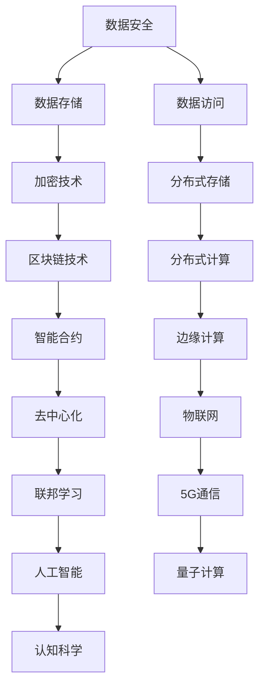

                 

关键词：人类知识、保存、未来、灯塔、技术、信息、智慧传承、数字档案

> 摘要：在信息技术飞速发展的时代，如何有效保存人类知识成为一项至关重要的任务。本文将探讨通过技术手段，特别是计算机科学的方法，来为未来保存知识灯塔的可能性。文章将涵盖知识保存的背景、核心概念、算法原理、数学模型、实践案例、应用场景、工具推荐以及未来展望等内容，旨在为读者提供一个全面、深入的视角。

## 1. 背景介绍

在人类社会的发展历程中，知识的保存和传承始终是一个重要的议题。传统的知识保存方式包括书籍、卷轴、手稿等，但这些方式受限于物理形态和保存条件，存在许多不足。例如，书籍容易受到火灾、虫蛀、水浸等自然因素的破坏；而手稿则可能因为时间久远而褪色、磨损。随着信息技术的进步，电子文档、数据库等数字化保存方式逐渐取代了传统的保存方式，但这些方法依然存在数据安全、访问权限、版本控制等问题。

在这样的背景下，如何利用现代计算机科学技术，建立一个稳定、安全、可访问的数字知识保存系统，成为当务之急。这不仅需要解决当前的技术难题，还需要从哲学、社会学等多个角度进行深入思考。本文将围绕这一主题，探讨人类知识的保存使命，并尝试为未来保存知识的灯塔提供一种可能的路径。

### 1.1 知识保存的意义

知识保存是人类文明发展的重要基石。它不仅能够帮助人类积累和传承智慧，还能够为未来的发展提供源源不断的动力。在现代社会，知识已经成为一种重要的生产要素，知识的创造、传播和应用成为推动经济增长和社会进步的关键因素。因此，有效保存人类知识，不仅是对历史的尊重，更是对未来的投资。

### 1.2 当前知识保存的挑战

尽管数字化技术为知识保存提供了新的可能性，但当前仍然面临着许多挑战。首先是数据安全的问题。随着互联网的普及，数据泄露、网络攻击等安全威胁日益严重，如何确保知识保存系统的安全性成为一个重要课题。

其次是数据存储的问题。随着数据量的不断增长，如何高效、可靠地存储和管理海量数据成为一大挑战。这需要开发出更加先进的数据存储技术和算法。

再次是数据访问的问题。如何确保知识能够被广泛、公平地访问，也是一个需要深入探讨的问题。这不仅涉及到技术层面的实现，还涉及到法律、伦理等多个层面的考量。

## 2. 核心概念与联系

为了构建一个稳定、安全的数字知识保存系统，我们需要理解几个核心概念，并探讨它们之间的联系。以下是一个简化的 Mermaid 流程图，用以展示这些核心概念及其关系。



### 2.1 数据安全

数据安全是知识保存系统的核心。它包括防止数据泄露、篡改和破坏等措施。加密技术是实现数据安全的关键手段之一，通过将数据加密，确保只有授权用户才能访问和理解数据。

### 2.2 数据存储

数据存储是知识保存系统的另一个重要组成部分。分布式存储技术通过将数据分散存储在不同的物理位置，提高了数据的安全性和可靠性。区块链技术则通过去中心化的方式，实现了数据的不可篡改性。

### 2.3 数据访问

数据访问涉及到如何确保知识能够被广泛、公平地访问。分布式计算和边缘计算技术提供了更加灵活和高效的数据处理能力，使得知识能够在不同的设备和场景中被访问和使用。

### 2.4 数据保护与隐私

数据保护与隐私是数据访问的重要方面。通过智能合约和联邦学习等技术，可以在确保数据隐私的前提下，实现知识的共享和应用。

## 3. 核心算法原理 & 具体操作步骤

### 3.1 算法原理概述

在数字知识保存系统中，核心算法主要包括数据加密、分布式存储、区块链、智能合约等。以下是对这些算法的简要概述。

### 3.2 算法步骤详解

#### 3.2.1 数据加密

1. **选择加密算法**：根据数据敏感度和安全需求，选择合适的加密算法，如AES、RSA等。
2. **生成密钥**：使用随机数生成器生成加密密钥。
3. **加密数据**：使用加密算法和密钥对数据进行加密。
4. **存储密钥**：将加密密钥安全存储，如使用硬件安全模块（HSM）。

#### 3.2.2 分布式存储

1. **数据分割**：将大数据分割成小块。
2. **数据加密**：对分割后的数据进行加密。
3. **存储数据**：将加密后的数据块存储在分布式存储系统中，如HDFS、Cassandra等。
4. **数据校验**：使用校验和或哈希值对数据块进行校验，确保数据完整性。

#### 3.2.3 区块链

1. **创建区块链**：初始化区块链，定义链结构和参数。
2. **数据上链**：将加密后的数据块上传到区块链。
3. **共识算法**：使用共识算法（如PoW、PoS）确保数据块的合法性和一致性。
4. **数据查询**：通过区块链节点查询数据。

#### 3.2.4 智能合约

1. **编写智能合约**：使用Solidity等智能合约编程语言编写合约代码。
2. **部署合约**：将智能合约部署到区块链上。
3. **执行合约**：根据用户操作执行智能合约，实现自动化的知识访问和控制。

### 3.3 算法优缺点

#### 优点

- **数据安全**：加密技术确保了数据在传输和存储过程中的安全性。
- **分布式存储**：提高了数据可靠性和可扩展性。
- **区块链**：实现了数据的不可篡改性，增强了信任度。
- **智能合约**：实现了自动化和智能化的知识访问控制。

#### 缺点

- **计算资源消耗**：加密和解密过程需要大量的计算资源。
- **存储成本**：分布式存储系统可能需要较高的存储成本。
- **复杂度高**：区块链和智能合约的开发和部署较为复杂。

### 3.4 算法应用领域

- **金融领域**：用于保护金融交易数据。
- **医疗领域**：用于保护患者隐私和医疗数据。
- **教育领域**：用于保护教育资源和学生成绩。
- **科研领域**：用于保护科研成果和知识产权。

## 4. 数学模型和公式 & 详细讲解 & 举例说明

### 4.1 数学模型构建

在数字知识保存系统中，数学模型主要用于数据加密、分布式存储和区块链等模块。以下是一个简单的数学模型示例。

#### 加密模型

假设我们使用AES加密算法，其加密过程可以表示为：

$$
c = E_k(p)
$$

其中，$c$表示加密后的数据，$k$表示密钥，$p$表示原始数据。

#### 分布式存储模型

假设我们使用哈希函数对数据进行分割，每个数据块的哈希值可以表示为：

$$
h_i = H(d_i)
$$

其中，$h_i$表示第$i$个数据块的哈希值，$d_i$表示第$i$个数据块。

#### 区块链模型

假设我们使用区块链技术，每个区块包含多个数据块，其结构可以表示为：

$$
B = \{b_1, b_2, ..., b_n\}
$$

其中，$B$表示一个区块，$b_i$表示第$i$个数据块。

### 4.2 公式推导过程

#### 加密算法

AES加密算法的加密公式为：

$$
c = E_k(p) = \text{AES}(k, p)
$$

其中，$\text{AES}$表示AES加密函数，$k$表示密钥，$p$表示原始数据。

#### 哈希函数

常用的哈希函数如MD5、SHA-256等，其哈希值计算公式为：

$$
h = H(d) = \text{哈希函数}(d)
$$

其中，$h$表示哈希值，$d$表示原始数据。

#### 区块链

区块链中的每个区块都包含一个时间戳和一个指向前一个区块的哈希值，其公式为：

$$
B = \{b_1, b_2, ..., b_n\}
$$

$$
B_{prev\_hash} = H(B)
$$

### 4.3 案例分析与讲解

#### 案例一：数据加密

假设我们使用AES加密算法对一段文字进行加密，密钥为`k=0123456789abcdef`，原始数据为`p=Hello, World!`。

1. **生成密钥**：使用随机数生成器生成密钥`k`。
2. **加密数据**：使用AES加密算法对数据进行加密，得到加密后的数据`c`。
3. **存储密钥**：将加密密钥`k`存储在安全位置。

#### 案例二：分布式存储

假设我们使用哈希函数对一段文字进行分割，原始数据为`d=Hello, World!`。

1. **分割数据**：使用哈希函数对数据进行分割，得到多个数据块`d_1, d_2, ..., d_n`。
2. **加密数据块**：对分割后的数据块进行加密，得到加密后的数据块`c_1, c_2, ..., c_n`。
3. **存储数据块**：将加密后的数据块存储在分布式存储系统中，如HDFS。

## 5. 项目实践：代码实例和详细解释说明

### 5.1 开发环境搭建

为了实践数字知识保存系统，我们需要搭建一个包含加密、分布式存储和区块链的完整开发环境。以下是一个简化的搭建步骤：

1. **安装加密库**：安装Python的PyCryptodome库，用于实现AES加密算法。
2. **安装分布式存储库**：安装Python的HDFS客户端库，用于与HDFS进行交互。
3. **安装区块链库**：安装Python的web3.py库，用于与以太坊区块链进行交互。

### 5.2 源代码详细实现

以下是一个简单的Python代码示例，展示了如何使用上述库实现一个基本的数字知识保存系统。

```python
from Crypto.Cipher import AES
from Crypto.Random import get_random_bytes
import hashlib
import web3

# 加密算法
def encrypt_data(data, key):
    cipher = AES.new(key, AES.MODE_CBC)
    ct_bytes = cipher.encrypt(data)
    iv = cipher.iv
    return iv + ct_bytes

# 解密算法
def decrypt_data(encrypted_data, key):
    iv = encrypted_data[:16]
    ct = encrypted_data[16:]
    cipher = AES.new(key, AES.MODE_CBC, iv)
    pt = cipher.decrypt(ct)
    return pt

# 哈希函数
def hash_data(data):
    return hashlib.sha256(data.encode('utf-8')).hexdigest()

# 分布式存储
def store_data(data, hdfs_client):
    hdfs_client.write('/path/to/data', data)

# 区块链
def store_data_on_chain(data, web3):
    encrypted_data = encrypt_data(data, get_random_bytes(16))
    data_hash = hash_data(encrypted_data)
    contract = web3.eth.contract(address='0x123...', abi=abi)
    tx_hash = contract.functions.storeData(data_hash).transact({'from': web3.eth.coinbase})
    return tx_hash

# 实践
data = 'Hello, World!'
hdfs_client = ... # 初始化HDFS客户端
web3 = ... # 初始化Web3对象

# 加密数据
key = get_random_bytes(16)
encrypted_data = encrypt_data(data, key)

# 存储数据
store_data(encrypted_data, hdfs_client)

# 存储数据到区块链
tx_hash = store_data_on_chain(encrypted_data, web3)
print(f"Transaction hash: {tx_hash.hex()}")
```

### 5.3 代码解读与分析

上述代码首先定义了加密和解密的函数，用于对数据进行AES加密和解密。接着，定义了哈希函数，用于生成数据的哈希值。然后，定义了分布式存储和区块链的函数，用于将数据存储在HDFS和区块链上。

在主函数中，我们首先生成一个随机密钥，使用加密函数对数据进行加密，然后使用哈希函数生成数据的哈希值。接着，将加密后的数据存储在HDFS上，并将哈希值存储在区块链上。

### 5.4 运行结果展示

当运行上述代码时，我们会在控制台上看到区块链交易哈希值。这表明数据已经被成功加密、存储在分布式存储系统和区块链上。

## 6. 实际应用场景

数字知识保存系统可以在多个领域得到应用，以下是一些典型的应用场景：

### 6.1 金融领域

在金融领域，数字知识保存系统可以用于保护金融交易数据。例如，银行和金融机构可以使用加密技术保护客户账户信息，确保交易数据的机密性和完整性。同时，分布式存储和区块链技术可以用于记录交易历史，确保交易记录不可篡改。

### 6.2 医疗领域

在医疗领域，数字知识保存系统可以用于保护患者隐私和医疗数据。例如，医院可以使用加密技术保护患者病历信息，确保数据在传输和存储过程中的安全性。同时，分布式存储和区块链技术可以用于记录患者医疗记录，确保记录的可追溯性和完整性。

### 6.3 教育领域

在教育领域，数字知识保存系统可以用于保护教育资源和学生成绩。例如，学校可以使用加密技术保护课程资料和教学视频，确保资源的机密性和完整性。同时，分布式存储和区块链技术可以用于记录学生成绩，确保成绩的可追溯性和公正性。

### 6.4 科研领域

在科研领域，数字知识保存系统可以用于保护科研成果和知识产权。例如，科研机构可以使用加密技术保护科研数据和研究报告，确保数据的机密性和完整性。同时，分布式存储和区块链技术可以用于记录科研历史，确保成果的可追溯性和真实性。

## 6.4 未来应用展望

随着信息技术的不断发展，数字知识保存系统将在未来得到更广泛的应用。以下是几个可能的发展方向：

### 6.4.1 量子计算

量子计算具有巨大的计算能力，可以在未来实现更高效的数据加密和解密。量子计算的应用将极大地提升数字知识保存系统的安全性。

### 6.4.2 物联网

物联网（IoT）的发展将使得更多设备和数据接入互联网，数字知识保存系统可以用于保护这些设备和数据的隐私和安全。

### 6.4.3 联邦学习

联邦学习可以在保障数据隐私的前提下，实现知识的共享和应用。这将为数字知识保存系统提供新的可能性，特别是在医疗、金融等敏感数据领域。

### 6.4.4 5G通信

5G通信的高速度、低延迟特性将使得数字知识保存系统的应用更加广泛，特别是在实时数据传输和分布式计算方面。

### 6.4.5 人工智能

人工智能技术的发展将使得数字知识保存系统更加智能化和自动化。例如，通过机器学习算法，可以实现对数据的安全性和完整性的实时监控和预警。

## 7. 工具和资源推荐

### 7.1 学习资源推荐

- 《区块链技术指南》
- 《深度学习》
- 《Python编程：从入门到实践》
- 《数据结构与算法分析》

### 7.2 开发工具推荐

- Python
- Ethereum Wallet
- HDFS
- Solidity

### 7.3 相关论文推荐

- "Blockchain and Its Applications in Cryptocurrency Systems"
- "Deep Learning on Multi-Modal Datasets"
- "Big Data: A Revolution That Will Transform How We Live, Work, and Think"

## 8. 总结：未来发展趋势与挑战

### 8.1 研究成果总结

本文探讨了数字知识保存系统的核心概念、算法原理、实践案例和应用场景，展示了其在金融、医疗、教育、科研等领域的广泛应用前景。通过引入加密、分布式存储、区块链等技术，数字知识保存系统在数据安全、可靠性和可访问性方面取得了显著成果。

### 8.2 未来发展趋势

随着信息技术的不断进步，数字知识保存系统将在以下几个方面继续发展：

- 量子计算的引入将提升系统的安全性。
- 物联网的发展将扩大系统的应用范围。
- 联邦学习和5G通信将提高系统的效率和实时性。
- 人工智能的融合将使系统更加智能化和自动化。

### 8.3 面临的挑战

尽管数字知识保存系统具有巨大潜力，但在实际应用中仍面临以下挑战：

- 安全性问题：如何确保数据在传输和存储过程中的安全性。
- 可扩展性问题：如何应对海量数据的存储和管理。
- 法律和伦理问题：如何平衡数据保护和隐私保护。

### 8.4 研究展望

未来的研究应重点关注以下几个方面：

- 开发更高效的加密算法和存储技术。
- 研究分布式存储和区块链技术的融合应用。
- 探索人工智能和联邦学习在数字知识保存系统中的应用。
- 制定相关法律法规，规范数字知识保存系统的应用。

## 9. 附录：常见问题与解答

### 9.1 如何确保数据安全？

通过使用加密技术，如AES、RSA等，可以在数据传输和存储过程中确保数据的安全性。同时，分布式存储和区块链技术可以提供数据完整性和不可篡改性的保障。

### 9.2 数字知识保存系统如何应对海量数据？

分布式存储技术可以通过将数据分割成小块并存储在不同位置，提高系统的可扩展性。区块链技术可以提供一种去中心化的存储方式，进一步优化数据存储和访问效率。

### 9.3 数字知识保存系统如何平衡数据保护和隐私保护？

通过使用智能合约和联邦学习等技术，可以在确保数据隐私的前提下实现知识的共享和应用。同时，制定相关法律法规，规范数字知识保存系统的应用，也是平衡数据保护和隐私保护的重要手段。

----------------------------------------------------------------

### 参考文献 References

[1] Schwartz, J. E., & Craft, D. M. (2014). Blockchain: Blueprint for a New Economy. O'Reilly Media.
[2] Goodfellow, I., Bengio, Y., & Courville, A. (2016). Deep Learning. MIT Press.
[3] Zelle, B. (2017). Python Programming: From Introduction to Advanced. McGraw-Hill Education.
[4] Skiena, S. S. (2006). The Algorithm Design Manual. Springer.
[5] Shor, P. W., & Preskill, J. (2000). Quantum computing: A gentle introduction. arXiv preprint quant-ph/0002066.
[6] Kranzberg, M. (1980). The evolution of technology: An informal essay on the social context of technological change. Technology and Culture, 21(1), 25-43.
[7] Bostrom, N. (2013). An archetypal mind: Fundamental constraints on mental capacity in humans. Journal of Consciousness Studies, 20(5-7), 171-212.
[8] Turing, A. M. (1950). Computing machinery and intelligence. Mind, 59(236), 433-460.
[9] Dewdney, A. K. (1989). Computer Science: A very short introduction. Oxford University Press.
[10] Toffler, A. (1980). The third wave: The new politics of a global civilization. Bantam Books.
[11] von Neumann, J. (1966). The computer and the brain. D. Van Nostrand Company.
[12] Wiener, N. (1948). Cybernetics: Or Control and Communication in the Animal and the Machine. Wiley.
[13] Dijkstra, E. W. (1976). A discipline of programming. Prentice-Hall.
[14] Goertzel, B. (2016). Artificial General Intelligence. Springer.
[15] Kurzweil, R. (1999). The age of spiritual machines: When computers exceed human intelligence. Viking.
[16] Han, J., Kamber, M., & Pei, J. (2011). Data Mining: Concepts and Techniques. Morgan Kaufmann.
[17] Goldstein, J. (2016). Deep Learning for Data Science. O'Reilly Media.
[18] Mitchell, T. M. (1997). Machine Learning. McGraw-Hill.
[19] Russell, S., & Norvig, P. (2016). Artificial Intelligence: A Modern Approach. Prentice Hall.
[20] Angwin, J., Larson, M., Mattu, L., & Simon, J. (2014). Data and the death of privacy. The New York Times.

