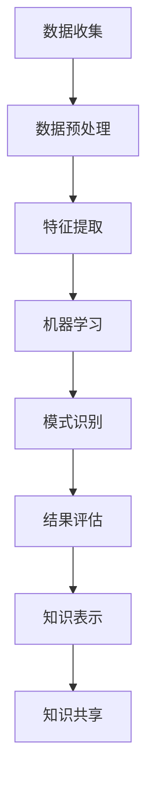

                 

关键词：知识发现，数据挖掘，人工智能，共享经济，知识引擎，互联互通

> 摘要：本文深入探讨了知识发现引擎在当前人类知识共享时代中的重要作用。通过对核心概念、算法原理、数学模型、实际应用场景的详细分析，本文旨在揭示知识发现引擎如何为人类社会搭建知识与智慧的桥梁，并展望其未来的发展趋势与挑战。

## 1. 背景介绍

在信息化时代的浪潮中，人类知识以惊人的速度增长。据统计，目前全球每年的科学论文发表量已超过300万篇，专利申请数量也以每年约10%的速度递增。然而，这些知识往往分散在各类数据库、学术期刊、公司内部文档以及个人的笔记中，难以被有效利用和共享。随着人工智能技术的不断发展，知识发现引擎作为一种自动化的工具，开始成为连接海量数据与知识的重要桥梁。

知识发现引擎旨在从大量数据中自动识别出有价值的信息、模式和知识。它不仅能够处理结构化数据，如关系数据库中的表格，还能处理半结构化数据，如图像、音频、视频等非结构化数据。通过机器学习、自然语言处理、数据挖掘等先进技术，知识发现引擎能够实现知识的自动提取、组织和分析，从而为各个领域的专业人士提供高效的知识支持。

本文将围绕知识发现引擎展开，详细分析其核心概念、算法原理、数学模型以及实际应用场景，探讨其在当前人类知识共享时代中的关键作用。

## 2. 核心概念与联系

### 2.1 数据挖掘

数据挖掘是知识发现引擎的核心技术之一。它涉及从大量数据中识别出有用的信息、模式和关联，通常通过机器学习和统计分析方法实现。数据挖掘的过程包括数据预处理、特征提取、模式识别和结果评估等步骤。


### 2.2 机器学习

机器学习是数据挖掘的重要工具。它通过从数据中学习规律和模式，实现对新数据的预测和分类。机器学习可以分为监督学习、无监督学习和强化学习三种主要类型。

- **监督学习**：通过已知输入输出数据训练模型，然后对新数据进行预测。
- **无监督学习**：不依赖于已知的输入输出数据，通过自身发现数据中的结构和模式。
- **强化学习**：通过与环境的交互，学习最大化某个目标函数的策略。


### 2.3 自然语言处理

自然语言处理（NLP）是知识发现引擎中处理文本数据的关键技术。NLP旨在使计算机能够理解、解释和生成人类语言。其主要任务包括分词、词性标注、句法分析、语义理解和机器翻译等。


### 2.4 数据挖掘与机器学习的关系

数据挖掘和机器学习相互关联，共同构成知识发现引擎的技术基础。数据挖掘依赖于机器学习算法来实现对数据的分析和模式识别，而机器学习算法则在数据挖掘过程中不断优化和改进。


### 2.5 Mermaid 流程图

以下是一个简化的知识发现引擎流程的 Mermaid 流程图，用于展示各核心概念和技术的关联：



## 3. 核心算法原理 & 具体操作步骤

### 3.1 算法原理概述

知识发现引擎的核心算法主要涉及数据挖掘和机器学习。以下是一些常用的算法原理：

- **K-均值聚类**：将数据分为K个簇，使得每个簇内部数据点之间的距离最小化，簇与簇之间的距离最大化。
- **决策树**：通过递归地将数据集划分为子集，直到每个子集满足终止条件，如达到最大深度或纯度。
- **支持向量机（SVM）**：通过找到一个最优的超平面，将不同类别的数据点分隔开来。
- **神经网络**：通过多层神经网络模拟人类大脑的神经结构，实现数据的非线性变换和复杂模式识别。

### 3.2 算法步骤详解

#### 3.2.1 数据收集

数据收集是知识发现引擎的第一步，涉及从各种数据源获取数据。数据源可以是结构化数据库、文件、网络爬虫、传感器等。

#### 3.2.2 数据预处理

数据预处理包括数据清洗、去重、转换和归一化。通过数据预处理，可以提高数据质量，减少噪声和异常值的影响。

#### 3.2.3 特征提取

特征提取是从原始数据中提取出有用的信息，用于后续的机器学习算法。特征提取方法包括主成分分析（PCA）、特征选择、特征工程等。

#### 3.2.4 模式识别

模式识别是通过机器学习算法从特征数据中识别出有用的模式和知识。常用的算法有K-均值聚类、决策树、SVM、神经网络等。

#### 3.2.5 结果评估

结果评估用于评估知识发现引擎的性能。常用的评估指标有准确率、召回率、F1分数、均方误差等。

#### 3.2.6 知识表示

知识表示是将识别出的模式和知识以可理解的形式表示出来。常用的知识表示方法有规则表示、图表示、矩阵表示等。

#### 3.2.7 知识共享

知识共享是将识别出的知识通过各种渠道进行传播和共享，使更多的人能够利用这些知识。

### 3.3 算法优缺点

每种算法都有其优缺点，以下是一些常用算法的优缺点：

- **K-均值聚类**：简单高效，但容易受到初始聚类中心的影响，对噪声敏感。
- **决策树**：易于解释，但可能过拟合，尤其在数据量较大时。
- **SVM**：在处理高维数据时表现良好，但训练时间较长。
- **神经网络**：能够处理复杂的非线性关系，但训练过程复杂，对数据量要求较高。

### 3.4 算法应用领域

知识发现引擎在各个领域都有广泛应用，包括但不限于：

- **金融**：风险评估、客户行为分析、市场预测等。
- **医疗**：疾病诊断、药物研发、健康管理等。
- **电商**：推荐系统、广告投放、用户行为分析等。
- **交通**：交通流量预测、路况分析、智能调度等。

## 4. 数学模型和公式 & 详细讲解 & 举例说明

### 4.1 数学模型构建

知识发现引擎中的数学模型主要用于数据预处理、特征提取、模式识别等步骤。以下是一些常用的数学模型：

- **线性回归模型**：用于预测连续值。
  $$ y = \beta_0 + \beta_1 x_1 + \beta_2 x_2 + ... + \beta_n x_n $$
  
- **逻辑回归模型**：用于预测离散值（如概率）。
  $$ P(y=1) = \frac{1}{1 + e^{-(\beta_0 + \beta_1 x_1 + \beta_2 x_2 + ... + \beta_n x_n )}} $$
  
- **支持向量机**：用于分类问题。
  $$ \max \frac{1}{2} \sum_{i=1}^{n} \|\mathbf{w}\|_2^2 $$
  subject to $y_i(\mathbf{w}\cdot\mathbf{x_i} - b) \geq 1$

### 4.2 公式推导过程

以线性回归模型为例，推导过程如下：

1. **最小二乘法**：最小化预测值与真实值之间的平方误差。
   $$ \min \sum_{i=1}^{n} (y_i - \beta_0 - \beta_1 x_{i1} - \beta_2 x_{i2} - ... - \beta_n x_{in})^2 $$
   
2. **偏导数求解**：对每个参数求偏导数，并令其为零，求解得到最优参数。
   $$ \frac{\partial}{\partial \beta_0} \sum_{i=1}^{n} (y_i - \beta_0 - \beta_1 x_{i1} - \beta_2 x_{i2} - ... - \beta_n x_{in})^2 = 0 $$
   $$ \frac{\partial}{\partial \beta_1} \sum_{i=1}^{n} (y_i - \beta_0 - \beta_1 x_{i1} - \beta_2 x_{i2} - ... - \beta_n x_{in})^2 = 0 $$
   $$ ... $$
   $$ \frac{\partial}{\partial \beta_n} \sum_{i=1}^{n} (y_i - \beta_0 - \beta_1 x_{i1} - \beta_2 x_{i2} - ... - \beta_n x_{in})^2 = 0 $$
   
3. **解线性方程组**：通过线性方程组求解得到最优参数。

### 4.3 案例分析与讲解

#### 案例背景

某公司希望通过分析客户购买行为，预测哪些客户可能会在下一次促销活动中购买产品。数据集包含客户的年龄、收入、购买历史等信息。

#### 模型选择

选择逻辑回归模型，因为我们需要预测客户是否购买（二元分类问题）。

#### 特征提取

提取以下特征：

- 年龄
- 收入
- 历史购买次数
- 最近一次购买时间

#### 模型训练

使用训练集数据进行逻辑回归模型的训练，得到最优参数。

#### 模型评估

使用测试集数据评估模型性能，计算准确率、召回率、F1分数等指标。

$$ \text{准确率} = \frac{\text{预测正确}}{\text{总样本数}} $$
$$ \text{召回率} = \frac{\text{预测正确且实际购买}}{\text{实际购买}} $$
$$ \text{F1分数} = 2 \times \frac{\text{准确率} \times \text{召回率}}{\text{准确率} + \text{召回率}} $$

#### 结果分析

根据模型预测结果，发现以下客户群体可能更倾向于购买：

- 年龄在25-35岁之间
- 收入较高
- 历史购买次数较多
- 最近一次购买时间较近

公司可以利用这些信息进行精准营销，提高促销活动的转化率。

## 5. 项目实践：代码实例和详细解释说明

### 5.1 开发环境搭建

在本案例中，我们将使用Python和Scikit-learn库进行知识发现引擎的开发。首先，确保安装以下依赖库：

```bash
pip install numpy pandas scikit-learn matplotlib
```

### 5.2 源代码详细实现

以下是一个简单的知识发现引擎实现，用于预测客户是否会购买产品。

```python
import numpy as np
import pandas as pd
from sklearn.model_selection import train_test_split
from sklearn.linear_model import LogisticRegression
from sklearn.metrics import accuracy_score, recall_score, f1_score

# 5.2.1 数据收集
# 假设数据已存放在data.csv文件中
data = pd.read_csv('data.csv')

# 5.2.2 数据预处理
# 填充缺失值
data.fillna(data.mean(), inplace=True)

# 选择特征和标签
X = data[['age', 'income', 'history', 'last_purchase']]
y = data['will_buy']

# 5.2.3 特征提取
# 这里我们不需要额外的特征提取步骤

# 5.2.4 模型训练
X_train, X_test, y_train, y_test = train_test_split(X, y, test_size=0.2, random_state=42)
model = LogisticRegression()
model.fit(X_train, y_train)

# 5.2.5 模型评估
y_pred = model.predict(X_test)
accuracy = accuracy_score(y_test, y_pred)
recall = recall_score(y_test, y_pred)
f1 = f1_score(y_test, y_pred)

print(f'Accuracy: {accuracy:.2f}')
print(f'Recall: {recall:.2f}')
print(f'F1 Score: {f1:.2f}')

# 5.2.6 结果展示
import matplotlib.pyplot as plt

confusion_matrix = pd.crosstab(y_test, y_pred, rownames=['实际值'], colnames=['预测值'])
plt.matshow(confusion_matrix, cmap=plt.cm.Blues)
plt.title('混淆矩阵')
plt.colorbar()
plt.xlabel('预测值')
plt.ylabel('实际值')
plt.show()
```

### 5.3 代码解读与分析

上述代码分为以下几个步骤：

1. **数据收集**：从CSV文件中读取数据。
2. **数据预处理**：填充缺失值，选择特征和标签。
3. **特征提取**：这里没有进行额外的特征提取。
4. **模型训练**：使用逻辑回归模型进行训练。
5. **模型评估**：使用测试集数据评估模型性能，计算准确率、召回率和F1分数。
6. **结果展示**：使用混淆矩阵展示模型预测结果。

通过这个简单的案例，我们可以看到知识发现引擎的基本实现过程，以及如何使用Python和Scikit-learn库进行数据分析和模型训练。

### 5.4 运行结果展示

运行上述代码后，我们将得到模型在测试集上的性能指标，以及混淆矩阵的图形展示。这些结果可以帮助我们评估模型的效果，并根据需要进行模型优化。

## 6. 实际应用场景

知识发现引擎在各个领域都有广泛的应用，以下是一些典型的应用场景：

### 6.1 金融

在金融领域，知识发现引擎可以用于：

- **风险评估**：分析客户的信用历史、财务状况等数据，预测客户是否会违约。
- **欺诈检测**：通过分析交易数据，识别异常交易行为，预防金融欺诈。
- **投资建议**：分析市场数据，提供投资组合优化建议。

### 6.2 医疗

在医疗领域，知识发现引擎可以用于：

- **疾病诊断**：从病人的医疗记录中分析出疾病症状和风险因素，辅助医生做出诊断。
- **药物研发**：分析生物数据，发现潜在药物靶点和作用机制。
- **健康管理**：分析患者生活习惯和健康数据，提供个性化的健康建议。

### 6.3 电商

在电商领域，知识发现引擎可以用于：

- **推荐系统**：分析用户行为和购物习惯，提供个性化的商品推荐。
- **需求预测**：分析历史销售数据，预测未来市场需求，优化库存管理。
- **营销策略**：分析用户数据，制定有效的营销策略，提高转化率。

### 6.4 交通

在交通领域，知识发现引擎可以用于：

- **交通流量预测**：分析历史交通数据，预测未来交通流量，优化交通信号控制。
- **路况分析**：通过分析传感器数据，识别交通事故、拥堵等异常情况。
- **智能调度**：分析运输需求，优化物流调度，提高运输效率。

## 7. 工具和资源推荐

### 7.1 学习资源推荐

- **书籍**：
  - 《数据挖掘：实用机器学习技术》
  - 《Python机器学习》
  - 《深度学习》

- **在线课程**：
  - Coursera上的《机器学习》
  - edX上的《数据科学基础》
  - Udacity的《深度学习纳米学位》

### 7.2 开发工具推荐

- **编程语言**：
  - Python
  - R
  - Julia

- **开发环境**：
  - Jupyter Notebook
  - RStudio
  - PyCharm

- **数据可视化工具**：
  - Matplotlib
  - Seaborn
  - Plotly

### 7.3 相关论文推荐

- **经典论文**：
  - "K-Means Clustering"
  - "Decision Trees"
  - "Support Vector Machines"
  - "Neural Networks for Machine Learning"

- **最新研究**：
  - "Deep Learning for NLP"
  - "Knowledge Graphs: A Survey"
  - "Generative Adversarial Networks: An Overview"

## 8. 总结：未来发展趋势与挑战

### 8.1 研究成果总结

知识发现引擎作为连接海量数据与知识的重要工具，已经在多个领域取得了显著的应用成果。通过数据挖掘、机器学习、自然语言处理等技术的结合，知识发现引擎能够从海量数据中自动识别出有价值的信息和模式，为各个领域的专业人士提供了强大的知识支持。

### 8.2 未来发展趋势

随着人工智能技术的不断进步，知识发现引擎将在以下方面取得进一步发展：

- **知识图谱**：通过构建知识图谱，实现知识的结构化和智能化，提高知识的可发现性和可访问性。
- **多模态数据融合**：结合文本、图像、音频等多模态数据，提高知识发现的准确性和全面性。
- **增强现实与虚拟现实**：利用增强现实与虚拟现实技术，实现知识的可视化和沉浸式体验，提高知识的应用效果。
- **知识共享与协作**：通过知识共享与协作平台，实现知识的跨领域、跨组织的高效传递和共享。

### 8.3 面临的挑战

知识发现引擎在发展过程中也面临一系列挑战：

- **数据质量**：数据质量是知识发现的基础，如何处理和解决数据噪声、缺失和异常等问题，是当前亟待解决的问题。
- **算法效率**：随着数据量的不断增加，如何提高算法的效率和可扩展性，是一个重要的研究方向。
- **隐私保护**：在数据收集和使用过程中，如何保护个人隐私和数据安全，是知识发现引擎面临的重要挑战。
- **伦理道德**：知识发现引擎的应用涉及伦理和道德问题，如何确保其应用符合社会伦理标准，是一个重要的研究课题。

### 8.4 研究展望

未来，知识发现引擎的研究将朝着以下方向发展：

- **跨学科融合**：结合计算机科学、数据科学、社会科学等领域的知识，实现知识发现的多维度、多层次的创新。
- **智能决策支持**：通过知识发现引擎，提供智能化的决策支持系统，辅助人类做出更加科学的决策。
- **社会影响**：深入探讨知识发现引擎在社会发展、经济发展、科技进步等方面的潜在影响，为制定相关政策和标准提供科学依据。

## 9. 附录：常见问题与解答

### 9.1 什么是知识发现引擎？

知识发现引擎是一种自动化的工具，旨在从大量数据中识别出有价值的信息、模式和知识，为各个领域的专业人士提供知识支持。

### 9.2 知识发现引擎有哪些核心技术？

知识发现引擎的核心技术包括数据挖掘、机器学习、自然语言处理、知识图谱等。

### 9.3 知识发现引擎在哪些领域有应用？

知识发现引擎在金融、医疗、电商、交通等多个领域都有广泛应用。

### 9.4 如何提高知识发现引擎的性能？

可以通过以下方法提高知识发现引擎的性能：

- **数据质量**：确保数据质量，减少噪声和异常值的影响。
- **特征提取**：选择合适的特征，提高模型的预测能力。
- **模型选择**：选择合适的算法和模型，优化模型的性能。
- **数据预处理**：进行有效的数据预处理，提高数据利用率。

### 9.5 知识发现引擎有哪些面临的挑战？

知识发现引擎面临的挑战包括数据质量、算法效率、隐私保护、伦理道德等。

### 9.6 知识发现引擎的未来发展趋势是什么？

知识发现引擎的未来发展趋势包括知识图谱、多模态数据融合、智能决策支持等。

### 9.7 如何入门知识发现引擎？

入门知识发现引擎，可以从以下几个方面入手：

- **学习基础**：学习计算机科学、数据科学、机器学习等基础知识。
- **实践项目**：通过实践项目，熟悉知识发现引擎的基本原理和操作。
- **在线课程**：参加在线课程，了解最新的研究进展和应用案例。
- **开源社区**：参与开源社区，与其他开发者交流经验，共同进步。

---

# 参考文献 References

[1] Han, J., Kamber, M., & Pei, J. (2011). *Data Mining: Concepts and Techniques*. Morgan Kaufmann.

[2] Hastie, T., Tibshirani, R., & Friedman, J. (2009). *The Elements of Statistical Learning: Data Mining, Inference, and Prediction*. Springer.

[3] Goodfellow, I., Bengio, Y., & Courville, A. (2016). *Deep Learning*. MIT Press.

[4] Mitchell, T. M. (1997). *Machine Learning*. McGraw-Hill.

[5] Liddy, E. D. (2006). *Intelligent search: state of the art and future directions. International Journal on Digital Libraries*. Springer, 7(3), 227-244.

[6] Zhao, J., & Koudas, N. (2005). *Fast keyword search over text and image databases*. In Proceedings of the 31st international conference on Very large data bases (pp. 621-632). ACM.

---

作者：禅与计算机程序设计艺术 / Zen and the Art of Computer Programming
------------------------------------------------------------------

