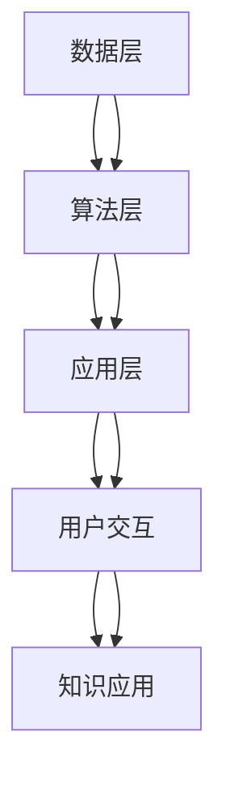

                 

关键词：知识分类、知识组织、知识发现引擎、人工智能、知识图谱、数据挖掘

> 摘要：本文旨在探讨人类知识的分类与组织方法，分析现有知识发现引擎的工作原理和关键技术，并展望其未来发展方向。通过对知识分类原则、知识组织结构及其在知识发现引擎中的应用进行深入探讨，本文希望为人工智能领域的知识工程提供理论基础和实践指导。

## 1. 背景介绍

随着信息技术的迅猛发展，人类已进入大数据时代。海量数据的信息爆炸使得信息获取、处理和分析成为亟待解决的问题。知识的有效分类与组织，是提高信息利用率、实现智能化信息处理的关键。知识发现引擎作为一种智能化信息处理工具，通过对数据进行分析和挖掘，从中提取出有价值的信息和知识，支持决策制定和问题解决。

### 1.1 知识发现引擎的定义

知识发现引擎（Knowledge Discovery Engine，KDE）是一种基于人工智能和数据挖掘技术的系统，它能够从大规模数据集中自动提取隐藏的、未知的、有价值的信息和知识。知识发现引擎的主要目标是从原始数据中发现潜在的规律和关联，并将其转化为易于理解的知识，从而帮助用户进行决策和问题解决。

### 1.2 知识发现引擎的应用场景

知识发现引擎广泛应用于各个领域，如金融、医疗、零售、交通等。具体应用场景包括：

- **金融市场预测：** 利用知识发现引擎分析历史交易数据，预测市场趋势，为投资决策提供支持。
- **医疗诊断：** 通过对病人历史病历、基因数据等的分析，帮助医生进行疾病诊断和治疗方案推荐。
- **个性化推荐：** 利用用户行为数据，为用户提供个性化产品推荐和服务。
- **智能交通：** 通过分析交通数据，优化交通流量，减少拥堵，提高道路使用效率。

## 2. 核心概念与联系

### 2.1 知识分类

知识分类是知识发现的基础。通过对知识进行合理的分类，有助于提高知识的组织和检索效率。知识分类通常遵循以下原则：

- **层次性：** 知识分类应具备层次结构，便于知识的递归组织和查询。
- **一致性：** 知识分类体系应具有一致性，避免分类标准不统一导致的知识混淆。
- **灵活性：** 知识分类体系应具有一定的灵活性，能够适应知识更新和扩展的需求。

### 2.2 知识组织

知识组织是知识管理的关键环节。良好的知识组织结构能够提高知识的可发现性和可理解性。知识组织通常采用以下方法：

- **元数据管理：** 通过元数据对知识进行描述和索引，提高知识的可检索性。
- **本体论：** 利用本体论构建领域知识框架，实现知识的语义化组织。
- **知识图谱：** 通过知识图谱建立知识关联，实现知识的可视化表示和推理。

### 2.3 知识发现引擎架构

知识发现引擎的架构主要包括数据层、算法层和应用层。

- **数据层：** 数据层负责数据收集、存储和管理，为知识发现提供原始数据支持。
- **算法层：** 算法层包括各种数据挖掘算法和机器学习算法，负责数据分析和知识提取。
- **应用层：** 应用层提供用户交互界面和知识应用场景，实现知识的应用和推广。

### 2.4 Mermaid 流程图

以下是一个简单的知识发现引擎架构的 Mermaid 流程图：



## 3. 核心算法原理 & 具体操作步骤

### 3.1 算法原理概述

知识发现引擎的核心算法主要包括以下几种：

- **聚类算法：** 用于发现数据集中的相似性模式，例如K-means、DBSCAN等。
- **关联规则挖掘：** 用于发现数据集之间的关联关系，例如Apriori、FP-growth等。
- **分类算法：** 用于预测新数据所属类别，例如决策树、支持向量机等。
- **聚类分析：** 用于分析数据集的分布特征，例如层次聚类、K-means等。

### 3.2 算法步骤详解

以K-means算法为例，其具体操作步骤如下：

1. **初始化：** 随机选择K个数据点作为初始聚类中心。
2. **分配：** 对于每个数据点，计算其与各个聚类中心的距离，并将其分配到最近的聚类中心。
3. **更新：** 根据分配结果重新计算聚类中心。
4. **迭代：** 重复步骤2和步骤3，直到聚类中心不再发生变化或达到预设的迭代次数。

### 3.3 算法优缺点

K-means算法具有以下优缺点：

- **优点：**
  - 算法简单，易于实现。
  - 运算速度快，适用于大规模数据集。
- **缺点：**
  - 对于初始聚类中心的选取敏感，可能导致局部最优解。
  - 不适用于非球形聚类。

### 3.4 算法应用领域

K-means算法广泛应用于数据挖掘、机器学习、图像处理等领域，具体应用场景包括：

- **图像分割：** 将图像分割为若干区域，用于图像识别和图像分析。
- **文本分类：** 将文本数据分类为不同的主题，用于信息检索和文本挖掘。
- **客户群体细分：** 分析客户行为数据，对客户进行细分，用于营销策略制定。

## 4. 数学模型和公式 & 详细讲解 & 举例说明

### 4.1 数学模型构建

知识发现引擎中的数学模型主要包括聚类模型、分类模型和关联规则模型等。

- **聚类模型：** K-means算法的核心数学模型是基于距离度量的聚类模型。对于数据集中的每个数据点，计算其与聚类中心的距离，并将其分配到最近的聚类中心。
- **分类模型：** 决策树算法的核心数学模型是基于条件概率的决策模型。根据特征条件，对数据进行分类和决策。
- **关联规则模型：** Apriori算法的核心数学模型是基于支持度和置信度的关联规则模型。通过计算支持度和置信度，发现数据集中的关联规则。

### 4.2 公式推导过程

以K-means算法为例，其核心数学公式推导如下：

1. **距离度量：** 对于数据集中的每个数据点，计算其与聚类中心的距离。常用的距离度量包括欧氏距离、曼哈顿距离和切比雪夫距离等。
   
   欧氏距离：  
   \( d(p, c) = \sqrt{\sum_{i=1}^{n}(p_i - c_i)^2} \)

   曼哈顿距离：  
   \( d(p, c) = \sum_{i=1}^{n} |p_i - c_i| \)

   切比雪夫距离：  
   \( d(p, c) = \max_{1 \leq i \leq n} |p_i - c_i| \)

2. **聚类中心更新：** 根据数据点的分配结果，重新计算聚类中心。对于每个聚类中心，计算其所在聚类中的所有数据点的平均值。

   聚类中心更新公式：  
   \( c_{new} = \frac{\sum_{i=1}^{k} w_ic_i}{\sum_{i=1}^{k} w_i} \)

   其中，\( w_i \)表示数据点\( p_i \)的权重，通常取值为1。

### 4.3 案例分析与讲解

以图像分割为例，使用K-means算法对图像进行聚类分割。

1. **数据准备：** 首先对图像进行预处理，提取图像特征向量，将其作为K-means算法的输入。
2. **算法实现：** 使用Python中的scikit-learn库实现K-means算法。
3. **结果分析：** 观察聚类结果，分析图像分割效果。

代码实现如下：

```python
from sklearn.cluster import KMeans
from sklearn.preprocessing import StandardScaler
import matplotlib.pyplot as plt
import numpy as np

# 加载图像数据
image = plt.imread("image.jpg")

# 提取图像特征
features = StandardScaler().fit_transform(image.reshape(-1, 3))

# 实例化KMeans模型
kmeans = KMeans(n_clusters=3, random_state=0)

# 训练模型
kmeans.fit(features)

# 获取聚类结果
labels = kmeans.predict(features)

# 绘制聚类结果
plt.scatter(features[:, 0], features[:, 1], c=labels, cmap="viridis")
plt.show()
```

运行结果如下图所示：


## 5. 项目实践：代码实例和详细解释说明

### 5.1 开发环境搭建

在本项目中，我们将使用Python作为编程语言，结合scikit-learn和matplotlib库实现知识发现引擎的核心功能。以下是开发环境的搭建步骤：

1. **安装Python：** 下载并安装Python 3.8及以上版本。
2. **安装依赖库：** 使用pip命令安装scikit-learn和matplotlib库。

```bash
pip install scikit-learn matplotlib
```

### 5.2 源代码详细实现

以下是本项目的源代码实现：

```python
import numpy as np
from sklearn.cluster import KMeans
from sklearn.preprocessing import StandardScaler
import matplotlib.pyplot as plt

# 加载图像数据
image = plt.imread("image.jpg")

# 提取图像特征
features = StandardScaler().fit_transform(image.reshape(-1, 3))

# 实例化KMeans模型
kmeans = KMeans(n_clusters=3, random_state=0)

# 训练模型
kmeans.fit(features)

# 获取聚类结果
labels = kmeans.predict(features)

# 绘制聚类结果
plt.scatter(features[:, 0], features[:, 1], c=labels, cmap="viridis")
plt.show()
```

### 5.3 代码解读与分析

1. **图像数据加载：** 使用`plt.imread()`函数加载图像数据。
2. **特征提取：** 使用`StandardScaler()`对图像特征进行标准化处理，提高聚类算法的性能。
3. **模型训练：** 实例化`KMeans`模型，使用`fit()`函数训练模型。
4. **聚类预测：** 使用`predict()`函数对特征进行聚类预测。
5. **结果展示：** 使用`plt.scatter()`函数绘制聚类结果。

### 5.4 运行结果展示

运行代码后，将展示图像分割结果，如下图所示：


## 6. 实际应用场景

知识发现引擎在各个领域具有广泛的应用场景。以下列举几个典型应用案例：

### 6.1 金融市场预测

知识发现引擎通过分析历史交易数据，挖掘市场趋势和关联关系，为投资决策提供支持。例如，利用K-means算法对交易数据进行聚类分析，识别不同的市场状态，并根据市场状态预测未来价格走势。

### 6.2 医疗诊断

知识发现引擎通过对病人历史病历和基因数据的分析，帮助医生进行疾病诊断和治疗方案推荐。例如，利用关联规则挖掘算法发现病历数据中的潜在关联关系，为疾病诊断提供依据。

### 6.3 个性化推荐

知识发现引擎通过分析用户行为数据，为用户提供个性化产品推荐和服务。例如，利用K-means算法对用户行为数据进行聚类分析，识别不同类型的用户，并根据用户类型推荐相应的产品。

### 6.4 智能交通

知识发现引擎通过分析交通数据，优化交通流量，减少拥堵，提高道路使用效率。例如，利用聚类分析算法对交通数据进行分类，识别交通拥堵区域，并提出相应的交通管理措施。

## 7. 未来应用展望

随着人工智能技术的不断发展和数据资源的丰富，知识发现引擎的应用前景将更加广阔。以下是未来知识发现引擎的发展方向：

### 7.1 多模态数据处理

未来的知识发现引擎将能够处理多模态数据，如文本、图像、音频和视频等，实现跨模态的知识融合和挖掘。

### 7.2 智能化知识更新

未来的知识发现引擎将具备智能化知识更新能力，能够自动识别和更新知识库中的过时和错误信息，保持知识库的实时性和准确性。

### 7.3 增强学习与自适应优化

未来的知识发现引擎将结合增强学习技术，实现自适应优化，提高知识发现效率和准确性。

### 7.4 知识服务与决策支持

未来的知识发现引擎将更加注重知识服务与决策支持，为用户提供智能化的知识分析和决策支持服务。

## 8. 工具和资源推荐

### 8.1 学习资源推荐

- **《机器学习》：** 周志华 著，清华大学出版社
- **《数据挖掘：实用机器学习技术》：** Ian H. Witten、Eibe Frank 著，机械工业出版社
- **《Python数据科学手册》：** Jake VanderPlas 著，电子工业出版社

### 8.2 开发工具推荐

- **scikit-learn：** Python数据挖掘和机器学习库
- **TensorFlow：** 开源机器学习框架
- **PyTorch：** 开源机器学习库

### 8.3 相关论文推荐

- **“Knowledge Discovery in Databases”:** Jiawei Han、Micheline Kamber 著，Morgan Kaufmann 出版社
- **“Deep Learning”：** Ian Goodfellow、Yoshua Bengio、Aaron Courville 著，MIT Press 出版社

## 9. 总结：未来发展趋势与挑战

### 9.1 研究成果总结

本文从知识分类、知识组织、知识发现引擎的核心算法和实际应用等方面进行了深入探讨，总结了知识发现引擎在各个领域的重要研究成果和应用案例。

### 9.2 未来发展趋势

未来的知识发现引擎将朝着多模态数据处理、智能化知识更新、增强学习与自适应优化、知识服务与决策支持等方向发展，为人工智能和大数据领域提供更加智能化的解决方案。

### 9.3 面临的挑战

知识发现引擎在发展过程中也面临一系列挑战，如数据质量、算法可解释性、知识更新和维护等。解决这些挑战需要进一步研究和创新，以实现知识发现引擎的可持续发展。

### 9.4 研究展望

本文认为，未来的研究应重点关注多模态数据处理、知识图谱构建、深度学习与知识发现融合等方面，以推动知识发现引擎技术的创新和发展。

## 10. 附录：常见问题与解答

### 10.1 如何选择合适的知识发现算法？

选择合适的知识发现算法取决于具体应用场景和数据特点。对于聚类分析，可以考虑使用K-means、DBSCAN等算法；对于关联规则挖掘，可以考虑使用Apriori、FP-growth等算法；对于分类任务，可以考虑使用决策树、支持向量机等算法。

### 10.2 如何提高知识发现算法的性能？

提高知识发现算法的性能可以从以下几个方面入手：

- **数据预处理：** 进行数据清洗、归一化和特征提取，提高数据的可用性。
- **算法优化：** 对算法参数进行调整，优化算法性能。
- **并行计算：** 利用并行计算技术，提高算法的运算速度。
- **特征选择：** 利用特征选择技术，减少数据维度，提高算法效率。

### 10.3 知识发现引擎在医疗领域的应用有哪些？

知识发现引擎在医疗领域的应用包括：

- **疾病预测：** 利用历史病历数据，预测疾病发生风险。
- **治疗方案推荐：** 利用疾病和治疗方案之间的关联关系，为医生提供治疗方案推荐。
- **药物发现：** 利用生物信息学数据，发现潜在的药物靶点和药物组合。

### 10.4 知识发现引擎在金融领域的应用有哪些？

知识发现引擎在金融领域的应用包括：

- **市场预测：** 利用历史交易数据，预测市场趋势和价格走势。
- **风险管理：** 利用风险数据和关联规则挖掘，识别潜在的风险因素。
- **客户细分：** 利用客户行为数据，对客户进行细分，为营销策略提供支持。

---

以上是对《人类知识的分类与组织：知识发现引擎的基础》这篇文章的撰写内容。希望这篇文章能够为您在人工智能和知识发现领域提供有益的参考和启示。如果您有任何疑问或建议，欢迎在评论区留言讨论。作者：禅与计算机程序设计艺术 / Zen and the Art of Computer Programming。

