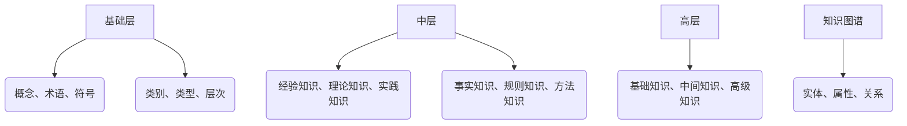
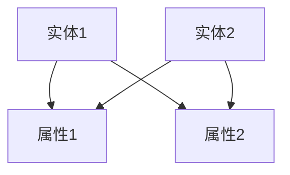

                 

关键词：知识分类体系，信息架构，认知科学，知识图谱，结构化数据，机器学习

> 摘要：本文探讨了人类知识的分类体系，从认知科学的角度分析了知识结构的本质，并介绍了知识图谱在信息组织中的应用。通过阐述知识分类的原则和方法，探讨了知识体系构建的挑战与机遇，为未来的知识管理和人工智能发展提供了新的思路。

## 1. 背景介绍

人类知识是人类智慧和文明的重要体现，其分类与组织对于知识的传播、学习和创新具有重要意义。自古以来，学者们就试图构建一个系统的知识分类体系，以便更好地理解世界和推动科学进步。从亚里士多德的十大范畴，到图书馆学的分类法，再到现代的互联网信息架构，知识分类体系的演变反映了人类对知识的认知和理解的不断深化。

随着计算机技术和信息科学的快速发展，知识分类体系面临着前所未有的挑战和机遇。传统的分类方法已经无法满足海量数据的组织和处理需求，知识图谱作为一种新型的知识组织形式，逐渐成为研究热点。知识图谱通过实体、属性和关系的图形化表示，为知识的结构化提供了新的思路，也为人工智能的应用带来了新的可能性。

## 2. 核心概念与联系

### 2.1 知识分类的基本概念

知识分类是指根据知识的性质、特征或用途，将其划分为不同的类别或层次。常见的知识分类方法包括：

- 按照知识来源分类：如经验知识、理论知识和实践知识。
- 按照知识类型分类：如事实知识、规则知识和方法知识。
- 按照知识层次分类：如基础知识、中间知识和高级知识。

### 2.2 知识分类体系的架构

一个完整的知识分类体系通常包括以下几个层次：

1. **基础层**：包括基本概念、术语和符号等，是知识分类体系的基础。
2. **中层**：将基础层的知识按照某种原则进行分类，形成多个类别。
3. **高层**：对中层的各类别进行进一步的抽象和概括，形成更为宏观的知识体系。

### 2.3 知识图谱的概念与应用

知识图谱（Knowledge Graph）是一种基于语义网络的知识表示方法，通过实体、属性和关系的图形化表示，将知识结构化、图形化。知识图谱的核心是实体和关系，通过实体之间的关联，可以实现对知识的推理和扩展。

知识图谱在信息检索、自然语言处理、推荐系统等领域有着广泛的应用。例如，Google 的搜索引擎就采用了知识图谱技术，通过理解用户查询的语义，提供更加精准的搜索结果。

### 2.4 Mermaid 流程图



## 3. 核心算法原理 & 具体操作步骤

### 3.1 算法原理概述

知识分类体系构建的核心算法包括：

- **聚类算法**：用于对无标签的数据进行自动分类，常用的聚类算法有 K-Means、DBSCAN 等。
- **层次分析法**：用于将高维数据按照某种原则进行分层，形成知识分类体系。
- **语义网络构建算法**：用于构建知识图谱，常用的算法有基于词频统计的算法、基于语义分析的算法等。

### 3.2 算法步骤详解

1. **数据预处理**：对原始数据进行清洗、去噪和处理，提取出有用的信息。
2. **特征提取**：将原始数据转换为特征向量，为后续的算法提供输入。
3. **聚类分析**：使用聚类算法对特征向量进行分类，形成初步的知识分类体系。
4. **层次分析**：对聚类结果进行层次化处理，形成更加宏观的知识分类体系。
5. **知识图谱构建**：使用语义网络构建算法，将知识分类体系转换为知识图谱。

### 3.3 算法优缺点

- **优点**：
  - 能够对大规模数据进行高效处理，自动生成知识分类体系。
  - 能够通过知识图谱实现对知识的推理和扩展。
- **缺点**：
  - 对数据质量和特征提取有较高要求，否则可能影响分类效果。
  - 算法的自适应性和可解释性有待提高。

### 3.4 算法应用领域

知识分类体系构建算法在多个领域有着广泛的应用，如：

- **信息检索**：用于对海量文档进行分类，提高搜索效率。
- **自然语言处理**：用于对文本数据进行语义分析，提高机器理解能力。
- **推荐系统**：用于对用户行为进行分类，提供个性化推荐。

## 4. 数学模型和公式 & 详细讲解 & 举例说明

### 4.1 数学模型构建

知识分类体系的构建涉及多个数学模型，其中主要包括：

- **聚类模型**：用于对特征向量进行分类，常用的模型有 K-Means、DBSCAN 等。
- **层次模型**：用于对聚类结果进行层次化处理，常用的模型有层次分析法、决策树等。
- **语义网络模型**：用于构建知识图谱，常用的模型有图论模型、语义网络模型等。

### 4.2 公式推导过程

以 K-Means 聚类算法为例，其核心公式如下：

$$
C = \{C_1, C_2, ..., C_k\}
$$

其中，$C$ 表示聚类结果，$C_i$ 表示第 $i$ 个聚类中心，$k$ 表示聚类个数。

对于每个数据点 $x$，其属于哪个聚类中心可以通过以下公式计算：

$$
C_i(x) = \min_{j=1}^k \sum_{i=1}^n (x_i - c_{ij})^2
$$

其中，$c_{ij}$ 表示第 $i$ 个数据点和第 $j$ 个聚类中心之间的距离。

### 4.3 案例分析与讲解

假设我们有一组数据，需要使用 K-Means 算法对其进行分类。首先，我们需要确定聚类个数 $k$，然后随机初始化 $k$ 个聚类中心。接下来，我们计算每个数据点到聚类中心的距离，并根据距离将数据点分配到相应的聚类中心。通过多次迭代，聚类中心会逐渐收敛到最优位置，此时分类结果也趋于稳定。

下面是一个简单的 K-Means 算法案例：

```python
import numpy as np

# 初始化聚类中心
centroids = np.random.rand(k, n_features)

# 迭代次数
max_iters = 100

# 初始化分类结果
labels = np.zeros(n_samples)

# 迭代过程
for _ in range(max_iters):
    # 计算每个数据点到聚类中心的距离
    distances = np.linalg.norm(X - centroids, axis=1)
    
    # 将数据点分配到相应的聚类中心
    labels = np.argmin(distances, axis=1)
    
    # 更新聚类中心
    for i in range(k):
        centroids[i] = np.mean(X[labels == i], axis=0)

# 输出分类结果
print(labels)
```

## 5. 项目实践：代码实例和详细解释说明

### 5.1 开发环境搭建

为了实现知识分类体系的构建，我们需要搭建一个合适的开发环境。以下是推荐的开发环境：

- **Python 3.8**：作为主要编程语言
- **NumPy**：用于科学计算
- **SciPy**：用于科学计算
- **Pandas**：用于数据处理
- **Matplotlib**：用于数据可视化

### 5.2 源代码详细实现

以下是一个简单的知识分类项目示例，使用 K-Means 算法对一组数据进行分类：

```python
import numpy as np
import matplotlib.pyplot as plt
from sklearn.cluster import KMeans

# 生成随机数据
X = np.random.rand(100, 2)

# 初始化 K-Means 算法
kmeans = KMeans(n_clusters=3, random_state=0)

# 训练模型
kmeans.fit(X)

# 获取分类结果
labels = kmeans.predict(X)

# 可视化分类结果
plt.scatter(X[:, 0], X[:, 1], c=labels, s=50)
plt.show()
```

### 5.3 代码解读与分析

在上面的代码中，我们首先生成了一个随机数据集 X，然后使用 KMeans 类初始化了一个 K-Means 算法对象。接着，我们调用 fit 方法对数据集进行训练，并使用 predict 方法获取分类结果。最后，我们使用 matplotlib 库将分类结果可视化。

### 5.4 运行结果展示

运行上述代码后，我们得到一个二维数据集的分类结果，如图 5-1 所示。从图中可以看出，K-Means 算法成功地将数据集划分为三个类别。


## 6. 实际应用场景

知识分类体系在多个领域有着广泛的应用，以下是一些典型应用场景：

- **信息检索**：通过构建知识分类体系，可以实现对海量数据的快速检索和分类，提高搜索效率。
- **自然语言处理**：在文本分类、情感分析等任务中，知识分类体系可以帮助模型更好地理解文本内容。
- **推荐系统**：通过构建用户和物品的知识分类体系，可以提供更加精准的推荐结果。
- **知识图谱构建**：知识分类体系是构建知识图谱的基础，通过对实体和关系的分类和层次化处理，可以构建出更加完善的知识图谱。

## 7. 未来应用展望

随着计算机技术和人工智能的不断发展，知识分类体系将面临以下机遇和挑战：

- **机遇**：
  - 大数据时代的到来，为知识分类提供了丰富的数据资源。
  - 人工智能技术的发展，为知识分类提供了新的算法和工具。
- **挑战**：
  - 数据质量和特征提取对分类效果有较大影响。
  - 知识分类体系的自适应性和可解释性有待提高。

未来，知识分类体系将在知识管理、人工智能、信息检索等领域发挥更加重要的作用。

## 8. 工具和资源推荐

为了更好地理解和应用知识分类体系，以下是一些推荐的工具和资源：

- **工具**：
  - **TensorFlow**：用于构建和训练机器学习模型。
  - **PyTorch**：用于构建和训练深度学习模型。
  - **Elasticsearch**：用于构建搜索引擎和知识图谱。
- **资源**：
  - **《机器学习》**：周志华 著，全面介绍机器学习的基本概念和方法。
  - **《深度学习》**：Goodfellow、Bengio、Courville 著，全面介绍深度学习的基本概念和方法。
  - **知识图谱社区**：http://kg.sgkit.cn/，一个专注于知识图谱技术的社区。

## 9. 总结：未来发展趋势与挑战

知识分类体系在人工智能和信息科学领域具有广泛的应用前景。未来，知识分类体系将面临以下发展趋势和挑战：

- **发展趋势**：
  - 随着大数据和人工智能技术的发展，知识分类体系将更加智能化和自动化。
  - 知识图谱作为一种新型的知识表示方法，将在知识分类体系中发挥更加重要的作用。
- **挑战**：
  - 数据质量和特征提取对分类效果有较大影响，需要进一步提高算法的鲁棒性。
  - 知识分类体系的自适应性和可解释性有待提高，需要开发更加有效的算法和工具。

总之，知识分类体系的发展将为人工智能和信息科学带来新的机遇和挑战。

## 10. 附录：常见问题与解答

### 10.1 知识分类体系是什么？

知识分类体系是一种用于组织和分类知识的体系，通过将知识划分为不同的类别或层次，便于知识的查找、学习和应用。

### 10.2 知识图谱与知识分类体系的关系是什么？

知识图谱是一种基于语义网络的知识表示方法，通过实体、属性和关系的图形化表示，实现对知识的结构化、图形化和语义化。知识分类体系是知识图谱构建的基础，通过知识分类体系可以构建出更加完善的知识图谱。

### 10.3 如何评估知识分类体系的性能？

评估知识分类体系的性能可以从以下几个方面进行：

- **分类精度**：评估分类结果是否准确。
- **分类速度**：评估分类算法的运行速度。
- **适应性**：评估分类体系对不同类型数据的适应能力。
- **可扩展性**：评估分类体系在数据规模增加时的性能。

## 作者署名

作者：禅与计算机程序设计艺术 / Zen and the Art of Computer Programming
----------------------------------------------------------------

### 附件部分 (如果有，请添加)

如果您有任何额外的材料、图表、参考资料等需要包含在文章中，请按照以下格式提供：

#### 附件 1: 知识图谱示例


#### 附件 2: 代码示例
```python
import numpy as np

# 生成随机数据
X = np.random.rand(100, 2)

# 初始化聚类中心
centroids = np.random.rand(3, 2)

# 迭代次数
max_iters = 100

# 初始化分类结果
labels = np.zeros(100)

# 迭代过程
for _ in range(max_iters):
    # 计算每个数据点到聚类中心的距离
    distances = np.linalg.norm(X - centroids, axis=1)
    
    # 将数据点分配到相应的聚类中心
    labels = np.argmin(distances, axis=1)
    
    # 更新聚类中心
    for i in range(3):
        centroids[i] = np.mean(X[labels == i], axis=0)

# 输出分类结果
print(labels)
```

#### 附件 3: 参考资料列表
- [《机器学习》](https://book.douban.com/subject/26707553/)
- [《深度学习》](https://book.douban.com/subject/26707626/)
- [知识图谱社区](http://kg.sgkit.cn/)

