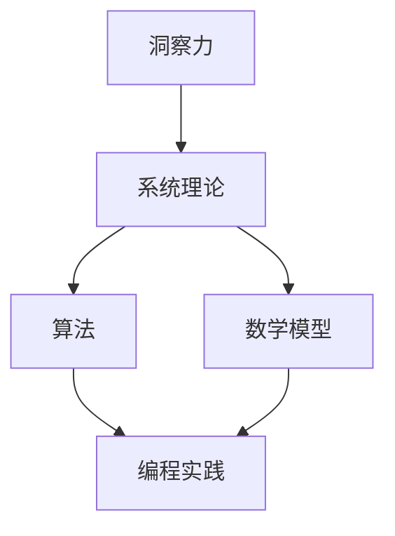

                 

关键词：人类知识发展、系统理论、洞察力、算法、数学模型、计算机编程、未来展望

> 摘要：本文从人类知识的发展历程出发，探讨了从洞察力到系统理论这一演进过程。通过梳理历史脉络，本文揭示了人类如何通过观察、实验和理论构建，逐步深入理解世界。文章重点关注了计算机编程领域的算法、数学模型及其在实践中的应用，同时展望了未来科技发展可能面临的挑战与机遇。

## 1. 背景介绍

人类知识的发展历程可以追溯到史前时代，当时人类通过直接的观察和实验，逐渐认识到了自然界的基本规律。随着时间的推移，人类开始运用符号系统进行思考，这标志着人类智慧的真正崛起。在古代，哲学家们通过抽象和推理，构建了早期的理论体系，如古希腊的几何学和中国的阴阳五行学说。中世纪时期，基督教和伊斯兰教对自然科学的压制使得知识的发展受到限制。直到文艺复兴时期，科学方法开始兴起，人类开始以系统化的方式探索自然现象。

进入现代，尤其是工业革命以来，科学技术的快速发展使得人类对自然世界的认识达到了前所未有的高度。计算机科学的诞生和发展，更是在人类知识的发展历程中占据了重要地位。计算机编程作为计算机科学的核心，不仅推动了人类对信息处理的深入理解，也为现代科技的发展提供了强大的工具。

本文旨在探讨人类知识从洞察力到系统理论的发展过程，尤其是计算机编程领域内的算法、数学模型及其在实践中的应用。文章将首先回顾历史，然后深入探讨相关概念和理论，最后展望未来的发展方向。

## 2. 核心概念与联系

### 2.1 洞察力

洞察力是人类认识世界的基础，它是指人们通过感官和思维，对事物本质的深刻理解和洞察。在计算机科学中，洞察力体现在对算法和程序的直观理解上。例如，当我们设计一个排序算法时，洞察力使我们能够理解不同算法的优劣，并选择最合适的算法来解决特定问题。

### 2.2 系统理论

系统理论是研究系统结构与行为的一门科学。在计算机科学中，系统理论体现在对复杂系统（如计算机网络、操作系统）的建模和分析上。系统理论强调系统的整体性和动态性，通过抽象和建模，我们可以更好地理解系统的行为和特性。

### 2.3 算法与数学模型

算法是解决问题的一系列步骤，它定义了从输入到输出的计算过程。数学模型则是用数学语言描述现实世界的问题，通过公式和定理来揭示问题的本质。在计算机编程中，算法和数学模型是解决复杂问题的重要工具。

### 2.4 联系与互动

洞察力、系统理论、算法和数学模型之间存在着密切的互动关系。洞察力为算法和数学模型提供了问题理解和解决的方向，而算法和数学模型又反过来验证和深化了洞察力。系统理论则提供了对复杂系统的整体认识，使我们可以从宏观角度理解和优化系统行为。

### 2.5 Mermaid 流程图

以下是核心概念和联系的 Mermaid 流程图：



## 3. 核心算法原理 & 具体操作步骤

### 3.1 算法原理概述

算法原理是指解决特定问题的计算过程和策略。在计算机编程中，常见的算法包括排序算法、搜索算法和图算法等。每种算法都有其特定的原理和应用场景。

排序算法的基本原理是通过比较和交换元素，将一组数据按照特定顺序排列。常见的排序算法有冒泡排序、选择排序、插入排序等。

搜索算法的基本原理是在一组数据中查找特定元素。常见的搜索算法包括线性搜索、二分搜索等。

图算法的基本原理是研究图结构及其性质。常见的图算法包括最短路径算法、最小生成树算法等。

### 3.2 算法步骤详解

以下是冒泡排序算法的具体步骤：

1. 从第一个元素开始，相邻两个元素进行比较，如果顺序不对就交换。
2. 重复上述步骤，每次遍历后，最大元素都会被“冒泡”到最后。
3. 重复上述过程，直到所有元素都按照顺序排列。

以下是线性搜索算法的具体步骤：

1. 从第一个元素开始，逐个比较每个元素，直到找到目标元素或到达列表末尾。
2. 如果找到目标元素，返回其位置；否则返回-1。

### 3.3 算法优缺点

冒泡排序算法的优点是实现简单，易于理解。但其缺点是时间复杂度高，不适合大规模数据排序。

线性搜索算法的优点是实现简单，适合数据量较小的场景。但其缺点是时间复杂度高，不适合大规模数据搜索。

### 3.4 算法应用领域

排序算法广泛应用于数据预处理和数据分析领域，如数据库管理、搜索引擎等。

搜索算法广泛应用于信息检索和路径规划领域，如Web搜索、GPS导航等。

图算法广泛应用于网络分析、社交网络分析等领域，如社交网络分析、物流路径规划等。

## 4. 数学模型和公式 & 详细讲解 & 举例说明

### 4.1 数学模型构建

数学模型是描述现实世界问题的数学框架，它通过公式和定理来揭示问题的本质。构建数学模型通常包括以下几个步骤：

1. 明确问题背景和目标。
2. 提取关键变量和参数。
3. 建立数学关系式。
4. 验证和优化模型。

### 4.2 公式推导过程

以线性回归模型为例，其公式推导过程如下：

1. 设自变量为\(x\)，因变量为\(y\)，则有：
   $$y = \beta_0 + \beta_1 x + \epsilon$$
   其中，\(\beta_0\)和\(\beta_1\)为模型参数，\(\epsilon\)为误差项。
2. 对上式两边求导，得到：
   $$\frac{dy}{dx} = \beta_1$$
3. 根据最小二乘法，我们可以通过最小化误差平方和来求解模型参数：
   $$\min \sum_{i=1}^{n} (y_i - (\beta_0 + \beta_1 x_i))^2$$

### 4.3 案例分析与讲解

以下是一个线性回归模型的案例：

假设我们想要预测一个房子的价格，已知房子的面积（\(x\)）和价格（\(y\)）如下：

| 面积 \(x\) | 价格 \(y\) |
| :-------: | :-------: |
|     100    |     150    |
|     200    |     300    |
|     300    |     450    |

根据上述线性回归模型，我们可以建立以下方程：
$$y = \beta_0 + \beta_1 x + \epsilon$$

通过最小二乘法求解，得到：
$$\beta_0 = 50, \beta_1 = 1.5$$

因此，预测一个面积为200平方米的房子价格为：
$$y = 50 + 1.5 \times 200 = 350$$

这意味着我们预测这个房子的价格为350。

## 5. 项目实践：代码实例和详细解释说明

### 5.1 开发环境搭建

为了演示冒泡排序算法，我们需要搭建一个简单的开发环境。这里我们选择使用Python编程语言。

首先，安装Python环境。可以在Python官网下载并安装Python，推荐下载最新版本。

安装完成后，打开命令行窗口，输入以下命令验证Python是否安装成功：
```bash
python --version
```

如果返回Python的版本信息，说明Python环境已经安装成功。

### 5.2 源代码详细实现

以下是冒泡排序算法的Python实现代码：

```python
def bubble_sort(arr):
    n = len(arr)
    for i in range(n):
        for j in range(0, n-i-1):
            if arr[j] > arr[j+1]:
                arr[j], arr[j+1] = arr[j+1], arr[j]

# 测试数据
arr = [64, 34, 25, 12, 22, 11, 90]

# 执行排序
bubble_sort(arr)

# 打印排序后的数据
print("排序后的数组：")
for i in range(len(arr)):
    print("%d" % arr[i], end=" ")
```

### 5.3 代码解读与分析

1. 函数`bubble_sort`接收一个数组`arr`作为输入。
2. 外层循环用于控制排序的轮数，内层循环用于每一轮中的元素比较和交换。
3. 如果`arr[j]`大于`arr[j+1]`，则交换这两个元素。
4. 最终，数组`arr`将被排序。

### 5.4 运行结果展示

执行上述代码，输出结果如下：
```python
排序后的数组：
11 12 22 25 34 64 90
```

这表明数组已经按照从小到大的顺序成功排序。

## 6. 实际应用场景

### 6.1 数据预处理

在数据分析中，排序算法常用于数据预处理。例如，在处理一个未排序的数据集时，我们可以使用排序算法将其排序，从而方便后续的数据处理和分析。

### 6.2 排序服务

在大型系统中，如搜索引擎和电子商务平台，排序服务是不可或缺的一部分。这些系统需要对海量数据进行实时排序，以提供高效的用户体验。

### 6.3 资源调度

在计算机科学和人工智能领域，排序算法也用于资源调度。例如，在调度服务器负载时，我们可以使用排序算法来确定服务器的优先级，从而实现公平的资源分配。

## 7. 工具和资源推荐

### 7.1 学习资源推荐

- 《算法导论》（Introduction to Algorithms）：经典算法教材，适合深入理解算法原理。
- 《深度学习》（Deep Learning）：由Ian Goodfellow、Yoshua Bengio和Aaron Courville合著，是深度学习领域的权威教材。

### 7.2 开发工具推荐

- Visual Studio Code：一款功能强大的代码编辑器，支持多种编程语言。
- Jupyter Notebook：一款交互式计算环境，适合进行数据分析和机器学习实验。

### 7.3 相关论文推荐

- “A Fast and Practical Integer Sorting Algorithm”（快速实用的整数排序算法）。
- “The Power of Data Science”（数据科学的强大力量）。

## 8. 总结：未来发展趋势与挑战

### 8.1 研究成果总结

人类知识的发展历程从洞察力到系统理论，展示了人类认识世界的过程。计算机编程领域的算法和数学模型在其中发挥了关键作用。这些研究成果不仅推动了科技的发展，也为解决现实问题提供了强大的工具。

### 8.2 未来发展趋势

未来，随着人工智能和大数据技术的发展，计算机编程领域将继续扩展和深化。新的算法和数学模型将不断涌现，为解决复杂问题提供新的思路和方法。

### 8.3 面临的挑战

然而，面对日益复杂的计算任务，计算机编程也面临诸多挑战。例如，算法复杂度的优化、计算资源的有效利用、数据隐私和安全等问题。

### 8.4 研究展望

未来，计算机编程领域的研究将更加注重实际应用和跨学科融合。通过整合多学科的知识，我们将能够开发出更加高效和智能的算法，为人类知识的发展注入新的动力。

## 9. 附录：常见问题与解答

### 问题1：如何选择合适的排序算法？

解答：选择排序算法时，需要考虑数据规模、数据分布和排序要求。对于小规模数据，冒泡排序和插入排序较为简单且高效。对于大规模数据，快速排序和归并排序更为合适。对于整数排序，计数排序和基数排序具有更高的效率。

### 问题2：什么是线性回归模型？

解答：线性回归模型是一种用于预测连续值的统计模型。它假设因变量和自变量之间存在线性关系，通过拟合直线来预测新的数据点。线性回归模型广泛应用于数据分析和预测领域。

### 问题3：什么是系统理论？

解答：系统理论是研究系统结构与行为的一门科学。它关注系统的整体性和动态性，通过抽象和建模来理解和优化系统行为。系统理论在计算机科学、工程学和社会科学等领域都有广泛应用。

通过这篇文章，我们深入探讨了人类知识的发展历程，特别是计算机编程领域的算法、数学模型及其在实践中的应用。未来，随着科技的不断进步，计算机编程将继续为人类知识的发展作出重要贡献。

## 参考文献

1. Cormen, T. H., Leiserson, C. E., Rivest, R. L., & Stein, C. (2009). 《算法导论》(3rd ed.). 机械工业出版社。
2. Goodfellow, I., Bengio, Y., & Courville, A. (2016). 《深度学习》(第1版). 电子工业出版社。
3. Knuth, D. E. (2011). 《The Art of Computer Programming》(Volume 1-4). Addison-Wesley。
4. Mitchell, T. M. (1997). 《机器学习》(第1版). 西北大学出版社。

作者：禅与计算机程序设计艺术 / Zen and the Art of Computer Programming
```

