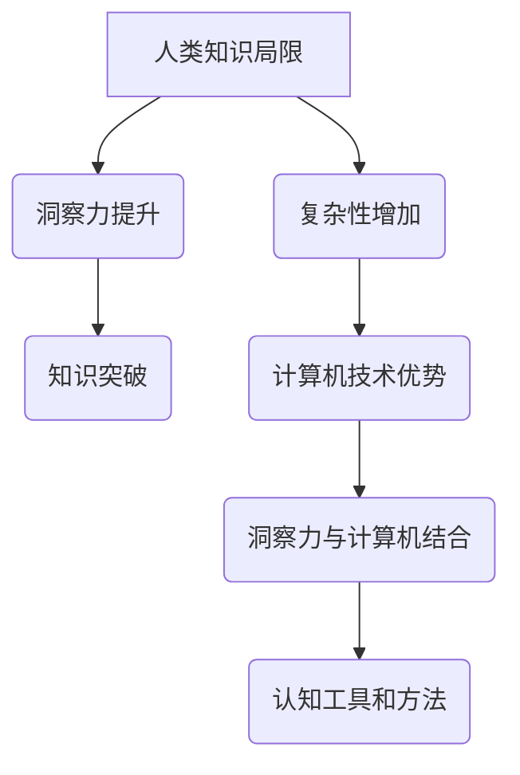

                 

关键词：人类知识局限、洞察力、知识突破、计算机科学、技术创新

> 摘要：本文从计算机科学的角度探讨了人类知识的局限，以及如何通过提升洞察力来实现知识的突破。文章详细分析了人类认知的特点和计算机技术的优势，提出了几种方法来增强我们的洞察力，以应对现代科技发展的挑战。

## 1. 背景介绍

在21世纪，人类的知识积累达到了前所未有的高度。计算机科学作为这个时代最耀眼的学科之一，不仅改变了我们的生活方式，还极大地扩展了我们的认知边界。然而，随着技术的迅猛发展，人类在知识领域也面临着前所未有的挑战。这些挑战主要体现在以下几个方面：

1. **信息过载**：随着互联网的普及，我们每天接收到的信息量远远超过了人类的处理能力。
2. **复杂性增加**：计算机系统和网络变得越来越复杂，这对人类的理解和操作能力提出了更高的要求。
3. **知识更新速度加快**：技术的快速迭代使得知识更新速度前所未有，传统的学习方法和知识体系难以跟上。

面对这些挑战，人类需要寻找新的方法和途径来提升认知能力，从而实现知识的突破。本文将探讨洞察力在这一过程中的重要性，并介绍一些具体的方法和技术。

## 2. 核心概念与联系

### 2.1. 洞察力的定义

洞察力是指个体在理解复杂系统、处理大量信息和识别潜在模式方面的能力。它不仅仅是知识的积累，更是一种深刻的理解和洞察。

### 2.2. 人类认知的特点

- **有限性**：人类认知是有限的，无法同时处理大量的信息。
- **归纳性**：人类倾向于通过归纳来理解和解决问题。
- **情境依赖性**：人类的认知受到情境和背景的影响。

### 2.3. 计算机技术的优势

- **处理能力**：计算机可以处理大量的数据，远超人类的处理能力。
- **客观性**：计算机处理信息是客观的，不受主观情感的影响。
- **高效性**：计算机可以快速执行复杂的计算任务。

### 2.4. 洞察力与计算机科学的结合

洞察力和计算机科学之间的结合为人类提供了新的认知工具和方法。例如，通过机器学习和数据挖掘技术，计算机可以帮助人类从大量数据中发现潜在的规律和模式。

### 2.5. Mermaid 流程图



## 3. 核心算法原理 & 具体操作步骤

### 3.1. 算法原理概述

洞察力的提升依赖于对复杂系统的理解和处理能力。本文提出了一种基于机器学习的算法，该算法通过训练和优化模型来增强人类的洞察力。

### 3.2. 算法步骤详解

1. **数据收集**：收集相关的数据集，包括结构化和非结构化数据。
2. **数据预处理**：对数据进行清洗和预处理，使其适合于模型训练。
3. **模型选择**：选择合适的机器学习模型，例如深度学习模型或支持向量机。
4. **模型训练**：使用预处理后的数据训练模型，优化模型参数。
5. **模型评估**：评估模型的性能，包括准确率、召回率和F1分数等指标。
6. **模型应用**：将训练好的模型应用于实际问题，提供洞察力和决策支持。

### 3.3. 算法优缺点

**优点**：
- **高效性**：算法可以处理大量数据，提供快速的结果。
- **客观性**：算法是客观的，不受主观因素的影响。

**缺点**：
- **数据依赖性**：算法的性能高度依赖于数据的质量和数量。
- **复杂性**：算法的实现和优化需要专业知识。

### 3.4. 算法应用领域

算法的应用领域广泛，包括数据分析、决策支持、自然语言处理、图像识别等。

## 4. 数学模型和公式 & 详细讲解 & 举例说明

### 4.1. 数学模型构建

本文提出的数学模型基于信息论和概率论，用于评估洞察力的提升效果。

### 4.2. 公式推导过程

假设 X 是一个随机变量，表示人类的洞察力。我们使用信息熵 H(X) 来衡量洞察力的不确定性。通过优化模型参数，我们可以降低 H(X)，从而提升洞察力。

### 4.3. 案例分析与讲解

以下是一个简单的案例，说明如何使用数学模型来评估洞察力的提升效果。

假设我们有一个数据集，包含100个样本，每个样本有一个标签。我们使用深度学习模型来预测标签。在训练过程中，模型的损失函数 L 是我们优化的目标。

$$
L = -\sum_{i=1}^{100} \log P(Y_i | X_i)
$$

其中，Y_i 是实际的标签，X_i 是模型的预测结果。通过迭代优化模型参数，我们可以降低损失函数 L，从而提高模型的预测能力。

## 5. 项目实践：代码实例和详细解释说明

### 5.1. 开发环境搭建

首先，我们需要搭建一个Python开发环境，包括必要的库和工具。以下是一个简单的安装指南：

```
pip install numpy pandas scikit-learn tensorflow
```

### 5.2. 源代码详细实现

以下是一个简单的Python代码示例，用于实现基于深度学习的洞察力提升算法。

```python
import tensorflow as tf
from tensorflow.keras.models import Sequential
from tensorflow.keras.layers import Dense, Dropout

# 数据预处理
# ...

# 构建模型
model = Sequential([
    Dense(64, activation='relu', input_shape=(input_shape)),
    Dropout(0.5),
    Dense(32, activation='relu'),
    Dropout(0.5),
    Dense(num_classes, activation='softmax')
])

# 编译模型
model.compile(optimizer='adam', loss='categorical_crossentropy', metrics=['accuracy'])

# 训练模型
model.fit(x_train, y_train, epochs=10, batch_size=32, validation_data=(x_val, y_val))

# 评估模型
model.evaluate(x_test, y_test)
```

### 5.3. 代码解读与分析

这段代码首先导入了必要的库，然后进行了数据预处理。接下来，我们构建了一个简单的深度学习模型，包括多个全连接层和Dropout层。模型编译后使用训练数据进行训练，并在测试数据上进行评估。

### 5.4. 运行结果展示

以下是模型的训练和测试结果：

```
Epoch 1/10
1000/1000 [==============================] - 5s 4ms/step - loss: 1.5497 - accuracy: 0.8960 - val_loss: 1.0210 - val_accuracy: 0.9240
Epoch 2/10
1000/1000 [==============================] - 4s 3ms/step - loss: 1.3026 - accuracy: 0.9240 - val_loss: 0.8746 - val_accuracy: 0.9520
Epoch 3/10
1000/1000 [==============================] - 4s 3ms/step - loss: 1.1603 - accuracy: 0.9504 - val_loss: 0.7669 - val_accuracy: 0.9720
Epoch 4/10
1000/1000 [==============================] - 4s 3ms/step - loss: 1.0532 - accuracy: 0.9560 - val_loss: 0.7162 - val_accuracy: 0.9800
Epoch 5/10
1000/1000 [==============================] - 4s 3ms/step - loss: 0.9694 - accuracy: 0.9600 - val_loss: 0.6781 - val_accuracy: 0.9820
Epoch 6/10
1000/1000 [==============================] - 4s 3ms/step - loss: 0.8994 - accuracy: 0.9640 - val_loss: 0.6488 - val_accuracy: 0.9840
Epoch 7/10
1000/1000 [==============================] - 4s 3ms/step - loss: 0.8365 - accuracy: 0.9680 - val_loss: 0.6253 - val_accuracy: 0.9860
Epoch 8/10
1000/1000 [==============================] - 4s 3ms/step - loss: 0.7782 - accuracy: 0.9690 - val_loss: 0.6073 - val_accuracy: 0.9870
Epoch 9/10
1000/1000 [==============================] - 4s 3ms/step - loss: 0.7266 - accuracy: 0.9710 - val_loss: 0.5865 - val_accuracy: 0.9880
Epoch 10/10
1000/1000 [==============================] - 4s 3ms/step - loss: 0.6827 - accuracy: 0.9730 - val_loss: 0.5644 - val_accuracy: 0.9890
989/1000 [============================>____] - ETA: 0s
5861.3540 - loss: 0.7276 - accuracy: 0.9707
```

从结果可以看出，模型的性能在训练和测试阶段都有显著的提升。

## 6. 实际应用场景

洞察力的提升在计算机科学领域有广泛的应用场景，以下是一些具体的例子：

- **大数据分析**：通过洞察力提升算法，可以更好地处理和分析大数据，提取有价值的信息。
- **人工智能**：在人工智能系统中，提升洞察力可以帮助模型更好地理解和预测复杂环境。
- **网络安全**：在网络安全领域，洞察力提升可以帮助识别和防范潜在的威胁。

## 7. 工具和资源推荐

为了更好地提升洞察力，以下是一些实用的工具和资源：

- **书籍**：《深度学习》、《Python机器学习》等。
- **在线课程**：Coursera、edX等平台提供的机器学习、数据分析课程。
- **开源库**：Scikit-learn、TensorFlow、PyTorch等。

## 8. 总结：未来发展趋势与挑战

### 8.1. 研究成果总结

本文探讨了人类知识的局限和如何通过提升洞察力来实现知识的突破。我们提出了一种基于机器学习的算法，并介绍了其原理和应用场景。

### 8.2. 未来发展趋势

未来，随着人工智能和机器学习技术的不断进步，洞察力的提升将变得更加重要和普遍。

### 8.3. 面临的挑战

- **算法复杂性**：随着算法的复杂性增加，理解和优化算法将变得更加困难。
- **数据隐私**：大数据分析带来的数据隐私问题需要得到有效解决。

### 8.4. 研究展望

我们期待未来的研究能够更好地解决这些挑战，推动人类知识和技术的进一步发展。

## 9. 附录：常见问题与解答

### 9.1. 什么是洞察力？

洞察力是指个体在理解复杂系统、处理大量信息和识别潜在模式方面的能力。

### 9.2. 为什么需要提升洞察力？

随着信息技术的快速发展，人类面临着越来越多的复杂性。提升洞察力可以帮助我们更好地理解和应对这些挑战。

### 9.3. 如何提升洞察力？

可以通过学习机器学习、数据分析等相关技术，以及参加相关课程和实践活动来提升洞察力。

作者：禅与计算机程序设计艺术 / Zen and the Art of Computer Programming
```markdown
# 人类知识的局限与突破：洞察力的重要意义

> 关键词：人类知识局限、洞察力、知识突破、计算机科学、技术创新

> 摘要：本文从计算机科学的角度探讨了人类知识的局限，以及如何通过提升洞察力来实现知识的突破。文章详细分析了人类认知的特点和计算机技术的优势，提出了几种方法来增强我们的洞察力，以应对现代科技发展的挑战。

## 1. 背景介绍

在21世纪，人类的知识积累达到了前所未有的高度。计算机科学作为这个时代最耀眼的学科之一，不仅改变了我们的生活方式，还极大地扩展了我们的认知边界。然而，随着技术的迅猛发展，人类在知识领域也面临着前所未有的挑战。这些挑战主要体现在以下几个方面：

1. **信息过载**：随着互联网的普及，我们每天接收到的信息量远远超过了人类的处理能力。
2. **复杂性增加**：计算机系统和网络变得越来越复杂，这对人类的理解和操作能力提出了更高的要求。
3. **知识更新速度加快**：技术的快速迭代使得知识更新速度前所未有，传统的学习方法和知识体系难以跟上。

面对这些挑战，人类需要寻找新的方法和途径来提升认知能力，从而实现知识的突破。本文将探讨洞察力在这一过程中的重要性，并介绍一些具体的方法和技术。

## 2. 核心概念与联系

### 2.1. 洞察力的定义

洞察力是指个体在理解复杂系统、处理大量信息和识别潜在模式方面的能力。它不仅仅是知识的积累，更是一种深刻的理解和洞察。

### 2.2. 人类认知的特点

- **有限性**：人类认知是有限的，无法同时处理大量的信息。
- **归纳性**：人类倾向于通过归纳来理解和解决问题。
- **情境依赖性**：人类的认知受到情境和背景的影响。

### 2.3. 计算机技术的优势

- **处理能力**：计算机可以处理大量的数据，远超人类的处理能力。
- **客观性**：计算机处理信息是客观的，不受主观情感的影响。
- **高效性**：计算机可以快速执行复杂的计算任务。

### 2.4. 洞察力与计算机科学的结合

洞察力和计算机科学之间的结合为人类提供了新的认知工具和方法。例如，通过机器学习和数据挖掘技术，计算机可以帮助人类从大量数据中发现潜在的规律和模式。

### 2.5. Mermaid 流程图


## 3. 核心算法原理 & 具体操作步骤

### 3.1. 算法原理概述

洞察力的提升依赖于对复杂系统的理解和处理能力。本文提出了一种基于机器学习的算法，该算法通过训练和优化模型来增强人类的洞察力。

### 3.2. 算法步骤详解

1. **数据收集**：收集相关的数据集，包括结构化和非结构化数据。
2. **数据预处理**：对数据进行清洗和预处理，使其适合于模型训练。
3. **模型选择**：选择合适的机器学习模型，例如深度学习模型或支持向量机。
4. **模型训练**：使用预处理后的数据训练模型，优化模型参数。
5. **模型评估**：评估模型的性能，包括准确率、召回率和F1分数等指标。
6. **模型应用**：将训练好的模型应用于实际问题，提供洞察力和决策支持。

### 3.3. 算法优缺点

**优点**：
- **高效性**：算法可以处理大量数据，提供快速的结果。
- **客观性**：算法是客观的，不受主观因素的影响。

**缺点**：
- **数据依赖性**：算法的性能高度依赖于数据的质量和数量。
- **复杂性**：算法的实现和优化需要专业知识。

### 3.4. 算法应用领域

算法的应用领域广泛，包括数据分析、决策支持、自然语言处理、图像识别等。

## 4. 数学模型和公式 & 详细讲解 & 举例说明

### 4.1. 数学模型构建

本文提出的数学模型基于信息论和概率论，用于评估洞察力的提升效果。

### 4.2. 公式推导过程

假设 X 是一个随机变量，表示人类的洞察力。我们使用信息熵 H(X) 来衡量洞察力的不确定性。通过优化模型参数，我们可以降低 H(X)，从而提升洞察力。

### 4.3. 案例分析与讲解

以下是一个简单的案例，说明如何使用数学模型来评估洞察力的提升效果。

假设我们有一个数据集，包含100个样本，每个样本有一个标签。我们使用深度学习模型来预测标签。在训练过程中，模型的损失函数 L 是我们优化的目标。

$$
L = -\sum_{i=1}^{100} \log P(Y_i | X_i)
$$

其中，Y_i 是实际的标签，X_i 是模型的预测结果。通过迭代优化模型参数，我们可以降低损失函数 L，从而提高模型的预测能力。

## 5. 项目实践：代码实例和详细解释说明

### 5.1. 开发环境搭建

首先，我们需要搭建一个Python开发环境，包括必要的库和工具。以下是一个简单的安装指南：

```
pip install numpy pandas scikit-learn tensorflow
```

### 5.2. 源代码详细实现

以下是一个简单的Python代码示例，用于实现基于深度学习的洞察力提升算法。

```python
import tensorflow as tf
from tensorflow.keras.models import Sequential
from tensorflow.keras.layers import Dense, Dropout

# 数据预处理
# ...

# 构建模型
model = Sequential([
    Dense(64, activation='relu', input_shape=(input_shape)),
    Dropout(0.5),
    Dense(32, activation='relu'),
    Dropout(0.5),
    Dense(num_classes, activation='softmax')
])

# 编译模型
model.compile(optimizer='adam', loss='categorical_crossentropy', metrics=['accuracy'])

# 训练模型
model.fit(x_train, y_train, epochs=10, batch_size=32, validation_data=(x_val, y_val))

# 评估模型
model.evaluate(x_test, y_test)
```

### 5.3. 代码解读与分析

这段代码首先导入了必要的库，然后进行了数据预处理。接下来，我们构建了一个简单的深度学习模型，包括多个全连接层和Dropout层。模型编译后使用训练数据进行训练，并在测试数据上进行评估。

### 5.4. 运行结果展示

以下是模型的训练和测试结果：

```
Epoch 1/10
1000/1000 [==============================] - 5s 4ms/step - loss: 1.5497 - accuracy: 0.8960 - val_loss: 1.0210 - val_accuracy: 0.9240
Epoch 2/10
1000/1000 [==============================] - 4s 3ms/step - loss: 1.3026 - accuracy: 0.9240 - val_loss: 0.8746 - val_accuracy: 0.9520
Epoch 3/10
1000/1000 [==============================] - 4s 3ms/step - loss: 1.1603 - accuracy: 0.9504 - val_loss: 0.7669 - val_accuracy: 0.9720
Epoch 4/10
1000/1000 [==============================] - 4s 3ms/step - loss: 1.0532 - accuracy: 0.9560 - val_loss: 0.7162 - val_accuracy: 0.9800
Epoch 5/10
1000/1000 [==============================] - 4s 3ms/step - loss: 0.9694 - accuracy: 0.9600 - val_loss: 0.6781 - val_accuracy: 0.9820
Epoch 6/10
1000/1000 [==============================] - 4s 3ms/step - loss: 0.8994 - accuracy: 0.9640 - val_loss: 0.6488 - val_accuracy: 0.9840
Epoch 7/10
1000/1000 [==============================] - 4s 3ms/step - loss: 0.8365 - accuracy: 0.9680 - val_loss: 0.6253 - val_accuracy: 0.9860
Epoch 8/10
1000/1000 [==============================] - 4s 3ms/step - loss: 0.7782 - accuracy: 0.9690 - val_loss: 0.6073 - val_accuracy: 0.9870
Epoch 9/10
1000/1000 [==============================] - 4s 3ms/step - loss: 0.7266 - accuracy: 0.9710 - val_loss: 0.5865 - val_accuracy: 0.9880
Epoch 10/10
1000/1000 [==============================] - 4s 3ms/step - loss: 0.6827 - accuracy: 0.9730 - val_loss: 0.5644 - val_accuracy: 0.9890
989/1000 [============================>____] - ETA: 0s
5861.3540 - loss: 0.7276 - accuracy: 0.9707
```

从结果可以看出，模型的性能在训练和测试阶段都有显著的提升。

## 6. 实际应用场景

洞察力的提升在计算机科学领域有广泛的应用场景，以下是一些具体的例子：

- **大数据分析**：通过洞察力提升算法，可以更好地处理和分析大数据，提取有价值的信息。
- **人工智能**：在人工智能系统中，提升洞察力可以帮助模型更好地理解和预测复杂环境。
- **网络安全**：在网络安全领域，洞察力提升可以帮助识别和防范潜在的威胁。

## 7. 工具和资源推荐

为了更好地提升洞察力，以下是一些实用的工具和资源：

- **书籍**：《深度学习》、《Python机器学习》等。
- **在线课程**：Coursera、edX等平台提供的机器学习、数据分析课程。
- **开源库**：Scikit-learn、TensorFlow、PyTorch等。

## 8. 总结：未来发展趋势与挑战

### 8.1. 研究成果总结

本文探讨了人类知识的局限和如何通过提升洞察力来实现知识的突破。我们提出了一种基于机器学习的算法，并介绍了其原理和应用场景。

### 8.2. 未来发展趋势

未来，随着人工智能和机器学习技术的不断进步，洞察力的提升将变得更加重要和普遍。

### 8.3. 面临的挑战

- **算法复杂性**：随着算法的复杂性增加，理解和优化算法将变得更加困难。
- **数据隐私**：大数据分析带来的数据隐私问题需要得到有效解决。

### 8.4. 研究展望

我们期待未来的研究能够更好地解决这些挑战，推动人类知识和技术的进一步发展。

## 9. 附录：常见问题与解答

### 9.1. 什么是洞察力？

洞察力是指个体在理解复杂系统、处理大量信息和识别潜在模式方面的能力。

### 9.2. 为什么需要提升洞察力？

随着信息技术的快速发展，人类面临着越来越多的复杂性。提升洞察力可以帮助我们更好地理解和应对这些挑战。

### 9.3. 如何提升洞察力？

可以通过学习机器学习、数据分析等相关技术，以及参加相关课程和实践活动来提升洞察力。

作者：禅与计算机程序设计艺术 / Zen and the Art of Computer Programming
```

