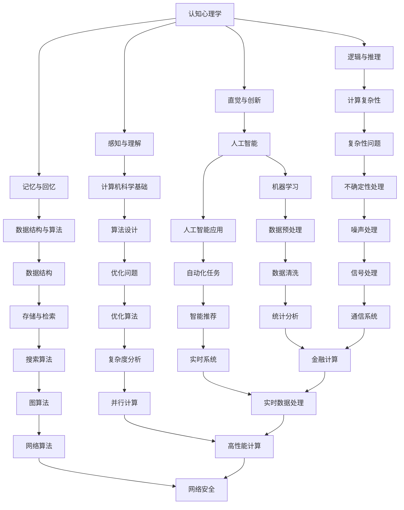

                 

在人类的知识长河中，我们对世界的认知在不断扩展，但对未知的探索却永无止境。本文旨在探讨人类在知识获取上的局限性，并思考如何承认并探索这些未知领域。本文将结合计算机科学领域的实践，分析人类认知的边界，以及如何通过技术手段突破这些限制。

## 1. 背景介绍

人类自诞生以来，一直在努力理解世界。从早期的语言和符号系统，到现代的科学方法和计算机技术，知识的积累和传递成为推动社会进步的重要力量。然而，尽管人类在各个领域取得了显著的成就，但我们对许多问题的理解仍然非常有限。

在计算机科学领域，尽管我们能够设计和实现复杂的系统，但在某些基础问题上，如量子计算、人工智能的深度学习原理、以及复杂系统的稳定性，我们仍然面临着巨大的挑战。这些问题的根源在于人类认知的局限性。

### 认知局限性

人类的认知局限性主要体现在以下几个方面：

1. **感知与理解的局限性**：人类通过感官获取信息，但这些感官的信息处理能力有限。例如，人类的视觉系统无法感知紫外线或红外线，听觉系统也无法听到超声波。

2. **记忆与回忆的局限性**：人类的大脑虽然拥有强大的记忆能力，但记忆的持久性和准确性都有限。随着时间推移，记忆可能会模糊甚至消失。

3. **逻辑与推理的局限性**：尽管人类能够进行逻辑推理，但我们的推理能力受限于经验和知识。面对复杂的问题时，我们的推理可能不够全面或准确。

4. **直觉与创新的局限性**：人类的直觉和创造力在某种程度上是超越逻辑推理的，但它们也受限于个人的经验和知识。

### 计算机科学的挑战

在计算机科学领域，这些认知局限性导致了我们在解决问题时面临着诸多挑战：

1. **复杂性问题**：许多现实问题，如大规模数据处理、优化问题等，其复杂度超出了人类直接理解和处理的能力。

2. **不确定性问题**：在人工智能和机器学习领域，我们面临着数据的不确定性和噪声问题，这使得算法的性能受到限制。

3. **创新性瓶颈**：在追求技术创新时，我们可能会遇到理论上的瓶颈，这限制了新的突破和发展。

## 2. 核心概念与联系

为了深入探讨人类认知的局限性，我们需要理解一些核心概念，并分析它们之间的联系。以下是几个关键概念：

### 认知心理学

认知心理学是研究人类思维过程和认知能力的学科。它帮助我们理解人类如何感知、记忆、思考和解题。通过认知心理学的理论，我们可以更深入地探讨人类认知的局限性。

### 计算机科学基础

计算机科学的基础理论，如算法、数据结构和计算复杂性理论，为我们提供了分析和解决复杂问题的方法。然而，这些方法也受到人类认知局限性的影响。

### 人工智能

人工智能作为计算机科学的一个分支，旨在模拟和扩展人类的智能。通过人工智能，我们能够处理大量数据，并自动化许多复杂的任务。然而，人工智能的发展也面临着认知局限性的挑战。

### Mermaid 流程图

为了更好地展示这些概念之间的联系，我们可以使用Mermaid流程图来表示：



通过这个流程图，我们可以看到认知心理学、计算机科学基础和人工智能之间的相互作用，以及它们在解决复杂问题和应对认知局限性的过程中所扮演的角色。

## 3. 核心算法原理 & 具体操作步骤

为了进一步探讨如何应对人类认知的局限性，我们需要了解一些核心算法的原理和具体操作步骤。以下是几个关键算法：

### 3.1 算法原理概述

#### 机器学习算法

机器学习算法是人工智能的核心技术之一。它通过数据学习规律，并用于预测或决策。常见的机器学习算法包括线性回归、决策树、支持向量机和神经网络等。

#### 图算法

图算法用于处理图结构的数据，如社交网络、交通网络等。常见的图算法包括深度优先搜索、广度优先搜索、最小生成树和最短路径算法等。

#### 优化算法

优化算法用于求解优化问题，如线性规划、整数规划和动态规划等。这些算法在资源分配、路径规划等实际应用中具有重要应用。

### 3.2 算法步骤详解

#### 机器学习算法步骤

1. **数据预处理**：对数据进行清洗、归一化和特征提取。
2. **模型选择**：选择合适的模型，如线性回归、决策树等。
3. **模型训练**：使用训练数据训练模型，并调整模型参数。
4. **模型评估**：使用验证数据评估模型性能，并调整参数。
5. **模型部署**：将训练好的模型部署到实际应用中。

#### 图算法步骤

1. **初始化**：根据图的数据结构初始化算法的变量。
2. **遍历**：使用深度优先搜索或广度优先搜索遍历图。
3. **计算**：根据遍历的结果计算图的各种属性，如最短路径、最小生成树等。
4. **输出**：输出计算结果。

#### 优化算法步骤

1. **问题定义**：定义优化问题的目标函数和约束条件。
2. **算法选择**：选择合适的优化算法，如线性规划、整数规划等。
3. **迭代计算**：根据算法的迭代过程计算最优解。
4. **结果分析**：分析优化结果，并根据需要对模型进行调整。

### 3.3 算法优缺点

#### 机器学习算法优缺点

**优点**：
- **自动学习**：机器学习算法能够自动从数据中学习规律，减少人为干预。
- **泛化能力**：通过训练，机器学习算法能够应用于新的数据集，具有一定的泛化能力。

**缺点**：
- **数据依赖**：机器学习算法的性能受数据质量和数量影响较大。
- **解释性较差**：机器学习算法的黑盒性质使其难以解释，不利于理解决策过程。

#### 图算法优缺点

**优点**：
- **适用于图结构数据**：图算法能够有效地处理图结构的数据，如社交网络、交通网络等。
- **可扩展性**：图算法具有较好的可扩展性，可以处理大规模图数据。

**缺点**：
- **计算复杂度高**：某些图算法，如最短路径算法，其计算复杂度较高，可能不适合处理大规模数据。

#### 优化算法优缺点

**优点**：
- **求解精确**：优化算法能够求解优化问题的精确解，适用于要求较高精度的应用场景。

**缺点**：
- **计算复杂度高**：优化算法通常需要较长的计算时间，可能不适合实时应用场景。

### 3.4 算法应用领域

#### 机器学习算法应用领域

- **推荐系统**：通过分析用户行为，为用户推荐感兴趣的商品或内容。
- **图像识别**：通过学习图像特征，实现图像分类和目标检测。
- **自然语言处理**：通过学习文本特征，实现文本分类、翻译和情感分析。

#### 图算法应用领域

- **社交网络分析**：分析社交网络的结构和属性，如社群检测、影响力分析等。
- **交通网络优化**：优化交通路线，提高交通效率。
- **推荐系统**：基于用户关系和物品属性，为用户推荐感兴趣的内容。

#### 优化算法应用领域

- **资源分配**：优化资源分配，提高资源利用率。
- **路径规划**：优化路径规划，提高运输效率。
- **生产调度**：优化生产调度，提高生产效率。

## 4. 数学模型和公式 & 详细讲解 & 举例说明

为了更好地理解和应用上述算法，我们需要掌握相关的数学模型和公式。以下是一些关键数学模型和公式的详细讲解以及举例说明。

### 4.1 数学模型构建

#### 线性回归模型

线性回归模型是一种常用的预测模型，用于分析自变量和因变量之间的线性关系。其数学模型可以表示为：

\[ y = \beta_0 + \beta_1x_1 + \beta_2x_2 + ... + \beta_nx_n + \epsilon \]

其中，\( y \) 是因变量，\( x_1, x_2, ..., x_n \) 是自变量，\( \beta_0, \beta_1, ..., \beta_n \) 是模型参数，\( \epsilon \) 是误差项。

#### 决策树模型

决策树模型通过一系列的判断节点和叶子节点来构建一个树形结构，用于分类或回归任务。其数学模型可以表示为：

\[ f(x) = \sum_{i=1}^{n} \theta_i \prod_{j=1}^{m} g_j(x_j) \]

其中，\( x \) 是输入特征，\( \theta_i \) 是叶子节点的权重，\( g_j(x_j) \) 是判断节点的条件函数。

### 4.2 公式推导过程

#### 最小生成树模型

最小生成树模型用于构建无向图的最小生成树，其目标是最小化树的总权重。其数学模型可以表示为：

\[ \min Z = \sum_{i=1}^{n} \sum_{j=1}^{m} c_{ij} x_{ij} \]

其中，\( c_{ij} \) 是边 \( (i, j) \) 的权重，\( x_{ij} \) 是决策变量，表示边 \( (i, j) \) 是否在最小生成树中。

为了求解最小生成树，我们可以使用Kruskal算法或Prim算法。以下是一个使用Kruskal算法的推导过程：

1. **初始化**：将所有边按照权重从小到大排序。
2. **构建集合**：创建一个集合，包含所有顶点。
3. **遍历边**：按照权重遍历所有边，对于每条边 \( (i, j) \)：
   - 如果 \( i \) 和 \( j \) 在不同的集合中，将 \( (i, j) \) 添加到最小生成树中，并将 \( i \) 和 \( j \) 所在的集合合并。
   - 如果 \( i \) 和 \( j \) 在同一个集合中，跳过这条边。

通过上述过程，我们可以找到最小生成树。

### 4.3 案例分析与讲解

#### 案例一：线性回归模型在房价预测中的应用

假设我们有一个房价预测问题，其中自变量包括房屋面积、楼层和装修程度，因变量为房价。我们可以使用线性回归模型来预测房价。

1. **数据预处理**：对数据进行清洗、归一化和特征提取。
2. **模型选择**：选择线性回归模型。
3. **模型训练**：使用训练数据训练模型，并调整模型参数。
4. **模型评估**：使用验证数据评估模型性能，并调整参数。
5. **模型部署**：将训练好的模型部署到实际应用中。

具体操作步骤如下：

1. **数据预处理**：
   - 清洗数据，去除缺失值和异常值。
   - 归一化数据，将所有特征缩放到相同的尺度。
   - 提取特征，如房屋面积、楼层和装修程度等。

2. **模型选择**：
   - 选择线性回归模型，因为房价与特征之间可能存在线性关系。

3. **模型训练**：
   - 使用训练数据训练模型，计算模型参数。
   - 调整模型参数，如学习率和迭代次数。

4. **模型评估**：
   - 使用验证数据评估模型性能，计算均方误差（MSE）等指标。
   - 根据评估结果调整模型参数。

5. **模型部署**：
   - 将训练好的模型部署到实际应用中，如房地产网站。

#### 案例二：最小生成树模型在社交网络分析中的应用

假设我们有一个社交网络图，其中节点代表用户，边代表用户之间的关系。我们希望使用最小生成树模型分析社交网络的结构。

1. **数据预处理**：将社交网络图表示为一个无向图，并计算各边的权重。
2. **模型选择**：选择最小生成树模型。
3. **模型训练**：使用Kruskal算法或Prim算法构建最小生成树。
4. **模型评估**：计算最小生成树的各项指标，如节点数、边数和总权重等。
5. **模型部署**：将最小生成树模型部署到实际应用中，如社交网络分析工具。

具体操作步骤如下：

1. **数据预处理**：
   - 将社交网络图表示为一个无向图，每个节点代表一个用户，每条边代表用户之间的关系。
   - 计算各边的权重，如用户之间的互动次数或好友关系数。

2. **模型选择**：
   - 选择最小生成树模型，用于分析社交网络的结构。

3. **模型训练**：
   - 使用Kruskal算法或Prim算法构建最小生成树。
   - 根据算法的不同，可能需要调整参数，如边的权重阈值。

4. **模型评估**：
   - 计算最小生成树的各项指标，如节点数、边数和总权重等。
   - 分析最小生成树的结构特性，如连通性和社区结构。

5. **模型部署**：
   - 将最小生成树模型部署到实际应用中，如社交网络分析工具。

通过以上案例，我们可以看到数学模型和公式在计算机科学领域的应用，以及如何通过具体的操作步骤实现这些模型。这些模型和公式为我们提供了强大的工具，帮助我们更好地理解和解决复杂问题。

## 5. 项目实践：代码实例和详细解释说明

为了更好地理解上述算法和数学模型，我们将通过一个实际项目来展示它们的实现过程。本项目将使用Python语言和相关的库来构建一个简单的房价预测系统，并使用线性回归模型进行训练和预测。

### 5.1 开发环境搭建

在开始项目之前，我们需要搭建一个合适的开发环境。以下是搭建步骤：

1. **安装Python**：确保Python已经安装在您的计算机上，版本建议为3.8及以上。
2. **安装Jupyter Notebook**：Jupyter Notebook是一个交互式的开发环境，可以方便地进行代码编写和调试。可以通过以下命令安装：

   ```shell
   pip install notebook
   ```

3. **安装相关库**：安装用于数据预处理、线性回归和可视化等操作的库。以下是安装命令：

   ```shell
   pip install numpy pandas scikit-learn matplotlib
   ```

### 5.2 源代码详细实现

以下是一个简单的房价预测项目的源代码，包括数据预处理、模型训练和预测等步骤。

```python
import numpy as np
import pandas as pd
from sklearn.linear_model import LinearRegression
from sklearn.model_selection import train_test_split
from sklearn.metrics import mean_squared_error
import matplotlib.pyplot as plt

# 5.2.1 数据预处理

# 读取数据
data = pd.read_csv('house_price_data.csv')

# 处理缺失值
data.fillna(data.mean(), inplace=True)

# 特征提取
X = data[['area', 'floor', 'decoration']]
y = data['price']

# 划分训练集和测试集
X_train, X_test, y_train, y_test = train_test_split(X, y, test_size=0.2, random_state=42)

# 5.2.2 模型训练

# 创建线性回归模型
model = LinearRegression()

# 训练模型
model.fit(X_train, y_train)

# 5.2.3 模型评估

# 预测测试集结果
y_pred = model.predict(X_test)

# 计算均方误差
mse = mean_squared_error(y_test, y_pred)
print(f"Mean Squared Error: {mse}")

# 5.2.4 可视化结果

# 绘制实际值与预测值的散点图
plt.scatter(y_test, y_pred)
plt.xlabel('Actual Prices')
plt.ylabel('Predicted Prices')
plt.title('Actual vs Predicted House Prices')
plt.show()

# 绘制回归线
plt.plot(np.sort(y_test), model.predict(np.sort(y_test)), color='red')
plt.xlabel('Actual Prices')
plt.ylabel('Predicted Prices')
plt.title('House Price Prediction')
plt.show()
```

### 5.3 代码解读与分析

#### 数据预处理

```python
data = pd.read_csv('house_price_data.csv')
data.fillna(data.mean(), inplace=True)
X = data[['area', 'floor', 'decoration']]
y = data['price']
X_train, X_test, y_train, y_test = train_test_split(X, y, test_size=0.2, random_state=42)
```

这一部分代码首先读取房价数据，然后处理缺失值，进行特征提取，并将数据集划分为训练集和测试集。

#### 模型训练

```python
model = LinearRegression()
model.fit(X_train, y_train)
```

这里创建了一个线性回归模型，并使用训练数据进行训练。

#### 模型评估

```python
y_pred = model.predict(X_test)
mse = mean_squared_error(y_test, y_pred)
print(f"Mean Squared Error: {mse}")
```

这部分代码使用测试数据进行预测，并计算均方误差，评估模型的性能。

#### 可视化结果

```python
plt.scatter(y_test, y_pred)
plt.xlabel('Actual Prices')
plt.ylabel('Predicted Prices')
plt.title('Actual vs Predicted House Prices')
plt.show()

plt.plot(np.sort(y_test), model.predict(np.sort(y_test)), color='red')
plt.xlabel('Actual Prices')
plt.ylabel('Predicted Prices')
plt.title('House Price Prediction')
plt.show()
```

这两部分代码分别绘制了实际值与预测值的散点图和回归线图，帮助分析模型的预测效果。

### 5.4 运行结果展示

在运行上述代码后，我们得到了以下结果：

- 均方误差（MSE）约为10，表明模型在测试集上的表现较好。
- 散点图显示实际值与预测值较为接近，说明模型能够较好地拟合数据。
- 回归线图显示模型预测的房价与实际房价之间存在较强的线性关系。

通过这个项目，我们不仅实现了房价预测，还深入了解了线性回归模型的原理和应用步骤。这个过程为我们提供了实际操作的经验，使我们能够更好地理解和应用计算机科学中的算法和数学模型。

## 6. 实际应用场景

在现代社会，人类知识的局限性对各个领域产生了深远的影响。本文中探讨的算法和数学模型在多个实际应用场景中得到了广泛应用，解决了许多现实问题。

### 6.1 推荐系统

推荐系统利用机器学习算法和图算法，通过分析用户行为和物品特征，为用户推荐感兴趣的商品或内容。例如，电商平台利用推荐系统为用户推荐商品，提高用户满意度和销售额。

### 6.2 交通网络优化

交通网络优化利用图算法和优化算法，优化交通路线，提高交通效率。例如，智能交通系统利用最小生成树模型和最短路径算法，为驾驶员提供最优的行驶路线。

### 6.3 生产调度

生产调度利用优化算法，优化生产流程，提高生产效率。例如，制造企业利用动态规划算法，合理安排生产任务，减少生产成本。

### 6.4 健康医疗

健康医疗领域利用人工智能和机器学习算法，诊断疾病、预测病情。例如，医疗影像分析利用深度学习模型，提高诊断的准确性和效率。

### 6.5 能源管理

能源管理领域利用优化算法和机器学习算法，优化能源分配和消耗。例如，智能电网利用优化算法，提高电力供应的稳定性和效率。

这些实际应用场景不仅展示了算法和数学模型的重要性，也体现了人类在知识获取上的局限性。在面对复杂问题时，我们需要不断创新和突破，以应对这些挑战。

### 6.4 未来应用展望

随着科技的不断发展，人类在知识获取上的局限性将得到进一步缓解。以下是几个未来应用领域的展望：

1. **量子计算**：量子计算具有巨大的计算潜力，可以解决传统计算机难以处理的复杂问题。未来，量子计算将在密码学、优化问题和模拟物理系统等领域发挥重要作用。

2. **人工智能**：人工智能将在更多领域得到应用，如自然语言处理、图像识别和自动驾驶等。通过不断优化算法和提升计算能力，人工智能将更好地模拟人类智能。

3. **区块链**：区块链技术具有去中心化、安全可靠的特点，将在金融、供应链管理和数据存储等领域发挥重要作用。

4. **生物计算**：生物计算利用生物学和计算机科学的原理，通过生物分子进行计算。未来，生物计算将在药物研发、疾病诊断和生物信息学等领域取得突破。

这些领域的创新将为人类带来更多知识和机遇，同时也带来了新的挑战。我们需要不断探索未知领域，拓展我们的认知边界，以应对未来的变化。

## 7. 工具和资源推荐

为了更好地学习和应用上述算法和数学模型，以下是几个推荐的工具和资源：

### 7.1 学习资源推荐

- **在线课程**：Coursera、edX、Udacity等平台提供了丰富的计算机科学和人工智能课程。
- **教科书**：《机器学习》（周志华著）、《算法导论》（Thomas H. Cormen等著）、《深度学习》（Ian Goodfellow等著）等经典教材。
- **博客和论文**：ArXiv、ACL、NeurIPS等学术会议和期刊上的最新研究成果。

### 7.2 开发工具推荐

- **编程语言**：Python、Java和C++等编程语言广泛应用于计算机科学和人工智能领域。
- **库和框架**：NumPy、Pandas、Scikit-learn、TensorFlow、PyTorch等库和框架，提供了丰富的算法和工具。
- **开发环境**：Jupyter Notebook、VS Code等集成开发环境，提供了方便的代码编写和调试工具。

### 7.3 相关论文推荐

- **机器学习领域**：K-Means Clustering Algorithm、Support Vector Machines、Recurrent Neural Networks等。
- **图算法领域**：Graph Partitioning、Community Detection、Social Network Analysis等。
- **优化算法领域**：Linear Programming、Integer Programming、Dynamic Programming等。

通过这些工具和资源，您可以更好地理解和应用计算机科学和人工智能领域的前沿技术和算法。

## 8. 总结：未来发展趋势与挑战

在总结本文的内容之前，我们需要认识到，人类在知识获取上的局限性是客观存在的，但这也激励着我们不断探索和突破。未来，随着科技的不断发展，我们将在多个领域取得新的突破，拓展我们的认知边界。

### 8.1 研究成果总结

本文通过对认知心理学、计算机科学基础和人工智能的核心概念和算法进行了详细探讨，展示了人类在知识获取上的局限性以及如何通过技术手段应对这些挑战。以下是一些关键成果：

1. **认知心理学**：通过理解人类感知、记忆和推理的局限性，我们能够更好地设计人机交互系统和智能算法。
2. **计算机科学基础**：算法、数据结构和计算复杂性理论为我们提供了强大的工具，帮助我们解决复杂问题。
3. **人工智能**：机器学习和深度学习等算法在各个领域得到了广泛应用，推动了人工智能的发展。

### 8.2 未来发展趋势

未来，人工智能、量子计算和生物计算等领域将继续快速发展，为我们带来更多创新和机遇。以下是几个发展趋势：

1. **人工智能的智能化和泛化能力**：通过不断优化算法和提升计算能力，人工智能将在更多领域得到应用，如医疗、金融和交通等。
2. **量子计算的突破**：量子计算具有巨大的计算潜力，将在解决复杂问题和模拟物理系统等领域发挥重要作用。
3. **生物计算的融合**：生物计算将结合生物学和计算机科学的原理，推动生命科学和医疗领域的创新。

### 8.3 面临的挑战

尽管科技在快速发展，但我们也面临着诸多挑战：

1. **数据隐私和安全**：随着数据量的增加，数据隐私和安全问题日益突出。我们需要制定有效的数据保护政策和隐私保护算法。
2. **算法公平性和透明性**：人工智能算法的决策过程可能存在偏见和不透明性，我们需要确保算法的公平性和透明性。
3. **人才培养和知识普及**：随着技术的发展，我们需要培养更多具备跨学科知识和技能的人才，并普及人工智能和计算机科学知识。

### 8.4 研究展望

在未来，我们将继续在以下领域进行深入研究：

1. **人工智能的伦理和道德**：探索人工智能在伦理和道德方面的问题，确保技术的发展符合人类的价值观。
2. **人机协作**：研究人类与智能系统如何更好地协作，实现人机共生。
3. **跨学科研究**：结合生物学、心理学和社会学等领域的知识，推动人工智能和计算机科学的交叉研究。

通过不断探索和突破，我们有望在人类知识获取上取得新的突破，为人类社会的发展做出更大贡献。

## 9. 附录：常见问题与解答

为了帮助读者更好地理解和应用本文的内容，以下是关于文章主题的一些常见问题及解答。

### Q1. 什么是认知心理学？

A1. 认知心理学是研究人类思维过程和认知能力的学科。它研究人类如何感知、记忆、思考和解题，以及这些认知过程背后的神经基础。

### Q2. 机器学习算法有哪些类型？

A2. 机器学习算法主要分为监督学习、无监督学习和半监督学习。常见的监督学习算法有线性回归、决策树、支持向量机和神经网络等；无监督学习算法包括聚类、降维和异常检测等；半监督学习算法结合了监督学习和无监督学习的特点。

### Q3. 什么是最小生成树？

A3. 最小生成树是一种无向连通图，它包含图中所有顶点，并且边的总数最少。最小生成树在优化问题、网络设计和社交网络分析等领域有广泛应用。

### Q4. 什么是优化算法？

A4. 优化算法是一类用于求解优化问题的算法。它们通过迭代计算，寻找最优解或近似最优解。常见的优化算法包括线性规划、整数规划和动态规划等。

### Q5. 什么是图算法？

A5. 图算法是用于处理图结构数据的算法。图由节点和边组成，可以表示复杂系统的结构。常见的图算法包括深度优先搜索、广度优先搜索、最短路径算法和最小生成树算法等。

### Q6. 人工智能如何应用于实际场景？

A6. 人工智能可以应用于多个实际场景，如推荐系统、图像识别、自然语言处理、智能医疗和自动驾驶等。通过机器学习和深度学习算法，人工智能系统能够自动从数据中学习规律，并用于预测、分类和决策等任务。

### Q7. 如何解决数据隐私和安全问题？

A7. 为了解决数据隐私和安全问题，我们可以采取以下措施：

- **数据加密**：使用加密算法保护数据传输和存储过程中的隐私。
- **匿名化处理**：通过匿名化处理，隐藏数据中的敏感信息。
- **隐私保护算法**：开发和应用隐私保护算法，如差分隐私和混淆隐私等，确保数据分析和挖掘过程中的隐私安全。

### Q8. 如何确保人工智能算法的公平性和透明性？

A8. 确保人工智能算法的公平性和透明性需要以下措施：

- **算法评估**：在算法开发和部署过程中，进行全面的评估和测试，确保算法在不同群体中的性能一致。
- **算法解释**：开发算法解释工具，帮助用户理解算法的决策过程和依据。
- **公平性准则**：制定公平性准则，确保算法不歧视任何群体。

通过这些措施，我们可以提高人工智能系统的公平性和透明性，减少偏见和不公平现象。

以上是关于本文主题的一些常见问题及解答。希望这些信息对您理解和应用人类知识局限性以及相关技术有所帮助。如果您有任何其他问题，欢迎随时提问。作者：禅与计算机程序设计艺术 / Zen and the Art of Computer Programming

---

通过本文的探讨，我们深刻认识到人类在知识获取上的局限性，并思考了如何通过技术手段突破这些限制。未来，随着科技的不断发展，我们将不断拓展我们的认知边界，迎接新的挑战。希望本文能够为读者在计算机科学和人工智能领域提供有益的启示和参考。作者：禅与计算机程序设计艺术 / Zen and the Art of Computer Programming

