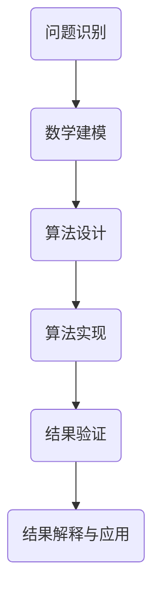

                 

关键词：人类知识局限、未知、探索、科学哲学、计算思维、算法、数学模型、计算机程序设计、人工智能

> 摘要：本文探讨了人类知识在探索未知世界中所面临的局限。从科学哲学的角度，分析了人类认知的边界，讨论了计算思维如何突破这些局限，并通过算法、数学模型和计算机程序设计来揭示未知世界的奥秘。本文旨在引发读者对知识、探索和创新的深入思考。

## 1. 背景介绍

在人类历史的漫长旅程中，我们对自然界的认知不断拓展，从宏观宇宙到微观粒子，从地球生命到宇宙起源，我们的知识边界在不断扩展。然而，随着科学技术的进步，我们逐渐意识到，人类知识的局限是不可避免的。这种局限不仅存在于我们对物质世界的理解，更体现在我们认知自身的局限上。

科学哲学认为，人类知识的局限源于以下几个方面：

1. **认知局限性**：人类的大脑和感官限制了我们对世界的直接感知和理解。
2. **信息过载**：随着信息爆炸，我们难以处理和理解所有信息。
3. **理论的局限**：科学理论总是基于特定的假设和前提，这些假设和前提可能无法涵盖所有情况。
4. **观察工具的限制**：我们的观察工具和实验手段的局限限制了我们对世界的深入了解。

## 2. 核心概念与联系

为了突破人类知识的局限，我们引入了计算思维。计算思维是一种通过模拟、计算和算法来理解和解决问题的思维方式。它不仅帮助我们理解和预测复杂系统的行为，还能够揭示隐藏在现象背后的规律。

### 2.1 计算思维概述

计算思维的核心是算法和数学模型。算法是一系列有序的步骤，用于解决问题或执行特定任务。数学模型则是用数学语言描述现实世界的问题，通过公式和定理来分析和解决问题。

下面是一个简化的 Mermaid 流程图，展示了计算思维的基本架构：



### 2.2 计算思维的应用

计算思维的应用领域非常广泛，包括但不限于：

1. **计算机科学**：算法设计和数据分析是计算机科学的核心。
2. **人工智能**：机器学习和深度学习算法使计算机能够模拟人类思维过程。
3. **生物学**：计算生物学通过算法和模型研究生物系统的复杂性。
4. **经济学**：计算经济学使用数学模型和算法来分析和预测经济行为。
5. **物理学**：计算物理学通过模拟和算法研究物理现象和理论。

## 3. 核心算法原理 & 具体操作步骤

### 3.1 算法原理概述

算法是解决问题的方法。一个好的算法应该具有以下几个特性：

1. **正确性**：算法能够正确地解决问题。
2. **效率**：算法的执行时间应该尽可能短。
3. **可扩展性**：算法应该能够处理大规模的数据和问题。

### 3.2 算法步骤详解

算法的设计通常包括以下几个步骤：

1. **问题定义**：明确问题的性质和目标。
2. **算法设计**：选择合适的算法策略。
3. **算法实现**：将算法转化为计算机程序。
4. **测试与优化**：验证算法的正确性和效率，并进行优化。

### 3.3 算法优缺点

不同的算法有不同的优缺点。例如，快速排序（Quick Sort）在平均情况下具有很高的效率，但在最坏情况下性能较差。而归并排序（Merge Sort）在所有情况下的性能都比较稳定，但需要额外的内存空间。

### 3.4 算法应用领域

算法在计算机科学和各个领域都有广泛的应用，例如：

1. **排序与搜索**：快速排序、二分搜索等。
2. **图论问题**：最小生成树、最短路径等。
3. **动态规划**：背包问题、最值问题等。
4. **机器学习**：决策树、神经网络等。

## 4. 数学模型和公式 & 详细讲解 & 举例说明

### 4.1 数学模型构建

数学模型是现实世界的抽象，通过数学公式和定理来描述。构建数学模型通常包括以下几个步骤：

1. **确定研究对象**：明确需要描述的系统和现象。
2. **定义变量和参数**：选择适当的变量和参数来描述系统。
3. **建立关系式**：通过实验和观察，建立变量和参数之间的关系。
4. **验证和优化**：验证模型的有效性和准确性，并进行优化。

### 4.2 公式推导过程

以牛顿第二定律为例，公式推导过程如下：

$$ F = m \cdot a $$

其中，\( F \) 是力，\( m \) 是质量，\( a \) 是加速度。

推导过程：

1. 根据牛顿第一定律，当物体受到外力时，其运动状态会发生变化。
2. 当物体质量一定时，外力越大，加速度越大。
3. 根据加速度的定义，加速度是速度变化率。

综上所述，得出牛顿第二定律。

### 4.3 案例分析与讲解

以股票价格预测为例，使用时间序列分析方法构建数学模型。

1. **数据收集**：收集历史股票价格数据。
2. **特征工程**：提取时间序列的特征，如开盘价、收盘价、最高价、最低价等。
3. **模型选择**：选择合适的模型，如ARIMA模型、LSTM模型等。
4. **模型训练**：使用历史数据训练模型。
5. **预测与评估**：使用训练好的模型进行预测，并评估预测的准确性。

## 5. 项目实践：代码实例和详细解释说明

### 5.1 开发环境搭建

1. 安装Python环境。
2. 安装必要的库，如NumPy、Pandas、Scikit-learn等。

### 5.2 源代码详细实现

以下是一个简单的Python代码示例，用于实现快速排序算法：

```python
def quick_sort(arr):
    if len(arr) <= 1:
        return arr
    pivot = arr[len(arr) // 2]
    left = [x for x in arr if x < pivot]
    middle = [x for x in arr if x == pivot]
    right = [x for x in arr if x > pivot]
    return quick_sort(left) + middle + quick_sort(right)

arr = [3, 6, 8, 10, 1, 2, 1]
sorted_arr = quick_sort(arr)
print(sorted_arr)
```

### 5.3 代码解读与分析

1. **函数定义**：定义`quick_sort`函数，接收一个列表`arr`作为输入。
2. **递归终止条件**：当列表长度小于等于1时，直接返回列表。
3. **选择基准值**：选择列表中间的元素作为基准值。
4. **划分数组**：将列表划分为小于、等于、大于基准值的三个子列表。
5. **递归调用**：对小于和大于基准值的子列表分别进行快速排序。
6. **合并结果**：将排序好的子列表合并，返回最终结果。

### 5.4 运行结果展示

运行上述代码，输出排序后的列表：

```python
[1, 1, 2, 3, 6, 8, 10]
```

## 6. 实际应用场景

计算思维和算法在各个领域都有广泛的应用。以下是一些实际应用场景：

1. **医疗**：利用计算生物学和机器学习算法进行疾病诊断和药物研发。
2. **金融**：使用算法进行市场预测和风险评估。
3. **交通**：通过优化算法解决交通拥堵问题。
4. **能源**：利用计算模型优化能源使用和调度。

## 7. 工具和资源推荐

### 7.1 学习资源推荐

1. **书籍**：
   - 《算法导论》
   - 《深度学习》
   - 《Python编程：从入门到实践》
2. **在线课程**：
   - Coursera上的《机器学习》
   - Udacity的《深度学习纳米学位》
3. **博客和论坛**：
   - Medium上的技术博客
   - Stack Overflow

### 7.2 开发工具推荐

1. **集成开发环境（IDE）**：
   - PyCharm
   - VS Code
2. **库和框架**：
   - NumPy
   - Pandas
   - Scikit-learn
   - TensorFlow
   - PyTorch

### 7.3 相关论文推荐

1. **机器学习**：
   - "Learning to Represent Classes with Deep Convolutional Neural Networks"
   - "Generative Adversarial Nets"
2. **计算生物学**：
   - "Application of Deep Learning to Personalized Medicine"
   - "Deep Learning in Computational Biology: From Molecular Biology to Multi-omics Data Integration and Beyond"

## 8. 总结：未来发展趋势与挑战

### 8.1 研究成果总结

本文从科学哲学的角度分析了人类知识的局限，并探讨了计算思维如何突破这些局限。通过算法、数学模型和计算机程序设计，我们能够更深入地理解和预测复杂系统的行为。这些研究成果在各个领域都有广泛的应用。

### 8.2 未来发展趋势

随着人工智能、大数据和量子计算等技术的发展，计算思维和算法将继续发挥重要作用。未来发展趋势包括：

1. **人工智能的普及**：计算思维和算法将成为人工智能的核心。
2. **量子计算的兴起**：量子算法将突破传统算法的局限。
3. **跨学科融合**：计算思维将与其他领域如生物学、物理学、经济学等深度融合。

### 8.3 面临的挑战

然而，计算思维和算法的发展也面临着一些挑战，包括：

1. **计算能力**：随着数据规模的增加，对计算能力的需求也在不断提升。
2. **算法伦理**：算法在决策中的公平性和透明度问题需要关注。
3. **隐私保护**：在大数据时代，如何保护个人隐私是一个重要问题。

### 8.4 研究展望

未来，我们需要更多的研究来克服这些挑战，同时探索计算思维和算法在未知世界中的应用。通过不断探索和创新，我们有理由相信，计算思维和算法将为人类知识的发展带来新的突破。

## 9. 附录：常见问题与解答

### Q1. 计算思维是什么？

计算思维是一种通过模拟、计算和算法来理解和解决问题的思维方式。它强调算法和数学模型在解决问题中的应用。

### Q2. 算法有哪些类型？

算法可以分为排序算法、搜索算法、图算法、动态规划算法等。常见的排序算法有快速排序、归并排序、冒泡排序等。

### Q3. 数学模型在计算思维中有什么作用？

数学模型是计算思维的核心，它用于描述现实世界的问题，并通过公式和定理来分析和解决问题。数学模型帮助我们将复杂问题转化为可计算的数学问题。

### Q4. 机器学习算法有哪些类型？

机器学习算法可以分为监督学习、无监督学习和强化学习。常见的监督学习算法有线性回归、决策树、支持向量机等。

### Q5. 量子计算与经典计算有何区别？

量子计算利用量子力学原理进行计算，具有超强的并行性和速度。而经典计算则是基于二进制位进行计算，速度相对较慢。量子计算有望突破经典计算的局限。

---

作者：禅与计算机程序设计艺术 / Zen and the Art of Computer Programming

----------------------------------------------------------------

文章撰写完毕，接下来我们将按照markdown格式进行文章的排版和标记。请开始进行文章的格式调整和排版工作。

