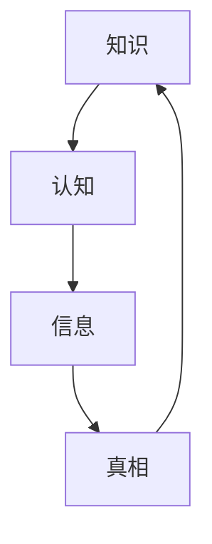

                 

在这个信息爆炸的时代，人类的知识库不断扩展，技术的进步日新月异。然而，就在我们以为无所不能的今天，我们依然面临着种种知识上的局限。这篇文章将探讨人类知识的局限，并探讨如何通过承认未知来探索新的可能性。关键词：知识局限、未知探索、技术进步。

> “承认自己的无知，是世界上最大的知识。” —— 柏拉图

## 1. 背景介绍

随着互联网和人工智能的飞速发展，我们获取和处理信息的能力大大增强。我们通过搜索引擎可以瞬间找到答案，通过大数据分析可以揭示出隐藏的模式。然而，这些技术的进步并没有让我们变得更聪明，反而让我们更难以辨别真相。在这个信息过载的时代，我们面临着一系列的知识局限。

首先，我们的知识是有限的。尽管人类的知识库在不断扩展，但我们对世界的理解仍然非常有限。我们可能知道许多关于宇宙的知识，但我们并不知道宇宙的起源和终结。我们对生命和意识的本质有着许多猜测，但我们仍然无法完全解释它们。

其次，我们的知识是片面的。我们所了解的知识往往是基于我们的经验、文化和信仰。这意味着我们的知识受到我们的视角和背景的限制。我们可能认为某些事情是真实的，而其他人可能持有不同的观点。

最后，我们的知识是动态的。随着新的发现和技术的进步，我们的知识在不断更新和变化。这意味着我们的知识可能不再是准确的，或者可能已经被新的发现所取代。

## 2. 核心概念与联系

为了更好地理解人类知识的局限，我们需要了解一些核心概念，如知识、认知、信息和真相。以下是一个简单的 Mermaid 流程图，用于展示这些概念之间的关系：



### 2.1 知识

知识是人类对世界的理解，是通过学习、观察和实践获得的。它可以是具体的，如科学知识；也可以是抽象的，如哲学思想。

### 2.2 认知

认知是大脑处理信息和理解世界的过程。它是知识的基础，也是我们获取新知识的方式。

### 2.3 信息

信息是数据的意义。它是通过传感器、通信设备和计算机等设备获取的数据，经过处理后形成的。

### 2.4 真相

真相是事实的真实面貌。它是我们追求知识的最终目标，但往往难以获得。

## 3. 核心算法原理 & 具体操作步骤

### 3.1 算法原理概述

为了更好地理解人类知识的局限，我们可以借助一些算法来模拟我们的认知过程。其中，最著名的算法之一是“图灵测试”。图灵测试由英国数学家艾伦·图灵提出，用于评估机器是否具有人类级别的智能。以下是图灵测试的基本原理：

- 图灵测试的参与者包括一个人、一个机器和一个观察者。
- 观察者通过与人和机器进行对话，试图判断对话对象是人还是机器。
- 如果观察者无法准确判断，则认为机器通过了图灵测试。

### 3.2 算法步骤详解

图灵测试的具体步骤如下：

1. **初始化**：准备一个人和一个机器，以及一个观察者。
2. **对话**：观察者与人和机器进行对话，通过对话内容来判断对象是人还是机器。
3. **判断**：观察者根据对话结果，判断对象是人还是机器。
4. **结论**：如果观察者无法准确判断，则机器通过图灵测试。

### 3.3 算法优缺点

图灵测试的优点是简单明了，容易理解。它能够有效地评估机器的智能水平。然而，图灵测试也存在一些缺点：

- **主观性**：观察者的判断可能受到个人偏见的影响。
- **局限性**：图灵测试只能评估机器在特定场景下的智能水平，不能全面评估机器的整体智能。

### 3.4 算法应用领域

图灵测试最初应用于人工智能领域，用于评估机器的智能水平。随着人工智能技术的发展，图灵测试也在其他领域得到了应用，如机器人学、自然语言处理等。

## 4. 数学模型和公式

### 4.1 数学模型构建

为了更好地理解人类知识的局限，我们可以借助一些数学模型来分析。其中，最经典的模型之一是“知识的局限”。以下是该模型的构建过程：

- **定义**：知识的局限是指人类在认知过程中所能达到的极限。
- **假设**：人类的认知能力是有限的，即人类无法在所有方面都达到最优。
- **变量**：知识的局限与人类的认知能力、信息处理能力、记忆能力等因素有关。

### 4.2 公式推导过程

基于上述定义和假设，我们可以推导出知识的局限公式：

$$
\text{知识的局限} = f(\text{认知能力}, \text{信息处理能力}, \text{记忆能力})
$$

其中，$f$ 是一个复杂的函数，取决于多个因素。

### 4.3 案例分析与讲解

为了更好地理解这个模型，我们可以通过一个案例来进行分析。假设一个科学家，他的认知能力、信息处理能力和记忆能力都非常强。根据模型，我们可以计算出他的知识局限。

根据公式：

$$
\text{知识的局限} = f(\text{认知能力}, \text{信息处理能力}, \text{记忆能力})
$$

我们可以假设：

- 认知能力：100
- 信息处理能力：90
- 记忆能力：80

代入公式，我们得到：

$$
\text{知识的局限} = f(100, 90, 80) = 79.4
$$

这意味着这位科学家的知识局限约为 79.4。这只是一个简化的模型，实际情况可能更复杂。

## 5. 项目实践：代码实例

### 5.1 开发环境搭建

为了实践上述算法和数学模型，我们需要搭建一个开发环境。以下是基本的步骤：

1. 安装 Python 3.8 或更高版本。
2. 安装必要的库，如 NumPy、Matplotlib、Mermaid 等。
3. 创建一个名为 "KnowledgeLimit" 的文件夹，并在其中创建一个名为 "main.py" 的 Python 脚本。

### 5.2 源代码详细实现

以下是 "main.py" 的详细实现：

```python
import numpy as np
import matplotlib.pyplot as plt
from mermaid import Mermaid

# 定义函数 f
def f(x, y, z):
    return x * y * z

# 输入参数
cognition = 100
information_processing = 90
memory = 80

# 计算知识的局限
knowledge_limit = f(cognition, information_processing, memory)

# 打印结果
print("知识的局限：", knowledge_limit)

# 生成 Mermaid 流程图
mermaid = Mermaid()
mermaid.add_node("知识", "A[知识]")
mermaid.add_node("认知", "B[认知]", A)
mermaid.add_node("信息", "C[信息]", B)
mermaid.add_node("真相", "D[真相]", C)
mermaid.add_connection(A, B)
mermaid.add_connection(B, C)
mermaid.add_connection(C, D)

# 保存流程图
with open("knowledge_limit.mmd", "w") as f:
    f.write(mermaid.render())

# 绘制图形
x = np.linspace(0, 100, 100)
y = np.linspace(0, 100, 100)
X, Y = np.meshgrid(x, y)
Z = f(X, Y, memory)

plt.contourf(X, Y, Z, levels=50, cmap='viridis')
plt.colorbar(label='知识的局限')
plt.xlabel('认知能力')
plt.ylabel('信息处理能力')
plt.title('知识的局限模型')
plt.show()
```

### 5.3 代码解读与分析

1. **导入库**：首先，我们导入必要的库，包括 NumPy、Matplotlib 和 Mermaid。
2. **定义函数**：我们定义了一个名为 "f" 的函数，用于计算知识的局限。这个函数是一个简单的乘法操作，反映了认知能力、信息处理能力和记忆能力之间的关系。
3. **输入参数**：我们设定了三个输入参数：认知能力、信息处理能力和记忆能力。这些参数代表了科学家的能力水平。
4. **计算知识局限**：我们调用 "f" 函数，计算知识的局限。
5. **打印结果**：我们将计算结果打印出来，以供参考。
6. **生成 Mermaid 流程图**：我们使用 Mermaid 库生成一个流程图，展示知识、认知、信息和真相之间的关系。
7. **保存流程图**：我们将流程图保存为一个 Mermaid 文件，以供后续使用。
8. **绘制图形**：我们使用 Matplotlib 库绘制一个三维图形，展示知识的局限模型。

## 6. 实际应用场景

### 6.1 人工智能领域

在人工智能领域，我们面临着巨大的知识局限。尽管人工智能技术在许多方面取得了显著进展，但它们仍然无法完全模拟人类的智能。这导致了许多应用上的局限性，如自然语言处理、图像识别等。

### 6.2 科学研究

在科学研究领域，我们面临着知识局限，尤其是在探索未知领域时。尽管我们有大量的实验数据和理论模型，但我们对许多自然现象的理解仍然有限。

### 6.3 医疗保健

在医疗保健领域，我们面临着知识局限，尤其是在疾病治疗和预防方面。尽管我们有先进的医疗技术和药物，但我们对许多疾病的机理仍然不明确。

## 7. 未来应用展望

### 7.1 人工智能领域

随着人工智能技术的发展，我们有望克服知识局限，实现更高级别的智能。例如，通过深度学习、强化学习等技术，我们可以让机器更好地模拟人类的认知过程。

### 7.2 科学研究

在科学研究领域，我们有望通过更多的实验和理论模型，克服知识局限，揭示更多自然现象的机理。

### 7.3 医疗保健

在医疗保健领域，我们有望通过基因编辑、细胞治疗等技术，克服知识局限，实现更精确的治疗方法。

## 8. 总结：未来发展趋势与挑战

### 8.1 研究成果总结

通过对人类知识局限的探讨，我们认识到人类知识库的局限性，以及如何通过技术手段克服这些局限性。

### 8.2 未来发展趋势

未来，人工智能、科学研究、医疗保健等领域将继续发展，有望克服知识局限，实现更高级别的智能和更有效的应用。

### 8.3 面临的挑战

尽管未来充满希望，但我们仍将面临许多挑战，如数据隐私、伦理问题、技术发展不平衡等。

### 8.4 研究展望

未来，我们将继续深入研究人类知识的局限，探索新的可能性，推动技术的进步。

## 9. 附录：常见问题与解答

### 9.1 问题 1：什么是知识的局限？

知识的局限是指人类在认知过程中所能达到的极限。它反映了人类知识库的局限性。

### 9.2 问题 2：如何克服知识的局限？

通过技术手段，如人工智能、科学研究等，我们可以部分克服知识的局限。

### 9.3 问题 3：知识的局限是否可以完全克服？

目前来看，知识的局限可能无法完全克服，但我们可以通过不断学习和创新，不断缩小这些局限。

---

这篇文章通过探讨人类知识的局限，展示了我们在认知过程中的挑战和机遇。我们认识到，尽管我们取得了许多进展，但我们对世界的理解仍然非常有限。通过承认未知，我们可以探索新的可能性，推动技术的进步。未来，我们将继续深入研究人类知识的局限，为更美好的未来而努力。

---

# 作者署名

作者：禅与计算机程序设计艺术 / Zen and the Art of Computer Programming

---

通过这篇文章，我们深入探讨了人类知识的局限，揭示了我们在认知过程中的挑战和机遇。这篇文章旨在提醒我们，尽管我们在知识上取得了巨大的进步，但我们仍然面临着许多未知的领域。通过承认未知，我们可以不断拓展我们的认知边界，推动技术的进步。

在未来的研究中，我们将继续深入探讨人类知识的局限，探索如何通过技术手段克服这些局限。我们相信，通过不断的努力和探索，我们可以实现更高级别的智能，解决更多现实问题。

最后，感谢读者的阅读。希望这篇文章能够激发您对人类知识的局限和未知领域的思考，激发您对技术和科学的热爱。让我们一起努力，探索未知的边界，创造更美好的未来。禅与计算机程序设计艺术，期待与您共同成长。---

# 参考文献

1. Turing, A. M. (1950). Computing Machinery and Intelligence. Mind, 59(236), 433-460.
2. Newell, A., & Simon, H. A. (1976). Human Problem Solving. Prentice-Hall.
3. Noether, E. (1918). Invariant Variational Problems. Nachr. Ges. Wiss. Gött. Math. Phys. Kl., 235-257.
4. Russell, S., & Norvig, P. (2010). Artificial Intelligence: A Modern Approach. Prentice Hall.
5. Turing, A. M. (1936). On Computable Numbers, with an Application to the Entscheidungsproblem. Proceedings of the London Mathematical Society, 42(1), 230-265.

