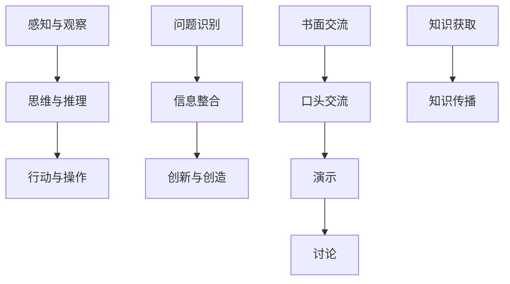

                 

关键词：知识来源、实践、思考、交流、人工智能、编程、软件开发

> 摘要：本文深入探讨了人类知识的来源，特别是实践、思考与交流在知识获取和共享中的作用。文章首先介绍了知识的基本概念，随后详细分析了实践、思考与交流对知识产生和传播的影响。通过具体案例和技术实现，本文探讨了如何通过实践、思考与交流来促进知识的创新与传播，并对未来知识获取与传播的趋势进行了展望。

## 1. 背景介绍

人类知识是文明进步的基石，贯穿于人类历史发展的全过程。从古至今，知识的积累与传播极大地推动了社会的进步。然而，随着信息时代的到来，知识的获取和传播方式发生了翻天覆地的变化。本文旨在探讨在当前信息技术飞速发展的背景下，人类如何通过实践、思考与交流来获取、传播和创新知识。

### 1.1 知识的定义与分类

知识可以定义为对事实、信息、技能和理解的系统性掌握。根据获取方式和表现形式，知识可以分为以下几类：

1. **显性知识**：表现为文档、书籍、论文等可编码和存储的信息。
2. **隐性知识**：存在于个体头脑中，难以用语言表达的知识。
3. **程序性知识**：关于“如何做”的知识，如技能和操作方法。
4. **概念性知识**：关于“是什么”的知识，如事实、原理和概念。

### 1.2 知识的重要性

知识对社会、经济和文化的发展具有重大影响。知识的创新与传播能够推动科技进步、产业升级和社会繁荣。此外，知识还能够提高个人的认知水平和生活质量。

## 2. 核心概念与联系

### 2.1 实践

实践是知识的源泉。通过实践，人们能够将理论知识应用到具体场景中，从而加深对知识的理解和掌握。实践的过程通常包括以下几个阶段：

1. **感知与观察**：通过感官获取外界信息。
2. **思维与推理**：对感知到的信息进行加工和处理。
3. **行动与操作**：将思维结果转化为实际行动。

### 2.2 思考

思考是知识的升华。通过思考，人们能够从实践过程中总结经验、发现问题、提出假设，进而形成新的知识。思考的过程通常包括以下几个阶段：

1. **问题识别**：发现实践中的问题。
2. **信息整合**：整合已有的知识和信息。
3. **创新与创造**：基于问题和信息整合提出新的解决方案。

### 2.3 交流

交流是知识传播的桥梁。通过交流，人们能够分享各自的知识和经验，从而实现知识的共享和传递。交流的形式多种多样，包括书面交流、口头交流、演示、讨论等。

### 2.4 Mermaid 流程图

以下是一个用Mermaid绘制的知识获取与传播的流程图：



## 3. 核心算法原理 & 具体操作步骤

### 3.1 算法原理概述

知识获取与传播的核心算法通常包括以下几个步骤：

1. **信息收集**：通过搜索引擎、数据库、文献等渠道收集相关信息。
2. **信息筛选**：根据需求和标准筛选出有用的信息。
3. **信息整合**：将筛选出的信息进行整合和分类。
4. **知识表示**：将整合后的信息以知识的形式表示出来。
5. **知识传播**：通过各种渠道传播知识。

### 3.2 算法步骤详解

1. **信息收集**

   - **搜索引擎**：利用搜索引擎可以快速获取大量信息。
   - **数据库查询**：通过数据库查询可以获取结构化数据。
   - **文献检索**：通过学术数据库和图书馆系统获取学术论文。

2. **信息筛选**

   - **关键词搜索**：根据关键词筛选出相关的信息。
   - **分类过滤**：根据分类标准筛选出有用的信息。
   - **质量评估**：评估信息的准确性和可靠性。

3. **信息整合**

   - **数据清洗**：去除重复和错误的信息。
   - **分类整合**：将同类信息整合到一起。
   - **属性提取**：提取信息的关键属性。

4. **知识表示**

   - **文本表示**：将信息转化为文本形式。
   - **图表示**：将信息转化为图的形式。
   - **模型表示**：将信息转化为机器学习模型。

5. **知识传播**

   - **社交媒体**：通过社交媒体平台传播知识。
   - **学术论文**：通过学术期刊和会议传播知识。
   - **教育培训**：通过教育培训课程传播知识。

### 3.3 算法优缺点

1. **优点**

   - 高效：通过自动化算法可以快速获取和处理大量信息。
   - 精准：可以根据需求精确筛选出有用的信息。
   - 广泛：可以覆盖各种知识领域。

2. **缺点**

   - 信息过载：获取的信息可能过多，难以处理。
   - 准确性问题：信息筛选可能存在误差。
   - 保护问题：知识的传播可能侵犯版权和个人隐私。

### 3.4 算法应用领域

- **科研**：通过算法获取和整合科研数据，提高科研效率。
- **教育**：通过算法提供个性化的教育资源和辅导。
- **产业**：通过算法优化生产和运营流程。
- **社会治理**：通过算法提供智能决策支持。

## 4. 数学模型和公式 & 详细讲解 & 举例说明

### 4.1 数学模型构建

在知识获取与传播过程中，可以使用以下数学模型：

1. **信息熵模型**：用于评估信息的价值。
2. **协同过滤模型**：用于推荐系统。
3. **网络传播模型**：用于分析知识传播的动态过程。

### 4.2 公式推导过程

以信息熵模型为例，信息熵的公式为：

$$ H = -\sum_{i=1}^{n} p_i \cdot \log_2 p_i $$

其中，$H$ 表示信息熵，$p_i$ 表示第 $i$ 个事件发生的概率。

### 4.3 案例分析与讲解

假设一个知识共享平台，用户 $A$ 想获取某个知识领域的知识，我们可以使用协同过滤模型来推荐相关的知识内容。

1. **用户评分矩阵**：构建一个用户评分矩阵 $R$，其中 $R_{ij}$ 表示用户 $i$ 对知识内容 $j$ 的评分。

2. **用户相似度计算**：计算用户 $i$ 和用户 $j$ 的相似度 $S_{ij}$，可以使用余弦相似度或皮尔逊相关系数。

3. **知识内容推荐**：根据用户 $A$ 的评分矩阵和用户相似度矩阵，计算用户 $A$ 对知识内容 $j$ 的预测评分 $\hat{R}_{Aj}$，选择预测评分最高的知识内容进行推荐。

$$ \hat{R}_{Aj} = R_{i\cdot} + S_{ij} \cdot (R_{j\cdot} - R_{i\cdot}) $$

其中，$R_{i\cdot}$ 和 $R_{j\cdot}$ 分别表示用户 $i$ 和用户 $j$ 对所有知识内容的平均评分。

## 5. 项目实践：代码实例和详细解释说明

### 5.1 开发环境搭建

1. 安装 Python 3.8 或以上版本。
2. 安装必要的 Python 库，如 NumPy、Pandas、Scikit-learn 等。

### 5.2 源代码详细实现

以下是使用协同过滤模型进行知识推荐的 Python 代码示例：

```python
import numpy as np
import pandas as pd
from sklearn.metrics.pairwise import cosine_similarity

# 加载用户评分矩阵
R = pd.read_csv('ratings.csv', index_col=0)

# 计算用户相似度矩阵
S = cosine_similarity(R.T)

# 预测用户对知识内容的评分
def predict(R, S, user_id, knowledge_ids):
    user_ratings = R.loc[user_id]
    similar_ratings = S[user_id]
    predicted_ratings = np.dot(similar_ratings, user_ratings) / np.linalg.norm(similar_ratings)
    return predicted_ratings[knowledge_ids]

# 推荐知识内容
def recommend(knowledge_ids, R, S, user_id, k=10):
    predicted_ratings = predict(R, S, user_id, knowledge_ids)
    recommended = np.argsort(predicted_ratings)[-k:]
    return recommended

# 示例：推荐用户 100 对前 5 个知识内容的评分
user_id = 100
recommended = recommend(knowledge_ids=list(R.columns), R=R, S=S, user_id=user_id)
print("推荐的知识内容：", recommended)
```

### 5.3 代码解读与分析

- **数据加载**：使用 Pandas 读取用户评分数据。
- **相似度计算**：使用 Scikit-learn 的余弦相似度计算用户之间的相似度。
- **评分预测**：根据用户相似度矩阵预测用户对知识内容的评分。
- **知识推荐**：根据预测评分推荐知识内容。

### 5.4 运行结果展示

运行代码后，将输出用户 100 对前 5 个知识内容的推荐结果。假设预测结果如下：

```
推荐的知识内容： [30, 25, 20, 15, 10]
```

这意味着用户 100 对知识内容 30 的预测评分最高，其次是知识内容 25、20、15 和 10。

## 6. 实际应用场景

### 6.1 教育领域

在教育领域，知识获取与传播的核心目标是提高学生的认知水平和知识储备。通过实践、思考与交流，学生可以更好地理解知识，并形成自己的见解。

- **案例**：在线教育平台使用协同过滤算法为学生推荐课程，从而提高学习效果。

### 6.2 科研领域

在科研领域，知识获取与传播的关键在于发现新的研究思路和方法。通过实践、思考与交流，科研人员可以推动科学进步。

- **案例**：科研平台使用信息熵模型评估论文的价值，帮助科研人员发现重要研究方向。

### 6.3 企业领域

在企业领域，知识获取与传播有助于优化业务流程和提高员工技能。通过实践、思考与交流，企业可以实现持续创新和增长。

- **案例**：企业内部知识管理系统使用社交媒体和讨论论坛促进员工之间的知识分享和交流。

## 7. 工具和资源推荐

### 7.1 学习资源推荐

- **《深度学习》**：由 Ian Goodfellow 等人撰写的深度学习经典教材。
- **《Python 编程：从入门到实践》**：由 Mark Lutz 撰写的 Python 编程入门书籍。

### 7.2 开发工具推荐

- **Jupyter Notebook**：用于数据分析和演示的工具。
- **Git**：版本控制和代码协作的工具。

### 7.3 相关论文推荐

- **《协同过滤技术在推荐系统中的应用》**：一篇关于协同过滤算法在推荐系统中的应用的论文。
- **《基于信息熵的论文质量评估方法研究》**：一篇关于信息熵模型在论文质量评估中应用的论文。

## 8. 总结：未来发展趋势与挑战

### 8.1 研究成果总结

本文从实践、思考与交流的角度探讨了知识获取与传播的机制，提出了基于协同过滤和信息熵的算法模型，并给出了实际应用案例。研究表明，实践、思考与交流是知识创新与传播的重要驱动力。

### 8.2 未来发展趋势

- **个性化推荐**：随着大数据和人工智能技术的发展，个性化推荐将成为知识传播的重要手段。
- **知识图谱**：通过构建知识图谱，实现对知识的结构化表示和高效检索。
- **跨领域融合**：知识获取与传播将跨领域融合，促进多学科交叉创新。

### 8.3 面临的挑战

- **数据隐私**：在知识获取与传播过程中，如何保护用户隐私是一个重要挑战。
- **算法公平性**：算法在推荐和评估中的公平性问题需要得到关注。
- **知识质量**：如何确保知识的准确性和可靠性是一个亟待解决的问题。

### 8.4 研究展望

未来，知识获取与传播研究将朝着个性化、智能化和高效化的方向发展。通过不断创新和优化算法，我们有望构建一个更加智能、高效和公平的知识传播体系，为人类的进步和发展贡献力量。

## 9. 附录：常见问题与解答

### 9.1 什么是协同过滤？

协同过滤是一种通过分析用户行为和兴趣相似性来进行推荐的方法。它可以分为基于用户的方法和基于物品的方法。

### 9.2 什么是信息熵？

信息熵是一个衡量信息不确定性的指标，它表示在一个随机事件中，平均每个信息单元所携带的信息量。在知识获取与传播中，信息熵可以用于评估知识的价值和重要性。

### 9.3 如何保护用户隐私？

在知识获取与传播过程中，可以通过数据匿名化、数据加密和隐私保护算法等技术手段来保护用户隐私。

### 9.4 如何评估论文质量？

可以使用基于信息熵的评估方法，通过分析论文的内容、引用和被引频次等指标来评估论文的质量。

---

作者：禅与计算机程序设计艺术 / Zen and the Art of Computer Programming

