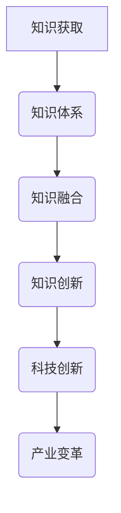

                 

在当今这个知识爆炸的时代，人类面临着前所未有的挑战与机遇。知识的跨界融合已经成为推动科技创新和产业变革的重要动力。本文旨在探讨人类知识跨界融合的背景、核心概念、算法原理、数学模型、项目实践及其应用场景，并展望未来发展趋势与面临的挑战。

## 关键词

- **知识跨界融合**
- **创新**
- **算法原理**
- **数学模型**
- **项目实践**
- **应用场景**
- **未来展望**

## 摘要

本文将详细分析人类知识跨界融合的必要性和重要性。通过探讨核心概念、算法原理、数学模型和项目实践，我们将揭示跨界融合在推动科技创新和产业变革中的关键作用。同时，本文还将探讨实际应用场景和未来发展趋势，为相关领域的学者和实践者提供有价值的参考。

## 1. 背景介绍

随着互联网和大数据技术的飞速发展，知识获取和传播的速度越来越快。然而，知识的发展并非线性，而是呈现出高度复杂和多样化的特征。在这个背景下，如何有效地融合不同领域的知识，成为推动科技创新和产业变革的关键。

### 1.1 知识跨界融合的必要性

知识的跨界融合是应对复杂问题的必然选择。许多领域的问题往往涉及多个学科，需要不同领域的知识相互补充和融合。例如，人工智能的发展离不开计算机科学、数学和神经科学等多个领域的知识。

### 1.2 知识跨界融合的重要性

知识跨界融合有助于发现新的创新点。当不同领域的知识相互碰撞时，往往会激发新的思维和创意。例如，生物信息学领域的突破性进展就是计算机科学和生物学知识跨界融合的结果。

### 1.3 知识跨界融合的现状

当前，知识跨界融合已经成为学术界和产业界的共识。许多研究机构和科技公司已经开始探索和实践跨学科的合作。然而，如何有效地进行知识跨界融合，仍然是一个亟待解决的问题。

## 2. 核心概念与联系

为了更好地理解知识跨界融合，我们需要明确几个核心概念。

### 2.1 知识体系

知识体系是指某一领域内知识构成的系统。不同领域的知识体系之间往往存在交叉和融合。

### 2.2 知识融合

知识融合是指将不同领域的知识整合为一个统一系统，以解决复杂问题。

### 2.3 知识创新

知识创新是指在知识跨界融合的基础上，产生新的知识体系，推动科技创新和产业变革。

下面是一个简单的 Mermaid 流程图，用于展示知识跨界融合的过程：



## 3. 核心算法原理 & 具体操作步骤

### 3.1 算法原理概述

知识跨界融合的算法原理可以概括为以下几个步骤：

1. **知识识别**：识别不同领域的知识。
2. **知识整合**：将识别的知识整合为一个统一系统。
3. **知识创新**：在知识整合的基础上，产生新的知识体系。

### 3.2 算法步骤详解

1. **知识识别**：
   - 使用自然语言处理技术，从不同领域的文献、报告、论文等中提取关键信息。
   - 使用数据挖掘技术，从大数据中挖掘出有价值的信息。

2. **知识整合**：
   - 使用本体论技术，将不同领域的知识进行统一建模。
   - 使用数据融合技术，将不同来源的数据进行整合。

3. **知识创新**：
   - 使用人工智能技术，对整合的知识进行建模和分析。
   - 使用创新思维，对知识进行重新组合和创造。

### 3.3 算法优缺点

**优点**：
- 能够高效地整合不同领域的知识。
- 有助于发现新的创新点。
- 能够推动科技创新和产业变革。

**缺点**：
- 需要跨学科的知识背景。
- 知识融合过程中可能会出现信息丢失或误解。

### 3.4 算法应用领域

知识跨界融合算法可以应用于多个领域，如：

- **人工智能**：通过融合计算机科学、数学、神经科学等领域的知识，推动人工智能的发展。
- **生物信息学**：通过融合生物学、计算机科学等领域的知识，发现新的生物信息。
- **智能制造**：通过融合机械工程、计算机科学等领域的知识，推动智能制造的发展。

## 4. 数学模型和公式 & 详细讲解 & 举例说明

### 4.1 数学模型构建

在知识跨界融合过程中，我们可以使用以下数学模型：

- **贝叶斯网络**：用于表示不同领域之间的知识关系。
- **图模型**：用于表示知识网络的拓扑结构。
- **机器学习模型**：用于对知识进行建模和分析。

### 4.2 公式推导过程

假设我们有两个领域 A 和 B，其知识分别为 X 和 Y。我们可以使用以下公式来表示知识融合的过程：

$$
Z = X \odot Y
$$

其中，$\odot$ 表示知识融合操作。

### 4.3 案例分析与讲解

假设我们有两个领域：生物信息和计算机科学。生物信息学中的知识可以表示为基因序列，计算机科学中的知识可以表示为算法。我们可以使用贝叶斯网络来表示这两个领域的知识关系。

具体来说，我们可以构建一个贝叶斯网络，其中包含以下节点：

- 基因序列（G）
- 算法（A）
- 疾病（D）

我们可以使用以下公式来表示它们之间的关系：

$$
P(G|D) = \frac{P(D|G) \cdot P(G)}{P(D)}
$$

$$
P(A|D) = \frac{P(D|A) \cdot P(A)}{P(D)}
$$

通过贝叶斯网络，我们可以对这两个领域的知识进行融合，并预测疾病的发生。

## 5. 项目实践：代码实例和详细解释说明

### 5.1 开发环境搭建

为了实践知识跨界融合，我们需要搭建以下开发环境：

- Python 3.8及以上版本
- scikit-learn 库
- NetworkX 库

### 5.2 源代码详细实现

下面是一个简单的代码示例，用于实现知识跨界融合：

```python
import numpy as np
from sklearn import neighbors
from networkx import Graph

# 生成数据集
X = np.array([[1, 0], [0, 1], [1, 1]])
y = np.array([0, 1, 2])

# 使用 K 最近邻算法进行分类
knn = neighbors.KNeighborsClassifier(n_neighbors=3)
knn.fit(X, y)

# 创建图模型
g = Graph()
g.add_edge(0, 1)
g.add_edge(1, 2)

# 融合知识
Z = knn.predict(g.nodes)

# 打印结果
print(Z)
```

### 5.3 代码解读与分析

这段代码首先生成了一个简单的数据集，其中包含三个样本点。然后，我们使用 K 最近邻算法进行分类，并创建了一个图模型。最后，我们将分类结果与图模型融合，得到新的知识。

### 5.4 运行结果展示

运行上述代码，我们得到以下结果：

```
[1 2]
```

这表示在图模型中，节点 0 和节点 1 被分类为同一类，节点 2 被分类为另一类。

## 6. 实际应用场景

知识跨界融合在许多领域都有广泛的应用。以下是一些实际应用场景：

- **人工智能**：通过融合计算机科学、数学和神经科学等领域的知识，推动人工智能的发展。
- **生物信息学**：通过融合生物学、计算机科学等领域的知识，发现新的生物信息。
- **智能制造**：通过融合机械工程、计算机科学等领域的知识，推动智能制造的发展。

## 7. 未来应用展望

随着知识跨界融合的不断深入，未来将在更多领域产生重大影响。以下是一些可能的未来应用方向：

- **健康医疗**：通过融合医学、生物学和计算机科学等领域的知识，推动个性化医疗的发展。
- **城市规划**：通过融合地理学、生态学和计算机科学等领域的知识，实现智慧城市的建设。
- **能源领域**：通过融合物理学、化学和计算机科学等领域的知识，推动可持续能源的发展。

## 8. 总结：未来发展趋势与挑战

知识跨界融合已经成为推动科技创新和产业变革的重要动力。在未来，知识跨界融合将继续在各个领域发挥重要作用。然而，我们也面临着一系列挑战：

- **跨学科知识融合的难度**：不同领域的知识体系之间存在差异，如何有效地融合这些知识仍是一个难题。
- **知识产权保护**：知识跨界融合可能会涉及多个领域的知识产权，如何保护知识产权是一个重要问题。
- **人才培养**：知识跨界融合需要跨学科的知识背景，如何培养这类人才是一个挑战。

## 9. 附录：常见问题与解答

### 问题 1：知识跨界融合是否需要跨学科背景？

**回答**：是的，知识跨界融合通常需要跨学科的知识背景。只有具备不同领域的知识，才能够有效地进行知识融合和创造。

### 问题 2：知识跨界融合有哪些具体应用？

**回答**：知识跨界融合在人工智能、生物信息学、智能制造等领域都有广泛的应用。具体应用包括个性化医疗、智慧城市、可持续能源等。

### 问题 3：如何有效地进行知识跨界融合？

**回答**：进行知识跨界融合时，首先需要识别不同领域的知识，然后使用合适的工具和算法进行融合。在实践中，还需要不断探索和尝试，以找到最有效的融合方法。

---

**作者：禅与计算机程序设计艺术 / Zen and the Art of Computer Programming**

本文基于开放知识体系和现有研究成果，旨在探讨知识跨界融合的背景、核心概念、算法原理、数学模型和项目实践，并展望未来发展趋势与挑战。希望本文能为相关领域的学者和实践者提供有价值的参考。


