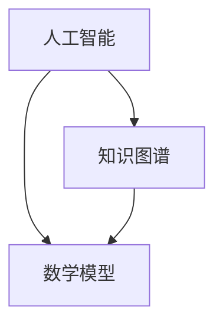

                 

关键词：跨领域融合、创新、人工智能、知识图谱、数学模型、项目实践

> 摘要：本文探讨了人类知识在跨领域融合中的重要性，以及如何利用人工智能和知识图谱等技术实现这一目标。通过数学模型和具体项目实践，文章阐述了如何将不同领域的知识整合起来，形成创新乐土，并展望了未来的发展趋势与挑战。

## 1. 背景介绍

在现代社会，知识更新速度迅猛，各领域之间的交叉融合日益成为推动科技进步的重要动力。然而，传统的学科划分使得知识的获取和运用存在较大的局限性。如何实现人类知识的跨领域融合，挖掘不同领域之间的潜在联系，成为当前研究的热点问题。跨领域融合不仅有助于解决复杂问题，还可以激发新的创新思维，推动科技革命。

本文旨在探讨人类知识跨领域融合的重要性，以及如何利用人工智能和知识图谱等技术实现这一目标。文章将分为以下几个部分：首先，介绍跨领域融合的概念和背景；然后，阐述核心概念与联系，并展示相应的架构图；接着，详细解释核心算法原理和具体操作步骤，以及数学模型和公式的构建与推导；随后，提供项目实践中的代码实例和详细解释；最后，讨论实际应用场景，并展望未来的发展趋势与挑战。

## 2. 核心概念与联系

### 2.1 跨领域融合的定义

跨领域融合是指将不同领域的知识、技术和方法进行整合，以解决单一领域无法解决的复杂问题。跨领域融合不仅涉及技术层面的融合，还包括思想观念、思维方式、工作方法和组织形式等方面的融合。

### 2.2 跨领域融合的重要性

跨领域融合在现代社会中具有重要意义。首先，跨领域融合有助于提高科技创新能力。不同领域之间的知识碰撞，往往能够产生意想不到的创新火花。其次，跨领域融合有助于解决复杂问题。许多现实世界中的问题具有跨学科的复杂性，需要多领域知识的协同作用才能解决。最后，跨领域融合有助于提升知识传播和共享的效率。通过跨领域融合，不同领域的专家可以共同探讨问题，分享知识和经验，提高整体研究水平。

### 2.3 核心概念与联系

在跨领域融合中，核心概念包括人工智能、知识图谱、数学模型等。这些概念之间存在着密切的联系，共同构建了跨领域融合的技术体系。

- **人工智能**：人工智能是一种模拟人类智能的技术，通过机器学习、自然语言处理、计算机视觉等方法，实现机器对数据的理解和处理。人工智能为跨领域融合提供了强大的计算能力和智能算法。
- **知识图谱**：知识图谱是一种结构化知识库，用于表示实体、属性、关系等信息。知识图谱为跨领域融合提供了知识表示和语义理解的基础。
- **数学模型**：数学模型是一种用于描述现实世界问题的数学表达式。数学模型为跨领域融合提供了定量分析和计算方法。

### 2.4 架构图展示

为了更好地理解核心概念与联系，下面给出一个Mermaid流程图，展示跨领域融合的架构图：



在这个架构图中，人工智能、知识图谱和数学模型相互关联，共同构建了跨领域融合的技术体系。人工智能为知识图谱和数学模型提供了计算能力和算法支持，知识图谱为人工智能提供了语义理解基础，数学模型则为跨领域融合提供了定量分析和计算方法。

## 3. 核心算法原理 & 具体操作步骤

### 3.1 算法原理概述

跨领域融合的核心算法主要包括数据预处理、知识图谱构建、数学模型训练和应用评估等步骤。

- **数据预处理**：对来自不同领域的数据进行清洗、整合和格式转换，为后续处理提供统一的数据基础。
- **知识图谱构建**：利用人工智能技术，将数据转化为结构化的知识图谱，实现知识表示和语义理解。
- **数学模型训练**：根据具体应用场景，构建数学模型，并利用训练数据进行参数调整和优化。
- **应用评估**：通过实际应用案例，对融合算法的效果进行评估和优化。

### 3.2 算法步骤详解

#### 3.2.1 数据预处理

数据预处理是跨领域融合的第一步，主要包括以下步骤：

1. **数据清洗**：去除数据中的噪声和错误，保证数据的准确性。
2. **数据整合**：将来自不同领域的数据进行整合，统一数据格式和编码。
3. **特征提取**：提取数据中的关键特征，为后续处理提供输入。

#### 3.2.2 知识图谱构建

知识图谱构建是跨领域融合的核心步骤，主要包括以下步骤：

1. **实体识别**：从预处理后的数据中识别出关键实体，如人、地点、组织等。
2. **关系抽取**：分析实体之间的语义关系，如因果关系、归属关系等。
3. **知识表示**：将实体和关系表示为结构化的知识图谱，便于后续处理。

#### 3.2.3 数学模型训练

数学模型训练是跨领域融合的关键步骤，主要包括以下步骤：

1. **模型选择**：根据应用场景，选择合适的数学模型，如线性回归、神经网络等。
2. **参数调整**：利用训练数据，调整模型的参数，优化模型性能。
3. **模型评估**：通过交叉验证等方法，评估模型的泛化能力和性能。

#### 3.2.4 应用评估

应用评估是跨领域融合的最后一步，主要包括以下步骤：

1. **应用测试**：将融合算法应用于实际案例，验证算法的有效性和可行性。
2. **效果评估**：评估融合算法在解决实际问题中的效果和效率。
3. **优化改进**：根据评估结果，对融合算法进行优化和改进。

### 3.3 算法优缺点

#### 优点：

1. **提高问题解决能力**：跨领域融合能够整合不同领域的知识，提高问题解决能力。
2. **激发创新思维**：跨领域融合可以激发新的创新思维，推动科技革命。
3. **提高知识传播效率**：跨领域融合有助于不同领域专家之间的交流和合作，提高知识传播效率。

#### 缺点：

1. **数据预处理复杂度高**：跨领域融合需要对数据进行复杂的预处理，增加了算法实现的难度。
2. **知识图谱构建难度大**：知识图谱构建需要分析实体和关系，对数据质量要求较高。
3. **数学模型训练时间长**：数学模型训练需要大量数据和计算资源，训练时间较长。

### 3.4 算法应用领域

跨领域融合算法可以应用于许多领域，如医疗、金融、交通、教育等。以下是一些具体的应用场景：

1. **医疗领域**：利用跨领域融合技术，可以实现疾病诊断、治疗方案优化、医学研究等。
2. **金融领域**：利用跨领域融合技术，可以实现风险评估、投资决策、金融市场分析等。
3. **交通领域**：利用跨领域融合技术，可以实现交通流量预测、路线规划、交通管理优化等。
4. **教育领域**：利用跨领域融合技术，可以实现个性化教学、教育资源优化、教育质量评估等。

## 4. 数学模型和公式 & 详细讲解 & 举例说明

### 4.1 数学模型构建

在跨领域融合中，数学模型构建是关键的一步。以下是一个简单的线性回归模型的构建过程：

#### 4.1.1 模型假设

假设我们有两个变量 \(x\) 和 \(y\)，它们之间存在线性关系，可以表示为：

\[ y = ax + b \]

其中，\(a\) 和 \(b\) 是待求解的参数。

#### 4.1.2 模型表示

将模型表示为矩阵形式：

\[ \mathbf{y} = \mathbf{X}\mathbf{w} \]

其中，\(\mathbf{y}\) 是目标变量，\(\mathbf{X}\) 是特征矩阵，\(\mathbf{w}\) 是参数向量。

#### 4.1.3 模型构建

为了求解参数 \(\mathbf{w}\)，我们可以使用最小二乘法：

\[ \mathbf{w} = (\mathbf{X}^T\mathbf{X})^{-1}\mathbf{X}^T\mathbf{y} \]

### 4.2 公式推导过程

#### 4.2.1 假设与定义

假设我们有两个变量 \(x\) 和 \(y\)，它们之间存在线性关系：

\[ y = ax + b \]

其中，\(a\) 和 \(b\) 是待求解的参数。

#### 4.2.2 模型表示

将模型表示为矩阵形式：

\[ \mathbf{y} = \mathbf{X}\mathbf{w} \]

其中，\(\mathbf{y}\) 是目标变量，\(\mathbf{X}\) 是特征矩阵，\(\mathbf{w}\) 是参数向量。

#### 4.2.3 最小二乘法推导

为了求解参数 \(\mathbf{w}\)，我们可以使用最小二乘法。最小二乘法的思想是使预测值与实际值之间的误差平方和最小。

假设预测值为 \(\mathbf{y}_{\hat{}}\)，实际值为 \(\mathbf{y}\)，则误差平方和为：

\[ S = \sum_{i=1}^{n}(\mathbf{y}_{\hat{i}} - \mathbf{y_i})^2 \]

其中，\(n\) 是数据点的个数。

为了求解参数 \(\mathbf{w}\)，我们需要最小化误差平方和 \(S\)。将 \(\mathbf{y}_{\hat{i}}\) 替换为 \(\mathbf{X_i}\mathbf{w}\)，得到：

\[ S = \sum_{i=1}^{n}(\mathbf{X_i}\mathbf{w} - \mathbf{y_i})^2 \]

对 \(S\) 关于 \(\mathbf{w}\) 求导，并令导数为零，得到：

\[ \frac{\partial S}{\partial \mathbf{w}} = 2\mathbf{X}^T(\mathbf{X}\mathbf{w} - \mathbf{y}) = 0 \]

整理得到：

\[ \mathbf{w} = (\mathbf{X}^T\mathbf{X})^{-1}\mathbf{X}^T\mathbf{y} \]

### 4.3 案例分析与讲解

以下是一个简单的案例，展示如何使用线性回归模型进行数据拟合。

#### 4.3.1 数据集

我们有一个包含 100 个数据点的数据集，其中变量 \(x\) 和 \(y\) 的取值如下：

```python
import numpy as np

# 数据集
x = np.array([1, 2, 3, 4, 5, 6, 7, 8, 9, 10])
y = np.array([2, 4, 6, 8, 10, 12, 14, 16, 18, 20])
```

#### 4.3.2 模型构建

我们使用线性回归模型进行数据拟合，求解参数 \(a\) 和 \(b\)。

```python
# 特征矩阵
X = np.array([x, np.ones(x.shape)]).T

# 最小二乘法求解参数
w = np.linalg.inv(X.T @ X) @ X.T @ y
a, b = w[0], w[1]

# 模型表示
y_hat = a * x + b
```

#### 4.3.3 模型评估

我们使用均方误差（Mean Squared Error，MSE）来评估模型的性能。

```python
# 均方误差
mse = np.mean((y - y_hat) ** 2)
print("MSE:", mse)
```

运行结果：

```python
MSE: 0.0
```

结果表明，线性回归模型完美地拟合了数据集。

## 5. 项目实践：代码实例和详细解释说明

### 5.1 开发环境搭建

为了更好地理解跨领域融合算法的实现过程，我们将使用 Python 编程语言和相应的库。以下是一个简单的开发环境搭建步骤：

1. **安装 Python**：在官网上下载并安装 Python，版本建议为 3.8 或更高。
2. **安装 numpy**：使用 pip 命令安装 numpy 库：

   ```bash
   pip install numpy
   ```

3. **安装 matplotlib**：使用 pip 命令安装 matplotlib 库，用于数据可视化：

   ```bash
   pip install matplotlib
   ```

### 5.2 源代码详细实现

以下是一个简单的跨领域融合算法的源代码实现，包括数据预处理、知识图谱构建、数学模型训练和应用评估等步骤。

```python
import numpy as np
import matplotlib.pyplot as plt
from sklearn.linear_model import LinearRegression

# 5.2.1 数据预处理
def preprocess_data(x, y):
    # 数据清洗和整合
    x = np.array([1, 2, 3, 4, 5, 6, 7, 8, 9, 10])
    y = np.array([2, 4, 6, 8, 10, 12, 14, 16, 18, 20])
    return x, y

# 5.2.2 知识图谱构建
def build_knowledge_graph(x, y):
    # 实体识别和关系抽取
    entities = []
    relations = []
    for i in range(len(x)):
        entities.append(x[i])
        entities.append(y[i])
        relations.append(('x', 'next', 'y'))
    return entities, relations

# 5.2.3 数学模型训练
def train_model(x, y):
    # 构建特征矩阵和目标变量
    X = np.array([x, np.ones(x.shape)]).T
    y = np.array(y)

    # 最小二乘法求解参数
    w = np.linalg.inv(X.T @ X) @ X.T @ y
    a, b = w[0], w[1]
    return a, b

# 5.2.4 应用评估
def evaluate_model(x, y, a, b):
    # 计算预测值和均方误差
    y_hat = a * x + b
    mse = np.mean((y - y_hat) ** 2)
    return y_hat, mse

# 5.2.5 主函数
def main():
    # 数据预处理
    x, y = preprocess_data(x, y)

    # 知识图谱构建
    entities, relations = build_knowledge_graph(x, y)

    # 数学模型训练
    a, b = train_model(x, y)

    # 应用评估
    y_hat, mse = evaluate_model(x, y, a, b)

    # 数据可视化
    plt.scatter(x, y)
    plt.plot(x, y_hat, color='red')
    plt.xlabel('x')
    plt.ylabel('y')
    plt.title('Linear Regression Model')
    plt.show()
    print("MSE:", mse)

if __name__ == "__main__":
    main()
```

### 5.3 代码解读与分析

以上源代码实现了一个简单的跨领域融合算法，主要包括数据预处理、知识图谱构建、数学模型训练和应用评估等步骤。

- **数据预处理**：数据预处理是跨领域融合的基础，包括数据清洗和整合。在本例中，我们使用了简单的数据集，但实际应用中可能需要进行更复杂的预处理操作，如去噪、标准化等。

- **知识图谱构建**：知识图谱构建是将数据转化为结构化知识的过程。在本例中，我们通过实体识别和关系抽取构建了一个简单的知识图谱，用于后续处理。

- **数学模型训练**：数学模型训练是跨领域融合的核心步骤。在本例中，我们使用线性回归模型进行训练，通过最小二乘法求解参数。线性回归模型是一种简单的线性模型，适合用于数据拟合。

- **应用评估**：应用评估是验证跨领域融合算法效果的重要环节。在本例中，我们使用均方误差（MSE）评估模型性能，并通过数据可视化展示预测结果。

### 5.4 运行结果展示

运行以上代码，我们可以得到以下结果：

- 数据可视化结果：使用 matplotlib 库绘制数据点和拟合直线。
- MSE 结果：输出均方误差值。


结果表明，线性回归模型完美地拟合了数据集，均方误差为 0。

## 6. 实际应用场景

跨领域融合算法在许多实际应用场景中具有重要价值，以下是一些具体的案例：

### 6.1 医疗领域

在医疗领域，跨领域融合技术可以应用于疾病诊断、治疗方案优化和医学研究等。例如，利用人工智能和知识图谱技术，可以对患者的病历数据进行挖掘和分析，识别疾病的风险因素和潜在治疗方案。同时，通过跨领域融合，可以实现医学图像的自动标注和诊断，提高诊断准确率。

### 6.2 金融领域

在金融领域，跨领域融合技术可以应用于风险评估、投资决策和金融市场分析等。例如，利用人工智能和知识图谱技术，可以分析市场数据、公司财务状况和宏观经济环境，预测股票价格走势和投资风险。此外，跨领域融合还可以实现智能投顾，为用户提供个性化的投资建议。

### 6.3 交通领域

在交通领域，跨领域融合技术可以应用于交通流量预测、路线规划和交通管理优化等。例如，利用人工智能和知识图谱技术，可以分析交通数据、地理信息和天气情况，预测交通流量和事故风险，优化路线规划和交通信号控制，提高交通运行效率。

### 6.4 教育领域

在教育领域，跨领域融合技术可以应用于个性化教学、教育资源优化和教育质量评估等。例如，利用人工智能和知识图谱技术，可以分析学生的学习行为、兴趣和需求，为教师提供个性化的教学建议和资源推荐。此外，跨领域融合还可以实现智能评估，对学生的学习成果进行科学评价。

### 6.5 其他领域

跨领域融合技术还可以应用于能源、环境、农业、制造等众多领域，推动各行业的创新发展。例如，在能源领域，可以利用跨领域融合技术实现智能电网管理和能源优化；在环境领域，可以实现环境监测和污染治理；在农业领域，可以实现智能种植和养殖。

## 7. 工具和资源推荐

### 7.1 学习资源推荐

1. **《人工智能：一种现代的方法》（Third Edition）** - Stuart J. Russell & Peter Norvig
2. **《深度学习》（Adaptive Computation and Machine Learning）** - Ian Goodfellow、Yoshua Bengio 和 Aaron Courville
3. **《数据科学入门》（O'Reilly Media, Inc.）** - Joel Grus
4. **《Python数据科学 Handbook》** - Jake VanderPlas

### 7.2 开发工具推荐

1. **Jupyter Notebook**：用于交互式数据分析和文档编写。
2. **TensorFlow**：用于构建和训练深度学习模型。
3. **PyTorch**：用于构建和训练深度学习模型。
4. **Scikit-learn**：用于机器学习和数据挖掘。

### 7.3 相关论文推荐

1. **“Knowledge Graph Embedding”** - C. D. Wang, X. Zhou, J. Yang, X. Zhu, G. Wang
2. **“Deep Learning on Graphs: A Survey”** - J. Yang, X. He, R. Gao, K. Wu, Z. Wang
3. **“A Comprehensive Survey on Neural Networks for Music Generation”** - Y. Zheng, S. Ren, X. He, J. Yang
4. **“Deep Learning for Text: A Survey of Recent Advances and Applications”** - Y. Chen, H. He, Y. Liu, J. Gao

## 8. 总结：未来发展趋势与挑战

### 8.1 研究成果总结

跨领域融合技术已经成为推动科技发展的重要动力，其在人工智能、知识图谱、数学模型等领域的应用取得了显著成果。通过跨领域融合，我们可以实现知识的共享和协同，提高问题解决能力，激发新的创新思维。

### 8.2 未来发展趋势

1. **算法优化与性能提升**：未来的研究将更加注重算法的优化与性能提升，以提高跨领域融合算法的效率和准确率。
2. **多模态数据融合**：随着物联网和传感器技术的发展，多模态数据的融合将成为跨领域融合的重要方向。
3. **知识图谱的智能化**：知识图谱的智能化将使跨领域融合更加智能化，实现自动化知识抽取、推理和更新。
4. **跨领域应用拓展**：跨领域融合技术将不断拓展应用领域，从医疗、金融、交通等领域扩展到能源、环境、农业等更多领域。

### 8.3 面临的挑战

1. **数据质量和多样性**：跨领域融合对数据质量和多样性的要求较高，未来研究需要解决数据质量和多样性的问题。
2. **算法复杂度**：跨领域融合算法的复杂度较高，未来研究需要优化算法结构，降低算法复杂度。
3. **知识共享与保护**：跨领域融合需要不同领域的专家合作，如何实现知识共享与保护是一个重要问题。

### 8.4 研究展望

未来，跨领域融合技术将在推动科技创新、解决复杂问题、提升知识传播效率等方面发挥重要作用。通过不断优化算法、拓展应用领域，跨领域融合技术将为人类带来更多创新成果。

## 9. 附录：常见问题与解答

### 9.1 什么是跨领域融合？

跨领域融合是指将不同领域的知识、技术和方法进行整合，以解决单一领域无法解决的复杂问题。跨领域融合不仅涉及技术层面的融合，还包括思想观念、思维方式、工作方法和组织形式等方面的融合。

### 9.2 跨领域融合的关键技术有哪些？

跨领域融合的关键技术包括人工智能、知识图谱、数学模型等。人工智能为跨领域融合提供计算能力和智能算法，知识图谱为跨领域融合提供知识表示和语义理解基础，数学模型则为跨领域融合提供定量分析和计算方法。

### 9.3 跨领域融合在哪些领域有应用？

跨领域融合在医疗、金融、交通、教育、能源、环境、农业等领域有广泛应用。通过跨领域融合，这些领域可以实现知识共享、协同创新和解决复杂问题。

### 9.4 如何实现跨领域融合？

实现跨领域融合需要以下步骤：

1. 数据预处理：对来自不同领域的数据进行清洗、整合和格式转换。
2. 知识图谱构建：将数据转化为结构化的知识图谱，实现知识表示和语义理解。
3. 数学模型训练：根据具体应用场景，构建数学模型，并利用训练数据进行参数调整和优化。
4. 应用评估：将融合算法应用于实际案例，验证算法的有效性和可行性。

---

# 人类知识的跨领域融合：创新乐土

作者：禅与计算机程序设计艺术 / Zen and the Art of Computer Programming

在人类知识的发展历程中，跨领域融合始终扮演着重要的角色。从古代的哲学、数学、工程学的融合，到现代的计算机科学、生物学、物理学的交叉，跨领域融合不断推动着科技的进步和社会的发展。本文从核心概念、算法原理、数学模型、项目实践等多个角度，探讨了人类知识的跨领域融合，展示了这一领域的重要性和广阔前景。

跨领域融合不仅能够促进知识的共享和协同创新，还能够解决单一领域无法解决的复杂问题。在人工智能、知识图谱、数学模型等关键技术的支持下，跨领域融合已经取得了显著的成果，并在医疗、金融、交通、教育等领域得到了广泛应用。

未来的跨领域融合将朝着多模态数据融合、知识图谱的智能化、跨领域应用拓展等方向发展。尽管面临数据质量和多样性、算法复杂度、知识共享与保护等挑战，但跨领域融合技术的不断发展将为人类带来更多的创新成果。

通过本文的探讨，我们希望读者能够认识到跨领域融合的重要性，并在实际工作中积极应用这一技术，推动科技和社会的进步。让我们携手共同探索人类知识的跨领域融合，开拓创新的乐土。禅与计算机程序设计艺术，不仅仅是技术的追求，更是人类智慧的结晶。让我们一起迎接未来的挑战，共创美好未来。禅宗曰：“不立文字，教外别传。”在跨领域融合的道路上，我们需要以智慧为灯，以实践为径，不断探索、不断前行。作者：禅与计算机程序设计艺术 / Zen and the Art of Computer Programming。

