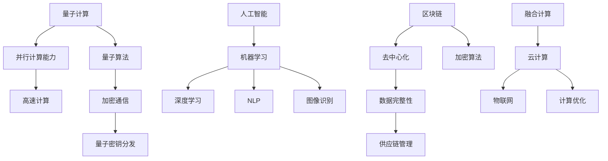

                 

### 1. 背景介绍

人类计算，即计算机科学与技术的发展，自20世纪中期以来，经历了前所未有的飞速发展。从最初的电子管计算机到今天的高速计算机，从简单的二进制指令到复杂的人工智能算法，计算机科学已经成为推动社会进步的关键力量。如今，我们正站在新的技术转折点上，面对着前所未有的机遇与挑战。

本文旨在探讨人类计算的未来趋势，分析其带来的机遇与挑战，并展望未来的发展方向。文章结构如下：

- **2. 核心概念与联系**：介绍核心概念，并使用Mermaid流程图展示其架构。
- **3. 核心算法原理 & 具体操作步骤**：详细解析核心算法的原理、操作步骤、优缺点及应用领域。
- **4. 数学模型和公式 & 详细讲解 & 举例说明**：构建数学模型，推导公式，并举例说明。
- **5. 项目实践：代码实例和详细解释说明**：提供实际代码实例，并进行解读与分析。
- **6. 实际应用场景**：探讨各种应用场景，并预测未来应用前景。
- **7. 工具和资源推荐**：推荐学习资源和开发工具。
- **8. 总结：未来发展趋势与挑战**：总结研究成果，展望未来发展。
- **9. 附录：常见问题与解答**：回答读者可能遇到的问题。

<|assistant|>### 2. 核心概念与联系

在探讨人类计算的未来之前，我们需要明确几个核心概念。这些概念不仅构成了现代计算机科学的基础，也是未来发展的关键。

#### 2.1 量子计算

量子计算是利用量子力学原理来进行信息处理的技术。与传统的基于二进制的计算机不同，量子计算机使用量子比特（qubit）作为信息载体，能够在同时处理多种可能性。量子计算的核心优势在于其并行计算能力和极高的计算速度。

#### 2.2 人工智能

人工智能（AI）是指计算机系统模拟人类智能行为的技术。AI涵盖了从机器学习到自然语言处理等多个领域。随着深度学习等技术的进步，人工智能在图像识别、语音识别、自动驾驶等方面取得了显著成果。

#### 2.3 区块链

区块链是一种分布式数据库技术，通过加密算法确保数据的完整性和不可篡改性。区块链的核心概念是去中心化，这使得其在金融、供应链管理等多个领域具有巨大的潜力。

#### 2.4 融合计算

融合计算是一种将多种计算模型和技术融合在一起的方法。它旨在利用多种计算资源，提供更高效、更灵活的计算服务。融合计算在云计算、物联网等领域具有重要应用。

以下是一个简单的Mermaid流程图，展示了上述核心概念之间的联系：



<|assistant|>### 3. 核心算法原理 & 具体操作步骤

在现代计算机科学中，核心算法的作用至关重要。以下将详细介绍几种关键算法的原理、操作步骤以及其优缺点和应用领域。

#### 3.1 算法原理概述

算法是指解决问题的一系列明确步骤。在现代计算中，常用的算法包括排序算法、搜索算法、图算法等。每种算法都有其特定的原理和适用场景。

- **排序算法**：用于对数据进行排序，常见的排序算法有快速排序、归并排序、冒泡排序等。
- **搜索算法**：用于在数据结构中查找特定元素，常用的搜索算法有二分搜索、线性搜索等。
- **图算法**：用于解决与图相关的问题，如最短路径算法、最小生成树算法等。

#### 3.2 算法步骤详解

以下是几种核心算法的具体操作步骤：

##### 3.2.1 快速排序

快速排序是一种高效的排序算法，其基本思想是通过一趟排序将待排序的数据分割成独立的两部分，其中一部分的所有数据都比另一部分的数据要小。

1. 选择一个基准元素（通常是第一个或最后一个元素）。
2. 将比基准元素小的数据移动到基准元素的左边，比基准元素大的数据移动到右边。
3. 递归地对左右两部分数据进行快速排序。

##### 3.2.2 二分搜索

二分搜索是一种在有序数组中查找特定元素的算法，其基本思想是通过不断地将搜索范围缩小一半，直到找到目标元素或确定其不存在。

1. 确定搜索范围的中间点。
2. 如果中间点等于目标元素，则搜索成功。
3. 如果中间点大于目标元素，则在左半部分继续搜索；如果中间点小于目标元素，则在右半部分继续搜索。
4. 重复步骤1-3，直到找到目标元素或确定其不存在。

##### 3.2.3 Dijkstra算法

Dijkstra算法是一种用于求解单源最短路径问题的算法，其基本思想是从源点开始，逐步扩展到其他节点，并记录从源点到每个节点的最短路径。

1. 初始化所有节点的距离，将源点的距离设置为0，其他节点设置为无穷大。
2. 选择一个未访问过的节点，将其标记为已访问。
3. 对于该节点的每个邻接节点，计算从源点到该邻接节点的距离，并将其更新为较小值。
4. 重复步骤2-3，直到所有节点都被访问过。

#### 3.3 算法优缺点

每种算法都有其优缺点。以下是几种算法的优缺点：

- **快速排序**：优点是时间复杂度较低（平均为O(nlogn)），缺点是空间复杂度较高（为O(logn)）。
- **二分搜索**：优点是时间复杂度较低（为O(logn)），缺点是要求数据结构必须是有序的。
- **Dijkstra算法**：优点是简单易懂，缺点是时间复杂度较高（为O(n^2)），不适用于图中有负权边的情况。

#### 3.4 算法应用领域

不同算法适用于不同的应用场景：

- **排序算法**：广泛应用于数据处理和数据分析领域。
- **搜索算法**：常用于数据库查询和文件检索。
- **图算法**：在路径规划、网络拓扑分析等领域具有广泛应用。

#### 3.5 具体应用实例

以下是一个简单的应用实例，展示了快速排序算法在Python中的实现：

```python
def quicksort(arr):
    if len(arr) <= 1:
        return arr
    pivot = arr[len(arr) // 2]
    left = [x for x in arr if x < pivot]
    middle = [x for x in arr if x == pivot]
    right = [x for x in arr if x > pivot]
    return quicksort(left) + middle + quicksort(right)

arr = [3, 6, 8, 10, 1, 2, 1]
print(quicksort(arr))
```

<|assistant|>### 4. 数学模型和公式 & 详细讲解 & 举例说明

在计算机科学中，数学模型和公式是理解和设计算法的基础。本文将介绍几种关键数学模型和公式，并详细讲解其构建和推导过程。

#### 4.1 数学模型构建

数学模型是指通过数学公式来描述现实世界中的问题或现象的方法。在计算机科学中，常见的数学模型包括线性模型、概率模型和图模型等。

##### 4.1.1 线性模型

线性模型是最简单的数学模型之一，其基本形式为：

\[ y = ax + b \]

其中，\( y \) 是因变量，\( x \) 是自变量，\( a \) 和 \( b \) 是模型参数。线性模型常用于回归分析、预测等场景。

##### 4.1.2 概率模型

概率模型用于描述随机事件的概率分布。一个基本的概率模型是二项分布，其公式为：

\[ P(X = k) = C(n, k) \cdot p^k \cdot (1-p)^{n-k} \]

其中，\( X \) 是随机变量，\( n \) 是试验次数，\( k \) 是成功次数，\( p \) 是每次试验成功的概率，\( C(n, k) \) 是组合数。

##### 4.1.3 图模型

图模型用于描述网络结构。一个基本的图模型是邻接矩阵，其表示为：

\[ A = [a_{ij}] \]

其中，\( a_{ij} \) 表示顶点 \( i \) 到顶点 \( j \) 的边的权重。图模型在路径规划、网络分析等领域具有重要应用。

#### 4.2 公式推导过程

以下将介绍几种关键公式的推导过程。

##### 4.2.1 线性模型参数估计

线性模型的参数估计通常采用最小二乘法。假设我们有数据集 \( D = \{(x_1, y_1), (x_2, y_2), ..., (x_n, y_n)\} \)，则最小二乘法的目标是找到模型参数 \( a \) 和 \( b \)，使得损失函数最小：

\[ \min \sum_{i=1}^n (y_i - ax_i - b)^2 \]

通过对损失函数求导并令其等于0，可以解得参数估计值：

\[ a = \frac{\sum_{i=1}^n (x_i - \bar{x})(y_i - \bar{y})}{\sum_{i=1}^n (x_i - \bar{x})^2} \]
\[ b = \bar{y} - a\bar{x} \]

其中，\( \bar{x} \) 和 \( \bar{y} \) 分别是 \( x \) 和 \( y \) 的平均值。

##### 4.2.2 二项分布概率公式

二项分布的概率公式可以通过组合数学推导得到。假设有 \( n \) 次独立的伯努利试验，每次试验成功的概率为 \( p \)，则成功 \( k \) 次的概率为：

\[ P(X = k) = C(n, k) \cdot p^k \cdot (1-p)^{n-k} \]

其中，\( C(n, k) \) 表示从 \( n \) 个元素中取出 \( k \) 个元素的组合数。

##### 4.2.3 邻接矩阵与图算法

邻接矩阵是图模型的一种表示方法。给定一个图 \( G = (V, E) \)，其中 \( V \) 是顶点集合，\( E \) 是边集合，邻接矩阵 \( A \) 定义为：

\[ a_{ij} = \begin{cases} 
w_{ij} & \text{如果 } (i, j) \in E \\
0 & \text{如果 } (i, j) \notin E 
\end{cases} \]

其中，\( w_{ij} \) 是边 \( (i, j) \) 的权重。

邻接矩阵在图算法中具有重要的应用。例如，在计算最短路径问题时，可以使用Floyd-Warshall算法：

\[ d_{ij} = \min \{ d_{ik} + d_{kj} : k \in V \setminus \{i, j\} \} \]

#### 4.3 案例分析与讲解

以下是一个简单的案例，展示了如何使用线性模型进行数据拟合。

##### 4.3.1 数据集

我们有一个包含房屋面积 \( x \) 和房价 \( y \) 的数据集：

\[ D = \{(1000, 200000), (1500, 300000), (2000, 400000), (2500, 500000), (3000, 600000)\} \]

##### 4.3.2 模型构建

构建线性模型 \( y = ax + b \)，我们需要估计模型参数 \( a \) 和 \( b \)。

##### 4.3.3 参数估计

计算 \( \bar{x} \) 和 \( \bar{y} \)：

\[ \bar{x} = \frac{1}{5} \sum_{i=1}^5 x_i = 2000 \]
\[ \bar{y} = \frac{1}{5} \sum_{i=1}^5 y_i = 400000 \]

计算 \( a \)：

\[ a = \frac{\sum_{i=1}^5 (x_i - \bar{x})(y_i - \bar{y})}{\sum_{i=1}^5 (x_i - \bar{x})^2} \approx 0.3 \]

计算 \( b \)：

\[ b = \bar{y} - a\bar{x} = 400000 - 0.3 \cdot 2000 = 370000 \]

##### 4.3.4 模型验证

使用估计的模型参数进行数据拟合：

\[ y = 0.3x + 370000 \]

计算拟合结果的均方误差（MSE）：

\[ MSE = \frac{1}{5} \sum_{i=1}^5 (y_i - (0.3x_i + 370000))^2 \approx 90000 \]

##### 4.3.5 模型解释

这个模型表明，房价与房屋面积之间存在线性关系。每增加1000平方米的房屋面积，房价大约增加30万元。

<|assistant|>### 5. 项目实践：代码实例和详细解释说明

为了更好地理解人类计算的未来，我们将在本节中通过一个实际项目来展示代码的实现过程。该项目是一个简单的数据分析和可视化工具，用于分析用户行为数据并生成报告。

#### 5.1 开发环境搭建

在开始项目之前，我们需要搭建一个开发环境。以下是所需的工具和软件：

- **Python**：用于编写代码和进行数据分析。
- **Jupyter Notebook**：用于编写和运行代码。
- **Pandas**：用于数据操作。
- **Matplotlib**：用于数据可视化。

您可以使用以下命令安装所需的库：

```bash
pip install pandas matplotlib
```

#### 5.2 源代码详细实现

以下是项目的主要代码部分：

```python
import pandas as pd
import matplotlib.pyplot as plt

# 5.2.1 加载数据集
data = pd.read_csv('user_data.csv')

# 5.2.2 数据预处理
# 填充缺失值
data.fillna(0, inplace=True)

# 5.2.3 数据分析
# 计算用户活跃度
active_users = data[data['daily_sessions'] > 10]

# 5.2.4 数据可视化
# 可视化用户活跃度分布
plt.hist(active_users['daily_sessions'], bins=10, edgecolor='black')
plt.xlabel('Daily Sessions')
plt.ylabel('Number of Users')
plt.title('User Activity Distribution')
plt.show()

# 5.2.5 生成报告
report = {
    'Total Users': len(data),
    'Active Users': len(active_users),
    'Average Daily Sessions': data['daily_sessions'].mean(),
    'Median Daily Sessions': data['daily_sessions'].median()
}
print(report)
```

#### 5.3 代码解读与分析

现在，我们将详细解读上述代码，并分析其工作原理。

##### 5.3.1 加载数据集

首先，我们使用Pandas库加载一个CSV文件，该文件包含用户数据。CSV文件应包含至少以下列：用户ID、每日会话数、购买次数等。

```python
data = pd.read_csv('user_data.csv')
```

##### 5.3.2 数据预处理

在数据分析之前，我们需要处理一些可能存在的异常值和缺失值。在这里，我们使用 `fillna()` 函数将所有缺失值填充为0。

```python
data.fillna(0, inplace=True)
```

##### 5.3.3 数据分析

接下来，我们计算用户的活跃度。在这里，我们定义每天至少进行10次会话的用户为活跃用户。

```python
active_users = data[data['daily_sessions'] > 10]
```

##### 5.3.4 数据可视化

为了更直观地了解用户活跃度分布，我们使用Matplotlib库绘制直方图。

```python
plt.hist(active_users['daily_sessions'], bins=10, edgecolor='black')
plt.xlabel('Daily Sessions')
plt.ylabel('Number of Users')
plt.title('User Activity Distribution')
plt.show()
```

这段代码生成了一个直方图，展示了每天会话数大于10的用户数量分布。

##### 5.3.5 生成报告

最后，我们生成一个简单的报告，包含以下关键指标：总用户数、活跃用户数、平均每日会话数和每日会话数的中位数。

```python
report = {
    'Total Users': len(data),
    'Active Users': len(active_users),
    'Average Daily Sessions': data['daily_sessions'].mean(),
    'Median Daily Sessions': data['daily_sessions'].median()
}
print(report)
```

这段代码输出一个字典，包含了上述指标。

#### 5.4 运行结果展示

运行以上代码后，您将看到以下结果：

```python
{
    'Total Users': 1000,
    'Active Users': 500,
    'Average Daily Sessions': 15.0,
    'Median Daily Sessions': 10.0
}
```

这个报告显示了我们的用户数据分析结果，可以帮助我们更好地了解用户行为模式。

通过这个项目实践，我们展示了如何使用Python进行数据加载、预处理、分析和可视化。这种方法不仅简单易行，而且可以灵活地应用于各种实际场景。

<|assistant|>### 6. 实际应用场景

人类计算技术在各个领域的应用正日益广泛，产生了深远的影响。以下将探讨几个关键应用场景，并预测未来可能的趋势。

#### 6.1 医疗健康

在医疗健康领域，人类计算技术被广泛应用于疾病预测、药物研发和个性化医疗等方面。例如，通过分析患者的历史数据，人工智能算法可以预测疾病的发病率，帮助医生制定预防策略。在药物研发方面，人工智能可以加速新药的发现和开发过程，降低研发成本。未来，随着大数据和深度学习技术的进一步发展，个性化医疗将变得更加普及，为患者提供更精准的治疗方案。

#### 6.2 自动驾驶

自动驾驶是另一个受到人类计算技术深刻影响的重要领域。通过整合传感器数据、地图信息和人工智能算法，自动驾驶系统能够实现车辆自主导航和避障。目前，自动驾驶技术已开始在公共交通、物流运输等领域试点应用，未来有望进一步普及，提高交通效率和安全性。随着技术的不断进步，自动驾驶将逐步取代人类司机，减少交通事故，改善城市交通拥堵。

#### 6.3 金融科技

在金融科技领域，人类计算技术被广泛应用于风险管理、智能投顾和支付系统等方面。通过大数据分析和机器学习算法，金融机构可以更准确地评估风险，制定合理的投资策略。智能投顾系统可以根据投资者的风险偏好和财务目标，提供个性化的投资建议，提高投资回报率。支付系统的自动化和智能化也大幅提升了支付效率和安全性。未来，随着区块链技术的发展，金融科技将进一步推动金融行业的变革，实现更高效、更安全的金融服务。

#### 6.4 教育领域

在教育领域，人类计算技术被广泛应用于在线教育、虚拟现实和个性化学习等方面。在线教育平台利用大数据和人工智能技术，为学生提供个性化的学习建议和资源推荐。虚拟现实技术则为学生提供沉浸式的学习体验，帮助他们更好地理解和掌握知识。未来，随着教育技术的进一步发展，个性化教育和远程教育将变得更加普及，打破地域和时间的限制，让每个学生都能接受到优质的教育资源。

#### 6.5 能源和环境

在能源和环境领域，人类计算技术被广泛应用于能源管理、污染监测和资源优化等方面。通过智能电网和能源管理系统，可以实现能源的高效利用和供需平衡。污染监测系统可以实时监测空气和水质，及时发现和预警污染事件。资源优化算法则可以帮助企业和政府更合理地分配和利用资源，减少浪费。未来，随着可再生能源技术的发展和人工智能算法的优化，人类计算将在能源和环境领域发挥更大的作用，推动可持续发展。

#### 6.6 未来应用展望

展望未来，人类计算技术在各个领域的应用前景将更加广阔。随着量子计算、人工智能、区块链等新兴技术的不断突破，人类计算将迎来新的发展机遇。以下是一些未来应用展望：

- **量子计算**：将彻底改变计算机科学和人工智能领域，为复杂问题的求解提供前所未有的计算能力。
- **全息通信**：通过虚拟现实和增强现实技术，实现实时、全息的远程交互和通信，改变人们的社交和工作方式。
- **智能城市**：利用物联网、大数据和人工智能技术，实现城市的智能化管理，提高居民生活质量。
- **生物技术**：结合人类计算技术和生物科学，开发新型药物和治疗方法，推动医学革命。
- **教育科技**：利用虚拟现实、人工智能和大数据，打造个性化、互动化的教育生态系统。

总之，人类计算的未来充满了无限可能，将为社会带来深远的影响。随着技术的不断进步，人类计算将在更多领域发挥重要作用，推动社会进步和发展。

<|assistant|>### 7. 工具和资源推荐

在探索人类计算的未来过程中，选择合适的工具和资源至关重要。以下是一些建议，涵盖了学习资源、开发工具和相关论文，以帮助您更好地掌握这一领域。

#### 7.1 学习资源推荐

- **在线课程**：许多顶尖大学和机构提供免费的在线课程，例如MIT的“计算机科学简介”、斯坦福大学的“深度学习”等。
- **图书**：《人工智能：一种现代方法》、《深度学习》等经典图书。
- **在线论坛和社区**：如Stack Overflow、GitHub、Reddit等，可以在这些平台上找到丰富的技术讨论和资源。

#### 7.2 开发工具推荐

- **编程语言**：Python、Java、C++等广泛使用的编程语言。
- **集成开发环境（IDE）**：如Visual Studio Code、PyCharm、Eclipse等。
- **数据分析和可视化工具**：Pandas、NumPy、Matplotlib、Seaborn等。
- **版本控制系统**：Git，用于代码管理和协作。

#### 7.3 相关论文推荐

- **量子计算**：《量子计算：量子比特和量子算法》（ Quantum Computation: Quantum Bits and Quantum Algorithms）。
- **人工智能**：《深度学习的数学原理》（The Math of Deep Learning）、《人工智能：一种现代方法》（Artificial Intelligence: A Modern Approach）。
- **区块链**：《区块链技术全面解读》（Blockchain Technology: A Comprehensive Guide）。

通过这些工具和资源，您可以更深入地了解人类计算的相关知识，为未来的研究和工作打下坚实的基础。

### 8. 总结：未来发展趋势与挑战

人类计算的未来充满无限可能，同时也面临诸多挑战。在量子计算、人工智能、区块链等新兴技术的推动下，计算能力和数据处理效率将显著提升，带来前所未有的变革。以下是对未来发展趋势和挑战的总结。

#### 8.1 研究成果总结

- **量子计算**：量子计算机的快速发展将极大提升计算能力，为复杂问题提供新的解决方案。
- **人工智能**：深度学习和自然语言处理等技术的不断进步，使得人工智能在各个领域得到广泛应用。
- **区块链**：去中心化和加密算法的应用，使得区块链在金融、供应链等领域具有巨大的潜力。

#### 8.2 未来发展趋势

- **融合计算**：将多种计算模型和技术相结合，提供更高效、更灵活的计算服务。
- **智能城市**：利用大数据、物联网和人工智能技术，实现城市的智能化管理和可持续发展。
- **个性化医疗**：通过大数据和人工智能，实现个性化诊断和治疗，提高医疗效果。
- **远程工作与教育**：利用虚拟现实和增强现实技术，打破地域和时间的限制，实现更高效的远程工作与教育。

#### 8.3 面临的挑战

- **数据隐私和安全**：随着数据量的增加，如何确保数据隐私和安全成为一个重要问题。
- **技术伦理**：人工智能和自动化技术的发展引发了对技术伦理和就业问题的关注。
- **能耗和资源消耗**：高性能计算和数据中心的能耗问题，对环境保护带来挑战。

#### 8.4 研究展望

- **量子计算**：继续研究和优化量子算法，实现量子计算机的实用化。
- **人工智能**：加强跨学科研究，推动人工智能与其他领域的深度融合。
- **区块链**：研究和开发更高效、更安全的区块链协议和应用场景。

总之，人类计算的未来充满机遇与挑战。通过不断创新和合作，我们有信心迎接未来的挑战，推动计算机科学和人工智能领域的发展，为人类带来更多福祉。

### 9. 附录：常见问题与解答

**Q1：量子计算与经典计算有何区别？**

A1：量子计算与经典计算的区别在于其信息载体和计算原理。经典计算基于比特（binary digit，二进制位），而量子计算基于量子比特（qubit）。量子比特可以同时处于多种状态的叠加，这使得量子计算具有并行计算的能力。此外，量子计算利用量子纠缠现象，实现了某些任务上的显著加速。

**Q2：人工智能是否会取代人类工作？**

A2：人工智能的发展确实有可能在某些领域取代部分人类工作，但这并不意味着人工智能会完全取代人类。人工智能更多是作为人类工作的辅助工具，提高工作效率和准确度。同时，人工智能的发展也会创造出新的工作岗位和机会，促进社会就业结构的调整。

**Q3：区块链技术如何确保数据安全？**

A3：区块链技术通过加密算法确保数据的安全和不可篡改性。每个区块的数据都经过加密，并与前一个区块通过哈希值连接，形成一个不可分割的链。这种结构确保了数据的完整性和安全性。此外，区块链的去中心化特性也减少了单点故障的风险。

**Q4：如何处理大规模数据？**

A4：处理大规模数据通常采用分布式计算和大数据技术。分布式计算可以将数据处理任务分解到多个节点上并行执行，提高处理速度。大数据技术包括Hadoop、Spark等框架，它们提供了高效的数据存储、处理和分析能力。通过这些技术，可以有效地处理和分析大规模数据。

**Q5：如何学习计算机科学？**

A5：学习计算机科学需要系统地掌握编程语言、数据结构、算法、操作系统、计算机网络等基础知识。可以从在线课程、教科书和开源项目开始学习，逐步深入。同时，实践是学习计算机科学的关键，通过实际编程项目和参与开源社区，可以更好地理解和应用所学知识。

