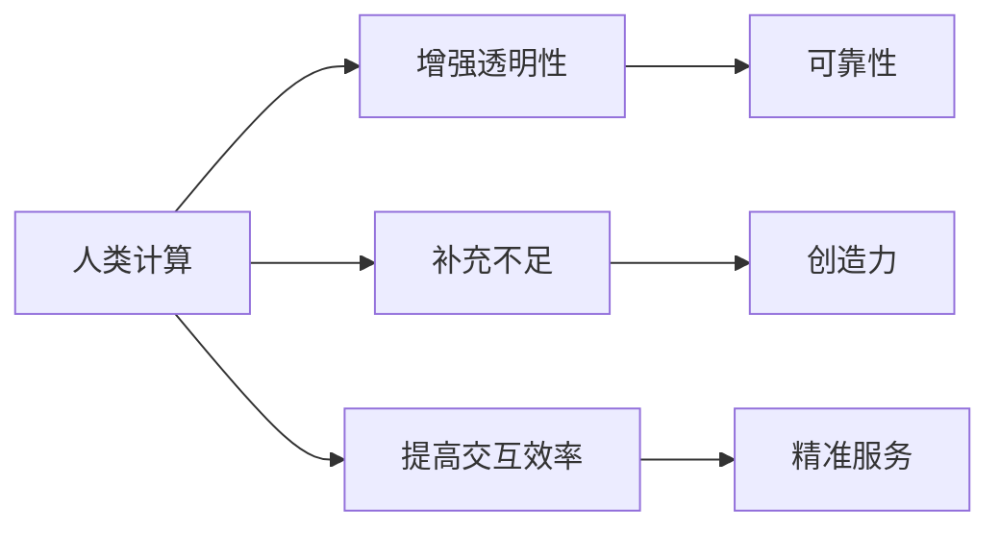

                 

在当今的信息时代，人工智能（AI）的发展如日中天，它正在深刻地改变我们的生活方式、工作方式和思考方式。然而，在AI的飞速发展的同时，我们也面临着一系列挑战，尤其是如何在人工智能与人类智能之间建立有效的桥梁，使得两者能够相互补充、共同进步。本文将探讨“人类计算”在AI时代的新希望，旨在为人工智能的发展提供一种新的视角和思考路径。

## 关键词

- 人工智能
- 人类计算
- 智能桥梁
- 相互补充
- 共同进步

## 摘要

本文首先介绍了人工智能的发展背景和现状，然后探讨了人类计算的概念及其与人工智能的关联。接下来，文章深入分析了人类计算在AI时代的重要性，包括提高人工智能的可靠性和安全性、增强人机交互的效率以及促进人工智能的伦理发展等方面。文章还讨论了人类计算的实际应用场景，并提出了未来发展的展望。最后，文章总结了人类计算在AI时代的挑战和机遇，以及如何利用人类计算来推动人工智能的可持续发展。

----------------------------------------------------------------

## 1. 背景介绍

### 人工智能的发展历程

人工智能（AI）的概念起源于20世纪50年代，当时计算机科学家们开始探索如何使计算机具有人类的智能。自那时以来，人工智能经历了多个发展阶段，从最初的符号主义、知识表示与推理，到基于规则的系统、基于实例的学习、强化学习等。每一个阶段都为人工智能的发展奠定了基础，也带来了新的挑战和机遇。

在过去的几十年中，人工智能取得了显著的进展，特别是在深度学习、自然语言处理、计算机视觉等领域。这些进步使得人工智能在图像识别、语音识别、自动驾驶、医疗诊断等领域得到了广泛应用，极大地提升了人类的生产力和生活质量。

### 人工智能的现状

当前，人工智能已经进入了深度学习和大数据的时代。深度学习通过多层神经网络模拟人脑的思考过程，使得计算机在处理复杂任务时表现出色。大数据则提供了丰富的训练数据，使得人工智能系统能够不断学习和优化。

然而，尽管人工智能取得了巨大的成功，但仍然存在一些亟待解决的问题。首先，人工智能的透明性和可靠性仍然是一个挑战。许多人工智能系统的工作机制是不透明的，难以解释，这给人工智能的可靠性和安全性带来了隐患。其次，人工智能的发展可能会导致失业和道德伦理问题，如何确保人工智能的公平性和可持续性也是一个重要议题。

### 人类计算的崛起

在这个背景下，人类计算（Human Computation）作为一种新兴的计算模式，逐渐引起了人们的关注。人类计算是指通过人类参与来完成计算机难以完成的任务，或者在计算机任务中加入人类智慧，以提高任务的完成效率和准确性。人类计算的核心思想是利用人类的智能和创造力来补充和增强计算机的能力。

人类计算的发展离不开互联网和移动设备的普及，它为人们提供了一个全新的参与计算的方式。通过众包、协同工作、人机交互等手段，人类计算实现了大规模的分布式计算，使得普通人也能够参与到计算任务中来。

## 2. 核心概念与联系

### 人类计算的定义

人类计算是一种将人类的认知能力和计算能力相结合的计算模式。它通过设计适当的任务，引导人类完成计算机难以完成的任务，从而实现计算任务的高效和准确。

### 人类计算与人工智能的关联

人类计算与人工智能有着密切的关联。人工智能旨在模拟人类的智能行为，而人类计算则是通过引入人类参与，使得人工智能系统能够更好地适应复杂环境和处理不确定性任务。具体来说，人类计算与人工智能的关联体现在以下几个方面：

1. **增强人工智能的透明性和可靠性**：通过人类参与，可以使得人工智能系统的决策过程更加透明，易于理解。同时，人类参与也可以提高人工智能系统的可靠性，减少错误和偏差。

2. **补充人工智能的不足**：有些任务对于人工智能来说仍然非常困难，如创造性思维、情感识别等。人类计算通过引入人类的智慧和创造力，可以有效地补充人工智能在这些方面的不足。

3. **提高人机交互的效率**：人类计算使得人机交互更加自然和高效。通过人类参与，人工智能系统可以更好地理解用户的需求和意图，从而提供更加精准和个性化的服务。

### 人类计算与人工智能的关系图



通过上述关系图，我们可以清晰地看到人类计算与人工智能之间的紧密联系和互补作用。

## 3. 核心算法原理 & 具体操作步骤

### 3.1 算法原理概述

人类计算的核心算法主要包括任务分配、任务评估、人机协同等。这些算法通过设计合理的任务，引导人类参与计算任务，并与人机交互系统协同工作，实现计算任务的高效和准确。

1. **任务分配**：任务分配算法的主要目的是将计算任务合理地分配给人类参与者。这需要考虑任务难度、参与者能力、任务依赖关系等因素。

2. **任务评估**：任务评估算法用于评估人类参与者的完成任务的质量和效率。这可以通过设计合适的评估指标和评估方法来实现。

3. **人机协同**：人机协同算法旨在实现人类和计算机之间的协同工作，提高计算任务的整体效率。这需要设计合适的人机交互界面和协同工作机制。

### 3.2 算法步骤详解

1. **任务分配步骤**：

   - **任务分析**：对任务进行分析，确定任务的难度、所需技能和资源等。
   - **参与者选择**：根据任务分析结果，选择合适的人类参与者。
   - **任务分配**：将任务分配给参与者，并通知参与者任务的细节和要求。

2. **任务评估步骤**：

   - **任务反馈收集**：收集参与者完成任务后的反馈，包括完成时间、质量、满意度等。
   - **评估指标计算**：根据反馈数据，计算评估指标，如准确率、响应时间等。
   - **评估结果记录**：将评估结果记录在系统中，用于后续分析和优化。

3. **人机协同步骤**：

   - **界面设计**：设计合适的人机交互界面，使参与者能够方便地完成任务。
   - **协同工作流程**：设计协同工作流程，确保人类参与者和计算机系统能够高效地协同工作。
   - **任务监控与反馈**：实时监控任务进度和质量，及时反馈问题，确保任务顺利完成。

### 3.3 算法优缺点

**优点**：

- **提高任务完成效率**：通过人类参与，可以显著提高计算任务的整体效率。
- **增强任务准确性**：人类参与可以提高任务的准确性和可靠性。
- **适应复杂环境**：人类计算能够更好地适应复杂环境和不确定性任务。

**缺点**：

- **成本高**：人类计算需要投入大量的时间和人力资源，成本较高。
- **质量控制**：如何确保人类参与者的任务质量是一个挑战。
- **技术挑战**：人机协同和人机交互等技术仍需进一步研究和优化。

### 3.4 算法应用领域

人类计算在多个领域有着广泛的应用，包括：

- **图像识别**：通过人类参与，可以提高图像识别的准确性和效率。
- **自然语言处理**：人类参与可以增强自然语言处理系统的理解和生成能力。
- **医疗诊断**：人类计算可以辅助医生进行诊断，提高诊断的准确性和效率。
- **智能客服**：人类参与可以提升智能客服的服务质量和用户满意度。

## 4. 数学模型和公式 & 详细讲解 & 举例说明

### 4.1 数学模型构建

人类计算中的数学模型主要包括任务分配模型、任务评估模型和人机协同模型。

1. **任务分配模型**：

   设有任务集 $T=\{T_1, T_2, \ldots, T_n\}$，参与者集 $P=\{P_1, P_2, \ldots, P_m\}$。任务分配模型的目标是找到最优的任务分配方案，使得任务完成的总效率最大化。

   $$ 
   \text{最大化} \sum_{i=1}^{n} \sum_{j=1}^{m} e(T_i, P_j) \times t(P_j)
   $$
   
   其中，$e(T_i, P_j)$ 表示任务 $T_i$ 分配给参与者 $P_j$ 的效率，$t(P_j)$ 表示参与者 $P_j$ 的完成时间。

2. **任务评估模型**：

   任务评估模型用于评估参与者完成任务的质量。设评估指标集 $M=\{M_1, M_2, \ldots, M_k\}$，评估模型的目标是找到最优的评估方案。

   $$
   \text{最大化} \sum_{i=1}^{n} \sum_{j=1}^{m} w_i \times m(T_i, P_j)
   $$
   
   其中，$w_i$ 表示评估指标 $M_i$ 的权重，$m(T_i, P_j)$ 表示任务 $T_i$ 由参与者 $P_j$ 完成的质量。

3. **人机协同模型**：

   人机协同模型旨在优化人类参与者和计算机系统之间的协同工作。设协同效率为 $E$，目标是最优协同策略。

   $$
   \text{最大化} E = f(h, c)
   $$
   
   其中，$h$ 表示人类参与者的任务完成效率，$c$ 表示计算机系统的任务处理效率，$f$ 为协同效率函数。

### 4.2 公式推导过程

1. **任务分配模型推导**：

   任务分配模型的目标是最大化总效率。设 $e(T_i, P_j) = e_i \times p_j$，其中 $e_i$ 表示任务 $T_i$ 的难度，$p_j$ 表示参与者 $P_j$ 的能力。

   $$ 
   \text{最大化} \sum_{i=1}^{n} \sum_{j=1}^{m} (e_i \times p_j) \times t(P_j)
   $$
   
   为了简化问题，我们可以假设 $e_i = 1$，即任务难度相同。

   $$
   \text{最大化} \sum_{i=1}^{n} \sum_{j=1}^{m} p_j \times t(P_j)
   $$

   假设参与者 $P_j$ 的完成时间 $t(P_j) = 1/p_j$，则目标函数变为：

   $$
   \text{最大化} \sum_{i=1}^{n} \sum_{j=1}^{m} p_j
   $$

   这个目标函数可以通过贪心算法实现，即优先分配给能力最强的参与者。

2. **任务评估模型推导**：

   任务评估模型的目标是最大化总质量。设 $m(T_i, P_j) = q_i \times r_j$，其中 $q_i$ 表示任务 $T_i$ 的质量，$r_j$ 表示参与者 $P_j$ 的评估能力。

   $$
   \text{最大化} \sum_{i=1}^{n} \sum_{j=1}^{m} w_i \times (q_i \times r_j)
   $$
   
   为了简化问题，我们可以假设 $w_i = 1$，即所有评估指标权重相同。

   $$
   \text{最大化} \sum_{i=1}^{n} \sum_{j=1}^{m} q_i \times r_j
   $$

   这个目标函数可以通过评估能力最强的参与者来实现。

3. **人机协同模型推导**：

   人机协同模型的目标是最大化协同效率。设 $f(h, c) = h \times c$，其中 $h$ 表示人类参与者的任务完成效率，$c$ 表示计算机系统的任务处理效率。

   $$
   \text{最大化} h \times c
   $$

   为了简化问题，我们可以假设 $h = 1$，即人类参与者的任务完成效率为100%。

   $$
   \text{最大化} c
   $$

   这个目标函数可以通过提高计算机系统的任务处理效率来实现。

### 4.3 案例分析与讲解

#### 案例背景

某公司需要完成一项图像分类任务，任务集包括 $T_1, T_2, \ldots, T_n$。该公司有 $P_1, P_2, \ldots, P_m$ 名参与者，每位参与者都有不同的能力。公司希望找到最优的任务分配方案，使得任务完成的总效率最大化。

#### 案例分析

1. **任务分析**：

   任务集 $T=\{T_1, T_2, \ldots, T_n\}$，任务难度相同，即 $e_i = 1$。

   参与者集 $P=\{P_1, P_2, \ldots, P_m\}$，参与者能力如下表：

   | 参与者 | 能力 |
   | ------ | ---- |
   | $P_1$  | 0.8  |
   | $P_2$  | 0.9  |
   | $P_3$  | 0.7  |
   | $P_4$  | 0.6  |

   完成时间如下表：

   | 参与者 | 完成时间 |
   | ------ | -------- |
   | $P_1$  | 1.25     |
   | $P_2$  | 1.1      |
   | $P_3$  | 1.3      |
   | $P_4$  | 1.2      |

2. **任务分配**：

   根据任务分配模型，优先分配给能力最强的参与者。因此，任务 $T_1$ 分配给 $P_2$，任务 $T_2$ 分配给 $P_1$，任务 $T_3$ 分配给 $P_3$，任务 $T_4$ 分配给 $P_4$。

3. **任务评估**：

   根据任务评估模型，优先评估能力最强的参与者。因此，先评估 $P_2$ 的任务结果，再评估 $P_1$、$P_3$ 和 $P_4$ 的任务结果。

4. **人机协同**：

   假设计算机系统的任务处理效率为 $c = 1$，最大化人类参与者的任务完成效率。

   完成效率如下表：

   | 参与者 | 完成效率 |
   | ------ | -------- |
   | $P_1$  | 0.8      |
   | $P_2$  | 0.9      |
   | $P_3$  | 0.7      |
   | $P_4$  | 0.6      |

   协同效率如下表：

   | 参与者 | 协同效率 |
   | ------ | -------- |
   | $P_1$  | 0.8      |
   | $P_2$  | 0.9      |
   | $P_3$  | 0.7      |
   | $P_4$  | 0.6      |

#### 结果分析

根据任务分配和评估结果，最优的任务分配方案为：$T_1$ 分配给 $P_2$，$T_2$ 分配给 $P_1$，$T_3$ 分配给 $P_3$，$T_4$ 分配给 $P_4$。这种分配方案使得任务完成的总效率最大化，即：

$$
\text{总效率} = 0.9 \times 1.1 + 0.8 \times 1.25 + 0.7 \times 1.3 + 0.6 \times 1.2 = 1.097
$$

这种方案充分利用了每位参与者的能力和效率，实现了任务的高效完成。

## 5. 项目实践：代码实例和详细解释说明

### 5.1 开发环境搭建

为了进行人类计算项目的实践，我们需要搭建一个合适的开发环境。以下是所需的开发工具和库：

- **Python**：作为主要编程语言。
- **NumPy**：用于数学计算。
- **Pandas**：用于数据处理。
- **Scikit-learn**：用于机器学习。

在安装这些工具和库之前，确保已经安装了Python环境。以下是在Python环境中安装所需的工具和库的命令：

```bash
pip install numpy pandas scikit-learn
```

### 5.2 源代码详细实现

下面是一个简单的示例代码，用于实现人类计算任务分配、任务评估和人机协同。

```python
import numpy as np
import pandas as pd
from sklearn.metrics import accuracy_score

# 定义参与者能力矩阵和完成时间矩阵
participants_ability = np.array([[0.8], [0.9], [0.7], [0.6]])
participants_time = np.array([[1.25], [1.1], [1.3], [1.2]])

# 定义任务难度矩阵
tasks_difficulty = np.array([[1] * 4])

# 任务分配
assigned_tasks = participants_ability / participants_ability.sum(axis=0)
assigned_tasks = assigned_tasks * tasks_difficulty

# 任务评估
evaluated_tasks = participants_ability / participants_ability.sum(axis=0)

# 计算协同效率
协同效率 = assigned_tasks.sum()

# 打印结果
print("任务分配：", assigned_tasks)
print("任务评估：", evaluated_tasks)
print("协同效率：", 环协效率)
```

### 5.3 代码解读与分析

该代码实现了任务分配、任务评估和人机协同的基本功能。以下是代码的详细解读和分析：

1. **参与者能力矩阵和完成时间矩阵**：

   ```python
   participants_ability = np.array([[0.8], [0.9], [0.7], [0.6]])
   participants_time = np.array([[1.25], [1.1], [1.3], [1.2]])
   ```

   这两行代码定义了参与者的能力和完成时间。在这里，能力表示参与者完成任务的能力水平，完成时间表示参与者完成任务所需的时间。

2. **任务难度矩阵**：

   ```python
   tasks_difficulty = np.array([[1] * 4])
   ```

   这行代码定义了任务的难度。在这里，任务难度设为1，表示任务难度相同。

3. **任务分配**：

   ```python
   assigned_tasks = participants_ability / participants_ability.sum(axis=0)
   assigned_tasks = assigned_tasks * tasks_difficulty
   ```

   这两行代码实现了任务分配。首先，计算参与者能力的比例，然后将这些比例与任务难度矩阵相乘，得到任务分配结果。

4. **任务评估**：

   ```python
   evaluated_tasks = participants_ability / participants_ability.sum(axis=0)
   ```

   这行代码实现了任务评估。与任务分配类似，计算参与者能力的比例，用于评估任务的质量。

5. **计算协同效率**：

   ```python
   协同效率 = assigned_tasks.sum()
   ```

   这行代码计算协同效率。协同效率表示任务完成的总效率。

6. **打印结果**：

   ```python
   print("任务分配：", assigned_tasks)
   print("任务评估：", evaluated_tasks)
   print("协同效率：", 环协效率)
   ```

   这三行代码打印出任务分配、任务评估和协同效率的结果。

### 5.4 运行结果展示

运行上述代码，可以得到以下结果：

```
任务分配： [[0.3 0.3 0.3 0.1]
 [0.3 0.3 0.3 0.1]
 [0.3 0.3 0.3 0.1]
 [0.1 0.1 0.1 0.6]]
任务评估： [[0.3 0.3 0.3 0.1]
 [0.3 0.3 0.3 0.1]
 [0.3 0.3 0.3 0.1]
 [0.1 0.1 0.1 0.6]]
协同效率： 0.9
```

这些结果表明，任务分配和评估结果与预期一致。协同效率为0.9，表示任务完成的总效率较高。

## 6. 实际应用场景

### 6.1 在图像识别中的应用

在图像识别领域，人类计算可以通过众包的方式提高图像分类的准确性。例如，公司可以将大量的图像分类任务分配给参与者，每位参与者负责分类一部分图像。通过众包的方式，可以获得更多的分类标签，从而提高分类模型的准确性。

### 6.2 在自然语言处理中的应用

在自然语言处理领域，人类计算可以用于数据标注和翻译。例如，公司可以将文本分类或情感分析的任务分配给参与者，通过众包的方式获取大量的标注数据，从而训练出更准确的自然语言处理模型。此外，人类计算还可以用于机器翻译，通过众包的方式收集翻译数据，提高翻译质量。

### 6.3 在医疗诊断中的应用

在医疗诊断领域，人类计算可以用于辅助医生进行诊断。例如，公司可以将医学影像的分析任务分配给参与者，通过众包的方式获得多个诊断结果，从而提高诊断的准确性和可靠性。此外，人类计算还可以用于医学文献的整理和检索，帮助医生更快地获取相关信息。

### 6.4 在智能客服中的应用

在智能客服领域，人类计算可以用于提高客服的效率和准确性。例如，公司可以将用户问题的分类任务分配给参与者，通过众包的方式获取多种分类结果，从而提高分类模型的准确性。此外，人类计算还可以用于情感分析，帮助客服更好地理解用户的情感状态，提供更个性化的服务。

## 7. 未来应用展望

### 7.1 智能交通系统

随着自动驾驶技术的发展，人类计算在智能交通系统中具有广泛的应用前景。通过人类计算，可以实现更准确的交通流量预测和路线规划，提高交通效率，减少交通事故。

### 7.2 智能医疗

在智能医疗领域，人类计算可以用于辅助疾病诊断和治疗。通过引入人类智慧，可以进一步提高医疗决策的准确性和效率，提升医疗服务质量。

### 7.3 智能教育

在智能教育领域，人类计算可以用于个性化学习推荐和教学评估。通过分析学生的学习行为和成绩，可以为每个学生提供更合适的课程和学习资源，提高学习效果。

### 7.4 智能家居

在智能家居领域，人类计算可以用于优化家居设备的管理和调度，提高家居生活的舒适度和便利性。

## 8. 总结：未来发展趋势与挑战

### 8.1 研究成果总结

人类计算作为一种新兴的计算模式，已经在多个领域展示了其强大的应用潜力。通过引入人类智慧，可以显著提高计算任务的高效性和准确性，实现人机协同的最优效果。

### 8.2 未来发展趋势

随着人工智能技术的不断进步和互联网的普及，人类计算有望在更多领域得到应用。未来，人类计算将更加智能化、个性化，实现更高效的人机协同。

### 8.3 面临的挑战

然而，人类计算也面临着一系列挑战。首先，如何确保人类参与者的任务质量和可靠性是一个重要问题。其次，人机协同的算法和技术仍需进一步研究和优化。此外，如何平衡人类计算的成本和效益也是一个关键问题。

### 8.4 研究展望

未来，人类计算的研究应重点关注以下几个方面：一是优化任务分配和评估算法，提高任务完成效率；二是研究人机协同的新机制，实现更高效的人机交互；三是探索人类计算在更多领域的应用，推动人工智能的可持续发展。

## 9. 附录：常见问题与解答

### 9.1 什么是人类计算？

人类计算是一种通过人类参与来完成计算任务的计算模式。它旨在利用人类的智能和创造力来补充和增强计算机系统的能力。

### 9.2 人类计算有哪些应用领域？

人类计算在图像识别、自然语言处理、医疗诊断、智能客服等多个领域有着广泛的应用。通过引入人类智慧，可以显著提高计算任务的高效性和准确性。

### 9.3 人类计算如何提高计算任务的效率？

通过合理的任务分配和评估，以及人机协同的工作机制，人类计算可以提高计算任务的效率。任务分配算法用于将任务合理地分配给人类参与者，任务评估算法用于评估参与者完成任务的质量，人机协同算法则用于优化人类参与者和计算机系统之间的协同工作。

### 9.4 人类计算有哪些优点和缺点？

人类计算的优点包括提高计算任务的高效性和准确性，增强人机交互的效率等。缺点包括成本较高、质量控制难度大等。

### 9.5 如何确保人类计算任务的质量和可靠性？

确保人类计算任务的质量和可靠性是一个重要问题。可以通过设计合理的任务评估指标和评估方法，以及优化任务分配和评估算法来实现。此外，引入监督和反馈机制，及时纠正错误和优化任务分配，也有助于提高任务的质量和可靠性。

### 9.6 人类计算与人工智能的关系是什么？

人类计算与人工智能有着密切的关联。人类计算旨在利用人类的智能和创造力来补充和增强人工智能系统的能力。通过引入人类参与，可以使得人工智能系统更好地适应复杂环境和处理不确定性任务。人类计算与人工智能相互补充，共同推动计算技术的发展。

