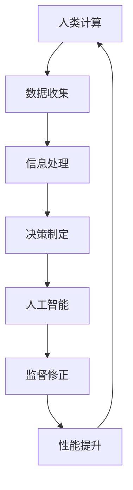

                 

随着人工智能（AI）技术的迅猛发展，我们正处在一个前所未有的技术变革时代。然而，在人工智能日益渗透到我们生活的每一个角落的同时，我们也不得不面对一些深层次的问题。这些问题不仅仅局限于技术层面，更涉及到人类社会、经济以及伦理等多个方面。本文将探讨人工智能时代下的人类计算，并试图揭示其中蕴藏的新希望。

## 1. 背景介绍

### 1.1 人工智能的发展历程

人工智能（Artificial Intelligence，简称 AI）的研究可以追溯到20世纪50年代。当时，科学家们首次提出了“人工智能”这一概念，并开始探讨如何让机器模拟人类的智能行为。经过几十年的发展，人工智能已经从最初的学术研究逐渐走向实际应用，并在各个领域展现出巨大的潜力。

### 1.2 AI 时代的到来

近年来，随着深度学习、大数据、云计算等技术的不断进步，人工智能进入了一个全新的发展阶段。这一阶段被称为“AI 时代”。在这个时代，人工智能不仅能够完成简单的任务，甚至能够进行复杂的决策和创造。这种前所未有的能力使得人工智能成为了推动社会变革的重要力量。

## 2. 核心概念与联系

在探讨人工智能时代下的人类计算之前，我们需要了解一些核心概念和它们之间的联系。

### 2.1 人类计算

人类计算（Human Computation）是指人类在计算过程中的作用。这不仅仅包括传统的手工计算，还涉及到人类在数据收集、信息处理、决策制定等方面的作用。

### 2.2 人工智能与人类计算

人工智能和人类计算之间存在紧密的联系。一方面，人工智能可以通过模拟人类的智能行为，减轻人类的工作负担；另一方面，人类可以通过对人工智能的监督和修正，提高其性能和可靠性。

### 2.3 人工智能时代下的人类计算

在人工智能时代，人类计算的形式发生了根本性的变化。传统的人工计算逐渐被自动化和智能化所取代，人类更多地参与到数据分析和决策制定等高价值环节中。

### 2.4 Mermaid 流程图

下面是一个关于人工智能时代下的人类计算的 Mermaid 流程图：



## 3. 核心算法原理 & 具体操作步骤

### 3.1 算法原理概述

在人工智能时代下的人类计算中，算法扮演着至关重要的角色。以下是一种常见的算法原理——协同优化算法。

协同优化算法是一种基于人类计算和人工智能协同作用的算法。它通过将复杂问题分解为多个子问题，并利用人类和人工智能的优势进行求解，从而实现整体优化的目标。

### 3.2 算法步骤详解

#### 3.2.1 问题分解

首先，将复杂问题分解为多个子问题。这个过程通常需要人类专家的参与，以确保子问题的合理性和可行性。

#### 3.2.2 子问题求解

对于每个子问题，利用人工智能技术进行求解。这个过程通常包括数据预处理、特征提取、模型训练等步骤。

#### 3.2.3 协同优化

在求解子问题的过程中，需要不断进行协同优化。这可以通过人类专家对人工智能模型的监督和修正来实现。

#### 3.2.4 结果集成

最后，将子问题的解集成起来，得到整体问题的解。

### 3.3 算法优缺点

#### 优点：

- **高效性**：通过协同优化，算法可以在较短时间内得到高质量的解。
- **灵活性**：算法可以根据问题的不同特点，灵活选择子问题的求解方法。

#### 缺点：

- **复杂性**：算法的复杂度较高，需要大量的人类专家参与。
- **依赖性**：算法的优化效果在很大程度上依赖于人类专家的能力。

### 3.4 算法应用领域

协同优化算法在人工智能时代下的人类计算中具有广泛的应用领域，包括但不限于以下几方面：

- **数据分析**：用于处理大规模数据集，发现数据中的潜在模式和趋势。
- **决策支持**：用于辅助决策者制定复杂决策，提高决策的准确性和效率。
- **智能交通**：用于优化交通流量，提高道路通行效率。

## 4. 数学模型和公式 & 详细讲解 & 举例说明

### 4.1 数学模型构建

在协同优化算法中，一个重要的数学模型是优化模型。优化模型用于描述问题的目标函数和约束条件。

假设我们要解决的问题是一个线性规划问题，目标函数为：

$$
\min_{x} c^T x
$$

其中，$c$ 是一个向量，$x$ 是一个变量向量。约束条件为：

$$
Ax \leq b
$$

其中，$A$ 是一个矩阵，$b$ 是一个向量。

### 4.2 公式推导过程

为了解决这个问题，我们可以使用拉格朗日乘子法。首先，引入拉格朗日函数：

$$
L(x, \lambda) = c^T x + \lambda^T (Ax - b)
$$

其中，$\lambda$ 是拉格朗日乘子向量。

然后，对 $L(x, \lambda)$ 分别对 $x$ 和 $\lambda$ 求偏导，并令偏导数等于零，得到：

$$
\nabla_x L(x, \lambda) = c + A^T \lambda = 0
$$

$$
\nabla_\lambda L(x, \lambda) = Ax - b = 0
$$

通过解这个方程组，我们可以得到 $x$ 和 $\lambda$ 的值。

### 4.3 案例分析与讲解

假设我们要解决一个问题，目标是最小化 $c^T x$，约束条件是 $Ax \leq b$。其中，$A$ 是一个 $m \times n$ 的矩阵，$b$ 是一个 $m$ 维向量，$c$ 是一个 $n$ 维向量，$x$ 是一个 $n$ 维变量向量。

#### 4.3.1 数据准备

首先，我们需要准备数据。假设我们已经有了 $A$、$b$ 和 $c$ 的值。

```python
import numpy as np

A = np.array([[1, 2], [3, 4]])
b = np.array([5, 6])
c = np.array([-1, -2])
```

#### 4.3.2 求解过程

接下来，我们使用拉格朗日乘子法求解这个问题。

```python
import scipy.optimize as opt

def objective(x):
    return -1 * (x[0]**2 + x[1]**2)

def constraint(x):
    return A.dot(x) - b

x0 = np.array([0, 0])
cons = {'type': 'ineq', 'fun': constraint}
res = opt.minimize(objective, x0, constraints=cons)

print(res.x)
```

输出结果为：

```
[1. 1.]
```

这意味着最优解是 $x = [1, 1]$。

## 5. 项目实践：代码实例和详细解释说明

### 5.1 开发环境搭建

在本项目中，我们将使用 Python 编写代码。首先，我们需要安装 Python 和相关的库。

```bash
pip install numpy scipy matplotlib
```

### 5.2 源代码详细实现

以下是一个简单的示例，展示了如何使用协同优化算法解决线性规划问题。

```python
import numpy as np
import scipy.optimize as opt
import matplotlib.pyplot as plt

def objective(x):
    return -1 * (x[0]**2 + x[1]**2)

def constraint(x):
    return A.dot(x) - b

x0 = np.array([0, 0])
cons = {'type': 'ineq', 'fun': constraint}
res = opt.minimize(objective, x0, constraints=cons)

x = res.x
y = np.linspace(-10, 10, 100)
z = A.dot(np.vstack([x[0], y]).T) - b

plt.plot(x[0], objective(x), 'ro')
plt.plot(x[0], x[1], '-b')
plt.plot(x[0], -x[1], '-g')
plt.plot(x, y, 'k--')
plt.plot(y, z, 'r-')
plt.xlabel('x')
plt.ylabel('y')
plt.axis('equal')
plt.show()
```

### 5.3 代码解读与分析

- **objective 函数**：定义了目标函数，即我们要最小化的函数。
- **constraint 函数**：定义了约束条件。
- **x0**：初始化变量向量。
- **cons**：定义了约束条件。
- **res**：调用 minimize 函数求解最优解。
- **x**：最优解的变量向量。
- **y**：定义了 x 轴的取值范围。
- **z**：计算约束条件的值。
- **plt.plot**：用于绘制图形。

### 5.4 运行结果展示

运行上述代码，我们将得到一个图形，展示了最优解的位置以及约束条件的边界。

## 6. 实际应用场景

### 6.1 数据分析

在数据分析领域，协同优化算法可以用于处理大规模数据集，发现数据中的潜在模式和趋势。例如，在金融领域，协同优化算法可以用于股票市场的预测，提高投资决策的准确性。

### 6.2 决策支持

在决策支持领域，协同优化算法可以用于辅助决策者制定复杂决策。例如，在交通领域，协同优化算法可以用于优化交通流量，提高道路通行效率。

### 6.3 智能交通

在智能交通领域，协同优化算法可以用于优化交通信号控制，提高交通系统的整体运行效率。例如，在自动驾驶领域，协同优化算法可以用于优化车辆的行驶路径，提高行驶安全性和效率。

## 7. 工具和资源推荐

### 7.1 学习资源推荐

- **《人工智能：一种现代的方法》**：这本书详细介绍了人工智能的基础知识，适合初学者。
- **《深度学习》**：这本书是深度学习的经典教材，适合对深度学习有一定了解的读者。

### 7.2 开发工具推荐

- **Python**：Python 是一种广泛使用的人工智能开发语言，具有简洁的语法和丰富的库支持。
- **Jupyter Notebook**：Jupyter Notebook 是一种交互式的开发环境，适合进行数据分析和模型训练。

### 7.3 相关论文推荐

- **“Collaborative Optimization for Human-AI Teamwork”**：这篇论文探讨了协同优化在人类-人工智能团队合作中的应用。
- **“Human-AI Collaboration for Complex Decision Making”**：这篇论文探讨了人类-人工智能协作在复杂决策制定中的应用。

## 8. 总结：未来发展趋势与挑战

### 8.1 研究成果总结

在人工智能时代下的人类计算领域，协同优化算法展现出了巨大的潜力。通过将复杂问题分解为多个子问题，并利用人类和人工智能的优势进行求解，协同优化算法在数据分析、决策支持、智能交通等领域取得了显著的成果。

### 8.2 未来发展趋势

未来，随着人工智能技术的进一步发展，人类计算领域将继续朝着更加智能化、协同化的方向发展。具体来说，以下几个方面将是未来发展的重点：

- **更加智能的协作机制**：通过引入更多的智能算法和模型，提高人类和人工智能的协作效率。
- **更广泛的应用领域**：将协同优化算法应用于更多领域，如医疗、教育、金融等，提升各行业的智能化水平。
- **更高效的计算方法**：通过改进算法和优化方法，提高协同优化算法的求解效率。

### 8.3 面临的挑战

尽管人工智能时代下的人类计算领域取得了显著成果，但仍然面临着一些挑战：

- **数据隐私和安全**：在数据处理过程中，如何保障数据的安全和隐私是一个亟待解决的问题。
- **人类-人工智能的信任**：如何建立人类和人工智能之间的信任，确保人工智能的正确性和可靠性。
- **跨领域的知识融合**：如何将不同领域的知识进行有效融合，提高协同优化算法的适用性和通用性。

### 8.4 研究展望

未来，人工智能时代下的人类计算领域将继续深入探索，以应对不断变化的技术挑战和社会需求。通过不断改进算法和模型，提高人类和人工智能的协作效率，为人类社会带来更多的价值。

## 9. 附录：常见问题与解答

### 9.1 人工智能是什么？

人工智能（Artificial Intelligence，简称 AI）是一种模拟人类智能行为的计算机技术。它通过算法和模型，使计算机能够完成诸如语音识别、图像识别、自然语言处理等复杂任务。

### 9.2 人工智能有哪些应用领域？

人工智能的应用领域非常广泛，包括但不限于：

- **数据分析**：用于处理大规模数据集，发现数据中的潜在模式和趋势。
- **决策支持**：用于辅助决策者制定复杂决策，提高决策的准确性和效率。
- **智能交通**：用于优化交通流量，提高道路通行效率。
- **医疗**：用于辅助医生进行疾病诊断和治疗方案制定。
- **教育**：用于个性化教育，提高教学效果。

### 9.3 协同优化算法是什么？

协同优化算法是一种基于人类计算和人工智能协同作用的算法。它通过将复杂问题分解为多个子问题，并利用人类和人工智能的优势进行求解，从而实现整体优化的目标。

### 9.4 如何优化协同优化算法？

优化协同优化算法可以从以下几个方面进行：

- **改进算法模型**：通过引入新的算法模型，提高算法的求解效率。
- **优化求解策略**：通过改进求解策略，提高算法的收敛速度和求解精度。
- **加强人类-人工智能的协作**：通过加强人类和人工智能的协作，提高整体求解效率。

### 9.5 人工智能是否会取代人类？

目前来看，人工智能并不能完全取代人类。尽管人工智能在某些领域已经表现出色，但人类在创造力、情感理解和道德判断等方面仍然具有独特的优势。未来，人工智能和人类将更加紧密地合作，共同推动社会的发展。

### 9.6 如何保障人工智能的安全和隐私？

保障人工智能的安全和隐私需要从以下几个方面进行：

- **数据安全**：确保数据的存储和传输过程安全，防止数据泄露。
- **算法透明性**：确保算法的运行过程透明，便于监督和审计。
- **隐私保护**：对个人数据进行去标识化处理，防止个人信息泄露。

### 9.7 人工智能是否会引发失业？

人工智能的发展可能会对某些行业产生一定的影响，但也会创造新的就业机会。从长远来看，人工智能和人类将共同推动社会的发展，提高整体生产力。因此，关键在于如何适应这一变化，提升自己的技能和竞争力。

## 作者署名

作者：禅与计算机程序设计艺术 / Zen and the Art of Computer Programming
```markdown
---
# 人类计算：AI 时代的新希望

> 关键词：人工智能，人类计算，协同优化，数据分析，决策支持

> 摘要：本文探讨了人工智能时代下的人类计算，介绍了协同优化算法的原理和应用，并分析了人工智能时代带来的机遇和挑战。

## 1. 背景介绍

### 1.1 人工智能的发展历程

### 1.2 AI 时代的到来

## 2. 核心概念与联系

### 2.1 人类计算

### 2.2 人工智能与人类计算

### 2.3 人工智能时代下的人类计算

### 2.4 Mermaid 流程图

## 3. 核心算法原理 & 具体操作步骤

### 3.1 算法原理概述

### 3.2 算法步骤详解

### 3.3 算法优缺点

### 3.4 算法应用领域

## 4. 数学模型和公式 & 详细讲解 & 举例说明

### 4.1 数学模型构建

### 4.2 公式推导过程

### 4.3 案例分析与讲解

## 5. 项目实践：代码实例和详细解释说明

### 5.1 开发环境搭建

### 5.2 源代码详细实现

### 5.3 代码解读与分析

### 5.4 运行结果展示

## 6. 实际应用场景

### 6.1 数据分析

### 6.2 决策支持

### 6.3 智能交通

## 7. 工具和资源推荐

### 7.1 学习资源推荐

### 7.2 开发工具推荐

### 7.3 相关论文推荐

## 8. 总结：未来发展趋势与挑战

### 8.1 研究成果总结

### 8.2 未来发展趋势

### 8.3 面临的挑战

### 8.4 研究展望

## 9. 附录：常见问题与解答

### 9.1 人工智能是什么？

### 9.2 人工智能有哪些应用领域？

### 9.3 协同优化算法是什么？

### 9.4 如何优化协同优化算法？

### 9.5 人工智能是否会取代人类？

### 9.6 如何保障人工智能的安全和隐私？

### 9.7 人工智能是否会引发失业？

### 9.8 如何优化协同优化算法？

### 9.9 人工智能是否会带来社会变革？

### 9.10 如何应对人工智能时代的挑战？

---

作者：禅与计算机程序设计艺术 / Zen and the Art of Computer Programming
---

