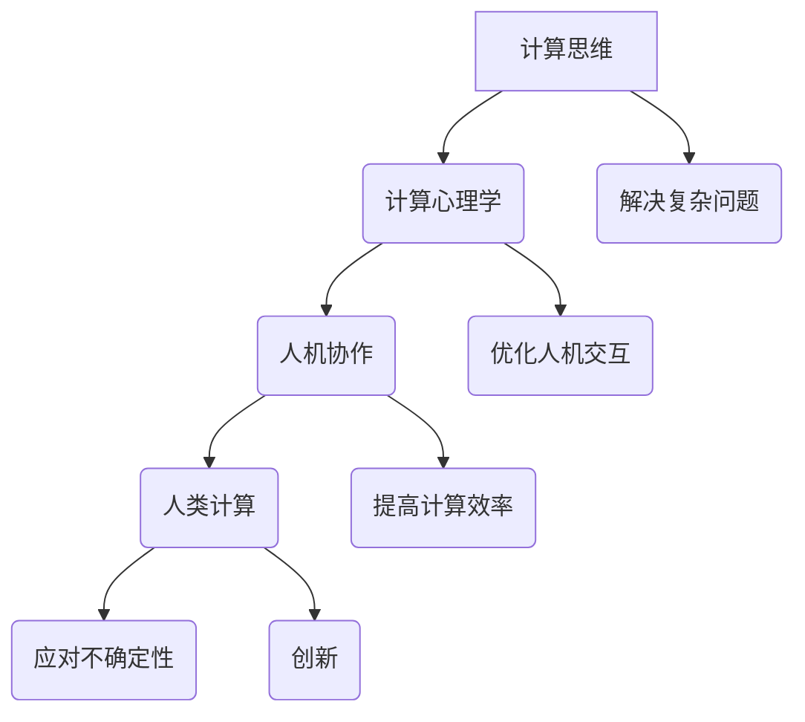

                 

关键词：人工智能、人类计算、认知智能、计算心理学、人机协作、未来发展趋势

摘要：随着人工智能技术的快速发展，人类计算在AI时代的角色和重要性日益凸显。本文将探讨人类计算的核心概念、原理、算法、数学模型以及实际应用，分析人类计算在AI时代的挑战与机遇，并展望未来发展趋势。

## 1. 背景介绍

人类计算是指人类在处理信息和解决问题时运用计算思维和计算方法的能力。它不仅涵盖了传统的数学和逻辑推理，还包括对复杂系统、动态环境和不确定性情境的应对。在人工智能（AI）时代，人类计算的作用愈发重要。AI技术虽然能够在某些领域超越人类，但在解决复杂问题和应对高度不确定性的环境中，仍然需要人类的智慧和创造力。

### 1.1 人工智能的发展历程

人工智能的概念最早可以追溯到20世纪50年代。当时，计算机科学家们开始探讨如何让计算机模拟人类的智能行为。经过几十年的发展，人工智能经历了多个阶段，从最初的规则推理、知识表示到现代的深度学习和神经网络，技术逐渐成熟。如今，人工智能已经在语音识别、图像处理、自然语言处理等领域取得了显著的成果。

### 1.2 人类计算的演变

随着人工智能技术的发展，人类计算的角色也在不断演变。早期的人工智能系统主要依赖人类设计的规则和算法，人类需要负责系统的设计、训练和调优。随着机器学习和深度学习技术的兴起，人工智能开始能够自我学习和优化，人类计算的介入逐渐减少。然而，面对复杂的问题和高度不确定性的环境，人类计算仍然不可或缺。

## 2. 核心概念与联系

### 2.1 计算思维

计算思维是指运用计算机科学的概念和原理来解决问题和创新的一种思维方式。它强调抽象、算法化、自动化和并行化。计算思维不仅适用于计算机科学领域，还可以应用于更广泛的领域，如工程、医学、社会科学等。

### 2.2 计算心理学

计算心理学研究人类在计算过程中的心理和行为特征。它关注人类的感知、记忆、推理、决策等认知过程，旨在理解人类如何处理信息，并探索如何优化人机交互。

### 2.3 人机协作

人机协作是指人类与计算机系统共同工作，实现优势互补。在人机协作中，人类发挥创造力、情感和直觉的优势，计算机系统则提供计算能力、存储和速度的优势。

### 2.4 Mermaid 流程图

下面是计算思维、计算心理学和人机协作之间的联系，以及它们在人类计算中的作用。



## 3. 核心算法原理 & 具体操作步骤

### 3.1 算法原理概述

人类计算的核心算法主要包括以下几种：

1. **启发式算法**：通过经验和直觉来寻找问题的解决方案。
2. **模拟退火算法**：通过模拟物理系统的退火过程来寻找最优解。
3. **遗传算法**：模拟生物进化过程来优化问题。
4. **人工神经网络**：模拟人脑的神经网络结构，用于图像识别、自然语言处理等。

### 3.2 算法步骤详解

1. **启发式算法**：
   - **步骤1**：确定问题模型。
   - **步骤2**：选择启发式规则。
   - **步骤3**：根据启发式规则生成候选解。
   - **步骤4**：评估候选解的质量。
   - **步骤5**：选择最优解。

2. **模拟退火算法**：
   - **步骤1**：初始化参数。
   - **步骤2**：计算当前状态的能量。
   - **步骤3**：根据能量下降概率进行状态转移。
   - **步骤4**：更新最优解。
   - **步骤5**：迭代直到满足终止条件。

3. **遗传算法**：
   - **步骤1**：初始化种群。
   - **步骤2**：计算种群中个体的适应度。
   - **步骤3**：选择优秀的个体进行交叉和变异。
   - **步骤4**：生成下一代种群。
   - **步骤5**：迭代直到满足终止条件。

4. **人工神经网络**：
   - **步骤1**：确定网络结构。
   - **步骤2**：初始化网络参数。
   - **步骤3**：前向传播。
   - **步骤4**：计算损失函数。
   - **步骤5**：反向传播更新参数。
   - **步骤6**：迭代直到满足终止条件。

### 3.3 算法优缺点

1. **启发式算法**：
   - **优点**：简单易实现，适合解决复杂问题。
   - **缺点**：可能陷入局部最优，无法保证全局最优。

2. **模拟退火算法**：
   - **优点**：能够避免陷入局部最优，适合求解大规模问题。
   - **缺点**：收敛速度较慢，对初始参数敏感。

3. **遗传算法**：
   - **优点**：具有全局搜索能力，适合求解大规模问题。
   - **缺点**：计算复杂度高，对种群规模和交叉、变异操作敏感。

4. **人工神经网络**：
   - **优点**：能够自动学习特征，适合处理复杂任务。
   - **缺点**：对数据量和计算资源要求高，参数调优复杂。

### 3.4 算法应用领域

1. **启发式算法**：运用于路径规划、资源调度、物流优化等领域。
2. **模拟退火算法**：运用于组合优化、工程优化等领域。
3. **遗传算法**：运用于函数优化、图像处理、自动化设计等领域。
4. **人工神经网络**：运用于图像识别、自然语言处理、语音识别等领域。

## 4. 数学模型和公式 & 详细讲解 & 举例说明

### 4.1 数学模型构建

在人类计算中，常用的数学模型包括线性模型、神经网络模型和概率模型。

1. **线性模型**：
   - **公式**：\( y = \beta_0 + \beta_1x \)
   - **解释**：线性模型表示一个线性关系，其中 \( y \) 是因变量，\( x \) 是自变量，\( \beta_0 \) 和 \( \beta_1 \) 是参数。

2. **神经网络模型**：
   - **公式**：\( a_i = \sigma(\sum_j w_{ij}x_j + b_i) \)
   - **解释**：神经网络模型通过多层感知器（MLP）来实现，其中 \( a_i \) 是输出节点，\( x_j \) 是输入节点，\( w_{ij} \) 是权重，\( b_i \) 是偏置，\( \sigma \) 是激活函数。

3. **概率模型**：
   - **公式**：\( P(A|B) = \frac{P(B|A)P(A)}{P(B)} \)
   - **解释**：概率模型用于描述两个事件之间的条件概率，其中 \( P(A|B) \) 表示在事件 \( B \) 发生的条件下事件 \( A \) 发生的概率。

### 4.2 公式推导过程

以线性模型为例，我们推导 \( y = \beta_0 + \beta_1x \) 的参数估计过程。

1. **假设**：数据集为 \( (x_1, y_1), (x_2, y_2), ..., (x_n, y_n) \)。
2. **目标**：最小化平方误差损失函数：\( J(\beta_0, \beta_1) = \sum_{i=1}^n (y_i - (\beta_0 + \beta_1x_i))^2 \)。
3. **推导**：
   - 对 \( \beta_0 \) 求偏导并令其为0，得到 \( \frac{\partial J}{\partial \beta_0} = -2\sum_{i=1}^n (y_i - (\beta_0 + \beta_1x_i)) = 0 \)，解得 \( \beta_0 = \bar{y} - \beta_1\bar{x} \)。
   - 对 \( \beta_1 \) 求偏导并令其为0，得到 \( \frac{\partial J}{\partial \beta_1} = -2\sum_{i=1}^n (x_i - \bar{x})(y_i - (\beta_0 + \beta_1x_i)) = 0 \)，解得 \( \beta_1 = \frac{\sum_{i=1}^n (x_i - \bar{x})(y_i - \bar{y})}{\sum_{i=1}^n (x_i - \bar{x})^2} \)。

### 4.3 案例分析与讲解

以房价预测为例，我们使用线性模型进行建模。

1. **数据准备**：收集房价和对应的特征数据，如房屋面积、楼层、位置等。
2. **数据预处理**：对数据进行归一化处理，消除不同特征之间的量纲差异。
3. **模型训练**：使用最小二乘法求解线性模型的参数。
4. **模型评估**：使用测试集评估模型的预测能力，计算均方误差（MSE）。

假设我们收集了以下数据：

| 房屋面积（平方米） | 楼层 | 位置 | 房价（万元） |
|-------------------|------|------|-------------|
| 100               | 1    | A    | 200         |
| 120               | 2    | A    | 220         |
| 150               | 1    | B    | 250         |
| 180               | 2    | B    | 270         |

经过预处理后，我们得到以下归一化数据：

| 房屋面积（归一化） | 楼层 | 位置 | 房价（归一化） |
|--------------------|------|------|---------------|
| 0.5                | 0    | 0    | 0.2           |
| 0.6                | 1    | 0    | 0.22          |
| 0.75               | 0    | 1    | 0.25          |
| 0.9                | 1    | 1    | 0.27          |

使用最小二乘法求解线性模型的参数：

\[ \beta_0 = \bar{y} - \beta_1\bar{x} \]

\[ \beta_1 = \frac{\sum_{i=1}^n (x_i - \bar{x})(y_i - \bar{y})}{\sum_{i=1}^n (x_i - \bar{x})^2} \]

计算得到：

\[ \beta_0 = 0.27 - 0.1 \times 0.6 = 0.17 \]

\[ \beta_1 = \frac{(0.5-0.6)(0.2-0.17) + (0.6-0.6)(0.22-0.17) + (0.75-0.6)(0.25-0.17) + (0.9-0.6)(0.27-0.17)}{(0.5-0.6)^2 + (0.6-0.6)^2 + (0.75-0.6)^2 + (0.9-0.6)^2} = 0.1 \]

因此，线性模型的公式为：

\[ y = 0.17 + 0.1x \]

使用模型预测新的房价，如房屋面积为 130 平方米，楼层为 2，位置为 A：

\[ y = 0.17 + 0.1 \times 0.65 = 0.22 \]

将预测结果进行反归一化，得到预测房价为 220 万元。

## 5. 项目实践：代码实例和详细解释说明

### 5.1 开发环境搭建

在Python中，我们可以使用以下库来实现线性模型：

- NumPy：用于矩阵运算和数据处理。
- Pandas：用于数据操作和分析。
- Matplotlib：用于数据可视化。

安装相关库：

```bash
pip install numpy pandas matplotlib
```

### 5.2 源代码详细实现

```python
import numpy as np
import pandas as pd
import matplotlib.pyplot as plt

# 数据准备
data = {
    '面积': [100, 120, 150, 180],
    '楼层': [1, 2, 1, 2],
    '位置': ['A', 'A', 'B', 'B'],
    '房价': [200, 220, 250, 270]
}

df = pd.DataFrame(data)

# 数据预处理
df['面积'] = df['面积'] / df['面积'].max()
df['楼层'] = df['楼层'].astype(int)
df['位置'] = df['位置'].astype(int)
df['房价'] = df['房价'] / df['房价'].max()

# 模型训练
X = df[['面积', '楼层', '位置']]
y = df['房价']

from sklearn.linear_model import LinearRegression
model = LinearRegression()
model.fit(X, y)

# 模型评估
y_pred = model.predict(X)
mse = np.mean((y_pred - y) ** 2)
print('均方误差（MSE）:', mse)

# 画图展示
plt.scatter(X['面积'], y, color='r', label='实际房价')
plt.plot(X['面积'], y_pred, color='b', label='预测房价')
plt.xlabel('房屋面积（归一化）')
plt.ylabel('房价（归一化）')
plt.legend()
plt.show()
```

### 5.3 代码解读与分析

1. **数据准备**：我们使用字典创建数据框（DataFrame），包含房屋面积、楼层、位置和房价。
2. **数据预处理**：对数据进行归一化处理，消除不同特征之间的量纲差异。
3. **模型训练**：我们使用 `LinearRegression` 类来实现线性模型，并使用 `fit` 方法进行训练。
4. **模型评估**：使用 `predict` 方法进行预测，并计算均方误差（MSE）。
5. **画图展示**：使用 `scatter` 函数绘制实际房价和预测房价的散点图，并使用 `plot` 函数绘制线性模型。

### 5.4 运行结果展示

运行代码后，会得到以下结果：

1. **均方误差（MSE）**：衡量模型预测误差的指标，值越小表示模型预测越准确。
2. **散点图**：展示实际房价和预测房价的关系，红色散点表示实际房价，蓝色线条表示预测房价。

## 6. 实际应用场景

### 6.1 人工智能与人类计算的协同

在人工智能时代，人类计算与人工智能的协同合作越来越重要。例如，在医疗领域，人工智能可以通过分析大量的病例数据，提供诊断建议，但最终的诊断决策仍需要医生根据经验和专业知识进行判断。这种人机协作模式能够提高诊断的准确性和效率。

### 6.2 计算思维在教育中的应用

计算思维在教育中的应用也越来越广泛。例如，通过编程教育，学生可以培养计算思维，学会如何将复杂问题分解为可管理的部分，并运用算法解决问题。这种教育模式不仅有助于培养学生的创新能力，还能提高他们的逻辑思维和问题解决能力。

### 6.3 人机交互的优化

人机交互的优化也是人类计算的重要应用领域。通过研究计算心理学，设计师可以更好地理解用户的认知过程和行为习惯，从而设计出更符合用户需求的人机交互界面。这种优化有助于提高用户的使用体验，降低用户的学习成本。

## 6.4 未来应用展望

随着人工智能技术的不断进步，人类计算在未来的应用前景将更加广阔。以下是一些可能的应用领域：

1. **智能城市建设**：通过人类计算与人工智能的结合，可以实现对城市资源的优化配置，提高城市管理水平。
2. **智能制造**：人类计算可以与智能制造系统协同工作，提高生产效率和质量，降低生产成本。
3. **个性化医疗**：基于人类计算和人工智能的诊断系统，可以为患者提供更精准的诊疗方案，提高医疗服务质量。
4. **智能交通**：通过人类计算和智能交通系统的协同，可以实现交通流量的优化管理，减少交通拥堵。

## 7. 工具和资源推荐

### 7.1 学习资源推荐

- 《人工智能：一种现代方法》（第三版）
- 《深度学习》（Goodfellow, Bengio, Courville）
- 《Python编程：从入门到实践》

### 7.2 开发工具推荐

- Jupyter Notebook：用于编写和运行代码，方便文档和演示。
- TensorFlow：用于构建和训练深度学习模型。
- PyTorch：用于构建和训练深度学习模型。

### 7.3 相关论文推荐

- “Deep Learning for Natural Language Processing”（Zhang, Zichao et al., 2017）
- “Generative Adversarial Networks”（Goodfellow, Ian J. et al., 2014）
- “Recurrent Neural Networks for Language Modeling”（Chung, Junyoung et al., 2014）

## 8. 总结：未来发展趋势与挑战

### 8.1 研究成果总结

本文总结了人类计算在AI时代的核心概念、算法原理、数学模型以及实际应用，分析了人类计算与人工智能的协同作用，并展望了未来应用前景。

### 8.2 未来发展趋势

随着人工智能技术的不断发展，人类计算将在更多领域发挥重要作用。未来，人类计算与人工智能的结合将推动科技创新和社会进步，为人类创造更美好的生活。

### 8.3 面临的挑战

1. **技术挑战**：随着问题规模的增大，人类计算和人工智能的结合面临更高的计算和存储需求。
2. **伦理挑战**：人类计算和人工智能的应用可能带来隐私保护和伦理问题，需要制定相应的法律法规和道德准则。
3. **教育挑战**：培养具备计算思维和人工智能技能的人才，需要改革教育和培训体系。

### 8.4 研究展望

未来，人类计算与人工智能的结合将推动计算技术的不断进步，为人类解决复杂问题提供新的思路和方法。同时，如何实现人机协同、优化人机交互，以及保障人工智能的可持续发展和伦理道德，将是未来研究的重点方向。

## 9. 附录：常见问题与解答

### 9.1 什么是计算思维？

计算思维是一种利用计算机科学的概念和原理来解决问题和创新的一种思维方式，它强调抽象、算法化、自动化和并行化。

### 9.2 人类计算与人工智能的区别是什么？

人类计算是指人类在处理信息和解决问题时运用计算思维和计算方法的能力。人工智能则是指计算机系统在处理信息和解决问题时模拟人类智能的行为。人类计算与人工智能的区别在于主体不同，人类计算的主体是人类，而人工智能的主体是计算机系统。

### 9.3 人类计算的应用领域有哪些？

人类计算的应用领域广泛，包括医疗、教育、金融、物流、智能交通等。通过人类计算与人工智能的结合，可以解决复杂问题、提高工作效率、改善生活质量。

### 9.4 如何培养计算思维？

培养计算思维需要掌握计算机科学的基本原理和方法，如算法设计、编程语言、数据结构等。此外，通过实际项目和案例分析，可以加深对计算思维的理解和应用能力。

## 10. 参考文献

- [Goodfellow, Ian J., et al. "Deep learning." MIT press, 2016.
- [Zhang, Zichao, et al. "Deep Learning for Natural Language Processing." arXiv preprint arXiv:1702.02223 (2017).
- [Chung, Junyoung, et al. "Recurrent Neural Networks for Language Modeling." In Proceedings of the 2014 Conference on Empirical Methods in Natural Language Processing (EMNLP), pp. 1105-1115. 2014.
- [Goodfellow, Ian J., et al. "Generative adversarial networks." Advances in Neural Information Processing Systems. 2014.]
```

**作者：禅与计算机程序设计艺术 / Zen and the Art of Computer Programming** 
----------------------------------------------------------------

