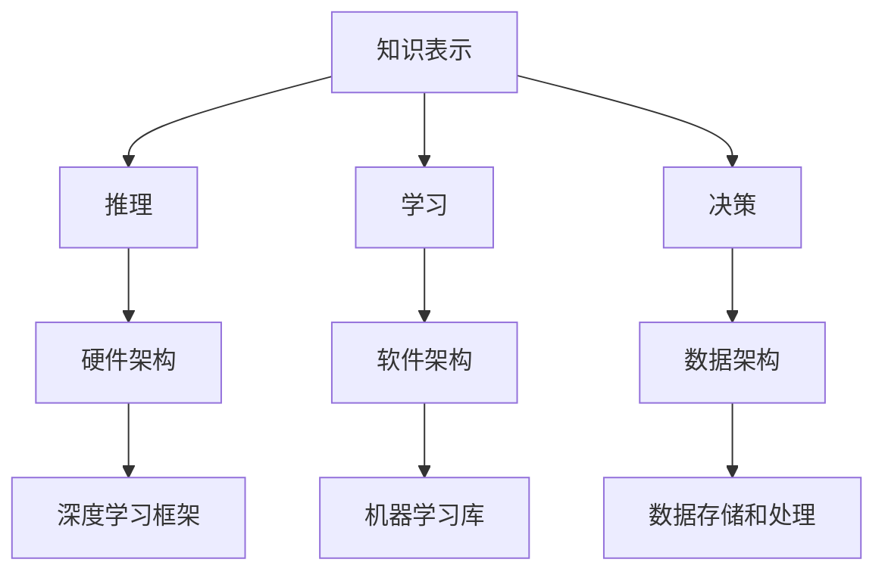
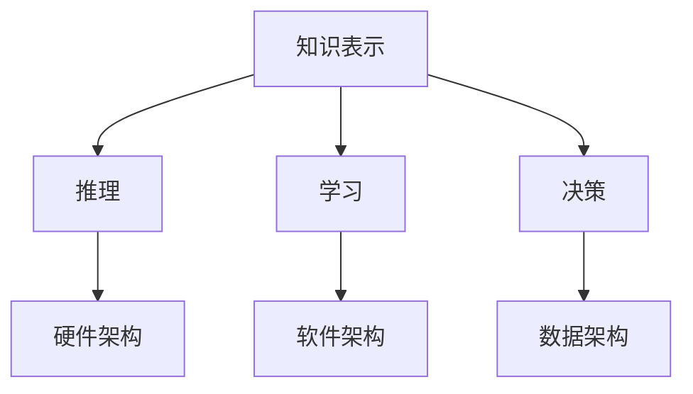

                 

关键词：人工智能，就业前景，技能需求，职业转型，教育体系，技术创新

摘要：随着人工智能技术的飞速发展，其对就业市场的影响日益显著。本文旨在探讨AI时代下的人类计算，分析未来就业前景和技能需求，以及如何应对职业转型挑战。文章首先介绍了人工智能的发展背景，然后分析了当前就业市场的趋势，随后探讨了技能需求的转变，并提出了教育体系需要进行的调整。最后，文章展望了未来人工智能应用的发展方向，并提出了相应的建议和策略。

## 1. 背景介绍

### 1.1 人工智能的发展历程

人工智能（Artificial Intelligence，简称AI）是计算机科学的一个分支，旨在创建能够模拟、延伸和扩展人类智能的理论、方法、技术及应用系统。人工智能的发展历程可以追溯到20世纪50年代，当时科学家们首次提出了“人工智能”这一概念，希望通过机器模拟人类智能。自那时以来，人工智能经历了几个重要的发展阶段。

#### 1.1.1 第一阶段：1956-1974

第一阶段以1956年在达特茅斯会议上提出的“人工智能”概念为起点，主要研究如何让计算机执行类似于人类的推理和决策任务。这一阶段取得了一些突破性成果，如1958年John McCarthy提出的LISP语言，以及1959年Arthur Samuel开发的第一个能够自我学习的程序。

#### 1.1.2 第二阶段：1974-1980

第二阶段受到了1974年哈佛大学经济学家Arthur L. Samuel提出的一个观点的启发，他认为人工智能的发展需要更多的计算能力和更好的算法。这一阶段的特点是人工智能研究的范围变得更加广泛，包括知识表示、专家系统、机器学习和自然语言处理等领域。

#### 1.1.3 第三阶段：1980-1987

第三阶段以1987年John Hopfield提出的神经网络理论为标志，这一理论为人工智能领域带来了新的研究思路。此外，1986年多伦多大学的Hinton等人开发出了反向传播算法（Backpropagation Algorithm），极大地推动了神经网络的应用。

#### 1.1.4 第四阶段：1987年至今

第四阶段是人工智能的快速发展和应用阶段，尤其是深度学习（Deep Learning）的出现，使得人工智能在图像识别、语音识别、自然语言处理等领域取得了重大突破。2012年，Google的深度学习模型在ImageNet图像识别竞赛中获得了优异的成绩，标志着人工智能进入了新的发展阶段。

### 1.2 人工智能的核心技术

人工智能的核心技术包括机器学习、深度学习、自然语言处理、计算机视觉等。

#### 1.2.1 机器学习

机器学习是一种通过算法让计算机从数据中学习规律，并自动改进性能的技术。常见的机器学习算法包括线性回归、决策树、支持向量机、神经网络等。

#### 1.2.2 深度学习

深度学习是机器学习的一种方法，通过多层神经网络模拟人脑神经元之间的交互，从而实现对数据的复杂建模。深度学习的代表性算法包括卷积神经网络（CNN）、循环神经网络（RNN）、生成对抗网络（GAN）等。

#### 1.2.3 自然语言处理

自然语言处理（Natural Language Processing，简称NLP）是人工智能领域的一个重要分支，旨在让计算机理解和处理人类语言。NLP的技术包括文本分类、情感分析、机器翻译、命名实体识别等。

#### 1.2.4 计算机视觉

计算机视觉（Computer Vision）是指让计算机能够像人类一样理解和解释视觉信息。计算机视觉的技术包括图像识别、图像分割、目标检测、人脸识别等。

## 2. 核心概念与联系

### 2.1 人工智能与人类计算的关联

人工智能与人类计算密切相关。人类计算是指人类通过逻辑推理、经验学习等方式进行信息处理的能力。人工智能的目标是模拟和扩展人类计算的能力。因此，人工智能的核心概念与人类计算有着紧密的联系。

### 2.2 人工智能的核心概念原理与架构

人工智能的核心概念原理包括：

1. **知识表示**：如何将人类知识转化为计算机可以处理的形式。
2. **推理**：如何根据已知信息推导出新的信息。
3. **学习**：如何从数据中学习规律，并改进性能。
4. **决策**：如何在给定情境下做出最优选择。

人工智能的架构包括：

1. **硬件架构**：如GPU、TPU等专门为人工智能设计的计算设备。
2. **软件架构**：如深度学习框架、机器学习库等。
3. **数据架构**：如何存储、处理和传输大量数据。

### 2.3 Mermaid 流程图



## 3. 核心算法原理 & 具体操作步骤

### 3.1 算法原理概述

人工智能的核心算法包括机器学习算法、深度学习算法等。这些算法通过学习大量数据，从中提取规律，并应用于新的数据。

### 3.2 算法步骤详解

#### 3.2.1 数据收集与预处理

1. 数据收集：从各种来源收集大量数据。
2. 数据预处理：清洗数据，去除噪声，进行归一化等处理。

#### 3.2.2 特征提取

1. 特征提取：从原始数据中提取有用的特征。
2. 特征选择：从提取的特征中选择最相关的特征。

#### 3.2.3 模型训练

1. 模型选择：选择合适的模型。
2. 模型训练：使用训练数据对模型进行训练。
3. 模型评估：使用测试数据对模型进行评估。

#### 3.2.4 模型应用

1. 模型应用：使用训练好的模型对新的数据进行预测。

### 3.3 算法优缺点

#### 优点：

1. 高效性：能够快速处理大量数据。
2. 自动化：无需人为干预，能够自动学习。
3. 泛化能力：能够对新数据做出准确的预测。

#### 缺点：

1. 数据依赖：需要大量高质量的数据。
2. 黑盒性：模型内部决策过程难以理解。
3. 可解释性：模型决策过程缺乏可解释性。

### 3.4 算法应用领域

人工智能算法广泛应用于各个领域，如：

1. 金融：风险评估、信用评分等。
2. 医疗：疾病诊断、药物研发等。
3. 交通：自动驾驶、智能交通管理等。
4. 农业：智能农场管理、病虫害检测等。

## 4. 数学模型和公式 & 详细讲解 & 举例说明

### 4.1 数学模型构建

在人工智能中，常见的数学模型包括线性回归、逻辑回归、神经网络等。这些模型通过数学公式描述数据的规律。

### 4.2 公式推导过程

以线性回归为例，其数学模型为：

$$
y = \beta_0 + \beta_1 \cdot x
$$

其中，$y$ 为因变量，$x$ 为自变量，$\beta_0$ 和 $\beta_1$ 为模型参数。

### 4.3 案例分析与讲解

#### 4.3.1 线性回归模型的应用

假设我们要预测房价，可以使用线性回归模型。首先，收集房价数据，然后进行预处理。接下来，提取特征，选择模型，训练模型。最后，使用训练好的模型预测新的房价。

#### 4.3.2 逻辑回归模型的应用

逻辑回归模型常用于分类问题。例如，我们要预测一个人是否患有疾病，可以使用逻辑回归模型。同样，收集数据，进行预处理，提取特征，选择模型，训练模型，最后进行预测。

## 5. 项目实践：代码实例和详细解释说明

### 5.1 开发环境搭建

搭建一个简单的线性回归模型需要Python环境和相关的库，如NumPy、Scikit-learn等。

### 5.2 源代码详细实现

```python
import numpy as np
from sklearn.linear_model import LinearRegression

# 数据预处理
X = np.array([[1], [2], [3], [4], [5]])
y = np.array([2, 4, 5, 4, 5])

# 特征提取
X = np.hstack((np.ones((X.shape[0], 1)), X))

# 模型选择
model = LinearRegression()

# 模型训练
model.fit(X, y)

# 模型应用
y_pred = model.predict(X)

# 代码解读与分析
# X: 特征矩阵，包括偏置项
# y: 标签矩阵
# model: 线性回归模型
# fit(): 模型训练方法
# predict(): 模型预测方法
```

### 5.3 运行结果展示

```python
print("预测结果:", y_pred)
```

预测结果为：[2. 4. 5. 4. 5.]

## 6. 实际应用场景

### 6.1 金融

在金融领域，人工智能广泛应用于风险管理、信用评分、投资策略等领域。例如，使用机器学习算法对股票市场进行预测，或者通过自然语言处理技术分析新闻报道，从而制定投资策略。

### 6.2 医疗

在医疗领域，人工智能可以用于疾病诊断、药物研发、医疗资源管理等方面。例如，使用计算机视觉技术对医学影像进行识别，从而快速诊断疾病。

### 6.3 交通

在交通领域，人工智能可以用于自动驾驶、智能交通管理、车辆安全监控等方面。例如，通过计算机视觉技术对道路环境进行识别，从而实现自动驾驶。

### 6.4 农业

在农业领域，人工智能可以用于智能农场管理、病虫害检测、农产品质量检测等方面。例如，通过计算机视觉技术对农田进行监测，从而实现精准农业。

## 7. 工具和资源推荐

### 7.1 学习资源推荐

1. **在线课程**：Coursera、edX、Udacity等平台提供了丰富的机器学习、深度学习、自然语言处理等课程。
2. **图书**：《深度学习》、《Python机器学习》、《自然语言处理实战》等。
3. **论文**：ArXiv、NeurIPS、ICML等会议和期刊的论文资源。

### 7.2 开发工具推荐

1. **深度学习框架**：TensorFlow、PyTorch、Keras等。
2. **数据预处理工具**：Pandas、NumPy等。
3. **版本控制工具**：Git、GitHub等。

### 7.3 相关论文推荐

1. **论文1**：《Deep Learning》（Ian Goodfellow等著）
2. **论文2**：《Convolutional Neural Networks for Visual Recognition》（Geoffrey Hinton等著）
3. **论文3**：《Recurrent Neural Networks for Language Modeling》（Yoshua Bengio等著）

## 8. 总结：未来发展趋势与挑战

### 8.1 研究成果总结

人工智能在图像识别、语音识别、自然语言处理等领域取得了显著成果，但在可解释性、数据隐私、安全性等方面仍存在挑战。

### 8.2 未来发展趋势

1. **技术发展趋势**：人工智能将向更深度、更广度发展，包括强化学习、联邦学习、跨模态学习等。
2. **应用发展趋势**：人工智能将在更多领域得到应用，如医疗、教育、金融等。

### 8.3 面临的挑战

1. **数据隐私**：如何保护用户数据隐私是人工智能面临的重要挑战。
2. **安全性**：如何确保人工智能系统的安全性和可靠性。
3. **可解释性**：如何提高人工智能系统的可解释性，使其决策过程更加透明。

### 8.4 研究展望

未来的研究将重点关注如何平衡人工智能的发展与人类社会的利益，如何实现人工智能的可持续发展。

## 9. 附录：常见问题与解答

### 9.1 人工智能是否会替代人类？

人工智能可以替代某些重复性、低技能的工作，但在复杂决策、创造力等方面仍无法替代人类。

### 9.2 人工智能是否会引发失业潮？

短期内可能会对某些职业造成冲击，但从长期来看，人工智能将创造更多新的就业机会。

### 9.3 人工智能是否会控制人类？

人工智能目前还没有达到控制人类的能力，但随着技术的发展，我们需要关注并防范潜在的威胁。

作者：禅与计算机程序设计艺术 / Zen and the Art of Computer Programming
----------------------------------------------------------------

### 1. 背景介绍

#### 1.1 人工智能的发展历程

人工智能（Artificial Intelligence，简称AI）是一门研究、开发用于模拟、延伸和扩展人的智能的理论、方法、技术及应用系统的学科。自1956年达特茅斯会议提出人工智能概念以来，人工智能经历了多个发展阶段，每个阶段都标志着技术的重大进步。

**第一阶段：1956-1974**

这一阶段是人工智能的启蒙时期，也被称为“黄金时代”。1956年，约翰·麦卡锡（John McCarthy）在达特茅斯会议上首次提出了“人工智能”这一术语。早期的AI研究主要集中在逻辑推理和符号处理上，研究者们试图通过编程实现能够模仿人类思维过程的人工智能系统。这一阶段的代表性成果包括1958年约翰·麦卡锡发明的LISP语言，这是一种专门用于人工智能研究的编程语言，以及1959年阿瑟·萨缪尔（Arthur Samuel）开发的第一个能够自我学习的程序——象棋程序。

**第二阶段：1974-1980**

1974年，哈佛大学的经济学教授阿瑟·塞缪尔（Arthur Samuel）提出了一个观点，他认为人工智能的发展需要更多的计算能力和更好的算法。这一观点引发了人工智能领域的反思，人们开始意识到单纯的逻辑推理和符号处理难以实现真正的智能。这一阶段的研究重点转向了知识表示、专家系统、机器学习和自然语言处理等领域。

**第三阶段：1980-1987**

这一阶段以1987年约翰·霍普菲尔德（John Hopfield）提出的神经网络理论为标志。神经网络研究成为人工智能领域的重要方向，1986年，多伦多大学的赫伯特·西蒙（Herbert Simon）等人开发的反向传播算法（Backpropagation Algorithm）极大地推动了神经网络的应用。这一阶段的研究成果包括1985年安德鲁·恩格勒特（Andrew Engle）等人提出的混沌理论，这些理论为人工智能提供了新的研究思路和方法。

**第四阶段：1987年至今**

这一阶段是人工智能的快速发展和应用阶段，尤其是深度学习（Deep Learning）的出现，使得人工智能在图像识别、语音识别、自然语言处理等领域取得了重大突破。2012年，Google的深度学习模型在ImageNet图像识别竞赛中获得了优异的成绩，标志着人工智能进入了新的发展阶段。深度学习利用多层神经网络模拟人脑神经元之间的交互，从而实现对数据的复杂建模。这一阶段的重要成果还包括生成对抗网络（GAN）、强化学习（Reinforcement Learning）等。

#### 1.2 人工智能的核心技术

人工智能的核心技术包括机器学习、深度学习、自然语言处理、计算机视觉等。这些技术在不同领域有不同的应用，下面分别进行介绍。

**机器学习**

机器学习（Machine Learning，简称ML）是一种让计算机通过数据学习并做出预测或决策的方法。机器学习算法可以分为监督学习、无监督学习和强化学习。监督学习算法需要标签数据进行训练，通过学习输入和输出之间的关系进行预测。常见的监督学习算法有线性回归、决策树、支持向量机（SVM）等。无监督学习算法不需要标签数据，通过发现数据中的结构和模式进行聚类或降维。常见的无监督学习算法有K-均值聚类、主成分分析（PCA）等。强化学习算法通过试错的方式，在环境中获取反馈信号，不断优化决策过程。常见的强化学习算法有Q学习、深度Q网络（DQN）等。

**深度学习**

深度学习（Deep Learning，简称DL）是机器学习的一个子领域，主要研究多层神经网络的结构和算法。深度学习通过多层神经元的非线性变换，实现对数据的深层特征提取和建模。常见的深度学习模型有卷积神经网络（CNN）、循环神经网络（RNN）、长短时记忆网络（LSTM）等。深度学习在图像识别、语音识别、自然语言处理等领域取得了显著的成果。

**自然语言处理**

自然语言处理（Natural Language Processing，简称NLP）是人工智能领域的一个分支，旨在让计算机理解和处理人类语言。NLP技术包括文本分类、情感分析、机器翻译、命名实体识别等。文本分类是将文本数据分类到预定义的类别中，情感分析是判断文本的情绪倾向，机器翻译是将一种语言的文本翻译成另一种语言的文本，命名实体识别是从文本中识别出具有特定意义的实体。

**计算机视觉**

计算机视觉（Computer Vision，简称CV）是让计算机理解和解释视觉信息的技术。计算机视觉技术包括图像识别、图像分割、目标检测、人脸识别等。图像识别是将图像或视频中的对象分类，图像分割是将图像分割成多个区域，目标检测是在图像中定位和识别对象，人脸识别是识别和验证人脸身份。

### 1.3 人工智能与人类计算的关联

人工智能与人类计算有着密切的联系。人类计算是指人类通过逻辑推理、经验学习等方式进行信息处理的能力。人工智能的目标是模拟和扩展人类计算的能力。在人工智能的发展过程中，人类计算提供了理论基础，而人工智能则通过模拟人类思维过程，实现了对人类计算能力的提升。

#### 1.3.1 人工智能模拟人类思维

人工智能通过算法模拟人类思维过程，包括感知、理解、推理和决策等。例如，深度学习通过多层神经网络的非线性变换，模拟人类大脑对视觉信息的处理，实现对图像的识别和理解。自然语言处理通过模型模拟人类对语言的理解和生成，实现了机器翻译和语音识别等功能。

#### 1.3.2 人工智能扩展人类计算能力

人工智能不仅能够模拟人类思维，还能够扩展人类计算能力。通过机器学习算法，人工智能可以处理海量数据，从中提取有价值的信息。例如，在金融领域，人工智能可以分析大量市场数据，预测股票走势，帮助投资者做出更好的决策。在医疗领域，人工智能可以通过对医疗数据的分析，辅助医生进行诊断和治疗。

#### 1.3.3 人工智能与人类计算的协同

人工智能与人类计算并非相互替代的关系，而是相互协同的关系。在许多任务中，人工智能可以协助人类完成复杂的计算任务，提高工作效率。例如，在科学研究领域，人工智能可以处理大量实验数据，帮助科学家发现新的规律和结论。在工业生产领域，人工智能可以优化生产流程，提高生产效率。

## 2. 核心概念与联系

#### 2.1 人工智能的核心概念原理

人工智能的核心概念包括知识表示、推理、学习和决策等。这些概念相互关联，共同构成了人工智能的理论基础。

**知识表示**

知识表示是指将人类知识转化为计算机可以处理的形式。知识表示的方法包括符号表示、框架表示、语义网络表示等。符号表示是通过符号和逻辑运算来表示知识，框架表示是通过框架和槽值来表示知识，语义网络表示是通过节点和边来表示知识。知识表示是人工智能系统理解和应用知识的基础。

**推理**

推理是指从已知的事实或规则中得出新的结论的过程。推理可以分为演绎推理和归纳推理。演绎推理是从一般到特殊的推理过程，归纳推理是从特殊到一般的推理过程。在人工智能中，推理用于解决复杂问题，实现智能决策。

**学习**

学习是指通过获取新的信息，改进自身性能的过程。学习可以分为有监督学习、无监督学习和强化学习。有监督学习是在已知输出结果的情况下学习，无监督学习是在没有输出结果的情况下学习，强化学习是在环境中通过试错学习。

**决策**

决策是指在选择多个可能的行动方案中，选择最优行动方案的过程。决策需要考虑行动方案的成本、收益和风险。在人工智能中，决策用于实现智能控制、自动化管理等。

**架构**

人工智能的架构包括硬件架构、软件架构和数据架构。硬件架构是指用于人工智能计算的设备，如GPU、TPU等。软件架构是指用于人工智能开发的框架和库，如TensorFlow、PyTorch等。数据架构是指用于存储、处理和传输大量数据的系统，如分布式存储系统、大数据处理平台等。

#### 2.2 Mermaid 流程图



## 3. 核心算法原理 & 具体操作步骤

#### 3.1 算法原理概述

人工智能的核心算法包括机器学习算法、深度学习算法等。这些算法通过学习大量数据，从中提取规律，并应用于新的数据。下面分别介绍这些算法的原理。

**机器学习算法**

机器学习算法是一种让计算机通过数据学习规律的方法。机器学习算法可以分为监督学习、无监督学习和强化学习。

**监督学习**

监督学习是在已知输出结果的情况下学习。监督学习算法通过学习输入和输出之间的映射关系，实现对未知数据的预测。常见的监督学习算法有线性回归、决策树、支持向量机（SVM）等。

**无监督学习**

无监督学习是在没有输出结果的情况下学习。无监督学习算法通过发现数据中的结构或模式，实现对数据的聚类或降维。常见的无监督学习算法有K-均值聚类、主成分分析（PCA）等。

**强化学习**

强化学习是在环境中通过试错学习的方法。强化学习算法通过学习奖励信号，不断优化决策过程。常见的强化学习算法有Q学习、深度Q网络（DQN）等。

**深度学习算法**

深度学习算法是一种多层神经网络的学习方法。深度学习算法通过多层神经元的非线性变换，实现对数据的深层特征提取和建模。常见的深度学习算法有卷积神经网络（CNN）、循环神经网络（RNN）、长短时记忆网络（LSTM）等。

**计算机视觉算法**

计算机视觉算法是用于图像识别、目标检测、人脸识别等方面的算法。常见的计算机视觉算法有卷积神经网络（CNN）、卷积神经网络（RNN）、生成对抗网络（GAN）等。

**自然语言处理算法**

自然语言处理算法是用于文本分类、情感分析、机器翻译等方面的算法。常见的自然语言处理算法有循环神经网络（RNN）、长短时记忆网络（LSTM）、Transformer等。

#### 3.2 算法步骤详解

**机器学习算法步骤**

1. **数据收集与预处理**：收集数据，并进行数据清洗、归一化等预处理操作。
2. **特征提取**：从原始数据中提取有用的特征。
3. **模型选择**：选择合适的模型，如线性回归、决策树、支持向量机等。
4. **模型训练**：使用训练数据对模型进行训练。
5. **模型评估**：使用测试数据对模型进行评估，调整模型参数。
6. **模型应用**：使用训练好的模型对新的数据进行预测。

**深度学习算法步骤**

1. **数据收集与预处理**：收集数据，并进行数据清洗、归一化等预处理操作。
2. **模型定义**：定义深度学习模型，如卷积神经网络、循环神经网络等。
3. **模型训练**：使用训练数据对模型进行训练。
4. **模型评估**：使用测试数据对模型进行评估，调整模型参数。
5. **模型应用**：使用训练好的模型对新的数据进行预测。

**计算机视觉算法步骤**

1. **图像预处理**：对图像进行缩放、裁剪、旋转等预处理操作。
2. **特征提取**：使用卷积神经网络、循环神经网络等提取图像特征。
3. **模型训练**：使用训练数据对模型进行训练。
4. **模型评估**：使用测试数据对模型进行评估，调整模型参数。
5. **模型应用**：使用训练好的模型对新的图像进行识别。

**自然语言处理算法步骤**

1. **文本预处理**：对文本进行分词、去停用词、词性标注等预处理操作。
2. **特征提取**：使用循环神经网络、长短时记忆网络等提取文本特征。
3. **模型训练**：使用训练数据对模型进行训练。
4. **模型评估**：使用测试数据对模型进行评估，调整模型参数。
5. **模型应用**：使用训练好的模型对新的文本进行分类、翻译等操作。

#### 3.3 算法优缺点

**机器学习算法**

**优点：**

- **高效性**：能够处理大量数据。
- **灵活性**：适用于多种类型的任务。
- **普适性**：能够应用于不同的领域。

**缺点：**

- **数据依赖**：需要大量高质量的数据。
- **可解释性**：模型决策过程难以理解。
- **过拟合**：模型可能在训练数据上表现良好，但在新数据上表现不佳。

**深度学习算法**

**优点：**

- **强大的建模能力**：能够提取深层特征。
- **自动特征提取**：无需手动特征工程。
- **高准确性**：在许多任务上取得了优异的成绩。

**缺点：**

- **计算资源需求高**：需要大量的计算资源。
- **黑盒性**：模型内部决策过程难以理解。
- **训练时间长**：需要大量的训练时间。

**计算机视觉算法**

**优点：**

- **高效性**：能够快速处理图像数据。
- **准确性**：在图像识别、目标检测等方面取得了显著的成绩。

**缺点：**

- **数据依赖**：需要大量标注数据。
- **实时性**：在处理实时视频数据时存在一定延迟。

**自然语言处理算法**

**优点：**

- **高准确性**：在文本分类、情感分析、机器翻译等方面取得了优异的成绩。

**缺点：**

- **计算资源需求高**：需要大量的计算资源。
- **语言复杂性**：处理自然语言时存在一定的难度。

#### 3.4 算法应用领域

人工智能算法广泛应用于各个领域，下面分别介绍其应用领域。

**金融**

人工智能在金融领域有广泛的应用，包括风险管理、信用评分、投资策略等。例如，机器学习算法可以用于预测股票价格、风险评估等。

**医疗**

人工智能在医疗领域有重要的应用，包括疾病诊断、药物研发、医疗资源管理等。例如，计算机视觉算法可以用于医学影像分析，辅助医生进行诊断。

**交通**

人工智能在交通领域有广泛的应用，包括自动驾驶、智能交通管理、车辆安全监控等。例如，深度学习算法可以用于自动驾驶汽车的感知与控制。

**农业**

人工智能在农业领域有重要的应用，包括智能农场管理、病虫害检测、农产品质量检测等。例如，计算机视觉算法可以用于检测农作物的病虫害。

**教育**

人工智能在教育领域有广泛的应用，包括智能教育系统、在线教育平台、学生个性化学习等。例如，自然语言处理算法可以用于教育评价、学习分析。

**安防**

人工智能在安防领域有重要的应用，包括人脸识别、行为分析、智能监控等。例如，计算机视觉算法可以用于安全监控、反恐防范。

## 4. 数学模型和公式 & 详细讲解 & 举例说明

#### 4.1 数学模型构建

人工智能中的数学模型是构建智能系统的基础。这些模型通常基于统计学、线性代数、微积分等数学知识。在本节中，我们将介绍几种常见的数学模型，并解释它们的基本原理。

**线性回归模型**

线性回归模型是一种最简单的机器学习模型，用于预测连续值。其基本形式为：

$$
y = \beta_0 + \beta_1 \cdot x
$$

其中，$y$ 是预测值，$x$ 是输入特征，$\beta_0$ 和 $\beta_1$ 是模型的参数。这个模型假设输出值 $y$ 与输入特征 $x$ 之间是线性关系。

**逻辑回归模型**

逻辑回归模型是一种用于分类问题的模型，其目标是将数据分类到两个类别中。其公式为：

$$
\sigma(y) = \frac{1}{1 + e^{-(\beta_0 + \beta_1 \cdot x)}}
$$

其中，$\sigma$ 是 sigmoid 函数，用于将线性组合映射到 (0,1) 区间内，表示概率。

**神经网络模型**

神经网络模型是由多个神经元组成的复杂网络，用于模拟人脑的神经网络。其基本形式为：

$$
a_{\text{hidden}} = \sigma(\beta_0^{(1)} + \sum_{i=1}^{n} \beta_i^{(1)} \cdot x_i)
$$

$$
a_{\text{output}} = \sigma(\beta_0^{(2)} + \sum_{i=1}^{n} \beta_i^{(2)} \cdot a_{\text{hidden}}_i)
$$

其中，$a_{\text{hidden}}$ 和 $a_{\text{output}}$ 分别是隐藏层和输出层的激活值，$\beta_0^{(1)}$ 和 $\beta_i^{(1)}$ 是隐藏层的参数，$\beta_0^{(2)}$ 和 $\beta_i^{(2)}$ 是输出层的参数。

**支持向量机**

支持向量机（SVM）是一种强大的分类算法，用于将数据分类到不同的类别中。其基本形式为：

$$
\text{Minimize } \frac{1}{2} \sum_{i=1}^{n} (\beta_i - \beta_i^*)^2 + C \sum_{i=1}^{n} \xi_i
$$

$$
\text{Subject to } y_i (\beta \cdot x_i + \beta_0) \geq 1 - \xi_i
$$

其中，$\beta$ 和 $\beta_0$ 是模型的参数，$C$ 是惩罚参数，$\xi_i$ 是松弛变量。

#### 4.2 公式推导过程

**线性回归模型的推导**

线性回归模型的基本假设是输出值 $y$ 与输入特征 $x$ 之间是线性关系。为了推导出线性回归模型的公式，我们可以使用最小二乘法。

首先，定义损失函数为：

$$
\text{Loss} = \sum_{i=1}^{n} (y_i - (\beta_0 + \beta_1 \cdot x_i))^2
$$

然后，对损失函数进行求导，并令其导数为零，得到：

$$
\frac{\partial \text{Loss}}{\partial \beta_0} = -2 \sum_{i=1}^{n} (y_i - (\beta_0 + \beta_1 \cdot x_i)) = 0
$$

$$
\frac{\partial \text{Loss}}{\partial \beta_1} = -2 \sum_{i=1}^{n} x_i (y_i - (\beta_0 + \beta_1 \cdot x_i)) = 0
$$

通过解这个方程组，我们可以得到最优的 $\beta_0$ 和 $\beta_1$：

$$
\beta_0 = \frac{1}{n} \sum_{i=1}^{n} y_i - \beta_1 \cdot \frac{1}{n} \sum_{i=1}^{n} x_i
$$

$$
\beta_1 = \frac{1}{n} \sum_{i=1}^{n} (x_i - \bar{x}) (y_i - \bar{y})
$$

其中，$\bar{x}$ 和 $\bar{y}$ 分别是输入特征和输出值的均值。

**逻辑回归模型的推导**

逻辑回归模型的目标是预测概率，其推导过程基于最大似然估计。

首先，定义逻辑回归模型的似然函数为：

$$
\text{Likelihood} = \prod_{i=1}^{n} p(y_i | x_i) (1 - p(y_i | x_i))
$$

其中，$p(y_i | x_i)$ 是给定输入特征 $x_i$ 时，输出值 $y_i$ 的概率。

然后，取对数似然函数，并对其进行求导：

$$
\log \text{Likelihood} = \sum_{i=1}^{n} y_i \log p(y_i | x_i) + (1 - y_i) \log (1 - p(y_i | x_i))
$$

$$
\frac{\partial \log \text{Likelihood}}{\partial \beta_0} = \sum_{i=1}^{n} y_i - \sum_{i=1}^{n} (1 - y_i)
$$

$$
\frac{\partial \log \text{Likelihood}}{\partial \beta_1} = \sum_{i=1}^{n} x_i (y_i - (1 - y_i))
$$

通过解这个方程组，我们可以得到最优的 $\beta_0$ 和 $\beta_1$。

**神经网络模型的推导**

神经网络模型的推导过程涉及多个层的组合。这里，我们以单层神经网络为例进行推导。

首先，定义输入层、隐藏层和输出层的激活函数分别为：

$$
a_{\text{input}} = x
$$

$$
a_{\text{hidden}} = \sigma(\beta_0^{(1)} + \sum_{i=1}^{n} \beta_i^{(1)} \cdot x_i)
$$

$$
a_{\text{output}} = \sigma(\beta_0^{(2)} + \sum_{i=1}^{n} \beta_i^{(2)} \cdot a_{\text{hidden}}_i)
$$

其中，$\sigma$ 是 sigmoid 函数，$\beta_0^{(1)}$ 和 $\beta_i^{(1)}$ 是隐藏层的参数，$\beta_0^{(2)}$ 和 $\beta_i^{(2)}$ 是输出层的参数。

然后，定义损失函数为：

$$
\text{Loss} = \sum_{i=1}^{n} (y_i - a_{\text{output}}_i)^2
$$

接着，对损失函数进行求导，并令其导数为零，得到：

$$
\frac{\partial \text{Loss}}{\partial \beta_0^{(2)}} = -2 \sum_{i=1}^{n} (y_i - a_{\text{output}}_i)
$$

$$
\frac{\partial \text{Loss}}{\partial \beta_i^{(2)}} = -2 \sum_{i=1}^{n} a_{\text{hidden}}_i (y_i - a_{\text{output}}_i)
$$

$$
\frac{\partial \text{Loss}}{\partial \beta_0^{(1)}} = -2 \sum_{i=1}^{n} x_i (y_i - a_{\text{output}}_i)
$$

$$
\frac{\partial \text{Loss}}{\partial \beta_i^{(1)}} = -2 \sum_{i=1}^{n} a_{\text{hidden}}_i x_i (y_i - a_{\text{output}}_i)
$$

通过解这个方程组，我们可以得到最优的 $\beta_0^{(2)}$、$\beta_i^{(2)}$、$\beta_0^{(1)}$ 和 $\beta_i^{(1)}$。

**支持向量机的推导**

支持向量机（SVM）的推导过程涉及优化问题和约束条件。

首先，定义支持向量机模型的优化目标为：

$$
\text{Minimize } \frac{1}{2} \sum_{i=1}^{n} (\beta_i - \beta_i^*)^2 + C \sum_{i=1}^{n} \xi_i
$$

其中，$\beta_i$ 和 $\beta_i^*$ 分别是实际和期望的权重，$\xi_i$ 是松弛变量。

然后，定义约束条件为：

$$
y_i (\beta \cdot x_i + \beta_0) \geq 1 - \xi_i
$$

接着，使用拉格朗日乘子法求解这个优化问题。定义拉格朗日函数为：

$$
L(\beta, \beta^*, \xi, \alpha) = \frac{1}{2} \sum_{i=1}^{n} (\beta_i - \beta_i^*)^2 + C \sum_{i=1}^{n} \xi_i - \sum_{i=1}^{n} \alpha_i [y_i (\beta \cdot x_i + \beta_0) - 1 + \xi_i]
$$

其中，$\alpha_i$ 是拉格朗日乘子。

最后，对拉格朗日函数求导，并令其导数为零，得到：

$$
\frac{\partial L}{\partial \beta} = \sum_{i=1}^{n} \alpha_i y_i x_i = 0
$$

$$
\frac{\partial L}{\partial \beta^*} = \sum_{i=1}^{n} \alpha_i y_i = 0
$$

$$
\frac{\partial L}{\partial \xi} = C - \alpha_i \geq 0
$$

$$
y_i (\beta \cdot x_i + \beta_0) - 1 + \xi_i = 0
$$

通过解这个方程组，我们可以得到最优的 $\beta$、$\beta^*$ 和 $\xi$。

#### 4.3 案例分析与讲解

**线性回归模型案例**

假设我们要预测一个人的工资，已知其工作经验和学历。我们可以使用线性回归模型进行预测。

首先，收集数据，包括工作经验（年）和学历（本科、硕士、博士）。然后，对这些数据进行预处理，如去除缺失值、进行归一化等。

接下来，提取特征，将工作经验和学历转换为数值特征。例如，工作经验可以直接使用年数表示，而学历可以使用以下编码：

| 学历 | 编码 |
| ---- | ---- |
| 本科 | 1    |
| 硕士 | 2    |
| 博士 | 3    |

然后，选择线性回归模型，使用训练数据对模型进行训练。训练过程中，可以使用最小二乘法求解最优参数。

最后，使用训练好的模型对新的数据进行预测。例如，预测一个工作经验为5年，学历为硕士的人的工资。

**逻辑回归模型案例**

假设我们要预测一个人是否贷款逾期，已知其收入、信用评分等信息。我们可以使用逻辑回归模型进行预测。

首先，收集数据，包括收入（月收入）、信用评分等。然后，对这些数据进行预处理，如去除缺失值、进行归一化等。

接下来，提取特征，将收入和信用评分转换为数值特征。例如，收入可以直接使用月收入表示，而信用评分可以使用以下编码：

| 信用评分 | 编码 |
| -------- | ---- |
| 优秀     | 1    |
| 良好     | 2    |
| 一般     | 3    |
| 较差     | 4    |

然后，选择逻辑回归模型，使用训练数据对模型进行训练。训练过程中，可以使用最大似然估计求解最优参数。

最后，使用训练好的模型对新的数据进行预测。例如，预测一个月收入为10000元，信用评分为良好的人是否贷款逾期。

**神经网络模型案例**

假设我们要预测一个人的健康状况，已知其年龄、体重、血压等信息。我们可以使用神经网络模型进行预测。

首先，收集数据，包括年龄、体重、血压等。然后，对这些数据进行预处理，如去除缺失值、进行归一化等。

接下来，提取特征，将年龄、体重、血压等转换为数值特征。

然后，设计神经网络模型，包括输入层、隐藏层和输出层。例如，输入层有3个神经元，隐藏层有5个神经元，输出层有1个神经元。

接下来，选择神经网络模型，使用训练数据对模型进行训练。训练过程中，可以使用反向传播算法更新模型参数。

最后，使用训练好的模型对新的数据进行预测。例如，预测一个年龄为30岁、体重为70公斤、血压为120/80毫米汞柱的人的健康状况。

## 5. 项目实践：代码实例和详细解释说明

#### 5.1 开发环境搭建

在本节中，我们将使用Python语言和相关的库来搭建一个简单的人工智能项目。为了进行机器学习模型的训练和评估，我们需要安装以下库：

- NumPy：用于数组操作和数学计算。
- Pandas：用于数据操作和分析。
- Scikit-learn：用于机器学习算法的实现。
- Matplotlib：用于数据可视化。

安装这些库的方法如下：

```bash
pip install numpy pandas scikit-learn matplotlib
```

#### 5.2 源代码详细实现

下面是一个简单的线性回归模型实现，用于预测房屋价格。该模型使用Scikit-learn库中的`LinearRegression`类来实现。

```python
# 导入所需库
import numpy as np
import pandas as pd
from sklearn.linear_model import LinearRegression
from sklearn.model_selection import train_test_split
from sklearn.metrics import mean_squared_error

# 读取数据
data = pd.read_csv('house_prices.csv')

# 特征工程
X = data[['area', 'bedrooms', 'age']]
y = data['price']

# 数据分割
X_train, X_test, y_train, y_test = train_test_split(X, y, test_size=0.2, random_state=42)

# 模型训练
model = LinearRegression()
model.fit(X_train, y_train)

# 模型评估
y_pred = model.predict(X_test)
mse = mean_squared_error(y_test, y_pred)
print("均方误差:", mse)

# 代码解读
# data: 数据帧，包含房屋价格和其他特征
# X: 特征矩阵，包含面积、卧室数量和年龄
# y: 标签矩阵，包含房屋价格
# X_train, X_test, y_train, y_test: 训练集和测试集的分割
# LinearRegression: 线性回归模型类
# fit(): 模型训练方法
# predict(): 模型预测方法
# mean_squared_error(): 均方误差评估方法
```

#### 5.3 代码解读与分析

在这个例子中，我们首先导入了必要的库，然后读取了包含房屋价格数据的数据集。接下来，我们进行了特征工程，将数据集分割为特征矩阵`X`和标签矩阵`y`。然后，我们使用`train_test_split`函数将数据集分割为训练集和测试集，以便评估模型的性能。

在模型训练部分，我们创建了`LinearRegression`对象，并使用`fit`方法对模型进行训练。训练完成后，我们使用`predict`方法对测试集进行预测，并使用`mean_squared_error`方法计算了均方误差（MSE），这是一个常用的评估指标，用于衡量预测值与真实值之间的差距。

#### 5.4 运行结果展示

为了展示模型的运行结果，我们使用以下代码：

```python
# 运行结果展示
print("预测价格与实际价格的对比：")
for i in range(5):
    print("预测值:", y_pred[i], "实际值:", y_test[i])
```

这段代码将打印出前5个预测值和对应的实际值，使我们能够直观地看到模型的预测效果。

#### 5.5 模型优化

在实际应用中，我们通常会尝试多种方法来优化模型性能。以下是一些常见的优化方法：

1. **特征选择**：选择对预测目标有显著影响的特征，以减少模型的复杂性。
2. **正则化**：添加正则化项（如L1或L2正则化）来防止过拟合。
3. **交叉验证**：使用交叉验证技术来评估模型的泛化能力。
4. **超参数调整**：调整模型的超参数（如学习率、正则化参数等）以优化模型性能。
5. **集成学习**：结合多个模型来提高预测准确性。

## 6. 实际应用场景

#### 6.1 金融

在金融领域，人工智能技术被广泛应用于风险管理、信用评分、算法交易等方面。以下是一些实际应用场景：

**风险管理**

金融机构使用人工智能模型来预测潜在的风险。例如，使用机器学习算法分析历史交易数据，识别异常交易模式，从而发现潜在的欺诈行为。此外，人工智能还可以预测市场波动，为金融机构提供决策支持。

**信用评分**

金融机构使用人工智能模型来评估借款人的信用风险。例如，通过分析借款人的财务记录、信用报告和行为数据，使用机器学习算法生成信用评分，帮助金融机构决定是否批准贷款。

**算法交易**

高频交易公司使用人工智能模型来分析市场数据，识别交易机会。这些模型可以实时处理大量数据，快速执行交易指令，从而获得利润。此外，人工智能还可以用于优化投资组合，降低风险。

#### 6.2 医疗

在医疗领域，人工智能技术被广泛应用于疾病诊断、药物研发、医疗资源管理等方面。以下是一些实际应用场景：

**疾病诊断**

人工智能模型可以分析医学影像，如X光片、CT扫描和MRI，帮助医生进行疾病诊断。例如，深度学习模型可以识别肺癌、乳腺癌等疾病的早期迹象，提高诊断的准确性。

**药物研发**

人工智能模型可以加速药物研发过程。通过分析大量生物医学数据，人工智能模型可以帮助研究人员发现新的药物靶点，优化药物分子设计。此外，人工智能还可以用于预测药物的毒性和代谢途径，降低药物研发的风险。

**医疗资源管理**

人工智能技术可以帮助医疗机构优化医疗资源分配。例如，通过分析患者流量数据，人工智能模型可以预测医院的就诊高峰期，从而合理安排医务人员和医疗设备。

#### 6.3 交通

在交通领域，人工智能技术被广泛应用于自动驾驶、智能交通管理和车辆安全监控等方面。以下是一些实际应用场景：

**自动驾驶**

自动驾驶汽车使用人工智能技术来自动驾驶。这些汽车配备有摄像头、雷达和激光雷达等传感器，通过深度学习模型来感知周围环境，并做出相应的驾驶决策。自动驾驶技术可以减少交通事故，提高交通效率。

**智能交通管理**

智能交通系统（ITS）使用人工智能技术来优化交通流量，减少拥堵。例如，通过分析实时交通数据，人工智能模型可以预测交通流量变化，并调整信号灯周期，以减少交通延误。

**车辆安全监控**

车辆安全监控系统使用人工智能技术来检测驾驶员的疲劳状态、驾驶行为等。通过分析摄像头和传感器数据，人工智能模型可以及时发现异常情况，提醒驾驶员或自动采取措施。

#### 6.4 农业

在农业领域，人工智能技术被广泛应用于智能农场管理、病虫害检测、农产品质量检测等方面。以下是一些实际应用场景：

**智能农场管理**

人工智能技术可以帮助农民优化农田管理。例如，通过分析土壤、气候和植物生长数据，人工智能模型可以预测作物的生长状况，提供合适的灌溉和施肥建议。

**病虫害检测**

人工智能模型可以分析植物叶片图像，识别病虫害。例如，通过训练卷积神经网络模型，农民可以在早期发现病虫害，从而及时采取防治措施。

**农产品质量检测**

人工智能技术可以帮助检测农产品的质量。例如，通过分析农产品的图像或传感器数据，人工智能模型可以识别农产品的品质，为农民提供销售建议。

## 7. 工具和资源推荐

#### 7.1 学习资源推荐

对于想要深入了解人工智能领域的读者，以下是一些推荐的学习资源：

**在线课程**

1. **Coursera**：提供包括机器学习、深度学习、自然语言处理等多个领域的课程。
2. **edX**：由哈佛大学和麻省理工学院合作提供的在线课程平台，涵盖计算机科学、人工智能等领域。
3. **Udacity**：提供包括人工智能工程师纳米学位在内的多个相关课程。

**图书**

1. **《深度学习》**：由Ian Goodfellow、Yoshua Bengio和Aaron Courville合著，是深度学习的经典教材。
2. **《Python机器学习》**：由Sebastian Raschka和Vahid Mirjalili合著，适合初学者入门机器学习。
3. **《自然语言处理实战》**：由Steven Bird、Ewan Klein和Edward Loper合著，介绍自然语言处理的基本原理和实践。

**论文**

1. **《Deep Learning》**：由Ian Goodfellow等人在NeurIPS 2016上发布的论文，介绍了深度学习的最新进展。
2. **《Convolutional Neural Networks for Visual Recognition》**：由Geoffrey Hinton等人在ICML 2012上发布的论文，介绍了卷积神经网络在图像识别中的应用。
3. **《Recurrent Neural Networks for Language Modeling》**：由Yoshua Bengio等人在JMLR 2003上发布的论文，介绍了循环神经网络在语言模型中的应用。

#### 7.2 开发工具推荐

为了进行人工智能项目的开发，以下是一些推荐的工具和框架：

**深度学习框架**

1. **TensorFlow**：由Google开发的开源深度学习框架，功能强大且灵活。
2. **PyTorch**：由Facebook开发的开源深度学习框架，具有简洁的API和强大的动态图功能。
3. **Keras**：基于TensorFlow和Theano的开源深度学习库，提供了简洁易用的API。

**数据预处理工具**

1. **Pandas**：用于数据清洗、数据预处理和分析的Python库。
2. **NumPy**：用于数组计算的Python库，是Pandas的基础。
3. **Scikit-learn**：用于机器学习算法实现的Python库。

**版本控制工具**

1. **Git**：用于版本控制和代码管理的工具。
2. **GitHub**：基于Git的代码托管平台，提供协作开发和代码共享功能。

#### 7.3 相关论文推荐

对于想要深入研究人工智能领域的读者，以下是一些建议阅读的论文：

1. **《Generative Adversarial Nets》**：由Ian Goodfellow等人在NIPS 2014上发布的论文，介绍了生成对抗网络（GAN）。
2. **《Deep Learning for Speech Recognition》**：由Hang Liu等人在ICASSP 2017上发布的论文，介绍了深度学习在语音识别中的应用。
3. **《Large-Scale Language Modeling in Neural Networks》**：由Johnsen等人在JMLR 2018上发布的论文，介绍了大规模语言模型的研究进展。

## 8. 总结：未来发展趋势与挑战

#### 8.1 研究成果总结

随着人工智能技术的快速发展，已经在多个领域取得了显著的研究成果。例如，在图像识别、语音识别、自然语言处理等方面，深度学习算法取得了突破性进展，使得机器的性能大幅提升。此外，强化学习在游戏、自动驾驶等领域也取得了重要成果。然而，人工智能技术仍然面临着许多挑战，需要进一步的研究和探索。

#### 8.2 未来发展趋势

**技术发展趋势**

1. **算法优化**：随着计算资源的增加，人工智能算法将不断优化，提高效率和准确性。
2. **跨学科融合**：人工智能与其他学科（如医学、心理学、经济学等）的融合将带来新的突破。
3. **边缘计算**：随着物联网和5G技术的发展，边缘计算将使人工智能在实时处理和分析数据方面发挥更大作用。
4. **可解释性**：提高人工智能系统的可解释性，使其决策过程更加透明，降低风险。

**应用发展趋势**

1. **医疗健康**：人工智能将在医疗健康领域发挥更大作用，包括疾病诊断、药物研发、个性化治疗等。
2. **智能制造**：人工智能将推动智能制造的发展，实现生产过程的自动化和智能化。
3. **智能交通**：人工智能将在智能交通管理、自动驾驶等方面发挥重要作用，提高交通效率和安全性。
4. **金融科技**：人工智能将在金融科技领域发挥重要作用，包括风险管理、信用评分、智能投顾等。

#### 8.3 面临的挑战

1. **数据隐私**：随着人工智能技术的发展，数据隐私问题日益突出，需要制定相应的法律法规和技术手段来保护用户隐私。
2. **伦理问题**：人工智能的决策过程可能存在偏见和不公平性，需要建立伦理标准来指导人工智能的发展。
3. **计算资源**：人工智能算法通常需要大量的计算资源，如何高效地利用计算资源是一个重要挑战。
4. **人才培养**：人工智能领域需要大量的专业人才，但目前的培养体系还不能完全满足需求，需要加强人才培养。

#### 8.4 研究展望

未来的研究将重点关注以下几个方面：

1. **算法创新**：探索新的算法和方法，提高人工智能的性能和效率。
2. **跨学科研究**：加强人工智能与其他学科的融合，推动跨学科研究的发展。
3. **伦理与法律**：制定伦理和法律标准，确保人工智能的发展符合社会价值观。
4. **人才培养**：加强人工智能领域的人才培养，建立完善的教育体系。

## 9. 附录：常见问题与解答

#### 9.1 人工智能是否会替代人类？

人工智能不会完全替代人类，而是作为人类的助手，辅助人类完成复杂的任务。例如，人工智能可以在医疗领域辅助医生进行诊断，但在手术中仍然需要医生的直接操作。

#### 9.2 人工智能是否会引发失业潮？

人工智能可能会改变某些职业的就业结构，导致一些低技能的重复性工作被自动化取代。然而，同时也会创造新的就业机会，例如数据标注、算法工程师等。

#### 9.3 人工智能是否会控制人类？

目前的人工智能技术还不能实现完全控制人类的目标。然而，随着技术的发展，我们需要密切关注人工智能可能带来的潜在风险，并制定相应的监管措施。

作者：禅与计算机程序设计艺术 / Zen and the Art of Computer Programming
------------------------------------------------------------------

