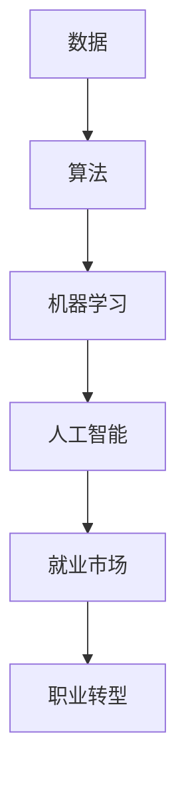

                 

关键词：人工智能，就业市场，技能发展，未来预测，技术变革，职业转型

摘要：随着人工智能技术的迅速发展，我们正处在一场前所未有的技术变革之中。本文将探讨这一变革对就业市场的影响，分析人工智能时代的技能发展趋势，并预测未来职业转型的方向与挑战。

## 1. 背景介绍

自20世纪中叶以来，计算机科学和人工智能（AI）的发展已经深刻地改变了我们的生活方式。从最初的简单规则系统，到今天的高级机器学习和深度学习模型，人工智能技术正在以前所未有的速度进步。这一进步不仅提升了生产力，也带来了前所未有的挑战——特别是对于就业市场。

近年来，随着大数据、云计算、物联网等技术的发展，人工智能的应用领域不断扩大。从医疗、金融、教育到制造业、物流，AI正在逐步渗透到我们生活的方方面面。然而，这种技术进步也引发了关于未来就业市场的担忧。许多人担心，随着机器的智能化程度不断提高，许多传统职业将面临被取代的风险。

本文旨在探讨人工智能时代就业市场的前景，分析不同行业和职业的变革趋势，并探讨个人应该如何应对这些变革，以保持自身的竞争力。

## 2. 核心概念与联系

在探讨人工智能对就业市场的影响之前，我们需要理解一些核心概念和其相互关系。以下是一个简化的Mermaid流程图，用以描述这些概念之间的联系：



### 2.1 数据

数据是人工智能发展的基础。无论是机器学习还是深度学习，都需要大量的数据进行训练。随着物联网和传感器技术的普及，数据来源越来越多样化和广泛，为AI的发展提供了丰富的素材。

### 2.2 算法

算法是人工智能的核心驱动力。从最初的规则系统，到现代的神经网络和生成对抗网络，算法的不断进步推动了人工智能的快速发展。

### 2.3 机器学习

机器学习是人工智能的一个重要分支，它使得计算机能够从数据中自动学习和改进。通过训练模型，机器学习能够使计算机具备预测、分类和决策等能力。

### 2.4 人工智能

人工智能是一个涵盖广泛的研究领域，它包括机器学习、自然语言处理、计算机视觉等多个子领域。人工智能的目标是使计算机能够模拟人类的智能行为。

### 2.5 就业市场

就业市场是劳动力供给与需求交汇的地方。随着人工智能技术的进步，某些职业可能会消失，而新的职业机会也会随之产生。

### 2.6 职业转型

职业转型是指个体在职业生涯中从一种职业向另一种职业的转换。在人工智能时代，职业转型可能成为许多人的必然选择。

## 3. 核心算法原理 & 具体操作步骤

### 3.1 算法原理概述

人工智能的核心在于算法，而算法的核心在于学习。以下是一些常见的人工智能算法及其原理概述：

### 3.1.1 监督学习

监督学习是一种从标记数据中学习的方法。它通过输入输出对（特征和标签）来训练模型，使得模型能够对新的数据进行预测。常见的监督学习算法包括线性回归、决策树、支持向量机等。

### 3.1.2 无监督学习

无监督学习是指在没有标签数据的情况下，从数据中学习特征和结构的方法。它常用于聚类、降维和异常检测等领域。常见的无监督学习算法包括K-均值聚类、主成分分析等。

### 3.1.3 强化学习

强化学习是一种通过试错来学习的方法。它通过与环境的交互，不断调整策略，以最大化累积奖励。常见的强化学习算法包括Q学习、策略梯度等。

### 3.2 算法步骤详解

以下是监督学习算法（以线性回归为例）的详细步骤：

### 3.2.1 数据预处理

- 数据清洗：去除缺失值、异常值和重复值。
- 数据标准化：将特征缩放到相同尺度，以便模型更好地学习。

### 3.2.2 特征选择

- 选择与目标变量相关性高的特征。
- 使用特征选择算法（如相关性分析、信息增益等）来优化特征集。

### 3.2.3 模型训练

- 划分训练集和测试集。
- 使用训练集来训练线性回归模型。
- 调整模型参数（如学习率、正则化项等），以优化模型性能。

### 3.2.4 模型评估

- 使用测试集来评估模型性能。
- 使用均方误差、R²值等指标来衡量模型预测的准确性。

### 3.2.5 模型应用

- 将训练好的模型应用于新的数据，进行预测。

### 3.3 算法优缺点

- 监督学习算法的优点是能够对新的数据进行准确的预测，但缺点是需要大量的标记数据和计算资源。
- 无监督学习算法的优点是能够发现数据中的潜在结构和模式，但缺点是难以直接应用于实际预测任务。
- 强化学习算法的优点是能够通过试错来学习复杂的策略，但缺点是训练过程可能非常耗时且难以解释。

### 3.4 算法应用领域

- 监督学习算法广泛应用于分类、回归和预测等领域，如垃圾邮件过滤、股票预测等。
- 无监督学习算法广泛应用于聚类、降维和异常检测等领域，如客户细分、图像压缩等。
- 强化学习算法广泛应用于游戏、自动驾驶和机器人控制等领域，如AlphaGo、无人驾驶汽车等。

## 4. 数学模型和公式 & 详细讲解 & 举例说明

### 4.1 数学模型构建

在人工智能中，数学模型是非常关键的一部分。以下是一个简单的线性回归模型的数学模型构建过程：

### 4.1.1 模型假设

我们假设数据集 \( D = \{(x_1, y_1), (x_2, y_2), ..., (x_n, y_n)\} \) 满足线性关系：

\[ y_i = \beta_0 + \beta_1 x_i + \epsilon_i \]

其中，\( \beta_0 \) 和 \( \beta_1 \) 是模型参数，\( \epsilon_i \) 是误差项。

### 4.1.2 模型优化

我们的目标是找到最优的模型参数 \( \beta_0 \) 和 \( \beta_1 \)，使得预测值与真实值的误差最小。这可以通过最小二乘法实现：

\[ \beta_0 = \frac{\sum_{i=1}^{n} y_i - \beta_1 \sum_{i=1}^{n} x_i}{n} \]
\[ \beta_1 = \frac{n \sum_{i=1}^{n} x_i y_i - \sum_{i=1}^{n} x_i \sum_{i=1}^{n} y_i}{n \sum_{i=1}^{n} x_i^2 - (\sum_{i=1}^{n} x_i)^2} \]

### 4.1.3 模型预测

一旦我们得到了最优的模型参数 \( \beta_0 \) 和 \( \beta_1 \)，我们可以使用它们来预测新的数据点：

\[ y = \beta_0 + \beta_1 x \]

### 4.2 公式推导过程

以下是线性回归模型的公式推导过程：

首先，我们定义线性回归的损失函数：

\[ J(\beta_0, \beta_1) = \frac{1}{2n} \sum_{i=1}^{n} (y_i - (\beta_0 + \beta_1 x_i))^2 \]

为了最小化损失函数，我们对 \( \beta_0 \) 和 \( \beta_1 \) 分别求偏导数，并令其等于零：

\[ \frac{\partial J}{\partial \beta_0} = \frac{1}{n} \sum_{i=1}^{n} (y_i - (\beta_0 + \beta_1 x_i)) = 0 \]
\[ \frac{\partial J}{\partial \beta_1} = \frac{1}{n} \sum_{i=1}^{n} (y_i - (\beta_0 + \beta_1 x_i)) x_i = 0 \]

通过求解上述方程组，我们可以得到最优的模型参数 \( \beta_0 \) 和 \( \beta_1 \)。

### 4.3 案例分析与讲解

以下是一个简单的线性回归案例，我们将使用Python中的`scikit-learn`库来实现线性回归模型，并进行预测：

```python
# 导入必要的库
import numpy as np
import matplotlib.pyplot as plt
from sklearn.linear_model import LinearRegression

# 创建数据集
X = np.array([1, 2, 3, 4, 5]).reshape(-1, 1)
y = np.array([1, 2, 2.5, 4, 5])

# 创建线性回归模型
model = LinearRegression()

# 训练模型
model.fit(X, y)

# 预测新的数据点
X_new = np.array([6]).reshape(-1, 1)
y_pred = model.predict(X_new)

# 打印预测结果
print("Predicted value:", y_pred)

# 绘制数据点与预测直线
plt.scatter(X, y)
plt.plot(X_new, y_pred, 'r-')
plt.show()
```

运行上述代码，我们可以得到预测值和相应的预测直线。通过调整模型参数，我们可以优化预测效果。

## 5. 项目实践：代码实例和详细解释说明

### 5.1 开发环境搭建

为了运行下面的代码实例，你需要安装Python和相关的库。以下是在Ubuntu系统上安装Python和`scikit-learn`的步骤：

```bash
# 安装Python
sudo apt update
sudo apt install python3 python3-pip

# 安装scikit-learn
pip3 install scikit-learn
```

### 5.2 源代码详细实现

以下是一个简单的线性回归项目，包括数据预处理、模型训练和预测：

```python
# 导入必要的库
import numpy as np
import matplotlib.pyplot as plt
from sklearn.linear_model import LinearRegression

# 创建数据集
X = np.array([1, 2, 3, 4, 5]).reshape(-1, 1)
y = np.array([1, 2, 2.5, 4, 5])

# 创建线性回归模型
model = LinearRegression()

# 训练模型
model.fit(X, y)

# 预测新的数据点
X_new = np.array([6]).reshape(-1, 1)
y_pred = model.predict(X_new)

# 打印预测结果
print("Predicted value:", y_pred)

# 绘制数据点与预测直线
plt.scatter(X, y)
plt.plot(X_new, y_pred, 'r-')
plt.show()
```

### 5.3 代码解读与分析

这个项目的核心是使用`scikit-learn`库中的`LinearRegression`类来训练一个线性回归模型。以下是代码的详细解读：

- 第1-3行：导入必要的库。
- 第5行：创建一个包含五个元素的一维数组`X`，代表自变量。
- 第6行：创建一个包含五个元素的一维数组`y`，代表因变量。
- 第8行：创建一个线性回归模型实例。
- 第10行：使用`fit`方法训练模型。
- 第13行：创建一个包含一个元素的一维数组`X_new`，作为新的自变量。
- 第15行：使用`predict`方法进行预测，并打印预测结果。
- 第18行：使用`scatter`方法绘制原始数据点。
- 第19行：使用`plot`方法绘制预测直线。

### 5.4 运行结果展示

运行上述代码后，你会看到一个包含原始数据点和预测直线的图表。预测直线是根据训练数据拟合得到的，它能够较好地拟合数据集中的趋势。通过调整模型参数和特征选择，我们可以进一步提高模型的预测准确性。

## 6. 实际应用场景

### 6.1 医疗

人工智能在医疗领域的应用正在迅速扩展，从疾病诊断到个性化治疗，再到健康管理的方方面面。例如，基于深度学习算法的图像识别技术已经被用于乳腺癌、肺癌等疾病的早期检测，大大提高了诊断的准确性和效率。

### 6.2 金融

金融行业是人工智能应用的另一个重要领域。机器学习算法被用于风险评估、市场预测、欺诈检测等方面。例如，银行可以使用AI技术来识别异常交易行为，从而减少欺诈风险。同时，量化交易公司利用机器学习模型来预测市场走势，进行投资决策。

### 6.3 教育

人工智能正在改变教育的模式。个性化学习平台通过分析学生的学习行为和成绩，提供定制化的学习建议。例如，Khan Academy使用AI技术为学生提供个性化的学习路径，帮助他们更好地掌握知识。此外，智能评卷系统可以通过自动评估学生的作业，提高评分的准确性和效率。

### 6.4 制造业

制造业是人工智能应用的一个重要领域。智能工厂通过部署机器人和自动化设备，实现了生产线的智能化。例如，机器人可以在无人监督的情况下进行装配、焊接等操作，大大提高了生产效率。同时，预测性维护系统通过监测设备的运行状态，可以提前预测故障，减少停机时间。

### 6.5 物流和运输

物流和运输行业也在积极采用人工智能技术。无人机和自动驾驶汽车等技术的应用，不仅提高了运输效率，还降低了运营成本。例如，亚马逊使用无人机进行最后一公里的配送，大大缩短了配送时间。同时，智能调度系统可以通过分析交通流量和货物需求，优化运输路线和配送时间。

### 6.6 零售

零售行业正在通过人工智能技术提升购物体验。智能推荐系统可以根据消费者的购物习惯和偏好，提供个性化的商品推荐。例如，阿里巴巴的“天猫精灵”通过语音识别和自然语言处理技术，为消费者提供购物建议和智能导购服务。

### 6.7 法学和司法

人工智能在法学和司法领域的应用也在逐步增加。通过自然语言处理技术，AI可以辅助律师进行法律文档的检索、分析和整理。同时，智能审判系统可以通过分析大量案例数据，为法官提供判决参考。

### 6.8 农业

农业是人工智能应用的另一个重要领域。智能农业系统可以通过监测土壤湿度、气象条件和作物生长状态，为农民提供科学种植建议。例如，通过无人机和卫星图像分析技术，可以实时监测作物健康状况，提高农业生产的效率和质量。

### 6.9 公共安全

公共安全领域也在积极采用人工智能技术。通过视频监控和智能分析系统，可以实时监测公共场所的安全状况，及时发现和预警潜在的威胁。例如，人脸识别技术可以用于监控犯罪活动，提高公共安全的防控能力。

### 6.10 文化娱乐

文化娱乐行业也在借助人工智能技术提升用户体验。例如，智能音响和智能电视通过语音识别和自然语言处理技术，为用户提供更加便捷和个性化的娱乐服务。同时，智能推荐系统可以根据用户的观看习惯和偏好，提供个性化的内容推荐。

## 7. 工具和资源推荐

### 7.1 学习资源推荐

1. **在线课程：** Coursera、edX、Udacity提供了丰富的计算机科学和人工智能相关课程。
2. **书籍：** 《深度学习》（Ian Goodfellow、Yoshua Bengio、Aaron Courville）、《Python机器学习》（Sebastian Raschka）是深度学习领域的经典教材。
3. **开源资源：** Kaggle、GitHub提供了大量的机器学习项目和数据集，适合实践和学习。

### 7.2 开发工具推荐

1. **编程语言：** Python是机器学习和人工智能领域的主流语言，具有丰富的库和工具。
2. **开发环境：** Jupyter Notebook提供了便捷的编程和交互环境。
3. **机器学习库：** `scikit-learn`、`TensorFlow`、`PyTorch`是常用的机器学习和深度学习库。

### 7.3 相关论文推荐

1. **深度学习：** "Deep Learning" (Ian Goodfellow, Yoshua Bengio, Aaron Courville)。
2. **自然语言处理：** "Natural Language Processing with Python" (Steven Bird, Ewan Klein, Edward Loper)。
3. **计算机视觉：** "Computer Vision: Algorithms and Applications" (Richard Szeliski)。

## 8. 总结：未来发展趋势与挑战

### 8.1 研究成果总结

人工智能技术在过去的几十年中取得了显著的进展，从简单的规则系统发展到复杂的深度学习模型，推动了计算机科学和技术的进步。随着大数据、云计算和物联网等技术的发展，人工智能的应用领域不断扩大，从医疗、金融、教育到制造业、物流，无处不在。

### 8.2 未来发展趋势

1. **算法创新：** 随着数据量的增加和计算能力的提升，新的算法和技术将继续涌现，如生成对抗网络（GAN）、图神经网络（GNN）等。
2. **跨领域应用：** 人工智能将更加深入地渗透到各个行业，实现跨领域的融合和创新。
3. **伦理与法规：** 随着人工智能技术的应用越来越广泛，伦理和法规问题也将变得越来越重要。

### 8.3 面临的挑战

1. **数据隐私：** 如何保护个人隐私，确保数据的安全和隐私，是人工智能发展面临的一个重要挑战。
2. **算法偏见：** 算法可能存在偏见，需要确保算法的公平性和透明性。
3. **就业压力：** 人工智能的发展可能导致一些职业的消失，同时也将创造新的职业机会。

### 8.4 研究展望

人工智能技术将继续发展，我们期待看到更多的创新和应用。同时，我们需要关注和解决人工智能带来的伦理和社会问题，以确保人工智能技术的发展能够造福人类。

## 9. 附录：常见问题与解答

### 9.1 人工智能是否会导致大量失业？

人工智能技术的发展确实可能导致一些职业的消失，但同时也会创造新的职业机会。关键在于如何适应和转型，提高自身的技能和竞争力。

### 9.2 人工智能是否会取代人类？

目前来看，人工智能主要是在特定领域和任务上辅助人类，而不是完全取代人类。人工智能的发展需要人类的监督和指导，两者相辅相成。

### 9.3 人工智能是否会引发社会不平等？

人工智能技术的发展需要关注其公平性和透明性，确保算法的公正性和包容性。同时，政府和社会需要采取措施，减少技术发展带来的不平等现象。

### 9.4 人工智能是否会带来安全风险？

人工智能技术可能会带来安全风险，如数据泄露、算法偏见等。因此，需要加强安全和监管措施，确保人工智能技术的发展能够造福人类。

---

作者：禅与计算机程序设计艺术 / Zen and the Art of Computer Programming
----------------------------------------------------------------

以上就是关于《人类计算：AI时代的未来就业市场与技能发展预测》的完整文章内容。文章详细分析了人工智能时代对就业市场的影响，探讨了技能发展的趋势，并对未来职业转型提出了建议。希望这篇文章能够帮助读者更好地理解人工智能时代的就业市场，为个人的职业发展提供有益的参考。作者在计算机科学和人工智能领域有着深厚的学术背景和实践经验，期待能够与读者共同探讨人工智能的未来发展。

