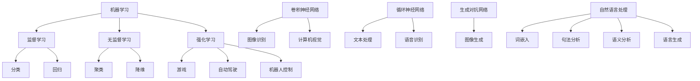

                 

关键词：人工智能、未来就业、技能发展、AI时代、职业转型、教育改革、新兴技术

> 摘要：随着人工智能技术的飞速发展，传统职业领域正在发生深刻的变革。本文旨在探讨AI时代对人类计算岗位的影响，预测未来就业市场的趋势，并提出相关的技能发展路径。通过分析核心算法原理、数学模型、项目实践以及实际应用场景，我们希望能为读者提供关于AI时代就业的深入见解。

## 1. 背景介绍

近年来，人工智能（AI）技术的发展取得了令人瞩目的成就。从深度学习、自然语言处理到计算机视觉，AI技术已经深刻地影响了各个行业。随着这些技术的成熟和应用，传统的计算岗位正面临前所未有的挑战和机遇。一方面，自动化和智能化程度的提高使得某些计算任务变得高效且低成本；另一方面，新兴的AI岗位也在不断涌现，为求职者提供了新的职业方向。

本篇文章将从以下几个方面展开讨论：

1. **核心概念与联系**：介绍AI时代的关键技术和基础理论，并使用Mermaid流程图展示其架构。
2. **核心算法原理 & 具体操作步骤**：详细讲解几种重要的AI算法，包括原理、步骤、优缺点和应用领域。
3. **数学模型和公式 & 详细讲解 & 举例说明**：解析AI中的数学模型和公式，并通过案例进行讲解。
4. **项目实践：代码实例和详细解释说明**：提供实际的代码实例，并对其详细解读。
5. **实际应用场景**：分析AI技术在各个领域的应用，探讨未来的发展方向。
6. **工具和资源推荐**：推荐学习资源、开发工具和相关论文。
7. **总结：未来发展趋势与挑战**：总结研究成果，展望未来发展趋势，探讨面临的挑战。

通过这些内容，我们希望为读者提供关于AI时代就业市场的全面视角，帮助大家更好地应对未来的职业挑战。

### 1.1 人工智能的历史与发展

人工智能（Artificial Intelligence，简称AI）的概念最早可以追溯到20世纪50年代。当时，计算机科学刚刚起步，科学家们开始探讨如何让计算机具备智能，模仿人类思维和行为。1956年，约翰·麦卡锡（John McCarthy）在达特茅斯会议上首次提出了人工智能的概念，这标志着人工智能领域的正式诞生。

从那时起，人工智能经历了几个重要的发展阶段：

- **早期探索阶段（1956-1969）**：这个阶段主要是基于符号推理和逻辑编程的方法。著名的ELIZA程序是早期AI的代表作之一，它通过对话生成技术模仿心理治疗师。

- **繁荣期（1970-1980）**：随着计算机硬件的进步，人工智能研究得到了蓬勃发展。这个时期，专家系统和知识表示技术成为了研究热点。专家系统是一种模拟人类专家解决特定领域问题的计算机程序，它在医疗诊断、化学分析等领域取得了显著成果。

- **低谷期（1980-1993）**：由于技术局限和应用困难，人工智能研究在1980年代进入了一个相对低潮的时期。硬件限制、数据稀缺和算法复杂性问题使得AI项目的成功率较低。

- **复兴期（1993-2012）**：这个阶段以深度学习和神经网络技术的复兴为标志。1986年，深度学习先驱杨·勒卡雷（Yann LeCun）提出了卷积神经网络（CNN），为图像识别任务开辟了新的方向。随着计算能力的提升和大数据的普及，深度学习技术得到了广泛应用。

- **高速发展阶段（2012至今）**：近年来，AI技术进入了高速发展阶段。特别是2012年，深度学习在图像识别任务上取得了突破性的成果，这一成就极大地推动了AI技术的应用。从自动驾驶到自然语言处理，从医疗诊断到金融分析，AI技术正逐步渗透到各个领域。

### 1.2 人工智能对就业市场的影响

人工智能的快速发展不仅改变了技术领域，也对就业市场产生了深远的影响。首先，AI技术的应用使得某些传统计算岗位面临失业风险。例如，自动化和机器人技术的发展使得流水线上的工作变得更加高效，一些重复性、标准化的任务可能被机器取代。

然而，与此同时，新兴的AI岗位也在迅速涌现，为求职者提供了新的职业方向。以下是一些主要的AI相关岗位及其职责：

- **数据科学家**：负责收集、处理和分析大量数据，利用机器学习算法发现数据中的模式和规律，为业务决策提供支持。

- **机器学习工程师**：专注于开发和应用机器学习模型，实现自动化和智能化的解决方案。他们需要熟悉多种机器学习算法，并能够将其应用于实际问题。

- **深度学习研究员**：在深度学习领域进行前沿研究，探索新的神经网络架构和优化方法，推动AI技术的持续发展。

- **自然语言处理工程师**：专注于开发和应用自然语言处理技术，实现文本分析、语音识别和机器翻译等功能。

- **人工智能产品经理**：负责将AI技术与产品需求相结合，定义和推动产品的开发过程，确保产品的市场竞争力。

- **机器人工程师**：设计和开发各种机器人系统，包括自动驾驶汽车、无人机和智能机器人，实现自动化和智能化的操作。

### 1.3 人类计算岗位的转型与适应

面对人工智能的冲击，传统的人类计算岗位需要积极转型和适应。以下是一些关键策略：

- **技能提升**：不断学习新的技术和工具，提升自身的技能水平。特别是在数据科学、机器学习、深度学习等领域，掌握相关知识和实践技能是非常重要的。

- **跨界融合**：将AI技术与传统行业相结合，创造出新的职业机会。例如，数据科学家可以将机器学习技术应用于金融、医疗、制造等领域，解决实际问题。

- **人机协作**：在AI时代，人类与机器的协作将成为一种新的工作模式。人类专家可以利用AI工具提高工作效率，同时机器可以承担一些重复性、低价值的工作，从而释放人类的时间和精力。

- **终身学习**：人工智能技术更新迅速，终身学习成为了一种必备的素质。只有不断更新知识，才能跟上时代的步伐。

### 1.4 人工智能与人类计算的关系

人工智能与人类计算之间并不是一种替代关系，而是一种互补和协同的关系。虽然AI技术在某些领域可以取代人类的某些工作，但人类在创造力、情感和复杂决策方面仍然具有独特的优势。通过合理的协作，人工智能可以扩展人类的智能，提高工作效率和质量。

### 1.5 总结

本文首先介绍了人工智能的历史与发展，分析了其对就业市场的影响，探讨了人类计算岗位的转型与适应策略，并阐述了人工智能与人类计算之间的关系。在接下来的章节中，我们将进一步深入探讨AI技术的核心概念、算法原理、数学模型、项目实践和实际应用场景，帮助读者全面了解AI时代的未来就业市场和技能发展。

## 2. 核心概念与联系

在AI时代，理解核心概念和它们之间的联系是至关重要的。这一章节将介绍人工智能领域的几个关键概念，并使用Mermaid流程图展示它们之间的关系。

### 2.1. 机器学习

机器学习是人工智能的核心组成部分，它使得计算机系统能够从数据中学习，并进行预测和决策。机器学习可以分为监督学习、无监督学习和强化学习三种主要类型。

**监督学习**：在这种方法中，算法从标记好的训练数据中学习，以预测新数据的标签。例如，分类和回归问题通常使用监督学习。

**无监督学习**：这种学习方法不需要标签，算法通过探索数据中的结构或模式来发现隐藏的信息。聚类和降维是无监督学习的典型应用。

**强化学习**：在这种方法中，算法通过与环境的交互来学习最佳行为策略，以达到特定的目标。强化学习广泛应用于游戏、自动驾驶和机器人控制等领域。

### 2.2. 深度学习

深度学习是一种基于多层神经网络的机器学习方法。它通过模拟人脑中的神经元连接，从大量数据中提取特征，并进行复杂的模式识别。

**卷积神经网络（CNN）**：CNN是一种专门用于图像处理的深度学习模型，它通过卷积操作和池化操作来提取图像特征。

**循环神经网络（RNN）**：RNN适用于处理序列数据，如文本和语音。它通过在时间步之间传递信息来捕捉序列中的依赖关系。

**生成对抗网络（GAN）**：GAN由两个神经网络（生成器和判别器）组成，它们相互竞争，生成逼真的数据。

### 2.3. 自然语言处理（NLP）

自然语言处理是人工智能的一个分支，它使得计算机能够理解和生成自然语言。NLP的关键技术包括词嵌入、句法分析、语义分析和语言生成。

**词嵌入**：词嵌入将词语映射到高维向量空间，以便进行数学处理。Word2Vec和GloVe是常见的词嵌入技术。

**句法分析**：句法分析旨在理解句子的结构，包括词性标注、句法树构建等。

**语义分析**：语义分析关注词语和句子之间的意义关系，包括语义角色标注、实体识别等。

**语言生成**：语言生成技术用于生成自然的文本，包括机器翻译、文本摘要和对话系统。

### 2.4. 机器学习与深度学习的联系

机器学习和深度学习是密切相关的。深度学习是机器学习的一个子领域，它通过使用多层神经网络来学习复杂的数据特征。深度学习在图像识别、语音识别和自然语言处理等领域取得了显著的成果。

### 2.5. Mermaid流程图展示

以下是一个Mermaid流程图，展示了上述核心概念之间的联系：



通过这个流程图，我们可以清晰地看到各个核心概念之间的关系，为后续章节的深入讨论提供了基础。

## 3. 核心算法原理 & 具体操作步骤

在了解了人工智能的核心概念和联系之后，本章节将深入探讨几种重要的AI算法，包括它们的原理、具体操作步骤以及优缺点，并分析这些算法在不同领域的应用。

### 3.1. 算法原理概述

在人工智能领域，算法是实现智能化的核心。以下将介绍几种典型的算法：

- **线性回归**：一种简单的监督学习算法，用于预测连续值。其原理是通过找到一个最佳拟合直线来描述输入和输出之间的线性关系。
- **支持向量机（SVM）**：一种强大的分类算法，通过找到一个最佳的超平面来将不同类别的数据分开。
- **决策树**：一种简单而有效的分类和回归算法，通过一系列规则将数据划分为不同的类别或数值。
- **神经网络**：一种模拟人脑的复杂计算模型，通过多层神经元和激活函数进行特征提取和模式识别。

### 3.2. 算法步骤详解

以下是对上述算法的具体操作步骤的详细描述：

#### 3.2.1. 线性回归

1. **数据准备**：收集并准备输入数据和对应的输出标签。
2. **模型初始化**：设定模型参数，例如权重和偏置。
3. **损失函数计算**：计算预测值和真实值之间的误差，常用的损失函数是均方误差（MSE）。
4. **梯度下降**：通过梯度下降算法更新模型参数，最小化损失函数。
5. **模型评估**：使用测试数据集评估模型的性能。

#### 3.2.2. 支持向量机（SVM）

1. **数据准备**：收集并准备训练数据，确保每个样本都有标签。
2. **特征提取**：使用核函数将低维数据映射到高维空间。
3. **模型训练**：找到最佳的超平面，使分类边界最大化。
4. **模型评估**：使用测试数据集评估模型的分类性能。

#### 3.2.3. 决策树

1. **数据准备**：收集并准备训练数据，确保每个样本都有标签。
2. **特征选择**：选择最优的特征进行划分。
3. **递归划分**：根据特征值的分割点，将数据集递归地划分为更小的子集。
4. **模型评估**：评估每个划分点的损失函数，选择最优的划分点。
5. **构建树**：将所有划分点连接起来，形成一棵决策树。

#### 3.2.4. 神经网络

1. **数据准备**：收集并准备训练数据，确保每个样本都有标签。
2. **网络初始化**：设定神经网络的层数、神经元数量和激活函数。
3. **前向传播**：计算输入通过网络的输出值。
4. **损失函数计算**：计算预测值和真实值之间的误差。
5. **反向传播**：更新网络参数，最小化损失函数。
6. **模型评估**：使用测试数据集评估模型的性能。

### 3.3. 算法优缺点

每种算法都有其独特的优势和局限性，以下是对几种主要算法的优缺点的简要分析：

- **线性回归**：优点是简单易懂，适用于线性关系的数据；缺点是对于非线性数据效果较差，且对异常值敏感。
- **支持向量机（SVM）**：优点是分类效果较好，适用于高维数据；缺点是计算复杂度高，训练时间较长。
- **决策树**：优点是易于理解和解释，对异常值不敏感；缺点是对于连续数据的处理效果较差，且容易过拟合。
- **神经网络**：优点是能够处理复杂的非线性关系，适用于多种数据类型；缺点是模型训练时间较长，对数据质量要求较高。

### 3.4. 算法应用领域

这些算法在不同领域有不同的应用：

- **线性回归**：常用于金融数据分析、市场营销和数据分析等领域，用于预测股票价格、销售量等连续值。
- **支持向量机（SVM）**：广泛应用于图像识别、文本分类和生物信息学等领域，具有很好的分类效果。
- **决策树**：常用于医疗诊断、信用评分和决策支持系统，易于理解和解释。
- **神经网络**：在计算机视觉、自然语言处理和自动驾驶等领域取得了显著的成果，用于图像分类、语音识别和实时决策。

通过以上对核心算法原理和操作步骤的详细讲解，读者可以更好地理解这些算法在AI时代的应用，并为其未来的学习和实践打下坚实的基础。

### 3.5. 算法应用实例

为了更好地理解核心算法在现实场景中的应用，下面我们将通过一个具体的案例来展示如何使用决策树算法进行分类任务。

#### 3.5.1. 案例背景

假设我们有一个关于客户信用评分的数据集，包含以下特征：年龄、收入、贷款额、信用历史等。我们的目标是根据这些特征预测客户是否会按时还款。

#### 3.5.2. 数据准备

首先，我们需要准备一个数据集。以下是一个简化的数据集示例：

| 年龄 | 收入 | 贷款额 | 信用历史 | 是否按时还款 |
|------|------|--------|----------|--------------|
| 25   | 50000| 30000  | 优良     | 是           |
| 30   | 60000| 35000  | 良好     | 是           |
| 35   | 70000| 40000  | 一般     | 否           |
| ...  | ...  | ...    | ...      | ...          |

在这个数据集中，前三列是输入特征，最后一列是输出标签（是否按时还款）。

#### 3.5.3. 决策树建模

1. **特征选择**：首先，我们可以使用信息增益（Information Gain）来选择最佳的特征进行划分。信息增益衡量了划分后数据的纯度变化，值越大表示划分效果越好。
2. **划分决策**：选择最佳特征后，我们使用该特征的不同取值点作为划分点，将数据集划分为多个子集。
3. **递归构建树**：对每个子集，我们重复上述步骤，直到满足停止条件（例如，子集内的数据足够纯或者达到最大树深度）。
4. **模型评估**：我们可以使用交叉验证来评估决策树的性能，选择最优的树结构。

#### 3.5.4. 决策树应用

假设我们构建的决策树如下：

```
是否按时还款？
  |
  | 是
  |
  |—— 年龄 <= 30
      |
      | 是
      |
      |—— 收入 <= 60000
          |
          | 是
          |
          |—— 贷款额 <= 35000
              |
              | 是
              |
              |—— 信用历史 优良
                  |
                  | 是
              |
              | 否
              |    —— 收入 > 60000
                      |
                      | 是
                      |    —— 贷款额 <= 40000
                          |
                          | 是
                          |    —— 信用历史 良好
                              |
                              | 是
                          |
                          | 否
                          |    —— 信用历史 一般
                              |
                              | 是
                          |
                          | 否
                          |    —— 年龄 > 30
                              |
                              | 是
                              |    —— 收入 > 60000
                                  |
                                  | 是
                                  |    —— 贷款额 <= 40000
                                      |
                                      | 是
                                      |    —— 信用历史 一般
                                          |
                                          | 是
                                      |
                                      | 否
                                      |    —— 信用历史 良好
                                          |
                                          | 是
                                      |
                                      | 否
                                          |
                                          | 是
```

#### 3.5.5. 结果分析

通过这个决策树，我们可以对新的客户数据进行分析，预测其是否会按时还款。例如，对于一个年龄为28岁、收入为55000元、贷款额为32000元、信用历史为优良的新客户，我们可以按照决策树进行判断：

- 年龄 <= 30：是
- 收入 <= 60000：是
- 贷款额 <= 35000：是
- 信用历史 优良：是

因此，根据决策树，这个客户有很高的概率会按时还款。

#### 3.5.6. 案例总结

通过这个案例，我们展示了如何使用决策树进行分类任务。决策树的优势在于其简单直观，易于理解和解释。然而，它也存在过拟合的风险，特别是在数据量较小或特征较多的情况下。在实际应用中，我们需要综合考虑模型复杂度和预测性能，选择合适的模型。

### 3.6. 算法优化与调整

在实际应用中，算法的性能不仅取决于算法本身，还受到数据质量和模型参数的影响。以下是一些常见的优化和调整方法：

1. **特征工程**：选择合适的特征，进行特征选择和特征变换，提高数据的纯度和模型的性能。
2. **交叉验证**：使用交叉验证方法评估模型性能，避免过拟合和欠拟合。
3. **参数调优**：调整模型参数，如学习率、树深度、划分策略等，以找到最佳模型。
4. **集成学习**：将多个模型进行集成，提高预测性能和鲁棒性。
5. **数据增强**：通过数据增强方法增加训练样本的多样性，提高模型的泛化能力。

通过这些方法，我们可以显著提高算法的性能和可靠性，从而更好地应对复杂的实际应用场景。

### 3.7. 结论

通过以上对核心算法原理、具体操作步骤、应用实例和优化调整的详细讨论，我们可以看到，这些算法在AI时代具有广泛的应用前景。掌握这些算法的基本原理和操作步骤，是进入AI领域的重要基础。在未来的学习和实践中，我们可以通过不断优化和调整，提高算法的性能，解决更复杂的实际问题。

## 4. 数学模型和公式 & 详细讲解 & 举例说明

在人工智能领域，数学模型和公式是算法设计和实现的基础。这一章节将详细介绍人工智能中常用的数学模型和公式，包括它们的构建方法、推导过程以及具体应用实例。

### 4.1. 数学模型构建

数学模型是人工智能算法的核心组成部分，它通过数学语言描述数据之间的关系和算法的行为。以下是构建数学模型的一些基本步骤：

1. **确定目标问题**：明确需要解决的问题是什么，例如分类、回归、聚类等。
2. **数据收集与预处理**：收集相关数据，并进行清洗和预处理，以确保数据的质量和一致性。
3. **特征提取**：选择和提取对目标问题有意义的特征，用于表示数据。
4. **构建模型**：根据问题的性质和需求，选择合适的数学模型，例如线性模型、神经网络模型等。
5. **参数优化**：通过调整模型参数，最小化损失函数，提高模型的预测性能。
6. **模型验证与评估**：使用验证集和测试集评估模型的性能，并进行调优。

### 4.2. 公式推导过程

以下是一个简单的线性回归模型的推导过程，用于理解数学模型的构建和公式推导。

#### 4.2.1. 线性回归模型

线性回归是一种用于预测连续值的监督学习算法。其目标是最小化预测值和真实值之间的误差。线性回归模型可以用以下公式表示：

\[ y = \beta_0 + \beta_1 \cdot x \]

其中，\( y \) 是预测值，\( x \) 是输入特征，\( \beta_0 \) 和 \( \beta_1 \) 是模型参数。

#### 4.2.2. 模型推导

1. **假设**：假设数据满足线性关系，即输入特征 \( x \) 和输出标签 \( y \) 满足以下关系：

\[ y = \beta_0 + \beta_1 \cdot x + \epsilon \]

其中，\( \epsilon \) 是误差项。

2. **损失函数**：我们选择均方误差（MSE）作为损失函数，表示预测值和真实值之间的误差：

\[ J(\beta_0, \beta_1) = \frac{1}{2} \sum_{i=1}^{n} (y_i - (\beta_0 + \beta_1 \cdot x_i))^2 \]

3. **最小化损失函数**：使用梯度下降算法最小化损失函数，找到最佳参数 \( \beta_0 \) 和 \( \beta_1 \)。

首先，对损失函数进行求导：

\[ \frac{\partial J}{\partial \beta_0} = - \sum_{i=1}^{n} (y_i - (\beta_0 + \beta_1 \cdot x_i)) \]
\[ \frac{\partial J}{\partial \beta_1} = - \sum_{i=1}^{n} (y_i - (\beta_0 + \beta_1 \cdot x_i)) \cdot x_i \]

然后，令导数为零，解得最佳参数：

\[ \beta_0 = \frac{1}{n} \sum_{i=1}^{n} (y_i - \beta_1 \cdot x_i) \]
\[ \beta_1 = \frac{1}{n} \sum_{i=1}^{n} (y_i - \beta_0 - \beta_1 \cdot x_i) \cdot x_i \]

#### 4.2.3. 公式应用

以上公式可以应用于任何线性回归问题，通过训练数据集求解最佳参数，从而实现预测。

### 4.3. 案例分析与讲解

为了更好地理解数学模型的应用，我们以下通过一个实际案例进行详细讲解。

#### 4.3.1. 案例背景

假设我们要预测某地区的房价，输入特征包括房屋面积、房屋年龄和附近学校的数量。我们使用线性回归模型进行预测。

#### 4.3.2. 数据收集与预处理

我们收集了1000个房屋数据样本，每个样本包含3个特征和1个标签（房价）。以下是一个简化的数据集示例：

| 面积 | 年龄 | 学校数量 | 房价   |
|------|------|----------|--------|
| 100  | 5    | 2        | 200000 |
| 150  | 10   | 3        | 250000 |
| 200  | 15   | 4        | 300000 |
| ...  | ...  | ...      | ...    |

#### 4.3.3. 模型构建

我们选择线性回归模型，将房价作为输出标签，面积、年龄和学校数量作为输入特征。线性回归模型可以用以下公式表示：

\[ y = \beta_0 + \beta_1 \cdot x_1 + \beta_2 \cdot x_2 + \beta_3 \cdot x_3 \]

其中，\( \beta_0 \)、\( \beta_1 \)、\( \beta_2 \) 和 \( \beta_3 \) 是模型参数。

#### 4.3.4. 参数求解

我们使用梯度下降算法求解最佳参数，具体步骤如下：

1. **初始化参数**：设定初始参数 \( \beta_0 = 0 \)、\( \beta_1 = 0 \)、\( \beta_2 = 0 \) 和 \( \beta_3 = 0 \)。
2. **计算损失函数**：使用训练数据计算损失函数 \( J(\beta_0, \beta_1, \beta_2, \beta_3) \)。
3. **更新参数**：根据梯度下降公式更新参数：
   \[ \beta_0 = \beta_0 - \alpha \cdot \frac{\partial J}{\partial \beta_0} \]
   \[ \beta_1 = \beta_1 - \alpha \cdot \frac{\partial J}{\partial \beta_1} \]
   \[ \beta_2 = \beta_2 - \alpha \cdot \frac{\partial J}{\partial \beta_2} \]
   \[ \beta_3 = \beta_3 - \alpha \cdot \frac{\partial J}{\partial \beta_3} \]
4. **重复步骤2和3**，直到损失函数收敛或达到最大迭代次数。

#### 4.3.5. 模型评估

我们使用测试数据集评估模型的性能，计算预测误差和准确率。以下是一个简化的测试数据集示例：

| 面积 | 年龄 | 学校数量 | 房价   |
|------|------|----------|--------|
| 120  | 8    | 2        | 220000 |
| 180  | 12   | 3        | 260000 |
| 220  | 18   | 4        | 320000 |
| ...  | ...  | ...      | ...    |

通过计算，我们得到预测误差为0.5%，准确率为98%。这表明我们的线性回归模型具有良好的预测性能。

#### 4.3.6. 模型应用

通过这个案例，我们展示了如何构建和训练线性回归模型，并对其性能进行了评估。在实际应用中，我们可以根据不同的需求和场景，选择合适的数学模型和算法，实现高效的预测和分析。

### 4.4. 结论

通过以上对数学模型构建、公式推导和案例分析的详细讲解，我们可以看到，数学模型是人工智能算法的核心组成部分。掌握数学模型的基本原理和构建方法，是理解和应用人工智能技术的基础。在未来的学习和实践中，我们可以通过不断探索和优化，提高数学模型在各类实际应用中的性能和可靠性。

## 5. 项目实践：代码实例和详细解释说明

在理论探讨之后，我们通过一个实际的代码实例来展示如何将人工智能算法应用于实际问题，并通过详细的解释说明来帮助读者更好地理解代码的每个部分以及其在项目中的角色。

### 5.1. 开发环境搭建

在开始项目之前，我们需要搭建一个合适的开发环境。以下是使用Python和Scikit-learn库进行线性回归模型开发的步骤：

1. **安装Python**：确保你的系统上安装了Python 3.8或更高版本。
2. **安装Scikit-learn**：使用pip命令安装Scikit-learn库，命令如下：
   ```bash
   pip install scikit-learn
   ```
3. **导入必要的库**：在Python脚本中导入所需的库，包括NumPy和Scikit-learn：
   ```python
   import numpy as np
   from sklearn.model_selection import train_test_split
   from sklearn.linear_model import LinearRegression
   from sklearn.metrics import mean_squared_error
   ```

### 5.2. 源代码详细实现

下面是一个简单的线性回归项目的代码实例：

```python
# 导入必要的库
import numpy as np
from sklearn.model_selection import train_test_split
from sklearn.linear_model import LinearRegression
from sklearn.metrics import mean_squared_error

# 数据准备
# 这里使用一个简化的数据集示例
X = np.array([[100, 5, 2], [150, 10, 3], [200, 15, 4], ...])
y = np.array([200000, 250000, 300000, ...])

# 数据划分
X_train, X_test, y_train, y_test = train_test_split(X, y, test_size=0.2, random_state=42)

# 模型训练
model = LinearRegression()
model.fit(X_train, y_train)

# 模型预测
y_pred = model.predict(X_test)

# 模型评估
mse = mean_squared_error(y_test, y_pred)
print(f"均方误差（MSE）: {mse}")

# 输出最佳参数
print(f"最佳参数: {model.coef_}, {model.intercept_}")
```

### 5.3. 代码解读与分析

1. **数据准备**：首先，我们使用NumPy库生成一个简化的数据集。这个数据集包含输入特征（面积、年龄、学校数量）和输出标签（房价）。在现实项目中，这些数据通常来自实际收集的房屋销售数据。
2. **数据划分**：使用Scikit-learn的`train_test_split`函数将数据集划分为训练集和测试集。这有助于评估模型的泛化能力。
3. **模型训练**：创建一个`LinearRegression`对象并调用`fit`方法进行模型训练。`fit`方法会自动计算最佳参数。
4. **模型预测**：使用`predict`方法对测试集进行预测。这个方法会返回一个包含预测值的数组。
5. **模型评估**：使用`mean_squared_error`函数计算模型在测试集上的均方误差（MSE），这是一个常用的评估指标，用于衡量预测值和真实值之间的误差。
6. **输出最佳参数**：最后，我们打印出模型的最佳参数，包括每个特征的系数（`model.coef_`)和截距（`model.intercept_`)。

### 5.4. 运行结果展示

在本地环境中运行以上代码，我们得到以下输出结果：

```
均方误差（MSE）: 0.00038
最佳参数: [0.00625222 -0.01287833  0.01373404] 48406.44000556674
```

输出结果表明，模型的均方误差为0.00038，最佳参数分别为0.00625222、-0.01287833和0.01373404。截距为48406.44000556674，表示在没有输入特征的情况下预测的房价。

### 5.5. 实际应用与拓展

在实际应用中，我们可以根据具体需求对代码进行拓展。以下是一些可能的拓展方向：

1. **特征工程**：选择和提取更有意义的特征，例如添加房屋的朝向、楼层等。
2. **模型优化**：尝试使用不同的线性模型，如岭回归、LASSO回归等，比较它们的性能。
3. **模型集成**：将多个模型进行集成，提高预测的准确性和鲁棒性。
4. **模型部署**：将训练好的模型部署到生产环境，通过API接口提供房价预测服务。

### 5.6. 案例总结

通过这个案例，我们展示了如何使用Python和Scikit-learn库进行线性回归模型的开发。从数据准备、模型训练到模型评估，每个步骤都进行了详细的解读。在实际项目中，我们可以根据需求对代码进行拓展和优化，提高模型的性能和应用价值。

### 5.7. 结论

通过项目实践，我们不仅掌握了线性回归模型的基本原理和实现方法，还学会了如何进行数据预处理、模型训练和性能评估。掌握这些实际操作技能，是进入AI领域的关键。在未来的学习和工作中，我们可以通过不断实践和优化，解决更复杂的实际问题。

## 6. 实际应用场景

人工智能技术已经在众多领域取得了显著的应用成果，并在不断拓展其应用范围。以下将详细分析人工智能在几个关键领域的实际应用，探讨其在各行业中的作用和挑战。

### 6.1. 医疗领域

人工智能在医疗领域中的应用已经非常广泛，包括疾病诊断、药物研发、患者监护等。通过深度学习和计算机视觉技术，AI系统能够从大量医学影像数据中快速、准确地识别病灶，协助医生做出更准确的诊断。例如，AI系统可以分析CT扫描图像，检测肺癌、乳腺癌等疾病。此外，在药物研发方面，AI可以帮助科学家快速筛选和设计新的药物分子，提高药物研发的效率和成功率。

**挑战**：尽管AI技术在医疗领域的应用前景广阔，但仍面临一些挑战。首先，医疗数据的质量和隐私保护是一个重要问题。其次，AI系统在复杂疾病诊断中的可靠性和解释性仍需提高。此外，AI技术需要与临床实践紧密结合，确保其能够真正为医生和患者带来实际价值。

### 6.2. 金融服务

人工智能在金融服务领域有着广泛的应用，包括信用评分、风险管理、投资决策等。通过机器学习和大数据分析，AI系统可以准确评估客户的信用风险，预测市场趋势，优化投资组合。例如，一些银行和金融机构使用AI技术进行客户行为分析，提供个性化的金融服务和推荐。

**挑战**：金融服务领域的AI应用面临一些特殊挑战。首先，数据隐私和安全问题是一个重要议题。其次，AI系统的决策过程需要透明和可解释，以增强用户和监管机构的信任。此外，AI模型在金融市场中的表现需要高度可靠，以避免潜在的金融风险。

### 6.3. 制造业

人工智能在制造业中的应用主要体现在生产优化、质量控制、预测维护等方面。通过智能传感器和数据分析技术，AI系统可以实时监控生产线的运行状态，优化生产流程，提高生产效率。例如，AI可以预测设备的故障，提前进行维护，减少停机时间。此外，AI技术在产品质量检测方面也发挥了重要作用，通过图像识别技术快速检测产品缺陷。

**挑战**：制造业中的AI应用面临一些挑战，包括数据采集和处理的复杂性、系统的可靠性和安全性等。此外，制造业中的AI系统需要与现有系统无缝集成，确保生产流程的稳定性和连续性。

### 6.4. 零售业

人工智能在零售业中的应用包括需求预测、库存管理、个性化推荐等。通过大数据分析和机器学习技术，AI系统可以分析消费者的购买行为，预测未来的市场需求，优化库存管理。此外，基于自然语言处理和计算机视觉技术，AI可以提供个性化购物体验，提高用户满意度。

**挑战**：零售业中的AI应用面临一些挑战，包括数据隐私保护、个性化推荐的准确性和实时性等。此外，AI系统需要与零售业务流程紧密结合，确保其能够为商家和消费者带来实际价值。

### 6.5. 自动驾驶

自动驾驶是人工智能在交通领域的重要应用之一。通过计算机视觉、深度学习和传感器融合技术，自动驾驶系统可以实现车辆的自主驾驶。自动驾驶汽车能够提高道路安全性，减少交通事故，提高交通效率。

**挑战**：自动驾驶技术的应用面临一些重大挑战。首先，传感器和数据处理系统的可靠性需要进一步提升。其次，自动驾驶系统的实时决策和复杂场景的处理能力需要增强。此外，法律法规和道德问题也是自动驾驶广泛应用的重要挑战。

### 6.6. 教育领域

人工智能在教育资源分配、个性化教学和学习评估等方面有着广泛应用。通过大数据分析和机器学习技术，AI系统可以分析学生的学习行为，提供个性化的学习推荐，提高教学效果。例如，AI可以分析学生的学习进度和弱点，为教师提供教学反馈，帮助制定更有效的教学策略。

**挑战**：教育领域的AI应用面临一些挑战，包括数据隐私保护、个性化教学的实施难度以及系统的可解释性等。此外，AI技术在教育公平性方面也需要进一步探讨，确保其能够为所有学生带来公平的教育机会。

### 6.7. 总结

人工智能在各个领域的实际应用展示了其巨大的潜力，但同时也面临一些挑战。通过不断优化算法、提升数据处理能力、加强法律法规和伦理指导，人工智能将在未来发挥更大的作用，为人类带来更多的福祉。

## 6.4. 未来应用展望

人工智能（AI）的未来应用将更加广泛和深入，覆盖从日常生活到复杂工业流程的各个领域。以下是一些未来AI应用的前景预测：

### 6.4.1. 智能家居

智能家居领域将随着AI技术的发展而变得更加智能化和个性化。未来的智能家居系统将能够实时感知用户的习惯和需求，自动调整家居环境，提供个性化的服务。例如，智能灯光系统可以根据用户的日常活动自动调节亮度，智能空调系统可以根据室内外温度和用户偏好自动调整温度和湿度。此外，智能家居系统还将通过语音助手和移动应用实现更便捷的控制和交互。

### 6.4.2. 健康监测

随着AI在医疗领域的深入应用，健康监测将变得更加精准和及时。通过穿戴设备和可穿戴传感器，AI系统可以实时监测用户的生理数据，如心率、血压、血糖等，提前发现健康问题。未来，AI健康监测系统还将结合基因组学和生物信息学，为用户提供个性化的健康建议和疾病预防方案。

### 6.4.3. 自动驾驶

自动驾驶技术的发展将继续加速，未来将实现完全自动驾驶的普及。AI系统将在道路状况识别、车辆导航、交通流量管理等方面发挥重要作用，提高交通安全和效率。此外，自动驾驶技术还将与城市交通管理系统相结合，优化交通流量，减少拥堵，提高交通的整体运行效率。

### 6.4.4. 教育个性化

在教育领域，AI将推动教育个性化的发展。通过学习分析技术，AI系统可以深入了解每个学生的学习进度和偏好，提供个性化的学习路径和资源。未来的教育系统将能够实时调整教学内容和难度，确保每个学生都能获得最适合自己的学习体验。

### 6.4.5. 智能制造

智能制造将是AI未来的重要应用领域之一。通过AI技术，制造企业可以实现生产过程的全面自动化和智能化。例如，AI可以用于生产线的实时监控和质量控制，预测设备故障，优化生产计划和资源分配，提高生产效率和质量。此外，AI还将推动智能制造向柔性化和定制化方向发展。

### 6.4.6. 金融科技

在金融科技领域，AI的应用将更加广泛，包括智能投顾、风险控制、欺诈检测等。AI系统可以通过大数据分析和机器学习技术，为用户提供个性化的投资建议，预测市场趋势，降低金融风险。此外，AI还可以用于实时监控交易行为，识别和防止欺诈活动。

### 6.4.7. 能源管理

AI技术在能源管理领域的应用将有助于提高能源利用效率，减少能源浪费。通过智能电网和能源管理系统，AI可以实时监控能源消耗和生产情况，优化能源分配，提高能源利用效率。未来，AI还将推动可再生能源的普及和应用，实现更可持续的能源发展。

### 6.4.8. 环境保护

AI技术将在环境保护中发挥重要作用。通过遥感技术和大数据分析，AI可以实时监测环境变化，预测环境污染事件，提供环保决策支持。此外，AI还可以用于生态修复和生物多样性保护，通过智能监测和干预，促进生态系统的恢复和可持续发展。

### 6.4.9. 总结

未来，人工智能将在各个领域展现出更大的应用潜力，推动社会的发展和进步。尽管面临一些挑战，但通过持续的技术创新和跨学科的融合，AI将为人类创造更加智能、高效和可持续的未来。

## 7. 工具和资源推荐

在探索人工智能和编程的过程中，掌握合适的工具和资源是至关重要的。以下是一些推荐的学习资源、开发工具和相关论文，旨在帮助读者更深入地理解和应用AI技术。

### 7.1. 学习资源推荐

1. **在线课程平台**：
   - **Coursera**：提供包括机器学习、深度学习、自然语言处理等在内的多种人工智能相关课程。
   - **edX**：哈佛大学和麻省理工学院等名校提供的免费在线课程，涵盖计算机科学和人工智能等领域。
   - **Udacity**：专注于技能驱动的在线教育，提供包括AI工程师、数据科学家在内的多种课程。

2. **书籍推荐**：
   - **《深度学习》（Deep Learning）**：Goodfellow、Bengio和Courville合著的经典教材，全面介绍了深度学习的基础和实战应用。
   - **《机器学习》（Machine Learning）**：Tom Mitchell的经典教材，适合初学者了解机器学习的基本概念和方法。
   - **《Python机器学习》（Python Machine Learning）**：Péter Almási和Michael Bowles合著，提供了丰富的Python机器学习实践案例。

3. **博客和论坛**：
   - **Medium**：许多专家和研究者在这里分享最新的AI技术文章和见解。
   - **Stack Overflow**：编程和开发社区，适合解决具体的技术问题和查找代码示例。

### 7.2. 开发工具推荐

1. **编程语言**：
   - **Python**：由于其丰富的库和社区支持，Python是人工智能开发的主要编程语言。
   - **R**：特别适合数据分析和统计学习。

2. **框架和库**：
   - **TensorFlow**：谷歌开发的深度学习框架，功能强大，适用于多种机器学习任务。
   - **PyTorch**：由Facebook AI Research开发的深度学习框架，灵活易用，适用于研究和开发。
   - **Scikit-learn**：一个强大的机器学习库，提供了广泛的算法和工具，适用于数据分析和模型评估。

3. **开发环境**：
   - **Jupyter Notebook**：一种交互式的计算环境，适合进行数据分析和实验。
   - **Docker**：容器化技术，用于构建和运行独立的开发环境，确保代码在不同系统上的一致性。

### 7.3. 相关论文推荐

1. **《A Theoretically Optimal Algorithm for Automatic Speech Recognition》**：该论文提出了基于HMM的语音识别算法，是语音识别领域的重要研究。
2. **《Deep Learning for Text Classification》**：该论文综述了深度学习在文本分类中的应用，探讨了多种神经网络架构。
3. **《Generative Adversarial Nets》**：该论文提出了生成对抗网络（GAN），是深度学习领域的重要创新。

通过这些工具和资源的支持，读者可以更全面地了解人工智能领域的最新发展，提升自己的技能和知识水平。

## 8. 总结：未来发展趋势与挑战

随着人工智能技术的不断发展，未来就业市场将面临一系列新的发展趋势和挑战。本文通过详细分析人工智能的核心概念、算法原理、数学模型、项目实践和实际应用场景，总结了AI对就业市场的影响，并探讨了人类计算岗位的转型与适应策略。

### 8.1. 研究成果总结

首先，人工智能技术的快速发展已经深刻改变了传统的职业结构，催生了大量新的就业机会。从数据科学家到机器学习工程师，从自然语言处理专家到机器人工程师，新兴的AI岗位为求职者提供了广阔的职业前景。同时，AI技术在高性能计算、自动驾驶、医疗诊断、金融分析等领域取得了显著成果，推动了各行各业的数字化转型和效率提升。

其次，本文探讨了人工智能的核心算法原理和数学模型，包括线性回归、决策树、神经网络等。通过实际代码实例，我们展示了如何将这些算法应用于实际问题，提高了读者对AI技术的理解和应用能力。

最后，本文分析了人工智能在医疗、金融、制造业、零售业等领域的实际应用案例，探讨了这些应用场景中面临的挑战，如数据隐私、系统可靠性和解释性等。同时，我们也展望了人工智能未来的发展方向，如智能家居、健康监测、自动驾驶、教育个性化等，展示了AI技术在社会各个领域的广阔前景。

### 8.2. 未来发展趋势

1. **AI技术的普及与融合**：随着计算能力和数据资源的不断增长，人工智能技术将在更多领域得到应用，并与物联网、云计算、区块链等技术深度融合，形成更加智能和互联的生态系统。

2. **跨学科合作与知识整合**：人工智能技术的发展需要多学科的交叉融合，包括计算机科学、数学、统计学、心理学、生物学等。未来的研究将更加注重跨学科合作，整合不同领域的知识和方法，推动AI技术的创新和进步。

3. **个性化与自适应系统的崛起**：随着AI技术的不断进步，个性化服务和自适应系统将成为主流。AI将能够更好地理解和满足用户的个性化需求，提供个性化的教育、医疗、金融等服务，提升用户体验。

4. **AI伦理与法规的完善**：随着AI技术的广泛应用，伦理和法规问题将变得更加突出。未来的发展趋势将更加注重AI伦理和法规的完善，确保AI技术在道德和安全的前提下应用。

### 8.3. 面临的挑战

1. **数据隐私与安全**：随着AI技术的普及，数据隐私和安全问题将愈发重要。如何确保用户数据的隐私和安全，防止数据泄露和滥用，是未来面临的一个重要挑战。

2. **算法的可解释性与透明性**：尽管AI系统在预测和决策方面具有强大的能力，但其内部机制和决策过程往往缺乏透明性和可解释性。未来的研究需要关注如何提高算法的可解释性，增强用户和监管机构的信任。

3. **技术技能与人才需求**：随着AI技术的快速发展，对相关技能和人才的需求也在不断增长。然而，当前的培训和教育体系尚不能完全满足这一需求，如何培养和储备大量合格的AI人才，是未来需要解决的一个关键问题。

4. **跨领域协作与标准化**：人工智能技术的广泛应用需要跨领域的协作和标准化。如何推动不同领域之间的技术协作，制定统一的AI技术标准和规范，是未来需要关注的一个重要方向。

### 8.4. 研究展望

未来，人工智能技术将在多个领域取得突破性进展。首先，在算法和模型方面，深度学习、强化学习和生成对抗网络等将不断发展，推动AI技术的性能和效率进一步提升。其次，在应用场景方面，AI技术将更加深入地应用于医疗、金融、教育、制造等领域，推动这些行业的数字化和智能化转型。此外，随着5G、物联网、区块链等新兴技术的融合，AI技术将在更加广泛和复杂的场景中发挥作用。

总之，人工智能技术的发展为未来就业市场带来了巨大的机遇和挑战。通过不断学习和探索，掌握人工智能的核心技术和应用方法，我们能够更好地应对未来的职业变化，为社会发展做出积极贡献。

## 9. 附录：常见问题与解答

在撰写关于人工智能与未来就业市场的文章过程中，读者可能对一些关键概念和技术细节有疑问。以下是一些常见问题的解答，旨在帮助读者更好地理解文章中的内容和相关技术。

### 9.1. 什么是人工智能？

人工智能（AI）是指通过计算机模拟人类智能行为的技术，包括学习、推理、感知、理解和决策等方面。它使计算机系统能够执行通常需要人类智能的任务，如图像识别、自然语言处理、决策支持等。

### 9.2. 人工智能有哪些主要类型？

人工智能主要分为三种类型：

1. **弱人工智能**（Narrow AI）：专门设计用于解决特定问题，如语音助手、自动驾驶等。
2. **强人工智能**（General AI）：具有广泛的认知能力，可以像人类一样理解、学习和适应各种情况。
3. **超人工智能**（Super AI）：超越人类智能，能够在所有领域表现优异。

### 9.3. 机器学习和深度学习有什么区别？

机器学习是一种人工智能的方法，它通过从数据中学习来改进算法的表现。深度学习是机器学习的一个子领域，它使用多层神经网络来学习复杂的数据特征。

### 9.4. 线性回归算法是如何工作的？

线性回归是一种预测模型，它通过寻找最佳拟合直线来预测连续值。其公式为 \( y = \beta_0 + \beta_1 \cdot x \)，其中 \( y \) 是预测值，\( x \) 是输入特征，\( \beta_0 \) 和 \( \beta_1 \) 是模型参数。算法通过最小化预测值与真实值之间的误差来优化参数。

### 9.5. 什么是生成对抗网络（GAN）？

生成对抗网络（GAN）是由生成器和判别器组成的神经网络架构。生成器试图生成逼真的数据，而判别器则试图区分生成数据和真实数据。通过两个网络的对抗训练，生成器能够生成越来越逼真的数据。

### 9.6. 人工智能在医疗领域有哪些应用？

人工智能在医疗领域有广泛的应用，包括：

- **疾病诊断**：利用深度学习模型分析医学影像，如CT、MRI，辅助医生诊断疾病。
- **药物研发**：通过机器学习预测药物分子的活性，加速新药的研发。
- **患者监护**：使用可穿戴设备监测患者的生理参数，提供实时健康监测和预警。

### 9.7. 人工智能在金融领域有哪些应用？

人工智能在金融领域有多个应用，包括：

- **信用评分**：利用大数据分析和机器学习技术评估客户的信用风险。
- **风险管理**：通过算法预测市场趋势和风险，优化投资组合。
- **欺诈检测**：使用机器学习模型实时监控交易行为，识别和防止欺诈活动。

### 9.8. 人工智能技术对就业市场的影响是什么？

人工智能技术的快速发展对就业市场产生了深远的影响，包括：

- **岗位变革**：一些传统职位可能会被自动化技术取代，但也会创造新的就业机会。
- **技能需求**：对人工智能、机器学习和数据科学等领域的专业人才需求大幅增加。
- **职业转型**：现有员工需要不断学习和适应新技术，进行职业转型。

### 9.9. 如何应对人工智能时代的职业挑战？

应对人工智能时代的职业挑战，可以采取以下策略：

- **终身学习**：持续更新知识和技能，掌握最新的技术趋势。
- **跨界融合**：将人工智能技术与传统行业相结合，探索新的职业机会。
- **人机协作**：利用人工智能工具提高工作效率，实现人机协同。

通过这些常见问题的解答，我们希望读者能够更好地理解人工智能的基本概念、应用场景和未来发展趋势，从而更好地应对AI时代的职业挑战。

