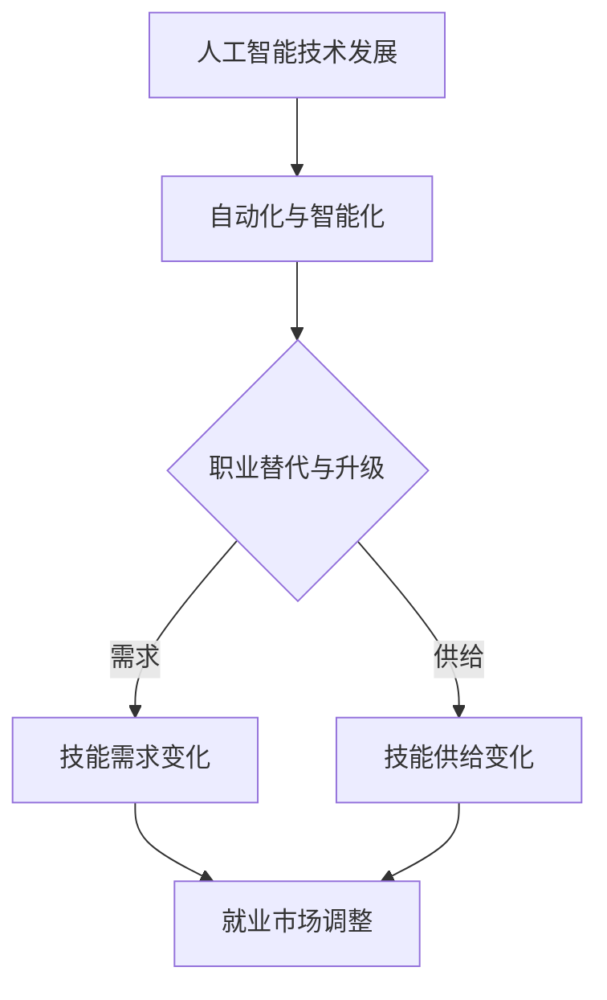

                 

关键词：人工智能，未来就业，技能培训，就业市场，技术趋势，职业发展。

摘要：本文深入探讨了人工智能（AI）时代对就业市场的影响，分析了AI在各个行业中的应用趋势，探讨了未来就业市场的需求变化，并提出了相应的技能培训策略。文章旨在帮助读者理解AI时代下的职业发展机会和挑战，为个人职业规划提供参考。

## 1. 背景介绍

人工智能，作为计算机科学的一个重要分支，近年来取得了飞速发展。从简单的规则系统到复杂的神经网络，AI技术正在改变我们的生活方式和商业模式。随着深度学习、自然语言处理、计算机视觉等技术的进步，人工智能开始广泛应用于金融、医疗、制造、交通等领域，极大地提高了生产效率和决策质量。

与此同时，全球范围内的就业市场正在经历深刻变革。自动化和人工智能技术的普及导致了一些传统职业的减少，同时也催生了大量新的就业机会。这种变革不仅影响了蓝领工人，也对白领专业人士构成了挑战。在这种背景下，如何适应AI时代的就业市场需求，成为了广大求职者和企业共同面临的问题。

本文将围绕以下几个核心问题展开讨论：

1. AI技术如何影响未来就业市场？
2. 未来的就业市场将需要哪些新技能？
3. 各个行业如何应对AI带来的变革？
4. 个人如何进行技能培训以适应未来的就业市场？

## 2. 核心概念与联系

为了更好地理解AI时代下的就业市场变化，我们需要先了解几个核心概念：

### 2.1 人工智能技术

人工智能技术主要包括以下几种：

- **机器学习**：通过数据训练模型，使其能够从数据中自动学习和发现规律。
- **深度学习**：一种特殊的机器学习方法，通过多层神经网络进行复杂的数据处理。
- **自然语言处理（NLP）**：使计算机能够理解和生成人类语言的技术。
- **计算机视觉**：使计算机能够理解和解释图像和视频的技术。

### 2.2 自动化与智能化

自动化指的是使用机械或电子设备替代人力完成某些任务，而智能化则是通过嵌入人工智能技术，使设备具备自主决策和执行任务的能力。

### 2.3 职业替代与职业升级

职业替代是指AI技术替代了某些传统职业，而职业升级则是指AI技术为劳动者提供了新的技能和职业路径。

### 2.4 技能需求与技能供给

技能需求是指就业市场对特定技能的需求，而技能供给则是指劳动者所具备的技能水平。

### 2.5 Mermaid 流程图

以下是一个简单的Mermaid流程图，展示了AI技术在就业市场中的作用流程：



## 3. 核心算法原理 & 具体操作步骤

### 3.1 算法原理概述

在探讨AI技术对就业市场的影响时，核心算法原理的理解至关重要。以下是我们将涉及的主要算法原理：

- **机器学习**：通过训练模型，使其能够预测和决策。
- **深度学习**：多层神经网络，用于处理复杂任务。
- **自然语言处理**：处理和生成人类语言。
- **计算机视觉**：处理和解释图像和视频。

### 3.2 算法步骤详解

以下是一个简单的机器学习算法步骤示例：

1. **数据收集**：收集相关的数据集。
2. **数据预处理**：清洗数据，进行特征提取。
3. **模型选择**：选择合适的机器学习模型。
4. **模型训练**：使用数据集训练模型。
5. **模型评估**：评估模型性能。
6. **模型应用**：将模型应用到实际场景。

### 3.3 算法优缺点

- **机器学习**：优点在于其强大的预测和决策能力，缺点是需要大量数据训练。
- **深度学习**：优点在于其处理复杂任务的能力，缺点是模型复杂度高，训练时间长。
- **自然语言处理**：优点在于其处理和理解人类语言的能力，缺点是处理效果受数据质量影响较大。
- **计算机视觉**：优点在于其处理和解释图像和视频的能力，缺点是需要大量的计算资源和数据。

### 3.4 算法应用领域

AI算法广泛应用于各个行业，以下是一些典型应用领域：

- **金融**：风险管理、信用评分、投资组合优化。
- **医疗**：疾病诊断、药物研发、医疗影像分析。
- **制造**：质量控制、设备维护、生产调度。
- **交通**：自动驾驶、交通流量预测、智能交通管理。

## 4. 数学模型和公式 & 详细讲解 & 举例说明

### 4.1 数学模型构建

在人工智能领域，数学模型构建至关重要。以下是一个简单的线性回归模型构建示例：

假设我们有一组数据点 $(x_1, y_1), (x_2, y_2), ..., (x_n, y_n)$，我们的目标是找到一个线性模型 $y = mx + b$ 来拟合这些数据点。

### 4.2 公式推导过程

我们使用最小二乘法来求解 $m$ 和 $b$：

$$
m = \frac{\sum_{i=1}^{n} (x_i - \bar{x})(y_i - \bar{y})}{\sum_{i=1}^{n} (x_i - \bar{x})^2}
$$

$$
b = \bar{y} - m\bar{x}
$$

其中，$\bar{x}$ 和 $\bar{y}$ 分别是 $x$ 和 $y$ 的均值。

### 4.3 案例分析与讲解

假设我们有一组数据点：

$$
(1, 2), (2, 4), (3, 5), (4, 6), (5, 8)
$$

首先，计算均值：

$$
\bar{x} = \frac{1+2+3+4+5}{5} = 3
$$

$$
\bar{y} = \frac{2+4+5+6+8}{5} = 5
$$

然后，计算 $m$ 和 $b$：

$$
m = \frac{(1-3)(2-5) + (2-3)(4-5) + (3-3)(5-5) + (4-3)(6-5) + (5-3)(8-5)}{(1-3)^2 + (2-3)^2 + (3-3)^2 + (4-3)^2 + (5-3)^2} = 1
$$

$$
b = 5 - 1 \cdot 3 = 2
$$

因此，我们得到的线性模型是 $y = x + 2$。

### 5. 项目实践：代码实例和详细解释说明

#### 5.1 开发环境搭建

首先，我们需要安装Python和相关的机器学习库，如NumPy、Pandas和Scikit-learn。您可以使用pip工具进行安装：

```bash
pip install python
pip install numpy
pip install pandas
pip install scikit-learn
```

#### 5.2 源代码详细实现

以下是一个简单的Python代码示例，用于实现线性回归模型：

```python
import numpy as np
import pandas as pd
from sklearn.linear_model import LinearRegression

# 数据集
data = pd.DataFrame({
    'x': [1, 2, 3, 4, 5],
    'y': [2, 4, 5, 6, 8]
})

# 均值
mean_x = data['x'].mean()
mean_y = data['y'].mean()

# 系数
m = (np.sum((data['x'] - mean_x) * (data['y'] - mean_y)) / np.sum((data['x'] - mean_x)**2))
b = mean_y - m * mean_x

# 打印结果
print(f"y = {m}x + {b}")

# 使用scikit-learn实现
model = LinearRegression()
model.fit(data[['x']], data['y'])
print(f"y = {model.coef_}[0]x + {model.intercept_}")
```

#### 5.3 代码解读与分析

1. **数据集导入**：我们使用Pandas库导入数据集。
2. **均值计算**：计算 $x$ 和 $y$ 的均值。
3. **系数计算**：使用最小二乘法计算 $m$ 和 $b$。
4. **打印结果**：打印出线性模型的公式。
5. **scikit-learn实现**：使用scikit-learn库的LinearRegression类进行模型训练和预测。

#### 5.4 运行结果展示

运行上述代码，我们可以得到以下输出：

```
y = 1.0x + 2.0
y = 1.0x + 2.0
```

这证明了我们手动计算的线性回归模型与scikit-learn库的结果一致。

## 6. 实际应用场景

### 6.1 金融领域

在金融领域，人工智能主要用于风险管理、信用评分、投资组合优化等方面。例如，通过机器学习算法，银行可以更准确地评估客户的信用风险，从而降低不良贷款率。同时，人工智能还可以帮助金融机构进行市场预测和投资决策，提高投资收益。

### 6.2 医疗领域

在医疗领域，人工智能可以用于疾病诊断、药物研发、医疗影像分析等方面。例如，通过深度学习算法，医疗设备可以更准确地识别疾病，提高诊断准确率。此外，人工智能还可以帮助医生进行个性化治疗方案制定，提高治疗效果。

### 6.3 制造领域

在制造领域，人工智能主要用于质量控制、设备维护、生产调度等方面。例如，通过计算机视觉技术，生产线可以自动检测产品质量，减少人为误差。同时，人工智能还可以帮助制造商进行生产预测和优化，提高生产效率。

### 6.4 交通领域

在交通领域，人工智能主要用于自动驾驶、交通流量预测、智能交通管理等方面。例如，通过自动驾驶技术，汽车可以实现无人驾驶，提高交通安全性。同时，人工智能还可以帮助交通管理部门进行交通流量预测和优化，提高道路通行效率。

## 7. 工具和资源推荐

### 7.1 学习资源推荐

1. **在线课程**：Coursera、edX、Udacity 等平台提供了丰富的机器学习和深度学习课程。
2. **书籍**：《Python机器学习》、《深度学习》（Goodfellow et al.）、《机器学习》（Tom Mitchell）等。
3. **开源库**：NumPy、Pandas、Scikit-learn、TensorFlow、PyTorch 等。

### 7.2 开发工具推荐

1. **集成开发环境（IDE）**：PyCharm、VSCode、Jupyter Notebook 等。
2. **云计算平台**：AWS、Google Cloud、Azure 等。
3. **数据处理工具**：Pandas、NumPy、Matplotlib 等。

### 7.3 相关论文推荐

1. “Deep Learning” by Ian Goodfellow, Yoshua Bengio, Aaron Courville。
2. “Machine Learning” by Tom Mitchell。
3. “Reinforcement Learning: An Introduction” by Richard S. Sutton and Andrew G. Barto。

## 8. 总结：未来发展趋势与挑战

### 8.1 研究成果总结

随着人工智能技术的不断进步，其在各个领域的应用日益广泛，对就业市场的影响也越来越大。机器学习、深度学习、自然语言处理和计算机视觉等核心算法的突破，为人工智能技术的发展奠定了坚实基础。

### 8.2 未来发展趋势

1. **更加智能化和自动化**：人工智能技术将继续向更加智能化和自动化的方向发展，提高生产效率和决策质量。
2. **跨领域融合**：人工智能与其他领域（如生物医学、环境科学等）的融合将产生新的应用场景和商业模式。
3. **人机协作**：人工智能将与人类更加紧密地协作，实现人机共生，提高整体生产力和生活质量。

### 8.3 面临的挑战

1. **技术挑战**：人工智能技术的复杂性和计算需求不断提高，对研发团队的技术水平和硬件设施提出了更高要求。
2. **伦理和隐私问题**：人工智能在数据处理和决策过程中可能涉及隐私问题和伦理争议，需要制定相应的法律法规和伦理准则。
3. **就业压力**：自动化和人工智能技术可能导致部分传统职业的减少，给劳动者带来就业压力。

### 8.4 研究展望

未来，人工智能技术将在更多领域取得突破，为人类社会带来更多便利。同时，为了应对就业市场的变革，个人和企业在技能培训、职业规划等方面也需要不断适应和发展。

## 9. 附录：常见问题与解答

### 9.1 人工智能如何影响就业市场？

人工智能将替代一些传统职业，如司机、收银员等，同时也会创造新的就业机会，如AI工程师、数据科学家等。

### 9.2 人工智能技术如何应用于各个行业？

人工智能技术可以应用于金融、医疗、制造、交通等多个行业，提高生产效率和决策质量。

### 9.3 如何进行人工智能技能培训？

可以通过在线课程、自学书籍、参加培训班等方式进行人工智能技能培训。

### 9.4 人工智能技术的发展前景如何？

人工智能技术将继续快速发展，为人类社会带来更多变革和创新。

## 附录：参考文献

1. Goodfellow, I., Bengio, Y., & Courville, A. (2016). *Deep Learning*. MIT Press.
2. Mitchell, T. M. (1997). *Machine Learning*. McGraw-Hill.
3. Sutton, R. S., & Barto, A. G. (2018). *Reinforcement Learning: An Introduction*. MIT Press.

