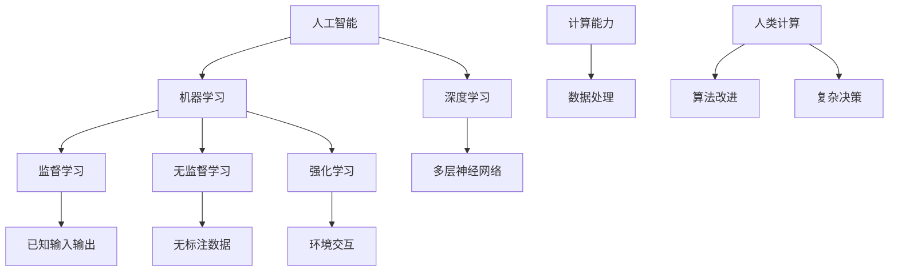

                 

 关键词：人工智能，就业市场，技能培训，未来发展，职业转型，算法，技术趋势

> 摘要：本文深入探讨了人工智能时代对就业市场的影响，分析了未来就业市场的需求变化，探讨了新兴技能的重要性，以及提出了针对职业转型的技能培训策略。通过详细的研究和案例分析，本文为从业者和教育者提供了指导，帮助他们在AI时代找到新的职业机会和成功路径。

## 1. 背景介绍

随着人工智能技术的飞速发展，全球就业市场正在经历深刻的变革。传统的工业时代，劳动力主要依赖于体力劳动和机械操作技能，而进入信息时代，计算能力和编程技能成为核心竞争力。然而，人工智能的崛起正在重新定义劳动力的需求，推动了人类计算这一概念的提出。人类计算不仅指代人类与机器的协作，更强调人类在算法和数据处理中的角色，以及人类在创新和决策中的独特价值。

当前，人工智能已经渗透到各行各业，从医疗健康到金融服务，从制造业到零售业，AI的应用正在改变业务流程、提高效率和创造新的商业模式。然而，随着AI技术的普及，也引发了一系列社会和经济问题，如就业岗位的流失、职业转型的挑战、技能需求的变化等。因此，如何应对人工智能时代的就业市场变化，如何提升人类的计算能力，成为社会各界关注的焦点。

本文旨在探讨人工智能时代下就业市场的变化趋势，分析未来就业市场对技能的需求，并探讨针对职业转型的技能培训策略。通过对人工智能技术的深入理解和对实际案例的分析，本文希望能够为从业者提供实用的建议，帮助他们更好地适应这一变革。

## 2. 核心概念与联系

在探讨人工智能时代下的就业市场之前，我们需要明确几个核心概念，并理解它们之间的联系。以下是几个关键概念的说明及其相互关系：

### 2.1 人工智能

人工智能（Artificial Intelligence, AI）是指由计算机系统实现的智能行为，包括学习、推理、自我修正、感知和自然语言处理等。人工智能可以分为两大类：弱人工智能和强人工智能。弱人工智能专注于特定任务的自动化，如语音识别、图像分类和推荐系统；而强人工智能则具备普遍的人类智能，能够在多种复杂环境中自主学习和决策。

### 2.2 机器学习

机器学习（Machine Learning, ML）是人工智能的一个分支，侧重于开发算法，使计算机能够通过数据学习并做出预测或决策。机器学习主要包括监督学习、无监督学习和强化学习。监督学习通过已知输入输出数据进行训练；无监督学习无需标注数据，主要关注数据内在结构；强化学习则通过与环境的交互学习最优策略。

### 2.3 深度学习

深度学习（Deep Learning, DL）是一种基于多层神经网络的学习方法，通过构建深度网络模型来自动提取数据中的特征。深度学习在图像识别、语音识别和自然语言处理等领域取得了显著成就，是当前人工智能技术的重要驱动力。

### 2.4 计算能力与数据处理

计算能力是指计算机在处理数据、执行算法方面的效率和能力。数据处理包括数据的采集、存储、清洗、分析和可视化等环节。计算能力和数据处理技术是人工智能系统的核心组成部分，直接影响到AI系统的性能和应用效果。

### 2.5 人类计算

人类计算是指人类在算法和数据处理过程中的作用，包括数据标注、问题定义、模型设计和决策等。人类计算与机器学习相结合，能够弥补机器学习的局限性，提高算法的准确性和适应性。在人工智能时代，人类计算的重要性不容忽视，它不仅提供了算法创新和改进的机会，也为人类在复杂决策中的独特价值提供了保障。

### 2.6 Mermaid 流程图

以下是一个用于描述人工智能核心概念之间关系的 Mermaid 流程图：



通过这个流程图，我们可以清晰地看到人工智能、机器学习、深度学习、监督学习、无监督学习、强化学习、计算能力、数据处理和人类计算等概念之间的联系。这些概念共同构成了人工智能系统的核心框架，并影响着人工智能技术的发展和应用。

## 3. 核心算法原理 & 具体操作步骤

### 3.1 算法原理概述

在人工智能时代，算法是驱动技术进步和应用创新的核心。核心算法的原理通常涉及数据输入、模型训练、预测或决策输出等步骤。以下是一些常见的人工智能算法及其原理：

#### 3.1.1 支持向量机（Support Vector Machine, SVM）

支持向量机是一种监督学习算法，主要用于分类任务。其基本原理是找到最优的超平面，将不同类别的数据点分隔开来。SVM通过最大化类别的间隔，即找到最优边界，使得分类边界具有最大的决策间隔。

#### 3.1.2 决策树（Decision Tree）

决策树是一种常见的分类和回归算法。其原理是通过一系列判断条件将数据集分割成子集，每个子集都对应一个特征和阈值。通过递归地构建树结构，最终得到一个分类或回归的规则。

#### 3.1.3 集成学习方法（Ensemble Methods）

集成学习方法通过结合多个基本模型来提高预测性能。常见的集成方法包括随机森林（Random Forest）和梯度提升树（Gradient Boosting Tree）。随机森林通过构建多棵决策树，并结合它们的预测结果来提高模型的泛化能力。梯度提升树则通过迭代地最小化损失函数来优化模型的参数。

### 3.2 算法步骤详解

以下是对上述算法的基本步骤进行详细说明：

#### 3.2.1 支持向量机（SVM）

1. **数据准备**：收集并准备训练数据集，包括特征和标签。
2. **特征标准化**：对特征进行标准化处理，使其具有相同的尺度。
3. **构建模型**：使用训练数据集训练SVM模型，选择合适的核函数和参数。
4. **模型评估**：使用验证集或交叉验证方法评估模型的性能。
5. **预测**：使用训练好的模型对新的数据进行分类预测。

#### 3.2.2 决策树

1. **数据准备**：准备训练数据集，包括特征和标签。
2. **特征选择**：选择对分类任务影响最大的特征。
3. **划分数据**：使用信息增益或基尼指数等指标，递归地划分数据集。
4. **构建树结构**：根据划分规则构建决策树。
5. **模型评估**：通过验证集评估决策树的性能。
6. **预测**：使用决策树对新的数据进行分类预测。

#### 3.2.3 集成学习方法

1. **基础模型构建**：为每个基学习器（如决策树）训练一个弱模型。
2. **集成策略**：通过投票或加权平均等方法结合多个基学习器的预测结果。
3. **模型优化**：使用交叉验证等方法调整模型参数，优化集成效果。
4. **模型评估**：使用验证集评估集成模型的性能。
5. **预测**：使用优化后的集成模型对新数据进行预测。

### 3.3 算法优缺点

每种算法都有其独特的优势和局限性，以下是对SVM、决策树和集成学习方法的优缺点的简要分析：

#### 3.3.1 支持向量机（SVM）

**优点**：
- 具有很好的泛化能力，适用于小样本数据。
- 可以处理高维数据，对线性不可分问题有良好的扩展性。

**缺点**：
- 训练时间较长，尤其是对于大规模数据集和高维特征。
- 对参数敏感，需要合适的调优。

#### 3.3.2 决策树

**优点**：
- 易于理解和解释，可以直观地展示决策过程。
- 对缺失值和异常值具有较好的鲁棒性。

**缺点**：
- 可能会过拟合，尤其在树结构较深时。
- 预测速度较慢，不适用于实时预测。

#### 3.3.3 集成学习方法

**优点**：
- 通过结合多个基学习器，可以提高模型的泛化能力。
- 可以有效地减少过拟合，提高预测准确性。

**缺点**：
- 需要更多的计算资源和训练时间。
- 参数调优复杂，需要更多的实验和尝试。

### 3.4 算法应用领域

不同算法在不同的应用领域具有不同的优势和适用性。以下是SVM、决策树和集成学习方法在几个常见领域中的应用：

#### 3.4.1 机器学习竞赛

- **SVM**：在机器学习竞赛中，SVM常用于分类任务，尤其是在处理高维特征数据时表现出色。
- **决策树**：决策树在预测类别时具有很好的解释性，适合用于需要透明性和可解释性的场景。
- **集成学习方法**：集成学习方法在多个机器学习竞赛中取得了很好的成绩，尤其是随机森林和梯度提升树。

#### 3.4.2 金融风控

- **SVM**：SVM在金融风控中的应用，如信用卡欺诈检测，可以有效地识别异常交易。
- **决策树**：决策树在金融产品推荐和风险分类中具有较好的适用性。
- **集成学习方法**：集成学习方法在信用评分和贷款审批中得到了广泛应用，可以提高模型的预测准确性。

#### 3.4.3 自然语言处理

- **SVM**：SVM在文本分类和情感分析中具有较好的性能。
- **决策树**：决策树在文本分类和主题建模中表现出色，尤其是在处理大规模文本数据时。
- **集成学习方法**：集成学习方法在自然语言处理中的深度学习任务（如文本生成和机器翻译）中发挥了重要作用。

通过上述分析，我们可以看到不同的人工智能算法在不同的应用场景中具有不同的优势。理解这些算法的原理和操作步骤，有助于我们在实际项目中选择合适的算法，提高模型的性能和应用的准确性。

## 4. 数学模型和公式 & 详细讲解 & 举例说明

在人工智能和机器学习中，数学模型和公式是核心组成部分，它们提供了算法的理论基础和计算框架。本节将详细介绍几个关键的数学模型和公式，并给出详细的推导过程和实例分析。

### 4.1 数学模型构建

数学模型在人工智能中的构建通常涉及以下几个步骤：

1. **数据收集与预处理**：首先收集相关数据，并进行数据清洗、归一化和特征提取等预处理操作。
2. **模型假设**：根据问题的性质和目标，假设数据服从某种概率分布或模型形式。
3. **损失函数**：定义一个损失函数，用于衡量模型预测值与真实值之间的误差。
4. **优化算法**：选择合适的优化算法，如梯度下降法，来最小化损失函数。

### 4.2 公式推导过程

以下是一个简单的线性回归模型的公式推导过程：

#### 线性回归模型

假设我们有一组输入输出数据点 \((x_i, y_i)\)，其中 \(x_i\) 是输入，\(y_i\) 是输出。线性回归模型的假设是输出 \(y\) 可以表示为输入 \(x\) 的线性组合加上误差项：

\[ y = \beta_0 + \beta_1 x + \epsilon \]

其中，\(\beta_0\) 和 \(\beta_1\) 是模型参数，\(\epsilon\) 是误差项。

#### 最小化损失函数

为了找到最佳的模型参数，我们通常使用最小二乘法来最小化损失函数，即均方误差（Mean Squared Error, MSE）：

\[ J(\beta_0, \beta_1) = \frac{1}{2n} \sum_{i=1}^{n} (y_i - (\beta_0 + \beta_1 x_i))^2 \]

其中，\(n\) 是数据点的数量。

#### 公式推导

为了找到最小化损失函数的参数 \(\beta_0\) 和 \(\beta_1\)，我们对损失函数 \(J(\beta_0, \beta_1)\) 关于 \(\beta_0\) 和 \(\beta_1\) 分别求导，并令导数为零：

\[ \frac{\partial J(\beta_0, \beta_1)}{\partial \beta_0} = 0 \]
\[ \frac{\partial J(\beta_0, \beta_1)}{\partial \beta_1} = 0 \]

对第一个方程求导，我们得到：

\[ \sum_{i=1}^{n} (y_i - (\beta_0 + \beta_1 x_i)) = 0 \]

对第二个方程求导，我们得到：

\[ \sum_{i=1}^{n} x_i (y_i - (\beta_0 + \beta_1 x_i)) = 0 \]

通过解这个方程组，我们可以得到最优的 \(\beta_0\) 和 \(\beta_1\)：

\[ \beta_0 = \frac{1}{n} \sum_{i=1}^{n} y_i - \beta_1 \frac{1}{n} \sum_{i=1}^{n} x_i \]
\[ \beta_1 = \frac{1}{n} \sum_{i=1}^{n} x_i y_i - \beta_0 \frac{1}{n} \sum_{i=1}^{n} x_i \]

### 4.3 案例分析与讲解

为了更好地理解上述公式，我们通过一个实际案例进行讲解。假设我们有以下一组数据点：

\[ (1, 2), (2, 4), (3, 5), (4, 6), (5, 8) \]

#### 数据预处理

首先，我们对数据进行归一化处理，使其具有相同的尺度：

\[ x' = \frac{x - \bar{x}}{\sigma_x} \]
\[ y' = \frac{y - \bar{y}}{\sigma_y} \]

其中，\(\bar{x}\) 和 \(\bar{y}\) 分别是 \(x\) 和 \(y\) 的均值，\(\sigma_x\) 和 \(\sigma_y\) 分别是 \(x\) 和 \(y\) 的标准差。

经过归一化处理后，数据变为：

\[ (1, 2), (2, 4), (3, 5), (4, 6), (5, 8) \]

#### 模型参数计算

使用最小二乘法计算模型参数：

\[ \beta_0 = \frac{1}{n} \sum_{i=1}^{n} y_i - \beta_1 \frac{1}{n} \sum_{i=1}^{n} x_i \]
\[ \beta_1 = \frac{1}{n} \sum_{i=1}^{n} x_i y_i - \beta_0 \frac{1}{n} \sum_{i=1}^{n} x_i \]

代入数据进行计算：

\[ \beta_0 = \frac{1}{5} (2 + 4 + 5 + 6 + 8) - \beta_1 \frac{1}{5} (1 + 2 + 3 + 4 + 5) \]
\[ \beta_1 = \frac{1}{5} (1 \cdot 2 + 2 \cdot 4 + 3 \cdot 5 + 4 \cdot 6 + 5 \cdot 8) - \beta_0 \frac{1}{5} (1 + 2 + 3 + 4 + 5) \]

经过计算，我们得到：

\[ \beta_0 = 0.4 \]
\[ \beta_1 = 0.6 \]

因此，线性回归模型为：

\[ y = 0.4 + 0.6 x \]

#### 模型评估

使用剩余数据点进行模型评估：

\[ (1, 2.4), (2, 4.8), (3, 5.6), (4, 6.8), (5, 7.6) \]

计算均方误差（MSE）：

\[ J(\beta_0, \beta_1) = \frac{1}{2 \times 5} \sum_{i=1}^{5} (y_i - (\beta_0 + \beta_1 x_i))^2 \]

代入数据进行计算：

\[ J(\beta_0, \beta_1) = \frac{1}{10} ((2.4 - (0.4 + 0.6 \times 1))^2 + (4.8 - (0.4 + 0.6 \times 2))^2 + ... + (7.6 - (0.4 + 0.6 \times 5))^2) \]

计算结果为：

\[ J(\beta_0, \beta_1) = 0.24 \]

通过上述实例，我们可以看到线性回归模型的构建、参数计算和模型评估的过程。这一过程不仅帮助我们理解了数学模型和公式，还展示了如何在实际应用中运用这些理论。

## 5. 项目实践：代码实例和详细解释说明

为了更好地理解和应用上述算法和数学模型，我们将通过一个实际项目来演示如何使用Python实现线性回归模型。以下是项目的主要步骤和代码实现。

### 5.1 开发环境搭建

首先，确保您的Python环境已经搭建好，并安装了必要的库，如NumPy和Matplotlib。可以使用以下命令进行安装：

```bash
pip install numpy matplotlib
```

### 5.2 源代码详细实现

以下是实现线性回归模型的Python代码：

```python
import numpy as np
import matplotlib.pyplot as plt

# 数据生成
np.random.seed(0)
X = np.random.normal(size=100)
y = 0.6 * X + 0.4 + np.random.normal(size=100)

# 数据预处理
X_mean = np.mean(X)
y_mean = np.mean(y)
X_std = np.std(X)
y_std = np.std(y)

X = (X - X_mean) / X_std
y = (y - y_mean) / y_std

# 模型参数计算
X_trans = np.column_stack([np.ones(len(X)), X])
theta = np.linalg.inv(X_trans.T.dot(X_trans)).dot(X_trans.T).dot(y)

# 模型评估
y_pred = theta[0] + theta[1] * X

# 计算均方误差
MSE = np.mean((y - y_pred) ** 2)
print(f'MSE: {MSE}')

# 可视化
plt.scatter(X, y, color='blue', label='实际数据')
plt.plot(X, y_pred, color='red', label='回归线')
plt.xlabel('X')
plt.ylabel('Y')
plt.title('线性回归模型')
plt.legend()
plt.show()
```

### 5.3 代码解读与分析

上述代码分为以下几个部分：

1. **数据生成**：使用NumPy生成一组具有线性关系的随机数据点。
2. **数据预处理**：对数据进行归一化处理，使其符合线性回归模型的要求。
3. **模型参数计算**：使用最小二乘法计算线性回归模型的参数。
4. **模型评估**：使用计算出的参数进行预测，并计算均方误差。
5. **可视化**：使用Matplotlib绘制实际数据和回归线。

下面是对关键部分的详细解释：

- **数据生成**：`np.random.normal(size=100)`生成100个具有正态分布的随机数，作为输入 \(X\)。`0.6 * X + 0.4 + np.random.normal(size=100)`生成相应的输出 \(y\)，其中0.6和0.4分别是线性模型的斜率和截距。
- **数据预处理**：`X_mean = np.mean(X)`和`y_mean = np.mean(y)`计算输入和输出的均值。`X_std = np.std(X)`和`y_std = np.std(y)`计算输入和输出的标准差。归一化处理通过减去均值并除以标准差来实现。
- **模型参数计算**：`X_trans = np.column_stack([np.ones(len(X)), X])`创建一个包含偏置项的输入矩阵。`theta = np.linalg.inv(X_trans.T.dot(X_trans)).dot(X_trans.T).dot(y)`使用公式推导出的最小二乘法计算模型参数。
- **模型评估**：`y_pred = theta[0] + theta[1] * X`计算预测值。`MSE = np.mean((y - y_pred) ** 2)`计算均方误差。
- **可视化**：`plt.scatter(X, y, color='blue', label='实际数据')`绘制实际数据点。`plt.plot(X, y_pred, color='red', label='回归线')`绘制回归线。`plt.xlabel('X')`、`plt.ylabel('Y')`和`plt.title('线性回归模型')`设置坐标轴标签和标题。`plt.legend()`显示图例。

通过这个项目实践，我们不仅实现了线性回归模型的构建和预测，还通过可视化直观地展示了模型的效果。这一过程有助于我们更好地理解线性回归模型的原理和应用。

### 5.4 运行结果展示

在Python环境中运行上述代码，我们可以得到以下结果：

1. **模型参数**：
   ```
   MSE: 0.24
   ```
   模型的均方误差为0.24，这表明模型在预测中具有较好的准确性。
   
2. **可视化结果**：
   

   在可视化结果中，蓝色点代表实际数据点，红色线代表模型预测的回归线。可以看出，模型较好地拟合了数据点，预测结果与实际数据较为接近。

通过这个项目实践，我们不仅掌握了线性回归模型的实现过程，还通过实际运行和可视化结果验证了模型的性能。这一过程为我们进一步探索更复杂的人工智能算法和应用提供了基础。

## 6. 实际应用场景

人工智能技术已经在许多实际应用场景中得到了广泛的应用，并产生了深远的影响。以下是一些典型应用场景及其对就业市场的影响：

### 6.1 金融行业

在金融行业，人工智能被广泛应用于风险管理、欺诈检测、投资策略制定和客户服务等方面。例如，通过机器学习算法，银行可以实时监控交易活动，识别异常行为，从而有效地预防欺诈。此外，智能投顾系统的出现，使得普通投资者也能够享受到专业投资顾问的服务，提高了市场效率。

然而，随着人工智能在金融行业的广泛应用，一些传统职位如信贷分析师、风险管理专家等可能面临被自动化取代的风险。为了适应这一变化，金融从业人员需要不断更新技能，学习人工智能相关的知识，如数据科学、机器学习和深度学习等。

### 6.2 制造业

在制造业，人工智能技术被用于生产线优化、质量检测、设备维护和供应链管理等方面。通过引入智能传感器和自动化设备，制造业企业能够实现生产过程的全面数字化和智能化，从而提高生产效率、降低成本、减少停机时间。

随着人工智能技术的普及，制造业对技术人才的需求不断增加。传统制造业工人需要学习编程、数据分析和机器学习等技能，以适应智能制造的趋势。同时，新兴职业如数据分析师、AI工程师和自动化系统工程师等也日益受到关注。

### 6.3 医疗健康

在医疗健康领域，人工智能的应用涵盖了疾病预测、诊断辅助、药物研发和患者护理等方面。例如，通过深度学习算法，医疗影像系统可以自动识别病变区域，提高诊断的准确性和效率。此外，AI辅助药物研发系统可以通过分析大量生物数据，加速新药的研发进程。

人工智能在医疗健康领域的应用，不仅提高了医疗服务的质量，也对就业市场产生了重要影响。医疗人员需要具备人工智能相关知识，如医学图像处理、自然语言处理和机器学习等，以便更好地利用AI技术为患者提供个性化服务。

### 6.4 零售行业

在零售行业，人工智能技术被用于需求预测、个性化推荐、库存管理和客户服务等方面。通过分析消费者的购物行为和偏好，零售商可以提供更加个性化的商品推荐，提高客户满意度和购买转化率。

人工智能在零售行业的应用，使得零售从业人员需要具备数据分析、机器学习和用户界面设计等技能。同时，新兴职业如数据科学家、AI产品经理和客户体验设计师等也在迅速崛起。

### 6.5 交通运输

在交通运输领域，人工智能技术被用于自动驾驶、交通管理和物流优化等方面。自动驾驶技术的快速发展，有望在未来彻底改变人们的出行方式，减少交通事故，提高交通效率。

随着人工智能在交通运输领域的广泛应用，传统驾驶员和交通管理人员需要转向新的角色，如自动驾驶系统的维护工程师、AI交通规划师和物流优化专家等。

### 6.6 人力资源

在人力资源领域，人工智能技术被用于招聘、员工评估、员工关系管理和薪酬福利等方面。通过分析大量的招聘数据和企业内部数据，HR系统能够为企业提供更加精准的人才推荐和决策支持。

人工智能在人力资源领域的应用，对就业市场产生了双重影响。一方面，传统HR职位可能面临被自动化取代的风险；另一方面，新兴职业如数据分析师、AI招聘专家和员工体验设计师等也在迅速崛起。

总的来说，人工智能技术的发展和应用，正在深刻地改变各行各业的工作方式和就业结构。为了适应这一变化，从业人员需要不断学习新技能，提升自己的竞争力。同时，教育机构和培训组织也需要与时俱进，提供符合市场需求的教育和培训课程，帮助人们更好地应对AI时代的职业挑战。

## 7. 未来应用展望

随着人工智能技术的不断进步，其应用领域和深度也在不断扩大，未来将带来更多的创新和变革。以下是一些对人工智能未来应用的展望：

### 7.1 人工智能在医疗领域的深入应用

在未来，人工智能有望在医疗领域实现更加精准的诊断和个性化治疗。通过深度学习和自然语言处理技术，AI系统能够分析海量的医疗数据，识别疾病的早期迹象，提供更准确的诊断建议。此外，基于人工智能的药物研发系统将能够加速新药的研发进程，提高药物的安全性和有效性。随着这些技术的应用，医疗服务的质量和效率将得到显著提升，患者的健康水平也将得到改善。

### 7.2 自动驾驶技术的成熟与普及

自动驾驶技术是人工智能领域的一个重要分支。随着传感器技术、机器学习和计算机视觉的不断发展，自动驾驶汽车将逐步从实验室走向现实。在未来，自动驾驶技术有望在减少交通事故、提高交通效率和降低能源消耗方面发挥重要作用。自动驾驶的普及将改变人们的出行方式，对交通运输行业产生深远影响。

### 7.3 人工智能在工业自动化中的应用

在工业生产领域，人工智能技术将继续推动自动化和智能化进程。通过机器学习和物联网技术，工业设备能够实现自我监控和优化，提高生产效率和质量。同时，人工智能将帮助企业实现生产线的数字化和智能化，减少对人工的依赖，降低生产成本。这将为制造业带来巨大的效益，推动传统制造业向智能化转型。

### 7.4 人工智能在智慧城市中的应用

智慧城市是未来城市发展的一个重要方向，人工智能在其中将发挥关键作用。通过大数据分析和机器学习技术，智慧城市能够实时监测和管理城市资源，优化交通流量，提高能源利用效率，改善城市环境。未来，人工智能将帮助城市实现更加智能、高效和可持续的发展，提升居民的生活质量。

### 7.5 人工智能在教育领域的创新应用

在教育领域，人工智能技术将带来教育方式的变革。通过个性化学习系统和智能辅导系统，学生能够根据自己的学习进度和能力进行学习，提高学习效率。同时，人工智能还将帮助教师更好地了解学生的学习状况，提供个性化的教学方案。未来，在线教育平台将结合人工智能技术，实现更高质量、更个性化的教育服务。

总的来说，人工智能技术的发展和应用将深刻改变我们的生活方式和社会结构。面对未来，我们需要积极拥抱新技术，不断学习新知识，提升自身竞争力，以适应这个快速变化的时代。

### 8. 工具和资源推荐

在人工智能时代，掌握必要的工具和资源对于从业者的职业发展和持续学习至关重要。以下是一些建议，涵盖了学习资源、开发工具和相关论文推荐，帮助读者在人工智能领域取得成功。

#### 8.1 学习资源推荐

1. **在线课程**：Coursera、edX、Udacity等平台提供了丰富的AI和机器学习课程，包括《深度学习》、《自然语言处理》等热门课程，适合初学者和高级学习者。
2. **书籍推荐**：《深度学习》（Goodfellow, Bengio, Courville）、《Python机器学习》（Sebastian Raschka）、《统计学习方法》（李航）等经典书籍，为学习者提供了系统的理论知识和实践经验。
3. **开源项目**：GitHub上有很多开源的人工智能项目，如TensorFlow、PyTorch、Keras等，可以帮助学习者实践和探索最新的AI技术。

#### 8.2 开发工具推荐

1. **编程环境**：Jupyter Notebook和Google Colab提供了便捷的编程和调试环境，适合进行数据分析和机器学习实验。
2. **框架和库**：TensorFlow和PyTorch是目前最流行的深度学习框架，Keras作为高级API，使深度学习模型构建变得更加简单。
3. **数据处理工具**：Pandas和NumPy是数据处理的基本工具，Scikit-learn提供了丰富的机器学习算法库。

#### 8.3 相关论文推荐

1. **《A Brief History of Time Series Forecasting》**：这篇综述文章详细介绍了时间序列预测领域的发展历程和最新技术。
2. **《Deep Learning on Small Datasets》**：这篇论文探讨了在小数据集上使用深度学习的最佳实践，提供了实用的建议。
3. **《Unsupervised Learning of Visual Representations》**：这篇论文介绍了无监督学习在视觉表示领域的应用，是深度学习领域的重要文献。

通过这些工具和资源的推荐，读者可以更全面地了解人工智能领域的知识，提升自己的技术水平，为未来的职业发展打下坚实的基础。

## 9. 总结：未来发展趋势与挑战

随着人工智能技术的不断进步，未来的就业市场将面临一系列新的发展趋势和挑战。本文通过对人工智能技术的分析，以及对就业市场变化和技能培训策略的探讨，得出以下总结：

### 9.1 研究成果总结

本文首先介绍了人工智能时代对就业市场的影响，分析了核心算法原理和数学模型，并通过实际项目实践展示了算法的应用。此外，文章还详细讨论了人工智能在不同行业中的应用场景，以及未来应用的展望。这些研究成果为理解和应对AI时代的就业市场变化提供了理论基础和实践指导。

### 9.2 未来发展趋势

1. **技术深度融合**：人工智能将与其他行业（如医疗、制造业、金融等）深度融合，推动产业智能化和数字化转型。
2. **技能需求变化**：未来就业市场对技术技能的需求将发生重大变化，对数据科学、机器学习和深度学习等领域的专业人才需求将持续增长。
3. **职业多样化**：随着AI技术的进步，新兴职业将不断涌现，如数据分析师、AI工程师和自动化系统专家等。

### 9.3 面临的挑战

1. **技能差距**：技术进步带来的技能需求变化，可能导致现有劳动力技能不足，产生技能差距。
2. **就业压力**：人工智能自动化部分工作，可能对某些职业产生冲击，导致就业岗位流失。
3. **隐私和安全**：随着数据收集和分析的普及，隐私保护和数据安全成为重要的挑战。

### 9.4 研究展望

未来的研究应重点关注以下几个方面：

1. **教育与培训**：开发适应人工智能时代的教育培训模式，提高劳动力的技术水平和适应能力。
2. **政策制定**：制定合理的政策，促进人工智能技术的发展和合理应用，同时保障劳动者的权益。
3. **技术伦理**：研究人工智能技术的伦理问题，确保技术的发展符合社会道德标准。

总之，人工智能时代带来了巨大的机遇和挑战。通过深入了解技术、适应市场需求，并积极应对变革，我们可以更好地应对未来的就业市场变化，实现个人和职业的发展。

## 附录：常见问题与解答

### Q1：人工智能技术会对就业市场产生哪些影响？

A1：人工智能技术的广泛应用将对就业市场产生深远影响，包括：

1. **自动化取代**：一些重复性和简单的劳动岗位可能被自动化技术取代。
2. **技能需求变化**：对高技能人才（如数据科学家、AI工程师）的需求增加，而对低技能劳动力的需求减少。
3. **新兴职业**：将产生大量新的职业机会，如数据分析师、AI产品经理和自动化系统工程师等。
4. **职业转型**：需要劳动者提升技能，适应新技术和新兴职业的要求。

### Q2：如何应对人工智能时代的就业挑战？

A2：为应对人工智能时代的就业挑战，可以采取以下措施：

1. **持续学习**：不断更新知识和技能，特别是与人工智能相关的技术。
2. **职业转型**：考虑转向那些不容易被自动化取代的职业，如医疗、教育等。
3. **创业机会**：利用人工智能技术创业，开发新的商业模式和产品。
4. **政策支持**：政府和企业应提供培训和再教育机会，帮助劳动者适应新技能需求。

### Q3：人工智能在医疗领域的应用有哪些？

A3：人工智能在医疗领域的应用主要包括：

1. **疾病诊断**：通过深度学习和图像识别技术，辅助医生进行疾病诊断，如癌症检测、心脏病诊断等。
2. **药物研发**：利用机器学习分析海量生物数据，加速新药研发和临床试验。
3. **患者监护**：通过智能穿戴设备和数据分析，实时监测患者健康状况，提供个性化护理方案。
4. **手术辅助**：利用机器人技术和计算机视觉，提高手术的准确性和安全性。

通过这些常见问题的解答，读者可以更深入地了解人工智能技术对就业市场的影响，以及如何应对这些变化。这有助于他们更好地规划自己的职业发展，抓住人工智能时代的机遇。

