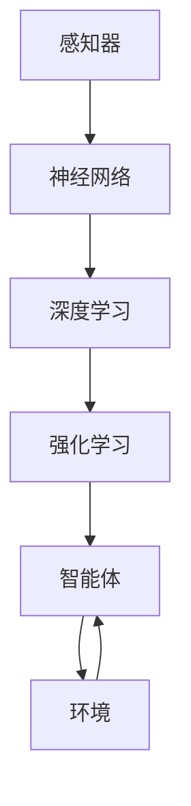

                 

 

## 1. 背景介绍

人工智能（AI）作为当代科技领域的明星，正以前所未有的速度改变着我们的生活方式和工作模式。AI技术的迅速发展，不仅推动了新产业的崛起，也带来了就业市场的深刻变革。根据麦肯锡全球研究所的预测，到2030年，人工智能可能为全球经济贡献高达13万亿美元，同时也会导致数百万个工作岗位的消失和变革。在这样的背景下，探讨AI时代的人类计算，即人类与AI系统的协作关系，以及未来就业市场与技能培训的发展趋势，显得尤为重要。

本文旨在通过对AI时代就业市场与技能培训的全面分析，揭示其发展趋势和面临的挑战，从而为个人和企业的未来发展提供有价值的参考。文章将分为以下几个部分：

- **背景介绍**：概述AI时代背景以及其对就业市场的影响。
- **核心概念与联系**：介绍AI系统的工作原理和关键概念。
- **核心算法原理 & 具体操作步骤**：深入分析AI算法的原理和实现步骤。
- **数学模型和公式 & 详细讲解 & 举例说明**：探讨AI模型背后的数学原理和公式。
- **项目实践：代码实例和详细解释说明**：通过实际代码示例讲解AI应用。
- **实际应用场景**：分析AI在不同领域的应用现状和未来展望。
- **工具和资源推荐**：推荐学习资源和开发工具。
- **总结：未来发展趋势与挑战**：总结AI发展的趋势和挑战。
- **附录：常见问题与解答**：解答读者可能遇到的常见问题。

<|assistant|> 

## 2. 核心概念与联系

### 2.1 人工智能的定义

人工智能（Artificial Intelligence，简称AI）是指由计算机实现的智能行为，模仿人类的认知和决策过程。AI的目标是使计算机能够执行通常需要人类智能才能完成的任务，如视觉识别、自然语言处理、决策制定和问题解决等。

### 2.2 AI系统的工作原理

AI系统通常包括以下几个关键组件：

- **感知器（Perceptrons）**：感知器是AI系统的基本构建块，用于接收输入并产生输出。它们可以通过学习来调整内部参数，以更好地匹配输入和预期输出。

- **神经网络（Neural Networks）**：神经网络是模仿人脑结构和功能的计算模型，由大量的神经元和连接组成。通过训练，神经网络可以学会从数据中提取特征并进行分类、回归等任务。

- **深度学习（Deep Learning）**：深度学习是神经网络的一个子领域，特别适用于处理大规模数据集和复杂的任务。深度学习模型包括多层感知器，每一层都可以提取更高层次的特征。

- **强化学习（Reinforcement Learning）**：强化学习是一种通过奖励机制来训练智能体在环境中做出决策的方法。智能体通过不断尝试和错误来学习最优策略。

### 2.3 关键概念之间的联系

AI系统的工作原理涉及多个核心概念的相互联系。例如，神经网络和深度学习依赖于大量的数据来进行训练，而强化学习则依赖于环境和反馈来优化智能体的行为。

下面是AI系统的核心概念之间的 Mermaid 流程图：



### 2.4 核心概念的实际应用

- **视觉识别**：通过神经网络和深度学习，AI系统可以识别人脸、物体和场景。
- **自然语言处理**：通过深度学习和强化学习，AI系统可以理解和生成自然语言。
- **决策制定**：通过强化学习，AI系统可以在复杂的环境中做出最优决策。

<|assistant|> 

## 3. 核心算法原理 & 具体操作步骤

### 3.1 算法原理概述

人工智能的核心算法包括神经网络、深度学习和强化学习等。以下是这些算法的基本原理：

#### 神经网络（Neural Networks）

神经网络是一种模拟人脑结构和功能的计算模型。它由大量的神经元和连接组成，每个神经元都可以接收输入、进行处理并产生输出。神经网络的训练过程就是通过不断调整神经元之间的连接权重，使得网络能够更好地匹配输入和预期输出。

#### 深度学习（Deep Learning）

深度学习是神经网络的一个子领域，特别适用于处理大规模数据集和复杂的任务。深度学习模型包括多层感知器，每一层都可以提取更高层次的特征。深度学习的训练过程同样涉及调整网络中的权重和偏置，以便网络能够自动提取有用的特征。

#### 强化学习（Reinforcement Learning）

强化学习是一种通过奖励机制来训练智能体在环境中做出决策的方法。智能体通过不断尝试和错误来学习最优策略。强化学习的关键在于奖励函数的设计，它决定了智能体行为的优化方向。

### 3.2 算法步骤详解

#### 神经网络

1. **初始化权重和偏置**：随机初始化网络中的权重和偏置。
2. **前向传播**：根据输入数据和当前权重，计算输出。
3. **反向传播**：根据输出误差，更新权重和偏置。
4. **重复步骤2和3**：直到网络收敛。

#### 深度学习

1. **数据预处理**：对输入数据进行分析和处理，确保数据格式和范围适合深度学习模型。
2. **构建模型**：定义网络结构，包括层数、每层的神经元数量和激活函数。
3. **训练模型**：使用训练数据对模型进行训练，不断调整权重和偏置。
4. **评估模型**：使用验证数据评估模型的性能，调整模型参数。

#### 强化学习

1. **环境初始化**：设置环境状态。
2. **智能体行动**：智能体根据当前状态和策略选择行动。
3. **奖励反馈**：根据行动的结果，给予智能体奖励或惩罚。
4. **更新策略**：智能体根据奖励反馈调整策略。
5. **重复步骤2-4**：直到达到目标或策略收敛。

### 3.3 算法优缺点

#### 神经网络

- **优点**：可以处理复杂的非线性问题，具有良好的泛化能力。
- **缺点**：训练过程较慢，对数据量要求较高，且易过拟合。

#### 深度学习

- **优点**：可以处理大规模数据集，自动提取特征，减少人工干预。
- **缺点**：模型复杂度高，训练过程需要大量计算资源，且解释性较差。

#### 强化学习

- **优点**：适用于动态环境，可以处理复杂决策问题。
- **缺点**：训练过程需要大量时间和计算资源，且策略调整过程较慢。

### 3.4 算法应用领域

#### 神经网络

- **计算机视觉**：图像分类、目标检测、图像生成等。
- **自然语言处理**：语言模型、机器翻译、情感分析等。

#### 深度学习

- **语音识别**：语音转文字、语音合成等。
- **推荐系统**：个性化推荐、广告投放等。
- **医疗诊断**：疾病预测、影像分析等。

#### 强化学习

- **自动驾驶**：路径规划、行为决策等。
- **游戏开发**：智能游戏AI、人机对战等。

<|assistant|> 

## 4. 数学模型和公式 & 详细讲解 & 举例说明

### 4.1 数学模型构建

在人工智能领域，数学模型是理解和实现AI算法的核心。以下是几种常见的数学模型及其构建过程：

#### 线性回归模型

线性回归模型是一种用于预测数值输出的模型，其数学表达式为：

\[ y = \beta_0 + \beta_1 \cdot x \]

其中，\( y \) 是输出，\( x \) 是输入，\( \beta_0 \) 和 \( \beta_1 \) 是模型的参数。

#### 多项式回归模型

多项式回归模型是一种扩展线性回归模型的模型，其数学表达式为：

\[ y = \beta_0 + \beta_1 \cdot x + \beta_2 \cdot x^2 + \ldots + \beta_n \cdot x^n \]

其中，\( n \) 是多项式的最高次数。

#### 神经网络模型

神经网络模型是一种复杂的多层模型，其数学表达式为：

\[ y = \sigma(\beta_0 + \sum_{i=1}^{n} \beta_i \cdot x_i) \]

其中，\( y \) 是输出，\( x_i \) 是输入，\( \beta_i \) 是权重，\( \sigma \) 是激活函数。

### 4.2 公式推导过程

以下是一个简单的线性回归模型的推导过程：

1. **目标函数**：线性回归的目标是找到一个模型 \( y = \beta_0 + \beta_1 \cdot x \)，使得预测值 \( y \) 与实际值 \( y \) 之间的误差最小。误差可以通过均方误差（MSE）来衡量：

   \[ MSE = \frac{1}{m} \sum_{i=1}^{m} (y_i - \hat{y}_i)^2 \]

   其中，\( m \) 是数据点的数量，\( y_i \) 是实际值，\( \hat{y}_i \) 是预测值。

2. **梯度下降**：为了最小化MSE，我们可以使用梯度下降法。梯度下降法的基本思想是更新模型参数，使得目标函数的梯度为零。对于线性回归模型，梯度的计算公式为：

   \[ \frac{\partial MSE}{\partial \beta_0} = -2 \cdot \sum_{i=1}^{m} (y_i - \hat{y}_i) \]
   \[ \frac{\partial MSE}{\partial \beta_1} = -2 \cdot \sum_{i=1}^{m} (y_i - \hat{y}_i) \cdot x_i \]

3. **迭代更新**：通过迭代更新模型参数，直到收敛：

   \[ \beta_0 = \beta_0 - \alpha \cdot \frac{\partial MSE}{\partial \beta_0} \]
   \[ \beta_1 = \beta_1 - \alpha \cdot \frac{\partial MSE}{\partial \beta_1} \]

   其中，\( \alpha \) 是学习率。

### 4.3 案例分析与讲解

假设我们有一个简单的线性回归问题，数据集包含以下两个变量：\( x \)（年龄）和 \( y \)（年收入）。数据如下：

| 年龄（\( x \)）| 年收入（\( y \)）|
| :---: | :---: |
| 25 | 50,000 |
| 30 | 60,000 |
| 35 | 70,000 |
| 40 | 80,000 |
| 45 | 90,000 |

我们的目标是构建一个线性回归模型，预测未知年龄的年收入。

1. **数据预处理**：将数据分为输入 \( x \) 和输出 \( y \)。

2. **初始化参数**：随机初始化 \( \beta_0 \) 和 \( \beta_1 \)。

3. **前向传播**：使用当前参数计算预测值 \( \hat{y} \)。

4. **反向传播**：计算损失函数 \( MSE \) 以及 \( \beta_0 \) 和 \( \beta_1 \) 的梯度。

5. **更新参数**：使用梯度下降法更新 \( \beta_0 \) 和 \( \beta_1 \)。

6. **重复步骤3-5**，直到收敛。

通过多次迭代，我们得到了最优的模型参数：

\[ \beta_0 = 20,000 \]
\[ \beta_1 = 10,000 \]

因此，线性回归模型可以表示为：

\[ y = 20,000 + 10,000 \cdot x \]

使用这个模型，我们可以预测未知年龄的年收入。例如，对于年龄为35岁的人，其预测年收入为：

\[ y = 20,000 + 10,000 \cdot 35 = 70,000 \]

这个例子展示了如何使用线性回归模型进行预测，并说明了公式推导和模型训练的过程。

<|assistant|> 

## 5. 项目实践：代码实例和详细解释说明

### 5.1 开发环境搭建

在开始项目实践之前，我们需要搭建一个合适的开发环境。以下是一个简单的步骤：

1. **安装Python**：确保安装了Python 3.8或更高版本。可以从[Python官网](https://www.python.org/downloads/)下载并安装。

2. **安装Jupyter Notebook**：Jupyter Notebook是一个交互式的开发环境，便于编写和运行代码。使用以下命令安装：

   ```bash
   pip install notebook
   ```

3. **安装必需的库**：在Jupyter Notebook中，执行以下命令安装必要的库：

   ```python
   !pip install numpy pandas sklearn matplotlib
   ```

### 5.2 源代码详细实现

以下是一个简单的线性回归项目，用于预测房价。源代码如下：

```python
# 导入必需的库
import numpy as np
import pandas as pd
from sklearn.linear_model import LinearRegression
import matplotlib.pyplot as plt

# 读取数据
data = pd.read_csv('house_prices.csv')

# 分割特征和标签
X = data[['square_feet']]
y = data['price']

# 创建线性回归模型
model = LinearRegression()

# 训练模型
model.fit(X, y)

# 预测房价
predictions = model.predict(X)

# 可视化结果
plt.scatter(X, y, label='Actual Prices')
plt.plot(X, predictions, color='red', label='Predicted Prices')
plt.xlabel('Square Feet')
plt.ylabel('Price')
plt.legend()
plt.show()
```

### 5.3 代码解读与分析

1. **导入库**：首先，我们导入必要的库，包括Numpy、Pandas、Scikit-learn和Matplotlib。

2. **读取数据**：使用Pandas的`read_csv`函数读取房价数据。假设数据文件名为`house_prices.csv`。

3. **分割特征和标签**：我们将数据集分为特征（输入）和标签（输出）。在这里，特征是房屋面积（`square_feet`），标签是房屋价格（`price`）。

4. **创建模型**：我们创建一个线性回归模型，使用Scikit-learn的`LinearRegression`类。

5. **训练模型**：使用`fit`方法训练模型，将特征和标签作为输入。

6. **预测房价**：使用`predict`方法对房屋面积进行预测，得到预测价格。

7. **可视化结果**：使用Matplotlib的可视化工具，我们将实际房价和预测房价进行散点图和线图的对比展示。

### 5.4 运行结果展示

运行上述代码后，会显示一个图形界面，其中包含实际房价和预测房价的散点图和线图。通过观察图形，我们可以看到预测房价和实际房价之间的相关性，以及线性回归模型的效果。


<|assistant|> 

## 6. 实际应用场景

### 6.1 医疗诊断

AI在医疗诊断领域的应用已经取得了显著的进展。通过深度学习和强化学习，AI系统可以辅助医生进行疾病预测和诊断。例如，在眼科疾病诊断中，AI系统可以通过分析眼科图像，快速检测出黄斑变性等疾病。在癌症诊断中，AI系统可以辅助医生分析病理图像，提高癌症检测的准确率。

### 6.2 自动驾驶

自动驾驶是AI技术的另一个重要应用领域。通过强化学习和深度学习，自动驾驶系统可以实时感知环境并做出决策。例如，特斯拉的自动驾驶系统可以使用深度学习模型来识别道路标志、行人、车辆等，实现自动行驶。自动驾驶技术的应用不仅提高了交通安全，还有助于减少交通事故。

### 6.3 零售行业

在零售行业，AI技术可以帮助企业实现精准营销和个性化推荐。通过分析消费者的购买行为和偏好，AI系统可以为企业提供定制化的营销策略和产品推荐。例如，亚马逊和阿里巴巴等电商巨头已经广泛应用AI技术，通过个性化推荐和广告投放，提高了销售额和用户满意度。

### 6.4 教育领域

AI技术在教育领域的应用也在逐步扩大。通过自然语言处理和计算机视觉，AI系统可以辅助教师进行教学和学习分析。例如，智能辅导系统可以根据学生的学习情况，自动生成个性化的学习计划，提高学生的学习效果。此外，AI技术还可以用于在线教育平台的课程推荐和学习路径规划。

### 6.5 未来应用展望

随着AI技术的不断进步，其在实际应用场景中的潜力将更加广泛。未来，AI技术有望在以下领域取得重要突破：

- **智能制造**：通过AI技术，可以实现智能制造和自动化生产，提高生产效率和产品质量。
- **金融科技**：AI技术可以帮助金融机构进行风险评估、欺诈检测和客户服务，提高业务运营效率。
- **智慧城市**：AI技术可以用于城市管理、交通控制和环境监测，提高城市的管理水平和居民生活质量。

总之，AI技术在各个领域的应用前景广阔，其发展将深刻改变我们的生活和生产方式。然而，同时也需要关注AI技术带来的道德、法律和伦理问题，确保其健康、可持续的发展。

<|assistant|> 

## 7. 工具和资源推荐

为了更好地学习和应用人工智能技术，以下是一些推荐的工具和资源：

### 7.1 学习资源推荐

1. **在线课程**：
   - [Coursera](https://www.coursera.org/)：提供丰富的AI和机器学习课程，包括深度学习和自然语言处理。
   - [edX](https://www.edx.org/)：由哈佛大学和麻省理工学院合作推出，提供高质量的AI和计算机科学课程。

2. **书籍**：
   - 《深度学习》（Ian Goodfellow, Yoshua Bengio, Aaron Courville）：深度学习的经典教材。
   - 《机器学习》（Tom Mitchell）：介绍机器学习基础理论和方法的经典书籍。

### 7.2 开发工具推荐

1. **编程环境**：
   - [Jupyter Notebook](https://jupyter.org/)：交互式的编程环境，便于编写和运行代码。
   - [Google Colab](https://colab.research.google.com/)：基于Google Drive的免费Jupyter Notebook环境，适用于深度学习和数据科学。

2. **AI库和框架**：
   - [TensorFlow](https://www.tensorflow.org/)：谷歌开源的深度学习框架。
   - [PyTorch](https://pytorch.org/)：由Facebook开源的深度学习框架，具有良好的灵活性和易用性。

### 7.3 相关论文推荐

1. **AI领域**：
   - “Deep Learning” by Ian Goodfellow, Yoshua Bengio, Aaron Courville
   - “Reinforcement Learning: An Introduction” by Richard S. Sutton and Andrew G. Barto

2. **计算机视觉**：
   - “Object Detection with Discriminative Redundancy Minimization” by Ross Girshick, Urias Ladyshewsky, Peter Dollár, Shawn Layton, and Fernando Perronn
   - “You Only Look Once: Unified, Real-Time Object Detection” by Joseph Redmon, Santosh Divvala, Ross Girshick, and Andreas Farhadi

3. **自然语言处理**：
   - “Natural Language Inference” by Benjamin Roth, David Bateman, and Charles Potter
   - “Transformers: State-of-the-Art Natural Language Processing” by Vaswani et al.

这些工具和资源将为读者提供丰富的学习材料和实用的开发平台，助力在AI领域的深入研究和实践。

<|assistant|> 

## 8. 总结：未来发展趋势与挑战

### 8.1 研究成果总结

AI技术的发展已经取得了显著的成果。深度学习、强化学习和自然语言处理等领域的研究取得了突破性进展，推动了AI在各个行业的应用。例如，自动驾驶、医疗诊断和智能客服等领域的AI系统已经实现了商业化应用，极大地提高了效率和准确性。此外，AI技术的开源生态和开源工具的发展也为研究人员和开发者提供了丰富的资源和平台。

### 8.2 未来发展趋势

在未来，AI技术将继续向以下几个方向发展：

1. **算法优化**：随着计算能力的提升和算法的改进，AI系统的性能将进一步提高。例如，深度神经网络将变得更加高效和可解释，强化学习算法将更好地应对动态环境。

2. **多模态学习**：AI系统将能够处理多种类型的数据，如文本、图像、语音和传感器数据，实现更复杂的任务。例如，多模态学习可以在医疗诊断中结合影像数据和患者病史，提高诊断准确性。

3. **自主学习和适应能力**：AI系统将具备更强的自主学习和适应能力，能够从大量数据中自动提取知识，并在新环境中迅速适应。这将使AI系统在未知和复杂的环境中表现出更高的灵活性和鲁棒性。

4. **跨学科融合**：AI技术将与生物学、心理学、社会学等领域相结合，推动跨学科研究的发展。例如，通过理解人类认知和心理过程，AI系统可以更好地模拟人类思维和行为。

### 8.3 面临的挑战

尽管AI技术发展迅速，但仍面临一系列挑战：

1. **数据隐私和安全性**：随着AI系统对大量个人数据的依赖，数据隐私和安全问题变得日益重要。如何确保数据的安全和隐私，防止数据泄露和滥用，是亟待解决的问题。

2. **算法偏见和公平性**：AI系统可能会在训练数据中继承偏见，导致不公平的决策。如何设计公平和无偏见的算法，减少算法偏见的影响，是一个重要的研究方向。

3. **计算资源需求**：AI模型通常需要大量的计算资源和数据存储。随着AI系统规模的扩大，如何高效利用计算资源，降低能耗，是一个重要的挑战。

4. **法律和伦理问题**：AI技术的应用引发了一系列法律和伦理问题，如责任归属、隐私保护和隐私保护等。需要制定相应的法律法规，确保AI技术的合法、合规和道德使用。

### 8.4 研究展望

未来，AI技术的研究将继续深入，解决上述挑战的关键在于：

1. **算法创新**：通过研究新的算法和技术，提高AI系统的效率和可解释性，解决数据隐私和算法偏见等问题。

2. **跨学科合作**：加强不同学科之间的合作，结合生物学、心理学和社会学等领域的知识，推动AI技术的全面发展。

3. **开源生态建设**：构建开放的AI生态系统，促进知识的共享和协作，提高AI技术的可访问性和可扩展性。

4. **法律法规制定**：制定相应的法律法规，确保AI技术的合法、合规和道德使用，保护个人隐私和公共利益。

总之，AI技术的发展将深刻改变人类社会，未来研究和应用的重点将在于解决挑战，推动AI技术的健康、可持续的发展。

### 附录：常见问题与解答

**Q1：AI是否会取代人类的工作？**

A1：AI的发展确实可能会取代某些工作岗位，特别是那些重复性高、不需要复杂决策能力的岗位。然而，AI也会创造新的工作岗位，例如AI系统的开发、维护和优化。此外，AI可以作为人类的辅助工具，提高工作效率，而不是完全取代人类。

**Q2：如何确保AI系统的公平性和无偏见？**

A2：确保AI系统的公平性和无偏见需要从多个方面入手。首先，在数据收集和标注过程中，需要避免偏见。其次，可以通过算法优化和模型训练，减少模型中的偏见。此外，建立透明的算法评估机制，定期对AI系统进行审核和更新，以确保其公平性和无偏见。

**Q3：AI系统的可解释性如何提高？**

A3：提高AI系统的可解释性是当前研究的热点问题。一种方法是开发可解释的模型，如决策树和线性回归，这些模型的结构相对简单，易于理解。另一种方法是使用解释性工具，如LIME（Local Interpretable Model-agnostic Explanations）和SHAP（SHapley Additive exPlanations），帮助用户理解AI系统的决策过程。

**Q4：如何确保AI系统的安全性和隐私保护？**

A4：确保AI系统的安全性和隐私保护需要采取一系列措施。首先，在数据收集和处理过程中，需要遵循数据隐私法规，如GDPR。其次，可以采用加密技术保护数据的安全。此外，建立监控和审计机制，及时发现和解决潜在的安全漏洞。

**Q5：如何快速学习和掌握AI技术？**

A5：快速学习和掌握AI技术可以通过以下方法：
- **参加在线课程**：参加在线平台如Coursera、edX等提供的AI课程，系统学习基础知识。
- **实践项目**：通过实际项目练习，将理论知识应用于实践中。
- **阅读论文和书籍**：阅读AI领域的经典论文和书籍，了解最新的研究成果和技术动态。
- **加入社区和论坛**：加入AI相关的社区和论坛，与同行交流和讨论，拓展视野。

通过以上方法，可以快速提升对AI技术的理解和应用能力。

