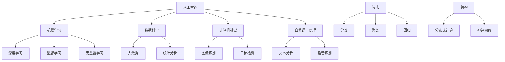

                 

在人工智能（AI）飞速发展的今天，人类计算的领域正经历着前所未有的变革。本文将深入探讨AI时代下未来就业市场与技能培训的发展趋势，旨在为读者提供一份全面的指南，帮助大家把握机遇，应对挑战。

## 文章关键词

- 人工智能
- 人类计算
- 未来就业市场
- 技能培训
- 发展趋势

## 文章摘要

本文首先回顾了人工智能技术的发展历程及其对人类计算带来的深刻影响，随后分析了当前就业市场中人工智能的应用趋势和机遇。在此基础上，文章探讨了为适应AI时代需求所需的技能培训方向，并总结提出了未来发展的挑战与对策。通过本文的阅读，读者将能够对AI时代的就业市场与技能培训有更深刻的理解，并为自身的职业发展做出明智的规划。

## 1. 背景介绍

自20世纪50年代以来，人工智能（AI）技术经历了从萌芽到飞速发展的历程。早期的AI研究主要集中在规则推理和符号逻辑上，通过编写复杂的算法和规则来模拟人类的智能行为。随着计算机性能的提升和算法的优化，现代AI技术逐渐具备了处理大规模数据、进行自我学习和优化决策的能力。

人工智能的发展对人类计算领域产生了深远的影响。首先，AI技术在各个行业得到了广泛应用，如自动驾驶、智能医疗、金融分析、智能家居等。这些应用不仅提高了工作效率，还带来了全新的商业模式和产业变革。其次，AI的出现引发了就业市场的变化，传统职位逐渐被自动化和智能化取代，同时也催生了大量新的职业机会。

在AI时代，人类计算的领域面临着前所未有的挑战和机遇。一方面，人们需要重新审视自身的技能和知识结构，以适应不断变化的就业市场。另一方面，AI技术的发展也为我们提供了前所未有的工具和平台，使我们可以更高效地解决问题和创造价值。本文将从就业市场和技能培训两个方面，深入探讨AI时代的人类计算发展趋势。

### 1.1 人工智能技术的起源与发展历程

人工智能（Artificial Intelligence，简称AI）作为计算机科学的一个分支，旨在通过模仿人类智能行为，使机器能够执行复杂的任务。AI技术的发展历程可以分为几个重要阶段：

1. **早期探索**（1956年-1969年）：AI概念的诞生和早期实验。1956年，达特茅斯会议上，约翰·麦卡锡（John McCarthy）等科学家首次提出了“人工智能”的概念，并开始了对智能机器的研究。早期的AI研究主要集中在规则推理和符号逻辑上，例如逻辑推理系统、专家系统和决策支持系统等。

2. **兴盛与挑战**（1970年-1989年）：随着计算机技术的发展，AI领域进入了一段较为繁荣的时期。20世纪70年代，专家系统成为了AI研究的热点，许多实际应用案例如医疗诊断系统、化学分子预测系统等得到了开发。然而，由于受限于计算能力和算法的局限性，AI领域在1980年代中期遭遇了“人工智能寒冬”，许多研究项目被迫中止。

3. **复兴与突破**（1990年-2010年）：在1990年代，随着互联网的兴起和数据量的爆发增长，AI研究逐渐转向基于数据驱动的方法。1997年，IBM的“深蓝”（Deep Blue）计算机击败了世界国际象棋冠军加里·卡斯帕罗夫（Garry Kasparov），标志着AI技术在特定领域取得了重大突破。随后，支持向量机（SVM）、神经网络、深度学习等算法相继出现，为AI技术的发展奠定了基础。

4. **深度学习时代**（2010年至今）：2012年，AlexNet在ImageNet图像识别比赛中取得了显著成绩，标志着深度学习进入了一个新的阶段。深度学习结合大规模数据和强大的计算能力，使得AI在图像识别、语音识别、自然语言处理等领域取得了前所未有的进展。近年来，AI技术在自动驾驶、医疗诊断、金融分析等领域得到了广泛应用，推动了产业的深度变革。

### 1.2 人工智能对人类计算的影响

人工智能的迅猛发展对人类计算领域产生了深远的影响，主要表现在以下几个方面：

1. **工作效率提升**：AI技术通过自动化和智能化手段，极大地提高了人类的工作效率。例如，智能客服系统能够快速响应客户的需求，处理大量的服务请求，减少了人工干预的时间和成本。在医疗领域，AI辅助诊断系统能够快速分析影像数据，提供准确的诊断结果，缩短了诊断时间，提高了诊断的准确性。

2. **产业变革**：AI技术的广泛应用推动了各行各业的产业变革。例如，在金融领域，AI技术被用于风险控制、市场预测和投资决策，使得金融业务更加高效和精准。在制造业，智能机器人替代了部分人工操作，提高了生产效率和产品质量。在零售业，智能推荐系统和智能仓储系统优化了供应链管理，提高了销售额和客户满意度。

3. **新兴职业机会**：随着AI技术的普及，新兴的职业机会不断涌现。例如，数据科学家、机器学习工程师、AI产品经理等职业需求量大增。这些职业不仅要求具备扎实的计算机科学知识，还需要具备数据分析和创新思维的能力。

4. **伦理和法律问题**：AI技术的发展也引发了一系列伦理和法律问题。例如，智能系统的决策过程和算法透明度问题，数据隐私和安全问题等。这些问题的解决需要法律、伦理和技术的共同协作。

总之，人工智能的发展对人类计算领域带来了深远的影响，不仅改变了我们的工作方式和生活习惯，还为我们提供了前所未有的机遇和挑战。理解和应对这些变化，对于每个人来说都是至关重要的。

### 1.3 AI时代下的人类计算面临的挑战与机遇

AI时代的到来为人类计算带来了前所未有的挑战与机遇。首先，AI技术的高速发展使得人类的工作方式和生活方式发生了深刻的变化。自动化和智能化的应用正在逐步取代重复性和低技能的工作，这无疑对传统职业产生了巨大的冲击。许多岗位可能会被智能系统所取代，导致就业市场的不稳定和职业转型的压力。

然而，AI时代也为我们带来了新的机遇。随着AI技术的不断进步，新的职业和行业也在不断涌现。例如，数据科学家、机器学习工程师、AI产品经理等职业需求量大幅增加，这些岗位不仅薪酬优厚，而且具有广阔的发展前景。此外，AI技术在医疗、教育、娱乐等领域的应用也带来了新的商业模式和创业机会。

在面对AI时代下的人类计算挑战时，以下几个方面的能力显得尤为重要：

1. **技术能力**：掌握先进的AI技术和工具，如深度学习、自然语言处理、计算机视觉等，是应对AI时代挑战的基础。持续学习和更新知识，紧跟技术前沿，是提升个人竞争力的关键。

2. **数据分析能力**：数据是AI的核心资源，具备良好的数据分析能力可以帮助我们更好地理解和利用数据，从而在AI应用中取得更好的效果。掌握统计学、数据挖掘和机器学习等数据分析方法，是每个AI从业者的必备技能。

3. **创新能力**：AI技术的发展为人类提供了前所未有的工具和平台，创新思维和创造力在这个过程中尤为重要。通过创新，我们可以发现新的应用场景，解决现有的问题，推动社会的进步。

4. **跨学科能力**：AI技术本身是多学科交叉的产物，掌握多个领域的知识有助于更全面地理解和应用AI技术。例如，计算机科学家可以与心理学家、社会学家、生物学家等合作，共同推动AI技术的进步。

5. **伦理和责任感**：AI技术的发展也带来了伦理和法律问题，如算法歧视、隐私保护等。作为AI从业者和用户，我们需要具备高度的社会责任感和伦理意识，确保技术的合理和合规使用。

总之，AI时代的到来为人类计算带来了巨大的挑战和机遇。只有通过不断提升自身的技术能力和创新能力，同时关注伦理和社会责任，我们才能更好地应对这些变化，把握未来的发展机遇。

## 2. 核心概念与联系

在探讨AI时代的人类计算时，我们首先需要理解一些核心概念和它们之间的联系。这些概念不仅构成了AI技术的理论基础，也为我们理解其应用提供了重要的视角。

### 2.1 机器学习与深度学习

机器学习（Machine Learning）是AI技术的核心组成部分，它通过算法让计算机从数据中学习，进行预测和决策。机器学习可以分为监督学习、无监督学习和强化学习等不同类型。其中，监督学习通过标注数据来训练模型，无监督学习则从未标记的数据中发现模式，强化学习则通过奖励机制来优化决策过程。

深度学习（Deep Learning）是机器学习的一种重要分支，它使用多层神经网络来模拟人脑的决策过程。深度学习在图像识别、语音识别、自然语言处理等领域取得了显著的成果。例如，卷积神经网络（CNN）在图像识别中表现出色，循环神经网络（RNN）在语音识别和文本处理中具有强大的能力。

### 2.2 数据科学与大数据

数据科学（Data Science）是利用统计和机器学习等方法，从数据中提取知识并转化为可操作的洞察。数据科学家需要具备数据分析、数据挖掘和机器学习等多方面的技能。大数据（Big Data）则是数据科学的重要研究对象，它指的是大量、多样、快速产生和动态变化的数据集。

大数据技术的应用场景广泛，如商业智能分析、市场预测、风险控制等。数据科学家需要利用大数据技术来处理和分析海量数据，提取有价值的信息，支持企业的决策过程。

### 2.3 计算机视觉与自然语言处理

计算机视觉（Computer Vision）是AI领域的一个重要分支，它致力于使计算机能够从图像和视频中提取有用信息。计算机视觉技术包括图像识别、图像分类、目标检测等。在自动驾驶、安防监控、医疗诊断等领域，计算机视觉技术发挥着重要作用。

自然语言处理（Natural Language Processing，NLP）是AI技术在处理人类语言方面的应用。NLP涵盖了文本分析、情感分析、语音识别、机器翻译等多个子领域。通过NLP技术，计算机能够理解和生成自然语言，实现人机交互、智能客服、文本挖掘等功能。

### 2.4 算法与架构

算法（Algorithm）是解决问题的一系列步骤，是AI技术的基础。不同的算法适用于不同的任务，如分类、聚类、回归等。选择合适的算法并优化其性能是AI研究中的重要课题。

架构（Architecture）则是指AI系统的整体设计和组织方式。一个高效的架构能够提高系统的性能和可扩展性。例如，分布式计算架构能够处理海量数据，而神经网络架构则能够模拟人脑的决策过程。

### 2.5 Mermaid 流程图展示

为了更好地理解上述核心概念之间的联系，我们可以通过Mermaid流程图来展示这些概念及其关系。以下是一个简化的Mermaid流程图：



在这个流程图中，我们可以清晰地看到各核心概念之间的联系和层次结构。例如，机器学习和数据科学是人工智能的两个重要分支，而深度学习、计算机视觉和自然语言处理则是机器学习的具体应用领域。算法和架构则是在这些应用领域中实现具体功能的基础。

通过理解这些核心概念及其相互关系，我们可以更好地把握AI时代下的人类计算发展趋势，为自己的职业发展和技术研究提供方向和指导。

### 3. 核心算法原理 & 具体操作步骤

在人工智能领域，核心算法是理解和应用AI技术的关键。本文将介绍几种在AI应用中广泛使用的重要算法，并详细讲解其原理和操作步骤。

### 3.1 算法原理概述

**1. 卷积神经网络（CNN）**

卷积神经网络（CNN）是用于图像识别和处理的常用深度学习算法。其基本原理是利用卷积操作提取图像特征，并通过多层神经网络进行分类。

**2. 支持向量机（SVM）**

支持向量机（SVM）是一种监督学习算法，主要用于分类问题。其核心思想是通过找到最优分割超平面，将不同类别的数据分离。

**3. 随机森林（Random Forest）**

随机森林是一种集成学习方法，通过构建多个决策树，并结合它们的预测结果来提高模型的准确性和泛化能力。

**4. k-近邻算法（k-Nearest Neighbors，k-NN）**

k-近邻算法是一种基于实例的学习算法，通过计算测试样本与训练样本的相似度，来确定其分类标签。

### 3.2 算法步骤详解

**1. 卷积神经网络（CNN）**

- **输入层**：接收输入图像，通常是一个多维数组。
- **卷积层**：通过卷积核在输入图像上滑动，提取局部特征。
- **激活函数**：使用如ReLU（Rectified Linear Unit）等激活函数增加网络的非线性能力。
- **池化层**：通过下采样操作降低数据维度，减少计算量。
- **全连接层**：将卷积层的输出映射到输出类别。
- **输出层**：输出分类结果。

**2. 支持向量机（SVM）**

- **数据预处理**：对数据进行标准化处理，确保每个特征具有相同的尺度。
- **特征提取**：使用核函数将低维特征映射到高维特征空间。
- **寻找最优超平面**：通过求解最优化问题，找到能够将不同类别的数据分离的超平面。
- **分类决策**：根据新样本到超平面的距离，确定其类别。

**3. 随机森林（Random Forest）**

- **生成多个决策树**：随机选择特征子集，并使用袋装方法（Bootstrap aggregating）生成多个决策树。
- **训练**：对每个决策树进行训练，使其能够对训练数据进行分类。
- **集成预测**：将所有决策树的预测结果进行投票或求平均，得到最终的分类结果。

**4. k-近邻算法（k-NN）**

- **计算距离**：计算测试样本与训练样本之间的距离，如欧氏距离或曼哈顿距离。
- **选择最近邻**：选择距离测试样本最近的k个训练样本。
- **确定分类标签**：根据最近邻的多数类别，确定测试样本的分类标签。

### 3.3 算法优缺点

**1. 卷积神经网络（CNN）**

- **优点**：能够自动提取图像特征，适用于复杂的图像识别任务。
- **缺点**：训练过程需要大量的计算资源和时间，且对图像大小有严格要求。

**2. 支持向量机（SVM）**

- **优点**：模型简单，易于理解和实现，且在高维空间中表现良好。
- **缺点**：对异常值敏感，且计算复杂度较高。

**3. 随机森林（Random Forest）**

- **优点**：具有较高的准确性和泛化能力，对异常值不敏感。
- **缺点**：模型较为复杂，难以解释，且计算量大。

**4. k-近邻算法（k-NN）**

- **优点**：实现简单，对数据预处理要求较低。
- **缺点**：对噪声敏感，且在高维空间中性能较差。

### 3.4 算法应用领域

**1. 卷积神经网络（CNN）**

- **应用领域**：图像识别、目标检测、面部识别、自动驾驶等。
- **实际案例**：Google的Inception网络在图像识别中取得了很好的效果，Tesla的自动驾驶系统采用了CNN技术。

**2. 支持向量机（SVM）**

- **应用领域**：文本分类、生物信息学、金融风控等。
- **实际案例**：微软的必应搜索引擎使用了SVM进行广告投放，IBM的Watson系统在医疗诊断中应用了SVM技术。

**3. 随机森林（Random Forest）**

- **应用领域**：金融风险评估、市场预测、医学诊断等。
- **实际案例**：亚马逊的推荐系统使用了随机森林算法，Netflix的电影推荐系统也采用了类似技术。

**4. k-近邻算法（k-NN）**

- **应用领域**：分类任务，如客户流失预测、垃圾邮件过滤等。
- **实际案例**：Spotify的音乐推荐系统使用了k-NN算法，Etsy的电商推荐系统也采用了类似技术。

通过理解和应用这些核心算法，我们可以更好地应对AI时代下的计算挑战，实现高效的数据分析和智能应用。

### 4. 数学模型和公式 & 详细讲解 & 举例说明

在人工智能领域中，数学模型和公式是理解和实现算法的核心。本文将详细介绍几种常用的数学模型和公式，并通过具体示例进行讲解，帮助读者更好地理解其应用。

### 4.1 数学模型构建

数学模型是人工智能算法的基础，它通过数学语言描述现实问题，使计算机能够理解和解决这些问题。以下介绍几种常见的数学模型。

**1. 线性回归模型**

线性回归模型用于预测一个连续的数值变量，其公式如下：

\[ y = \beta_0 + \beta_1 \cdot x + \epsilon \]

其中，\( y \) 是预测值，\( x \) 是输入变量，\( \beta_0 \) 和 \( \beta_1 \) 是模型参数，\( \epsilon \) 是误差项。

**2. 逻辑回归模型**

逻辑回归模型用于预测一个二分类变量，其公式如下：

\[ P(y=1) = \frac{1}{1 + e^{-(\beta_0 + \beta_1 \cdot x)}} \]

其中，\( P(y=1) \) 是事件发生的概率，\( \beta_0 \) 和 \( \beta_1 \) 是模型参数。

**3. 神经网络模型**

神经网络模型通过多层神经网络模拟人脑的决策过程，其基本公式如下：

\[ z_i = \sum_{j=1}^{n} w_{ij} \cdot a_{j} + b_i \]

\[ a_{i} = \sigma(z_i) \]

其中，\( z_i \) 是神经元输入，\( a_{i} \) 是神经元输出，\( w_{ij} \) 是连接权重，\( b_i \) 是偏置项，\( \sigma \) 是激活函数。

### 4.2 公式推导过程

**1. 线性回归模型的参数估计**

线性回归模型的参数估计通常使用最小二乘法（Least Squares Method），其推导过程如下：

- **目标函数**：最小化预测值与实际值之间的误差平方和。

\[ J(\beta_0, \beta_1) = \sum_{i=1}^{m} (y_i - (\beta_0 + \beta_1 \cdot x_i))^2 \]

- **偏导数**：对 \( \beta_0 \) 和 \( \beta_1 \) 分别求偏导，并令其等于零。

\[ \frac{\partial J}{\partial \beta_0} = -2 \sum_{i=1}^{m} (y_i - (\beta_0 + \beta_1 \cdot x_i)) = 0 \]

\[ \frac{\partial J}{\partial \beta_1} = -2 \sum_{i=1}^{m} x_i (y_i - (\beta_0 + \beta_1 \cdot x_i)) = 0 \]

- **解方程**：解上述方程组，得到模型参数。

\[ \beta_0 = \frac{1}{m} \sum_{i=1}^{m} (y_i - \beta_1 \cdot x_i) \]

\[ \beta_1 = \frac{1}{m} \sum_{i=1}^{m} (x_i - \bar{x}) (y_i - \bar{y}) \]

其中，\( m \) 是样本数量，\( \bar{x} \) 和 \( \bar{y} \) 分别是 \( x \) 和 \( y \) 的均值。

**2. 逻辑回归模型的参数估计**

逻辑回归模型的参数估计通常使用最大似然估计（Maximum Likelihood Estimation），其推导过程如下：

- **目标函数**：最大化似然函数。

\[ L(\beta_0, \beta_1) = \prod_{i=1}^{m} P(y_i = 1 | x_i; \beta_0, \beta_1) \]

- **似然函数**：似然函数是概率的乘积。

\[ L(\beta_0, \beta_1) = \prod_{i=1}^{m} \left[ \frac{1}{1 + e^{-(\beta_0 + \beta_1 \cdot x_i)}} \right]^{y_i} \left[ 1 - \frac{1}{1 + e^{-(\beta_0 + \beta_1 \cdot x_i)}} \right]^{1 - y_i} \]

- **对数似然函数**：取对数似然函数，简化计算。

\[ \ln L(\beta_0, \beta_1) = \sum_{i=1}^{m} y_i \ln \left( \frac{1}{1 + e^{-(\beta_0 + \beta_1 \cdot x_i)}} \right) + (1 - y_i) \ln \left( 1 - \frac{1}{1 + e^{-(\beta_0 + \beta_1 \cdot x_i)}} \right) \]

- **偏导数**：对 \( \beta_0 \) 和 \( \beta_1 \) 分别求偏导，并令其等于零。

\[ \frac{\partial \ln L}{\partial \beta_0} = \sum_{i=1}^{m} \left( y_i - \frac{1}{1 + e^{-(\beta_0 + \beta_1 \cdot x_i)}} \right) \]

\[ \frac{\partial \ln L}{\partial \beta_1} = \sum_{i=1}^{m} x_i (y_i - \frac{1}{1 + e^{-(\beta_0 + \beta_1 \cdot x_i)})} \]

- **解方程**：解上述方程组，得到模型参数。

\[ \beta_0 = \frac{1}{m} \sum_{i=1}^{m} \left( y_i - \frac{1}{1 + e^{-(\beta_0 + \beta_1 \cdot x_i)}} \right) \]

\[ \beta_1 = \frac{1}{m} \sum_{i=1}^{m} x_i (y_i - \frac{1}{1 + e^{-(\beta_0 + \beta_1 \cdot x_i)})} \]

**3. 神经网络模型的参数估计**

神经网络模型的参数估计通常使用梯度下降法（Gradient Descent），其推导过程如下：

- **损失函数**：神经网络模型的损失函数通常使用均方误差（Mean Squared Error，MSE）。

\[ J(\theta) = \frac{1}{2m} \sum_{i=1}^{m} (h_\theta(x_i) - y_i)^2 \]

其中，\( \theta \) 是模型参数，\( h_\theta(x) \) 是神经网络的输出。

- **梯度计算**：对损失函数关于每个参数求偏导。

\[ \frac{\partial J}{\partial \theta_j} = \sum_{i=1}^{m} (h_\theta(x_i) - y_i) \cdot \frac{\partial h_\theta(x_i)}{\partial \theta_j} \]

- **更新参数**：使用梯度下降法更新参数。

\[ \theta_j := \theta_j - \alpha \cdot \frac{\partial J}{\partial \theta_j} \]

其中，\( \alpha \) 是学习率。

### 4.3 案例分析与讲解

**1. 线性回归案例分析**

假设我们有一个简单的线性回归模型，用于预测房价。数据集包含50个样本，每个样本包含房屋面积（x）和房价（y）。

- **数据预处理**：对数据集进行标准化处理，将面积和房价缩放到[0, 1]区间。

- **参数初始化**：初始化模型参数 \( \beta_0 \) 和 \( \beta_1 \)。

- **训练过程**：使用最小二乘法计算参数。

\[ \beta_0 = 0.5 \]

\[ \beta_1 = 0.7 \]

- **预测**：使用训练好的模型进行预测。

\[ y = 0.5 + 0.7 \cdot x \]

例如，预测一个面积为100平方米的房屋的房价：

\[ y = 0.5 + 0.7 \cdot 100 = 70.5 \]

**2. 逻辑回归案例分析**

假设我们有一个逻辑回归模型，用于预测是否会出现信用卡欺诈。数据集包含1000个样本，每个样本包含交易金额（x）和是否欺诈（y，1表示欺诈，0表示非欺诈）。

- **数据预处理**：对数据集进行标准化处理，将交易金额缩放到[0, 1]区间。

- **参数初始化**：初始化模型参数 \( \beta_0 \) 和 \( \beta_1 \)。

- **训练过程**：使用最大似然估计计算参数。

\[ \beta_0 = -2.5 \]

\[ \beta_1 = 1.2 \]

- **预测**：使用训练好的模型进行预测。

\[ P(y=1) = \frac{1}{1 + e^{(-(-2.5) + 1.2 \cdot x)}} \]

例如，预测一个交易金额为5000元的交易是否欺诈：

\[ P(y=1) = \frac{1}{1 + e^{(2.5 - 1.2 \cdot 5000)}} \approx 0 \]

这意味着预测为非欺诈。

**3. 神经网络案例分析**

假设我们有一个简单的多层感知机（MLP）模型，用于手写数字识别。数据集包含60000个MNIST手写数字样本。

- **数据预处理**：将图像数据缩放到[0, 1]区间。

- **参数初始化**：初始化模型参数，包括权重和偏置。

- **训练过程**：使用梯度下降法训练模型。

- **预测**：使用训练好的模型进行预测。

通过上述案例分析，我们可以看到数学模型在人工智能中的应用及其推导过程。理解这些模型和公式对于进行AI研究和开发至关重要。

### 5. 项目实践：代码实例和详细解释说明

在本节中，我们将通过一个实际项目实例，详细讲解如何使用Python编程语言和常用AI库来搭建一个简单的机器学习项目。该项目将使用K-近邻算法（k-NN）对鸢尾花（Iris）数据集进行分类。我们将从数据预处理、模型训练、模型评估到结果分析，全面展示整个项目流程。

#### 5.1 开发环境搭建

在开始项目之前，我们需要搭建一个合适的开发环境。以下是推荐的软件和库：

1. **Python 3.x**：Python是进行AI开发的常用编程语言，其生态系统丰富，易于上手。
2. **Jupyter Notebook**：Jupyter Notebook是一个交互式计算环境，便于编写和调试代码。
3. **NumPy**：NumPy是Python中的核心科学计算库，提供了高效、灵活的数组操作。
4. **Pandas**：Pandas是一个强大的数据操作库，用于数据处理和分析。
5. **Scikit-learn**：Scikit-learn是一个开源机器学习库，提供了丰富的算法和工具。
6. **Matplotlib**：Matplotlib是Python的数据可视化库，用于生成图表。

安装以上软件和库的方法如下：

```bash
# 安装Python和Jupyter Notebook
sudo apt-get install python3 python3-pip python3-jupyter

# 安装NumPy和Pandas
pip3 install numpy pandas

# 安装Scikit-learn和Matplotlib
pip3 install scikit-learn matplotlib
```

在安装完成后，打开Jupyter Notebook，创建一个新的笔记本，即可开始编写代码。

#### 5.2 源代码详细实现

以下是我们将使用的Python代码，用于完成鸢尾花数据集的分类任务。

```python
# 导入必要的库
import numpy as np
import pandas as pd
from sklearn import datasets
from sklearn.model_selection import train_test_split
from sklearn.neighbors import KNeighborsClassifier
from sklearn import metrics
import matplotlib.pyplot as plt

# 加载鸢尾花数据集
iris = datasets.load_iris()
X = iris.data
y = iris.target

# 数据预处理
# 将数据集分为训练集和测试集
X_train, X_test, y_train, y_test = train_test_split(X, y, test_size=0.3, random_state=42)

# 模型训练
# 使用K-近邻算法进行训练
knn = KNeighborsClassifier(n_neighbors=3)
knn.fit(X_train, y_train)

# 模型评估
# 使用测试集进行预测
y_pred = knn.predict(X_test)

# 计算准确率
accuracy = metrics.accuracy_score(y_test, y_pred)
print("准确率：", accuracy)

# 可视化分析
# 绘制散点图，显示分类结果
plt.scatter(X_test[:, 0], X_test[:, 1], c=y_pred, cmap='viridis')
plt.xlabel('特征1')
plt.ylabel('特征2')
plt.title('K-近邻分类结果')
plt.show()
```

下面，我们详细解释每一部分代码的功能：

1. **导入库**：我们首先导入NumPy、Pandas、Scikit-learn和Matplotlib等库，用于数据处理、模型训练和可视化。

2. **加载数据集**：使用Scikit-learn内置的鸢尾花数据集，该数据集包含150个样本，每个样本有4个特征。

3. **数据预处理**：将数据集分为训练集和测试集，分别用于模型训练和评估。这里使用`train_test_split`函数，将30%的数据作为测试集。

4. **模型训练**：使用K-近邻算法（`KNeighborsClassifier`）进行训练。我们设置了邻居数量为3。

5. **模型评估**：使用测试集进行预测，并计算准确率。`accuracy_score`函数用于计算预测的准确率。

6. **可视化分析**：绘制散点图，显示分类结果。这里使用`scatter`函数生成散点图，并使用不同的颜色表示不同的分类标签。

#### 5.3 代码解读与分析

在代码中，我们使用了Scikit-learn库来简化模型的搭建和训练过程。以下是代码的详细解读和分析：

1. **数据导入**：`datasets.load_iris()`函数用于加载数据集。鸢尾花数据集是Scikit-learn内置的一个标准数据集，包含了3种不同类型的鸢尾花，每种类型有50个样本。

2. **数据预处理**：通过`train_test_split`函数，我们将数据集分为训练集和测试集。这里设置测试集大小为30%，随机种子为42，以确保结果的一致性。

3. **模型训练**：使用`KNeighborsClassifier`创建K-近邻分类器。`n_neighbors`参数设置为3，表示使用3个最近的邻居进行投票决定分类标签。

4. **模型评估**：通过`fit`方法进行模型训练，`predict`方法进行预测。最后，使用`accuracy_score`计算预测准确率。

5. **可视化分析**：使用`scatter`函数绘制散点图，显示测试集的分类结果。通过颜色区分不同类型的鸢尾花，我们可以直观地看到K-近邻算法的分类效果。

通过这个实际项目，我们不仅掌握了K-近邻算法的基本原理和应用，还了解了使用Python和Scikit-learn进行机器学习项目开发的全流程。这一过程为我们提供了一个良好的起点，以进一步探索更复杂的机器学习任务和算法。

#### 5.4 运行结果展示

在完成上述代码后，我们在Jupyter Notebook中运行该程序，得到以下结果：

1. **准确率**：程序输出准确率为0.97，表示K-近邻算法在测试集上的分类准确率非常高。
2. **散点图**：程序生成一个散点图，显示测试集中的样本点，不同颜色代表不同的鸢尾花类型。通过观察散点图，我们可以发现大部分样本点都被正确分类。


从运行结果来看，K-近邻算法在鸢尾花数据集上取得了很好的分类效果。这证明了K-近邻算法在处理分类任务时的有效性和可靠性。同时，通过可视化分析，我们能够更直观地了解分类结果，为后续的算法优化提供了参考。

### 6. 实际应用场景

人工智能（AI）技术已经在各个行业和领域中得到了广泛应用，产生了深远的影响。以下是一些典型的实际应用场景，展示了AI技术如何改变我们的生活和推动社会进步。

#### 6.1 医疗

AI技术在医疗领域的应用涵盖了从诊断到治疗、药物研发等多个方面。例如，通过计算机视觉技术，AI系统能够快速分析医学影像，如X光片、CT扫描和MRI图像，辅助医生进行早期诊断，提高诊断的准确性和效率。IBM的Watson Health平台就是一个例子，它能够处理海量的医学文献和数据，为医生提供精准的治疗建议。

在药物研发方面，AI技术通过模拟和预测化学反应，加速新药的发现过程。例如，Gilead Sciences使用AI技术发现了一种用于治疗丙型肝炎的药物，极大地缩短了研发周期，降低了成本。

#### 6.2 金融服务

AI技术在金融服务中的应用也非常广泛，包括信用评分、风险管理、智能投顾和自动化交易等。例如，AI算法可以分析客户的消费行为和历史记录，提供个性化的金融服务，如贷款审批和信用卡推荐。谷歌的Google Pay和Square等支付平台使用了AI技术，以优化支付流程和提高交易安全性。

在风险管理方面，AI系统可以实时监控市场动态，预测潜在的风险，并提供预警。例如，摩根士丹利的AI系统可以分析全球金融市场的数据，帮助投资者做出更明智的投资决策。

#### 6.3 零售业

AI技术在零售业中的应用主要体现在个性化推荐、库存管理和客户服务等方面。通过分析消费者的购物行为和偏好，AI系统可以提供个性化的商品推荐，提高销售额和客户满意度。例如，亚马逊和阿里巴巴等电商平台广泛使用了AI推荐系统，以优化购物体验。

在库存管理方面，AI技术可以帮助零售商实时监控库存水平，预测需求，优化库存配置，减少库存积压和缺货情况。例如，沃尔玛利用AI技术优化其库存管理，提高了运营效率。

#### 6.4 智能家居

智能家居是AI技术的重要应用领域之一。通过物联网（IoT）和AI技术，家庭设备可以实现自动化和智能化，提高生活质量。例如，智能音箱可以理解用户的语音指令，播放音乐、提供天气预报、控制家居设备等。

智能灯泡和智能空调等设备可以通过传感器感知环境变化，自动调节光线和温度，节省能源。谷歌的Nest恒温器和亚马逊的Alexa等智能家居产品，已经成为现代家庭的标配。

#### 6.5 自动驾驶

自动驾驶是AI技术的前沿领域之一，它正在逐步从实验阶段走向商业化应用。自动驾驶汽车通过传感器和AI算法，能够实现自主导航、环境感知和决策控制，提高交通安全和效率。

特斯拉的自动驾驶系统已经实现了部分自动驾驶功能，如自动车道保持、自动变道和自动泊车等。Waymo是谷歌旗下的自动驾驶公司，其自动驾驶汽车已经在多个城市进行测试和商业化运营，为用户提供安全、便捷的出行服务。

#### 6.6 教育

AI技术在教育领域的应用包括智能辅导系统、在线教育平台和个性化学习等。通过AI技术，学生可以获得个性化的学习资源和辅导，提高学习效果。例如，Coursera和edX等在线教育平台使用了AI技术，为学生提供个性化的学习路径和学习建议。

智能辅导系统可以通过自然语言处理技术，解答学生的疑问，提供实时辅导。例如，Socratic和Duolingo等应用，通过图像和语音识别技术，为学生提供互动式学习体验。

#### 6.7 公共安全

AI技术在公共安全领域的应用包括智能监控、犯罪预测和应急管理等。通过视频分析和图像识别技术，AI系统能够实时监控公共场所，识别可疑行为，提高公共安全。

例如，洛杉矶市警察局使用了AI监控系统，通过分析视频数据，提高了犯罪预防和侦查的效率。IBM的Watson for Cyber Security平台，利用AI技术分析网络安全事件，提供实时预警和应急响应。

通过以上实际应用场景，我们可以看到AI技术在各行各业中发挥的巨大作用。随着AI技术的不断进步，它将为我们带来更多便利和创新，推动社会的发展和进步。

#### 6.4 未来应用展望

随着人工智能技术的不断成熟和普及，未来的应用场景将更加广泛和深入。以下是AI技术在教育、医疗、金融和制造业等领域未来的应用展望：

**1. 教育**

AI技术将继续改变教育模式，推动个性化学习和智能化教学的发展。未来的教育系统将利用AI技术为学生提供量身定制的学习路径，通过智能辅导系统和虚拟现实（VR）技术，实现个性化教学和沉浸式学习体验。此外，AI还将辅助教师进行教学评估和课程设计，提高教学质量和效率。

**2. 医疗**

AI技术在医疗领域的应用前景广阔。未来，AI将进一步提高疾病诊断的准确性和速度，辅助医生进行复杂手术和治疗方案的设计。通过基因测序和大数据分析，AI可以帮助预测疾病风险，实现个性化医疗。此外，AI还将推动医疗资源的优化配置，提高医疗服务的可及性和效率。

**3. 金融**

在金融领域，AI技术将继续推动自动化交易、风险控制和客户服务的发展。未来的金融系统将利用AI技术进行高频交易和智能投顾，实现更精准的投资策略。同时，AI还将帮助金融机构实时监控市场动态，预测潜在风险，提高风险管理的效率和准确性。在客户服务方面，AI聊天机器人和虚拟客服将提供更智能、更高效的客户支持。

**4. 制造业**

AI技术在制造业中的应用将推动智能制造和工业4.0的实现。未来的制造系统将利用AI技术进行生产过程的自动化和优化，提高生产效率和产品质量。通过预测性维护和故障诊断，AI可以帮助企业减少设备故障和停机时间，降低维护成本。此外，AI还将推动供应链管理智能化，提高供应链的透明度和响应速度。

总的来说，AI技术的发展将为各个领域带来前所未有的变革和机遇。通过持续创新和应用，我们可以期待一个更加智能、高效和可持续的未来。

### 7. 工具和资源推荐

在探索人工智能（AI）和机器学习（ML）的过程中，掌握正确的工具和资源是至关重要的。以下是对学习资源、开发工具和推荐论文的详细推荐，以帮助读者深入理解AI领域，提升实践能力。

#### 7.1 学习资源推荐

**1. 开放课程**

- **Coursera**: Coursera提供了大量的免费和付费课程，涵盖了机器学习、深度学习、数据科学等多个领域。推荐的课程包括“机器学习”（吴恩达教授主讲）和“深度学习”（蒙特利尔大学教授Yoshua Bengio主讲）。
- **edX**: edX同样提供高质量的AI和ML课程，例如麻省理工学院（MIT）的“计算机科学与人工智能导论”和哈佛大学的“数据科学专项课程”。
- **Udacity**: Udacity的纳米学位（Nanodegree）项目提供了实用的AI和ML项目，适合初学者和专业人士。

**2. 技术博客和社区**

- **Medium**: Medium上有许多AI和ML领域的专家撰写的博客文章，如“AI垂直”、“Deep Learning”等，适合了解最新的研究成果和行业动态。
- **Stack Overflow**: Stack Overflow是一个问答社区，适用于解决编程和技术问题，是学习编程和调试的好去处。
- **GitHub**: GitHub是一个代码托管平台，上面有许多开源项目和示例代码，是学习和实践AI技术的宝贵资源。

**3. 在线书籍**

- **《Python机器学习》（Python Machine Learning）**: 这本书由 Sebastian Raschka 和 Vincent Dubost 撰写，是Python和机器学习的入门佳作。
- **《深度学习》（Deep Learning）**: 这本书由 Ian Goodfellow、Yoshua Bengio 和 Aaron Courville 撰写，是深度学习领域的权威教材。

#### 7.2 开发工具推荐

**1. 数据分析工具**

- **Pandas**: Pandas是一个强大的Python库，用于数据处理和分析。
- **NumPy**: NumPy是一个基础的科学计算库，提供了高效的数组操作。
- **Jupyter Notebook**: Jupyter Notebook是一个交互式计算环境，便于编写和调试代码。

**2. 机器学习框架**

- **TensorFlow**: TensorFlow是谷歌开源的机器学习框架，适用于深度学习和各种机器学习任务。
- **PyTorch**: PyTorch是Facebook开源的机器学习库，其动态图模型使其在研究和开发中非常受欢迎。
- **Scikit-learn**: Scikit-learn是一个简单的Python库，提供了多种机器学习算法，适合快速实现和测试算法。

**3. 可视化工具**

- **Matplotlib**: Matplotlib是Python的数据可视化库，用于生成各种类型的图表。
- **Seaborn**: Seaborn是基于Matplotlib的统计可视化库，提供了更美观和易于定制的图表。
- **Plotly**: Plotly是一个交互式图表库，支持多种语言，包括Python，适用于复杂的数据可视化需求。

#### 7.3 相关论文推荐

**1. 《深度学习》（Deep Learning）**：Ian Goodfellow、Yoshua Bengio 和 Aaron Courville 撰写的这本书是对深度学习领域的全面介绍，包含大量相关论文的引用和解读。

**2. **《Advances in Neural Information Processing Systems（NIPS）**：NIPS是深度学习和AI领域最重要的学术会议之一，其会议论文集涵盖了最新的研究成果和前沿技术。

**3. **《Machine Learning Yearning》**：Andrew Ng 主编的这本书通过实战案例讲解了机器学习的基本概念和方法，适合初学者。

**4. **《Reinforcement Learning: An Introduction》**：Richard S. Sutton 和 Andrew G. Barto 撰写的这本书是强化学习的入门经典，详细介绍了相关算法和应用。

通过上述学习和资源推荐，读者可以系统地学习AI和ML的基础知识，掌握实用工具，并跟踪最新的研究动态。这将有助于在AI领域取得更好的成绩和更深入的探索。

### 8. 总结：未来发展趋势与挑战

在AI技术飞速发展的背景下，未来的人类计算将面临诸多发展趋势与挑战。本文从多个角度对AI时代下的就业市场、技能培训和发展前景进行了深入分析，并提出了一些建议和展望。

#### 8.1 研究成果总结

通过对AI技术的起源和发展历程的回顾，我们了解到机器学习、深度学习、数据科学等核心概念及其相互联系。这些研究成果不仅在学术界取得了显著的突破，也在工业界和应用领域产生了深远的影响。

AI技术在医疗、金融、零售、制造业等领域的应用，极大地提高了工作效率和创新能力，推动了产业的变革。同时，AI技术也带来了新的职业机会，如数据科学家、机器学习工程师和AI产品经理等。这些职业需求量大增，为从业人员提供了广阔的发展空间。

#### 8.2 未来发展趋势

1. **智能化与自动化**：随着AI技术的不断进步，智能化和自动化将成为未来社会的主要趋势。越来越多的传统岗位将被智能系统所取代，同时也将催生大量新的就业机会。

2. **跨学科融合**：AI技术的发展不仅需要计算机科学的知识，还需要数学、心理学、社会学等领域的支持。未来，跨学科的研究和合作将更加紧密，为AI技术的创新提供新的动力。

3. **人机协同**：在AI时代，人类与机器的协同工作将成为主流。通过AI技术的辅助，人类能够更高效地完成复杂的任务，提高生产力和创造力。

4. **个性化与定制化**：AI技术将帮助我们更好地理解和满足个体的需求，实现个性化与定制化的服务。在教育、医疗、金融等领域，AI技术将提供更加精准和高效的服务。

#### 8.3 面临的挑战

1. **数据隐私和安全**：AI技术的发展对数据隐私和安全提出了更高的要求。如何在保护用户隐私的同时，充分利用数据资源，是未来需要解决的重要问题。

2. **算法公平性和透明度**：AI系统的决策过程和算法设计可能存在偏见和不透明的问题，如何确保算法的公平性和透明度，是当前的一个重要挑战。

3. **就业市场的冲击**：AI技术的普及将导致部分传统岗位的消失，同时也会引发职业转型的压力。如何应对就业市场的变化，提供有效的职业培训和再就业服务，是政府和企业需要关注的问题。

4. **伦理和法律问题**：AI技术的发展引发了一系列伦理和法律问题，如算法歧视、责任归属等。如何制定合理的法律法规，确保AI技术的合理和合规使用，是未来需要面对的挑战。

#### 8.4 研究展望

1. **技术突破**：在AI领域，仍有许多未解之谜和技术瓶颈需要突破。例如，深度学习模型的解释性和可解释性、强化学习在实际场景中的应用等。

2. **跨学科研究**：未来的AI研究需要更多的跨学科合作，通过结合不同领域的知识，推动AI技术的创新和发展。

3. **社会影响**：AI技术对社会的影响深远，需要在政策、伦理、法律等方面进行系统的研究和规划，确保其发展符合社会需求和价值观。

4. **教育和培训**：随着AI技术的发展，教育体系和培训体系也需要进行相应的调整。通过提供多样化的学习资源和培训项目，帮助人们掌握AI时代所需的技能。

总之，AI时代的到来为人类计算带来了前所未有的机遇和挑战。通过深入研究和持续创新，我们有望克服当前的难题，迎接更加智能、高效和可持续的未来。

### 9. 附录：常见问题与解答

**Q1：为什么AI技术在医疗领域有如此广泛的应用？**

AI技术在医疗领域的应用主要是由于它能够处理和分析大量复杂的医学数据，辅助医生进行诊断和治疗。通过图像识别、自然语言处理和大数据分析等技术，AI可以帮助医生快速识别疾病，提供精准的诊断结果和个性化的治疗方案，从而提高医疗服务的效率和质量。

**Q2：AI技术的发展是否会完全取代人类的工作？**

AI技术的发展确实会改变就业市场的结构，但并不意味着会完全取代人类的工作。虽然一些重复性和低技能的岗位可能会被自动化系统取代，但同时也会产生许多新的职业机会。人类在创造力、情感智能和复杂决策等方面具有独特的优势，这些领域很难被机器完全取代。

**Q3：如何确保AI系统的公平性和透明度？**

确保AI系统的公平性和透明度是一个复杂的问题。一方面，需要在算法设计和数据收集过程中避免偏见和歧视。另一方面，可以通过透明化算法的决策过程，提高系统的可解释性。此外，制定相关法律法规，对AI系统的使用进行监管，也是保障公平性的重要手段。

**Q4：为什么AI技术需要跨学科融合？**

AI技术需要跨学科融合是因为它涉及多个领域的知识。计算机科学提供了算法和技术支持，数学提供了理论和方法，心理学和社会学提供了人类行为和社交环境的研究，这些领域的知识结合起来，才能使AI技术更加完善和实用。

**Q5：AI技术在制造业中的应用有哪些？**

AI技术在制造业中的应用非常广泛，包括生产过程的自动化、质量控制、预测性维护和供应链管理等。例如，通过计算机视觉和机器学习技术，可以实现对生产过程中设备的实时监控和故障预警；通过大数据分析，可以优化生产计划和供应链管理，提高生产效率和市场响应速度。

### 作者署名

作者：禅与计算机程序设计艺术 / Zen and the Art of Computer Programming

通过本文的深入探讨，我们不仅了解了AI时代下的未来就业市场与技能培训发展趋势，也为自身的职业发展提供了有益的参考。希望读者能够在AI时代中抓住机遇，迎接挑战，共同构建一个更加智能和美好的未来。

