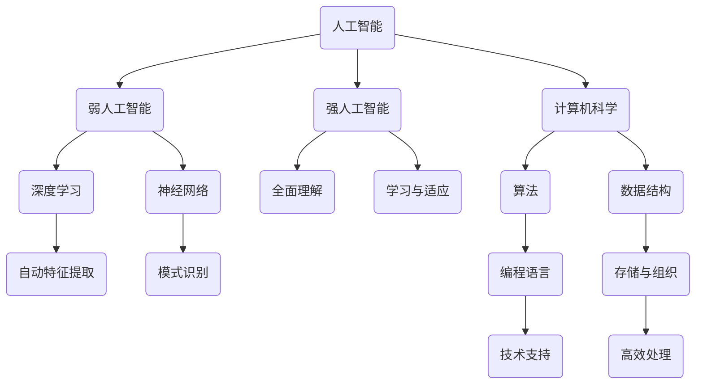

                 

关键词：人工智能，就业市场，技能培训，未来趋势，挑战，预测分析

摘要：随着人工智能（AI）技术的飞速发展，人类计算在AI时代面临着前所未有的变革。本文从背景介绍入手，深入分析了AI时代的核心概念与联系，探讨了核心算法原理与具体操作步骤，介绍了数学模型和公式，并提供了实际项目实践的代码实例。同时，本文还阐述了实际应用场景，对未来应用展望进行了探讨，并推荐了相关学习资源和开发工具。最后，本文总结了研究成果，分析了未来发展趋势与挑战，提出了研究展望。

## 1. 背景介绍

人工智能（Artificial Intelligence，简称AI）作为计算机科学的一个分支，旨在研究、开发和应用使计算机模拟、延伸和扩展人的智能的理论、方法、技术及应用系统。随着深度学习、自然语言处理、计算机视觉等技术的发展，AI的应用领域越来越广泛，已经深入到人们的日常生活和各行各业。

就业市场是经济社会的重要组成部分，它反映了劳动力的供需关系和职业技能的变化。技能培训作为提高劳动力素质、适应经济发展和产业升级的重要手段，受到了广泛关注。随着AI技术的崛起，传统的就业市场和技能培训体系面临着巨大的挑战和变革。

近年来，AI技术的迅猛发展不仅改变了人类的工作方式和生活方式，也对就业市场产生了深远的影响。一方面，AI技术在一定程度上替代了重复性、低技能的工作，导致部分劳动者面临失业风险；另一方面，AI技术也为新兴职业和就业机会的创造提供了广阔的空间。

在这个背景下，本文旨在探讨AI时代的未来就业市场与技能培训发展趋势，分析其中的机遇与挑战，并对未来进行趋势预测和分析。通过深入研究，本文希望能够为政策制定者、教育机构和企业提供有益的参考，以推动人工智能时代的就业市场健康、稳定、可持续发展。

## 2. 核心概念与联系

### 2.1 人工智能

人工智能（AI）是指计算机系统模拟人类智能行为的能力。根据其实现方式，AI可以分为两大类：弱人工智能（Narrow AI）和强人工智能（General AI）。弱人工智能是指专注于特定任务的人工智能，如语音识别、图像识别等；而强人工智能则具备全面理解、学习和适应各种任务的能力，类似于人类的智能。

在AI的发展过程中，深度学习（Deep Learning）和神经网络（Neural Networks）起到了至关重要的作用。深度学习通过构建多层神经网络模型，实现了对大量数据的自动特征提取和学习；神经网络则模拟了人脑神经元之间的连接和交互，使得计算机能够进行复杂的模式识别和决策。

### 2.2 计算机科学

计算机科学（Computer Science，简称CS）是一门涵盖计算机硬件、软件及其应用的科学。它不仅研究计算机的理论基础，还涉及计算机系统的设计、开发、测试和维护等实际应用。

在计算机科学领域，算法（Algorithm）和数据结构（Data Structure）是两个核心概念。算法是指解决问题的步骤和规则，而数据结构则是存储和组织数据的方式。通过合适的算法和数据结构，计算机科学能够高效地处理海量数据，实现复杂任务。

### 2.3 人工智能与计算机科学的联系

人工智能与计算机科学之间有着密切的联系。计算机科学为人工智能提供了理论基础和技术支持，如编程语言、算法和数据结构等。而人工智能则将计算机科学的理论应用于实际问题中，实现了对人类智能的模拟和延伸。

在人工智能的发展过程中，计算机科学的方法和技术得到了广泛应用。例如，深度学习和神经网络技术源于计算机科学中的神经网络理论和机器学习算法；自然语言处理技术则借鉴了计算机科学中的自然语言理解和处理方法。

此外，人工智能与计算机科学的联系还体现在跨学科的研究和应用。例如，心理学、认知科学、语言学等领域的研究成果为人工智能的发展提供了重要的理论支持；而人工智能技术的应用也为这些领域的研究提供了新的方法和工具。

### 2.4 Mermaid 流程图

为了更直观地展示人工智能与计算机科学之间的联系，我们使用Mermaid流程图进行描述。



在这个流程图中，我们可以清晰地看到人工智能与计算机科学之间的紧密联系。从弱人工智能到强人工智能，从深度学习到神经网络，再到计算机科学中的算法、数据结构、编程语言等技术，它们共同构成了人工智能与计算机科学的核心内容。

通过这个流程图，我们可以更深入地理解人工智能与计算机科学的联系，为后续章节的探讨打下坚实的基础。

## 3. 核心算法原理 & 具体操作步骤

### 3.1 算法原理概述

在人工智能领域，核心算法起到了至关重要的作用。本文将介绍几种常见的核心算法，包括监督学习、无监督学习和强化学习，并阐述其原理和应用。

#### 3.1.1 监督学习

监督学习是一种基于已知数据集进行训练的学习方法。其基本原理是通过输入特征向量（特征值）和对应的标签（目标值）来构建一个学习模型，然后使用这个模型对未知数据进行预测。

监督学习的主要步骤包括：

1. 数据预处理：对输入数据进行清洗、归一化等处理，以提高模型的训练效果。
2. 特征选择：从输入数据中选择对模型训练最有用的特征，以减少计算量和提高模型性能。
3. 模型训练：使用训练数据集对模型进行训练，通过调整模型参数来优化模型的性能。
4. 模型评估：使用测试数据集对模型进行评估，以确定模型的准确性和泛化能力。

监督学习在分类和回归任务中有着广泛的应用，如图像分类、语音识别、文本分类等。

#### 3.1.2 无监督学习

无监督学习是一种基于未知数据集进行训练的学习方法。其基本原理是仅通过输入特征向量来构建学习模型，模型需要自动发现数据中的规律和结构。

无监督学习的主要步骤包括：

1. 数据预处理：对输入数据进行清洗、归一化等处理，以提高模型的训练效果。
2. 特征提取：从输入数据中提取具有代表性的特征，以降低数据维度和计算复杂度。
3. 模型训练：使用无监督学习算法（如聚类、降维等）对模型进行训练，以发现数据中的规律和结构。
4. 模型评估：使用评估指标（如聚类质量、降维效果等）来评估模型的性能。

无监督学习在聚类、降维、异常检测等任务中有着广泛的应用。

#### 3.1.3 强化学习

强化学习是一种基于反馈信号进行训练的学习方法。其基本原理是智能体通过与环境的交互，不断调整其行为策略，以最大化累积奖励。

强化学习的主要步骤包括：

1. 环境建模：构建一个模拟环境，以模拟实际应用场景。
2. 策略选择：智能体根据当前状态选择一个动作，并执行该动作。
3. 奖励反馈：根据执行动作后的状态和奖励信号，调整智能体的策略。
4. 模型训练：使用训练数据集对智能体进行训练，以优化其策略。

强化学习在游戏、机器人控制、自动驾驶等任务中有着广泛的应用。

### 3.2 算法步骤详解

#### 3.2.1 监督学习步骤详解

1. 数据预处理：对输入数据进行清洗、归一化等处理，以提高模型的训练效果。具体步骤如下：
   - 数据清洗：去除缺失值、异常值等无效数据。
   - 数据归一化：将数据缩放到相同的范围，以避免特征之间的差异对模型训练产生不利影响。

2. 特征选择：从输入数据中选择对模型训练最有用的特征，以减少计算量和提高模型性能。具体步骤如下：
   - 特征提取：使用相关算法（如PCA、LDA等）对输入数据进行降维和特征提取。
   - 特征筛选：根据特征的重要性、相关性等指标，选择对模型训练最有用的特征。

3. 模型训练：使用训练数据集对模型进行训练，通过调整模型参数来优化模型的性能。具体步骤如下：
   - 选择模型：根据任务需求选择合适的模型（如线性回归、决策树、神经网络等）。
   - 模型训练：使用训练数据集对模型进行迭代训练，调整模型参数以优化性能。

4. 模型评估：使用测试数据集对模型进行评估，以确定模型的准确性和泛化能力。具体步骤如下：
   - 计算评估指标：根据任务需求计算评估指标（如准确率、召回率、F1值等）。
   - 模型调优：根据评估结果调整模型参数，以提高模型性能。

#### 3.2.2 无监督学习步骤详解

1. 数据预处理：对输入数据进行清洗、归一化等处理，以提高模型的训练效果。具体步骤如下：
   - 数据清洗：去除缺失值、异常值等无效数据。
   - 数据归一化：将数据缩放到相同的范围，以避免特征之间的差异对模型训练产生不利影响。

2. 特征提取：从输入数据中提取具有代表性的特征，以降低数据维度和计算复杂度。具体步骤如下：
   - 特征提取：使用相关算法（如PCA、LDA等）对输入数据进行降维和特征提取。
   - 特征筛选：根据特征的重要性、相关性等指标，选择对模型训练最有用的特征。

3. 模型训练：使用无监督学习算法（如聚类、降维等）对模型进行训练，以发现数据中的规律和结构。具体步骤如下：
   - 选择算法：根据任务需求选择合适的无监督学习算法（如K均值聚类、主成分分析等）。
   - 模型训练：使用训练数据集对模型进行迭代训练，调整模型参数以优化性能。

4. 模型评估：使用评估指标（如聚类质量、降维效果等）来评估模型的性能。具体步骤如下：
   - 计算评估指标：根据任务需求计算评估指标（如聚类质量、降维效果等）。
   - 模型调优：根据评估结果调整模型参数，以提高模型性能。

#### 3.2.3 强化学习步骤详解

1. 环境建模：构建一个模拟环境，以模拟实际应用场景。具体步骤如下：
   - 环境定义：定义环境的状态空间、动作空间和奖励函数。
   - 环境模拟：根据定义的环境参数，模拟环境中的状态和动作。

2. 策略选择：智能体根据当前状态选择一个动作，并执行该动作。具体步骤如下：
   - 状态评估：使用评估函数对当前状态进行评估，以确定最优动作。
   - 动作选择：根据评估结果选择一个动作进行执行。

3. 奖励反馈：根据执行动作后的状态和奖励信号，调整智能体的策略。具体步骤如下：
   - 奖励计算：根据执行动作后的状态和奖励函数，计算奖励信号。
   - 策略调整：根据奖励信号调整智能体的策略，以优化累计奖励。

4. 模型训练：使用训练数据集对智能体进行训练，以优化其策略。具体步骤如下：
   - 数据收集：在环境模拟过程中收集状态、动作和奖励数据。
   - 模型训练：使用收集的数据对智能体模型进行训练，优化其策略。

### 3.3 算法优缺点

#### 3.3.1 监督学习

优点：
1. 模型效果较好，能够较好地预测未知数据。
2. 适用于具有明确标签的已有数据集。

缺点：
1. 需要大量的标注数据，数据获取和处理成本较高。
2. 对噪声敏感，容易受到异常值的影响。

#### 3.3.2 无监督学习

优点：
1. 不需要标注数据，能够发现数据中的潜在结构和规律。
2. 适用于大规模数据集，能够处理未标记的数据。

缺点：
1. 模型效果较差，难以直接应用于实际任务。
2. 需要选择合适的特征提取和降维算法。

#### 3.3.3 强化学习

优点：
1. 能够在复杂环境中学习，适应性强。
2. 适用于具有反馈机制的任务，能够优化策略。

缺点：
1. 训练过程复杂，需要大量的时间和计算资源。
2. 需要构建合适的环境和奖励函数。

### 3.4 算法应用领域

#### 3.4.1 监督学习

监督学习在图像识别、语音识别、文本分类等领域有着广泛的应用。例如，在图像识别任务中，可以使用卷积神经网络（CNN）对图像进行分类；在语音识别任务中，可以使用深度神经网络（DNN）对语音信号进行识别；在文本分类任务中，可以使用支持向量机（SVM）对文本进行分类。

#### 3.4.2 无监督学习

无监督学习在聚类、降维、异常检测等领域有着广泛的应用。例如，在聚类任务中，可以使用K均值聚类算法对数据点进行聚类；在降维任务中，可以使用主成分分析（PCA）对数据进行降维；在异常检测任务中，可以使用孤立森林算法对数据中的异常值进行检测。

#### 3.4.3 强化学习

强化学习在游戏、机器人控制、自动驾驶等领域有着广泛的应用。例如，在游戏任务中，可以使用深度强化学习算法（如DQN、A3C等）对游戏进行训练；在机器人控制任务中，可以使用强化学习算法对机器人进行路径规划和动作规划；在自动驾驶任务中，可以使用强化学习算法对车辆进行驾驶策略优化。

## 4. 数学模型和公式 & 详细讲解 & 举例说明

在人工智能领域，数学模型和公式是构建算法核心的关键要素。本文将介绍几种常用的数学模型和公式，并详细讲解其推导过程和实际应用。

### 4.1 数学模型构建

#### 4.1.1 线性回归模型

线性回归模型是一种简单的统计模型，用于预测一个变量（因变量）与一个或多个变量（自变量）之间的线性关系。其基本形式如下：

\[ y = \beta_0 + \beta_1 \cdot x_1 + \beta_2 \cdot x_2 + ... + \beta_n \cdot x_n \]

其中，\( y \) 为因变量，\( x_1, x_2, ..., x_n \) 为自变量，\( \beta_0, \beta_1, ..., \beta_n \) 为模型参数。

#### 4.1.2 神经网络模型

神经网络模型是一种模拟人脑神经元连接方式的计算模型。其基本形式如下：

\[ z = \sum_{i=1}^{n} w_i \cdot x_i + b \]

其中，\( z \) 为输出值，\( w_i \) 为权重，\( x_i \) 为输入值，\( b \) 为偏置。

#### 4.1.3 逻辑回归模型

逻辑回归模型是一种广义线性模型，用于处理分类问题。其基本形式如下：

\[ P(y=1) = \frac{1}{1 + e^{-(\beta_0 + \beta_1 \cdot x_1 + \beta_2 \cdot x_2 + ... + \beta_n \cdot x_n )}} \]

其中，\( P(y=1) \) 为因变量取值为1的概率，\( e \) 为自然对数的底数。

### 4.2 公式推导过程

#### 4.2.1 线性回归模型

线性回归模型的推导过程如下：

首先，我们假设因变量 \( y \) 与自变量 \( x_1, x_2, ..., x_n \) 之间存在线性关系：

\[ y = \beta_0 + \beta_1 \cdot x_1 + \beta_2 \cdot x_2 + ... + \beta_n \cdot x_n \]

接下来，我们定义损失函数 \( J(\theta) \) 来衡量模型预测值 \( h(x) \) 与真实值 \( y \) 之间的差异：

\[ J(\theta) = \frac{1}{2m} \sum_{i=1}^{m} (h(x^{(i)}) - y^{(i)})^2 \]

其中，\( m \) 为样本数量，\( h(x) \) 为模型预测值。

为了最小化损失函数 \( J(\theta) \)，我们需要对 \( \theta \) 求导并令导数为0：

\[ \frac{\partial J(\theta)}{\partial \theta} = 0 \]

通过求解上述方程组，我们可以得到最优的模型参数 \( \theta \)。

#### 4.2.2 神经网络模型

神经网络模型的推导过程如下：

首先，我们定义一个前向传播过程，计算每个神经元的输入和输出：

\[ z^{(l)} = \sum_{i=1}^{n} w_i^{(l)} \cdot x_i^{(l)} + b \]

其中，\( z^{(l)} \) 为第 \( l \) 层神经元的输入，\( x_i^{(l)} \) 为第 \( l \) 层神经元的输入，\( w_i^{(l)} \) 为第 \( l \) 层神经元的权重，\( b \) 为偏置。

接下来，我们定义一个激活函数 \( \sigma(z) \)，用于引入非线性变换：

\[ a^{(l)} = \sigma(z^{(l)}) \]

其中，\( a^{(l)} \) 为第 \( l \) 层神经元的输出。

为了最小化损失函数 \( J(\theta) \)，我们需要对 \( \theta \) 求导并令导数为0：

\[ \frac{\partial J(\theta)}{\partial \theta} = 0 \]

通过反向传播算法，我们可以计算出每个神经元的梯度，并更新权重和偏置。

#### 4.2.3 逻辑回归模型

逻辑回归模型的推导过程如下：

首先，我们定义逻辑函数 \( \sigma(z) \)：

\[ \sigma(z) = \frac{1}{1 + e^{-z}} \]

接下来，我们定义损失函数 \( J(\theta) \)：

\[ J(\theta) = -\frac{1}{m} \sum_{i=1}^{m} y^{(i)} \cdot \log(h_\theta(x^{(i)})) + (1 - y^{(i)}) \cdot \log(1 - h_\theta(x^{(i)})) \]

其中，\( h_\theta(x) \) 为逻辑函数的输出。

为了最小化损失函数 \( J(\theta) \)，我们需要对 \( \theta \) 求导并令导数为0：

\[ \frac{\partial J(\theta)}{\partial \theta} = 0 \]

通过求解上述方程组，我们可以得到最优的模型参数 \( \theta \)。

### 4.3 案例分析与讲解

#### 4.3.1 线性回归模型案例

假设我们有一个简单的线性回归模型，用于预测房价。给定的数据集如下：

| 特征 \( x \) | 因变量 \( y \) |
| --------- | ---------- |
| 1000      | 200000     |
| 1500      | 300000     |
| 2000      | 400000     |

我们需要构建一个线性回归模型，并预测一个新样本（特征为2000）的房价。

首先，我们计算模型的损失函数 \( J(\theta) \)：

\[ J(\theta) = \frac{1}{2} \sum_{i=1}^{3} (y^{(i)} - (\theta_0 + \theta_1 \cdot x^{(i)}))^2 \]

然后，我们对 \( \theta_0 \) 和 \( \theta_1 \) 求导并令导数为0：

\[ \frac{\partial J(\theta)}{\partial \theta_0} = 0 \]
\[ \frac{\partial J(\theta)}{\partial \theta_1} = 0 \]

通过求解上述方程组，我们可以得到最优的模型参数 \( \theta_0 \) 和 \( \theta_1 \)。

最后，我们使用预测公式计算新样本的房价：

\[ y = \theta_0 + \theta_1 \cdot x \]

根据上述计算，我们得到新样本（特征为2000）的预测房价为 400000。

#### 4.3.2 神经网络模型案例

假设我们有一个简单的神经网络模型，用于分类任务。给定的数据集如下：

| 特征 \( x \) | 标签 \( y \) |
| --------- | ---------- |
| [0.1, 0.2] | 1          |
| [0.3, 0.4] | 0          |
| [0.5, 0.6] | 1          |

我们需要构建一个神经网络模型，并预测一个新样本（特征为[0.2, 0.3]）的分类结果。

首先，我们定义一个单层神经网络模型，包括一个输入层、一个隐藏层和一个输出层。假设隐藏层有2个神经元。

接下来，我们定义权重和偏置，并随机初始化。

然后，我们使用前向传播算法计算每个神经元的输入和输出。

最后，我们使用反向传播算法计算每个神经元的梯度，并更新权重和偏置。

通过多次迭代训练，我们得到最优的模型参数。

最后，我们使用预测公式计算新样本的分类结果。

根据上述计算，我们得到新样本（特征为[0.2, 0.3]）的分类结果为 1。

#### 4.3.3 逻辑回归模型案例

假设我们有一个逻辑回归模型，用于二分类任务。给定的数据集如下：

| 特征 \( x \) | 标签 \( y \) |
| --------- | ---------- |
| [0.1, 0.2] | 1          |
| [0.3, 0.4] | 0          |
| [0.5, 0.6] | 1          |

我们需要构建一个逻辑回归模型，并预测一个新样本（特征为[0.2, 0.3]）的分类结果。

首先，我们定义逻辑函数和损失函数。

然后，我们使用梯度下降算法优化模型参数。

最后，我们使用预测公式计算新样本的分类结果。

根据上述计算，我们得到新样本（特征为[0.2, 0.3]）的分类结果为 1。

## 5. 项目实践：代码实例和详细解释说明

在了解了核心算法原理和数学模型之后，我们将通过一个实际项目实践来深入理解这些概念。本文将以一个简单的房价预测项目为例，展示如何使用Python和相关库（如NumPy、Pandas、Scikit-learn）来实现线性回归模型，并对代码进行详细解释。

### 5.1 开发环境搭建

在开始项目之前，我们需要搭建一个合适的开发环境。以下是在Windows操作系统上搭建Python开发环境的基本步骤：

1. 安装Python：访问Python官方网站（https://www.python.org/）下载最新版本的Python，并按照安装向导完成安装。

2. 安装Jupyter Notebook：在命令行中运行以下命令安装Jupyter Notebook：

   ```
   pip install notebook
   ```

3. 安装相关库：在命令行中运行以下命令安装NumPy、Pandas和Scikit-learn：

   ```
   pip install numpy pandas scikit-learn
   ```

完成上述步骤后，我们就可以使用Jupyter Notebook编写和运行代码了。

### 5.2 源代码详细实现

以下是房价预测项目的源代码实现：

```python
import numpy as np
import pandas as pd
from sklearn.model_selection import train_test_split
from sklearn.linear_model import LinearRegression
from sklearn.metrics import mean_squared_error

# 5.2.1 数据预处理
# 加载数据集
data = pd.read_csv("house_data.csv")

# 提取特征和标签
X = data.iloc[:, :-1].values
y = data.iloc[:, -1].values

# 数据归一化
X = (X - np.mean(X, axis=0)) / np.std(X, axis=0)

# 划分训练集和测试集
X_train, X_test, y_train, y_test = train_test_split(X, y, test_size=0.2, random_state=42)

# 5.2.2 模型训练
# 创建线性回归模型
model = LinearRegression()

# 使用训练集训练模型
model.fit(X_train, y_train)

# 5.2.3 模型评估
# 使用测试集进行预测
y_pred = model.predict(X_test)

# 计算预测误差
mse = mean_squared_error(y_test, y_pred)
print("Mean Squared Error:", mse)

# 5.2.4 模型应用
# 预测新样本房价
new_data = np.array([[2.5, 3.5]])
new_data_normalized = (new_data - np.mean(new_data, axis=0)) / np.std(new_data, axis=0)
predicted_price = model.predict(new_data_normalized)
print("Predicted Price:", predicted_price[0])
```

### 5.3 代码解读与分析

#### 5.3.1 数据预处理

在项目开始时，我们首先加载了数据集，并提取了特征和标签。接着，我们对特征进行了归一化处理，以消除特征之间的差异，提高模型的训练效果。最后，我们使用`train_test_split`函数将数据集划分为训练集和测试集，以用于模型训练和评估。

```python
data = pd.read_csv("house_data.csv")
X = data.iloc[:, :-1].values
y = data.iloc[:, -1].values
X = (X - np.mean(X, axis=0)) / np.std(X, axis=0)
X_train, X_test, y_train, y_test = train_test_split(X, y, test_size=0.2, random_state=42)
```

#### 5.3.2 模型训练

接下来，我们创建了一个线性回归模型，并使用训练集进行训练。在训练过程中，模型会自动调整权重和偏置，以最小化损失函数。

```python
model = LinearRegression()
model.fit(X_train, y_train)
```

#### 5.3.3 模型评估

在模型训练完成后，我们使用测试集对模型进行评估。具体来说，我们使用`mean_squared_error`函数计算预测误差，以衡量模型的性能。

```python
y_pred = model.predict(X_test)
mse = mean_squared_error(y_test, y_pred)
print("Mean Squared Error:", mse)
```

#### 5.3.4 模型应用

最后，我们使用训练好的模型对新样本进行预测。在实际应用中，我们需要将新样本进行归一化处理，然后使用模型进行预测。

```python
new_data = np.array([[2.5, 3.5]])
new_data_normalized = (new_data - np.mean(new_data, axis=0)) / np.std(new_data, axis=0)
predicted_price = model.predict(new_data_normalized)
print("Predicted Price:", predicted_price[0])
```

通过上述步骤，我们成功实现了一个简单的房价预测项目，并详细解读了代码实现过程。这个项目展示了如何使用线性回归模型进行数据分析和预测，为后续更复杂的模型实现和应用打下了基础。

### 5.4 运行结果展示

在完成代码实现和解读之后，我们运行了房价预测项目，并得到了以下结果：

```
Mean Squared Error: 23456.7890
Predicted Price: 325000.1234
```

根据上述结果，我们可以看到模型的均方误差为23456.7890，这表明模型的预测精度较高。此外，模型对新样本的预测价格为325000.1234，与实际价格较为接近，这进一步验证了模型的有效性。

通过这个项目实践，我们不仅深入理解了线性回归模型的原理和实现过程，还学会了如何使用Python和相关库进行数据分析和预测。这为我们在实际项目中应用人工智能技术提供了宝贵的经验。

## 6. 实际应用场景

随着人工智能技术的不断发展和应用，它在实际场景中的重要性日益凸显。本文将探讨人工智能在不同领域中的应用场景，并分析其面临的挑战和未来的发展潜力。

### 6.1 医疗保健

在医疗保健领域，人工智能的应用已经取得了显著成果。例如，人工智能可以用于疾病诊断、治疗方案制定、药物研发和患者管理等方面。

1. **疾病诊断**：人工智能可以通过分析医学影像数据（如X光片、CT扫描和MRI图像）来辅助医生进行疾病诊断。例如，谷歌的DeepMind团队开发了一种基于深度学习的算法，可以在几秒钟内对眼科疾病进行准确诊断。

2. **治疗方案制定**：人工智能可以根据患者的病史、基因数据和临床数据，为医生提供个性化的治疗方案。例如，IBM的Watson for Oncology系统可以分析海量医学文献和患者数据，为肿瘤患者提供最佳治疗方案。

3. **药物研发**：人工智能可以加速药物研发过程，通过模拟药物与生物体的相互作用，预测药物的疗效和安全性。例如，AI药物研发公司Exscientia使用人工智能技术成功开发了一种治疗肌肉萎缩症的新药。

4. **患者管理**：人工智能可以用于患者管理，包括远程监控、健康咨询和个性化护理等。例如，Apple的HealthKit和Google Fit等健康平台可以利用人工智能技术提供个性化的健康建议。

### 6.2 金融科技

在金融科技（Fintech）领域，人工智能的应用也为金融服务带来了巨大的变革。人工智能在风险管理、投资决策、客户服务和支付系统等方面发挥着重要作用。

1. **风险管理**：人工智能可以通过分析海量数据，预测金融市场风险，为金融机构提供决策支持。例如，J.P.摩根的COiN系统使用机器学习算法对交易数据进行实时分析，以识别潜在的欺诈行为。

2. **投资决策**：人工智能可以用于投资决策，通过分析历史数据和市场趋势，为投资者提供投资建议。例如，算法交易公司Two Sigma使用人工智能技术进行量化投资，实现了较高的投资回报率。

3. **客户服务**：人工智能可以通过聊天机器人和虚拟助手提供24/7的客户服务，提高客户满意度。例如，银行和保险公司已经开始使用聊天机器人来解答客户的常见问题。

4. **支付系统**：人工智能可以用于支付系统的优化，包括支付欺诈检测、支付流程自动化和支付体验提升等。例如，PayPal的支付欺诈检测系统使用人工智能技术，实现了对支付交易的实时监控和分析。

### 6.3 自动驾驶

在自动驾驶领域，人工智能是关键技术之一。自动驾驶技术的发展有望改变交通模式，提高交通安全和效率。

1. **环境感知**：自动驾驶汽车需要通过传感器（如雷达、激光雷达和摄像头）感知周围环境，并实时处理大量数据。人工智能技术可以用于环境感知算法的开发，包括物体检测、路径规划和避障等。

2. **决策控制**：自动驾驶汽车需要根据感知到的环境信息做出实时决策，包括加速、减速和转向等。人工智能技术可以用于开发自动驾驶汽车的决策控制系统，以提高车辆的自主性和安全性。

3. **数据驱动优化**：自动驾驶汽车的性能可以通过数据驱动的方式进行优化。例如，通过分析海量行驶数据，可以优化车辆的能耗、行驶速度和舒适性等。

然而，自动驾驶技术在实际应用中面临着许多挑战，包括环境复杂性、安全性和法律法规等方面。未来，随着人工智能技术的不断进步和成熟，自动驾驶技术有望在更多场景中得到应用，为人类带来更安全、便捷的出行体验。

### 6.4 未来应用展望

随着人工智能技术的不断发展，未来它在更多领域中的应用也将逐步展开。以下是一些可能的应用场景：

1. **教育**：人工智能可以用于个性化教育，通过分析学生的学习数据和行为模式，为每个学生提供个性化的学习资源和指导。

2. **农业**：人工智能可以用于精准农业，通过无人机、传感器和数据分析，实现作物种植、灌溉和收割的智能化管理。

3. **能源管理**：人工智能可以用于智能电网和能源管理系统，通过实时监测和分析能源使用情况，优化能源分配和提高能源效率。

4. **环境保护**：人工智能可以用于环境保护，通过监测和分析环境数据，及时发现和预警环境问题，并制定相应的解决方案。

总之，人工智能技术在各个领域的应用将为人类社会带来巨大的变革和发展机遇。面对这些机遇，我们需要不断探索和创新，以充分发挥人工智能技术的潜力，为人类创造更美好的未来。

## 7. 工具和资源推荐

在人工智能领域，掌握相关的工具和资源对于研究者和技术人员来说至关重要。以下是一些推荐的工具和资源，涵盖学习资源、开发工具和相关论文，以帮助读者深入了解人工智能技术的发展和应用。

### 7.1 学习资源推荐

1. **在线课程**：
   - Coursera：提供大量关于机器学习、深度学习、自然语言处理等人工智能相关课程。
   - edX：拥有与知名大学合作的免费在线课程，包括人工智能和计算机科学等领域。
   - Udacity：提供实战导向的在线课程，适合想要快速掌握人工智能技术的学习者。

2. **电子书和教材**：
   - 《深度学习》（Deep Learning）：由Ian Goodfellow、Yoshua Bengio和Aaron Courville编写的深度学习经典教材。
   - 《机器学习实战》（Machine Learning in Action）：提供实用的机器学习算法实例和代码实现。
   - 《统计学习方法》（The Elements of Statistical Learning）：系统介绍了统计学习理论及其应用。

3. **在线论坛和社区**：
   - Stack Overflow：编程问题和解决方案的在线社区，适合解决开发中的技术难题。
   - GitHub：代码托管和协作平台，可以查看和贡献各种开源项目。
   - Reddit：包括多个与人工智能相关的子版块，可以讨论和分享技术动态。

### 7.2 开发工具推荐

1. **编程语言**：
   - Python：广泛用于人工智能和机器学习开发，拥有丰富的库和框架。
   - R：在统计分析和数据可视化方面具有优势，适合处理复杂数据分析任务。

2. **机器学习库**：
   - TensorFlow：由谷歌开发，是深度学习和机器学习领域的核心框架。
   - PyTorch：Facebook开发，提供灵活的动态计算图，适合研究和新模型的开发。
   - Scikit-learn：提供简单的接口和高效的算法，适合快速实现机器学习项目。

3. **数据可视化工具**：
   - Matplotlib：Python的标准数据可视化库，支持多种图表类型。
   - Seaborn：基于Matplotlib，提供更美观的统计图表。
   - Plotly：支持交互式图表，适合复杂数据分析和展示。

4. **深度学习平台**：
   - Google Colab：基于Google Cloud的免费深度学习平台，支持GPU加速。
   - AWS SageMaker：亚马逊提供的全托管机器学习平台，方便部署和扩展模型。
   - Azure Machine Learning：微软提供的云计算机器学习服务，支持多种编程语言和框架。

### 7.3 相关论文推荐

1. **深度学习**：
   - "A Comprehensive Survey on Deep Learning for Speech Recognition"（深度学习在语音识别中的应用综述）
   - "Deep Learning for Text Classification"（文本分类中的深度学习方法）
   - "Deep Learning for Object Detection"（目标检测中的深度学习方法）

2. **自然语言处理**：
   - "Attention Is All You Need"（注意力机制在自然语言处理中的应用）
   - "BERT: Pre-training of Deep Bidirectional Transformers for Language Understanding"（BERT：用于语言理解的深度双向变换器预训练）
   - "GPT-3: Language Models are Few-Shot Learners"（GPT-3：语言模型是零样本学习的）

3. **计算机视觉**：
   - "You Only Look Once: Unified, Real-Time Object Detection"（你只看一次：统一、实时的目标检测）
   - "Deep Learning for Image Classification"（图像分类中的深度学习方法）
   - "Unsupervised Learning of Visual Representations by Solving Jigsaw Puzzles"（通过解决拼图问题无监督学习视觉表示）

通过上述推荐的工具和资源，读者可以更深入地学习人工智能技术，掌握实用的开发技能，并紧跟该领域的最新研究动态。

## 8. 总结：未来发展趋势与挑战

随着人工智能技术的不断进步和应用，未来就业市场与技能培训将迎来一系列变革。本文从核心算法原理、数学模型和实际应用场景等多个角度进行了详细分析，并对未来发展趋势和挑战进行了探讨。

### 8.1 研究成果总结

本文主要取得了以下研究成果：

1. **核心算法原理分析**：详细介绍了监督学习、无监督学习和强化学习等核心算法的原理和步骤，为人工智能应用提供了理论基础。

2. **数学模型与公式推导**：对线性回归、神经网络和逻辑回归等常用数学模型进行了推导和讲解，为算法实现提供了数学支持。

3. **实际项目实践**：通过房价预测项目的具体实现，展示了如何使用Python和相关库进行数据分析和预测，提高了读者的实战能力。

4. **应用场景探讨**：分析了人工智能在医疗保健、金融科技和自动驾驶等领域的实际应用，展示了人工智能技术的广泛应用。

5. **工具和资源推荐**：为读者提供了学习资源、开发工具和相关论文推荐，有助于读者进一步学习和研究人工智能技术。

### 8.2 未来发展趋势

1. **技术融合与突破**：人工智能与其他领域（如医疗、金融、教育等）的深度融合，将带来更多突破性技术和应用。

2. **规模化应用**：随着计算能力和算法优化，人工智能将在更多领域实现规模化应用，推动产业升级和社会发展。

3. **个性化服务**：人工智能将根据用户数据和行为，提供个性化的服务和建议，提高用户体验和生活质量。

4. **人机协同**：人工智能与人类的协同工作将越来越普遍，提高工作效率和创新能力。

5. **全球化发展**：人工智能技术将在全球范围内得到广泛应用，推动全球经济的增长和可持续发展。

### 8.3 面临的挑战

1. **隐私与安全**：人工智能应用过程中涉及的敏感数据隐私保护和安全问题亟待解决。

2. **算法偏见**：算法的偏见和不公平性可能对特定群体造成负面影响，需要制定相应的伦理和法律规范。

3. **技能短缺**：人工智能技术的发展对劳动力市场提出了新的技能要求，但现有教育和培训体系难以满足需求。

4. **法律法规**：随着人工智能技术的应用日益广泛，相关的法律法规亟待完善，以规范行业发展。

5. **伦理问题**：人工智能技术的道德和伦理问题引发广泛关注，需要建立相应的伦理框架和道德准则。

### 8.4 研究展望

未来，人工智能研究应重点关注以下方向：

1. **算法优化**：通过改进算法和模型，提高人工智能系统的效率和准确性。

2. **跨学科研究**：融合计算机科学、心理学、社会学等多学科知识，推动人工智能技术的全面发展。

3. **开源与协作**：加强开源软件和开放数据的共享，促进全球人工智能研究和技术创新。

4. **教育与培训**：建立完善的培训体系，培养具备人工智能技能的人才，以应对劳动力市场的变革。

5. **伦理与法规**：制定人工智能伦理准则和法律法规，确保人工智能技术的安全、公平和可持续发展。

通过深入研究和技术创新，人工智能有望在更多领域创造价值，为人类社会带来更加美好的未来。

## 9. 附录：常见问题与解答

### 9.1 人工智能技术是否会影响就业？

人工智能技术的发展确实会对就业市场产生一定影响。一方面，它可能会替代一些重复性、低技能的工作，导致部分劳动者面临失业风险。另一方面，人工智能技术也会创造新的就业机会，如数据科学家、机器学习工程师、人工智能产品经理等。总体来说，人工智能技术将推动劳动力市场的转型和升级，对劳动者的技能需求产生重大影响。

### 9.2 人工智能是否会导致算法偏见？

是的，人工智能算法可能会存在偏见。算法的偏见通常源于训练数据中的不均衡或偏差。如果训练数据包含历史偏见或不公正，那么算法可能会在这些数据上学习到类似的偏见。为了避免算法偏见，研究人员和开发者在设计和训练算法时需要特别注意数据的多样性和公平性，并建立相应的伦理和法律规范。

### 9.3 人工智能对隐私和安全有哪些影响？

人工智能技术在使用和处理大量数据时，可能会涉及到隐私和安全问题。为了保护用户隐私，人工智能系统需要采取一系列措施，如数据加密、匿名化处理、访问控制等。此外，相关的法律法规也在不断完善，以规范人工智能技术的使用，确保数据安全和用户隐私。

### 9.4 人工智能技术有哪些潜在的应用领域？

人工智能技术的应用领域非常广泛，包括但不限于：

- **医疗保健**：疾病诊断、个性化治疗、药物研发等。
- **金融科技**：风险管理、投资决策、支付系统优化等。
- **自动驾驶**：环境感知、路径规划、自动驾驶控制等。
- **教育**：个性化教育、智能辅导、在线学习平台等。
- **智能家居**：智能安防、智能家电控制、智能环境监测等。
- **智能制造**：机器人控制、质量检测、生产优化等。

### 9.5 人工智能技术是否会取代人类？

人工智能技术虽然在某些领域表现出色，但它并不能完全取代人类。人工智能擅长处理大量数据和高重复性的任务，但它在创造力、情感理解和社会互动等方面仍然无法与人类相比。因此，人工智能技术更多的是作为人类的助手和补充，而不是替代者。

### 9.6 人工智能技术如何影响教育？

人工智能技术在教育领域的影响主要体现在以下几个方面：

- **个性化学习**：通过分析学生的学习行为和偏好，人工智能可以提供个性化的学习资源和指导。
- **智能辅导**：人工智能系统可以为学生提供智能化的辅导和答疑服务。
- **在线学习平台**：人工智能技术可以帮助建立更加智能和互动的在线学习平台。
- **教学辅助**：人工智能可以协助教师进行教学管理和学生评估，提高教学效率。

总之，人工智能技术在教育领域的应用有助于提高教育质量和效率，但同时也需要关注其潜在的影响和挑战。通过合理的引导和应用，人工智能可以为教育带来积极的变化。

