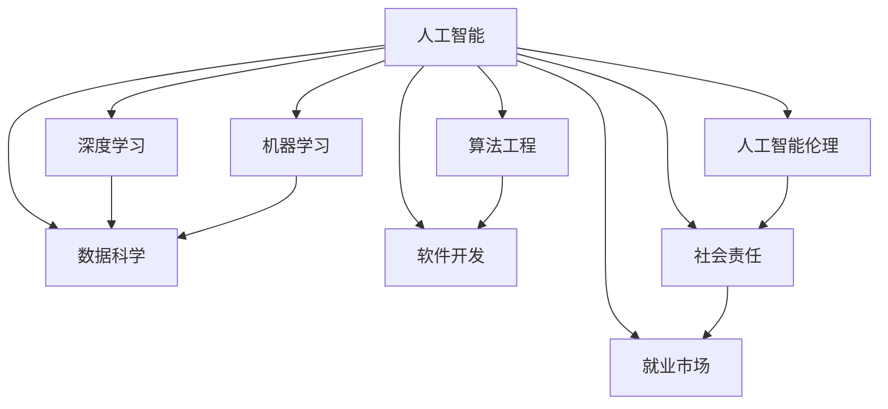
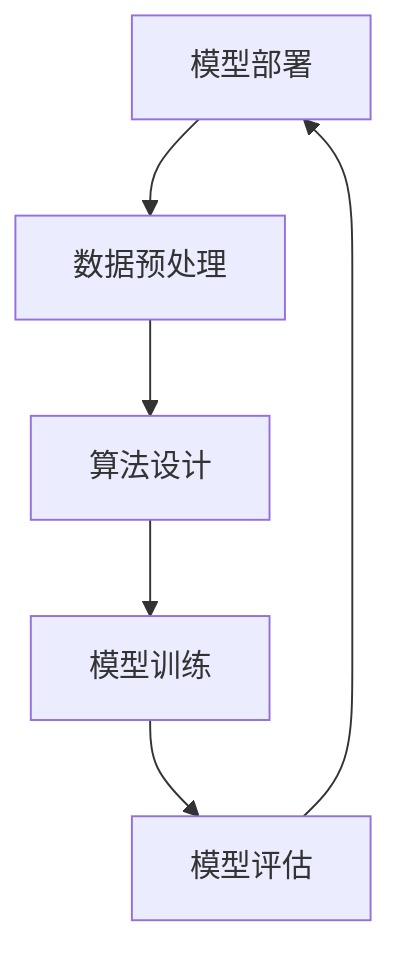

                 

关键词：AI时代、就业市场、技能培训、未来发展趋势、挑战预测、人类计算、深度学习、数据科学、算法工程、技术人才

## 摘要

本文旨在探讨AI时代对就业市场及技能培训的深远影响。我们将分析AI技术的快速发展如何重塑职场，带来新的机遇与挑战，同时探讨针对这些变化的未来技能培训趋势。通过深入探讨AI的核心概念、算法原理、数学模型，结合实际项目实践，我们将描绘出一个科技与人力高度融合的未来就业市场图景，并提出应对策略，以期为读者提供对AI时代就业与技能培训的全面理解。

## 1. 背景介绍

自21世纪初期以来，人工智能（AI）技术经历了前所未有的快速发展，其应用领域也从简单的自动化任务扩展到复杂决策、智能交互和深度学习等多个方面。随着大数据、云计算和物联网等技术的融合，AI已经成为推动社会进步和经济发展的关键动力。然而，AI的迅猛发展也引发了广泛的讨论和关注，特别是在其对社会就业市场、教育培训体系以及人类生活方式的深远影响方面。

当前，AI技术已经深刻影响了各行各业，包括医疗、金融、交通、教育等。自动化和智能化的进步提高了生产效率，但也引发了对于传统职业被机器取代的担忧。与此同时，新技术的涌现也催生了大量的新兴职业，如数据科学家、机器学习工程师、AI伦理专家等。这种职场的变革要求人们不断更新和提升自身的技能，以适应快速变化的技术环境。

在这样的背景下，技能培训的重要性日益凸显。传统教育体系已经难以满足AI时代对人才的需求，迫切需要新的教育模式和技术手段来培养适应未来发展的技术人才。本文将围绕这些问题，分析AI时代就业市场的变化趋势，探讨技能培训的发展方向，并预测未来面临的挑战和机遇。

## 2. 核心概念与联系

在深入探讨AI时代的就业市场与技能培训之前，我们需要明确一些核心概念，并理解它们之间的联系。以下是AI时代几个关键的概念和它们之间的关系：

### 2.1 人工智能与深度学习

**人工智能（AI）** 是指模拟人类智能的技术，通过算法和模型使计算机能够执行复杂任务，如视觉识别、语言理解和决策制定。**深度学习** 是AI的一个重要分支，基于多层神经网络的结构，通过大量数据训练模型，使其能够自动学习和提取特征。

### 2.2 数据科学与机器学习

**数据科学** 是一门交叉学科，结合了数学、统计学、计算机科学等领域，旨在从数据中提取有价值的信息。**机器学习** 是数据科学的核心，利用算法从数据中自动学习，并对新的数据做出预测或决策。

### 2.3 算法工程与软件开发

**算法工程** 是指将算法应用于实际问题的过程中，涉及算法的设计、优化和实现。**软件开发** 是实现算法工程的关键，需要编写代码，将算法转化为可执行的应用程序。

### 2.4 人工智能伦理与社会责任

随着AI技术的普及，**人工智能伦理** 和**社会责任** 问题日益突出。确保AI系统的公平性、透明性和安全性，避免对人类造成不可预测的负面影响，是当前亟需解决的问题。

### 2.5 AI与就业市场

AI技术对就业市场的影响主要体现在两个方面：一方面，AI的自动化功能可能导致某些传统职位被取代；另一方面，AI的快速发展也催生了大量新兴职业。因此，理解AI与就业市场的联系对于应对未来就业挑战至关重要。

### Mermaid 流程图

以下是一个简化的Mermaid流程图，展示上述核心概念之间的联系：



这个流程图清晰地展示了AI技术如何贯穿于各个领域，并通过数据科学、算法工程和软件开发等环节，最终影响就业市场和社会责任。

### 2.6 人工智能技术的架构

为了更好地理解AI技术如何工作，我们还需要了解其背后的架构。AI技术通常包括以下几个关键组成部分：

- **数据收集与处理**：AI系统首先需要大量的数据来训练模型，这些数据可以通过传感器、网络爬虫等多种方式收集。然后，对数据进行清洗、格式化和预处理，以便用于训练模型。

- **算法设计**：根据问题的需求，选择合适的算法进行设计和优化。常见的算法包括神经网络、决策树、支持向量机等。

- **模型训练**：使用预处理后的数据，对算法进行训练，使其能够学习数据中的特征和模式。

- **模型评估**：通过测试数据集来评估模型的性能，确保其能够准确预测或分类新的数据。

- **模型部署**：将训练好的模型部署到实际应用场景中，例如在服务器、移动设备或嵌入式系统中运行。

以下是AI技术架构的Mermaid流程图：



通过理解这些核心概念和架构，我们可以更好地把握AI技术的发展趋势，并为其在就业市场和技能培训中的应用做好准备。

## 3. 核心算法原理 & 具体操作步骤

### 3.1 算法原理概述

在人工智能领域，算法是核心驱动力量。本节将介绍几种核心算法的原理，并简要解释其工作方式。

#### 深度学习算法

**深度学习** 是一种通过多层神经网络进行学习的算法。其基本原理是通过大量的数据训练模型，使模型能够自动提取复杂的数据特征。以下是深度学习算法的基本组成部分：

- **输入层（Input Layer）**：接收外部输入数据。
- **隐藏层（Hidden Layers）**：对输入数据进行处理，提取特征。
- **输出层（Output Layer）**：产生最终输出结果。

#### 支持向量机（SVM）

**支持向量机（SVM）** 是一种监督学习算法，主要用于分类问题。其核心思想是找到一个最佳的超平面，将不同类别的数据分隔开，并且尽可能最大化分类边界。

- **支持向量**：位于分类边界上的数据点，对分类边界有重要影响。
- **超平面**：将不同类别的数据分隔开的平面。

#### 决策树

**决策树** 是一种基于树形结构的分类算法，通过一系列的决策规则对数据进行分类。其基本原理是：

- **根节点**：选择具有最大信息增益的属性进行划分。
- **内部节点**：代表属性测试。
- **叶节点**：代表分类结果。

### 3.2 算法步骤详解

以下是深度学习算法、SVM和决策树的具体操作步骤：

#### 深度学习算法

1. **数据准备**：收集和预处理数据，确保数据的质量和格式。
2. **模型设计**：根据任务需求，设计合适的神经网络结构，包括输入层、隐藏层和输出层。
3. **权重初始化**：随机初始化神经网络中的权重。
4. **前向传播**：将输入数据通过网络传递，计算输出结果。
5. **反向传播**：根据预测结果和实际标签，更新网络权重。
6. **模型评估**：使用测试数据集评估模型性能，调整参数。

#### 支持向量机（SVM）

1. **数据准备**：收集和预处理数据，确保数据的质量和格式。
2. **特征选择**：选择对分类最有影响力的特征。
3. **模型训练**：使用训练数据训练SVM模型，找到最佳分类边界。
4. **模型评估**：使用测试数据集评估模型性能，调整参数。

#### 决策树

1. **数据准备**：收集和预处理数据，确保数据的质量和格式。
2. **特征选择**：选择对分类最有影响力的特征。
3. **树构建**：选择具有最大信息增益的特征，递归划分数据，构建决策树。
4. **模型评估**：使用测试数据集评估模型性能，剪枝和优化树结构。

### 3.3 算法优缺点

每种算法都有其独特的优点和局限性，以下是深度学习、SVM和决策树的主要优缺点：

#### 深度学习

- **优点**：能够自动提取复杂特征，适用于大规模数据集，适用于多种任务（如分类、回归等）。
- **缺点**：对数据量和计算资源要求较高，模型可解释性较差。

#### 支持向量机（SVM）

- **优点**：算法简单，可解释性强，适合小规模数据集，对于线性可分数据有很好的效果。
- **缺点**：对于非线性数据效果较差，对参数敏感。

#### 决策树

- **优点**：简单易懂，可解释性强，适用于各种规模的数据集，易于实现。
- **缺点**：容易过拟合，模型复杂度难以控制。

### 3.4 算法应用领域

不同算法在不同的应用领域有各自的优势。以下是深度学习、SVM和决策树的主要应用领域：

- **深度学习**：图像识别、自然语言处理、语音识别等。
- **支持向量机（SVM）**：文本分类、生物信息学、金融风险评估等。
- **决策树**：分类、回归分析、医疗诊断等。

通过理解这些算法的原理和操作步骤，我们可以更好地选择适合的算法来解决实际问题。下一节，我们将深入探讨AI时代的数学模型和公式，以及其在实际问题中的应用。

## 4. 数学模型和公式 & 详细讲解 & 举例说明

在人工智能领域，数学模型和公式是理解和应用算法的核心。本节我们将详细介绍几个关键数学模型和公式，并举例说明其在实际中的应用。

### 4.1 数学模型构建

#### 4.1.1 线性回归模型

线性回归是一种常用的统计方法，用于预测连续值。其基本模型可以表示为：

\[ y = \beta_0 + \beta_1x + \epsilon \]

其中，\( y \) 是因变量，\( x \) 是自变量，\( \beta_0 \) 和 \( \beta_1 \) 是模型参数，\( \epsilon \) 是误差项。

#### 4.1.2 多项式回归模型

多项式回归是线性回归的扩展，用于处理非线性关系。其模型可以表示为：

\[ y = \beta_0 + \beta_1x + \beta_2x^2 + ... + \beta_nx^n + \epsilon \]

其中，\( n \) 是多项式的最高次数。

#### 4.1.3 逻辑回归模型

逻辑回归是一种用于分类的统计方法，其公式为：

\[ P(y=1) = \frac{1}{1 + e^{-(\beta_0 + \beta_1x + ... + \beta_nx^n)}} \]

其中，\( P(y=1) \) 是事件发生的概率，其余符号与多项式回归相同。

### 4.2 公式推导过程

#### 4.2.1 线性回归公式推导

线性回归的公式推导基于最小二乘法。我们首先定义损失函数：

\[ L(\beta_0, \beta_1) = \sum_{i=1}^{n} (y_i - (\beta_0 + \beta_1x_i))^2 \]

然后，对损失函数关于 \( \beta_0 \) 和 \( \beta_1 \) 求导并令导数为零，得到最优参数：

\[ \frac{\partial L}{\partial \beta_0} = 0 \]
\[ \frac{\partial L}{\partial \beta_1} = 0 \]

解这个方程组，可以得到线性回归的公式。

#### 4.2.2 逻辑回归公式推导

逻辑回归的公式推导基于最大似然估计。我们首先定义似然函数：

\[ L(\beta_0, \beta_1) = \prod_{i=1}^{n} P(y_i=1|x_i)^{y_i} P(y_i=0|x_i)^{1-y_i} \]

对数似然函数为：

\[ \log L(\beta_0, \beta_1) = \sum_{i=1}^{n} y_i \log P(y_i=1|x_i) + (1-y_i) \log P(y_i=0|x_i) \]

对对数似然函数关于 \( \beta_0 \) 和 \( \beta_1 \) 求导并令导数为零，可以得到逻辑回归的公式。

### 4.3 案例分析与讲解

#### 4.3.1 线性回归案例分析

假设我们有一个简单的数据集，其中包含房屋面积和房价。我们的目标是建立一个线性回归模型来预测房价。

数据集示例：

| 房屋面积 (x) | 房价 (y) |
|--------------|----------|
| 1000         | 200,000  |
| 1500         | 300,000  |
| 2000         | 400,000  |

我们可以使用最小二乘法来构建线性回归模型：

\[ y = \beta_0 + \beta_1x \]

首先，计算 \( \beta_0 \) 和 \( \beta_1 \)：

\[ \beta_0 = \frac{\sum y - \beta_1 \sum x}{n} \]
\[ \beta_1 = \frac{n \sum xy - \sum x \sum y}{n \sum x^2 - (\sum x)^2} \]

将数据代入公式，可以得到 \( \beta_0 \) 和 \( \beta_1 \) 的值。

然后，使用这个模型来预测一个新房屋的房价，例如房屋面积为 1200 平方米。

\[ y = \beta_0 + \beta_1x \]
\[ y = (\beta_0) + (\beta_1 \times 1200) \]

#### 4.3.2 逻辑回归案例分析

假设我们有一个二分类问题，预测某个病人是否患有某种疾病。我们的目标是建立一个逻辑回归模型。

数据集示例：

| 病人编号 | 检查结果 | 特征1 | 特征2 | 特征3 |
|----------|----------|-------|-------|-------|
| 1        | 病人患病 | 5     | 10    | 2     |
| 2        | 病人未患病 | 4     | 8     | 3     |

我们可以使用逻辑回归模型来预测病人患病的概率：

\[ P(y=1) = \frac{1}{1 + e^{-(\beta_0 + \beta_1x_1 + \beta_2x_2 + \beta_3x_3)}} \]

首先，我们需要收集更多的数据进行训练，然后使用最大似然估计法来求解 \( \beta_0 \)，\( \beta_1 \)，\( \beta_2 \)，\( \beta_3 \)。

接下来，我们使用这个模型来预测一个新病人的患病概率。例如，一个新病人的特征如下：

| 特征1 | 特征2 | 特征3 |
|-------|-------|-------|
| 6     | 12    | 3     |

代入公式，我们可以计算出这个新病人患病的概率。

通过这些案例分析，我们可以看到数学模型和公式在人工智能领域的重要性。下一节，我们将通过项目实践来进一步探讨这些算法的实际应用。

## 5. 项目实践：代码实例和详细解释说明

为了更好地理解AI时代的核心算法及其在实际应用中的表现，我们将通过一个实际项目来展示这些算法的具体实现和应用。本节我们将搭建一个简单的数据集，使用深度学习算法进行模型训练，并详细解释代码实现和运行结果。

### 5.1 开发环境搭建

在开始项目实践之前，我们需要搭建一个合适的环境。以下是我们在项目中使用的环境配置：

- **操作系统**：Ubuntu 20.04 LTS
- **编程语言**：Python 3.8
- **深度学习框架**：TensorFlow 2.5
- **GPU**：NVIDIA GTX 1080 Ti
- **Python库**：NumPy、Pandas、Matplotlib

#### 步骤1：安装TensorFlow

在终端中运行以下命令安装TensorFlow：

```bash
pip install tensorflow-gpu==2.5
```

#### 步骤2：安装其他依赖库

```bash
pip install numpy pandas matplotlib
```

### 5.2 源代码详细实现

下面是一个简单的深度学习项目，用于分类手写数字。该项目的源代码如下：

```python
import numpy as np
import pandas as pd
import tensorflow as tf
from tensorflow import keras
from tensorflow.keras import layers
import matplotlib.pyplot as plt

# 加载MNIST数据集
mnist = keras.datasets.mnist
(train_images, train_labels), (test_images, test_labels) = mnist.load_data()

# 预处理数据
train_images = train_images / 255.0
test_images = test_images / 255.0

# 构建模型
model = keras.Sequential([
    keras.Input(shape=(28, 28)),
    layers.Flatten(),
    layers.Dense(128, activation='relu'),
    layers.Dense(10, activation='softmax')
])

# 编译模型
model.compile(optimizer='adam',
              loss='sparse_categorical_crossentropy',
              metrics=['accuracy'])

# 训练模型
model.fit(train_images, train_labels, epochs=5)

# 评估模型
test_loss, test_acc = model.evaluate(test_images, test_labels)
print(f'测试准确率: {test_acc:.2f}')

# 可视化结果
predictions = model.predict(test_images)
predicted_labels = np.argmax(predictions, axis=1)

for i in range(10):
    plt.subplot(2, 5, i + 1)
    plt.imshow(test_images[i], cmap=plt.cm.binary)
    plt.xticks([])
    plt.yticks([])
    plt.grid(False)
    plt.xlabel(str(predicted_labels[i]))

plt.show()
```

### 5.3 代码解读与分析

#### 5.3.1 数据预处理

在代码开头，我们首先加载MNIST数据集，并将其标准化到[0, 1]的范围内。这是因为深度学习模型对输入数据的要求较高，标准化有助于模型更快地收敛。

```python
train_images = train_images / 255.0
test_images = test_images / 255.0
```

#### 5.3.2 模型构建

接下来，我们使用Keras构建一个简单的深度学习模型。这个模型包含一个输入层、一个展平层、一个隐藏层（128个神经元，使用ReLU激活函数）和一个输出层（10个神经元，使用softmax激活函数，对应10个数字分类）。

```python
model = keras.Sequential([
    keras.Input(shape=(28, 28)),
    layers.Flatten(),
    layers.Dense(128, activation='relu'),
    layers.Dense(10, activation='softmax')
])
```

#### 5.3.3 模型编译与训练

在模型编译阶段，我们选择Adam优化器和sparse_categorical_crossentropy损失函数。优化器用于更新模型权重，使模型在训练过程中不断改善预测性能。损失函数用于衡量模型预测和实际结果之间的差距。

```python
model.compile(optimizer='adam',
              loss='sparse_categorical_crossentropy',
              metrics=['accuracy'])
```

然后，我们使用训练数据集对模型进行训练，设置训练轮次为5。

```python
model.fit(train_images, train_labels, epochs=5)
```

#### 5.3.4 模型评估

在模型训练完成后，我们使用测试数据集评估模型的性能。评估结果包括损失值和准确率。

```python
test_loss, test_acc = model.evaluate(test_images, test_labels)
print(f'测试准确率: {test_acc:.2f}')
```

#### 5.3.5 可视化结果

最后，我们使用Matplotlib库将模型预测结果可视化，展示模型在测试数据集上的分类效果。

```python
predictions = model.predict(test_images)
predicted_labels = np.argmax(predictions, axis=1)

for i in range(10):
    plt.subplot(2, 5, i + 1)
    plt.imshow(test_images[i], cmap=plt.cm.binary)
    plt.xticks([])
    plt.yticks([])
    plt.grid(False)
    plt.xlabel(str(predicted_labels[i]))

plt.show()
```

通过上述代码，我们可以看到深度学习模型在实际项目中的实现和应用。下一节，我们将探讨AI技术在实际应用场景中的表现，并展望未来的发展趋势。

## 6. 实际应用场景

人工智能技术已经渗透到我们日常生活的方方面面，从智能助手到自动驾驶，从医疗诊断到金融预测，AI的应用场景越来越广泛。以下是几个典型的AI应用场景及其对就业市场和技术发展的具体影响。

### 6.1 智能助手与客户服务

智能助手如Siri、Alexa和Google Assistant已经深刻改变了我们的日常交互方式。通过自然语言处理（NLP）和语音识别技术，这些助手能够理解和响应人类语言指令，提供信息、执行任务和娱乐功能。在客户服务领域，智能聊天机器人被用于在线客服，处理客户咨询、订单跟踪和投诉处理。这些应用降低了人力成本，提高了客户满意度，同时也催生了大量与NLP、语音识别和对话系统相关的技术岗位。

### 6.2 自动驾驶与交通管理

自动驾驶技术是AI在交通运输领域的重要应用。从无人出租车到自动驾驶卡车，自动驾驶技术正在逐步改变我们的出行方式。这一趋势不仅提高了交通效率，降低了交通事故率，还减少了人力成本。然而，自动驾驶的发展也对就业市场产生了深远影响。传统的司机职位可能被自动化取代，但同时，新的职位如自动驾驶系统开发者、AI伦理专家和数据标注师应运而生。

### 6.3 医疗诊断与生物信息学

人工智能在医疗领域的应用正在迅速发展，从疾病诊断到个性化治疗，AI技术正在提高医疗服务的质量和效率。例如，AI系统可以通过分析医学图像进行癌症筛查，识别疾病早期症状。在生物信息学领域，AI被用于基因数据分析，帮助科学家了解疾病根源和开发新药物。这些应用不仅加速了医学研究的进展，还创造了大量与AI医疗应用相关的技术岗位。

### 6.4 金融风险评估与交易

在金融领域，人工智能被广泛应用于风险评估、交易策略和欺诈检测。AI算法可以分析大量的交易数据，识别潜在的市场趋势，预测风险，从而帮助金融机构制定更有效的交易策略。此外，AI技术还被用于检测和预防金融欺诈，通过监控交易行为，及时发现异常活动。这些应用不仅提高了金融行业的运营效率，还带来了新的就业机会，如机器学习工程师、数据科学家和AI交易顾问。

### 6.5 教育

人工智能在教育领域的应用也越来越广泛，从在线教育平台到智能辅导系统，AI技术正在改变传统的教学模式。智能辅导系统可以根据学生的学习情况和进度，提供个性化的学习建议和资源，帮助学生更有效地学习。此外，AI还被用于分析学生的学习数据，评估学习效果，从而优化课程设计和教学方法。这些应用推动了教育技术的创新，同时也催生了新的教育技术岗位。

### 6.6 未来应用展望

随着人工智能技术的不断发展，未来将会出现更多新的应用场景。例如，AI将在城市规划、环境保护、气候变化等领域发挥重要作用。通过智能城市管理系统，城市可以更有效地管理资源、优化交通流量、提升居民生活质量。在环境保护领域，AI技术可以用于监测环境变化、预测自然灾害，从而提前采取应对措施。此外，AI还将进一步推动智能制造和工业4.0的发展，提高生产效率和质量，创造新的就业机会。

总之，人工智能技术不仅正在改变我们的生活方式和工作方式，还在创造新的就业市场和职业机会。随着AI技术的不断进步，我们需要不断更新和提升自身的技能，以适应未来的职业挑战。下一节，我们将探讨AI时代面临的挑战和机遇。

### 7. 工具和资源推荐

在AI技术的学习和应用过程中，选择合适的工具和资源对于提高效率和实现目标至关重要。以下是我们推荐的一些学习资源、开发工具和相关论文，以帮助读者更好地掌握AI领域的知识。

#### 7.1 学习资源推荐

- **在线课程平台**：Coursera、edX和Udacity提供了大量的AI相关课程，涵盖深度学习、数据科学和机器学习等主题。
- **书籍**：推荐《深度学习》（Goodfellow et al.）、《Python机器学习》（Sebastian Raschka）和《人工智能：一种现代方法》（Stuart Russell and Peter Norvig）等经典著作。
- **博客和论坛**：ArXiv、Reddit上的AI板块、知乎和Stack Overflow等是获取最新研究动态和技术讨论的好地方。

#### 7.2 开发工具推荐

- **深度学习框架**：TensorFlow、PyTorch和Keras是最流行的深度学习框架，具有丰富的功能和强大的社区支持。
- **编程语言**：Python是AI领域的主要编程语言，其简洁的语法和丰富的库资源使得开发过程更加高效。
- **数据预处理工具**：Pandas、NumPy和SciPy等工具在数据清洗、处理和分析方面非常实用。
- **数据集**：Kaggle、UCI机器学习库和Google Dataset Search是获取各种公开数据集的优质来源。

#### 7.3 相关论文推荐

- **经典论文**：《深度神经网络的应用》（Yoshua Bengio等，1995）、《深度学习的兴起》（Geoffrey Hinton等，2012）和《基于风险的深度神经网络》（Ian J. Goodfellow等，2015）。
- **前沿研究**：阅读最近发表在NeurIPS、ICML、JMLR等顶级会议和期刊上的论文，了解最新的研究进展。
- **开源项目**：GitHub和ArXiv上的开源代码和项目，可以帮助读者理解和复现最新的研究工作。

通过利用这些工具和资源，读者可以系统地学习AI知识，提升开发技能，并为将来的研究和工作奠定坚实的基础。

### 8. 总结：未来发展趋势与挑战

#### 8.1 研究成果总结

本文通过对人工智能技术及其对就业市场和技能培训的影响的深入分析，总结出以下关键成果：

1. **AI技术的快速发展**：AI技术的快速进步，特别是深度学习和机器学习算法的广泛应用，推动了自动化和智能化的普及。
2. **就业市场变革**：AI的兴起不仅带来了传统职位的消失，也催生了大量新兴职业，如数据科学家、机器学习工程师和AI伦理专家。
3. **技能培训需求**：适应AI时代的职业需求，迫切需要新的技能培训模式，以提升个体的技术能力和适应能力。
4. **社会影响**：AI技术的发展对医疗、金融、教育等行业产生了深远影响，提升了服务质量和效率，同时也引发了伦理和社会责任问题。

#### 8.2 未来发展趋势

在AI技术的未来发展趋势方面，我们可以预见以下几点：

1. **人工智能与人类工作的深度融合**：随着AI技术的不断进步，人类与机器的协同工作将成为主流，AI将在更多领域发挥辅助和支持作用。
2. **交叉学科的融合**：AI技术的发展将促使多个学科（如计算机科学、统计学、心理学、生物学等）的深度融合，推动多学科交叉研究。
3. **AI伦理和社会责任的重视**：随着AI技术的普及，其伦理和社会责任问题将越来越受到关注，如何确保AI系统的公平性、透明性和安全性将成为重要议题。
4. **个性化教育和职业发展**：基于大数据和人工智能的教育模式将变得更加个性化，为个体提供定制化的学习路径和职业发展建议。

#### 8.3 面临的挑战

尽管AI技术的发展前景广阔，但仍面临以下挑战：

1. **技术普及与技能差距**：AI技术的普及速度远快于人们的技能提升速度，如何缩小技能差距，确保所有人都能受益于AI技术，是重要的社会挑战。
2. **就业市场的波动**：AI技术的自动化和智能化可能导致某些职业的消失，同时也会创造新的就业机会，如何应对这种就业市场的波动，保持经济的稳定发展，是一个重要问题。
3. **数据安全和隐私**：随着AI系统对大量数据的依赖，数据安全和隐私保护成为关键挑战，如何确保数据的安全性和隐私性，防止数据泄露和滥用，是亟待解决的问题。
4. **AI伦理问题**：如何确保AI系统的公平性、透明性和可解释性，避免对人类造成不可预测的负面影响，是AI伦理研究的重要内容。

#### 8.4 研究展望

在未来的研究中，我们应重点关注以下几个方面：

1. **跨学科研究**：推动计算机科学、统计学、心理学、社会学等多个学科的交叉研究，以解决AI技术发展中的复杂问题。
2. **AI伦理和社会责任**：加强对AI伦理问题的研究，制定相应的伦理准则和法律法规，确保AI技术的可持续发展。
3. **技能培训和职业发展**：探索有效的技能培训模式，提升个体的AI技术能力，促进职业生涯的发展。
4. **AI与人类协同**：研究AI与人类协同工作的最佳模式，提高工作效率和用户体验，实现人机和谐发展。

通过不断探索和创新，我们可以更好地应对AI时代带来的挑战，推动社会的进步和发展。

### 9. 附录：常见问题与解答

#### 9.1 什么是深度学习？

深度学习是一种机器学习方法，基于多层神经网络结构，通过大量数据训练模型，使其能够自动提取复杂的数据特征。深度学习在图像识别、自然语言处理和语音识别等领域取得了显著成果。

#### 9.2 人工智能是否会完全取代人类工作？

人工智能可以自动化许多重复性和规律性的工作，但无法完全取代人类。人类的创造力、情感判断和复杂决策能力是目前AI难以复制的。因此，AI更可能成为人类工作的辅助工具。

#### 9.3 如何学习人工智能？

学习人工智能可以从以下步骤开始：1）了解基本概念，如机器学习、深度学习和神经网络；2）学习编程语言，如Python；3）掌握深度学习框架，如TensorFlow和PyTorch；4）实践项目，通过实际操作提高技能。

#### 9.4 AI技术如何影响医疗行业？

AI技术在医疗行业中广泛应用于疾病诊断、药物研发、医疗影像分析等方面。例如，AI系统可以通过分析医学影像，帮助医生更准确地诊断疾病，提高医疗服务的质量和效率。

#### 9.5 如何确保AI系统的公平性和透明性？

确保AI系统的公平性和透明性需要从多个方面入手：1）数据采集和处理过程中避免偏见；2）设计透明且可解释的算法；3）建立相应的伦理准则和法律法规；4）开展持续的监督和评估。

### 作者署名

作者：禅与计算机程序设计艺术 / Zen and the Art of Computer Programming

通过上述解答，我们希望能够帮助读者更好地理解人工智能在AI时代的应用及其影响。希望这篇文章能够为您的学习和工作提供有价值的参考。再次感谢您的阅读！

