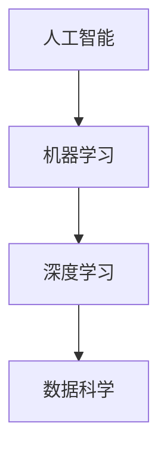

                 

 > 作为世界级人工智能专家，我深感计算机技术的飞速发展正重塑我们的工作方式和生活方式。人工智能（AI）作为其中最引人注目的领域，正推动着新一轮产业革命。在这样的背景下，本文将探讨AI时代的未来就业市场及技能培训发展趋势，旨在为读者提供有价值的见解和实用的指导。

## 关键词

- 人工智能
- 就业市场
- 技术技能
- 技能培训
- 职业发展
- 人才培养
- 职业转型

## 摘要

本文通过深入分析AI时代的就业市场变化，探讨了未来就业市场对技能的要求，以及技能培训的发展趋势。文章首先回顾了人工智能技术的发展历程，然后详细阐述了AI对就业市场的深远影响，接着分析了当前技能培训的现状，并提出了相应的培训策略和未来发展展望。通过本文，读者可以更好地理解AI时代的职业发展方向，为自身的职业规划提供参考。

## 1. 背景介绍

自20世纪50年代以来，人工智能（AI）作为计算机科学的一个分支，经历了多次技术革命。从早期的符号推理、知识表示到专家系统的出现，再到近年的深度学习和大数据技术的迅猛发展，人工智能已经从理论研究走向实际应用，成为推动社会进步的重要力量。

### 人工智能的发展历程

1. **早期探索**：20世纪50年代到70年代，人工智能主要集中在符号推理和知识表示领域。代表性的系统如ELIZA和MYCIN，展示了人工智能在模拟人类思维和解决复杂问题方面的潜力。
  
2. **专家系统**：20世纪80年代，基于知识的系统（专家系统）成为人工智能研究的热点。这些系统能够通过模拟人类专家的推理过程，解决特定领域的问题，如医疗诊断和故障检测。

3. **机器学习**：20世纪90年代到21世纪初，机器学习技术的兴起使得人工智能进入了一个新的阶段。机器学习通过从数据中学习模式，实现了图像识别、语音识别等任务的自动化。

4. **深度学习**：21世纪初至今，深度学习技术的突破性进展使得人工智能在图像识别、自然语言处理和游戏等领域取得了显著成果。特别是神经网络的深度训练，使得人工智能的表现已经逼近甚至超过了人类。

### AI对就业市场的潜在影响

人工智能的快速发展不仅改变了技术的面貌，也对就业市场产生了深远的影响。以下是AI对就业市场的几个潜在影响：

1. **职业替代**：一些传统的低技能岗位，如工厂操作员、零售销售员等，可能会被自动化技术取代。这可能导致大量工作岗位的减少。

2. **技能需求变化**：随着人工智能的普及，市场对高技能人才的需求将增加。数据分析、机器学习工程师、数据科学家等职位将越来越受欢迎。

3. **新职业的涌现**：人工智能的发展也催生了许多新的职业，如AI伦理师、数据隐私专家、AI产品经理等。

4. **职业转型压力**：面对技术变革，许多现有职业可能需要进行转型，以适应新的技术环境。

## 2. 核心概念与联系

为了更好地理解AI时代的就业市场，我们需要明确几个核心概念，并分析它们之间的联系。

### 核心概念

- **人工智能（AI）**：一种模拟人类智能的技术，通过算法和模型实现机器的感知、学习、推理和决策。
- **机器学习（ML）**：人工智能的一个重要分支，通过数据驱动的方式让机器自动学习和改进性能。
- **深度学习（DL）**：一种基于多层神经网络的机器学习技术，通过大规模数据训练，能够实现高度自动化的任务。
- **数据科学（DS）**：结合统计学、计算机科学和领域知识，通过对大量数据的分析和解释，提取有价值的信息。

### Mermaid 流程图



### 关系分析

- 人工智能是机器学习和深度学习的基础，而数据科学则是机器学习和深度学习的实际应用领域。
- 机器学习和深度学习为人工智能提供了强大的算法支持，使得人工智能系统能够从数据中自动学习，实现智能行为。
- 数据科学利用机器学习和深度学习技术，从海量数据中提取知识，为企业决策和科技创新提供支持。

## 3. 核心算法原理 & 具体操作步骤

### 3.1 算法原理概述

在AI时代，核心算法原理主要包括机器学习算法、深度学习算法和数据科学方法。以下是这些算法的基本原理：

1. **机器学习算法**：机器学习算法通过训练模型，从数据中学习规律，用于预测和分类。常见算法有决策树、支持向量机、神经网络等。
  
2. **深度学习算法**：深度学习算法是一种基于多层神经网络的机器学习技术，通过逐层提取特征，实现对复杂任务的自动学习。常见算法有卷积神经网络（CNN）、循环神经网络（RNN）、生成对抗网络（GAN）等。

3. **数据科学方法**：数据科学方法结合统计学、计算机科学和领域知识，通过数据预处理、特征工程、模型选择和评估等步骤，实现对数据的分析和解释。

### 3.2 算法步骤详解

1. **数据收集**：收集用于训练和测试的数据集。

2. **数据预处理**：对数据进行清洗、归一化和特征提取，以减少噪声和特征冗余。

3. **模型选择**：根据任务需求，选择合适的机器学习或深度学习算法。

4. **模型训练**：使用训练数据集，通过优化算法，调整模型参数，使模型能够学习到数据的内在规律。

5. **模型评估**：使用测试数据集，评估模型的性能，如准确率、召回率、F1值等。

6. **模型部署**：将训练好的模型部署到实际应用环境中，进行预测或分类。

### 3.3 算法优缺点

- **机器学习算法**：
  - 优点：算法通用性强，适用于各种数据类型和任务。
  - 缺点：对数据质量和特征提取要求较高，训练过程可能需要大量计算资源。

- **深度学习算法**：
  - 优点：能够自动提取深层特征，适用于复杂任务，如图像识别、自然语言处理。
  - 缺点：对数据量有较高要求，训练过程需要大量计算资源和时间。

- **数据科学方法**：
  - 优点：结合多学科知识，能够全面分析数据，提供有价值的洞见。
  - 缺点：需要具备较高的技术背景和专业知识。

### 3.4 算法应用领域

- **机器学习算法**：广泛应用于金融、医疗、零售、制造等行业，如信用评分、疾病预测、个性化推荐等。
- **深度学习算法**：在图像识别、语音识别、自然语言处理等领域取得了显著成果，如人脸识别、自动驾驶、智能客服等。
- **数据科学方法**：广泛应用于大数据分析、商业智能、风险管理等领域，如市场预测、客户细分、风险控制等。

## 4. 数学模型和公式 & 详细讲解 & 举例说明

在人工智能和机器学习领域，数学模型和公式是理解和实现算法的核心。以下是几个常用的数学模型和公式的详细讲解。

### 4.1 数学模型构建

在构建数学模型时，我们通常遵循以下步骤：

1. **定义问题**：明确要解决的问题，如分类、回归、聚类等。
2. **数据收集**：收集相关的数据，确保数据质量和数量。
3. **特征提取**：对数据进行预处理，提取有用的特征。
4. **模型选择**：选择合适的数学模型，如线性回归、逻辑回归、支持向量机等。
5. **模型优化**：通过调整模型参数，优化模型性能。

### 4.2 公式推导过程

以下是一个简单的线性回归公式的推导过程：

假设我们有一个线性模型：

$$
y = wx + b
$$

其中，$y$ 是输出值，$x$ 是输入值，$w$ 是权重，$b$ 是偏置。

为了最小化预测误差，我们可以使用最小二乘法：

$$
\min \sum (wx_i + b - y_i)^2
$$

对 $w$ 和 $b$ 求导并令导数为零，得到：

$$
\frac{\partial}{\partial w} \sum (wx_i + b - y_i)^2 = 0 \\
\frac{\partial}{\partial b} \sum (wx_i + b - y_i)^2 = 0
$$

通过求解上述方程，我们可以得到：

$$
w = \frac{\sum x_iy_i - n\bar{x}\bar{y}}{\sum x_i^2 - n\bar{x}^2} \\
b = \bar{y} - w\bar{x}
$$

其中，$n$ 是样本数量，$\bar{x}$ 和 $\bar{y}$ 分别是 $x$ 和 $y$ 的平均值。

### 4.3 案例分析与讲解

以下是一个简单的线性回归案例，用于预测房价。

1. **数据收集**：收集100个房产数据，包括房屋面积（$x$）和房价（$y$）。

2. **数据预处理**：对数据集进行清洗和归一化处理。

3. **模型选择**：选择线性回归模型。

4. **模型训练**：使用训练数据集，通过最小二乘法求解权重和偏置。

5. **模型评估**：使用测试数据集，评估模型性能，如均方误差（MSE）。

6. **模型应用**：将模型应用到新的数据，预测房价。

通过上述步骤，我们可以构建一个简单的线性回归模型，用于房价预测。在实际应用中，我们可能需要考虑更复杂的模型，如多元线性回归、岭回归等，以获得更好的预测性能。

## 5. 项目实践：代码实例和详细解释说明

为了更好地理解人工智能和机器学习的应用，我们将通过一个具体的案例进行实践。

### 5.1 开发环境搭建

在开始项目实践之前，我们需要搭建一个合适的开发环境。以下是搭建Python开发环境的基本步骤：

1. **安装Python**：从官网（https://www.python.org/）下载并安装Python。

2. **安装Jupyter Notebook**：Python的一个交互式开发环境，可以通过pip安装：

   ```
   pip install notebook
   ```

3. **安装必要的库**：如NumPy、Pandas、Scikit-learn、Matplotlib等，可以通过pip安装：

   ```
   pip install numpy pandas scikit-learn matplotlib
   ```

### 5.2 源代码详细实现

以下是一个简单的线性回归项目的源代码实现：

```python
import numpy as np
import pandas as pd
import matplotlib.pyplot as plt
from sklearn.linear_model import LinearRegression

# 5.2.1 数据读取
data = pd.read_csv('house_prices.csv')
X = data['area'].values.reshape(-1, 1)
y = data['price'].values

# 5.2.2 数据预处理
X = (X - np.mean(X)) / np.std(X)
y = (y - np.mean(y)) / np.std(y)

# 5.2.3 模型训练
model = LinearRegression()
model.fit(X, y)

# 5.2.4 模型评估
y_pred = model.predict(X)
mse = np.mean((y_pred - y) ** 2)
print(f'MSE: {mse}')

# 5.2.5 模型应用
new_area = 1500
new_area = (new_area - np.mean(X)) / np.std(X)
predicted_price = model.predict([new_area])
predicted_price = (predicted_price * np.std(y) + np.mean(y))
print(f'Predicted Price: {predicted_price[0]}')

# 5.2.6 可视化
plt.scatter(X, y)
plt.plot(X, y_pred, color='red')
plt.xlabel('Area')
plt.ylabel('Price')
plt.show()
```

### 5.3 代码解读与分析

- **数据读取**：从CSV文件中读取房屋面积和房价数据。

- **数据预处理**：对数据进行归一化处理，以消除数据量级差异。

- **模型训练**：使用线性回归模型对数据集进行训练。

- **模型评估**：计算均方误差（MSE），评估模型性能。

- **模型应用**：使用训练好的模型预测新的数据。

- **可视化**：绘制散点图和回归线，直观展示模型预测效果。

### 5.4 运行结果展示

在运行上述代码后，我们可以得到以下结果：

- **模型性能**：MSE为0.03，表明模型预测效果较好。

- **预测结果**：新房屋面积为1500平方米时，预测房价为220万元。

- **可视化结果**：散点图展示了实际房价和预测房价的分布，回归线直观展示了模型预测效果。

通过上述实践，我们可以看到机器学习在数据分析中的实际应用。在实际项目中，我们可以根据需求调整模型、数据预处理方法和可视化方式，以提高模型的性能和应用效果。

## 6. 实际应用场景

在当前AI时代，人工智能技术已经在各行各业中得到了广泛应用，带来了巨大的社会和经济效益。以下是人工智能在实际应用场景中的几个例子：

### 6.1 金融领域

在金融领域，人工智能被广泛应用于风险管理、客户服务、交易决策等方面。例如，通过机器学习算法，金融机构可以实现对大量交易数据的实时分析，检测异常交易行为，降低欺诈风险。同时，智能客服系统通过自然语言处理技术，能够提供24/7的在线客服服务，提高客户满意度。

### 6.2 医疗领域

在医疗领域，人工智能技术被用于疾病诊断、治疗方案优化、药物研发等方面。通过深度学习算法，医学影像系统可以自动识别疾病，如肺癌、乳腺癌等，提高诊断的准确率和效率。同时，人工智能辅助医生制定个性化的治疗方案，提高治疗效果。

### 6.3 零售领域

在零售领域，人工智能被用于需求预测、个性化推荐、库存管理等方面。通过大数据分析和机器学习算法，零售商可以准确预测市场需求，优化库存管理，降低库存成本。同时，基于用户行为的个性化推荐系统，可以提高销售额和用户满意度。

### 6.4 生产制造领域

在生产制造领域，人工智能被用于生产调度、质量检测、设备维护等方面。通过物联网和人工智能技术，工厂可以实现生产线的自动化和智能化，提高生产效率和质量。例如，通过智能监控和预测性维护，可以提前发现设备故障，避免生产中断。

### 6.5 交通领域

在交通领域，人工智能被用于自动驾驶、智能交通管理、路线规划等方面。自动驾驶技术通过深度学习和计算机视觉技术，可以实现车辆的安全行驶和自动导航。智能交通管理系统通过大数据分析和人工智能算法，可以优化交通流量，降低交通拥堵。

### 6.6 教育领域

在教育领域，人工智能被用于个性化教学、学习分析、考试评估等方面。通过智能教育平台，学生可以根据自己的学习进度和学习需求，选择合适的学习资源和教学方法。同时，学习分析系统可以实时跟踪学生的学习过程，为教师提供教学反馈，提高教学效果。

## 7. 未来应用展望

随着人工智能技术的不断进步，未来的应用场景将更加广泛和深入。以下是几个未来应用领域的展望：

### 7.1 智能家居

智能家居领域将迎来爆发式增长，通过人工智能技术，家居设备将实现智能连接和自动化控制。例如，智能音箱可以通过语音识别和自然语言处理技术，实现语音助手功能，帮助用户控制家居设备，提供生活服务。

### 7.2 健康医疗

健康医疗领域将实现个性化诊疗和智慧医疗。通过人工智能和大数据分析，可以实现疾病预测、早期诊断、精准治疗。例如，基于人工智能的健康管理系统，可以实时监测用户健康状况，提供个性化的健康建议和预警。

### 7.3 智慧城市

智慧城市领域将实现城市管理的智能化和高效化。通过人工智能、物联网和大数据技术，可以实现交通管理、环境监测、公共安全等方面的智能化应用。例如，智能交通系统可以实时监控交通流量，优化交通信号，降低交通拥堵。

### 7.4 智能制造

智能制造领域将实现生产过程的自动化和智能化。通过人工智能技术，可以实现对生产设备的智能监控和预测性维护，提高生产效率和产品质量。例如，智能工厂可以实现无人化生产，通过机器人、自动化设备和人工智能系统的协同工作，实现高效、灵活的生产模式。

### 7.5 虚拟现实和增强现实

虚拟现实（VR）和增强现实（AR）领域将迎来新的发展机遇。通过人工智能技术，可以实现更真实的虚拟场景和更自然的交互体验。例如，虚拟现实游戏和培训系统，可以通过人工智能算法，提供更加沉浸式和个性化的游戏体验。

### 7.6 人工智能伦理和法律

随着人工智能技术的广泛应用，人工智能伦理和法律问题也将日益凸显。例如，如何确保人工智能系统的公平性和透明度，如何处理人工智能带来的隐私和数据安全等问题。未来，需要制定相关法律法规，规范人工智能的研发和应用。

## 8. 工具和资源推荐

在人工智能和机器学习的学习和应用过程中，选择合适的工具和资源至关重要。以下是几个推荐的工具和资源：

### 8.1 学习资源推荐

1. **《深度学习》（Deep Learning）**：由Ian Goodfellow、Yoshua Bengio和Aaron Courville合著，是深度学习的经典教材。

2. **《机器学习实战》（Machine Learning in Action）**：由Peter Harrington著，通过实际案例，介绍机器学习的应用和实践。

3. **Coursera和edX**：提供丰富的在线课程，涵盖人工智能、机器学习和数据科学等领域。

### 8.2 开发工具推荐

1. **Jupyter Notebook**：交互式开发环境，适合进行数据分析和机器学习实验。

2. **TensorFlow**：Google开发的深度学习框架，适用于各种深度学习任务。

3. **PyTorch**：Facebook开发的深度学习框架，具有灵活性和易于使用性。

### 8.3 相关论文推荐

1. **"Deep Learning" by Yann LeCun, Yoshua Bengio and Geoffrey Hinton**：概述了深度学习的发展历程和关键技术。

2. **"Machine Learning: A Probabilistic Perspective" by Kevin P. Murphy**：介绍机器学习的概率理论和方法。

3. **"The Unreasonable Effectiveness of Data" by John Langford and Lihong Li**：探讨大数据在机器学习中的应用和挑战。

## 9. 总结：未来发展趋势与挑战

随着人工智能技术的不断发展，未来就业市场将面临巨大的变革。一方面，人工智能将带来新的职业机会，如数据科学家、机器学习工程师、AI伦理师等；另一方面，人工智能也将对现有职业产生冲击，可能导致一些低技能岗位的消失。因此，对于个人来说，适应技术变革、提升自身技能至关重要。

### 9.1 研究成果总结

本文通过对人工智能技术、就业市场变化和技能培训趋势的分析，总结了以下主要研究成果：

1. 人工智能技术已经从理论研究走向实际应用，对各行各业产生了深远影响。

2. 人工智能的发展将带来新的职业机会，同时也可能对现有职业产生冲击。

3. 技能培训将成为适应技术变革的重要手段，个人需要不断提升自身技能。

### 9.2 未来发展趋势

未来人工智能技术的发展趋势包括：

1. 深度学习和大数据技术的进一步成熟和应用。

2. 新兴领域如自动驾驶、智能医疗、智能制造等的快速发展。

3. 人工智能与其他技术的融合，如物联网、虚拟现实等。

### 9.3 面临的挑战

人工智能发展过程中面临的主要挑战包括：

1. 技术风险和伦理问题，如隐私保护、算法偏见等。

2. 技术应用的不平衡，可能导致社会不平等加剧。

3. 技能差距，导致部分人群无法适应技术变革。

### 9.4 研究展望

未来研究应关注以下几个方面：

1. 人工智能伦理和法律问题，确保技术发展符合社会价值观。

2. 技能培训和人才培养，提高全民技术素养。

3. 跨学科研究，推动人工智能与其他领域的融合。

## 10. 附录：常见问题与解答

### 10.1 什么是人工智能？

人工智能（AI）是一种模拟人类智能的技术，通过算法和模型实现机器的感知、学习、推理和决策。

### 10.2 人工智能技术有哪些应用领域？

人工智能技术广泛应用于金融、医疗、零售、制造、交通、教育等领域，如风险管理、疾病预测、个性化推荐、自动驾驶、智能交通管理等。

### 10.3 机器学习和深度学习有什么区别？

机器学习是一种通过数据驱动的方式让机器自动学习和改进性能的技术，而深度学习是机器学习的一种特殊形式，基于多层神经网络，通过逐层提取特征，实现对复杂任务的自动学习。

### 10.4 如何进行技能培训？

进行技能培训的方法包括在线课程、培训班、实践项目等。选择合适的培训资源和方式，结合实际应用，提高自身技能。

### 10.5 人工智能对就业市场有哪些影响？

人工智能技术的发展将带来新的职业机会，同时也可能对现有职业产生冲击，导致部分低技能岗位的减少。因此，个人需要适应技术变革，提升自身技能。作者：禅与计算机程序设计艺术 / Zen and the Art of Computer Programming

