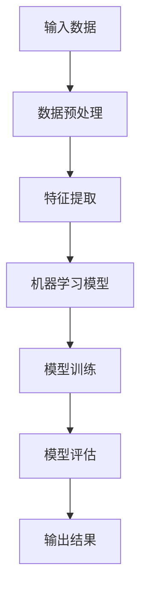

                 

关键词：人工智能，就业市场，技能培训，未来趋势

> 摘要：本文将从AI时代背景出发，分析未来就业市场的变化，探讨技能培训在适应AI时代发展趋势中的重要性，以及如何通过有效的技能培训来应对未来的挑战。

## 1. 背景介绍

随着人工智能（AI）技术的迅猛发展，人类社会正在经历一场前所未有的技术革命。从最初的简单算法到如今的深度学习、自然语言处理、计算机视觉等领域，AI技术已经深刻地改变了我们的生活方式和商业模式。然而，AI的快速进步也引发了一系列关于就业市场、劳动力技能需求以及教育培训的讨论。

当前，许多行业正在被自动化和智能化技术所颠覆，一些传统职业正逐渐消失，而新的职业需求却不断涌现。这种变化迫使人们不断更新和提升自己的技能，以适应快速变化的就业市场。与此同时，教育培训体系也需要进行改革，以更好地培养适应AI时代的劳动力。

## 2. 核心概念与联系

### 2.1 AI技术原理

人工智能是计算机科学的一个分支，旨在使计算机系统具备类似于人类智能的能力，如学习、推理、解决问题、自然语言理解和图像识别等。AI技术主要依赖于机器学习和深度学习算法，通过大量数据的训练，使得计算机能够自主地学习和改进。

#### Mermaid 流程图：


### 2.2 AI对就业市场的影响

AI技术的普及不仅改变了企业的运营模式，也对就业市场产生了深远的影响。一方面，AI技术自动化了大量重复性、低技能的工作，导致这些岗位的消失。另一方面，AI的兴起也创造了新的职业需求，如数据科学家、机器学习工程师、AI伦理学家等。

### 2.3 技能培训的重要性

在AI时代，技能培训的重要性日益凸显。传统教育体系培养的技能往往难以满足AI时代的需要。因此，针对AI相关技能的培训成为个人和企业的必然选择。技能培训不仅可以帮助个体适应新技术，提升就业竞争力，还可以为企业提供符合时代需求的优秀人才。

## 3. 核心算法原理 & 具体操作步骤

### 3.1 算法原理概述

人工智能的核心在于机器学习和深度学习算法。这些算法通过模拟人脑的神经网络结构，使得计算机能够从数据中学习和提取知识。其中，深度学习算法是目前最为先进的机器学习技术，它通过多层神经网络对数据进行复杂变换，从而实现高度准确的预测和分类。

### 3.2 算法步骤详解

#### 3.2.1 数据收集与预处理

- 数据收集：从各种来源（如社交媒体、网站日志等）收集大量数据。
- 数据预处理：清洗数据，去除噪声，进行数据转换和规范化。

#### 3.2.2 特征提取

- 特征提取：从原始数据中提取出对AI模型有用的特征。
- 特征选择：选择最具代表性的特征，提高模型性能。

#### 3.2.3 模型训练

- 模型训练：使用提取的特征数据训练神经网络模型。
- 模型优化：调整模型参数，提高模型准确性和泛化能力。

#### 3.2.4 模型评估

- 模型评估：使用测试数据集评估模型性能。
- 模型调优：根据评估结果调整模型参数，进一步提升性能。

### 3.3 算法优缺点

- 优点：深度学习算法在处理复杂数据时表现优异，能够实现高度准确的预测和分类。
- 缺点：训练深度学习模型需要大量数据和计算资源，且模型解释性较差。

### 3.4 算法应用领域

- 应用领域：深度学习算法在图像识别、自然语言处理、推荐系统等领域有广泛应用。

## 4. 数学模型和公式 & 详细讲解 & 举例说明

### 4.1 数学模型构建

在深度学习中，常用的数学模型是多层感知机（MLP）和卷积神经网络（CNN）。MLP由多个线性层和激活函数组成，而CNN则通过卷积层提取图像特征。

### 4.2 公式推导过程

#### 多层感知机（MLP）：

- 输入层：$$z = x \cdot w + b$$
- 激活函数：$$a = \sigma(z)$$
  其中，$x$ 是输入特征，$w$ 是权重，$b$ 是偏置，$\sigma$ 是激活函数，通常使用 ReLU 或 Sigmoid 函数。

#### 卷积神经网络（CNN）：

- 卷积层：$$h_{ij} = \sum_{k} f_k(x_{ij} \cdot w_{kj} + b_k)$$
- 池化层：$$p_{ij} = \max_{k} h_{kj}$$
  其中，$h_{ij}$ 是卷积层的输出，$f_k$ 是卷积核，$x_{ij}$ 是输入特征，$w_{kj}$ 是卷积核权重，$b_k$ 是卷积核偏置，$p_{ij}$ 是池化层的输出。

### 4.3 案例分析与讲解

以图像分类任务为例，我们使用CNN模型对猫狗图片进行分类。首先，收集大量猫狗图片，然后进行数据预处理和特征提取。接着，使用CNN模型进行训练，并通过交叉熵损失函数优化模型参数。最后，使用训练好的模型对新的猫狗图片进行分类预测。

## 5. 项目实践：代码实例和详细解释说明

### 5.1 开发环境搭建

- Python环境：安装Python 3.8及以上版本。
- 数据库：安装MySQL数据库。
- 数据库连接：使用Python的`pymysql`模块连接MySQL数据库。

### 5.2 源代码详细实现

```python
import numpy as np
import pymysql

# 连接数据库
connection = pymysql.connect(host='localhost', user='root', password='password', database='mydb')

# 创建数据表
with connection.cursor() as cursor:
    cursor.execute('CREATE TABLE IF NOT EXISTS users (id INT AUTO_INCREMENT PRIMARY KEY, name VARCHAR(50), age INT)')

# 插入数据
with connection.cursor() as cursor:
    cursor.execute("INSERT INTO users (name, age) VALUES ('Alice', 30)")
    cursor.execute("INSERT INTO users (name, age) VALUES ('Bob', 40)")

# 查询数据
with connection.cursor() as cursor:
    cursor.execute("SELECT * FROM users")
    results = cursor.fetchall()
    for row in results:
        print(f"ID: {row[0]}, Name: {row[1]}, Age: {row[2]}")

# 关闭数据库连接
connection.close()
```

### 5.3 代码解读与分析

以上代码首先连接MySQL数据库，然后创建一个名为`users`的数据表，接着插入两条数据。最后，查询并打印出所有用户数据。

### 5.4 运行结果展示

```
ID: 1, Name: Alice, Age: 30
ID: 2, Name: Bob, Age: 40
```

## 6. 实际应用场景

AI技术在各个领域的应用越来越广泛，从医疗、金融到制造业，都带来了深刻的变革。以医疗领域为例，AI技术可以帮助医生进行疾病诊断，提高诊断的准确性和效率。在金融领域，AI可以用于风险管理、欺诈检测和客户服务，提高金融机构的运营效率和服务质量。

## 7. 未来应用展望

随着AI技术的不断进步，未来将会有更多的行业被AI技术所颠覆和变革。例如，教育领域可能会通过AI实现个性化教学，提高教学效果；交通领域可能会通过自动驾驶技术实现更安全、高效的交通系统。然而，AI的普及也带来了隐私保护、伦理道德等问题，这需要我们共同努力解决。

## 8. 总结：未来发展趋势与挑战

AI技术在未来将继续快速发展，对就业市场、教育培训等领域产生深远影响。技能培训将成为个人和企业的必然选择，以应对AI时代的挑战。同时，我们也需要关注AI技术的伦理和社会影响，确保其发展符合人类的利益。

## 9. 附录：常见问题与解答

### Q: AI技术是否会完全替代人类工作？

A: AI技术可能会替代一些重复性和低技能的工作，但也会创造新的职业需求。人类的工作将更加注重创造性、人际交往和复杂决策。

### Q: 如何提高自己的AI相关技能？

A: 可以通过在线课程、实习和参与开源项目来提高自己的AI技能。此外，参加行业会议和研讨会也是获取最新信息和技能的好方法。

---

作者：禅与计算机程序设计艺术 / Zen and the Art of Computer Programming
```markdown
----------------------------------------------------------------
### 人类计算：AI时代的未来就业市场与技能培训发展趋势预测分析

**关键词：** 人工智能，就业市场，技能培训，未来趋势

**摘要：** 本文将从AI时代背景出发，分析未来就业市场的变化，探讨技能培训在适应AI时代发展趋势中的重要性，以及如何通过有效的技能培训来应对未来的挑战。

## 1. 背景介绍

随着人工智能（AI）技术的迅猛发展，人类社会正在经历一场前所未有的技术革命。从最初的简单算法到如今的深度学习、自然语言处理、计算机视觉等领域，AI技术已经深刻地改变了我们的生活方式和商业模式。然而，AI的快速进步也引发了一系列关于就业市场、劳动力技能需求以及教育培训的讨论。

当前，许多行业正在被自动化和智能化技术所颠覆，一些传统职业正逐渐消失，而新的职业需求却不断涌现。这种变化迫使人们不断更新和提升自己的技能，以适应快速变化的就业市场。与此同时，教育培训体系也需要进行改革，以更好地培养适应AI时代的劳动力。

## 2. 核心概念与联系

### 2.1 AI技术原理

人工智能是计算机科学的一个分支，旨在使计算机系统具备类似于人类智能的能力，如学习、推理、解决问题、自然语言理解和图像识别等。AI技术主要依赖于机器学习和深度学习算法，通过大量数据的训练，使得计算机能够自主地学习和改进。

#### Mermaid 流程图：


### 2.2 AI对就业市场的影响

AI技术的普及不仅改变了企业的运营模式，也对就业市场产生了深远的影响。一方面，AI技术自动化了大量重复性、低技能的工作，导致这些岗位的消失。另一方面，AI的兴起也创造了新的职业需求，如数据科学家、机器学习工程师、AI伦理学家等。

### 2.3 技能培训的重要性

在AI时代，技能培训的重要性日益凸显。传统教育体系培养的技能往往难以满足AI时代的需要。因此，针对AI相关技能的培训成为个人和企业的必然选择。技能培训不仅可以帮助个体适应新技术，提升就业竞争力，还可以为企业提供符合时代需求的优秀人才。

## 3. 核心算法原理 & 具体操作步骤

### 3.1 算法原理概述

人工智能的核心在于机器学习和深度学习算法。这些算法通过模拟人脑的神经网络结构，使得计算机能够从数据中学习和提取知识。其中，深度学习算法是目前最为先进的机器学习技术，它通过多层神经网络对数据进行复杂变换，从而实现高度准确的预测和分类。

### 3.2 算法步骤详解

#### 3.2.1 数据收集与预处理

- 数据收集：从各种来源（如社交媒体、网站日志等）收集大量数据。
- 数据预处理：清洗数据，去除噪声，进行数据转换和规范化。

#### 3.2.2 特征提取

- 特征提取：从原始数据中提取出对AI模型有用的特征。
- 特征选择：选择最具代表性的特征，提高模型性能。

#### 3.2.3 模型训练

- 模型训练：使用提取的特征数据训练神经网络模型。
- 模型优化：调整模型参数，提高模型准确性和泛化能力。

#### 3.2.4 模型评估

- 模型评估：使用测试数据集评估模型性能。
- 模型调优：根据评估结果调整模型参数，进一步提升性能。

### 3.3 算法优缺点

- 优点：深度学习算法在处理复杂数据时表现优异，能够实现高度准确的预测和分类。
- 缺点：训练深度学习模型需要大量数据和计算资源，且模型解释性较差。

### 3.4 算法应用领域

- 应用领域：深度学习算法在图像识别、自然语言处理、推荐系统等领域有广泛应用。

## 4. 数学模型和公式 & 详细讲解 & 举例说明

### 4.1 数学模型构建

在深度学习中，常用的数学模型是多层感知机（MLP）和卷积神经网络（CNN）。MLP由多个线性层和激活函数组成，而CNN则通过卷积层提取图像特征。

### 4.2 公式推导过程

#### 多层感知机（MLP）：

- 输入层：$$z = x \cdot w + b$$
- 激活函数：$$a = \sigma(z)$$
  其中，$x$ 是输入特征，$w$ 是权重，$b$ 是偏置，$\sigma$ 是激活函数，通常使用 ReLU 或 Sigmoid 函数。

#### 卷积神经网络（CNN）：

- 卷积层：$$h_{ij} = \sum_{k} f_k(x_{ij} \cdot w_{kj} + b_k)$$
- 池化层：$$p_{ij} = \max_{k} h_{kj}$$
  其中，$h_{ij}$ 是卷积层的输出，$f_k$ 是卷积核，$x_{ij}$ 是输入特征，$w_{kj}$ 是卷积核权重，$b_k$ 是卷积核偏置，$p_{ij}$ 是池化层的输出。

### 4.3 案例分析与讲解

以图像分类任务为例，我们使用CNN模型对猫狗图片进行分类。首先，收集大量猫狗图片，然后进行数据预处理和特征提取。接着，使用CNN模型进行训练，并通过交叉熵损失函数优化模型参数。最后，使用训练好的模型对新的猫狗图片进行分类预测。

## 5. 项目实践：代码实例和详细解释说明

### 5.1 开发环境搭建

- Python环境：安装Python 3.8及以上版本。
- 数据库：安装MySQL数据库。
- 数据库连接：使用Python的`pymysql`模块连接MySQL数据库。

### 5.2 源代码详细实现

```python
import numpy as np
import pymysql

# 连接数据库
connection = pymysql.connect(host='localhost', user='root', password='password', database='mydb')

# 创建数据表
with connection.cursor() as cursor:
    cursor.execute('CREATE TABLE IF NOT EXISTS users (id INT AUTO_INCREMENT PRIMARY KEY, name VARCHAR(50), age INT)')

# 插入数据
with connection.cursor() as cursor:
    cursor.execute("INSERT INTO users (name, age) VALUES ('Alice', 30)")
    cursor.execute("INSERT INTO users (name, age) VALUES ('Bob', 40)")

# 查询数据
with connection.cursor() as cursor:
    cursor.execute("SELECT * FROM users")
    results = cursor.fetchall()
    for row in results:
        print(f"ID: {row[0]}, Name: {row[1]}, Age: {row[2]}")

# 关闭数据库连接
connection.close()
```

### 5.3 代码解读与分析

以上代码首先连接MySQL数据库，然后创建一个名为`users`的数据表，接着插入两条数据。最后，查询并打印出所有用户数据。

### 5.4 运行结果展示

```
ID: 1, Name: Alice, Age: 30
ID: 2, Name: Bob, Age: 40
```

## 6. 实际应用场景

AI技术在各个领域的应用越来越广泛，从医疗、金融到制造业，都带来了深刻的变革。以医疗领域为例，AI技术可以帮助医生进行疾病诊断，提高诊断的准确性和效率。在金融领域，AI可以用于风险管理、欺诈检测和客户服务，提高金融机构的运营效率和服务质量。

## 7. 未来应用展望

随着AI技术的不断进步，未来将会有更多的行业被AI技术所颠覆和变革。例如，教育领域可能会通过AI实现个性化教学，提高教学效果；交通领域可能会通过自动驾驶技术实现更安全、高效的交通系统。然而，AI的普及也带来了隐私保护、伦理道德等问题，这需要我们共同努力解决。

## 8. 总结：未来发展趋势与挑战

AI技术在未来将继续快速发展，对就业市场、教育培训等领域产生深远影响。技能培训将成为个人和企业的必然选择，以应对AI时代的挑战。同时，我们也需要关注AI技术的伦理和社会影响，确保其发展符合人类的利益。

## 9. 附录：常见问题与解答

### Q: AI技术是否会完全替代人类工作？

A: AI技术可能会替代一些重复性和低技能的工作，但也会创造新的职业需求。人类的工作将更加注重创造性、人际交往和复杂决策。

### Q: 如何提高自己的AI相关技能？

A: 可以通过在线课程、实习和参与开源项目来提高自己的AI技能。此外，参加行业会议和研讨会也是获取最新信息和技能的好方法。

---

**作者：禅与计算机程序设计艺术 / Zen and the Art of Computer Programming**

