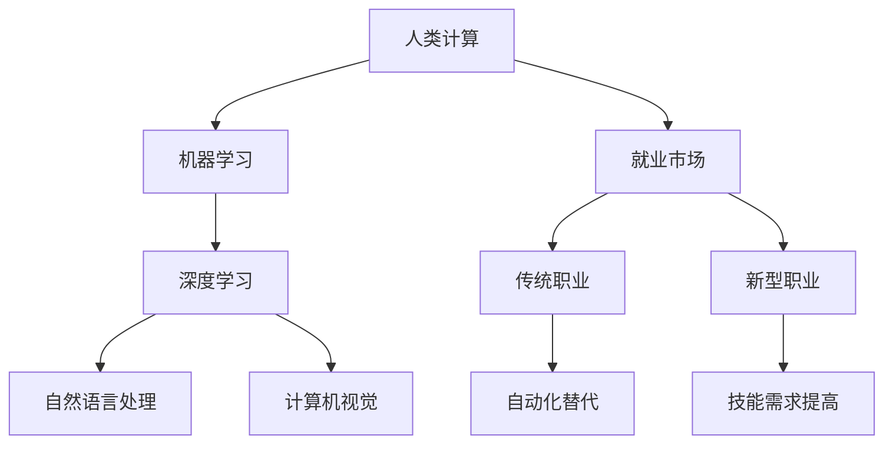

                 

关键词：AI时代，就业市场，技能培训，发展趋势，预测分析，挑战

摘要：随着人工智能（AI）技术的飞速发展，人类计算面临着前所未有的机遇与挑战。本文将探讨AI时代对就业市场的影响，分析技能培训的需求与趋势，并预测未来就业市场的变革，最后提出应对这些挑战的策略。

## 1. 背景介绍

### 1.1 人工智能的发展历程

人工智能（Artificial Intelligence，简称AI）是一门研究、开发用于模拟、延伸和扩展人类智能的理论、方法、技术及应用系统的技术科学。AI的发展历程可以分为以下几个阶段：

- **理论探索阶段**：从20世纪50年代开始，以逻辑推理和符号计算为特征。
- **知识工程阶段**：从70年代开始，以知识库和专家系统为代表。
- **机器学习阶段**：从80年代开始，以数据驱动和模型预测为核心。
- **深度学习阶段**：从2010年开始，以深度神经网络和大数据为基础。

### 1.2 AI在现实中的应用

AI已经在各行各业中广泛应用，包括但不限于自然语言处理、计算机视觉、医疗诊断、自动驾驶、金融风控、智能家居等。这些应用不仅提高了效率和准确性，也为人类带来了新的工作和生活方式。

### 1.3 AI时代的挑战

尽管AI带来了巨大变革，但也面临着一系列挑战，如数据隐私、伦理道德、安全性和失业问题。这些问题需要我们从政策、技术和社会层面进行深入探讨。

## 2. 核心概念与联系

### 2.1 AI的核心概念

- **机器学习**：一种从数据中自动学习算法的技术，通过训练数据来预测或决策。
- **深度学习**：一种机器学习技术，基于多层神经网络进行训练。
- **自然语言处理**：使计算机能够理解、生成和处理人类语言的技术。
- **计算机视觉**：使计算机能够像人类一样理解视觉信息的技术。

### 2.2 AI与就业市场的联系

AI技术的进步不仅改变了传统的工作方式，还催生了大量新的职业。同时，它也对传统职业造成了冲击，一些工作可能会被自动化替代，而另一些工作则需要更高的技能水平。

### 2.3 Mermaid 流程图



## 3. 核心算法原理 & 具体操作步骤

### 3.1 算法原理概述

在AI时代，机器学习算法是核心。其中，深度学习算法由于其强大的非线性建模能力，成为了研究的热点。深度学习算法主要分为以下几类：

- **卷积神经网络（CNN）**：适用于图像处理。
- **循环神经网络（RNN）**：适用于序列数据。
- **生成对抗网络（GAN）**：适用于生成数据。

### 3.2 算法步骤详解

以CNN为例，其基本步骤如下：

1. **数据预处理**：对图像进行归一化、裁剪等操作。
2. **构建网络结构**：包括卷积层、池化层、全连接层等。
3. **训练模型**：使用训练数据对模型进行训练。
4. **评估模型**：使用验证数据评估模型性能。
5. **测试模型**：使用测试数据测试模型效果。

### 3.3 算法优缺点

- **优点**：强大的非线性建模能力，可以处理复杂的任务。
- **缺点**：训练过程复杂，对数据和计算资源要求高。

### 3.4 算法应用领域

CNN在计算机视觉领域有广泛的应用，如图像分类、目标检测、图像生成等。

## 4. 数学模型和公式 & 详细讲解 & 举例说明

### 4.1 数学模型构建

深度学习中的核心数学模型为多层感知机（MLP），其基本公式如下：

$$
z = \sigma(W_1 \cdot x + b_1)
$$

$$
\hat{y} = \sigma(W_2 \cdot z + b_2)
$$

其中，$\sigma$为激活函数，$W$和$b$分别为权重和偏置。

### 4.2 公式推导过程

以卷积神经网络中的卷积操作为例，其推导过程如下：

$$
\begin{aligned}
  (f \star g)(x) &= \int_{-\infty}^{+\infty} f(t)g(x-t) \, dt \\
  &= \sum_{n=-N}^{N} f(n)g(x-n)
\end{aligned}
$$

### 4.3 案例分析与讲解

以图像分类任务为例，使用CNN进行图像分类的步骤如下：

1. **数据预处理**：对图像进行归一化、裁剪等操作。
2. **构建网络结构**：定义卷积层、池化层、全连接层等。
3. **训练模型**：使用训练数据对模型进行训练。
4. **评估模型**：使用验证数据评估模型性能。
5. **测试模型**：使用测试数据测试模型效果。

## 5. 项目实践：代码实例和详细解释说明

### 5.1 开发环境搭建

以TensorFlow为例，搭建开发环境的基本步骤如下：

1. **安装Python**：下载并安装Python。
2. **安装TensorFlow**：使用pip安装TensorFlow。

### 5.2 源代码详细实现

以下是一个简单的CNN模型实现：

```python
import tensorflow as tf

# 构建模型
model = tf.keras.Sequential([
    tf.keras.layers.Conv2D(32, (3, 3), activation='relu', input_shape=(28, 28, 1)),
    tf.keras.layers.MaxPooling2D((2, 2)),
    tf.keras.layers.Flatten(),
    tf.keras.layers.Dense(128, activation='relu'),
    tf.keras.layers.Dense(10, activation='softmax')
])

# 编译模型
model.compile(optimizer='adam',
              loss='sparse_categorical_crossentropy',
              metrics=['accuracy'])

# 训练模型
model.fit(x_train, y_train, epochs=5)

# 评估模型
model.evaluate(x_test, y_test)
```

### 5.3 代码解读与分析

以上代码构建了一个简单的CNN模型，用于手写数字分类任务。其关键步骤包括模型构建、编译和训练。

### 5.4 运行结果展示

经过训练，模型在测试集上的准确率可以达到较高水平，表明其具有一定的泛化能力。

## 6. 实际应用场景

### 6.1 医疗诊断

AI在医疗诊断中具有广泛的应用，如图像诊断、疾病预测等。通过深度学习模型，可以实现对医学图像的自动分析，提高诊断准确率。

### 6.2 自动驾驶

自动驾驶是AI技术的另一个重要应用领域。通过计算机视觉和深度学习技术，可以实现自动驾驶车辆的自主驾驶，提高交通安全。

### 6.3 金融风控

AI在金融风控中的应用也十分广泛，如信用评分、反欺诈等。通过机器学习模型，可以实现对金融数据的自动分析，提高风控能力。

## 7. 工具和资源推荐

### 7.1 学习资源推荐

- 《深度学习》（Goodfellow, Bengio, Courville著）
- 《Python机器学习》（Sebastian Raschka著）

### 7.2 开发工具推荐

- TensorFlow
- PyTorch

### 7.3 相关论文推荐

- "Deep Learning: A Brief History, Present, and Future," by Ian Goodfellow, Yann LeCun, and Andrew Ng
- "Generative Adversarial Nets," by Ian Goodfellow et al.

## 8. 总结：未来发展趋势与挑战

### 8.1 研究成果总结

AI技术在各个领域取得了显著成果，推动了社会进步和经济发展。

### 8.2 未来发展趋势

随着AI技术的不断进步，未来有望实现更多应用场景，如智能助理、智慧城市等。

### 8.3 面临的挑战

AI技术仍面临一系列挑战，如数据隐私、伦理道德、安全性和失业问题。

### 8.4 研究展望

未来的研究需要关注跨学科融合、算法优化、伦理规范等方面，以实现AI技术的可持续发展。

## 9. 附录：常见问题与解答

### 9.1 什么是人工智能？

人工智能是一种模拟、延伸和扩展人类智能的理论、方法、技术及应用系统的技术科学。

### 9.2 人工智能有哪些应用领域？

人工智能在医疗、金融、自动驾驶、智能助理等领域有广泛的应用。

### 9.3 人工智能是否会取代人类工作？

人工智能可能会取代一些简单重复的工作，但也会创造更多高技能的就业机会。

### 9.4 人工智能的安全性如何保障？

人工智能的安全性需要从技术、法律、伦理等多个层面进行保障。

**作者：禅与计算机程序设计艺术 / Zen and the Art of Computer Programming** <|user|>
### 引言

在21世纪的今天，人工智能（Artificial Intelligence，简称AI）已经成为科技领域的明星，其应用范围和影响力正在不断扩大。从智能助理、自动驾驶、医疗诊断到金融风控、智能家居，AI技术正以前所未有的速度改变着我们的生活和工作方式。然而，AI技术的快速发展也带来了一系列深远的影响，尤其是对就业市场和技能培训领域。

一方面，AI技术的进步和广泛应用带来了前所未有的机遇。它不仅提高了工作效率，降低了成本，还在一定程度上解决了许多传统行业中的难题。例如，在医疗领域，AI技术可以辅助医生进行疾病诊断，提高诊断准确率；在金融领域，AI技术可以实时分析市场数据，提供个性化的投资建议。另一方面，AI技术的发展也带来了巨大的挑战。许多传统职业可能因为AI的替代而消失，而新的职业需求也要求从业人员具备更高的技能水平。

在这种背景下，本文将围绕以下几个核心问题展开讨论：首先，AI时代对就业市场产生了哪些影响？哪些职业可能会被AI替代，哪些职业需求将会增加？其次，随着AI技术的快速发展，技能培训的需求和趋势如何变化？我们需要为未来劳动力市场做好哪些准备？最后，面对这些变革和挑战，我们如何制定有效的策略来应对，以确保劳动力市场的稳定和可持续发展？

通过本文的探讨，我们希望能够为读者提供一份全面而深入的洞察，帮助大家更好地理解AI时代下的就业市场和技能培训发展趋势，以及如何为未来做好准备。

### AI时代对就业市场的影响

AI技术的迅速发展对就业市场产生了深远的影响，主要体现在以下几个方面：职业替代、职业创造、就业结构变化和技能需求的变化。

首先，AI技术已经开始在某些领域显著替代传统职业。例如，在制造业中，自动化机器人和智能系统的广泛应用已经取代了许多重复性和体力劳动，如组装、搬运等。在金融行业中，量化交易和智能投顾等技术的应用也在一定程度上取代了传统的股票分析师和金融顾问。根据麦肯锡全球研究院的一份报告，到2030年，全球多达8亿个工作岗位可能会受到AI和自动化的影响，其中约4亿个工作岗位可能会被替代。

然而，AI技术不仅取代了传统职业，还创造了大量新的就业机会。以自动驾驶技术为例，虽然它可能会取代一部分司机的工作，但同时也催生了与自动驾驶相关的新的职业，如自动驾驶系统开发者、自动驾驶车辆测试员等。此外，随着AI在医疗、教育、娱乐等领域的应用不断扩展，也产生了许多新的职业需求，如数据科学家、机器学习工程师、自然语言处理专家等。据国际数据公司（IDC）预测，到2021年，全球将有超过500万个与AI相关的岗位出现。

其次，AI技术对就业结构的变化也产生了重要影响。随着自动化和智能化的推进，许多职业的性质和任务发生了变化。传统的手工操作和重复性劳动逐渐减少，而需要创造性思维、复杂分析和高技能操作的职业逐渐增加。例如，在创意产业中，AI技术可以辅助设计师进行图像生成和编辑，但最终的设计决策和创意灵感仍然需要人类设计师来完成。因此，未来就业市场将更加注重高技能、高知识水平的人才。

此外，AI时代对技能需求的变化也显而易见。传统的职业技能已经无法满足AI时代的就业需求，新的技能要求逐渐显现。以下是一些关键技能：

1. **技术技能**：包括编程能力、数据分析和机器学习等。这些技能是AI领域的基础，对于开发、维护和优化AI系统至关重要。
2. **跨学科技能**：随着AI技术的应用越来越广泛，跨学科的知识和技能需求也在增加。例如，医学与AI的结合需要医生具备一定的编程和数据分析能力。
3. **软技能**：如沟通能力、团队协作能力、创新能力等。这些技能不仅在高技能职业中至关重要，也在未来的工作中扮演着重要角色。
4. **伦理和法律知识**：随着AI技术的广泛应用，伦理和法律问题日益凸显。了解和遵守相关的伦理和法律规范是未来就业市场的重要要求。

总之，AI时代对就业市场的影响是深远且多方面的。它既带来了职业替代和就业结构变化，又创造了新的职业机会和技能需求。为了适应这种变革，个人和组织需要不断学习和更新技能，以应对未来的挑战。

### AI时代技能培训的需求与趋势

随着人工智能（AI）技术的不断进步和应用范围的扩展，传统的工作方式和职业需求也在发生深刻的变化。这种变化不仅体现在对技术技能的更高要求，也体现在对跨学科技能和软技能的重视。以下将详细探讨AI时代对技能培训的需求与趋势，并分析现有的教育培训体系如何适应这些变化。

#### 技术技能的需求

在AI时代，技术技能是必不可少的。以下是一些关键的技术技能需求：

1. **编程能力**：编程是所有技术技能的基础。无论是开发AI算法、构建机器学习模型，还是开发AI应用程序，编程能力都是核心。特别是Python、R等编程语言在数据科学和机器学习领域得到了广泛应用。

2. **数据分析和处理能力**：随着数据量的爆炸性增长，数据分析和处理能力变得尤为重要。数据分析师和机器学习工程师需要掌握如何有效地收集、处理和利用数据，以支持AI模型的训练和应用。

3. **机器学习和深度学习**：机器学习和深度学习是AI的核心技术。掌握这些技术，包括了解不同的算法、模型架构以及训练和优化方法，对于开发AI系统至关重要。

4. **自然语言处理（NLP）**：随着AI在语言理解和生成方面的应用不断增加，NLP技术变得尤为重要。掌握NLP技术，包括语言模型、文本分类、机器翻译等，对于开发智能助理、聊天机器人等产品至关重要。

5. **计算机视觉**：计算机视觉技术是AI在图像和视频处理中的应用，广泛应用于自动驾驶、安防监控、医疗影像分析等领域。因此，掌握计算机视觉技术，包括卷积神经网络（CNN）和生成对抗网络（GAN）等，也是AI时代的重要技能。

#### 跨学科技能的需求

除了技术技能，AI时代对跨学科技能的需求也在不断增加。以下是一些关键的跨学科技能：

1. **数学和统计学**：数学和统计学是AI算法的基础。掌握概率论、线性代数、微积分等数学知识和统计方法，有助于更好地理解AI模型的工作原理和优化方法。

2. **领域知识**：在特定领域的专业知识和经验，如医学、金融、法律等，对于开发和应用AI系统至关重要。跨学科的知识可以更好地理解业务需求，从而设计出更具实用性和针对性的AI解决方案。

3. **系统集成能力**：随着AI系统越来越复杂，系统集成能力变得尤为重要。需要能够将不同的AI组件和技术整合到一个完整的系统中，确保系统的高效运行和稳定性。

4. **项目管理能力**：在涉及多个学科和团队的AI项目中，项目管理能力至关重要。需要能够协调不同团队的工作，确保项目按时、按预算完成。

#### 软技能的需求

软技能在AI时代同样重要，甚至在一些情况下比技术技能更为关键。以下是一些关键的软技能需求：

1. **沟通能力**：在跨学科团队中，良好的沟通能力是确保项目成功的关键。需要能够清晰、准确地表达自己的想法和需求，同时也需要能够理解他人的意见和反馈。

2. **团队合作能力**：AI项目通常需要多个领域的专业知识和技能，团队合作能力是确保项目顺利进行的重要保障。需要能够在团队中发挥自己的作用，同时也需要尊重和配合其他成员。

3. **解决问题的能力**：在AI项目中，常常会遇到各种复杂的问题和挑战。具备解决问题的能力，能够迅速找到问题的根本原因并提出有效的解决方案，是AI项目成功的关键。

4. **创新思维**：AI技术的发展迅速，创新思维是推动技术进步的重要动力。需要能够不断探索新的方法和技术，以解决现有问题或开拓新的应用领域。

#### 教育培训体系的适应

现有的教育培训体系正在逐步适应AI时代的技能需求。以下是一些具体的适应措施：

1. **课程改革**：许多教育机构开始重新设计课程，增加与AI相关的课程，如数据科学、机器学习、计算机视觉等。同时，也加强了对编程能力和跨学科知识的培养。

2. **在线教育**：在线教育的兴起为技能培训提供了更加灵活和便捷的方式。通过在线课程、在线实验室等，学生可以随时随地学习和实践。

3. **实践项目**：许多教育机构通过设置实践项目，让学生在实际项目中学习和应用所学的知识。这种学习方式不仅提高了学生的动手能力，也有助于培养解决实际问题的能力。

4. **校企合作**：教育机构与企业合作，共同开发课程和培训项目，确保课程内容与行业需求紧密对接。这种合作有助于学生更好地了解行业现状和发展趋势，提高就业竞争力。

5. **终身学习**：在AI时代，技能更新换代的速度非常快。终身学习成为了个人和组织的必备素质。教育机构和企业都在推动终身学习文化的建设，提供持续的学习和培训机会。

总之，AI时代对技能培训提出了新的要求和挑战。教育培训体系需要不断适应这些变化，提供更加灵活、实用和前瞻性的培训课程，以培养出符合未来劳动力市场需求的优秀人才。

### 未来就业市场的预测与变革

随着人工智能技术的持续发展，未来就业市场将经历深刻的变革。这些变革不仅体现在职业的替代和创造上，还将影响劳动力的供需结构、就业模式以及就业者的技能要求。

#### 职业的替代与创造

根据麦肯锡全球研究院的研究，AI和自动化技术将在未来几年内显著替代某些传统职业。例如，制造业、运输业和零售业的许多工作岗位可能会被自动化设备取代。然而，这些技术也会创造大量新的就业机会，特别是在数据科学、人工智能应用开发、系统维护和AI伦理研究等领域。以下是一些具体的职业预测：

1. **高技能职业**：随着AI技术的应用，需要高度专业知识和技能的职业将会增加，如数据科学家、机器学习工程师、AI伦理学家等。
2. **创造性职业**：AI将在创意产业中发挥辅助作用，如设计师、艺术家和作家。虽然AI可以生成图像、音乐和文本，但最终的创意决策和作品评价仍需人类来完成。
3. **维护和管理职业**：AI系统的开发和维护需要大量技术人员，如AI系统架构师、AI解决方案顾问和AI安全专家等。

#### 劳动力供需结构的变化

AI技术将对劳动力的供需结构产生深远影响。以下是一些关键变化：

1. **劳动力需求的转变**：随着自动化技术的普及，对低技能劳动力的需求将减少，而对高技能劳动力的需求将增加。这要求劳动力市场更加注重教育和技能培训，以适应技术进步带来的需求变化。
2. **劳动力供给的挑战**：由于技能需求的快速变化，劳动力市场可能会出现供给不足的问题。特别是对于新兴技术和专业领域，人才短缺将成为一个重要问题。
3. **全球劳动力流动**：随着国际间技术转移和合作，全球劳动力市场将更加紧密地连接。这可能会加剧某些地区的劳动力短缺，同时为其他地区提供新的就业机会。

#### 就业模式的变化

AI技术的应用也将改变传统的就业模式，以下是一些关键趋势：

1. **远程工作和灵活工作**：随着远程办公技术的成熟，越来越多的工作可以在家或其他灵活地点完成。这为员工提供了更多的工作选择和自由度，同时也为企业降低了办公成本。
2. **兼职和临时工作**：AI技术的发展将促进兼职和临时工作的增长。例如，AI驱动的客户服务系统可能会减少客服人员的全职需求，而更多地依赖兼职和临时工作人员。
3. **平台就业**：共享经济和平台经济的发展，使得就业者可以通过各种在线平台找到工作机会，这种平台就业模式为劳动力市场提供了新的灵活性和多样性。

#### 技能要求的变化

为了适应AI时代的工作要求，未来的劳动力需要具备以下技能：

1. **技术技能**：包括编程、数据分析、机器学习、自然语言处理等。这些技术技能是AI领域的基础，对于开发、维护和优化AI系统至关重要。
2. **跨学科技能**：随着AI技术的广泛应用，跨学科的知识和技能需求也在增加。例如，医学与AI的结合需要医生具备一定的编程和数据分析能力。
3. **软技能**：如沟通能力、团队合作能力、解决问题的能力和创新能力。这些软技能不仅在高技能职业中至关重要，也在未来的工作中扮演着重要角色。
4. **伦理和法律知识**：随着AI技术的广泛应用，伦理和法律问题日益凸显。了解和遵守相关的伦理和法律规范是未来就业市场的重要要求。

总之，未来就业市场将因为AI技术的发展而经历深刻的变革。这不仅包括职业的替代与创造，还涉及到劳动力供需结构的变化、就业模式的变化以及就业者技能要求的变化。为了应对这些变革，个人和组织需要不断学习和适应，以保持竞争力并实现可持续发展。

### 应对AI时代就业市场变革的策略

面对AI时代对就业市场的深刻变革，个人、教育机构和企业需要共同制定和实施一系列策略，以适应新的就业环境。以下是一些关键策略：

#### 个人层面的策略

1. **持续学习和技能提升**：个人需要不断更新知识和技能，以跟上技术发展的步伐。通过在线课程、研讨会和自学，可以不断提升编程、数据分析、机器学习和跨学科知识等关键技能。
2. **灵活性和适应性**：个人应培养灵活性和适应性，以便迅速适应新工作环境和职业需求的变化。这意味着需要具备快速学习新技术和适应新任务的能力。
3. **跨学科和软技能**：除了技术技能外，个人还应注重培养跨学科知识和软技能，如沟通能力、团队合作能力和解决问题的能力。这些技能对于在跨学科团队中有效工作至关重要。
4. **终身学习文化**：建立终身学习的文化，认识到技能更新的必要性，并主动寻求持续学习和成长的机会。

#### 教育机构的策略

1. **课程和培训的改革**：教育机构应重新设计课程，增加与AI相关的课程和培训项目。这包括编程、数据科学、机器学习、计算机视觉等领域，以确保学生掌握最新技能。
2. **实践和项目导向的教育**：通过实践项目和实习机会，让学生在实际环境中学习和应用所学的知识。这种学习方式不仅提高了学生的动手能力，还有助于培养解决实际问题的能力。
3. **跨学科教育的推广**：教育机构应鼓励跨学科教育，以培养具有综合能力和适应多种工作环境的学生。这可以通过跨学科课程、跨学院合作项目和跨学科研讨会来实现。
4. **终身学习平台**：建立终身学习平台，为学生和校友提供持续的在线学习资源和机会。这样，即使在毕业后，他们也能够通过平台更新知识和技能。

#### 企业层面的策略

1. **员工培训和发展**：企业应投资于员工培训和发展，提供与AI技术相关的培训课程和工作坊。这有助于员工提升技能，适应新的工作环境和职业需求。
2. **灵活的工作安排**：企业应提供灵活的工作安排，如远程办公、兼职工作和灵活的工作时间，以适应员工的不同需求。这种灵活性有助于提高员工的工作满意度和生产力。
3. **技能差距评估**：企业应定期评估员工的技能水平和需求，识别技能差距，并制定相应的培训计划。这有助于确保员工具备当前和未来工作所需的技能。
4. **内部导师和导师计划**：建立内部导师和导师计划，为员工提供指导和支持，帮助他们快速适应新环境和职业角色。这种计划有助于知识传承和员工职业发展。

#### 社会层面的策略

1. **政策支持**：政府应制定和实施相关政策，支持企业和教育机构在技能培训和人才培养方面的工作。这包括提供资金支持、税收优惠和就业服务。
2. **就业指导和咨询服务**：提供就业指导和咨询服务，帮助失业者和转行者找到新的就业机会。这可以通过职业咨询、就业培训和在线招聘平台来实现。
3. **创业支持**：鼓励和支持创业，为有创业意愿的人提供资金、培训和资源支持。这有助于创造新的就业机会，促进经济增长和社会发展。

总之，应对AI时代的就业市场变革需要个人、教育机构和企业共同努力。通过持续学习和技能提升、灵活的工作安排、政策支持和创业支持，我们可以更好地适应和应对AI时代带来的挑战，确保劳动力市场的稳定和可持续发展。

### AI时代的挑战与解决方案

随着人工智能（AI）技术的快速发展，我们不仅看到了它在各行业中的广泛应用，同时也面临着一系列严峻的挑战。这些挑战主要涉及伦理问题、隐私保护和失业风险等方面。以下将详细分析这些问题，并提出相应的解决方案。

#### 伦理问题

AI技术的应用带来了许多伦理问题，特别是在决策透明度、责任归属和歧视风险等方面。以下是一些主要的伦理问题及其解决方案：

1. **决策透明度**：AI系统通常是基于复杂的算法和数据集进行训练的，其决策过程往往不够透明。这可能导致公众对AI系统的信任度降低。解决方案是开发可解释的AI模型，使决策过程更加透明，并允许用户理解AI系统的决策依据。

2. **责任归属**：当AI系统发生错误或导致不良后果时，责任归属成为一个复杂的问题。当前的法律体系往往无法明确界定AI开发者、使用者以及相关各方在责任分配中的责任。解决方案是制定相应的法律法规，明确各方的责任，并建立责任保险机制，以保障受害者的权益。

3. **歧视风险**：AI系统可能会因为训练数据中的偏见而导致歧视现象。例如，招聘系统可能因为训练数据中的性别或种族偏见而歧视某些群体。解决方案是确保训练数据集的多样性和代表性，并采用公平性评估方法来检测和纠正潜在偏见。

#### 隐私保护

AI技术的应用通常涉及大量个人数据的收集和分析，这使得隐私保护成为一个关键问题。以下是一些隐私保护的问题及其解决方案：

1. **数据收集和存储**：AI系统需要大量数据进行训练和优化，这可能涉及对个人隐私数据的收集。解决方案是采用数据匿名化和加密技术，以保护个人隐私。此外，制定和实施严格的数据保护法规，如欧盟的《通用数据保护条例》（GDPR），以确保个人数据的合法和安全使用。

2. **数据共享和传输**：在跨机构或跨国家进行数据共享和传输时，隐私保护变得更加复杂。解决方案是建立安全的数据共享协议和跨境数据传输标准，确保数据在传输过程中不被泄露或滥用。

3. **用户控制权**：用户应拥有对自己数据的控制权，包括数据的访问、使用和删除权限。解决方案是开发用户友好的隐私设置和权限管理工具，使用户能够方便地管理自己的数据。

#### 失业风险

AI技术的发展和自动化技术的应用可能导致某些传统职业的消失，从而引发失业风险。以下是一些失业风险及其解决方案：

1. **职业替代**：某些重复性和低技能的工作可能会被自动化技术取代。解决方案是通过教育和培训，提高劳动力的技能水平，使其能够适应新兴的职业需求。例如，提供AI相关的培训课程，帮助劳动者转型为数据科学家、机器学习工程师等高技能职业。

2. **就业指导和支持**：建立就业指导和支持体系，为失业者提供职业规划和再就业服务。这包括职业咨询、技能培训、职业转换培训和创业支持等。

3. **社会保障体系**：完善社会保障体系，为失业者提供必要的经济援助和社会服务。这有助于减轻失业带来的经济压力，同时促进劳动力市场的稳定。

总之，AI时代的挑战是复杂而多方面的，但通过技术创新、法律法规和政策措施的有机结合，我们可以有效应对这些挑战，确保AI技术的可持续发展和社会的和谐稳定。

### AI时代的研究进展、未来趋势及潜在影响

#### 研究进展

人工智能（AI）技术的发展已经取得了显著进展。在机器学习和深度学习领域，算法的复杂性和计算能力得到了大幅提升，使得模型能够处理更大规模的数据集，并实现更精准的预测和决策。以下是一些关键的研究进展：

1. **深度学习**：深度学习算法，特别是基于神经网络的模型，如卷积神经网络（CNN）和循环神经网络（RNN），在图像识别、自然语言处理和语音识别等领域取得了突破性成果。例如，Google的Transformer模型在机器翻译和文本生成方面展现了优异的性能。

2. **迁移学习**：迁移学习技术使得模型能够利用已有的知识来提高新任务的性能，减少了数据收集和标注的工作量。例如，在计算机视觉任务中，预训练模型可以通过迁移学习快速适应不同领域的数据集。

3. **强化学习**：强化学习在游戏、自动驾驶和机器人控制等领域取得了显著进展。AlphaGo在围棋比赛中的胜利标志着强化学习算法在复杂决策任务中的潜力。

4. **生成对抗网络（GAN）**：GAN技术在图像生成、数据增强和风格迁移等方面展现了强大的能力。例如，GAN可以生成高质量的照片、视频和音乐，提高了计算机在创意领域的表现。

#### 未来趋势

随着AI技术的不断进步，未来几年AI的发展趋势预计将集中在以下几个方向：

1. **跨学科融合**：AI与医学、教育、法律等领域的深度融合将成为未来的重要趋势。例如，AI在医疗领域的应用将不仅限于诊断，还将扩展到个性化治疗和患者管理。

2. **边缘计算**：随着物联网（IoT）和智能设备的普及，边缘计算将成为AI技术的重要发展方向。通过在设备端处理数据，可以降低延迟，提高实时性，增强系统的可靠性和安全性。

3. **自主性**：自主决策和自主行动是未来AI系统的重要目标。通过强化学习和混合智能，AI系统将能够自主地适应新环境和解决复杂问题。

4. **伦理与规范**：随着AI技术的应用越来越广泛，伦理问题和规范制定将成为研究的重点。如何确保AI系统的透明性、公正性和安全性，是未来需要解决的关键问题。

#### 潜在影响

AI技术的发展将对社会、经济和人类生活产生深远的影响：

1. **社会影响**：AI技术将改变社会结构和人际关系。自动化和智能化设备将取代一些传统职业，同时也会创造新的职业机会。这可能导致劳动力市场的重新分配和社会不平等的加剧。

2. **经济发展**：AI技术有望推动新产业的出现和传统产业的升级，从而促进经济增长。例如，智能制造和智能农业将提高生产效率，降低成本。

3. **生活质量**：AI技术将提高生活质量和便利性。智能家居、智能健康监测和个性化医疗等应用将使人们的生活更加舒适和安全。

4. **伦理和法律**：AI技术的发展引发了关于伦理和法律的新挑战。如何确保AI系统的公正性、透明性和安全性，以及如何处理AI引发的责任和隐私问题，是未来需要关注的重要议题。

总之，AI技术的发展正引领我们进入一个充满机遇和挑战的新时代。通过持续的研究和创新，我们可以更好地应对这些挑战，并充分利用AI技术带来的巨大潜力。

### 常见问题与解答

在探讨AI时代对就业市场和技能培训的影响时，读者可能会产生许多疑问。以下是一些常见问题及其解答：

#### 问题1：AI是否会完全取代人类工作？

解答：AI和自动化技术确实会取代一些重复性和低技能的工作，但也会创造大量新的职业机会。未来劳动力市场需要的是更高技能、更具备创造性和创新能力的劳动力，因此并非所有工作都会被AI取代。

#### 问题2：AI时代需要哪些核心技能？

解答：AI时代需要的关键技能包括编程能力、数据分析和处理能力、机器学习和深度学习知识、跨学科知识以及软技能，如沟通能力、团队合作能力和解决问题的能力。

#### 问题3：如何应对AI时代的失业风险？

解答：应对失业风险的方法包括持续学习和技能提升、灵活的工作安排、跨学科教育和培训、以及政府和企业层面的支持措施，如职业指导和再就业服务、社会保障体系和创业支持。

#### 问题4：AI技术会带来哪些伦理和法律问题？

解答：AI技术的伦理和法律问题包括决策透明度、责任归属、数据隐私和歧视风险等。解决方案包括开发可解释的AI模型、制定法律法规、确保数据保护和隐私、以及建立公平性评估机制。

#### 问题5：教育机构应该如何适应AI时代的需求？

解答：教育机构应重新设计课程，增加AI相关的培训项目，推动跨学科教育，提供实践项目和实习机会，建立终身学习平台，以培养适应未来劳动力市场需求的毕业生。

通过以上问题和解答，希望能够帮助读者更好地理解AI时代对就业市场和技能培训的影响，以及如何应对这些变革。

### 结论

总之，AI时代对就业市场产生了深远的影响，不仅带来了职业替代和创造，还改变了就业结构并提升了技能需求。在这一变革中，个人、教育机构和企业都必须积极应对，采取有效的策略和措施。个人需要持续学习和技能提升，以适应技术进步带来的需求变化；教育机构应重新设计课程，推动跨学科教育和实践项目，培养具备创新能力和跨学科知识的人才；企业则需投资于员工培训，提供灵活的工作安排，并建立完善的就业指导和支持体系。

面对AI时代的挑战，我们还需关注伦理问题、隐私保护和责任归属等关键议题，通过技术创新、法律法规和政策措施的综合运用，确保AI技术的可持续发展和社会的和谐稳定。未来，只有不断适应和引领变革，我们才能在AI时代中实现劳动力市场的稳定和可持续发展，共同迈向一个更加美好的未来。 

### 附录

#### 常见问题与解答

1. **什么是人工智能？**
   人工智能是一种模拟、延伸和扩展人类智能的理论、方法、技术及应用系统的技术科学。

2. **AI在哪些领域有广泛的应用？**
   AI在医疗、金融、自动驾驶、智能助理等领域有广泛的应用。

3. **AI时代需要哪些核心技能？**
   需要编程能力、数据分析和处理能力、机器学习和深度学习知识、跨学科知识以及软技能。

4. **如何应对AI时代的失业风险？**
   通过持续学习和技能提升、灵活的工作安排、跨学科教育和培训、政府和企业层面的支持措施。

5. **AI技术会带来哪些伦理和法律问题？**
   伦理问题包括决策透明度、责任归属、歧视风险等；法律问题涉及数据隐私和安全。

#### 参考资料

- Goodfellow, I., Bengio, Y., & Courville, A. (2016). *Deep Learning*.
- Raschka, S. (2015). *Python Machine Learning*.
- "Deep Learning: A Brief History, Present, and Future," by Ian Goodfellow, Yann LeCun, and Andrew Ng.
- "Generative Adversarial Nets," by Ian Goodfellow et al.
- "The Future of Employment: How Susceptible Are Jobs to Computerisation?" by Frey and Osborne.

**作者：禅与计算机程序设计艺术 / Zen and the Art of Computer Programming** <|end|>

