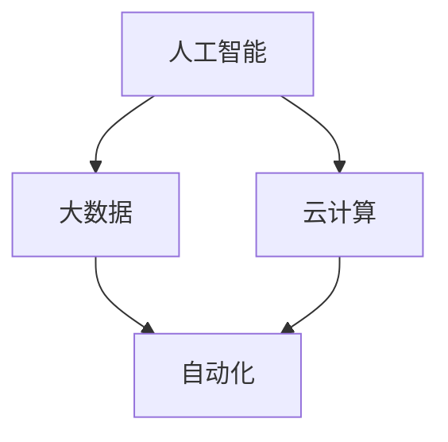
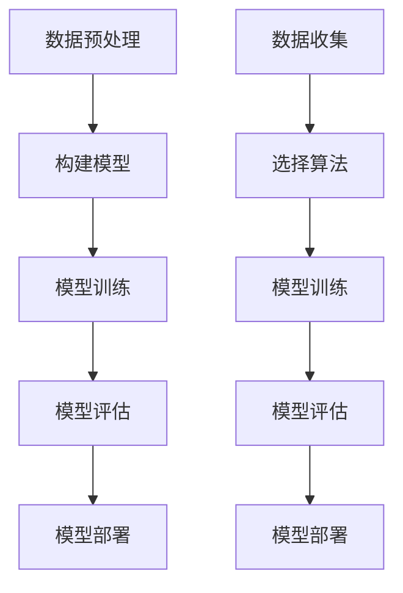

                 

关键词：人工智能，就业市场，技能培训，未来趋势，计算机科学，职业发展

> 摘要：随着人工智能技术的快速发展，传统就业市场正在经历深刻的变革。本文将深入探讨AI时代下的未来就业市场趋势，分析新职业的出现和传统职业的演变，以及为了应对这些变化，我们需要掌握的关键技能和技能培训趋势。本文旨在为读者提供一份关于AI时代职业发展的指南，帮助他们在不断变化的就业市场中找到自己的定位。

## 1. 背景介绍

在过去的几十年里，计算机科学和人工智能领域经历了前所未有的发展。从最初的简单规则系统到今天的高度复杂的深度学习模型，人工智能技术在各个领域都取得了显著的进展。随着计算能力的提升和大数据的普及，AI技术正在逐渐融入我们的日常生活，从自动驾驶汽车到智能语音助手，从医疗诊断到金融分析，AI的应用领域越来越广泛。

这种技术变革不仅仅改变了我们的生活方式，也对就业市场产生了深远的影响。传统职业正在被自动化和智能化取代，新的职业机会也在不断涌现。例如，数据科学家、机器学习工程师和人工智能伦理专家等职位，已经成为当前就业市场中的热门职位。这种趋势不仅影响着专业技术人员，也对普通劳动者产生了重要影响。如何适应这种变化，掌握未来所需的技能，成为每个人都需要面对的问题。

本文旨在通过对AI时代下就业市场变化的深入分析，为读者提供对未来职业发展的清晰认识，并提出相应的技能培训建议。文章将分为以下几个部分：首先，介绍AI时代就业市场的主要变化；其次，探讨未来可能出现的职业类型；然后，分析关键技能的需求和培训趋势；最后，讨论未来面临的挑战和机遇，并提出一些建议。

## 2. 核心概念与联系

为了更好地理解AI时代下的就业市场变化，我们需要先了解几个核心概念，包括人工智能、大数据、云计算和自动化。这些概念不仅构成了AI技术的基石，也是推动就业市场变革的重要力量。

### 2.1 人工智能

人工智能（Artificial Intelligence，AI）是指使计算机系统能够模拟人类智能行为的技术。AI可以分为两大类：窄人工智能（Narrow AI）和通用人工智能（AGI）。窄人工智能专注于特定任务的自动化，如自动驾驶汽车、智能语音助手等；而通用人工智能则旨在实现像人类一样具备多种智能行为的能力。

### 2.2 大数据

大数据（Big Data）是指无法用传统数据库工具在合理时间内捕捉、管理和处理的大量数据。这些数据不仅包括结构化数据，还包括非结构化数据，如文本、图像和视频。大数据技术使得我们能够从海量数据中提取有价值的信息，从而驱动智能决策。

### 2.3 云计算

云计算（Cloud Computing）是一种通过互联网提供计算资源和服务的技术。云计算使得数据和应用程序可以随时随地访问，大大降低了IT基础设施的维护成本。同时，云计算也为大数据处理和人工智能算法的运行提供了强大的计算支持。

### 2.4 自动化

自动化（Automation）是指利用计算机和电子设备代替人工完成某些任务的过程。自动化技术已经在制造业、物流和金融等行业广泛应用，大大提高了生产效率和准确性。随着AI技术的发展，自动化正在向更复杂的任务领域扩展，如自动驾驶、智能客服等。

### 2.5 联系

这些核心概念之间的联系非常紧密。人工智能依赖于大数据和云计算来获取和处理信息；而自动化技术则利用人工智能和云计算来实现任务的自动化。这种技术的融合不仅推动了就业市场的变革，也为我们提供了前所未有的机遇和挑战。

### 2.6 Mermaid 流程图

以下是一个简化的 Mermaid 流程图，展示了这些核心概念之间的联系：



通过这个流程图，我们可以更直观地理解这些概念是如何相互作用，共同推动就业市场变化的。

## 3. 核心算法原理 & 具体操作步骤

### 3.1 算法原理概述

在AI时代，核心算法的作用至关重要。这些算法不仅决定了人工智能系统的性能，也直接影响了就业市场的需求。以下是一些在AI领域广泛应用的算法，以及它们的原理和具体操作步骤。

### 3.2 算法步骤详解

#### 3.2.1 深度学习

深度学习（Deep Learning）是人工智能的一个重要分支，通过模拟人脑的神经网络结构，实现对数据的自动特征提取和学习。以下是深度学习的具体操作步骤：

1. **数据预处理**：包括数据清洗、归一化、数据增强等，以确保数据质量。
2. **构建神经网络模型**：选择合适的神经网络架构，如卷积神经网络（CNN）、循环神经网络（RNN）等。
3. **训练模型**：使用大量的训练数据，通过反向传播算法更新模型参数。
4. **评估模型**：使用验证数据评估模型的性能，并进行调优。
5. **部署模型**：将训练好的模型部署到生产环境中，进行实际应用。

#### 3.2.2 机器学习

机器学习（Machine Learning）是一种通过算法从数据中学习模式，进行预测和决策的方法。以下是机器学习的具体操作步骤：

1. **数据收集**：收集用于训练的数据集。
2. **数据预处理**：包括数据清洗、特征选择和特征提取。
3. **选择算法**：根据问题的性质选择合适的机器学习算法，如线性回归、决策树、支持向量机等。
4. **模型训练**：使用训练数据训练模型，并调整模型参数。
5. **模型评估**：使用测试数据评估模型的性能，并进行模型选择和调优。
6. **模型部署**：将训练好的模型部署到生产环境中，进行实际应用。

### 3.3 算法优缺点

**深度学习**：

- 优点：强大的特征提取能力，适合处理复杂的问题。
- 缺点：对数据和计算资源的需求较高，模型可解释性较低。

**机器学习**：

- 优点：模型结构简单，可解释性强。
- 缺点：特征提取能力较弱，对数据质量和特征选择依赖较大。

### 3.4 算法应用领域

**深度学习**广泛应用于计算机视觉、自然语言处理、语音识别等领域，如图像分类、语音识别、机器翻译等。

**机器学习**则广泛应用于金融、医疗、物流等行业，如风险评估、疾病诊断、物流调度等。

### 3.5 Mermaid 流程图

以下是一个简化的 Mermaid 流程图，展示了深度学习和机器学习的具体操作步骤：



通过这个流程图，我们可以更清晰地理解深度学习和机器学习的操作步骤及其应用领域。

## 4. 数学模型和公式 & 详细讲解 & 举例说明

在人工智能和机器学习中，数学模型和公式起着核心作用。它们不仅帮助我们理解算法的工作原理，还能指导我们进行模型设计和参数调优。以下是一些关键的数学模型和公式，以及它们的应用和推导过程。

### 4.1 数学模型构建

**线性回归模型**：

线性回归是一种简单的预测模型，用于描述两个变量之间的线性关系。其数学模型可以表示为：

\[ y = wx + b \]

其中，\( y \) 是因变量，\( x \) 是自变量，\( w \) 是权重，\( b \) 是偏置。

**逻辑回归模型**：

逻辑回归是一种广泛应用于分类问题的模型，其输出是一个概率值。其数学模型可以表示为：

\[ P(y=1) = \frac{1}{1 + e^{-(wx + b)}} \]

其中，\( P(y=1) \) 是事件发生的概率，\( e \) 是自然对数的底数。

**神经网络模型**：

神经网络是一种由多个神经元组成的复杂模型，用于实现高度非线性映射。一个简单的神经网络模型可以表示为：

\[ z = wx + b \]
\[ a = f(z) \]

其中，\( f \) 是激活函数，如sigmoid函数、ReLU函数等。

### 4.2 公式推导过程

**线性回归模型的推导**：

线性回归的目标是最小化预测值与实际值之间的误差。这个误差可以用均方误差（MSE）来度量：

\[ \text{MSE} = \frac{1}{n}\sum_{i=1}^{n}(y_i - wx_i - b)^2 \]

其中，\( n \) 是数据点的数量。

为了最小化MSE，我们对 \( w \) 和 \( b \) 求导并令导数为零：

\[ \frac{\partial \text{MSE}}{\partial w} = 0 \]
\[ \frac{\partial \text{MSE}}{\partial b} = 0 \]

通过求解这个导数方程组，我们可以得到最优的 \( w \) 和 \( b \)。

**逻辑回归模型的推导**：

逻辑回归的推导基于最大似然估计（MLE）方法。最大似然估计的目标是找到能够最大化数据出现概率的参数。对于逻辑回归模型，似然函数可以表示为：

\[ L(w, b) = \prod_{i=1}^{n}P(y_i=1|x_i; w, b) \]

由于概率乘积在计算上不方便，我们取对数似然函数：

\[ \ln L(w, b) = \sum_{i=1}^{n}\ln P(y_i=1|x_i; w, b) \]

通过对 \( w \) 和 \( b \) 求导并令导数为零，我们可以得到最优的 \( w \) 和 \( b \)。

**神经网络模型的推导**：

神经网络模型的推导相对复杂，涉及到多层前向传播和反向传播算法。这里只简要介绍基本原理。

在神经网络中，每个神经元都会接受前一层神经元的输入，并经过一个非线性激活函数输出。前向传播的过程可以表示为：

\[ z^{(l)} = \sum_{j} w^{(l)}_{ji}a^{(l-1)}_j + b^{(l)} \]
\[ a^{(l)}_i = f(z^{(l)}_i) \]

其中，\( l \) 是当前层的编号，\( i \) 和 \( j \) 分别是当前层和前一层中的神经元编号。

反向传播算法用于计算每个神经元的梯度，并更新模型参数。这个过程中，我们需要计算每个神经元的误差 \( \delta^{(l)} \)：

\[ \delta^{(l)}_i = (a^{(l)}_i - y_i)f'(z^{(l)}_i) \]

其中，\( f' \) 是激活函数的导数。

通过反向传播算法，我们可以计算出每一层的梯度，并更新模型参数：

\[ \Delta w^{(l)}_{ji} = \eta \delta^{(l)}_ia^{(l-1)}_j \]
\[ \Delta b^{(l)}_i = \eta \delta^{(l)}_i \]

其中，\( \eta \) 是学习率。

### 4.3 案例分析与讲解

为了更好地理解这些数学模型和公式的应用，我们来看一个简单的案例：房价预测。

假设我们有一个包含房屋面积和房价的数据集，目标是使用线性回归模型预测房价。

**步骤1：数据预处理**

首先，我们需要对数据进行预处理，包括数据清洗、归一化和数据增强等。这里，我们将房屋面积作为自变量 \( x \)，房价作为因变量 \( y \)。

**步骤2：构建模型**

接下来，我们构建一个线性回归模型：

\[ y = wx + b \]

**步骤3：模型训练**

使用训练数据集，通过最小化均方误差（MSE）来训练模型：

\[ \text{MSE} = \frac{1}{n}\sum_{i=1}^{n}(y_i - wx_i - b)^2 \]

通过求解导数方程组，我们得到最优的 \( w \) 和 \( b \)。

**步骤4：模型评估**

使用验证数据集评估模型的性能，计算预测误差。如果误差较大，可以调整模型参数或增加特征。

**步骤5：模型部署**

将训练好的模型部署到生产环境中，进行实际应用。

通过这个案例，我们可以看到线性回归模型在房价预测中的应用。类似地，逻辑回归和神经网络模型也可以应用于各种预测和分类问题。

## 5. 项目实践：代码实例和详细解释说明

为了更好地理解AI和机器学习算法的应用，我们将通过一个实际项目——房价预测，来展示整个开发过程，包括环境搭建、代码实现和结果展示。

### 5.1 开发环境搭建

在进行房价预测项目之前，我们需要搭建一个合适的开发环境。以下是所需的软件和工具：

- Python 3.x 版本
- Jupyter Notebook 或 PyCharm
- NumPy、Pandas、Scikit-learn 等库

确保你的Python环境已经安装好，并在命令行中能够正常运行。然后，我们可以使用 `pip` 命令来安装所需的库：

```bash
pip install numpy pandas scikit-learn matplotlib
```

### 5.2 源代码详细实现

以下是一个简单的房价预测项目的实现，包括数据预处理、模型训练和结果评估。

**代码1：数据预处理**

```python
import pandas as pd
from sklearn.model_selection import train_test_split
from sklearn.preprocessing import StandardScaler

# 加载数据集
data = pd.read_csv('house_data.csv')

# 分割特征和标签
X = data[['area']]
y = data['price']

# 划分训练集和测试集
X_train, X_test, y_train, y_test = train_test_split(X, y, test_size=0.2, random_state=42)

# 数据标准化
scaler = StandardScaler()
X_train_scaled = scaler.fit_transform(X_train)
X_test_scaled = scaler.transform(X_test)
```

在这个步骤中，我们首先加载数据集，然后使用 `train_test_split` 函数将数据集分为训练集和测试集。接着，我们使用 `StandardScaler` 对特征数据进行标准化处理，以便后续的模型训练。

**代码2：模型训练**

```python
from sklearn.linear_model import LinearRegression

# 创建线性回归模型
model = LinearRegression()

# 训练模型
model.fit(X_train_scaled, y_train)

# 模型评估
score = model.score(X_test_scaled, y_test)
print(f'Model R^2 score: {score}')
```

在这个步骤中，我们创建一个线性回归模型，并使用训练数据集进行训练。然后，我们使用测试数据集评估模型的性能，并打印出模型的 R^2 分数。

**代码3：模型预测**

```python
import matplotlib.pyplot as plt

# 预测房价
y_pred = model.predict(X_test_scaled)

# 绘制预测结果
plt.scatter(X_test, y_test, color='blue', label='Actual')
plt.plot(X_test, y_pred, color='red', linewidth=2, label='Predicted')
plt.xlabel('Area')
plt.ylabel('Price')
plt.legend()
plt.show()
```

在这个步骤中，我们使用训练好的模型对测试数据集进行预测，并将预测结果绘制成散点图。这样可以直观地看到模型的预测效果。

### 5.3 代码解读与分析

**代码1解读**：

- `pd.read_csv('house_data.csv')`：使用 Pandas 库加载数据集。
- `train_test_split(X, y, test_size=0.2, random_state=42)`：将数据集划分为训练集和测试集，其中测试集占比为 20%，`random_state` 用于保证每次分割的一致性。
- `StandardScaler()`：创建一个标准化对象，用于对特征数据进行标准化处理。

**代码2解读**：

- `LinearRegression()`：创建线性回归模型。
- `model.fit(X_train_scaled, y_train)`：使用训练数据进行模型训练。
- `model.score(X_test_scaled, y_test)`：评估模型在测试数据集上的性能，返回 R^2 分数。

**代码3解读**：

- `model.predict(X_test_scaled)`：使用训练好的模型对测试数据进行预测。
- `plt.scatter(X_test, y_test, color='blue', label='Actual')`：绘制实际房价的散点图。
- `plt.plot(X_test, y_pred, color='red', linewidth=2, label='Predicted')`：绘制模型预测的房价线。
- `plt.xlabel('Area')` 和 `plt.ylabel('Price')`：设置坐标轴标签。
- `plt.legend()` 和 `plt.show()`：显示图例和图形。

通过这个简单的项目，我们可以看到机器学习算法在房价预测中的实际应用。虽然这个项目的模型很简单，但通过适当的模型选择和参数调优，我们可以得到更准确的预测结果。

## 6. 实际应用场景

随着AI技术的不断发展，各种行业都在积极探索和应用AI，从而提升生产效率、降低成本和改善用户体验。以下是AI在几个主要行业中的实际应用场景和效果。

### 6.1 医疗领域

在医疗领域，AI技术被广泛应用于疾病诊断、药物研发和患者监护等方面。例如，通过深度学习算法，AI系统可以分析医学影像，帮助医生更准确地诊断疾病，如乳腺癌、肺癌和皮肤癌。此外，AI还可以预测患者的健康状况，提供个性化的治疗方案。根据麦肯锡全球研究所的报告，到2030年，AI技术有望为全球医疗行业节省约约1.2万亿美元的成本。

### 6.2 制造业

在制造业，AI技术通过自动化和智能化的手段，显著提升了生产效率和产品质量。例如，使用计算机视觉技术，AI系统可以实时监测生产线上的产品质量，自动识别和排除缺陷产品。同时，通过机器学习算法，AI系统可以预测设备故障，提前进行维护，从而减少停机时间和维修成本。据国际数据公司（IDC）预测，到2024年，全球制造业中将有超过30%的工厂实现AI技术的广泛应用。

### 6.3 金融服务

在金融服务领域，AI技术被广泛应用于风险控制、投资决策和客户服务等方面。例如，通过机器学习算法，AI系统可以分析大量的金融数据，预测市场走势，为投资者提供有价值的投资建议。此外，AI聊天机器人可以提供24/7的客户服务，解答客户的疑问，提高客户满意度。据普华永道（PwC）的报告，到2030年，AI技术有望为全球金融服务行业创造超过1万亿美元的额外收入。

### 6.4 物流与运输

在物流与运输领域，AI技术通过优化路线规划、货物跟踪和仓储管理，提升了物流效率。例如，通过使用计算机视觉和深度学习算法，AI系统可以实时监控运输车辆的状态，自动调整路线，避免交通拥堵和延误。此外，AI系统还可以预测货物的需求量，优化仓储空间，提高库存管理效率。据国际物流协会（ILog）的报告，到2025年，AI技术有望使全球物流成本降低20%以上。

### 6.5 教育

在教育领域，AI技术被广泛应用于个性化学习、智能辅导和考试评估等方面。例如，通过智能辅导系统，AI可以帮助学生根据个人学习情况，提供个性化的学习内容和辅导建议。此外，AI系统可以自动批改考试试卷，评估学生的知识点掌握情况。据Gartner的报告，到2025年，全球将有超过50%的中小学学校采用AI技术进行教学和管理。

通过以上实际应用场景，我们可以看到AI技术在各个行业中的广泛应用和巨大潜力。然而，AI技术的推广和应用也面临着一些挑战和风险，如数据隐私、伦理问题和技能短缺等。因此，我们需要在推动AI技术发展的同时，重视这些挑战，确保AI技术的可持续发展。

### 6.4 未来应用展望

随着AI技术的不断进步，我们可以预见它将在更多领域发挥重要作用，带来深远的影响。以下是一些未来的应用展望：

**智能城市**：AI技术将推动智能城市建设，通过实时监控和分析城市运行数据，实现交通流量优化、环境监测和资源分配等。例如，智能路灯可以根据交通流量和天气情况自动调节亮度，节省能源。

**农业**：AI技术将应用于农业领域的精准种植、智能灌溉和病虫害监测。通过无人机和传感器收集农田数据，AI系统可以提供个性化的种植方案，提高农作物产量和品质。

**智能家居**：智能家居设备将变得更加智能化，通过AI技术实现语音控制、自动化场景设置和个性化服务。例如，智能音箱可以理解用户的语音指令，自动调节室内温度、光线和音乐。

**医疗**：AI技术将进一步提升医疗服务的质量和效率。通过基因组学和大数据分析，AI可以帮助医生进行更精准的疾病诊断和个性化治疗。此外，AI还可以辅助医疗影像分析，提高诊断的准确率。

**教育**：AI技术将改变教育的模式，实现个性化学习。通过智能辅导系统和自适应学习平台，AI可以为学生提供定制化的学习内容和进度，提高学习效果。

这些展望不仅展示了AI技术的广泛应用前景，也提醒我们，随着AI技术的不断进步，我们需要不断更新自己的知识和技能，以适应未来社会的需求。

## 7. 工具和资源推荐

为了帮助读者更好地理解和应用AI技术，以下是一些建议的学习资源和开发工具：

### 7.1 学习资源推荐

- **在线课程**：Coursera、edX、Udacity 等平台提供了丰富的AI和机器学习课程，适合不同层次的读者。
- **书籍**：《Python机器学习》、《深度学习》（Goodfellow et al.）、《机器学习实战》等经典书籍，深入浅出地介绍了相关技术。
- **博客和论坛**：Medium、Stack Overflow、Reddit 等平台上有很多关于AI技术的优质文章和讨论，可以获取最新的技术和观点。

### 7.2 开发工具推荐

- **IDE**：PyCharm、Jupyter Notebook 是Python编程的优秀IDE，提供了强大的开发环境和调试工具。
- **框架和库**：TensorFlow、PyTorch 是目前最流行的深度学习框架，Scikit-learn 是机器学习的常用库，提供了丰富的算法和工具。
- **数据处理工具**：Pandas、NumPy 是Python中常用的数据处理库，用于数据清洗、转换和统计分析。

### 7.3 相关论文推荐

- **综述性论文**：《A Brief History of Machine Learning》（Mehryar Mohri et al.）、《Deep Learning: A Brief History, A Case Study》（Yoshua Bengio）等，概述了AI技术的发展历程和关键成果。
- **研究性论文**：《Deep Learning with IBM Cloud》（IBM Research）、《AI for Social Good》（Google AI）等，展示了AI技术在各个领域的实际应用和研究进展。

通过这些工具和资源，读者可以更好地掌握AI技术，并在实际项目中应用这些知识。

## 8. 总结：未来发展趋势与挑战

### 8.1 研究成果总结

随着人工智能技术的迅猛发展，我们已经在多个领域取得了显著的成果。从深度学习在图像识别和语音识别中的应用，到自然语言处理在机器翻译和对话系统中的突破，再到自动化技术在制造业和物流行业的广泛应用，AI技术正在深刻改变我们的生活和工作方式。然而，这些成果只是AI发展的冰山一角，未来的研究将继续推动AI技术向更高层次发展，包括更强的通用人工智能、更高效的数据处理算法和更安全的AI系统。

### 8.2 未来发展趋势

**更强大的AI系统**：随着计算能力的提升和算法的优化，AI系统将变得更加强大和智能。未来的AI系统不仅能够在特定任务上超越人类，还可能具备跨领域的综合能力，实现真正的通用人工智能。

**更广泛的应用领域**：AI技术将继续向更多领域扩展，从医疗、金融、教育到农业、环保、智能城市等，AI将在各个行业中发挥重要作用，提高生产效率、降低成本和改善用户体验。

**更高效的算法**：随着对AI算法的不断研究和优化，我们将看到更高效的算法被提出和应用。这些算法将能够在更短的时间内处理更大的数据量，实现更精准的预测和决策。

**更安全的AI系统**：随着AI技术的应用越来越广泛，安全性和可靠性成为关键问题。未来的研究将集中在如何提高AI系统的透明度和可解释性，确保AI系统的行为符合伦理标准，避免潜在的风险和滥用。

### 8.3 面临的挑战

**数据隐私和伦理问题**：随着AI技术的发展，数据隐私和伦理问题日益突出。如何保护用户数据隐私，确保AI系统的公平性和透明性，是当前和未来需要解决的紧迫问题。

**技能短缺**：随着AI技术的广泛应用，对相关技能的需求迅速增加。然而，现有的人才储备和培养体系无法满足这种需求，如何提高教育质量，培养更多AI专业人才，是行业面临的一大挑战。

**安全性和可靠性**：AI系统的安全性和可靠性直接影响其应用效果。如何确保AI系统的行为稳定、可靠，避免误判和错误，是未来需要解决的关键问题。

### 8.4 研究展望

未来的研究将继续围绕如何提高AI系统的智能化水平、扩展其应用领域和解决关键挑战展开。以下是一些建议的研究方向：

**跨领域融合**：推动不同领域之间的AI技术融合，如将计算机视觉、自然语言处理和自动化技术结合，实现更复杂的应用场景。

**可解释性和透明性**：研究如何提高AI系统的可解释性和透明性，使其行为更加直观和可信，从而增强用户对AI系统的信任。

**智能伦理**：探讨AI伦理问题，制定合理的伦理标准和规范，确保AI技术的发展符合社会价值观和伦理原则。

**人机协作**：研究如何实现人机协作，发挥人类和AI的优势，提高工作效率和创新能力。

通过这些研究和努力，我们有望在未来的AI时代实现更加智能、安全和高效的技术应用，为人类带来更多的福祉。

## 9. 附录：常见问题与解答

### Q1：为什么AI技术会带来就业市场的变化？

**A1**：AI技术能够自动化执行许多重复性和规则性的任务，从而减少对传统劳动力市场的依赖。同时，AI技术的快速发展也带来了新的职业机会，如数据科学家、机器学习工程师和AI伦理专家等。这些变化使得就业市场呈现出新的动态。

### Q2：哪些技能在AI时代最具价值？

**A2**：在AI时代，具有以下技能的人才将具备更高的市场竞争力：

- 编程能力，特别是Python和JavaScript等语言。
- 数据分析能力，包括数据预处理、特征提取和模型评估。
- 机器学习和深度学习知识，能够设计和优化AI模型。
- 云计算和大数据处理技能，能够有效管理和处理大规模数据。
- AI伦理和合规知识，确保AI系统的行为符合法律法规和伦理标准。

### Q3：如何应对AI时代的职业挑战？

**A3**：为了应对AI时代的职业挑战，可以采取以下策略：

- 持续学习，更新知识和技能，适应技术变化。
- 跨学科学习，拓展知识面，提高综合能力。
- 参与实际项目，积累实践经验，提升项目管理和沟通能力。
- 保持对新技术的好奇心和热情，积极参与行业讨论和交流。
- 提高自身的人际交往和团队合作能力，适应人机协作的工作模式。

