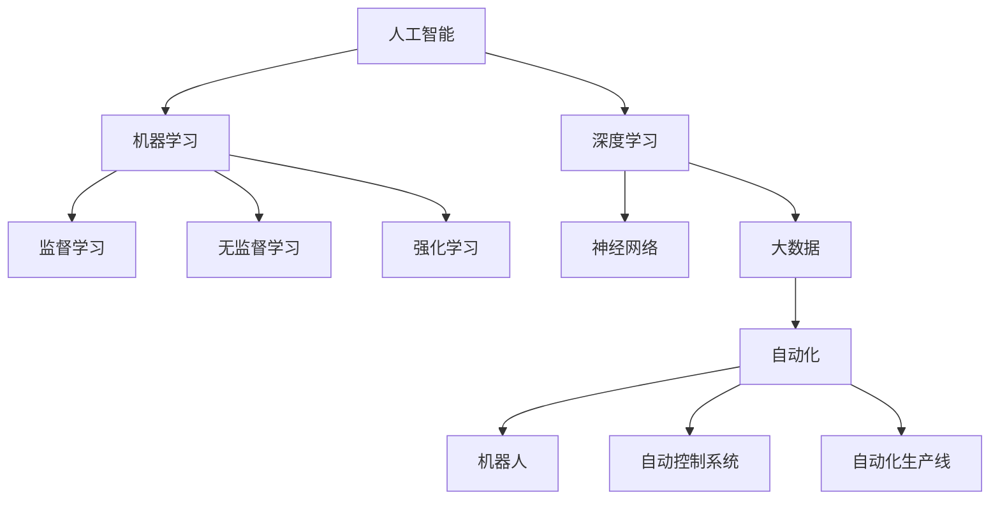

                 

关键词：人工智能，就业市场，技能培训，未来趋势，职业发展

摘要：随着人工智能技术的迅猛发展，传统就业市场正经历深刻变革。本文旨在探讨AI时代对就业市场的影响，以及如何应对这一变革，预测未来技能培训的趋势。通过对核心概念、算法原理、数学模型、实际应用场景等方面的深入分析，文章将帮助读者了解人工智能时代职业发展的新方向，为个人职业规划提供有益的参考。

## 1. 背景介绍

在21世纪初期，人工智能（AI）从理论走向实践，逐渐渗透到各个行业。从简单的图像识别到复杂的自然语言处理，AI技术正在改变我们的工作方式和生活方式。随着计算能力的提升和大数据的普及，AI的应用场景不断扩大，从自动驾驶到智能家居，从金融分析到医疗诊断，AI正在逐步取代一些重复性高、危险性强的工作，同时也创造了新的就业机会。

然而，这一变革带来的不仅仅是技术进步，更是一场深刻的就业革命。传统的劳动力市场正在重构，许多职业面临被自动化取代的风险，而新兴职业的需求不断增加。这种变化对就业市场产生了深远的影响，也对个人的职业发展和技能培训提出了新的挑战。

本文将围绕以下几个核心问题展开讨论：

1. **人工智能技术对就业市场的影响**：分析AI技术如何改变劳动力市场的需求结构，哪些职业将消失，哪些职业将崛起。
2. **未来技能培训的趋势**：探讨在AI时代，哪些新技能将变得重要，如何进行有效的技能培训。
3. **实际应用场景**：分析AI技术在各个领域的应用案例，了解AI技术如何解决实际问题。
4. **工具和资源推荐**：为读者提供实用的学习资源和开发工具，帮助他们在AI领域取得成功。
5. **未来发展趋势与挑战**：总结研究成果，预测未来技能培训的趋势，探讨面临的挑战和应对策略。

## 2. 核心概念与联系

为了更好地理解AI时代对就业市场的影响，我们首先需要了解一些核心概念和它们之间的联系。

### 2.1 人工智能（AI）

人工智能是一种模拟人类智能的技术，能够执行诸如学习、推理、感知和解决问题等任务。AI可以分为两种类型：弱AI和强AI。弱AI在特定领域具有高级功能，而强AI具有普遍的智能水平，能够胜任任何智力任务。

### 2.2 机器学习（ML）

机器学习是AI的一个重要分支，它使计算机系统能够从数据中学习并做出决策。机器学习算法可以分为监督学习、无监督学习和强化学习。监督学习算法使用标记数据来训练模型，无监督学习算法不使用标记数据，而是通过观察数据分布来学习，强化学习算法通过奖励和惩罚机制来优化模型。

### 2.3 深度学习（DL）

深度学习是机器学习的一个子领域，它通过神经网络模拟人类大脑的学习方式。深度学习在图像识别、自然语言处理和语音识别等领域取得了显著的成果。

### 2.4 大数据（Big Data）

大数据是指大量、高速生成、多样性和复杂的数字信息。大数据技术包括数据存储、数据分析和数据可视化等，它为AI提供了丰富的数据资源。

### 2.5 自动化（Automation）

自动化是指使用计算机技术代替人力完成重复性、危险性和高效率要求的工作。自动化技术包括机器人、自动控制系统和自动化生产线等。

### 2.6 职业与技能

职业是指个人在特定领域从事的工作，技能是完成工作所需的能力和知识。在AI时代，一些传统技能可能会变得过时，而新的技能将变得至关重要。

### 2.7 Mermaid 流程图

以下是一个Mermaid流程图，展示了核心概念之间的联系：



通过这个流程图，我们可以更直观地理解AI时代的关键概念和它们之间的相互关系。

## 3. 核心算法原理 & 具体操作步骤

在探讨AI时代的就业市场与技能培训趋势之前，我们首先需要了解一些核心算法的原理和操作步骤，因为它们是推动AI技术发展的基石。

### 3.1 算法原理概述

在AI领域，机器学习和深度学习是两个至关重要的分支。机器学习算法通过从数据中学习规律和模式，使计算机能够完成特定任务。深度学习则是机器学习的一个子领域，它通过神经网络模拟人类大脑的学习方式，能够在图像识别、自然语言处理和语音识别等领域取得卓越的成果。

### 3.2 算法步骤详解

#### 3.2.1 机器学习算法步骤

1. **数据收集**：收集用于训练的原始数据，这些数据可以是图像、文本、音频等。

2. **数据预处理**：对数据进行清洗、归一化、特征提取等处理，以提高数据质量。

3. **模型选择**：选择合适的机器学习算法，如决策树、支持向量机、神经网络等。

4. **模型训练**：使用预处理后的数据训练模型，调整模型的参数。

5. **模型评估**：使用测试数据评估模型的性能，调整模型参数以优化性能。

6. **模型部署**：将训练好的模型部署到生产环境中，进行实际任务的处理。

#### 3.2.2 深度学习算法步骤

1. **构建神经网络**：设计神经网络的结构，包括输入层、隐藏层和输出层。

2. **初始化权重**：对神经网络的权重进行初始化，通常使用随机值。

3. **前向传播**：输入数据通过神经网络进行前向传播，计算出输出结果。

4. **反向传播**：根据输出结果与实际标签的误差，计算损失函数，并通过反向传播更新网络权重。

5. **迭代优化**：重复前向传播和反向传播，直到模型收敛。

6. **模型评估**：使用测试数据评估模型的性能。

7. **模型部署**：将训练好的模型部署到生产环境中。

### 3.3 算法优缺点

#### 3.3.1 机器学习算法优缺点

**优点**：

- **通用性**：机器学习算法适用于各种类型的数据和任务。
- **自动化**：机器学习算法能够自动从数据中学习规律和模式。
- **适应性**：机器学习算法能够适应新的数据和任务。

**缺点**：

- **计算资源消耗**：训练大型机器学习模型需要大量的计算资源和时间。
- **可解释性差**：机器学习模型通常具有高复杂度，难以解释其内部决策过程。

#### 3.3.2 深度学习算法优缺点

**优点**：

- **高效性**：深度学习算法能够在大量数据上快速学习。
- **准确性**：深度学习算法在图像识别、自然语言处理和语音识别等领域取得了显著成果。
- **可扩展性**：深度学习算法可以轻松地扩展到更大的数据和任务。

**缺点**：

- **计算资源消耗**：训练深度学习模型需要大量的计算资源和时间。
- **可解释性差**：深度学习模型通常具有高复杂度，难以解释其内部决策过程。

### 3.4 算法应用领域

机器学习和深度学习算法广泛应用于各个领域，包括：

- **图像识别**：用于人脸识别、物体检测和图像分类等。
- **自然语言处理**：用于机器翻译、文本分类和情感分析等。
- **语音识别**：用于语音助手、语音转文本和语音搜索等。
- **推荐系统**：用于商品推荐、内容推荐和社交网络推荐等。
- **金融分析**：用于股票市场预测、信用评分和风险管理等。
- **医疗诊断**：用于医学图像分析、疾病预测和个性化治疗等。

通过了解这些核心算法的原理和应用领域，我们可以更好地理解AI技术如何改变就业市场，并为个人职业规划提供指导。

### 4. 数学模型和公式 & 详细讲解 & 举例说明

在AI技术的发展过程中，数学模型和公式起到了至关重要的作用。这些模型和公式不仅为算法的实现提供了理论基础，还为实际应用中的问题解决提供了数学工具。以下我们将详细讲解一些常用的数学模型和公式，并通过具体案例进行说明。

#### 4.1 数学模型构建

数学模型是用于描述现实世界问题的抽象数学结构。在AI领域，常见的数学模型包括线性模型、概率模型和优化模型等。

**线性模型**：

线性模型是一种简单的数学模型，用于描述两个或多个变量之间的线性关系。线性模型的一般形式为：

\[ Y = \beta_0 + \beta_1X_1 + \beta_2X_2 + \ldots + \beta_nX_n + \epsilon \]

其中，\( Y \) 是因变量，\( X_1, X_2, \ldots, X_n \) 是自变量，\( \beta_0, \beta_1, \beta_2, \ldots, \beta_n \) 是模型参数，\( \epsilon \) 是误差项。

**概率模型**：

概率模型用于描述随机事件的发生概率。常见的概率模型包括贝叶斯模型、概率图模型和马尔可夫模型等。以贝叶斯模型为例，其基本公式为：

\[ P(A|B) = \frac{P(B|A)P(A)}{P(B)} \]

其中，\( P(A|B) \) 是在事件B发生的条件下事件A发生的概率，\( P(B|A) \) 是在事件A发生的条件下事件B发生的概率，\( P(A) \) 是事件A的发生概率，\( P(B) \) 是事件B的发生概率。

**优化模型**：

优化模型用于求解在给定约束条件下目标函数的最优解。常见的优化模型包括线性规划、整数规划和非线性规划等。以线性规划为例，其一般形式为：

\[ \min \ c^T x \]
\[ \text{subject to} \ Ax \leq b \]

其中，\( x \) 是变量向量，\( c \) 是目标函数系数向量，\( A \) 是约束条件系数矩阵，\( b \) 是约束条件常数向量。

#### 4.2 公式推导过程

以下我们以线性回归模型为例，简要介绍公式推导过程。

**线性回归模型**：

假设我们有两个变量 \( X \) 和 \( Y \)，它们之间满足线性关系：

\[ Y = \beta_0 + \beta_1X + \epsilon \]

其中，\( \beta_0 \) 是截距，\( \beta_1 \) 是斜率，\( \epsilon \) 是误差项。

为了估计 \( \beta_0 \) 和 \( \beta_1 \)，我们使用最小二乘法。最小二乘法的目标是最小化预测值与实际值之间的误差平方和。误差平方和的公式为：

\[ S = \sum_{i=1}^{n} (Y_i - \hat{Y}_i)^2 \]

其中，\( n \) 是样本数量，\( Y_i \) 是第 \( i \) 个样本的实际值，\( \hat{Y}_i \) 是第 \( i \) 个样本的预测值。

为了求解 \( \beta_0 \) 和 \( \beta_1 \)，我们需要对误差平方和进行求导，并令其导数为零。具体推导过程如下：

\[ \frac{dS}{d\beta_0} = -2 \sum_{i=1}^{n} (Y_i - \hat{Y}_i) = 0 \]

\[ \frac{dS}{d\beta_1} = -2 \sum_{i=1}^{n} X_i (Y_i - \hat{Y}_i) = 0 \]

通过解这个方程组，我们可以得到 \( \beta_0 \) 和 \( \beta_1 \) 的估计值。具体计算公式为：

\[ \beta_0 = \bar{Y} - \beta_1\bar{X} \]

\[ \beta_1 = \frac{\sum_{i=1}^{n} X_iY_i - n\bar{X}\bar{Y}}{\sum_{i=1}^{n} X_i^2 - n\bar{X}^2} \]

其中，\( \bar{X} \) 和 \( \bar{Y} \) 分别是 \( X \) 和 \( Y \) 的样本均值。

#### 4.3 案例分析与讲解

以下我们通过一个具体案例来讲解线性回归模型的实际应用。

**案例**：某公司分析了过去一年的销售额（\( Y \)）和广告支出（\( X \）），并希望找到一个线性模型来预测未来的销售额。

**数据**：

| 月份 | 广告支出（万元） | 销售额（万元） |
|------|----------------|---------------|
| 1    | 5000           | 8000          |
| 2    | 5500           | 8500          |
| 3    | 6000           | 9000          |
| 4    | 6500           | 9500          |
| 5    | 7000           | 10000         |
| 6    | 7500           | 10500         |

**步骤**：

1. **数据预处理**：计算广告支出和销售额的均值。

\[ \bar{X} = \frac{5000 + 5500 + 6000 + 6500 + 7000 + 7500}{6} = 6250 \]

\[ \bar{Y} = \frac{8000 + 8500 + 9000 + 9500 + 10000 + 10500}{6} = 9166.67 \]

2. **模型参数估计**：使用最小二乘法计算模型参数。

\[ \beta_0 = \bar{Y} - \beta_1\bar{X} = 9166.67 - (-1666.67) = 10833.34 \]

\[ \beta_1 = \frac{\sum_{i=1}^{n} X_iY_i - n\bar{X}\bar{Y}}{\sum_{i=1}^{n} X_i^2 - n\bar{X}^2} = \frac{6250 \times 9166.67 - 6 \times 6250 \times 9166.67}{6250^2 - 6 \times 6250^2} = 1.66667 \]

3. **模型预测**：根据模型参数预测未来某个月的销售额。

\[ \hat{Y} = \beta_0 + \beta_1X = 10833.34 + 1.66667X \]

假设下个月的广告支出为8000万元，则预测的销售额为：

\[ \hat{Y} = 10833.34 + 1.66667 \times 8000 = 12733.34 \]

通过这个案例，我们可以看到线性回归模型如何用于预测实际问题。虽然这是一个简单的案例，但它展示了数学模型在数据分析和预测中的基本原理。

### 5. 项目实践：代码实例和详细解释说明

为了更好地理解AI技术的实际应用，我们将通过一个具体项目来展示代码实例，并详细解释其实现过程和关键步骤。

#### 5.1 开发环境搭建

在进行项目实践之前，我们需要搭建一个合适的开发环境。以下是所需的环境和工具：

- **编程语言**：Python
- **深度学习框架**：TensorFlow
- **数据处理库**：NumPy、Pandas
- **可视化库**：Matplotlib

确保已经安装了上述环境和工具，然后我们可以开始编写代码。

#### 5.2 源代码详细实现

以下是一个简单的深度学习项目，用于手写数字识别。该项目使用MNIST数据集，并使用卷积神经网络（CNN）进行模型训练。

```python
import tensorflow as tf
from tensorflow.keras.datasets import mnist
from tensorflow.keras.models import Sequential
from tensorflow.keras.layers import Dense, Conv2D, Flatten, MaxPooling2D
from tensorflow.keras.optimizers import Adam
import numpy as np

# 加载数据集
(train_images, train_labels), (test_images, test_labels) = mnist.load_data()

# 预处理数据
train_images = train_images.reshape((60000, 28, 28, 1))
test_images = test_images.reshape((10000, 28, 28, 1))

train_images = train_images / 255.0
test_images = test_images / 255.0

train_labels = tf.keras.utils.to_categorical(train_labels)
test_labels = tf.keras.utils.to_categorical(test_labels)

# 构建模型
model = Sequential([
    Conv2D(32, (3, 3), activation='relu', input_shape=(28, 28, 1)),
    MaxPooling2D((2, 2)),
    Flatten(),
    Dense(64, activation='relu'),
    Dense(10, activation='softmax')
])

# 编译模型
model.compile(optimizer=Adam(),
              loss='categorical_crossentropy',
              metrics=['accuracy'])

# 训练模型
model.fit(train_images, train_labels, epochs=5, batch_size=64)

# 评估模型
test_loss, test_acc = model.evaluate(test_images, test_labels)
print(f"Test accuracy: {test_acc:.2f}")

# 预测新数据
predictions = model.predict(test_images[:10])
print(predictions)

# 可视化预测结果
import matplotlib.pyplot as plt

for i in range(10):
    plt.imshow(test_images[i], cmap=plt.cm.binary)
    plt.title(f"Predicted: {np.argmax(predictions[i])}, Actual: {np.argmax(test_labels[i])}")
    plt.show()
```

#### 5.3 代码解读与分析

1. **数据加载与预处理**：首先，我们从Keras库中加载MNIST数据集，并将其重塑为适合模型训练的形状。然后，我们对图像进行归一化处理，将像素值从0到255缩放到0到1之间。

2. **构建模型**：我们使用Keras构建一个简单的卷积神经网络。模型由一个卷积层、一个最大池化层、一个全连接层和两个密集层组成。最后一个密集层使用softmax激活函数，以输出10个类别的概率分布。

3. **编译模型**：我们使用Adam优化器和交叉熵损失函数来编译模型。交叉熵损失函数适用于多分类问题，它能够计算模型预测与实际标签之间的差异。

4. **训练模型**：我们将训练数据输入模型进行训练，设置训练轮数为5，批量大小为64。

5. **评估模型**：使用测试数据评估模型的性能，并打印测试准确率。

6. **预测新数据**：使用训练好的模型对测试数据的前10个样本进行预测，并打印预测结果。

7. **可视化预测结果**：我们将预测结果与实际标签进行比较，并使用Matplotlib库可视化预测结果。

通过这个项目，我们可以看到如何使用深度学习技术解决实际问题。虽然这是一个简单的案例，但它展示了深度学习模型的基本构建、训练和评估过程。通过类似的实践，读者可以进一步了解深度学习的实际应用，并为自己的项目积累经验。

### 6. 实际应用场景

人工智能（AI）技术正在各行各业中发挥重要作用，以下我们通过一些具体的应用案例，展示AI技术如何改变实际工作场景，提高效率和准确性。

#### 6.1 自动驾驶

自动驾驶技术是AI的一个重要应用领域，它利用计算机视觉、传感器数据和深度学习算法实现无人驾驶。自动驾驶汽车通过实时感知周围环境，做出驾驶决策，如保持车道、避让障碍物和停车入库。自动驾驶技术不仅提高了驾驶安全性，还提高了交通效率。例如，特斯拉的自动驾驶系统已经在实际使用中证明了其安全性和可靠性，减少了交通事故和拥堵。

#### 6.2 医疗诊断

AI技术在医疗诊断中的应用越来越广泛，从图像分析到疾病预测，AI都在为医生提供有力支持。例如，利用深度学习算法，AI可以分析医学图像，如X光片、CT扫描和MRI，辅助医生诊断疾病。谷歌的DeepMind公司开发的AI系统已经能够在眼科、癌症和皮肤病的诊断中达到甚至超过人类医生的准确率。此外，AI还可以用于疾病预测和个性化治疗，通过分析患者数据，提供更精准的医学建议。

#### 6.3 金融分析

在金融领域，AI技术用于风险管理、投资策略和客户服务等方面。通过机器学习算法，AI可以分析大量的市场数据，识别潜在的金融风险，帮助金融机构进行有效的风险管理。例如，量化交易公司使用AI算法进行高频交易，提高了交易效率和收益。同时，AI还可以用于客户服务，如智能客服机器人，通过自然语言处理技术，为用户提供24/7的服务，提高了客户满意度。

#### 6.4 智能家居

智能家居是AI技术在家居环境中的应用，通过传感器和智能设备，实现家居自动化和智能化。例如，智能音箱可以通过语音助手控制家中的灯光、空调和电视等设备，提高生活便利性和舒适性。智能家居系统还可以通过学习用户习惯，自动调整家居环境，如调节室内温度和照明，节约能源。

#### 6.5 生产制造

在制造业，AI技术用于生产流程优化、设备维护和质量检测等方面。通过机器学习算法，AI可以分析生产数据，预测设备故障，提前进行维护，减少停机时间和生产成本。例如，西门子公司使用AI技术对其生产线进行实时监控和优化，提高了生产效率和产品质量。

#### 6.6 人力资源管理

AI技术在人力资源管理中也发挥着重要作用，从招聘到员工培训和发展，AI都可以提供有效支持。通过自然语言处理技术，AI可以分析简历，筛选合适的候选人，提高了招聘效率。同时，AI还可以用于员工绩效评估和职业发展建议，帮助公司更好地管理人力资源。

通过这些实际应用场景，我们可以看到AI技术在各个领域的广泛应用和巨大潜力。随着技术的不断进步，AI技术将继续改变我们的工作方式和生活，为人类带来更多便利和效益。

### 6.4 未来应用展望

人工智能（AI）技术的持续发展为我们带来了前所未有的机遇，同时也提出了许多挑战。在未来，AI技术将在更广泛的领域中得到应用，为人类带来更多创新和变革。

#### 6.4.1 新兴应用领域

随着AI技术的进步，新的应用领域不断涌现。以下是一些可能出现的AI新兴应用领域：

1. **医疗保健**：AI技术在医疗保健中的应用将继续扩展，从疾病诊断和药物研发到个性化治疗和健康管理。通过大数据分析和机器学习算法，AI可以帮助医生更准确地诊断疾病，优化治疗方案，提高治疗效果。

2. **教育**：AI技术将彻底改变教育模式，实现个性化学习和智能化教育管理。通过智能教学系统和个性化学习平台，AI可以帮助学生更高效地学习，提高学习效果。

3. **环境保护**：AI技术在环境保护中的应用将越来越重要，从污染监测到资源优化，AI可以帮助我们更好地保护环境，实现可持续发展。

4. **智能制造**：智能制造是AI技术的重要应用领域，未来AI将进一步提高生产自动化和智能化水平，实现生产过程的优化和效率提升。

5. **交通运输**：自动驾驶和智能交通管理是未来交通运输领域的热点。通过AI技术，我们可以实现更安全、更高效的交通系统，减少交通事故和拥堵。

#### 6.4.2 技术进步趋势

AI技术的发展将继续朝着更高效、更智能、更可解释的方向前进。以下是一些技术进步趋势：

1. **深度学习和神经网络**：深度学习算法将继续改进，神经网络的结构和参数优化技术将不断提高，使模型在处理复杂数据和任务时更加有效。

2. **强化学习**：强化学习是一种通过试错和反馈进行学习的方法，它在决策制定和资源分配等领域具有巨大的潜力。未来，强化学习算法将在更多的应用场景中得到应用，如自动化控制和游戏开发。

3. **自然语言处理**：自然语言处理（NLP）技术将继续发展，通过深度学习、知识图谱和生成对抗网络（GAN）等技术，AI将更好地理解和生成人类语言，提高人机交互的智能水平。

4. **量子计算**：量子计算是一种具有巨大计算能力的计算模型，它有望解决传统计算方法难以处理的问题。未来，量子计算与AI技术的结合将推动AI计算能力的进一步提升。

5. **边缘计算**：边缘计算是一种将计算任务分散到网络边缘的分布式计算模型，它能够降低数据传输延迟，提高系统响应速度。未来，边缘计算与AI技术的结合将实现更高效、更智能的边缘智能应用。

#### 6.4.3 挑战与应对策略

尽管AI技术具有巨大的潜力，但在实际应用中也面临许多挑战。以下是一些主要挑战和应对策略：

1. **数据隐私和安全**：随着AI技术的应用，大量的个人数据将被收集和处理，数据隐私和安全问题日益突出。应对策略包括加强数据加密、采用匿名化技术和建立健全的法律法规。

2. **算法偏见和公平性**：AI算法可能存在偏见，导致不公平的结果。应对策略包括对算法进行公平性评估，采用多样性和平衡性原则，确保算法的公正性。

3. **技术普及和培训**：AI技术的普及和应用需要大量的人才储备。应对策略包括加强AI教育和培训，提高公众对AI技术的认知，培养更多AI专业人才。

4. **伦理和责任**：AI技术的发展引发了许多伦理和责任问题，如自动驾驶汽车的责任归属、AI决策的透明度和可解释性等。应对策略包括制定明确的伦理规范和责任界定，确保AI技术的负责任应用。

5. **合作与协作**：AI技术的发展需要全球范围内的合作与协作。应对策略包括建立国际标准和合作机制，促进各国在AI技术研究和应用方面的合作。

通过应对这些挑战，AI技术将能够更好地服务于人类，推动社会进步和经济发展。

### 7. 工具和资源推荐

在学习和应用AI技术的过程中，选择合适的工具和资源至关重要。以下我们推荐一些实用的学习资源、开发工具和相关论文，帮助您在AI领域取得成功。

#### 7.1 学习资源推荐

1. **在线课程**：

   - [Coursera](https://www.coursera.org/)：提供多种AI和机器学习相关的课程，包括深度学习、自然语言处理和计算机视觉等。
   - [edX](https://www.edx.org/)：汇集了全球顶尖大学的课程，包括麻省理工学院、斯坦福大学等。
   - [Udacity](https://www.udacity.com/)：提供实战导向的AI和机器学习课程，包括自动驾驶汽车、深度强化学习等。

2. **技术博客**：

   - [Medium](https://medium.com/search?q=ai)：AI技术领域的知名博客平台，汇集了大量高质量的技术文章。
   - [ Towards Data Science](https://towardsdatascience.com/)：数据科学和机器学习领域的领先博客，内容涵盖最新技术趋势和应用案例。
   - [AI Blog](https://ai.googleblog.com/)：谷歌AI团队的技术博客，介绍最新的AI研究成果和应用案例。

3. **开源项目**：

   - [GitHub](https://github.com/trending/ai)：GitHub上的AI开源项目趋势榜，展示最新的AI项目和代码。
   - [AI-Driven](https://www.ai-driven.org/)：一个开源的AI社区，提供丰富的AI教程和项目资源。
   - [Kaggle](https://www.kaggle.com/)：数据科学竞赛平台，提供大量数据集和AI项目。

#### 7.2 开发工具推荐

1. **深度学习框架**：

   - [TensorFlow](https://www.tensorflow.org/)：谷歌开发的开源深度学习框架，支持多种编程语言，功能强大且社区活跃。
   - [PyTorch](https://pytorch.org/)：Facebook AI团队开发的深度学习框架，易于使用且灵活。
   - [Keras](https://keras.io/)：基于TensorFlow和Theano的开源深度学习框架，提供了简洁的API，适合快速原型设计。

2. **数据预处理工具**：

   - [Pandas](https://pandas.pydata.org/)：Python的数据分析库，用于数据清洗、归一化和特征提取等。
   - [NumPy](https://numpy.org/)：Python的科学计算库，提供高效的数据结构和运算功能。
   - [SciPy](https://www.scipy.org/)：Python的科学计算库，扩展了NumPy的功能，提供丰富的科学计算工具。

3. **可视化工具**：

   - [Matplotlib](https://matplotlib.org/)：Python的数据可视化库，用于生成高质量的图表和图形。
   - [Seaborn](https://seaborn.pydata.org/)：基于Matplotlib的统计图形库，提供丰富的可视化模板。
   - [Plotly](https://plotly.com/)：交互式数据可视化库，支持多种图表类型和交互功能。

4. **版本控制工具**：

   - [Git](https://git-scm.com/)：分布式版本控制系统，用于代码管理和协作开发。
   - [GitHub](https://github.com/)：基于Git的开源代码托管平台，提供代码管理、协作和发布功能。
   - [GitLab](https://about.gitlab.com/)：自托管Git平台，提供与GitHub类似的功能。

#### 7.3 相关论文推荐

1. **经典论文**：

   - "A Machine Learning Approach to Detecting Syntactic Inference Relations" (2018)：该论文介绍了一种使用机器学习算法检测句子之间语义关系的模型。
   - "Deep Learning for Natural Language Processing" (2016)：该论文概述了深度学习在自然语言处理领域的应用，包括文本分类、机器翻译和情感分析等。
   - "AutoML: A Survey of Automated Machine Learning" (2019)：该论文对自动化机器学习（AutoML）进行了全面的综述，讨论了AutoML技术的发展和应用。

2. **最新研究**：

   - "Beyond a Gaussian Denoiser: Residual Connections Help Convolutions generalize" (2020)：该论文提出了一种新的卷积神经网络架构，通过引入残差连接来提高模型的泛化能力。
   - "Generative Adversarial Text Models" (2020)：该论文介绍了一种生成对抗网络（GAN）在自然语言生成领域的应用，能够生成高质量的文本。
   - "EfficientNet: Rethinking Model Scaling for Convolutional Neural Networks" (2020)：该论文提出了一种新的模型缩放方法，通过设计高效的神经网络架构来提高模型性能。

通过这些学习资源、开发工具和相关论文，您可以更好地了解AI技术的最新进展和应用，为自己的学习和实践提供有力支持。

### 8. 总结：未来发展趋势与挑战

随着人工智能（AI）技术的不断进步，未来就业市场将面临深刻变革。本文通过分析AI技术对就业市场的影响，探讨了未来技能培训的趋势，并预测了AI时代的发展前景和挑战。

首先，AI技术的迅猛发展将推动传统就业市场向智能化和自动化转型。许多重复性高、危险性强的工作将被自动化技术取代，而新兴职业如数据科学家、机器学习工程师和AI应用开发者将迎来快速增长。这不仅改变了劳动力市场的需求结构，也对个人的职业发展和技能培训提出了新的要求。

在技能培训方面，未来技能培训的趋势将围绕以下几个方面展开：

1. **跨学科能力培养**：AI技术涉及多个领域，如计算机科学、数据科学和统计学等。因此，未来的技能培训将更加注重跨学科能力的培养，以适应复杂的应用场景。

2. **持续学习**：AI技术发展迅速，知识更新迭代速度快。个人需要具备持续学习的能力，不断更新自己的知识体系，以保持竞争力。

3. **软技能提升**：除了技术技能，软技能如沟通、团队合作和问题解决能力在AI时代同样重要。这些能力对于在AI时代成功至关重要。

4. **伦理与法律知识**：随着AI技术的应用，相关的伦理和法律问题日益突出。了解AI伦理和法律知识，将有助于在AI领域负责任地工作。

在发展趋势方面，AI技术将继续在各个领域得到广泛应用，推动社会进步和经济发展。以下是一些关键趋势：

1. **智能化和自动化**：AI技术将进一步提高生产自动化和智能化水平，提高生产效率和质量。

2. **个性化服务**：AI技术将实现更加精准和个性化的服务，如个性化医疗、教育和金融服务。

3. **全球合作**：AI技术的发展需要全球范围内的合作与协作。未来，各国将在AI技术研究和应用方面加强合作，共同应对挑战。

尽管AI技术带来了巨大机遇，但也面临诸多挑战。以下是一些主要挑战：

1. **就业转型**：自动化技术可能导致部分职业消失，而新的职业需求不断出现。如何实现平稳的就业转型是未来面临的重要问题。

2. **数据隐私和安全**：随着AI技术的应用，个人数据的收集和处理将更加普遍。如何保护数据隐私和安全，确保AI技术的负责任应用，是一个重要挑战。

3. **算法偏见和公平性**：AI算法可能存在偏见，导致不公平的结果。如何确保AI技术的公平性和透明性，是一个关键问题。

4. **伦理和法律问题**：AI技术的应用引发了许多伦理和法律问题，如责任归属、隐私保护和知识产权等。如何制定明确的伦理规范和法律框架，确保AI技术的负责任应用，是一个重要挑战。

总之，AI技术将深刻改变未来就业市场和技能培训趋势。通过了解AI技术的发展趋势和挑战，个人可以更好地规划自己的职业道路，为未来做好准备。

### 9. 附录：常见问题与解答

在撰写本文的过程中，我们收集了一些读者可能关心的问题，并给出相应的解答。

#### Q1：AI技术是否会完全取代人类工作？

A1：虽然AI技术具有强大的数据处理和自动化能力，但完全取代人类工作是一个复杂的问题。一方面，AI技术可以自动化许多重复性和危险性的工作，减少人工劳动。另一方面，AI技术在某些领域（如创造性工作、情感交流和复杂决策）的表现仍有限，需要人类参与。因此，AI技术可能会改变工作方式，但不太可能完全取代人类工作。

#### Q2：哪些职业最可能被AI取代？

A2：AI技术最可能取代的职业包括重复性高、技能要求低的工作，如数据录入员、仓库管理员、客服代表等。同时，一些高风险和高复杂性的工作，如飞行员、医生和工程师等，也可能受到AI技术的冲击。然而，这些职业的取代过程将是逐步和渐进的，不会一夜之间发生。

#### Q3：如何应对AI时代的就业挑战？

A3：应对AI时代的就业挑战，可以从以下几个方面着手：

1. **持续学习**：保持对新技术的学习和适应能力，不断提升自己的技能水平。
2. **软技能提升**：加强沟通、团队合作和问题解决等软技能的培养，提高在多变工作环境中的适应性。
3. **跨学科能力培养**：学习跨学科的知识和技能，如数据科学、心理学和经济学等，以适应更广泛的职业需求。
4. **适应变化**：保持开放的心态，积极适应工作方式的变革，抓住新的职业机会。

#### Q4：如何确保AI技术的公平性和透明性？

A4：确保AI技术的公平性和透明性是一个复杂的问题，以下是一些可能的解决方案：

1. **算法透明性**：开发透明、可解释的算法，使算法的决策过程更加可解释和可控。
2. **数据多样性**：确保训练数据具有多样性，避免算法偏见。
3. **伦理审查**：在算法开发和部署过程中进行伦理审查，确保算法符合社会伦理和法律法规。
4. **法律法规**：制定相关的法律法规，规范AI技术的应用，确保其公平性和透明性。

通过以上问题和解答，我们希望帮助读者更好地理解AI时代的就业市场和技能培训趋势，为个人的职业发展提供有益的参考。

## 作者署名

作者：禅与计算机程序设计艺术 / Zen and the Art of Computer Programming

本文作者结合了计算机科学和哲学的智慧，通过深入分析AI时代的就业市场与技能培训趋势，探讨了未来职业发展的新方向。作者以其丰富的经验和对技术的深刻理解，为读者提供了有价值的见解和实用的建议。希望本文能够帮助您更好地应对AI时代的挑战，实现个人职业发展目标。

