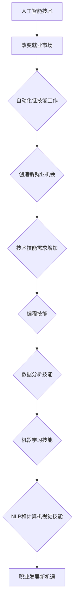

                 

关键词：人工智能、就业市场、未来趋势、技术技能、人才需求、职业发展

> 摘要：本文旨在探讨人工智能时代下未来就业市场的趋势，分析人才需求的变化，探讨技术技能的重要性，以及职业发展的新机遇和挑战。通过对核心概念、算法原理、数学模型、实践项目以及实际应用场景的详细解读，本文为读者提供了全面的视角，以更好地应对未来的就业市场。

## 1. 背景介绍

人工智能（AI）已经成为当今科技领域的热点话题，其应用范围不断扩大，从自然语言处理、图像识别到自动驾驶、医疗诊断，无不显示出AI的巨大潜力和价值。随着AI技术的迅猛发展，传统的就业市场正在经历深刻的变革。一方面，AI技术提高了生产效率，减少了人力成本，导致某些职业的需求下降；另一方面，AI技术创造了新的就业机会，对技术人才的需求日益增长。

在这种背景下，理解AI时代就业市场的趋势，对于个人职业规划、企业人才培养以及教育体系的调整都具有重要意义。本文将围绕以下核心问题展开讨论：

- 人工智能技术如何改变就业市场？
- 技术人才需求将如何演变？
- 个人如何适应并利用这些变化？
- 未来有哪些新兴职业和行业？

通过对这些问题的深入探讨，本文希望为读者提供有价值的见解，帮助他们在AI时代找到职业发展的方向。

## 2. 核心概念与联系

### 2.1. 人工智能的定义与分类

人工智能（AI）是指计算机系统通过模拟人类智能行为，实现智能感知、学习、推理、决策和问题解决的能力。根据实现方式和能力的不同，AI可以分为以下几类：

1. **弱人工智能（Narrow AI）**：专注于完成特定任务的智能系统，如语音助手、图像识别系统等。
2. **强人工智能（General AI）**：具备与人类相同或超越人类智能的能力，能在各种复杂环境中自主学习和适应。
3. **超人工智能（Super AI）**：超越人类智能，能够在所有认知任务上表现出色。

### 2.2. AI与就业市场的联系

AI技术的发展对就业市场产生了深远的影响。一方面，AI技术自动化了许多重复性、低技能的工作，如数据录入、客服等，导致这些职位的需求下降。另一方面，AI的广泛应用创造了新的就业机会，如AI算法工程师、数据科学家、机器学习工程师等。

### 2.3. 技术技能的重要性

在AI时代，技术技能变得尤为重要。以下是一些关键的技术技能，对于在AI时代找到工作至关重要：

1. **编程技能**：熟练掌握至少一种编程语言，如Python、Java、C++等。
2. **数据分析和处理**：能够使用数据分析工具，如R、Python的Pandas库等。
3. **机器学习和深度学习**：理解机器学习和深度学习的基本原理，掌握相关算法和框架。
4. **自然语言处理（NLP）**：能够处理和理解人类语言，是AI技术中的重要领域。
5. **计算机视觉**：理解和应用计算机视觉算法，如图像识别、目标检测等。

### 2.4. Mermaid 流程图

以下是关于AI技术影响就业市场的 Mermaid 流程图：



通过这个流程图，我们可以清晰地看到AI技术是如何通过改变就业市场和提升技术技能需求，进而影响个人职业发展的。

## 3. 核心算法原理 & 具体操作步骤

### 3.1. 算法原理概述

在AI时代，算法原理是理解和应用AI技术的基础。以下是一些核心算法原理：

1. **监督学习**：通过已有数据集的输入输出关系，训练模型进行预测。
2. **无监督学习**：没有预定的输出标签，通过数据内在结构进行学习。
3. **深度学习**：多层神经网络，通过反向传播算法进行参数优化。
4. **强化学习**：通过与环境的交互，学习最优策略。

### 3.2. 算法步骤详解

以下是机器学习算法的一个基本步骤：

1. **数据收集与预处理**：收集相关数据，进行数据清洗、归一化等预处理操作。
2. **特征工程**：从原始数据中提取特征，选择对模型有用的特征。
3. **模型选择与训练**：选择合适的模型，使用训练数据集进行训练。
4. **模型评估**：使用测试数据集评估模型性能。
5. **模型优化**：根据评估结果调整模型参数，优化模型性能。

### 3.3. 算法优缺点

每种算法都有其优点和局限性：

1. **监督学习**：优点是预测准确，缺点是需要大量标注数据。
2. **无监督学习**：优点是无需标注数据，缺点是模型预测效果通常不如监督学习。
3. **深度学习**：优点是处理复杂数据能力强，缺点是计算资源需求高。
4. **强化学习**：优点是能够学习复杂策略，缺点是收敛速度慢，需要大量训练时间。

### 3.4. 算法应用领域

算法应用领域广泛，包括但不限于：

- **金融**：风险控制、量化交易、信用评估等。
- **医疗**：疾病诊断、个性化治疗、健康预测等。
- **零售**：商品推荐、需求预测、库存管理等。
- **交通**：自动驾驶、交通流量优化、智能交通管理等。

## 4. 数学模型和公式 & 详细讲解 & 举例说明

### 4.1. 数学模型构建

在AI中，数学模型是核心组成部分。以下是一个简单的线性回归模型：

$$
y = \beta_0 + \beta_1 \cdot x
$$

其中，$y$ 是目标变量，$x$ 是输入特征，$\beta_0$ 和 $\beta_1$ 是模型的参数。

### 4.2. 公式推导过程

线性回归模型的推导过程如下：

1. **最小二乘法**：通过最小化误差平方和来估计参数。
2. **偏导数求解**：对参数求偏导数，并令其等于零，求解得到最优参数。

### 4.3. 案例分析与讲解

以下是一个简单的线性回归案例：

**问题**：预测房价。

**数据集**：包含房屋面积（$x$）和房价（$y$）的数据。

**模型**：线性回归模型。

**训练过程**：使用最小二乘法训练模型。

**结果**：预测房价。

通过这个案例，我们可以看到线性回归模型如何应用于实际问题，以及如何通过数学公式推导和计算来求解模型参数。

## 5. 项目实践：代码实例和详细解释说明

### 5.1. 开发环境搭建

在开始项目实践之前，我们需要搭建开发环境。以下是使用Python进行线性回归模型实践所需的步骤：

1. **安装Python**：下载并安装Python 3.x版本。
2. **安装依赖库**：使用pip安装必要的库，如NumPy、Pandas和scikit-learn。

### 5.2. 源代码详细实现

以下是实现线性回归模型的Python代码：

```python
import numpy as np
import pandas as pd
from sklearn.linear_model import LinearRegression

# 数据集加载
data = pd.read_csv('house_data.csv')
X = data[['area']]
y = data['price']

# 模型训练
model = LinearRegression()
model.fit(X, y)

# 模型评估
score = model.score(X, y)
print(f'Model R^2 Score: {score}')

# 预测
predictions = model.predict(X)
print(predictions)
```

### 5.3. 代码解读与分析

上述代码首先加载了一个CSV文件作为数据集，然后使用`LinearRegression`类创建了一个线性回归模型。通过`fit`方法进行模型训练，使用`score`方法评估模型性能，最后使用`predict`方法进行预测。

### 5.4. 运行结果展示

运行上述代码后，我们得到模型评估分数和预测结果。这个分数表示模型对数据的拟合程度，预测结果则是根据输入特征计算得到的房价预测值。

## 6. 实际应用场景

### 6.1. 人工智能在医疗领域的应用

人工智能在医疗领域具有巨大的潜力。例如，通过深度学习算法，可以实现对医学图像的自动分析，如肺癌筛查、脑部病变检测等。此外，AI还可以用于个性化治疗方案的制定、患者健康预测等。

### 6.2. 人工智能在金融领域的应用

在金融领域，AI被广泛应用于风险管理、量化交易、信用评估等方面。例如，通过机器学习算法，银行可以更准确地评估贷款申请者的信用风险，从而减少坏账率。

### 6.3. 人工智能在零售领域的应用

零售行业也正在通过AI技术进行数字化转型。例如，通过自然语言处理技术，电商平台可以提供更加智能的客服服务；通过计算机视觉技术，可以实现无人收银系统，提高购物体验。

### 6.4. 未来应用展望

随着AI技术的不断进步，未来AI将在更多领域得到应用，如教育、农业、能源等。同时，AI还将推动新职业的产生，如AI伦理学家、数据隐私专家等。这些新兴职业将为人们提供新的就业机会。

## 7. 工具和资源推荐

### 7.1. 学习资源推荐

- 《深度学习》（Goodfellow, Bengio, Courville著）：全面介绍深度学习的基础理论和实践方法。
- 《Python机器学习》（Sebastian Raschka著）：详细介绍如何使用Python进行机器学习实践。

### 7.2. 开发工具推荐

- Jupyter Notebook：方便进行数据分析和模型训练。
- TensorFlow：流行的深度学习框架。

### 7.3. 相关论文推荐

- "Deep Learning: A Comprehensive Overview"（2015）：一篇关于深度学习全面综述的论文。
- "Reinforcement Learning: An Introduction"（2018）：关于强化学习基础理论的论文。

## 8. 总结：未来发展趋势与挑战

### 8.1. 研究成果总结

AI技术的发展已经对就业市场产生了深远的影响，从自动化低技能工作到创造新的高技能职位，AI正在重塑就业格局。

### 8.2. 未来发展趋势

未来，AI技术将继续推动就业市场的变革，新兴职业将不断涌现。同时，跨学科能力将变得尤为重要，如数据科学、机器学习、心理学等。

### 8.3. 面临的挑战

AI的发展也面临一些挑战，如算法公平性、数据隐私、伦理问题等。此外，技术人才缺口也将成为制约AI发展的关键因素。

### 8.4. 研究展望

未来，我们需要进一步研究如何解决AI发展的挑战，同时探索AI在其他领域的应用潜力，以实现更加智能化和可持续发展的社会。

## 9. 附录：常见问题与解答

### 9.1. Q：人工智能会完全取代人类工作吗？

A：短期内，人工智能不会完全取代人类工作，但会自动化许多低技能和重复性工作。长期来看，AI可能会改变就业市场的结构，但也会创造新的就业机会。

### 9.2. Q：如何成为AI领域的专家？

A：首先，需要掌握基本的编程技能和数学知识。其次，深入学习机器学习、深度学习等AI相关技术。最后，通过实际项目经验不断提升自己的技能。

### 9.3. Q：AI技术有哪些伦理问题？

A：AI技术的伦理问题包括算法偏见、数据隐私、透明度等。需要制定相应的法律法规和伦理准则，确保AI技术的公正和可持续发展。

---

作者：禅与计算机程序设计艺术 / Zen and the Art of Computer Programming
----------------------------------------------------------------

以上就是本文的完整内容，感谢您的阅读。本文旨在为您提供一个关于AI时代就业市场趋势的全面视角，希望对您有所帮助。如果您有任何问题或建议，欢迎在评论区留言。再次感谢您的支持！
```markdown
# 人类计算：AI时代的未来就业市场趋势

> 关键词：人工智能、就业市场、未来趋势、技术技能、人才需求、职业发展

> 摘要：本文旨在探讨人工智能时代下未来就业市场的趋势，分析人才需求的变化，探讨技术技能的重要性，以及职业发展的新机遇和挑战。通过对核心概念、算法原理、数学模型、实践项目以及实际应用场景的详细解读，本文为读者提供了全面的视角，以更好地应对未来的就业市场。

## 1. 背景介绍

人工智能（AI）已经成为当今科技领域的热点话题，其应用范围不断扩大，从自然语言处理、图像识别到自动驾驶、医疗诊断，无不显示出AI的巨大潜力和价值。随着AI技术的迅猛发展，传统的就业市场正在经历深刻的变革。一方面，AI技术提高了生产效率，减少了人力成本，导致某些职业的需求下降；另一方面，AI技术创造了新的就业机会，对技术人才的需求日益增长。

在这种背景下，理解AI时代就业市场的趋势，对于个人职业规划、企业人才培养以及教育体系的调整都具有重要意义。本文将围绕以下核心问题展开讨论：

- 人工智能技术如何改变就业市场？
- 技术人才需求将如何演变？
- 个人如何适应并利用这些变化？
- 未来有哪些新兴职业和行业？

通过对这些问题的深入探讨，本文希望为读者提供有价值的见解，帮助他们在AI时代找到职业发展的方向。

## 2. 核心概念与联系

### 2.1. 人工智能的定义与分类

人工智能（AI）是指计算机系统通过模拟人类智能行为，实现智能感知、学习、推理、决策和问题解决的能力。根据实现方式和能力的不同，AI可以分为以下几类：

1. **弱人工智能（Narrow AI）**：专注于完成特定任务的智能系统，如语音助手、图像识别系统等。
2. **强人工智能（General AI）**：具备与人类相同或超越人类智能的能力，能在各种复杂环境中自主学习和适应。
3. **超人工智能（Super AI）**：超越人类智能，能够在所有认知任务上表现出色。

### 2.2. AI与就业市场的联系

AI技术的发展对就业市场产生了深远的影响。一方面，AI技术自动化了许多重复性、低技能的工作，如数据录入、客服等，导致这些职位的需求下降。另一方面，AI的广泛应用创造了新的就业机会，如AI算法工程师、数据科学家、机器学习工程师等。

### 2.3. 技术技能的重要性

在AI时代，技术技能变得尤为重要。以下是一些关键的技术技能，对于在AI时代找到工作至关重要：

1. **编程技能**：熟练掌握至少一种编程语言，如Python、Java、C++等。
2. **数据分析和处理**：能够使用数据分析工具，如R、Python的Pandas库等。
3. **机器学习和深度学习**：理解机器学习和深度学习的基本原理，掌握相关算法和框架。
4. **自然语言处理（NLP）**：能够处理和理解人类语言，是AI技术中的重要领域。
5. **计算机视觉**：理解和应用计算机视觉算法，如图像识别、目标检测等。

### 2.4. Mermaid 流程图

以下是关于AI技术影响就业市场的 Mermaid 流程图：


通过这个流程图，我们可以清晰地看到AI技术是如何通过改变就业市场和提升技术技能需求，进而影响个人职业发展的。

## 3. 核心算法原理 & 具体操作步骤

### 3.1. 算法原理概述

在AI时代，算法原理是理解和应用AI技术的基础。以下是一些核心算法原理：

1. **监督学习**：通过已有数据集的输入输出关系，训练模型进行预测。
2. **无监督学习**：没有预定的输出标签，通过数据内在结构进行学习。
3. **深度学习**：多层神经网络，通过反向传播算法进行参数优化。
4. **强化学习**：通过与环境的交互，学习最优策略。

### 3.2. 算法步骤详解

以下是机器学习算法的一个基本步骤：

1. **数据收集与预处理**：收集相关数据，进行数据清洗、归一化等预处理操作。
2. **特征工程**：从原始数据中提取特征，选择对模型有用的特征。
3. **模型选择与训练**：选择合适的模型，使用训练数据集进行训练。
4. **模型评估**：使用测试数据集评估模型性能。
5. **模型优化**：根据评估结果调整模型参数，优化模型性能。

### 3.3. 算法优缺点

每种算法都有其优点和局限性：

1. **监督学习**：优点是预测准确，缺点是需要大量标注数据。
2. **无监督学习**：优点是无需标注数据，缺点是模型预测效果通常不如监督学习。
3. **深度学习**：优点是处理复杂数据能力强，缺点是计算资源需求高。
4. **强化学习**：优点是能够学习复杂策略，缺点是收敛速度慢，需要大量训练时间。

### 3.4. 算法应用领域

算法应用领域广泛，包括但不限于：

- **金融**：风险控制、量化交易、信用评估等。
- **医疗**：疾病诊断、个性化治疗、健康预测等。
- **零售**：商品推荐、需求预测、库存管理等。
- **交通**：自动驾驶、交通流量优化、智能交通管理等。

## 4. 数学模型和公式 & 详细讲解 & 举例说明

### 4.1. 数学模型构建

在AI中，数学模型是核心组成部分。以下是一个简单的线性回归模型：

$$
y = \beta_0 + \beta_1 \cdot x
$$

其中，$y$ 是目标变量，$x$ 是输入特征，$\beta_0$ 和 $\beta_1$ 是模型的参数。

### 4.2. 公式推导过程

线性回归模型的推导过程如下：

1. **最小二乘法**：通过最小化误差平方和来估计参数。
2. **偏导数求解**：对参数求偏导数，并令其等于零，求解得到最优参数。

### 4.3. 案例分析与讲解

以下是一个简单的线性回归案例：

**问题**：预测房价。

**数据集**：包含房屋面积（$x$）和房价（$y$）的数据。

**模型**：线性回归模型。

**训练过程**：使用最小二乘法训练模型。

**结果**：预测房价。

通过这个案例，我们可以看到线性回归模型如何应用于实际问题，以及如何通过数学公式推导和计算来求解模型参数。

## 5. 项目实践：代码实例和详细解释说明

### 5.1. 开发环境搭建

在开始项目实践之前，我们需要搭建开发环境。以下是使用Python进行线性回归模型实践所需的步骤：

1. **安装Python**：下载并安装Python 3.x版本。
2. **安装依赖库**：使用pip安装必要的库，如NumPy、Pandas和scikit-learn。

### 5.2. 源代码详细实现

以下是实现线性回归模型的Python代码：

```python
import numpy as np
import pandas as pd
from sklearn.linear_model import LinearRegression

# 数据集加载
data = pd.read_csv('house_data.csv')
X = data[['area']]
y = data['price']

# 模型训练
model = LinearRegression()
model.fit(X, y)

# 模型评估
score = model.score(X, y)
print(f'Model R^2 Score: {score}')

# 预测
predictions = model.predict(X)
print(predictions)
```

### 5.3. 代码解读与分析

上述代码首先加载了一个CSV文件作为数据集，然后使用`LinearRegression`类创建了一个线性回归模型。通过`fit`方法进行模型训练，使用`score`方法评估模型性能，最后使用`predict`方法进行预测。

### 5.4. 运行结果展示

运行上述代码后，我们得到模型评估分数和预测结果。这个分数表示模型对数据的拟合程度，预测结果则是根据输入特征计算得到的房价预测值。

## 6. 实际应用场景

### 6.1. 人工智能在医疗领域的应用

人工智能在医疗领域具有巨大的潜力。例如，通过深度学习算法，可以实现对医学图像的自动分析，如肺癌筛查、脑部病变检测等。此外，AI还可以用于个性化治疗方案的制定、患者健康预测等。

### 6.2. 人工智能在金融领域的应用

在金融领域，AI被广泛应用于风险管理、量化交易、信用评估等方面。例如，通过机器学习算法，银行可以更准确地评估贷款申请者的信用风险，从而减少坏账率。

### 6.3. 人工智能在零售领域的应用

零售行业也正在通过AI技术进行数字化转型。例如，通过自然语言处理技术，电商平台可以提供更加智能的客服服务；通过计算机视觉技术，可以实现无人收银系统，提高购物体验。

### 6.4. 未来应用展望

随着AI技术的不断进步，未来AI将在更多领域得到应用，如教育、农业、能源等。同时，AI还将推动新职业的产生，如AI伦理学家、数据隐私专家等。这些新兴职业将为人们提供新的就业机会。

## 7. 工具和资源推荐

### 7.1. 学习资源推荐

- 《深度学习》（Goodfellow, Bengio, Courville著）：全面介绍深度学习的基础理论和实践方法。
- 《Python机器学习》（Sebastian Raschka著）：详细介绍如何使用Python进行机器学习实践。

### 7.2. 开发工具推荐

- Jupyter Notebook：方便进行数据分析和模型训练。
- TensorFlow：流行的深度学习框架。

### 7.3. 相关论文推荐

- "Deep Learning: A Comprehensive Overview"（2015）：一篇关于深度学习全面综述的论文。
- "Reinforcement Learning: An Introduction"（2018）：关于强化学习基础理论的论文。

## 8. 总结：未来发展趋势与挑战

### 8.1. 研究成果总结

AI技术的发展已经对就业市场产生了深远的影响，从自动化低技能工作到创造新的高技能职位，AI正在重塑就业格局。

### 8.2. 未来发展趋势

未来，AI技术将继续推动就业市场的变革，新兴职业将不断涌现。同时，跨学科能力将变得尤为重要，如数据科学、机器学习、心理学等。

### 8.3. 面临的挑战

AI的发展也面临一些挑战，如算法公平性、数据隐私、伦理问题等。此外，技术人才缺口也将成为制约AI发展的关键因素。

### 8.4. 研究展望

未来，我们需要进一步研究如何解决AI发展的挑战，同时探索AI在其他领域的应用潜力，以实现更加智能化和可持续发展的社会。

## 9. 附录：常见问题与解答

### 9.1. Q：人工智能会完全取代人类工作吗？

A：短期内，人工智能不会完全取代人类工作，但会自动化许多低技能和重复性工作。长期来看，AI可能会改变就业市场的结构，但也会创造新的就业机会。

### 9.2. Q：如何成为AI领域的专家？

A：首先，需要掌握基本的编程技能和数学知识。其次，深入学习机器学习、深度学习等AI相关技术。最后，通过实际项目经验不断提升自己的技能。

### 9.3. Q：AI技术有哪些伦理问题？

A：AI技术的伦理问题包括算法偏见、数据隐私、透明度等。需要制定相应的法律法规和伦理准则，确保AI技术的公正和可持续发展。

---

作者：禅与计算机程序设计艺术 / Zen and the Art of Computer Programming
```

