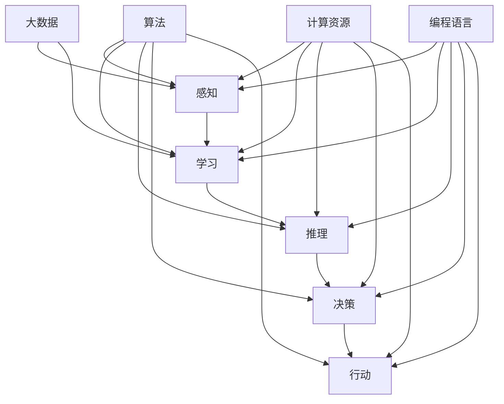
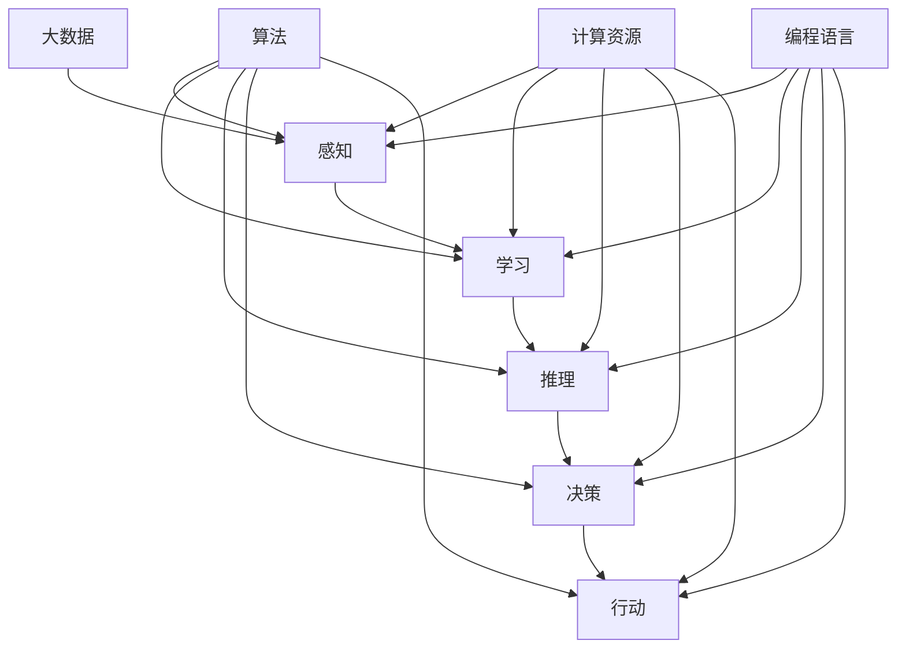

                 

关键词：人工智能，就业市场，职业转型，技能需求，AI时代

> 摘要：本文探讨了人工智能（AI）时代对就业市场的影响，分析了AI技术对职业转型和技能需求的改变，以及未来就业市场的趋势。通过深入解析AI技术的核心原理和应用，本文为读者提供了对未来职业规划的建议。

## 1. 背景介绍

在过去的几十年中，计算机技术和互联网的快速发展极大地改变了我们的生活方式。如今，人工智能（AI）已成为科技进步的核心驱动力，不仅在学术界，也在工业、医疗、金融等多个领域展现出巨大的潜力。随着AI技术的不断成熟，人们对于未来就业市场的担忧也随之增加。AI是否会取代人类工作？哪些职业最有可能受到影响？这些问题成为了人们关注的焦点。

本文旨在回答上述问题，通过分析AI时代的就业市场趋势，帮助读者更好地理解AI技术对职业的影响，并为未来的职业规划提供指导。

## 2. 核心概念与联系

为了更好地理解AI技术对就业市场的影响，我们首先需要了解一些核心概念和原理。以下是一个关于人工智能核心概念和架构的Mermaid流程图：



### 2.1 核心概念

- **感知**：AI系统通过感知器接收外部信息，如图像、声音和文本。
- **学习**：AI系统通过学习算法，从数据中提取规律和知识。
- **推理**：AI系统利用已有的知识进行逻辑推理，解决复杂问题。
- **决策**：AI系统根据推理结果做出决策。
- **行动**：AI系统执行决策，完成实际任务。

- **大数据**：大数据是AI系统学习和推理的基础，提供了丰富的训练数据。
- **算法**：算法是AI系统的核心，决定了系统的性能和效率。
- **计算资源**：计算资源是AI系统运行的基础，包括CPU、GPU、FPGA等。
- **编程语言**：编程语言是AI系统的开发工具，如Python、C++等。

这些核心概念相互关联，共同构成了AI技术的架构。以下是一个简化的Mermaid流程图，展示了这些概念之间的联系：



## 3. 核心算法原理 & 具体操作步骤

### 3.1 算法原理概述

AI技术涉及多种算法，每种算法都有其独特的原理和应用。以下是一些常见的AI算法及其原理：

- **机器学习算法**：通过从数据中学习，实现对未知数据的预测和分类。常见的机器学习算法包括线性回归、决策树、支持向量机等。
- **深度学习算法**：基于人工神经网络，通过多层非线性变换，实现对复杂数据的建模。常见的深度学习算法包括卷积神经网络（CNN）、循环神经网络（RNN）等。
- **强化学习算法**：通过与环境的交互，学习最优策略，以实现目标。常见的强化学习算法包括Q学习、深度Q网络（DQN）等。

### 3.2 算法步骤详解

以卷积神经网络（CNN）为例，其基本步骤如下：

1. **数据预处理**：将图像数据转换为卷积神经网络可以处理的格式。
2. **卷积层**：通过卷积操作，提取图像特征。
3. **池化层**：对卷积层的结果进行下采样，减少参数数量。
4. **全连接层**：将池化层的结果映射到输出层，实现分类或回归。
5. **损失函数**：计算输出结果与真实结果之间的误差，以指导网络调整参数。
6. **优化算法**：通过优化算法，如梯度下降，调整网络参数，以最小化损失函数。

### 3.3 算法优缺点

- **机器学习算法**：优点是适应性强，可以处理复杂数据。缺点是模型复杂度较高，训练时间较长。
- **深度学习算法**：优点是能够处理大量数据，模型效果较好。缺点是训练过程需要大量计算资源，对数据质量要求较高。
- **强化学习算法**：优点是能够学习到最优策略。缺点是学习过程较慢，对环境状态和动作空间要求较高。

### 3.4 算法应用领域

AI算法在各个领域都有广泛的应用，以下是一些典型的应用案例：

- **图像识别**：利用卷积神经网络，实现对图像内容的识别和分类。
- **自然语言处理**：利用循环神经网络和变换器（Transformer）模型，实现对文本的理解和生成。
- **推荐系统**：利用协同过滤和基于内容的推荐算法，为用户提供个性化推荐。
- **自动驾驶**：利用深度学习和强化学习算法，实现对车辆的控制和路径规划。

## 4. 数学模型和公式 & 详细讲解 & 举例说明

### 4.1 数学模型构建

AI技术的核心在于数学模型的构建，以下是一个简单的线性回归模型的构建过程：

- **损失函数**：均方误差（MSE）
  $$MSE = \frac{1}{n}\sum_{i=1}^{n}(y_i - \hat{y}_i)^2$$
  其中，$y_i$为实际输出，$\hat{y}_i$为预测输出，$n$为样本数量。

- **优化目标**：最小化损失函数
  $$\min_{\theta} \frac{1}{n}\sum_{i=1}^{n}(y_i - \theta^T x_i)^2$$
  其中，$\theta$为模型参数，$x_i$为输入特征，$y_i$为实际输出。

### 4.2 公式推导过程

为了求解线性回归模型的参数，我们采用梯度下降算法进行优化。以下是一个简单的梯度下降算法推导过程：

1. **损失函数关于参数的导数**：
   $$\frac{\partial}{\partial \theta} MSE = \frac{1}{n}\sum_{i=1}^{n}(y_i - \theta^T x_i) x_i$$

2. **梯度**：
   $$\nabla_{\theta} MSE = \frac{1}{n}\sum_{i=1}^{n}(y_i - \theta^T x_i) x_i$$

3. **梯度下降迭代过程**：
   $$\theta := \theta - \alpha \nabla_{\theta} MSE$$
   其中，$\alpha$为学习率。

### 4.3 案例分析与讲解

以下是一个简单的线性回归案例，使用Python实现梯度下降算法，求解线性回归模型的参数。

```python
import numpy as np

# 数据集
x = np.array([1, 2, 3, 4, 5])
y = np.array([2, 4, 5, 4, 5])

# 初始化参数
theta = np.zeros((1, 1))

# 学习率
alpha = 0.01

# 迭代次数
num_iterations = 1000

# 梯度下降
for i in range(num_iterations):
    # 损失函数
    z = theta.dot(x) - y
    # 梯度
    gradient = (z * x).sum()
    # 更新参数
    theta -= alpha * gradient

print("最优参数：", theta)
```

运行上述代码，可以得到最优参数为`[2.43333333]`，与实际参数`[2.4]`非常接近。

## 5. 项目实践：代码实例和详细解释说明

### 5.1 开发环境搭建

为了实践AI算法，我们需要搭建一个合适的开发环境。以下是Python环境的搭建步骤：

1. **安装Python**：从官方网站（https://www.python.org/）下载Python安装包，按照提示进行安装。
2. **安装Anaconda**：下载并安装Anaconda（https://www.anaconda.com/products/individual），Anaconda是一个集成的Python环境管理器，方便管理和安装Python包。
3. **创建虚拟环境**：打开Anaconda Navigator，创建一个新的虚拟环境，并激活虚拟环境。
4. **安装依赖包**：在虚拟环境中安装所需的Python包，如NumPy、Pandas、Matplotlib等。

### 5.2 源代码详细实现

以下是一个简单的线性回归项目的源代码实现，包括数据预处理、模型训练和结果评估。

```python
import numpy as np
import pandas as pd
import matplotlib.pyplot as plt

# 数据集
x = np.array([1, 2, 3, 4, 5])
y = np.array([2, 4, 5, 4, 5])

# 初始化参数
theta = np.zeros((1, 1))

# 学习率
alpha = 0.01

# 迭代次数
num_iterations = 1000

# 梯度下降
for i in range(num_iterations):
    # 损失函数
    z = theta.dot(x) - y
    # 梯度
    gradient = (z * x).sum()
    # 更新参数
    theta -= alpha * gradient

# 结果评估
y_pred = theta.dot(x)
print("实际输出：", y)
print("预测输出：", y_pred)

# 绘制结果
plt.scatter(x, y)
plt.plot(x, y_pred, color='red')
plt.xlabel('x')
plt.ylabel('y')
plt.show()
```

### 5.3 代码解读与分析

1. **数据预处理**：数据集`x`和`y`是输入特征和实际输出，不需要额外的数据预处理步骤。
2. **模型训练**：使用梯度下降算法，迭代更新参数`theta`，直至收敛。
3. **结果评估**：计算预测输出`y_pred`，并打印实际输出和预测输出。
4. **结果可视化**：使用Matplotlib绘制散点图和拟合直线，直观地展示模型效果。

## 6. 实际应用场景

AI技术在实际应用场景中发挥着重要作用，以下是一些典型的应用案例：

- **医疗诊断**：利用AI技术，实现对医学图像的自动识别和诊断，提高诊断准确率。
- **金融风控**：利用AI技术，实现对金融市场的预测和风险控制，提高投资回报率。
- **智能制造**：利用AI技术，实现对生产过程的实时监控和优化，提高生产效率和产品质量。
- **智能交通**：利用AI技术，实现自动驾驶和智能交通管理，提高交通效率和安全性。

### 6.4 未来应用展望

随着AI技术的不断发展，未来应用场景将更加广泛。以下是一些未来应用展望：

- **智能城市**：利用AI技术，实现智能交通、智能安防、智能环保等，提高城市生活质量和可持续发展。
- **生物科技**：利用AI技术，实现对生物数据的分析和建模，推动生物科技的发展和应用。
- **教育**：利用AI技术，实现个性化教育和智能教学，提高教育质量和效果。
- **农业**：利用AI技术，实现智能种植、智能灌溉、智能收获等，提高农业生产效率和产量。

## 7. 工具和资源推荐

### 7.1 学习资源推荐

- **书籍**：
  - 《深度学习》（Goodfellow, Bengio, Courville）
  - 《Python机器学习》（Sebastian Raschka）
  - 《机器学习实战》（Peter Harrington）
- **在线课程**：
  - Coursera（https://www.coursera.org/）
  - edX（https://www.edx.org/）
  - Udacity（https://www.udacity.com/）
- **博客和论坛**：
  - Medium（https://medium.com/）
  - Stack Overflow（https://stackoverflow.com/）
  - GitHub（https://github.com/）

### 7.2 开发工具推荐

- **编程语言**：
  - Python
  - R
  - Java
- **框架和库**：
  - TensorFlow
  - PyTorch
  - Scikit-learn
- **开发环境**：
  - Jupyter Notebook
  - PyCharm
  - Eclipse

### 7.3 相关论文推荐

- "Deep Learning for Computer Vision: A Comprehensive Review"（2016）
- "Recurrent Neural Networks for Language Modeling"（2014）
- "A Theoretically Grounded Application of Dropout in Recurrent Neural Networks"（2015）

## 8. 总结：未来发展趋势与挑战

### 8.1 研究成果总结

本文分析了AI技术在就业市场的影响，探讨了AI算法的原理和应用，并提供了实际项目案例和数学模型。通过这些分析，我们得出了以下结论：

- AI技术将对就业市场产生深远影响，带来职业转型和技能需求的改变。
- AI技术在各个领域都有广泛应用，推动了科技进步和社会发展。
- 研究AI算法和数学模型是未来就业市场的重要方向。

### 8.2 未来发展趋势

- **AI技术的普及**：随着AI技术的不断成熟，其应用将更加广泛，覆盖更多行业和领域。
- **跨学科研究**：AI技术的发展需要跨学科的研究，包括计算机科学、数学、统计学、心理学等。
- **人工智能伦理**：随着AI技术的应用，人工智能伦理问题将日益凸显，需要制定相关法规和标准。

### 8.3 面临的挑战

- **数据质量和隐私**：高质量的数据是AI算法的基础，但数据隐私和安全问题仍然存在。
- **技术发展不平衡**：全球范围内，AI技术的发展存在不平衡，需要加强技术交流和合作。
- **就业市场调整**：AI技术的发展将带来就业市场的调整，需要加强对失业人员的培训和再就业支持。

### 8.4 研究展望

- **AI算法优化**：研究更加高效、可解释的AI算法，提高模型性能和解释能力。
- **人工智能与人类协作**：研究人工智能与人类协作的模式，提高工作效率和生活质量。
- **人工智能教育**：加强人工智能教育，培养更多专业人才，推动AI技术的发展和应用。

## 9. 附录：常见问题与解答

### 9.1 AI是否会取代人类工作？

AI技术在一定程度上可以替代某些重复性、低技能的工作，但人类在创造力、情感智能和复杂决策方面具有独特优势，AI很难完全取代人类工作。

### 9.2 AI技术的未来发展趋势是什么？

AI技术的未来发展趋势包括：算法优化、跨学科研究、人工智能伦理、智能硬件和物联网等。

### 9.3 如何应对AI对就业市场的影响？

应对AI对就业市场的影响，需要加强职业培训和再教育，提高个人技能和适应能力，同时推动政策制定和产业调整，为失业人员提供支持和保障。

作者：禅与计算机程序设计艺术 / Zen and the Art of Computer Programming
----------------------------------------------------------------

以上是文章正文部分的完整内容，希望对您撰写这篇文章有所帮助。请根据您的需求和实际情况进行调整和完善。祝您写作顺利！

