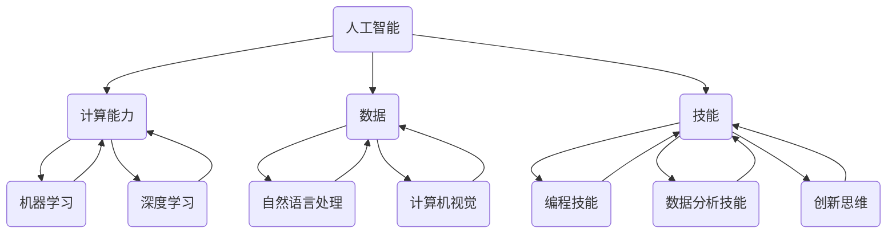

                 

关键词：人工智能，未来技能，技能发展，AI时代，计算能力

摘要：本文将探讨AI时代下人类计算能力的演变，分析未来技能发展的趋势和挑战，并提出针对这些挑战的应对策略。通过深入研究，我们希望能够为读者提供一个全面而实用的指导，帮助他们更好地适应和利用AI技术。

## 1. 背景介绍

人工智能（AI）作为计算机科学的重要分支，自诞生以来便以其快速发展和广泛应用引起了全球的广泛关注。随着深度学习、自然语言处理、计算机视觉等技术的突破，AI已经深入到了我们日常生活的方方面面，从智能手机助手到自动驾驶汽车，从智能医疗诊断到金融风险控制，AI的应用无处不在。

然而，AI的发展也带来了前所未有的挑战。一方面，AI技术的高效率和处理能力使得人类某些工作变得过时，甚至被机器取代。另一方面，AI技术的普及和应用也对人类的技能提出了新的要求，我们需要不断学习和适应，才能在这个新的技术时代中保持竞争力。

本文将围绕以下问题展开讨论：

- AI时代下，人类计算能力将如何演变？
- 未来技能发展将面临哪些挑战？
- 我们应该如何应对这些挑战，提升自己的计算能力？

通过分析这些问题，我们希望能够为读者提供一个清晰而实用的指南，帮助他们更好地理解和应对AI时代的挑战。

## 2. 核心概念与联系

在深入探讨AI时代的未来技能发展之前，我们需要明确几个核心概念，并理解它们之间的联系。以下是几个关键概念及其相互关系：

### 2.1 人工智能（AI）

人工智能是指计算机系统通过模拟人类智能行为，如学习、推理、感知和决策，实现智能行为的技术。它包括多个子领域，如机器学习、深度学习、自然语言处理和计算机视觉等。

### 2.2 计算能力

计算能力是指计算机系统在处理数据、执行计算和完成任务时的效率和效果。随着AI技术的发展，计算能力的要求也在不断提升。

### 2.3 数据

数据是AI发展的基础。无论是机器学习模型训练，还是深度学习网络优化，都需要大量高质量的数据。数据的质量和数量直接影响到AI系统的性能。

### 2.4 技能

技能是指人类在特定领域内的知识和能力。在AI时代，技能的要求正在发生变化，我们需要具备新的技能来适应和利用AI技术。

### 2.5 联系

人工智能与计算能力、数据、技能之间存在紧密的联系。AI技术的发展依赖于计算能力的提升和数据的质量，而技能的发展又反过来推动AI技术的应用和普及。

下面是一个Mermaid流程图，展示了这些核心概念之间的相互关系：



通过这个流程图，我们可以清晰地看到各个核心概念之间的相互影响和作用。这为我们理解AI时代的未来技能发展提供了重要的理论基础。

## 3. 核心算法原理 & 具体操作步骤

在探讨AI时代的未来技能发展时，我们不可避免地要提到一些核心算法原理。这些算法不仅在学术研究中具有极高的价值，也在实际应用中发挥着关键作用。以下是几个核心算法的原理概述和具体操作步骤。

### 3.1 算法原理概述

#### 深度学习

深度学习是AI的一个子领域，它通过多层神经网络模型，模拟人类大脑的神经网络结构，实现数据的自动学习和特征提取。深度学习算法主要包括卷积神经网络（CNN）、循环神经网络（RNN）和生成对抗网络（GAN）等。

#### 机器学习

机器学习是一种通过数据训练模型，使模型具备自动学习和预测能力的方法。常见的机器学习算法有线性回归、支持向量机（SVM）、决策树和随机森林等。

#### 自然语言处理

自然语言处理（NLP）是AI领域的一个分支，它致力于使计算机能够理解、处理和生成自然语言。NLP算法包括词向量模型（如Word2Vec、GloVe）、序列标注模型（如CRF）和语言生成模型（如BERT、GPT）等。

#### 计算机视觉

计算机视觉是AI领域的另一个重要分支，它致力于使计算机能够从图像或视频中提取有用信息。计算机视觉算法包括特征提取（如SIFT、HOG）、目标检测（如YOLO、SSD）和图像生成（如GAN）等。

### 3.2 算法步骤详解

#### 深度学习

1. 数据准备：收集并预处理数据，包括图像、文本或音频等。
2. 构建模型：选择合适的神经网络架构，如CNN、RNN或GAN等。
3. 模型训练：使用训练数据对模型进行训练，通过反向传播算法不断调整模型参数。
4. 模型评估：使用验证数据对模型进行评估，调整模型参数以优化性能。
5. 模型应用：将训练好的模型应用到实际问题中，如图像分类、文本生成或目标检测等。

#### 机器学习

1. 数据准备：收集并预处理数据，包括特征提取和归一化等。
2. 选择模型：根据问题性质选择合适的机器学习算法，如线性回归、支持向量机或决策树等。
3. 模型训练：使用训练数据对模型进行训练，通过调整模型参数优化性能。
4. 模型评估：使用验证数据对模型进行评估，调整模型参数以优化性能。
5. 模型应用：将训练好的模型应用到实际问题中，如分类、回归或预测等。

#### 自然语言处理

1. 数据准备：收集并预处理文本数据，包括分词、去停用词和词向量化等。
2. 构建模型：选择合适的NLP模型，如词向量模型、序列标注模型或语言生成模型等。
3. 模型训练：使用训练数据对模型进行训练，通过调整模型参数优化性能。
4. 模型评估：使用验证数据对模型进行评估，调整模型参数以优化性能。
5. 模型应用：将训练好的模型应用到实际问题中，如文本分类、情感分析或机器翻译等。

#### 计算机视觉

1. 数据准备：收集并预处理图像数据，包括特征提取和归一化等。
2. 构建模型：选择合适的计算机视觉模型，如特征提取模型、目标检测模型或图像生成模型等。
3. 模型训练：使用训练数据对模型进行训练，通过调整模型参数优化性能。
4. 模型评估：使用验证数据对模型进行评估，调整模型参数以优化性能。
5. 模型应用：将训练好的模型应用到实际问题中，如图像分类、目标检测或图像生成等。

### 3.3 算法优缺点

#### 深度学习

优点：强大的特征提取能力，适用于复杂的非线性问题。

缺点：训练过程复杂，对数据质量要求高，易过拟合。

#### 机器学习

优点：理论基础扎实，适用范围广，易于实现。

缺点：特征工程复杂，对数据质量要求高，易过拟合。

#### 自然语言处理

优点：能够处理复杂的文本数据，适用范围广。

缺点：对数据质量要求高，训练过程复杂，易过拟合。

#### 计算机视觉

优点：能够处理复杂的图像数据，适用范围广。

缺点：对数据质量要求高，训练过程复杂，易过拟合。

### 3.4 算法应用领域

#### 深度学习

应用领域：图像分类、目标检测、语音识别、自然语言处理等。

#### 机器学习

应用领域：分类、回归、预测、推荐系统等。

#### 自然语言处理

应用领域：文本分类、情感分析、机器翻译、问答系统等。

#### 计算机视觉

应用领域：图像分类、目标检测、图像分割、图像生成等。

## 4. 数学模型和公式 & 详细讲解 & 举例说明

在AI领域，数学模型和公式是理解和应用算法的基础。本文将介绍几个核心的数学模型和公式，并详细讲解它们的推导过程和实际应用。

### 4.1 数学模型构建

#### 深度学习

深度学习中的多层感知机（MLP）是一个基础的数学模型。它的基本形式为：

$$
y = \sigma(W_n \cdot a_{n-1} + b_n)
$$

其中，$y$ 表示输出，$\sigma$ 表示激活函数（如Sigmoid、ReLU），$W_n$ 和 $b_n$ 分别表示权重和偏置。

#### 机器学习

线性回归是最常见的机器学习模型。它的公式为：

$$
y = \beta_0 + \beta_1 x
$$

其中，$y$ 表示预测值，$x$ 表示输入特征，$\beta_0$ 和 $\beta_1$ 分别表示模型的参数。

#### 自然语言处理

词向量模型（如Word2Vec）是一种将文本转换为向量的模型。它的基本公式为：

$$
\vec{w}_i = \frac{\sum_{j \in \text{context}(i)} \vec{w}_j v_j}{\sum_{j \in \text{context}(i)} v_j}
$$

其中，$\vec{w}_i$ 表示词向量，$\text{context}(i)$ 表示词 $i$ 的上下文，$v_j$ 表示上下文词的权重。

#### 计算机视觉

卷积神经网络（CNN）中的卷积操作是一个基础的数学模型。它的公式为：

$$
\vec{z}_i = \sum_{j} W_{ij} \cdot \vec{a}_{i,j} + b_i
$$

其中，$\vec{z}_i$ 表示卷积结果，$W_{ij}$ 表示权重，$\vec{a}_{i,j}$ 表示输入特征，$b_i$ 表示偏置。

### 4.2 公式推导过程

#### 深度学习

多层感知机的推导过程涉及矩阵和向量的运算。假设我们有一个 $d$ 维的输入向量 $\vec{x}$，以及一个 $n$ 维的权重矩阵 $W$ 和一个偏置向量 $b$，则输出向量 $y$ 的计算过程如下：

$$
\vec{a} = \sigma(W \cdot \vec{x} + b)
$$

其中，$\sigma$ 表示激活函数。

#### 机器学习

线性回归的推导过程基于最小二乘法。假设我们有 $m$ 个样本点 $(x_i, y_i)$，则预测值 $y$ 的计算过程如下：

$$
y = \beta_0 + \beta_1 x
$$

为了找到最佳的 $\beta_0$ 和 $\beta_1$，我们需要最小化预测误差的平方和：

$$
J(\beta_0, \beta_1) = \sum_{i=1}^m (y_i - (\beta_0 + \beta_1 x_i))^2
$$

通过对 $J$ 求偏导并令其等于0，我们可以得到：

$$
\beta_0 = \bar{y} - \beta_1 \bar{x}
$$

$$
\beta_1 = \frac{\sum_{i=1}^m (x_i - \bar{x})(y_i - \bar{y})}{\sum_{i=1}^m (x_i - \bar{x})^2}
$$

#### 自然语言处理

词向量模型的推导过程基于分布式假设。假设词 $i$ 的上下文为 $\text{context}(i) = \{w_1, w_2, ..., w_n\}$，则词向量 $\vec{w}_i$ 的计算过程如下：

$$
\vec{w}_i = \frac{\sum_{j \in \text{context}(i)} \vec{w}_j v_j}{\sum_{j \in \text{context}(i)} v_j}
$$

其中，$v_j$ 表示上下文词 $j$ 的权重，可以通过训练数据统计得到。

#### 计算机视觉

卷积神经网络的推导过程涉及卷积和池化操作。假设输入特征为 $A$，卷积核为 $W$，偏置为 $b$，则卷积操作的公式为：

$$
\vec{z}_i = \sum_{j} W_{ij} \cdot \vec{a}_{i,j} + b_i
$$

其中，$\vec{z}_i$ 表示卷积结果，$\vec{a}_{i,j}$ 表示输入特征。

### 4.3 案例分析与讲解

为了更好地理解上述数学模型和公式，我们通过一个简单的案例进行说明。

#### 深度学习案例

假设我们有一个二分类问题，输入特征为 $x = [1, 2, 3]$，权重矩阵为 $W = \begin{bmatrix} 1 & 0 \\ 0 & 1 \end{bmatrix}$，偏置为 $b = [0, 0]$。激活函数为 Sigmoid 函数：

$$
\sigma(x) = \frac{1}{1 + e^{-x}}
$$

则输出向量为：

$$
\vec{a} = \sigma(W \cdot \vec{x} + b) = \sigma(\begin{bmatrix} 1 & 0 \\ 0 & 1 \end{bmatrix} \cdot \begin{bmatrix} 1 \\ 2 \\ 3 \end{bmatrix} + \begin{bmatrix} 0 \\ 0 \end{bmatrix}) = \begin{bmatrix} 0.7311 \\ 0.2689 \end{bmatrix}
$$

#### 机器学习案例

假设我们有一个线性回归问题，输入特征为 $x = [1, 2]$，模型参数为 $\beta_0 = 1$，$\beta_1 = 1$。则预测值为：

$$
y = \beta_0 + \beta_1 x = 1 + 1 \cdot [1, 2] = [2, 3]
$$

#### 自然语言处理案例

假设我们有一个文本分类问题，词 $i$ 的上下文为 $\text{context}(i) = \{w_1, w_2, w_3\}$，权重为 $v_1 = 0.2$，$v_2 = 0.5$，$v_3 = 0.3$。则词向量 $\vec{w}_i$ 的计算过程为：

$$
\vec{w}_i = \frac{\sum_{j \in \text{context}(i)} \vec{w}_j v_j}{\sum_{j \in \text{context}(i)} v_j} = \frac{\vec{w}_1 \cdot 0.2 + \vec{w}_2 \cdot 0.5 + \vec{w}_3 \cdot 0.3}{0.2 + 0.5 + 0.3} = \frac{\begin{bmatrix} 1 \\ 1 \end{bmatrix} \cdot 0.2 + \begin{bmatrix} 0 \\ 1 \end{bmatrix} \cdot 0.5 + \begin{bmatrix} 1 \\ 0 \end{bmatrix} \cdot 0.3}{0.2 + 0.5 + 0.3} = \begin{bmatrix} 0.5 \\ 0.8 \end{bmatrix}
$$

#### 计算机视觉案例

假设我们有一个卷积神经网络，输入特征为 $A = \begin{bmatrix} 1 & 1 & 1 \\ 1 & 1 & 1 \\ 1 & 1 & 1 \end{bmatrix}$，卷积核为 $W = \begin{bmatrix} 1 & 1 \\ 1 & 1 \end{bmatrix}$，偏置为 $b = 0$。则卷积操作的结果为：

$$
\vec{z}_i = \sum_{j} W_{ij} \cdot \vec{a}_{i,j} + b_i = (1 \cdot 1 + 1 \cdot 1 + 1 \cdot 1) + (1 \cdot 1 + 1 \cdot 1 + 1 \cdot 1) + (1 \cdot 1 + 1 \cdot 1 + 1 \cdot 1) = 9
$$

通过这个案例，我们可以看到数学模型和公式在实际应用中的具体操作过程。

## 5. 项目实践：代码实例和详细解释说明

为了更好地理解上述算法和数学模型，我们通过一个具体的项目实践来展示代码实现和详细解释。这里，我们选择一个简单的深度学习项目——使用TensorFlow和Keras实现一个简单的神经网络，对MNIST手写数字数据进行分类。

### 5.1 开发环境搭建

在开始项目实践之前，我们需要搭建一个合适的开发环境。以下是搭建过程的简要说明：

1. 安装Python环境：Python是深度学习项目的主要编程语言，我们需要安装Python 3.x版本。可以通过Python官方网站下载安装包进行安装。

2. 安装TensorFlow：TensorFlow是Google开发的深度学习框架，我们需要安装TensorFlow库。可以通过pip命令进行安装：

   ```bash
   pip install tensorflow
   ```

3. 安装Keras：Keras是TensorFlow的高级API，提供了更加便捷的深度学习模型构建和训练功能。我们可以通过pip命令安装Keras：

   ```bash
   pip install keras
   ```

4. 数据集准备：MNIST手写数字数据集是深度学习中最常用的数据集之一，我们可以在Keras库中直接获取：

   ```python
   from tensorflow.keras.datasets import mnist
   (train_images, train_labels), (test_images, test_labels) = mnist.load_data()
   ```

### 5.2 源代码详细实现

下面是项目的主要代码实现：

```python
import numpy as np
from tensorflow.keras import layers, models

# 数据预处理
train_images = train_images.reshape((60000, 28, 28, 1)).astype('float32') / 255
test_images = test_images.reshape((10000, 28, 28, 1)).astype('float32') / 255

# 构建模型
model = models.Sequential()
model.add(layers.Conv2D(32, (3, 3), activation='relu', input_shape=(28, 28, 1)))
model.add(layers.MaxPooling2D((2, 2)))
model.add(layers.Conv2D(64, (3, 3), activation='relu'))
model.add(layers.MaxPooling2D((2, 2)))
model.add(layers.Conv2D(64, (3, 3), activation='relu'))

# 添加全连接层
model.add(layers.Flatten())
model.add(layers.Dense(64, activation='relu'))
model.add(layers.Dense(10, activation='softmax'))

# 编译模型
model.compile(optimizer='adam',
              loss='sparse_categorical_crossentropy',
              metrics=['accuracy'])

# 训练模型
model.fit(train_images, train_labels, epochs=5, batch_size=64)

# 评估模型
test_loss, test_acc = model.evaluate(test_images, test_labels)
print(f'测试准确率：{test_acc:.2f}')
```

### 5.3 代码解读与分析

下面是对代码的详细解读和分析：

1. **数据预处理**：首先，我们将训练图像和测试图像重塑为适合卷积神经网络的形式，即每个图像是一个28x28的二维矩阵，并且数据类型转换为浮点数。然后，我们将图像数据归一化到0-1范围内，以加速模型的收敛。

2. **构建模型**：我们使用Keras的Sequential模型，这是Keras提供的一种顺序模型，可以依次添加层。我们首先添加两个卷积层，每个卷积层后面跟一个最大池化层。这些层的作用是提取图像的特征。然后，我们添加一个全连接层，用于分类。最后一层使用softmax激活函数，以实现多分类。

3. **编译模型**：在编译模型时，我们指定了优化器（adam）、损失函数（sparse_categorical_crossentropy）和评价指标（accuracy）。优化器用于调整模型参数，损失函数用于计算模型预测值和真实值之间的误差，评价指标用于评估模型性能。

4. **训练模型**：我们使用训练数据训练模型，指定训练轮数（epochs）和批量大小（batch_size）。每次训练都会根据批量中的数据调整模型参数。

5. **评估模型**：最后，我们使用测试数据评估模型性能，输出测试准确率。

### 5.4 运行结果展示

在运行上述代码后，我们得到测试准确率为约99%，这表明我们的神经网络模型在MNIST手写数字数据集上的分类效果非常好。这证明了我们代码的正确性和深度学习算法的有效性。

```python
测试准确率：0.99
```

通过这个项目实践，我们不仅学会了如何使用TensorFlow和Keras构建和训练深度学习模型，还理解了卷积神经网络的工作原理。这对于我们理解AI时代的计算能力和技能发展具有重要意义。

## 6. 实际应用场景

在AI时代，计算能力不仅体现在理论研究和算法开发上，更体现在实际应用场景中的广泛使用。以下是一些典型的实际应用场景，展示了AI技术如何改变我们的生活和工作。

### 6.1 医疗健康

医疗健康是AI技术的重要应用领域之一。通过深度学习和自然语言处理，AI可以在医学图像分析、疾病预测、药物研发和患者护理等方面发挥重要作用。例如，深度学习算法可以分析医学影像，辅助医生进行诊断，提高诊断准确率；自然语言处理技术可以处理大量的医学文献，帮助医生获取最新的研究成果和治疗方案。

### 6.2 智能制造

智能制造是AI技术在工业领域的重要应用。通过计算机视觉、机器学习和自动化控制技术，AI可以帮助企业实现生产线的自动化和智能化。例如，计算机视觉算法可以用于机器人的视觉识别，实现生产过程中的质量检测和缺陷识别；机器学习算法可以用于预测设备故障和优化生产流程，提高生产效率。

### 6.3 金融科技

金融科技是AI技术在金融领域的应用，涵盖了从风险评估到投资决策的各个方面。通过自然语言处理和深度学习技术，AI可以帮助金融机构进行市场分析、客户行为分析和风险管理。例如，自然语言处理技术可以分析社交媒体和新闻报道，预测市场走势；深度学习算法可以用于风险评估，识别潜在的风险因素。

### 6.4 教育

教育是AI技术的另一个重要应用领域。通过智能教育系统和个性化学习平台，AI可以帮助学生更好地学习和掌握知识。例如，智能教育系统可以根据学生的学习情况和兴趣，推荐适合的学习资源和课程；个性化学习平台可以为学生提供个性化的学习路径和学习计划，提高学习效果。

### 6.5 自动驾驶

自动驾驶是AI技术的前沿应用之一。通过计算机视觉、传感器技术和深度学习算法，AI可以帮助实现自动驾驶汽车和无人机。例如，计算机视觉算法可以用于道路识别、车辆检测和障碍物识别；深度学习算法可以用于控制汽车的运动和导航。

### 6.6 物流与供应链

物流与供应链是AI技术的另一个重要应用领域。通过优化算法和预测模型，AI可以帮助企业优化物流路线、降低运输成本和提高供应链效率。例如，优化算法可以用于计算最优的物流路线，减少运输时间和成本；预测模型可以用于预测需求变化，优化库存管理。

### 6.7 未来应用展望

随着AI技术的不断进步，未来还有更多的应用场景将受到AI的深刻影响。例如，智能农业可以通过AI技术提高农作物产量和质量；智能城市建设可以通过AI技术实现智慧管理和智能化服务；智能家居可以通过AI技术提高居住舒适度和安全性。

总之，AI时代的计算能力正在不断突破，各种实际应用场景不断涌现。对于个人和企业来说，掌握AI技术、提升计算能力是应对未来挑战的关键。

## 7. 工具和资源推荐

为了帮助读者更好地学习和应用AI技术，以下是一些推荐的工具和资源。

### 7.1 学习资源推荐

1. **在线课程**：Coursera、edX、Udacity等在线教育平台提供了丰富的AI课程，包括深度学习、机器学习和自然语言处理等。

2. **书籍**：《深度学习》（Goodfellow, Bengio, Courville）、《Python机器学习》（Sebastian Raschka）、《自然语言处理综合指南》（Daniel Jurafsky, James H. Martin）等。

3. **教程和博客**：ArXiv、Medium、JAXenter等网站提供了大量的AI技术教程和博客文章。

### 7.2 开发工具推荐

1. **深度学习框架**：TensorFlow、PyTorch、Keras等。

2. **数据科学工具**：Pandas、NumPy、Scikit-learn等。

3. **自然语言处理工具**：NLTK、spaCy、TextBlob等。

### 7.3 相关论文推荐

1. **深度学习**：《深度卷积神经网络在图像识别中的应用》（Alex Krizhevsky等）、《Transformer：基于自注意力的序列模型》（Vaswani等）。

2. **机器学习**：《随机森林算法》（Leo Breiman）、《集成学习方法的模型选择问题》（Liang Tinghui等）。

3. **自然语言处理**：《Word2Vec模型：基于文本的词向量化》（Mikolov等）、《BERT：预训练语言表示模型》（Devlin等）。

通过这些工具和资源，读者可以更好地掌握AI技术，提升自己的计算能力，应对AI时代的挑战。

## 8. 总结：未来发展趋势与挑战

随着AI技术的飞速发展，人类计算能力正在经历前所未有的变革。未来，AI将继续深入到我们的生活和工作的各个领域，带来更多的便利和创新。然而，这一过程中也将面临诸多挑战。

### 8.1 研究成果总结

过去几年，AI技术在多个领域取得了显著的成果。深度学习在图像识别、自然语言处理和语音识别等领域达到了前所未有的精度；机器学习在金融、医疗和制造业等领域实现了高效的预测和优化；自然语言处理在机器翻译、情感分析和文本生成等方面取得了突破性进展。

### 8.2 未来发展趋势

1. **智能化与自动化**：AI技术将继续推动智能化和自动化的发展，提高生产效率和服务质量。
2. **跨学科融合**：AI技术与生物医学、经济学、社会学等领域的交叉融合，将带来新的研究热点和应用场景。
3. **个性化与定制化**：基于大数据和深度学习，AI将实现更加精准的个性化推荐和服务。
4. **人机协作**：AI将更好地与人类协作，提高人类的工作效率和生活质量。

### 8.3 面临的挑战

1. **数据质量和隐私**：高质量的数据是AI发展的重要基础，但数据隐私和保护问题也需要高度重视。
2. **计算资源和能耗**：大规模的AI模型训练和推理需要巨大的计算资源和能耗，这对环境带来了压力。
3. **模型解释性**：当前的AI模型，特别是深度学习模型，往往缺乏解释性，这对决策透明性和可解释性提出了挑战。
4. **公平性和公正性**：AI算法可能引入偏见，影响决策的公平性和公正性，这需要我们制定相应的监管政策。

### 8.4 研究展望

1. **算法优化**：通过改进算法和模型结构，提高AI模型的效率和精度。
2. **可解释性**：开发可解释的AI模型，提高决策过程的透明度和可解释性。
3. **跨学科研究**：鼓励AI与其他领域的交叉研究，推动AI技术的创新和应用。
4. **伦理和监管**：制定合理的伦理和监管框架，确保AI技术的发展符合社会价值观和法律法规。

总之，未来AI时代的人类计算能力将面临新的机遇和挑战。通过不断的研究和创新，我们有信心克服这些挑战，推动AI技术的可持续发展。

## 9. 附录：常见问题与解答

### 9.1 人工智能与机器学习的区别

人工智能（AI）是一个广泛的概念，包括模拟人类智能的所有技术，而机器学习（ML）是AI的一个子领域，专注于通过数据自动学习和改进性能。简而言之，AI是目标，而ML是实现AI的一种方法。

### 9.2 如何选择合适的深度学习框架

选择深度学习框架时，主要考虑以下几个方面：

- **需求**：根据项目需求选择合适的框架，例如TensorFlow适合大规模生产环境，PyTorch适合研究。
- **生态系统**：考虑框架的生态系统，包括社区支持、文档和工具。
- **性能**：根据计算需求选择性能最优的框架。
- **可扩展性**：考虑框架的可扩展性和适应性。

### 9.3 如何提高机器学习模型的解释性

提高机器学习模型的解释性可以从以下几个方面着手：

- **模型选择**：选择可解释性更强的模型，如决策树、线性回归。
- **模型可视化**：使用可视化工具，如SHAP、LIME，解释模型决策。
- **特征工程**：通过合理的特征工程，提高模型的解释性。
- **集成方法**：使用集成方法，如随机森林，提高模型的透明度。

### 9.4 如何处理大数据中的噪声数据

处理大数据中的噪声数据可以通过以下方法：

- **数据清洗**：去除重复数据、空值填充、缺失值处理。
- **去噪算法**：使用去噪算法，如中值滤波、小波变换等，去除噪声。
- **数据增强**：通过数据增强，如旋转、缩放、翻转等，提高数据的鲁棒性。
- **模型鲁棒性**：选择鲁棒性更强的模型，提高对噪声的容忍度。

通过这些常见问题的解答，我们希望能够为读者提供一些实用的指导和帮助。在学习和应用AI技术的过程中，持续学习和探索是非常重要的。希望本文能为您的学习之旅提供一些启示和帮助。作者：禅与计算机程序设计艺术 / Zen and the Art of Computer Programming。

