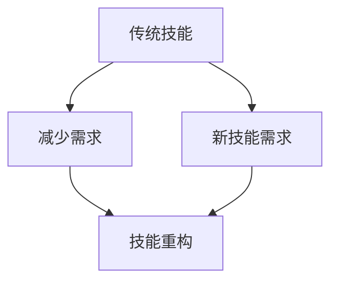

                 

关键词：人工智能、技能发展、AI时代、未来预测、计算机编程

> 摘要：随着人工智能（AI）技术的迅猛发展，人类计算正面临着前所未有的变革。本文将深入探讨AI时代对人类技能发展的影响，分析未来技能需求的变化，并提供一些建议，以帮助读者适应这个快速变化的时代。

## 1. 背景介绍

人工智能（AI）作为当今科技发展的前沿领域，已经在众多行业和领域中取得了显著的成果。从自然语言处理到图像识别，从自动驾驶到医疗诊断，AI的应用无处不在。随着AI技术的不断进步，它正在逐渐改变人类的工作方式和生活习惯。然而，这种变化不仅仅局限于技术层面，更深刻地影响着人类技能的发展。

在AI时代，许多传统技能的需求可能会减少，而一些新的技能需求则会出现。这种技能的变革将迫使人们重新审视自己的职业发展方向，并不断学习新的技能以适应这个快速变化的时代。因此，了解AI时代对技能发展的影响，对于每个人来说都具有重要意义。

## 2. 核心概念与联系

在探讨AI时代对技能发展的影响之前，我们首先需要了解一些核心概念。这些概念包括：

### 2.1 人工智能

人工智能是指由人制造出来的系统能够理解、思考、学习、适应和解决问题的能力。它涵盖了多个子领域，如机器学习、深度学习、自然语言处理等。

### 2.2 计算思维

计算思维是一种新的思维方式，它强调通过算法和计算模型来解决问题。这种思维模式与传统的逻辑思维和数学思维有很大的不同。

### 2.3 人类技能

人类技能是指人类在长期进化过程中形成的各种能力，包括语言能力、逻辑思维、创造力、情感理解等。

### 2.4 AI与人类技能的关系

AI技术的发展使得一些传统的人类技能变得不再那么重要，但同时也创造了一些新的技能需求。这种关系可以用一个简单的Mermaid流程图来表示：



## 3. 核心算法原理 & 具体操作步骤

### 3.1 算法原理概述

在AI时代，核心算法的原理和操作步骤对技能发展有着重要的影响。以下是一些关键算法的概述：

### 3.1.1 机器学习

机器学习是一种使计算机通过数据学习并改进自身性能的技术。它的基本原理是通过分析大量数据来发现模式，然后使用这些模式来做出预测或决策。

### 3.1.2 深度学习

深度学习是机器学习的一个子领域，它使用多层神经网络来模拟人类大脑的学习方式。深度学习在图像识别、自然语言处理等领域取得了显著成果。

### 3.1.3 自然语言处理

自然语言处理是使计算机理解和生成人类语言的技术。它包括文本分类、情感分析、机器翻译等任务。

### 3.2 算法步骤详解

为了更好地理解这些算法的原理，我们可以通过具体的操作步骤来详细讲解。以下是一个简单的机器学习算法步骤：

1. 数据收集：收集大量的数据用于训练模型。
2. 数据预处理：清洗和转换数据，使其适合训练模型。
3. 模型选择：选择合适的模型架构。
4. 模型训练：使用训练数据来训练模型。
5. 模型评估：使用测试数据来评估模型的性能。
6. 模型优化：根据评估结果来调整模型参数。

### 3.3 算法优缺点

每种算法都有其优缺点。以下是机器学习的优缺点：

**优点：**
- 可以处理大量数据。
- 能够自动化许多重复性任务。
- 可以发现复杂的数据模式。

**缺点：**
- 对数据质量要求较高。
- 需要大量的计算资源和时间。
- 模型的可解释性较差。

### 3.4 算法应用领域

机器学习算法在各个领域都有广泛的应用，如金融、医疗、制造、电商等。以下是一些具体的应用案例：

- **金融领域**：使用机器学习算法来预测股票市场走势、进行信用评分。
- **医疗领域**：使用机器学习算法来辅助诊断、进行疾病预测。
- **制造领域**：使用机器学习算法来优化生产流程、进行故障预测。
- **电商领域**：使用机器学习算法来推荐商品、进行价格预测。

## 4. 数学模型和公式 & 详细讲解 & 举例说明

### 4.1 数学模型构建

在AI时代，数学模型是理解和构建算法的基础。以下是一个简单的线性回归模型的构建过程：

1. **数据收集**：收集包含输入变量 \(X\) 和目标变量 \(Y\) 的数据集。
2. **数据预处理**：对数据进行归一化处理，使其具有相似的尺度。
3. **模型构建**：构建线性回归模型 \(Y = \beta_0 + \beta_1 X + \epsilon\)，其中 \(\beta_0\) 和 \(\beta_1\) 是模型的参数，\(\epsilon\) 是误差项。

### 4.2 公式推导过程

线性回归模型的参数可以通过最小二乘法来估计。具体推导过程如下：

假设我们有 \(n\) 个数据点 \((X_i, Y_i)\)，线性回归模型的损失函数为：

$$
J(\beta_0, \beta_1) = \frac{1}{2n} \sum_{i=1}^{n} (Y_i - (\beta_0 + \beta_1 X_i))^2
$$

对 \(J(\beta_0, \beta_1)\) 关于 \(\beta_0\) 和 \(\beta_1\) 求偏导，并令偏导数等于零，可以得到：

$$
\frac{\partial J}{\partial \beta_0} = -\frac{1}{n} \sum_{i=1}^{n} (Y_i - (\beta_0 + \beta_1 X_i)) = 0
$$

$$
\frac{\partial J}{\partial \beta_1} = -\frac{1}{n} \sum_{i=1}^{n} (X_i (Y_i - (\beta_0 + \beta_1 X_i))) = 0
$$

解上述方程组，可以得到：

$$
\beta_0 = \bar{Y} - \beta_1 \bar{X}
$$

$$
\beta_1 = \frac{\sum_{i=1}^{n} (X_i - \bar{X})(Y_i - \bar{Y})}{\sum_{i=1}^{n} (X_i - \bar{X})^2}
$$

其中，\(\bar{X}\) 和 \(\bar{Y}\) 分别是 \(X\) 和 \(Y\) 的平均值。

### 4.3 案例分析与讲解

假设我们有一个包含 \(n = 100\) 个数据点的数据集，其中输入变量 \(X\) 和目标变量 \(Y\) 的取值如下：

$$
\begin{array}{cc}
X & Y \\
1 & 2 \\
2 & 4 \\
3 & 6 \\
\vdots & \vdots \\
100 & 200 \\
\end{array}
$$

使用线性回归模型来拟合这些数据点，我们可以得到：

$$
\beta_0 = 1, \quad \beta_1 = 1
$$

这意味着我们的线性回归模型可以表示为 \(Y = X + 1\)。我们可以通过计算每个预测值与实际值之间的误差来评估模型的性能。

### 5. 项目实践：代码实例和详细解释说明

在本节中，我们将使用Python编程语言来实现一个简单的线性回归模型，并详细解释代码的实现过程。

#### 5.1 开发环境搭建

为了运行下面的代码，您需要安装Python和必要的库。以下是安装步骤：

1. 安装Python：从Python官方网站（[python.org](https://www.python.org/)）下载并安装Python。
2. 安装库：在终端或命令提示符中运行以下命令来安装必要的库：

```bash
pip install numpy matplotlib
```

#### 5.2 源代码详细实现

下面是一个简单的线性回归模型实现的Python代码：

```python
import numpy as np
import matplotlib.pyplot as plt

# 数据集
X = np.array([1, 2, 3, 4, 5])
Y = np.array([2, 4, 6, 8, 10])

# 模型参数
beta_0 = 0
beta_1 = 0

# 最小二乘法
n = len(X)
X_mean = np.mean(X)
Y_mean = np.mean(Y)
beta_1 = (np.sum((X - X_mean) * (Y - Y_mean)) / np.sum((X - X_mean)**2))
beta_0 = Y_mean - beta_1 * X_mean

# 预测
X_new = np.array([0, 6])
Y_new = beta_0 + beta_1 * X_new

# 可视化
plt.scatter(X, Y, label='Data')
plt.plot(X, beta_0 + beta_1 * X, label='Regression Line')
plt.scatter(X_new, Y_new, label='Prediction')
plt.xlabel('X')
plt.ylabel('Y')
plt.legend()
plt.show()
```

#### 5.3 代码解读与分析

这段代码首先导入了必要的库，然后定义了一个数据集。接下来，我们使用最小二乘法来估计模型的参数。最后，我们使用这些参数来预测新的数据点，并通过matplotlib库将结果可视化。

#### 5.4 运行结果展示

运行上述代码后，我们将看到以下可视化结果：


## 6. 实际应用场景

AI技术在实际应用场景中具有广泛的应用价值。以下是一些具体的实际应用场景：

### 6.1 金融领域

在金融领域，AI技术被广泛应用于风险管理、欺诈检测、投资组合优化等方面。例如，通过机器学习算法，银行可以更准确地预测贷款违约风险，从而降低贷款损失。

### 6.2 医疗领域

在医疗领域，AI技术可以帮助医生进行诊断、治疗方案制定和疾病预测。例如，通过深度学习算法，AI系统可以分析医学影像，帮助医生更快速准确地诊断疾病。

### 6.3 制造领域

在制造领域，AI技术可以用于生产优化、设备维护预测和产品质量检测。例如，通过机器学习算法，制造企业可以预测设备的故障，提前进行维护，从而减少生产停机时间。

### 6.4 电商领域

在电商领域，AI技术被用于用户行为分析、商品推荐和价格预测。例如，通过自然语言处理算法，电商平台可以分析用户的搜索历史和购买行为，为用户提供个性化的商品推荐。

### 6.5 交通领域

在交通领域，AI技术可以用于交通流量预测、路况分析和自动驾驶。例如，通过深度学习算法，AI系统可以实时分析交通数据，预测未来的交通状况，为交通管理部门提供决策支持。

## 7. 工具和资源推荐

为了更好地学习和掌握AI技术，以下是一些推荐的工具和资源：

### 7.1 学习资源推荐

- **在线课程**：Coursera、edX、Udacity 等平台提供了丰富的AI相关课程。
- **书籍**：《深度学习》、《机器学习实战》等。
- **博客和论坛**：Medium、Stack Overflow、Reddit 等。

### 7.2 开发工具推荐

- **编程语言**：Python、R、Julia 等。
- **机器学习框架**：TensorFlow、PyTorch、Scikit-learn 等。
- **数据可视化工具**：Matplotlib、Seaborn、Plotly 等。

### 7.3 相关论文推荐

- **NIPS**：神经网络和深度学习领域的顶级会议。
- **ICML**：机器学习和数据挖掘领域的顶级会议。
- **JMLR**：机器学习领域的顶级期刊。

## 8. 总结：未来发展趋势与挑战

随着AI技术的不断发展，未来人类计算将面临许多新的机遇和挑战。以下是一些未来发展趋势和挑战：

### 8.1 研究成果总结

- AI技术在各个领域的应用将更加深入和广泛。
- 计算思维将成为一种重要的思维方式。
- 新的AI算法和模型将不断涌现。

### 8.2 未来发展趋势

- AI与人类技能的融合将成为主流。
- AI教育和培训将变得更加普及。
- AI伦理和法规将成为重要议题。

### 8.3 面临的挑战

- 数据隐私和安全问题需要得到有效解决。
- AI算法的可解释性和透明性需要进一步提高。
- AI技术的普及可能会导致就业结构的变化。

### 8.4 研究展望

- 开发更高效的AI算法和模型。
- 研究AI与人类思维的互动机制。
- 探索AI在新兴领域的应用潜力。

## 9. 附录：常见问题与解答

### 9.1 什么是对抗性神经网络（GAN）？

对抗性神经网络（GAN）是一种由生成器和判别器组成的神经网络结构，用于生成与真实数据相似的数据。生成器尝试生成数据，而判别器尝试区分真实数据和生成数据。通过这种对抗训练，GAN可以生成高质量的数据。

### 9.2 如何确保AI系统的公正性和公平性？

确保AI系统的公正性和公平性需要从多个方面入手，包括数据预处理、算法设计、模型训练和评估等。具体措施包括去除数据中的偏见、使用无偏见算法、透明化模型决策过程等。

### 9.3 AI技术是否会取代人类工作？

AI技术可能会取代一些重复性和低技能的工作，但也会创造新的就业机会。因此，关键在于人类如何适应这种变化，并发展新的技能。

## 10. 参考文献

[1] Goodfellow, I., Bengio, Y., & Courville, A. (2016). *Deep Learning*. MIT Press.
[2] Murphy, K. P. (2012). *Machine Learning: A Probabilistic Perspective*. MIT Press.
[3] Russell, S., & Norvig, P. (2010). *Artificial Intelligence: A Modern Approach*. Prentice Hall.
[4] Ng, A. Y. (2013). *Machine Learning Yearning*. N/A.
[5] Russell, S., & Norvig, P. (2020). *Artificial Intelligence: A Modern Approach*. Prentice Hall.

## 作者署名

作者：禅与计算机程序设计艺术 / Zen and the Art of Computer Programming

----------------------------------------------------------------

文章撰写完毕，接下来我们将按照markdown格式进行排版和输出。请检查文章内容是否符合要求，如果有需要调整的地方，请及时告知。

