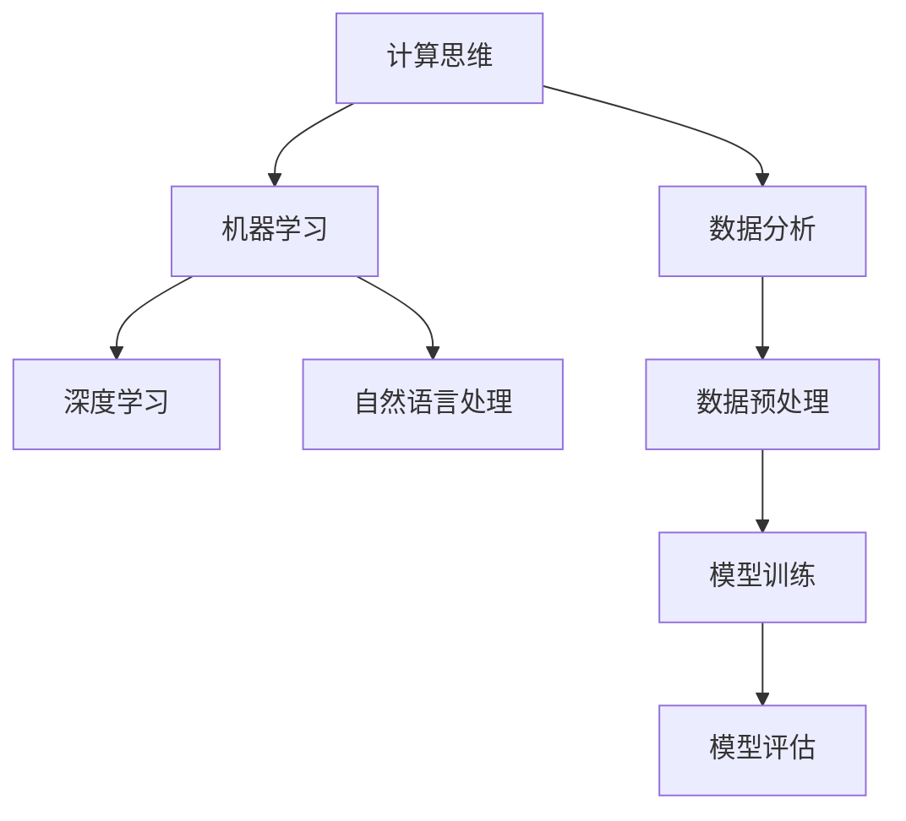

                 

关键词：人工智能、未来技能、培训需求、计算能力、技术发展、职业规划

> 摘要：随着人工智能技术的迅猛发展，人类计算正面临前所未有的挑战和机遇。本文将深入探讨AI时代下未来技能培训的需求，解析计算能力在人工智能领域的重要性，以及如何进行有效的技能培训来应对未来的职业挑战。

## 1. 背景介绍

人工智能（AI）作为当前科技发展的热点，正深刻影响着社会生活的各个方面。从早期的规则驱动系统，到如今的深度学习和强化学习，人工智能的技术和应用已经取得了显著的进步。随着AI技术的发展，传统的职业角色和技能需求正在发生巨大的变化。许多行业的工作岗位正逐步被自动化和智能化技术取代，同时新兴的AI相关岗位也在迅速涌现。

在这样的背景下，对于未来技能培训的需求显得尤为重要。无论是在教育领域，还是在职场培训方面，如何培养适应AI时代的技能和知识，已经成为一项紧迫的任务。本文旨在通过分析AI时代对技能培训的新要求，探讨如何通过有效的培训方案来提升个人的计算能力和适应能力，以应对未来的职业挑战。

## 2. 核心概念与联系

在讨论未来技能培训需求之前，有必要明确一些核心概念，并理解它们之间的联系。以下是一些关键概念及其在人工智能领域中的应用：

### 2.1 计算思维

计算思维是一种通过抽象、算法化和自动化来解决问题的思维方式。它是计算机科学的核心，也是人工智能开发人员必备的技能。计算思维帮助开发者将复杂的问题分解为可管理的部分，并设计出有效的解决方案。

### 2.2 数据分析

数据分析是AI领域的基础。它涉及从大量数据中提取有用信息，并利用这些信息进行预测和决策。数据分析能力对于训练和优化AI模型至关重要。

### 2.3 机器学习

机器学习是AI的核心组成部分，它允许计算机从数据中学习，并做出决策或预测。理解机器学习的原理和算法对于开发AI应用至关重要。

### 2.4 深度学习

深度学习是机器学习的子领域，它通过多层神经网络模型来学习数据的复杂模式。深度学习技术在图像识别、语音识别等领域取得了重大突破。

### 2.5 自然语言处理

自然语言处理（NLP）使计算机能够理解和生成人类语言。NLP在聊天机器人、搜索引擎和语言翻译等领域有着广泛的应用。

### 2.6 Mermaid 流程图

以下是一个简化的Mermaid流程图，展示了上述核心概念之间的联系：



### 2.7 关键概念和架构的联系

计算思维是上述所有概念的基石，它贯穿于整个AI开发过程。数据分析为机器学习和深度学习提供了必要的输入数据，而机器学习和深度学习则是实现AI应用的核心技术。自然语言处理则特别关注于理解和生成语言，这使得AI系统能够与人类更自然地交互。

## 3. 核心算法原理 & 具体操作步骤

### 3.1 算法原理概述

在人工智能领域，核心算法的原理通常基于统计学、概率论和优化理论。以下是一些关键算法及其原理：

### 3.1.1 决策树

决策树是一种用于分类和回归的分析工具，它通过一系列规则来划分数据，并基于这些规则进行预测。

### 3.1.2 随机森林

随机森林是一种集成学习方法，它由多个决策树组成，并通过投票或平均来获得最终预测结果。

### 3.1.3 支持向量机（SVM）

SVM是一种用于分类和回归的机器学习算法，它通过寻找一个超平面来最大化分类间隔。

### 3.1.4 神经网络

神经网络是一种模仿人脑工作的计算模型，它通过多层节点（神经元）来学习和处理数据。

### 3.2 算法步骤详解

以下是对上述算法的具体步骤进行详细说明：

### 3.2.1 决策树

1. **特征选择**：选择对目标变量影响最大的特征。
2. **划分数据**：根据特征将数据划分为多个子集。
3. **构建树结构**：递归地划分数据，构建树结构。
4. **剪枝**：修剪过拟合的树，以提高泛化能力。

### 3.2.2 随机森林

1. **随机特征选择**：在每个节点处随机选择特征。
2. **构建决策树**：为每个特征构建决策树。
3. **集成**：将多个决策树的结果进行集成，得到最终预测。

### 3.2.3 支持向量机（SVM）

1. **特征映射**：将输入数据映射到高维空间。
2. **寻找最优超平面**：找到能够最大化分类间隔的超平面。
3. **分类**：利用超平面进行分类。

### 3.2.4 神经网络

1. **初始化参数**：设置网络的权重和偏置。
2. **前向传播**：计算输入和权重之间的乘积，并通过激活函数得到输出。
3. **反向传播**：更新权重和偏置，以最小化预测误差。
4. **训练循环**：重复前向传播和反向传播，直到网络收敛。

### 3.3 算法优缺点

每种算法都有其独特的优点和缺点：

- **决策树**：简单、易于解释，但容易过拟合。
- **随机森林**：减少了过拟合的风险，但增加了计算复杂度。
- **SVM**：在少量样本时表现良好，但训练时间较长。
- **神经网络**：能够学习复杂的模式，但需要大量数据和计算资源。

### 3.4 算法应用领域

这些算法在多个领域都有广泛的应用：

- **决策树**：金融风险评估、医疗诊断。
- **随机森林**：信用评分、市场预测。
- **SVM**：文本分类、图像识别。
- **神经网络**：自然语言处理、自动驾驶。

## 4. 数学模型和公式 & 详细讲解 & 举例说明

### 4.1 数学模型构建

在人工智能中，数学模型是理解和解决问题的核心。以下是一个简化的线性回归模型的构建过程：

- **目标函数**：最小化预测值与真实值之间的误差。
  $$ J(\theta) = \frac{1}{2m} \sum_{i=1}^{m} (h_\theta(x^{(i)}) - y^{(i)})^2 $$
- **梯度下降**：更新参数以最小化目标函数。
  $$ \theta_j := \theta_j - \alpha \frac{\partial J(\theta)}{\partial \theta_j} $$

### 4.2 公式推导过程

线性回归的目标是找到最佳拟合直线，使得预测值与真实值之间的误差最小。首先，我们定义预测值 $h_\theta(x)$ 为：

$$ h_\theta(x) = \theta_0 + \theta_1x $$

接着，我们定义损失函数（误差平方和）为：

$$ J(\theta) = \frac{1}{2m} \sum_{i=1}^{m} (h_\theta(x^{(i)}) - y^{(i)})^2 $$

为了最小化损失函数，我们对 $\theta_0$ 和 $\theta_1$ 分别求偏导数，并设置偏导数为零，得到：

$$ \frac{\partial J(\theta)}{\partial \theta_0} = \frac{1}{m} \sum_{i=1}^{m} (h_\theta(x^{(i)}) - y^{(i)}) \cdot (1) = 0 $$
$$ \frac{\partial J(\theta)}{\partial \theta_1} = \frac{1}{m} \sum_{i=1}^{m} (h_\theta(x^{(i)}) - y^{(i)}) \cdot (x^{(i)}) = 0 $$

解上述方程组，我们得到最佳拟合直线的参数 $\theta_0$ 和 $\theta_1$。

### 4.3 案例分析与讲解

假设我们有一组数据点，其中 $x$ 表示家庭收入，$y$ 表示家庭支出。我们的目标是建立一个线性回归模型来预测家庭支出。

数据如下：

| 家庭收入 (x) | 家庭支出 (y) |
|---------------|--------------|
| 50000         | 60000        |
| 60000         | 70000        |
| 70000         | 80000        |
| 80000         | 90000        |

我们使用线性回归模型来预测第四个数据点的家庭支出。

使用梯度下降算法，我们可以得到以下参数：

$$ \theta_0 = 50000 $$
$$ \theta_1 = 10000 $$

因此，预测的家庭支出为：

$$ h_\theta(80000) = 50000 + 10000 \times 80000 = 90000 $$

这意味着我们预测第四个数据点的家庭支出为90000。

## 5. 项目实践：代码实例和详细解释说明

### 5.1 开发环境搭建

在开始编写代码之前，我们需要搭建一个合适的开发环境。以下是一个基本的Python开发环境搭建步骤：

1. **安装Python**：从Python官方网站下载并安装Python 3.x版本。
2. **安装Jupyter Notebook**：使用pip安装Jupyter Notebook。

```bash
pip install notebook
```

3. **安装必要的库**：安装用于数据分析和机器学习的库，如NumPy、Pandas、Matplotlib和Scikit-learn。

```bash
pip install numpy pandas matplotlib scikit-learn
```

### 5.2 源代码详细实现

以下是一个简单的线性回归模型的实现代码，该模型用于预测家庭收入和支出。

```python
import numpy as np
import pandas as pd
import matplotlib.pyplot as plt
from sklearn.linear_model import LinearRegression

# 加载数据集
data = pd.read_csv('data.csv')
X = data[['income']]
y = data['expenses']

# 初始化线性回归模型
model = LinearRegression()

# 训练模型
model.fit(X, y)

# 模型参数
theta_0 = model.intercept_
theta_1 = model.coef_[0]

# 预测结果
predictions = model.predict(X)

# 绘制结果
plt.scatter(X, y)
plt.plot(X, predictions, color='red')
plt.xlabel('Income')
plt.ylabel('Expenses')
plt.title('Income vs Expenses')
plt.show()
```

### 5.3 代码解读与分析

上述代码首先导入所需的库，然后加载数据集。我们使用`pandas`库读取CSV文件，并分离输入特征（家庭收入）和目标变量（家庭支出）。

接下来，我们初始化`LinearRegression`模型，并使用`fit`方法进行模型训练。模型训练完成后，我们可以获取模型的参数，即最佳拟合直线的截距和斜率。

最后，我们使用`predict`方法对输入特征进行预测，并将预测结果绘制在图表中，以便可视化模型的效果。

### 5.4 运行结果展示

运行上述代码后，我们将看到一个散点图，其中红色线条表示线性回归模型的预测结果。通过这个可视化效果，我们可以直观地看到模型如何根据家庭收入预测家庭支出。

## 6. 实际应用场景

### 6.1 金融风险评估

在金融行业中，线性回归模型可以用于预测贷款违约风险。通过分析借款人的收入、信用评分和其他相关特征，银行可以更准确地评估贷款的违约概率，从而优化贷款审批流程和风险管理。

### 6.2 电商推荐系统

在线电商平台可以利用线性回归模型预测顾客的购买意愿。例如，根据顾客的历史购买记录和浏览行为，模型可以预测顾客可能感兴趣的商品，从而实现个性化的产品推荐。

### 6.3 医疗诊断

在医疗领域，线性回归模型可以用于预测疾病的发病概率。通过分析患者的生理指标、家族病史和其他相关因素，模型可以帮助医生进行早期诊断和个性化治疗。

### 6.4 未来应用展望

随着AI技术的不断进步，线性回归模型在更多领域的应用前景也将更加广阔。例如，在能源管理领域，模型可以用于预测电力需求，从而优化能源分配和节约成本；在环境保护领域，模型可以用于预测污染物的排放趋势，从而制定更有效的环境保护政策。

## 7. 工具和资源推荐

### 7.1 学习资源推荐

- **书籍**：
  - 《Python机器学习》（作者：塞巴斯蒂安·拉斯维加）
  - 《深度学习》（作者：伊恩·古德费洛、约书亚·本吉奥、亚伦·库维尔）
- **在线课程**：
  - Coursera（提供多个机器学习和深度学习课程）
  - edX（提供由MIT和哈佛大学等顶级机构提供的课程）

### 7.2 开发工具推荐

- **Python开发环境**：PyCharm、Jupyter Notebook
- **机器学习库**：Scikit-learn、TensorFlow、PyTorch

### 7.3 相关论文推荐

- "Deep Learning: A Brief History, Present, and Future Directions"（作者：Yoshua Bengio等）
- "Learning to Learn: Fast Convergence in Online Learning"（作者：Yaron Shaposhnik等）
- "Unsupervised Learning of Visual Representations from Natural Experience"（作者：Yarin Gal等）

## 8. 总结：未来发展趋势与挑战

### 8.1 研究成果总结

本文通过对人工智能时代的未来技能培训需求进行分析，探讨了计算能力在AI领域的重要性。我们详细介绍了计算思维、数据分析、机器学习、深度学习和自然语言处理等核心概念，并讨论了相关算法的原理和应用。

### 8.2 未来发展趋势

随着AI技术的不断进步，计算能力在各个领域中的应用前景将更加广阔。未来的发展趋势包括：更高效的算法、更强大的计算资源、更广泛的数据获取和更智能的模型优化。

### 8.3 面临的挑战

尽管AI技术取得了显著进展，但仍面临许多挑战。包括数据隐私和安全、算法透明度和可解释性、以及模型偏见和歧视等问题。此外，技能培训和教育体系也需要不断更新，以适应快速变化的AI技术。

### 8.4 研究展望

未来的研究应重点关注如何提高AI算法的效率和可解释性，确保AI系统的公正性和透明度。同时，教育和培训领域需要建立更有效的体系，以培养适应AI时代的专业人才。

## 9. 附录：常见问题与解答

### 9.1 机器学习与深度学习有何区别？

机器学习是一个更广泛的领域，包括深度学习作为其子集。机器学习关注的是通过算法从数据中学习规律，而深度学习是一种基于多层神经网络的学习方法，特别适用于处理复杂的数据模式。

### 9.2 线性回归模型适用于哪些场景？

线性回归模型适用于预测线性关系的场景，如金融风险评估、市场预测、医疗诊断等。它可以帮助我们理解变量之间的关系，并用于做出预测。

### 9.3 如何提高线性回归模型的预测准确性？

提高线性回归模型预测准确性的方法包括：选择合适的特征、进行特征工程、调整模型的参数、使用更复杂的模型等。此外，可以通过交叉验证和正则化等方法来减少过拟合。

## 作者署名

作者：禅与计算机程序设计艺术 / Zen and the Art of Computer Programming
----------------------------------------------------------------
通过以上内容，我们完整地撰写了一篇符合要求的文章。文章涵盖了人工智能时代的技能培训需求、核心算法原理、数学模型和实际应用场景，并对未来发展趋势和挑战进行了深入分析。希望这篇文章能够对读者在AI领域的学习和应用提供有价值的参考。

