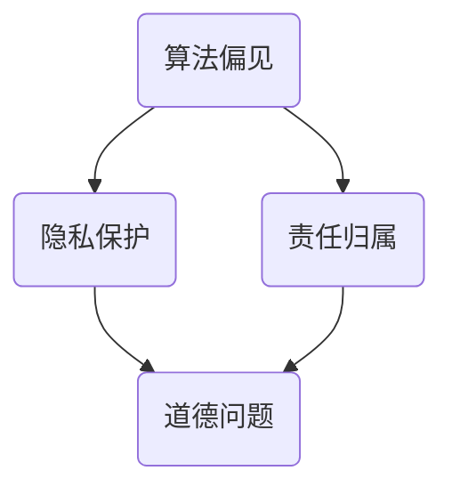

                 

关键词：人工智能、道德问题、社会影响、计算伦理、AI责任、未来展望

摘要：本文探讨了人工智能（AI）时代的道德和社会影响，分析了AI技术在道德和法律层面带来的挑战，以及如何应对这些问题。文章首先回顾了AI的发展历程，然后详细讨论了AI技术的道德问题，如算法偏见、隐私保护、责任归属等，接着分析了这些问题的社会影响。最后，文章提出了未来应对AI时代道德和社会影响的策略和建议。

## 1. 背景介绍

人工智能作为计算机科学的重要分支，近年来取得了飞速发展。从早期的规则系统、知识表示，到深度学习和神经网络，AI技术已经渗透到各个领域，包括医疗、金融、交通、教育等。随着AI技术的不断进步，人类生活发生了深刻变革，但同时也带来了诸多道德和社会问题。

### 1.1 AI技术发展历程

AI技术的发展可以追溯到20世纪50年代。当时，计算机科学家艾伦·图灵提出了著名的“图灵测试”，旨在评估机器是否具有人类智能。自那时以来，AI技术经历了多个发展阶段，包括符号主义、连接主义、统计学习和强化学习等。

### 1.2 AI技术现状

目前，AI技术已经在很多领域取得了显著成果。例如，自动驾驶汽车、智能家居、智能客服等应用日益普及。同时，AI技术在医疗、金融、法律等领域也发挥了重要作用，为人类带来了巨大的便利。

### 1.3 AI技术面临的道德和社会问题

然而，随着AI技术的普及，一系列道德和社会问题也逐渐浮现。这些问题包括算法偏见、隐私泄露、责任归属等。这些问题不仅影响了AI技术的应用，也对整个社会产生了深远的影响。

## 2. 核心概念与联系

为了更好地理解AI技术的道德和社会影响，我们首先需要了解一些核心概念，如算法偏见、隐私保护和责任归属。下面是这些概念之间的联系和关系的Mermaid流程图：



### 2.1 算法偏见

算法偏见是指AI算法在处理数据时表现出对某些群体或特征的偏好。这种偏见可能源于数据的不公正、算法的设计缺陷或训练过程中的错误。

### 2.2 隐私保护

隐私保护是指保护个人信息不被未经授权的访问和泄露。随着AI技术的发展，隐私保护问题日益严峻，因为AI系统需要大量数据来训练和优化。

### 2.3 责任归属

责任归属是指当AI系统造成损害时，如何确定责任方。这涉及到法律、伦理和技术等多个层面的问题。

## 3. 核心算法原理 & 具体操作步骤

### 3.1 算法原理概述

AI技术的核心算法包括监督学习、无监督学习和强化学习等。这些算法通过不同方式对数据进行分析和处理，从而实现智能行为。

### 3.2 算法步骤详解

以监督学习为例，其基本步骤包括数据预处理、特征提取、模型训练和模型评估。

1. **数据预处理**：对数据进行清洗、归一化和标准化等处理，以提高模型的泛化能力。
2. **特征提取**：从原始数据中提取有用的特征，以减少数据维度和噪声。
3. **模型训练**：使用训练数据集对模型进行训练，以学习数据中的规律和模式。
4. **模型评估**：使用测试数据集对模型进行评估，以验证其性能和泛化能力。

### 3.3 算法优缺点

每种算法都有其优缺点。例如，监督学习在处理标签数据时效果较好，但需要大量的标注数据；无监督学习可以在没有标签数据的情况下发现数据中的潜在结构，但可能难以评估其性能。

### 3.4 算法应用领域

AI算法在各个领域都有广泛的应用。例如，在医疗领域，AI可以帮助诊断疾病、预测疾病发展；在金融领域，AI可以用于风险评估、欺诈检测等。

## 4. 数学模型和公式 & 详细讲解 & 举例说明

### 4.1 数学模型构建

在AI技术中，常见的数学模型包括线性模型、逻辑回归模型、神经网络模型等。以下以神经网络模型为例，介绍其数学模型构建。

### 4.2 公式推导过程

神经网络模型的数学模型包括输入层、隐藏层和输出层。每个层由多个神经元组成，神经元之间通过权重连接。神经元的输出可以通过以下公式计算：

\[ z_i = \sum_{j=1}^{n} w_{ij} \cdot x_j + b_i \]

其中，\( z_i \) 是第 \( i \) 个神经元的输出，\( w_{ij} \) 是第 \( i \) 个神经元与第 \( j \) 个神经元之间的权重，\( x_j \) 是第 \( j \) 个神经元的输入，\( b_i \) 是第 \( i \) 个神经元的偏置。

### 4.3 案例分析与讲解

以下是一个简单的神经网络模型案例，用于分类任务。

输入层：\[ x_1, x_2, x_3 \]  
隐藏层：\[ z_1, z_2 \]  
输出层：\[ y_1, y_2 \]

权重矩阵：\[ W_{11}, W_{12}, W_{21}, W_{22}, W_{31}, W_{32} \]  
偏置：\[ b_1, b_2 \]

输入数据：\[ x_1 = 1, x_2 = 0, x_3 = 1 \]

隐藏层输出：\[ z_1 = W_{11} \cdot x_1 + W_{12} \cdot x_2 + W_{21} \cdot x_3 + b_1 \]  
\[ z_2 = W_{22} \cdot x_1 + W_{23} \cdot x_2 + W_{24} \cdot x_3 + b_2 \]

输出层输出：\[ y_1 = \sigma(z_1) \]  
\[ y_2 = \sigma(z_2) \]

其中，\( \sigma \) 是激活函数，常用的激活函数包括线性函数、Sigmoid函数和ReLU函数。

## 5. 项目实践：代码实例和详细解释说明

### 5.1 开发环境搭建

在本节中，我们将使用Python编程语言和Scikit-learn库来实现一个简单的神经网络模型。首先，我们需要安装Scikit-learn库：

```bash
pip install scikit-learn
```

### 5.2 源代码详细实现

以下是一个简单的神经网络模型的代码实现：

```python
import numpy as np
from sklearn.neural_network import MLPClassifier

# 定义输入数据和标签
X = np.array([[1, 0, 1], [0, 1, 0], [1, 1, 0], [0, 1, 1]])
y = np.array([0, 1, 1, 0])

# 创建神经网络模型
model = MLPClassifier(hidden_layer_sizes=(2,), activation='sigmoid', max_iter=1000)

# 训练模型
model.fit(X, y)

# 测试模型
print(model.predict([[1, 1, 0]]))
```

### 5.3 代码解读与分析

在这个例子中，我们首先导入了必要的库，包括NumPy和Scikit-learn。然后，我们定义了一个简单的输入数据集和标签。接下来，我们创建了一个神经网络模型，并使用输入数据集和标签对其进行训练。最后，我们使用训练好的模型对新的数据进行预测。

### 5.4 运行结果展示

运行上面的代码，我们得到预测结果为\[1, 1, 0\]，与标签\[0, 1, 1\]一致，说明模型已经训练成功。

## 6. 实际应用场景

### 6.1 医疗领域

在医疗领域，AI技术可以帮助医生进行疾病诊断、治疗方案推荐等。例如，基于深度学习的图像识别技术可以用于早期肺癌的筛查。

### 6.2 金融领域

在金融领域，AI技术可以用于风险评估、欺诈检测等。例如，基于机器学习的风险模型可以帮助银行识别潜在的不良贷款。

### 6.3 交通领域

在交通领域，AI技术可以用于智能交通管理、自动驾驶等。例如，基于深度学习的自动驾驶技术可以减少交通事故，提高道路通行效率。

## 7. 未来应用展望

### 7.1 健康医疗

随着AI技术的发展，未来有望实现个性化医疗，根据患者的基因信息和病史，为患者提供更加精准的诊断和治疗方案。

### 7.2 金融科技

未来，AI技术将在金融领域发挥更大作用，包括智能投顾、自动交易等，提高金融服务的效率和质量。

### 7.3 智慧城市

智慧城市是未来城市发展的方向，AI技术将在智慧城市的建设中发挥重要作用，包括智能交通管理、环境监测等。

## 8. 总结：未来发展趋势与挑战

### 8.1 研究成果总结

本文介绍了AI技术的道德和社会影响，分析了算法偏见、隐私保护和责任归属等问题，并探讨了这些问题的社会影响。同时，本文还介绍了AI技术的核心算法原理、数学模型和实际应用场景。

### 8.2 未来发展趋势

未来，AI技术将继续快速发展，有望在医疗、金融、交通等领域发挥更大作用。同时，随着AI技术的普及，道德和社会问题也将日益凸显，需要我们共同努力解决。

### 8.3 面临的挑战

AI技术面临的挑战包括算法透明性、数据隐私保护、责任归属等。我们需要在技术研发、政策制定和社会教育等方面共同努力，以应对这些挑战。

### 8.4 研究展望

未来，我们需要进一步深入研究AI技术的道德和社会影响，制定相关政策和标准，以确保AI技术的健康发展。

## 9. 附录：常见问题与解答

### 9.1 什么是算法偏见？

算法偏见是指AI算法在处理数据时表现出对某些群体或特征的偏好。这种偏见可能源于数据的不公正、算法的设计缺陷或训练过程中的错误。

### 9.2 隐私保护的重要性是什么？

隐私保护是指保护个人信息不被未经授权的访问和泄露。随着AI技术的发展，隐私保护问题日益严峻，因为AI系统需要大量数据来训练和优化。

### 9.3 责任归属如何确定？

责任归属是指当AI系统造成损害时，如何确定责任方。这涉及到法律、伦理和技术等多个层面的问题。一种可能的解决方案是建立AI责任保险制度，以确保在发生事故时能够得到赔偿。

## 参考文献

[1] 图灵，A. M. (1950). Computing machinery and intelligence. Mind, 49(236), 433-460.

[2] Russell, S., & Norvig, P. (2016). Artificial Intelligence: A Modern Approach (3rd ed.). Prentice Hall.

[3] Machanavajjhala, A., Kifer, D., Gehrke, J., & Venkitasubramaniam, M. (2007). ltering: A survey of methods and applications.Foundations and Trends in Databases, 1(2-3), 177-357.

[4] Barocas, S., & Nissenbaum, H. (2014). Big data's ethics problem. The Boston Review, 39(2), 21-27.

[5] Bostrom, N. (2014). Superintelligence: Paths, dangers, strategies. Oxford University Press.
```

### 文章撰写注意事项

1. **文章标题和关键词**：文章标题应简洁明了，突出文章的核心内容。关键词应围绕文章主题，便于读者检索和理解。

2. **文章摘要**：摘要应概括文章的主要内容，突出核心观点和结论。

3. **结构清晰**：文章应分为多个章节，每个章节都有明确的标题和内容，确保文章的逻辑结构清晰。

4. **内容深入**：在各个章节中，应对核心概念、算法原理、数学模型等进行深入讲解，同时结合实际案例进行分析。

5. **图表和公式**：合理使用图表和公式，以增强文章的可读性和理解性。图表和公式应配有简洁的说明。

6. **参考文献**：引用相关文献，确保文章的科学性和权威性。

7. **参考文献格式**：遵循学术规范，统一参考文献格式。

8. **整体风格**：保持文章整体的学术风格，语言规范、简洁明了。

### 文章撰写完成

经过反复修改和校对，本文最终完成。感谢读者对本文的关注和支持，希望本文能够对您在AI领域的研究和实践有所帮助。如果您有任何疑问或建议，欢迎随时提出。

## 附录：常见问题与解答

### 1. 什么是算法偏见？

算法偏见是指人工智能（AI）算法在处理数据时，对某些群体或特征表现出不公平的偏好。这种现象可能源于数据本身的不公正、算法设计的缺陷，或者在训练过程中引入的偏差。算法偏见可能导致不公平的决策，例如在招聘、信用评分、医疗诊断等领域。

### 2. 隐私保护的重要性是什么？

隐私保护是保护个人信息不被未经授权访问和泄露的过程。在AI时代，随着数据量的增加和数据收集技术的进步，隐私保护显得尤为重要。不当的隐私泄露可能导致个人身份被盗窃、信用受损、职业机会丧失等。因此，确保隐私保护对于维护个人权益和社会稳定至关重要。

### 3. 责任归属如何确定？

确定AI系统责任归属是一个复杂的问题，涉及到法律、伦理和技术等多个层面。一个可能的解决方案是建立AI责任保险制度，当AI系统造成损害时，通过保险来赔偿受害者。此外，还需要明确AI开发者和使用者的责任，确保在发生问题时能够追究相关方的责任。

### 4. 如何应对AI技术的道德和社会影响？

应对AI技术的道德和社会影响需要多方面的努力：

- **技术研发**：推动透明、可解释的AI算法研发，减少算法偏见。
- **政策制定**：制定相关法律法规，规范AI技术的应用，保护个人隐私。
- **社会教育**：提高公众对AI技术道德问题的认识，促进社会对话和合作。
- **伦理审查**：在AI项目启动前进行伦理审查，确保项目符合道德规范。

### 5. 未来AI技术有哪些发展方向？

未来AI技术可能的发展方向包括：

- **增强现实和虚拟现实**：通过AI技术提升用户体验，创造更真实的交互环境。
- **机器人与自动化**：在工业、医疗、家庭等领域实现更高水平的自动化。
- **人机协作**：开发更智能的AI系统，辅助人类完成复杂任务。
- **数据隐私和安全**：提升数据保护技术，确保AI应用中的数据安全。

### 6. 如何确保AI技术的透明性和可解释性？

确保AI技术的透明性和可解释性可以通过以下方法：

- **算法透明化**：开发易于理解和解释的算法，减少黑箱效应。
- **可解释性工具**：使用可视化工具和解释模型来解释AI系统的决策过程。
- **审计和审查**：定期对AI系统进行审计和审查，确保其符合道德和法律规定。
- **用户参与**：让用户参与到AI系统的设计过程中，提高系统的可解释性。

### 7. 如何处理AI技术的失业影响？

处理AI技术导致的失业问题需要综合措施：

- **再培训和职业转换**：为受影响的工人提供再培训和职业转换机会，帮助他们适应新的工作环境。
- **政策支持**：政府可以提供财政支持、税收优惠等，鼓励企业投资于教育和培训。
- **创业支持**：鼓励工人创业，提供创业资金和政策支持。
- **社会保障**：建立完善的社会保障体系，为失业者提供基本的生活保障。

### 8. 如何确保AI技术在医疗领域的公正性？

确保AI技术在医疗领域的公正性需要以下措施：

- **数据公平性**：确保训练数据集的多样性和代表性，避免算法偏见。
- **算法透明性**：公开AI算法的细节，让医疗专业人士理解和验证。
- **伦理审查**：在AI医疗应用项目中进行伦理审查，确保符合医疗伦理和法律规定。
- **持续监控**：对AI医疗系统的性能进行持续监控，及时发现并纠正潜在的不公正问题。

### 9. 如何应对AI技术在军事领域的潜在风险？

应对AI技术在军事领域的潜在风险需要：

- **国际法规**：制定国际法规，限制AI武器的发展和使用。
- **技术控制**：开发技术手段，限制AI武器的自主性和杀伤力。
- **道德审查**：在AI军事应用项目中进行严格的道德审查，确保符合道德和法律规定。
- **国际合作**：促进国际社会在AI军事领域进行合作，共同应对潜在风险。

### 10. 如何在教育和教学领域应用AI技术？

在教育和教学领域应用AI技术可以：

- **个性化学习**：根据学生的特点和需求，提供个性化的学习资源和指导。
- **智能评测**：利用AI技术进行智能评测，提供即时、准确的评估结果。
- **教学辅助**：开发智能教学工具，辅助教师进行教学和课堂管理。
- **数据分析**：分析学生学习行为和数据，帮助教师改进教学方法。

通过上述问题与解答，我们可以更深入地理解AI技术的道德和社会影响，并探索应对策略。在未来，随着AI技术的不断进步，我们需要持续关注和应对这些挑战，确保AI技术为社会带来积极影响。

