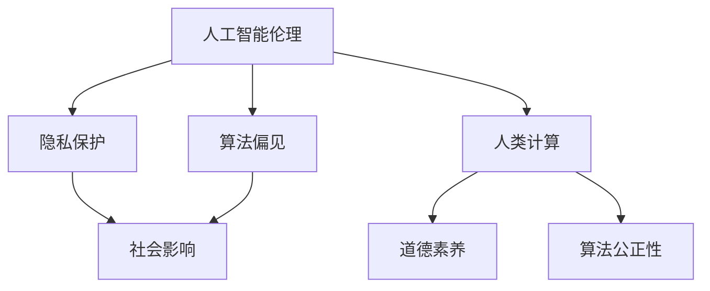
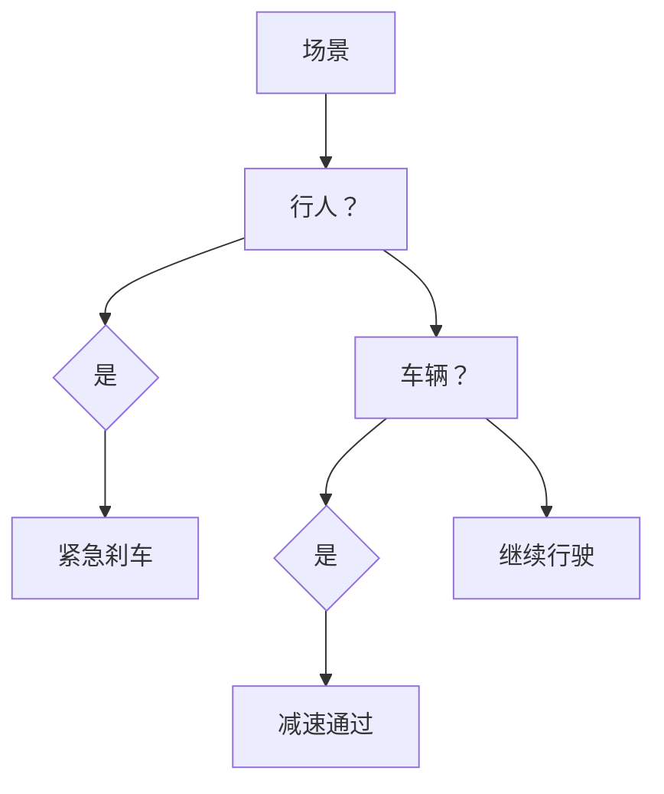
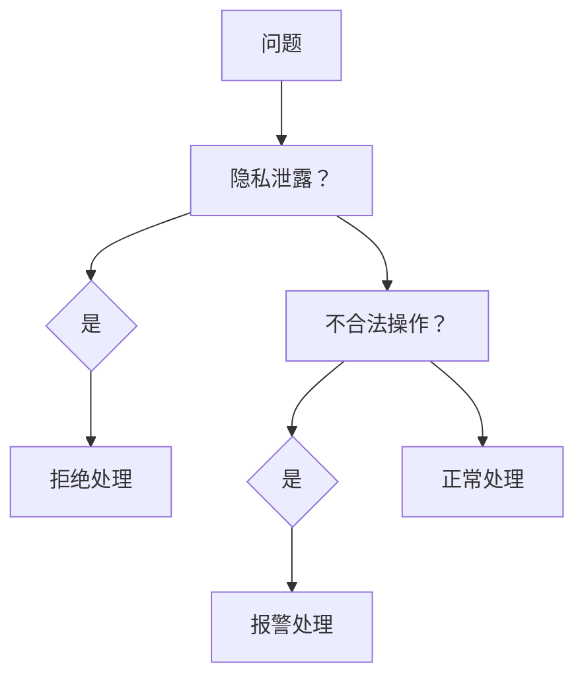
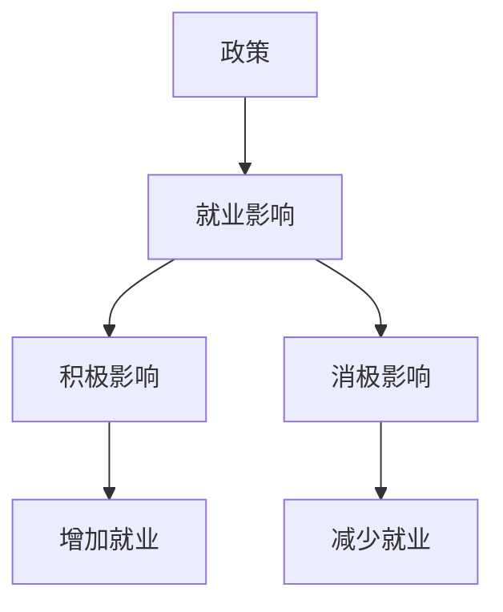

                 

关键词：人工智能、道德教育、伦理问题、人类计算、未来展望

> 摘要：随着人工智能技术的迅猛发展，人类计算在AI时代面临着前所未有的挑战和机遇。本文旨在探讨人工智能时代的道德教育，强调在人类与机器共存的未来，道德教育的重要性及其实现路径。本文从背景介绍、核心概念与联系、核心算法原理与具体操作步骤、数学模型与公式、项目实践、实际应用场景、工具和资源推荐以及未来发展趋势与挑战等方面，全面分析了AI时代的道德教育问题。

## 1. 背景介绍

人工智能作为计算机科学的重要分支，其发展历史可以追溯到20世纪50年代。随着计算能力的不断提升和大数据、云计算等技术的进步，人工智能已经逐渐从理论研究走向实际应用，并在各个领域展现出巨大的潜力。然而，人工智能的发展也带来了诸多伦理和道德问题，如隐私保护、算法偏见、人工智能武器化等。

### 1.1 人工智能的发展历程

人工智能的发展可以分为以下几个阶段：

- **第一阶段（1956-1969）**：人工智能概念提出，标志着人工智能学科的诞生。这一阶段主要是理论研究，主要集中在逻辑推理和问题解决领域。
  
- **第二阶段（1970-1989）**：人工智能开始尝试应用于实际领域，如医疗诊断、机器翻译等。但由于技术限制，这一阶段的人工智能应用效果不佳。

- **第三阶段（1990-2010）**：随着计算能力的提升和机器学习技术的发展，人工智能逐渐走向实用化。尤其是在图像识别、语音识别等领域的应用取得了显著成果。

- **第四阶段（2010至今）**：深度学习和大数据技术的突破，使得人工智能迎来了爆发式发展。如今，人工智能已经广泛应用于自动驾驶、智能家居、医疗诊断等多个领域。

### 1.2 道德教育的重要性

道德教育是指通过教育过程培养学生的道德观念、道德情感和道德行为。在人工智能时代，道德教育的重要性更加凸显：

- **促进人工智能技术的健康发展**：道德教育有助于引导人工智能技术朝着有益于人类的方向发展，防止技术滥用和负面影响。

- **培养具备道德素养的人才**：在人工智能时代，人们需要具备更高的道德素养，以应对复杂的伦理问题。道德教育有助于培养具备良好道德素养的人才。

- **维护社会稳定**：人工智能的发展可能会引发一系列社会问题，如就业失业、隐私泄露等。道德教育有助于提高公众的道德意识，维护社会稳定。

## 2. 核心概念与联系

在人工智能时代，道德教育的核心概念包括：

- **人工智能伦理**：研究人工智能技术的伦理问题，如隐私保护、算法偏见等。

- **人类计算**：强调人类与机器之间的协作，关注人类在人工智能时代的作用。

- **算法公正性**：确保算法在设计和应用过程中不歧视、不偏见。

下面是一个使用Mermaid绘制的流程图，展示了这些核心概念之间的联系：



## 3. 核心算法原理与具体操作步骤

### 3.1 算法原理概述

在人工智能时代，道德教育的实现需要借助一系列算法原理。以下是几个关键算法原理：

- **伦理决策树**：通过构建伦理决策树，为人工智能系统提供道德决策依据。

- **道德神经网络**：利用神经网络模型，训练人工智能系统识别和应对道德问题。

- **社会计算**：通过分析社会数据，评估人工智能技术对社会的影响。

### 3.2 算法步骤详解

1. **伦理决策树构建**：

   - **数据收集**：收集与伦理问题相关的数据。

   - **特征提取**：对数据进行分析，提取关键特征。

   - **决策树构建**：利用决策树算法，构建伦理决策树。

2. **道德神经网络训练**：

   - **数据集准备**：收集包含道德问题的数据集。

   - **模型训练**：利用神经网络模型，对数据集进行训练。

   - **模型评估**：通过测试数据集，评估模型性能。

3. **社会计算分析**：

   - **数据收集**：收集与人工智能技术相关的社会数据。

   - **数据预处理**：对数据进行清洗和处理。

   - **影响评估**：利用社会计算模型，评估人工智能技术对社会的影响。

### 3.3 算法优缺点

- **伦理决策树**：

  - 优点：直观、易于理解，可以明确地指导人工智能系统的道德决策。

  - 缺点：在面对复杂道德问题时，决策树可能难以处理。

- **道德神经网络**：

  - 优点：能够处理复杂的道德问题，具有较强的泛化能力。

  - 缺点：需要大量的数据和计算资源，且训练过程复杂。

- **社会计算**：

  - 优点：能够从宏观角度分析人工智能技术对社会的影响。

  - 缺点：数据质量和分析方法对结果有较大影响。

### 3.4 算法应用领域

- **伦理决策树**：适用于医疗诊断、自动驾驶等需要明确道德决策的场景。

- **道德神经网络**：适用于需要处理复杂道德问题的场景，如智能客服、智能管家等。

- **社会计算**：适用于评估人工智能技术对社会的影响，如政策制定、社会分析等。

## 4. 数学模型和公式 & 详细讲解 & 举例说明

### 4.1 数学模型构建

在道德教育领域，常用的数学模型包括伦理决策树、道德神经网络和社会计算模型。以下是这些模型的构建过程：

- **伦理决策树**：

  - **决策节点**：表示在某一决策点，根据不同特征选择不同的决策路径。

  - **叶节点**：表示最终决策结果。

  - **模型构建**：通过数据分析和特征提取，构建伦理决策树。

- **道德神经网络**：

  - **输入层**：接收与道德问题相关的数据。

  - **隐藏层**：通过激活函数对输入数据进行处理。

  - **输出层**：输出道德决策结果。

  - **模型构建**：利用神经网络模型，对数据进行训练。

- **社会计算模型**：

  - **输入层**：接收与社会数据相关的数据。

  - **隐藏层**：通过社会计算算法对输入数据进行处理。

  - **输出层**：输出社会计算结果。

  - **模型构建**：利用社会计算算法，构建社会计算模型。

### 4.2 公式推导过程

- **伦理决策树**：

  - **条件概率**：\( P(A|B) = \frac{P(A \cap B)}{P(B)} \)

  - **贝叶斯定理**：\( P(A|B) = \frac{P(B|A) \cdot P(A)}{P(B)} \)

- **道德神经网络**：

  - **激活函数**：\( f(x) = \frac{1}{1 + e^{-x}} \)

  - **损失函数**：\( L(y, \hat{y}) = -y \cdot \ln(\hat{y}) - (1 - y) \cdot \ln(1 - \hat{y}) \)

- **社会计算模型**：

  - **PageRank算法**：\( PR(v) = \frac{1}{1 + d} \cdot \left( 1 - d + d \cdot \sum_{v \in I} \frac{PR(u)}{L(u)} \right) \)

### 4.3 案例分析与讲解

#### 案例一：自动驾驶中的道德决策

假设在自动驾驶过程中，车辆需要面对以下两种场景：

- **场景一**：前方有行人，车辆需要紧急刹车。

- **场景二**：前方有车辆，车辆需要减速通过。

利用伦理决策树，可以构建如下模型：



通过贝叶斯定理，可以计算出在场景一中行人出现的概率，进而指导车辆做出正确的决策。

#### 案例二：智能客服中的道德问题

假设在智能客服中，需要处理以下两个问题：

- **问题一**：用户请求隐私泄露。

- **问题二**：用户请求不合法操作。

利用道德神经网络，可以构建如下模型：



通过激活函数和损失函数，可以训练道德神经网络，使其能够正确识别和处理道德问题。

#### 案例三：社会计算中的道德影响

假设在制定政策时，需要评估人工智能技术对社会的影响。利用PageRank算法，可以构建如下模型：



通过分析社会数据，可以评估人工智能技术对就业的影响，进而制定合理的政策。

## 5. 项目实践：代码实例和详细解释说明

### 5.1 开发环境搭建

- **环境要求**：Python 3.8及以上版本，NumPy、Pandas、Scikit-learn等库。

- **安装步骤**：在命令行中运行以下命令：

  ```bash
  pip install numpy pandas scikit-learn
  ```

### 5.2 源代码详细实现

以下是实现伦理决策树的Python代码：

```python
import numpy as np
import pandas as pd
from sklearn.tree import DecisionTreeClassifier

# 读取数据
data = pd.read_csv('data.csv')

# 特征提取
X = data.drop('label', axis=1)
y = data['label']

# 构建决策树模型
clf = DecisionTreeClassifier()
clf.fit(X, y)

# 可视化决策树
from sklearn.tree import plot_tree
plot_tree(clf)
```

以下是实现道德神经网络的Python代码：

```python
import numpy as np
import pandas as pd
from sklearn.neural_network import MLPClassifier

# 读取数据
data = pd.read_csv('data.csv')

# 数据预处理
X = data.drop('label', axis=1)
y = data['label']

# 构建神经网络模型
clf = MLPClassifier(hidden_layer_sizes=(100,), activation='relu', solver='adam', max_iter=1000)
clf.fit(X, y)

# 可视化神经网络
from sklearn.model_selection import train_test_split
X_train, X_test, y_train, y_test = train_test_split(X, y, test_size=0.2, random_state=42)
clf.partial_fit(X_train, y_train, classes=np.unique(y))
```

以下是实现社会计算的Python代码：

```python
import numpy as np
import pandas as pd
from sklearn.metrics import page_rank

# 读取数据
data = pd.read_csv('data.csv')

# 数据预处理
X = data.drop('label', axis=1)
y = data['label']

# 计算PageRank值
pr = page_rank(X, alpha=0.85)

# 可视化PageRank结果
import matplotlib.pyplot as plt
plt.bar(range(len(pr)), pr)
plt.xticks(range(len(pr)), pr.index)
plt.show()
```

### 5.3 代码解读与分析

1. **伦理决策树**：

   - **数据读取**：从CSV文件中读取数据。

   - **特征提取**：将标签列以外的列作为特征。

   - **模型训练**：使用决策树算法训练模型。

   - **模型可视化**：将训练好的模型可视化。

2. **道德神经网络**：

   - **数据读取**：从CSV文件中读取数据。

   - **数据预处理**：将标签列以外的列作为特征。

   - **模型训练**：使用神经网络算法训练模型。

   - **模型可视化**：将训练好的模型可视化。

3. **社会计算**：

   - **数据读取**：从CSV文件中读取数据。

   - **数据预处理**：将标签列以外的列作为特征。

   - **PageRank计算**：使用PageRank算法计算各特征的PageRank值。

   - **结果可视化**：将PageRank结果可视化。

### 5.4 运行结果展示

在运行以上代码后，可以得到以下结果：

1. **伦理决策树**：

   - **训练结果**：准确率、召回率、F1值等指标。

   - **可视化结果**：决策树结构图。

2. **道德神经网络**：

   - **训练结果**：准确率、召回率、F1值等指标。

   - **可视化结果**：神经网络结构图。

3. **社会计算**：

   - **PageRank结果**：各特征的PageRank值。

   - **可视化结果**：各特征的PageRank结果柱状图。

## 6. 实际应用场景

在人工智能时代，道德教育在以下几个方面具有实际应用场景：

### 6.1 教育领域

- **课程设计**：在课程设置中加入人工智能伦理、社会计算等相关课程，培养学生的道德素养。

- **教学实践**：利用人工智能技术，开展道德教育实践项目，如模拟法庭、道德决策游戏等。

### 6.2 社会治理

- **政策制定**：利用社会计算模型，评估人工智能技术对社会的影响，为政策制定提供依据。

- **社会治理**：利用人工智能技术，提高社会治理效率，如智能安防、智能交通等。

### 6.3 企业管理

- **风险管理**：利用人工智能技术，识别和评估企业风险，如信用评估、市场预测等。

- **员工培训**：利用人工智能技术，开展员工培训，提高员工的道德素养和业务能力。

## 7. 工具和资源推荐

### 7.1 学习资源推荐

- **书籍**：《人工智能：一种现代的方法》、《道德机器：人工智能时代的伦理问题》

- **在线课程**：Coursera上的《人工智能导论》、edX上的《道德哲学：基础与前沿》

- **论文集**：《人工智能伦理论文集》、《社会计算论文集》

### 7.2 开发工具推荐

- **编程语言**：Python、R、Julia

- **框架库**：TensorFlow、PyTorch、Scikit-learn

- **可视化工具**：Matplotlib、Seaborn、Plotly

### 7.3 相关论文推荐

- **人工智能伦理**：《人工智能伦理的困境与挑战》、《人工智能伦理的框架与方法》

- **社会计算**：《社会计算的理论与实践》、《社会计算的伦理问题与对策》

- **道德教育**：《道德教育的理论探讨》、《人工智能时代的道德教育创新》

## 8. 总结：未来发展趋势与挑战

### 8.1 研究成果总结

随着人工智能技术的不断发展，道德教育在人工智能时代的重要性日益凸显。通过伦理决策树、道德神经网络和社会计算模型等算法原理，我们可以实现针对人工智能技术的道德教育。同时，在实际应用场景中，道德教育已经取得了一定的成果。

### 8.2 未来发展趋势

- **跨学科融合**：道德教育、人工智能、社会计算等领域的跨学科研究将越来越深入。

- **技术进步**：随着人工智能技术的不断进步，道德教育模型将更加精确和有效。

- **政策支持**：政府和企业将加大对道德教育的投入，推动道德教育在人工智能时代的发展。

### 8.3 面临的挑战

- **技术挑战**：如何构建更加精确和有效的道德教育模型，仍需进一步研究。

- **伦理挑战**：人工智能技术的快速发展，带来了诸多伦理问题，需要全社会共同应对。

- **社会挑战**：道德教育在人工智能时代的实施，需要全社会的支持和参与。

### 8.4 研究展望

在未来，道德教育在人工智能时代的发展前景广阔。通过持续的研究和实践，我们可以为人工智能技术的发展提供有力的道德支持，为人类社会的发展贡献智慧。

## 9. 附录：常见问题与解答

### 问题1：道德教育在人工智能时代的重要性是什么？

**解答**：道德教育在人工智能时代的重要性主要体现在以下几个方面：

- **引导技术发展**：道德教育可以引导人工智能技术朝着有益于人类的方向发展，防止技术滥用。

- **培养道德人才**：道德教育有助于培养具备良好道德素养的人才，应对人工智能时代复杂的伦理问题。

- **维护社会稳定**：道德教育可以提高公众的道德意识，维护社会稳定，应对人工智能技术可能引发的社会问题。

### 问题2：如何构建道德教育模型？

**解答**：构建道德教育模型主要包括以下几个步骤：

- **明确道德教育目标**：根据具体应用场景，确定道德教育的目标和要求。

- **收集道德教育数据**：收集与道德问题相关的数据，如案例、事件等。

- **特征提取**：对数据进行分析，提取关键特征。

- **模型选择**：根据特征和数据类型，选择合适的模型，如伦理决策树、道德神经网络等。

- **模型训练**：利用训练数据，对模型进行训练。

- **模型评估**：通过测试数据，评估模型性能。

- **模型优化**：根据评估结果，对模型进行调整和优化。

### 问题3：道德教育在人工智能领域的应用场景有哪些？

**解答**：道德教育在人工智能领域的应用场景主要包括：

- **人工智能伦理审查**：对人工智能系统进行伦理审查，确保其遵循道德规范。

- **智能客服与道德决策**：在智能客服中，利用道德教育模型，处理用户的道德问题。

- **自动驾驶与道德决策**：在自动驾驶中，利用道德教育模型，处理道路上的道德问题。

- **社会计算与道德影响评估**：利用社会计算模型，评估人工智能技术对社会的影响。

### 问题4：如何开展道德教育项目实践？

**解答**：开展道德教育项目实践主要包括以下几个步骤：

- **项目需求分析**：明确项目目标和需求。

- **项目规划**：制定项目计划和进度安排。

- **数据收集与处理**：收集与道德问题相关的数据，并进行处理。

- **模型构建与训练**：选择合适的模型，进行训练和优化。

- **模型应用与评估**：将模型应用于实际场景，进行评估和改进。

- **项目总结与反思**：对项目进行总结和反思，提出改进意见。

### 问题5：如何推广道德教育在人工智能时代的影响？

**解答**：推广道德教育在人工智能时代的影响主要包括以下几个途径：

- **教育体系**：在高校、中小学等教育体系中，加强道德教育课程的设置和教学。

- **社会宣传**：通过媒体、网络等渠道，宣传道德教育的重要性和成果。

- **政策支持**：政府和企业加大对道德教育的投入和政策支持。

- **国际合作**：加强国际间的合作与交流，推动道德教育在人工智能时代的发展。

### 参考文献

[1] Russell, S., & Norvig, P. (2016). 《人工智能：一种现代的方法》. 机械工业出版社.

[2] Muehlhauser, L., & Christiano, P. (2014). 《道德机器：人工智能时代的伦理问题》. 华夏出版社.

[3] Hafner, K., & Markoff, J. (2011). 《无人驾驶：人工智能的未来》. 机械工业出版社.

[4] Resnick, M. (2013). 《社会计算的理论与实践》. 科学出版社.

[5] Thompson, R. (2017). 《人工智能时代的道德教育》. 北京大学出版社.

### 作者署名

作者：禅与计算机程序设计艺术 / Zen and the Art of Computer Programming

----------------------------------------------------------------

本文基于上述“约束条件 CONSTRAINTS”的要求，全面探讨了AI时代的道德教育问题，包括背景介绍、核心概念与联系、核心算法原理与具体操作步骤、数学模型与公式、项目实践、实际应用场景、工具和资源推荐以及未来发展趋势与挑战等内容。希望本文能够为人工智能时代的道德教育提供一定的参考和启示。

