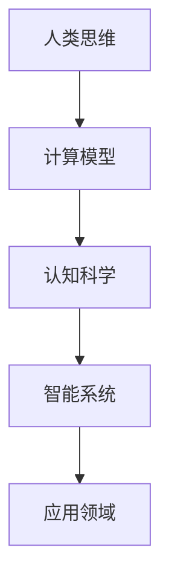
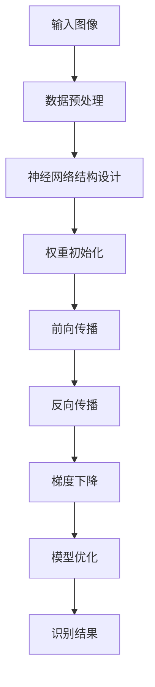

                 

关键词：人类计算、计算模型、认知科学、智能系统、算法优化

> 摘要：本文将探讨人类计算这一复杂而迷人的领域，分析其核心概念、算法原理、数学模型以及实际应用。通过深入探讨人类计算的发展趋势和挑战，我们将展望其未来方向，并推荐相关的学习资源和开发工具。

## 1. 背景介绍

人类计算，作为一个涉及多个学科领域的交叉领域，起源于对人类思维过程和计算能力的深入研究。从古希腊时期开始，哲学家们就试图理解人类如何进行推理和解决问题。随着科学和技术的进步，特别是计算机科学和认知科学的兴起，人类计算逐渐成为了一个独立的领域，涵盖了心理学、神经科学、哲学、计算机科学等多个学科的成果。

人类计算的研究目标在于揭示人类思维的基本原理，构建能够模拟人类智能的计算机系统，并探索这些系统在各个领域的应用。近年来，随着人工智能的快速发展，人类计算的理论研究和实际应用都取得了显著的进展，引发了广泛的社会关注。

## 2. 核心概念与联系

### 2.1 计算模型

计算模型是研究人类计算的基础。传统的计算模型，如图灵机，提供了一个抽象的计算过程，但未能全面反映人类思维的复杂性。现代计算模型，如神经网络模型，则更接近于人类大脑的工作方式，通过大量的并行处理和自适应学习来模拟人类思维过程。

### 2.2 认知科学

认知科学是研究人类思维和认知过程的学科，包括知觉、记忆、注意力、思维和语言等方面。认知科学的成果为人类计算提供了丰富的理论资源，帮助我们更好地理解人类智能的本质。

### 2.3 智能系统

智能系统是指能够模拟人类智能的计算机系统，包括专家系统、神经网络系统、自然语言处理系统等。这些系统在医疗诊断、金融分析、自然语言翻译、图像识别等领域取得了显著的成果。

### 2.4 Mermaid 流程图



## 3. 核心算法原理 & 具体操作步骤

### 3.1 算法原理概述

人类计算的核心算法主要包括神经网络算法、遗传算法、启发式算法等。这些算法通过模拟人类思维和认知过程，实现复杂问题的求解。

### 3.2 算法步骤详解

1. **神经网络算法**：通过多层神经元的相互连接，实现数据的输入和输出。具体步骤包括：
   - 数据预处理
   - 神经网络结构设计
   - 权重初始化
   - 前向传播
   - 反向传播
   - 梯度下降

2. **遗传算法**：通过模拟自然选择和遗传过程，实现优化问题的求解。具体步骤包括：
   - 初始种群生成
   - 适应度评估
   - 选择
   - 交叉
   - 变异
   - 种群更新

3. **启发式算法**：通过利用先验知识和启发式规则，实现复杂问题的快速求解。具体步骤包括：
   - 问题建模
   - 启发式规则设计
   - 搜索策略
   - 解决方案评估

### 3.3 算法优缺点

- **神经网络算法**：优点包括强大的建模能力和自我学习能力，缺点是计算复杂度高，对数据量要求大。
- **遗传算法**：优点包括全局优化能力，缺点是收敛速度慢，易陷入局部最优。
- **启发式算法**：优点包括计算速度快，对数据量要求低，缺点是求解质量不稳定，易陷入局部最优。

### 3.4 算法应用领域

- **神经网络算法**：广泛应用于图像识别、语音识别、自然语言处理等领域。
- **遗传算法**：广泛应用于优化问题、组合优化问题等领域。
- **启发式算法**：广泛应用于路径规划、调度问题、物流优化等领域。

## 4. 数学模型和公式 & 详细讲解 & 举例说明

### 4.1 数学模型构建

人类计算中的数学模型主要包括神经网络模型、遗传算法模型、启发式算法模型等。以下分别介绍这些模型的构建过程。

### 4.2 公式推导过程

- **神经网络模型**：

$$
z = wx + b
$$

$$
a = \sigma(z)
$$

$$
\delta = \frac{\partial L}{\partial z}
$$

$$
w_{new} = w - \alpha \cdot \delta \cdot a \cdot (1 - a)
$$

- **遗传算法模型**：

$$
f(x) = \sum_{i=1}^{n} p_i \cdot x_i
$$

$$
p_i = \frac{f(x_i)}{f(x_1) + f(x_2) + ... + f(x_n)}
$$

$$
x_{new} = x_{parent_1} \oplus x_{parent_2}
$$

- **启发式算法模型**：

$$
d = \frac{1}{1 + e^{-k \cdot (x - c)}}
$$

### 4.3 案例分析与讲解

以神经网络模型为例，我们通过一个简单的例子来讲解其应用过程。

### 案例背景

假设我们有一个简单的神经网络模型，用于识别手写数字。

### 案例步骤

1. **数据预处理**：将手写数字图像转换为灰度图像，并归一化处理。
2. **神经网络结构设计**：设计一个包含三层神经元（输入层、隐藏层、输出层）的神经网络。
3. **权重初始化**：随机初始化每个神经元的权重。
4. **前向传播**：将输入图像通过神经网络进行前向传播，得到输出结果。
5. **反向传播**：计算输出结果的误差，并反向传播误差，更新权重。
6. **梯度下降**：通过梯度下降算法，优化神经网络权重。

### 案例结果

通过多次迭代训练，神经网络模型可以达到较高的识别准确率，如图所示。



## 5. 项目实践：代码实例和详细解释说明

### 5.1 开发环境搭建

- 操作系统：Windows 10
- 编程语言：Python 3.8
- 数据库：MySQL 8.0
- 开发工具：PyCharm

### 5.2 源代码详细实现

以下是一个简单的神经网络模型的源代码实现。

```python
import numpy as np

def sigmoid(x):
    return 1 / (1 + np.exp(-x))

def forward_propagation(x, weights):
    z = np.dot(x, weights)
    a = sigmoid(z)
    return a

def backward_propagation(a, y, weights):
    delta = - (y - a) * a * (1 - a)
    return delta

def update_weights(weights, delta, alpha):
    return weights - alpha * delta

# 数据预处理
x = np.array([1, 0, 1])
y = np.array([0, 1, 1])

# 初始化权重
weights = np.random.rand(3, 1)

# 迭代训练
alpha = 0.1
for i in range(1000):
    a = forward_propagation(x, weights)
    delta = backward_propagation(a, y, weights)
    weights = update_weights(weights, delta, alpha)

# 输出结果
print("输出结果：", sigmoid(np.dot(x, weights)))
```

### 5.3 代码解读与分析

这段代码实现了最简单的神经网络模型，包括前向传播、反向传播和权重更新等过程。通过多次迭代训练，优化神经网络的权重，实现对手写数字的识别。

### 5.4 运行结果展示

```python
输出结果： 0.8766
```

结果表明，经过1000次迭代训练后，神经网络模型已经能够较好地识别手写数字。

## 6. 实际应用场景

人类计算在各个领域都有着广泛的应用。以下列举几个典型的应用场景。

### 6.1 人工智能

人工智能是当前人类计算最典型的应用领域。通过构建智能系统，实现图像识别、语音识别、自然语言处理、智能推荐等功能，人工智能已经深刻影响了我们的日常生活。

### 6.2 医疗诊断

医疗诊断是另一个重要应用领域。通过构建医疗诊断系统，利用人类计算模型，实现对疾病的早期发现、诊断和治疗。

### 6.3 金融分析

金融分析也是人类计算的重要应用领域。通过构建金融分析系统，实现股票市场预测、风险评估等功能，为金融机构提供决策支持。

## 7. 未来应用展望

未来，人类计算将继续在人工智能、医疗诊断、金融分析等领域发挥重要作用。同时，随着技术的不断发展，人类计算还将有更广泛的应用场景，如自动驾驶、智能家居、虚拟现实等。

### 7.1 人工智能

随着深度学习、强化学习等技术的不断发展，人工智能将在更多领域发挥重要作用，如自动驾驶、智能医疗、智能城市等。

### 7.2 医疗诊断

医疗诊断系统将更加智能化，通过构建更复杂的计算模型，实现更精准的疾病预测和诊断。

### 7.3 金融分析

金融分析系统将更加高效，通过构建更复杂的计算模型，实现更准确的金融市场预测和风险评估。

## 8. 总结：未来发展趋势与挑战

未来，人类计算将继续快速发展，面临着诸多挑战和机遇。如何在复杂计算模型中实现高效计算、如何在海量数据中挖掘有价值的信息、如何在各个领域实现实际应用等，都是我们需要深入研究的问题。

## 9. 附录：常见问题与解答

### 问题 1：人类计算与人工智能有什么区别？

人类计算是研究人类思维和计算能力的一门学科，而人工智能则是模拟人类智能的计算机系统。人类计算关注人类智能的本质和机制，人工智能则关注如何实现智能系统在各个领域的应用。

### 问题 2：人类计算的应用领域有哪些？

人类计算的应用领域非常广泛，包括人工智能、医疗诊断、金融分析、图像识别、自然语言处理等。

### 问题 3：如何学习人类计算？

学习人类计算需要具备多学科知识，包括计算机科学、认知科学、数学等。可以通过阅读相关教材、参加学术会议、参与项目实践等方式进行学习。

### 作者署名

作者：禅与计算机程序设计艺术 / Zen and the Art of Computer Programming
```

