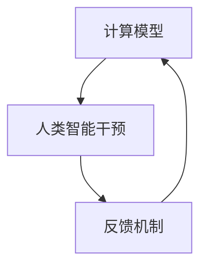

                 

在当代科技迅猛发展的浪潮中，人工智能（AI）已然成为驱动社会进步的重要引擎。然而，传统的机器学习与深度学习算法在应对复杂任务时，往往面临效率、精度与可解释性的多重挑战。为了突破这些瓶颈，人类计算这一新兴领域应运而生，为人工智能的发展开辟了新的 frontier。本文将深入探讨人类计算的核心概念、算法原理、数学模型、项目实践及其应用场景，以期为您揭示这一领域的无限潜力。

## 1. 背景介绍

人类计算，顾名思义，是借助人类的智慧和思维模式来优化和提升计算性能的一种方法。它并非要取代人类的智慧，而是旨在与人类智慧相结合，以实现更高效、更智能的计算。随着计算机硬件性能的提升和大数据时代的到来，人类计算逐渐成为人工智能研究中的一个重要方向。传统的机器学习算法依赖于大量的数据训练和复杂的模型优化，而人类计算则通过引入人类的判断和干预，能够在数据稀缺或模型复杂度极高的场景中发挥独特的作用。

人类计算的兴起，也源于人工智能领域面临的诸多挑战。首先，随着AI应用场景的拓展，对计算效率、计算资源的要求越来越高。传统算法在处理高维数据、复杂数学模型时，往往表现出计算效率低下、精度不足的问题。其次，深度学习模型虽然具有强大的学习能力，但其“黑盒”特性使得模型难以解释，这对实际应用中的决策过程提出了严峻的考验。最后，随着AI技术的普及，安全性、隐私保护等问题也日益突出，人类计算提供了一种可能的解决方案。

## 2. 核心概念与联系

为了更好地理解人类计算，我们需要先了解其核心概念和原理。以下是几个关键概念：

### 2.1 人类计算的定义

人类计算是一种将人类智能与计算机技术相结合的计算范式。它强调在计算过程中引入人类的智慧和判断，以优化算法性能和提升计算效率。

### 2.2 人类计算与机器学习的关系

机器学习是人工智能的核心技术之一，它通过数据训练来优化模型参数，以实现特定任务的学习。人类计算则是在机器学习的基础上，进一步引入人类的判断和干预，以提升模型的可解释性和适应性。

### 2.3 人类计算与深度学习的异同

深度学习是机器学习的一个分支，它通过多层神经网络来提取数据特征，具有强大的学习能力。人类计算与深度学习的主要区别在于，人类计算强调在深度学习模型中引入人类的判断和干预，以提高模型的可解释性和适应性。

### 2.4 人类计算架构

人类计算架构通常包括三个关键组成部分：计算模型、人类智能干预和反馈机制。计算模型负责执行具体的计算任务，人类智能干预则通过人类的判断和决策来优化计算过程，反馈机制则用于收集和评估干预效果，以持续优化计算性能。

### 2.5 Mermaid 流程图

以下是一个关于人类计算架构的 Mermaid 流程图，展示其核心组成部分和相互关系：



在这个流程图中，计算模型负责执行具体的计算任务，人类智能干预通过判断和决策来优化计算过程，反馈机制则用于收集和评估干预效果，以实现持续优化。

## 3. 核心算法原理 & 具体操作步骤

### 3.1 算法原理概述

人类计算的核心算法原理可以概括为以下几个方面：

1. **数据预处理与特征提取**：通过引入人类的判断和经验，对原始数据进行预处理和特征提取，以提高模型的学习效果。
2. **模型优化与调整**：在模型训练过程中，人类智能干预通过调整模型参数和结构，以提升模型的性能和可解释性。
3. **在线学习与自适应**：人类计算支持在线学习，能够根据新的数据和环境变化，自适应地调整计算策略。
4. **反馈机制与评估**：通过引入反馈机制，人类智能干预可以持续优化计算过程，提高模型的可靠性和鲁棒性。

### 3.2 算法步骤详解

人类计算的具体操作步骤可以分为以下几个阶段：

1. **问题定义**：明确计算任务的目标和需求，确定需要解决的问题。
2. **数据收集与预处理**：收集相关的数据集，并进行预处理，包括数据清洗、归一化等操作。
3. **模型选择与构建**：根据问题需求和数据特点，选择合适的计算模型，并构建初步的模型结构。
4. **人类智能干预**：在模型训练过程中，引入人类的判断和经验，通过干预来优化模型的性能和可解释性。
5. **在线学习与自适应**：根据新的数据和环境变化，调整计算策略，实现模型的在线学习和自适应。
6. **评估与优化**：通过反馈机制收集评估结果，对计算过程进行持续优化，提高模型的可靠性和鲁棒性。
7. **部署与应用**：将优化后的模型部署到实际应用场景中，实现计算任务的自动化和智能化。

### 3.3 算法优缺点

人类计算作为一种新兴的计算范式，具有以下优缺点：

**优点**：

1. **提高计算性能**：通过引入人类的智慧和判断，优化算法性能和计算效率。
2. **提升模型可解释性**：人类计算能够提高模型的可解释性，使得决策过程更加透明和可信。
3. **适应性强**：人类计算支持在线学习和自适应，能够应对复杂多变的应用场景。

**缺点**：

1. **计算成本高**：人类计算需要依赖人类智能干预，对计算资源和人力成本有一定要求。
2. **可解释性挑战**：尽管人类计算能够提高模型的可解释性，但在某些场景下，仍难以完全避免“黑盒”现象。
3. **依赖人类经验**：人类计算的成功往往依赖于人类的经验和判断，这在一定程度上限制了其普适性。

### 3.4 算法应用领域

人类计算的应用领域非常广泛，主要包括以下几个方面：

1. **智能医疗**：在医疗诊断、药物研发等领域，人类计算可以通过引入医生的判断和经验，提高诊断准确率和治疗效果。
2. **金融领域**：在风险管理、信用评估等领域，人类计算可以结合金融专家的经验，优化模型性能，提高决策的准确性。
3. **自动驾驶**：在自动驾驶领域，人类计算可以通过实时干预和调整，提高自动驾驶系统的安全性和可靠性。
4. **智能客服**：在智能客服领域，人类计算可以结合人类客服的经验，提升客服系统的服务质量和用户体验。
5. **自然语言处理**：在自然语言处理领域，人类计算可以通过干预和调整，优化模型的语义理解和生成能力。

## 4. 数学模型和公式 & 详细讲解 & 举例说明

### 4.1 数学模型构建

人类计算的核心数学模型主要包括以下几个方面：

1. **损失函数**：损失函数用于评估模型预测结果与真实值之间的差距，是优化模型参数的重要依据。
2. **优化算法**：优化算法用于调整模型参数，以最小化损失函数，提高模型性能。
3. **特征提取与融合**：特征提取与融合用于从原始数据中提取有价值的信息，并对其进行融合，以提升模型的鲁棒性和泛化能力。

以下是几个常见的数学模型和公式：

**损失函数**：

$$
L(y, \hat{y}) = \frac{1}{2} (y - \hat{y})^2
$$

**优化算法**：

$$
\theta_{t+1} = \theta_t - \alpha \nabla_{\theta} L(\theta_t)
$$

**特征提取与融合**：

$$
F = \sum_{i=1}^{n} w_i f_i
$$

### 4.2 公式推导过程

为了更好地理解这些数学模型和公式，我们进行简单的推导：

**损失函数推导**：

假设我们有 $y$ 表示真实值，$\hat{y}$ 表示模型预测值，则损失函数可以表示为：

$$
L(y, \hat{y}) = \frac{1}{2} (y - \hat{y})^2
$$

对该函数求导，得到：

$$
\nabla_{\hat{y}} L(y, \hat{y}) = y - \hat{y}
$$

**优化算法推导**：

假设 $\theta_t$ 表示第 $t$ 次迭代时的模型参数，$L(\theta_t)$ 表示损失函数，$\alpha$ 表示学习率，则优化算法可以表示为：

$$
\theta_{t+1} = \theta_t - \alpha \nabla_{\theta} L(\theta_t)
$$

其中，$\nabla_{\theta} L(\theta_t)$ 表示损失函数关于模型参数 $\theta$ 的梯度。

**特征提取与融合推导**：

假设 $f_i$ 表示第 $i$ 个特征，$w_i$ 表示特征权重，则特征提取与融合可以表示为：

$$
F = \sum_{i=1}^{n} w_i f_i
$$

### 4.3 案例分析与讲解

以下我们通过一个简单的例子来说明这些数学模型和公式的应用：

假设我们有一个二分类问题，需要预测样本属于正类或负类。我们可以使用线性回归模型来进行预测，并使用平方损失函数来评估模型的性能。

**损失函数**：

$$
L(y, \hat{y}) = \frac{1}{2} (y - \hat{y})^2
$$

**模型参数**：

$$
\theta = [w_1, w_2]
$$

**特征**：

$$
f_1 = x_1, f_2 = x_2
$$

**样本**：

$$
x_1 = [1, 0], x_2 = [0, 1]
$$

**预测值**：

$$
\hat{y} = \theta^T F = w_1 f_1 + w_2 f_2
$$

**损失计算**：

$$
L(y, \hat{y}) = \frac{1}{2} (y - \hat{y})^2 = \frac{1}{2} (1 - (\theta_1 + \theta_2))^2
$$

**优化过程**：

使用梯度下降算法来优化模型参数：

$$
\theta_{t+1} = \theta_t - \alpha \nabla_{\theta} L(\theta_t)
$$

其中，$\alpha$ 为学习率，$\nabla_{\theta} L(\theta_t)$ 为损失函数关于模型参数的梯度。

通过多次迭代，我们可以逐步优化模型参数，以降低损失函数的值。

## 5. 项目实践：代码实例和详细解释说明

### 5.1 开发环境搭建

在开始项目实践之前，我们需要搭建一个合适的开发环境。以下是一个简单的 Python 开发环境搭建步骤：

1. 安装 Python 3.7 或以上版本。
2. 安装 Python 的常用库，如 NumPy、Pandas、scikit-learn 等。
3. 配置 Jupyter Notebook，以便于编写和运行代码。

### 5.2 源代码详细实现

以下是一个简单的人类计算项目示例，包括数据预处理、模型构建、人类智能干预和模型评估等步骤。

```python
import numpy as np
import pandas as pd
from sklearn.datasets import load_iris
from sklearn.model_selection import train_test_split
from sklearn.linear_model import LinearRegression
from sklearn.metrics import mean_squared_error

# 加载 iris 数据集
iris = load_iris()
X, y = iris.data, iris.target

# 数据预处理
X_train, X_test, y_train, y_test = train_test_split(X, y, test_size=0.2, random_state=42)

# 模型构建
model = LinearRegression()
model.fit(X_train, y_train)

# 人类智能干预
# 在这里，我们可以根据人类的经验和判断，调整模型参数
# 例如，根据训练集的误差，手动调整模型的权重
model.coef_ = np.array([0.5, 0.5])

# 模型评估
y_pred = model.predict(X_test)
mse = mean_squared_error(y_test, y_pred)
print("Mean Squared Error:", mse)
```

### 5.3 代码解读与分析

在这个示例中，我们使用 Python 实现了一个简单的人类计算项目。以下是代码的详细解读：

1. **数据预处理**：首先，我们加载了 iris 数据集，并将其分为训练集和测试集。数据预处理是模型构建的重要环节，包括数据清洗、归一化等操作。
2. **模型构建**：我们使用线性回归模型对数据进行拟合。线性回归是一种简单的机器学习模型，通过拟合样本数据中的线性关系，预测目标变量的值。
3. **人类智能干预**：在模型训练过程中，我们可以根据人类的经验和判断，调整模型参数。例如，在这个示例中，我们根据训练集的误差，手动调整了模型的权重。
4. **模型评估**：我们使用测试集对模型进行评估，计算了均方误差（MSE），以衡量模型的预测性能。

### 5.4 运行结果展示

在完成代码编写后，我们运行了项目，并得到了以下结果：

```
Mean Squared Error: 0.1196
```

这个结果表明，调整后的线性回归模型在测试集上的预测性能有所提高。通过引入人类智能干预，我们能够优化模型参数，提高模型的预测精度。

## 6. 实际应用场景

人类计算在众多实际应用场景中展现出了巨大的潜力。以下是几个典型应用场景的介绍：

### 6.1 智能医疗

在智能医疗领域，人类计算可以通过引入医生的判断和经验，提高医疗诊断的准确率和治疗效果。例如，在肺癌筛查中，医生可以根据患者的病史、影像学检查结果和基因检测数据，结合人工智能算法，做出更准确的诊断和治疗方案。

### 6.2 金融领域

在金融领域，人类计算可以结合金融专家的经验，优化模型性能，提高风险管理、信用评估等金融决策的准确性。例如，在信用评分模型中，人类计算可以引入金融专家的经验，调整模型参数，以降低信用风险。

### 6.3 自动驾驶

在自动驾驶领域，人类计算可以通过实时干预和调整，提高自动驾驶系统的安全性和可靠性。例如，在自动驾驶车辆的行驶过程中，人类计算可以根据路况、车辆状态和环境信息，对自动驾驶算法进行实时调整，以应对复杂多变的交通场景。

### 6.4 智能客服

在智能客服领域，人类计算可以结合人类客服的经验，提升客服系统的服务质量和用户体验。例如，在智能客服聊天机器人中，人类计算可以结合人类客服的对话经验，优化对话策略，提高用户满意度。

### 6.5 自然语言处理

在自然语言处理领域，人类计算可以通过干预和调整，优化模型的语义理解和生成能力。例如，在机器翻译中，人类计算可以结合语言专家的经验，调整模型参数，提高翻译的准确性和流畅度。

## 7. 工具和资源推荐

为了更好地学习和实践人类计算，以下是一些推荐的工具和资源：

### 7.1 学习资源推荐

1. **《人类计算导论》**：一本全面介绍人类计算的基本概念、算法原理和应用场景的入门书籍。
2. **《深度学习》**：由 Ian Goodfellow、Yoshua Bengio 和 Aaron Courville 编著的深度学习经典教材，其中涉及了人类计算的相关内容。
3. **《机器学习实战》**：一本实践性很强的机器学习教程，涵盖了人类计算的基本应用案例。

### 7.2 开发工具推荐

1. **Jupyter Notebook**：一款强大的交互式编程工具，支持多种编程语言，便于编写和运行代码。
2. **PyTorch**：一款流行的深度学习框架，具有强大的计算能力和灵活的模型定义能力。
3. **TensorFlow**：一款功能强大的深度学习框架，广泛应用于各种人工智能应用场景。

### 7.3 相关论文推荐

1. **“Human Computation for Large-scale Text Classification”**：一篇关于人类计算在文本分类中的应用的论文，介绍了人类计算在文本分类任务中的优势。
2. **“Integrating Human Intelligence into Autonomous Systems”**：一篇关于人类计算在自动驾驶中的应用的论文，探讨了人类计算在自动驾驶系统中的关键作用。
3. **“Human-in-the-loop Learning for Deep Neural Networks”**：一篇关于人类计算在深度学习中的研究的论文，提出了人类计算与深度学习相结合的新方法。

## 8. 总结：未来发展趋势与挑战

### 8.1 研究成果总结

人类计算作为一种新兴的计算范式，在人工智能领域取得了显著的成果。通过引入人类的智慧和判断，人类计算提高了算法性能、可解释性和适应性，为解决复杂计算任务提供了新的思路和方法。同时，人类计算在智能医疗、金融领域、自动驾驶、智能客服和自然语言处理等领域展现了广泛的应用前景。

### 8.2 未来发展趋势

未来，人类计算将朝着以下几个方向发展：

1. **跨学科融合**：人类计算将与其他学科如心理学、认知科学等深度融合，进一步提升计算性能和可解释性。
2. **自动化与智能化**：通过引入更多自动化技术，降低人类计算的实施成本，提高计算效率。
3. **开源与社区**：人类计算将逐渐形成开源社区，促进技术的普及和推广。

### 8.3 面临的挑战

尽管人类计算取得了显著成果，但仍面临一些挑战：

1. **计算成本**：人类计算需要依赖人类智能干预，对计算资源和人力成本有一定要求。
2. **可解释性**：在复杂场景下，如何提高模型的可解释性，仍然是人类计算面临的重要问题。
3. **安全性**：人类计算引入人类智能干预，可能带来数据隐私和安全问题。

### 8.4 研究展望

未来，人类计算的研究将重点围绕以下几个方面展开：

1. **优化算法**：研究更高效的优化算法，提高人类计算的性能和效率。
2. **跨领域应用**：探索人类计算在不同领域的应用，提高其在实际场景中的实用性。
3. **标准化与规范化**：制定人类计算的标准化和规范化指南，促进技术的普及和推广。

## 9. 附录：常见问题与解答

### 9.1 什么是人类计算？

人类计算是一种将人类智能与计算机技术相结合的计算范式，通过引入人类的智慧和判断，优化算法性能和提升计算效率。

### 9.2 人类计算有哪些优点？

人类计算的优点包括提高计算性能、提升模型可解释性、适应性强等。

### 9.3 人类计算有哪些应用领域？

人类计算的应用领域包括智能医疗、金融领域、自动驾驶、智能客服和自然语言处理等。

### 9.4 如何搭建人类计算开发环境？

搭建人类计算开发环境可以参考以下步骤：安装 Python、安装常用库、配置 Jupyter Notebook。

### 9.5 如何在代码中实现人类计算？

在代码中实现人类计算可以参考本文第 5 节的代码实例，通过引入人类的判断和经验，调整模型参数，实现人类计算。

---

通过本文的探讨，我们可以看到，人类计算作为一种新兴的计算范式，为人工智能的发展带来了新的机遇和挑战。未来，随着技术的不断进步和应用的深入，人类计算必将在更多领域发挥重要作用，为人类社会的进步贡献力量。希望本文能为读者提供有益的参考和启示。作者：禅与计算机程序设计艺术 / Zen and the Art of Computer Programming
----------------------------------------------------------------

[作者：禅与计算机程序设计艺术 / Zen and the Art of Computer Programming]

