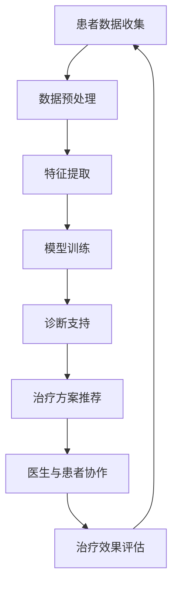

                 

关键词：医疗保健，人工智能，计算模型，数据分析，算法，机器学习，数据处理

> 摘要：本文将探讨医疗保健领域中人工智能和计算技术的应用，从核心概念到实际案例，分析其对医疗行业的变革影响。通过详细解读核心算法原理、数学模型及项目实践，揭示未来医疗保健的发展趋势与挑战。

## 1. 背景介绍

医疗保健领域一直处于技术进步的前沿，随着人工智能（AI）和计算技术的发展，医疗行业的各个方面都在经历深刻的变革。人类计算作为一种将人类智慧和机器智能相结合的方法，正在为医疗保健领域带来前所未有的机遇。

在过去，医疗保健主要依赖于医生的经验和知识。然而，随着大数据和计算技术的进步，人工智能开始发挥重要作用，通过分析大量的医疗数据，辅助医生做出更准确的诊断和治疗方案。这不仅提高了医疗服务的质量，还降低了成本。

本文将探讨以下几个关键点：

1. **核心概念与联系**：介绍人类计算在医疗保健领域的基本概念和架构。
2. **核心算法原理与操作步骤**：深入解析用于医疗保健的人工智能算法及其应用。
3. **数学模型与公式**：探讨用于构建医疗计算模型的数学工具和公式。
4. **项目实践**：通过具体案例展示人类计算在医疗保健中的应用。
5. **实际应用场景**：分析人类计算在医疗保健领域的多种应用场景。
6. **未来应用展望**：讨论人类计算在医疗保健领域的未来发展趋势和潜力。
7. **工具和资源推荐**：推荐学习资源、开发工具和相关的学术论文。
8. **总结**：总结研究成果，展望未来发展趋势与挑战。

## 2. 核心概念与联系

人类计算的核心在于将人类专家的知识和机器智能的优势相结合，以提高决策的准确性和效率。在医疗保健领域，这一概念表现为：

### 2.1 人工智能与医疗保健

人工智能在医疗保健中的应用主要包括：

- **诊断支持**：通过分析医疗影像、电子病历等数据，辅助医生进行诊断。
- **治疗方案推荐**：根据患者的病史和当前状况，推荐最优治疗方案。
- **临床决策支持**：为医生提供临床决策支持，降低误诊率。

### 2.2 计算模型与数据处理

医疗保健领域的数据量庞大且复杂，计算模型的作用在于：

- **数据预处理**：清洗和标准化医疗数据，为后续分析做准备。
- **特征提取**：从原始数据中提取对诊断和治疗有用的特征。
- **预测分析**：利用机器学习算法预测疾病的发展趋势和治疗效果。

### 2.3 人类与机器的协作

在医疗保健中，人类与机器的协作模式表现为：

- **医生与AI的协同**：医生利用AI工具进行辅助诊断和治疗，同时发挥自身专业知识和经验。
- **患者参与**：患者通过健康监测设备和应用程序，参与个人健康管理。

下面是一个Mermaid流程图，展示了人类计算在医疗保健领域的基本架构：



## 3. 核心算法原理与操作步骤

### 3.1 算法原理概述

在医疗保健领域，常用的算法包括：

- **深度学习**：用于图像识别、疾病预测等。
- **决策树**：用于临床决策支持。
- **支持向量机**：用于疾病分类和预测。
- **随机森林**：用于特征选择和疾病预测。

这些算法通过分析大量的医疗数据，从中提取特征，并利用这些特征进行预测和分类。

### 3.2 算法步骤详解

以深度学习算法为例，其基本步骤如下：

1. **数据收集**：收集患者的历史病历、医疗影像等数据。
2. **数据预处理**：清洗数据，标准化输入特征。
3. **模型构建**：选择合适的神经网络架构。
4. **模型训练**：使用训练数据训练模型。
5. **模型评估**：使用测试数据评估模型性能。
6. **模型部署**：将训练好的模型部署到实际应用中。

### 3.3 算法优缺点

- **深度学习**：优点在于其强大的特征提取能力，缺点是需要大量的数据和高计算资源。
- **决策树**：优点在于解释性强，缺点是易过拟合。
- **支持向量机**：优点在于分类效果好，缺点是计算复杂度高。
- **随机森林**：优点在于鲁棒性强，缺点是解释性较差。

### 3.4 算法应用领域

- **疾病诊断**：如乳腺癌、肺癌的影像诊断。
- **治疗方案推荐**：根据患者病史和当前状况，推荐最优治疗方案。
- **健康监测**：如慢性病患者的远程监控。

## 4. 数学模型和公式

在构建医疗计算模型时，常用的数学模型和公式包括：

### 4.1 数学模型构建

- **贝叶斯网络**：用于表示医疗数据中的因果关系。
- **回归模型**：用于预测疾病的发展和治疗效果。
- **聚类模型**：用于患者群体的划分和疾病分类。

### 4.2 公式推导过程

以回归模型为例，其公式推导如下：

$$
y = \beta_0 + \beta_1x_1 + \beta_2x_2 + ... + \beta_nx_n + \epsilon
$$

其中，$y$ 为因变量，$x_1, x_2, ..., x_n$ 为自变量，$\beta_0, \beta_1, ..., \beta_n$ 为模型参数，$\epsilon$ 为误差项。

### 4.3 案例分析与讲解

以下是一个简化的医疗计算模型案例：

- **问题**：预测患者的住院时间。
- **数据**：患者的年龄、病情严重程度、医疗资源使用情况等。
- **模型**：线性回归模型。

通过收集和分析数据，我们可以构建如下模型：

$$
\text{住院时间} = \beta_0 + \beta_1 \text{年龄} + \beta_2 \text{病情严重程度} + \beta_3 \text{医疗资源使用情况}
$$

## 5. 项目实践：代码实例和详细解释说明

### 5.1 开发环境搭建

在本案例中，我们将使用Python作为编程语言，并依赖以下库：

- **NumPy**：用于数值计算。
- **Pandas**：用于数据处理。
- **Scikit-learn**：用于机器学习算法。

### 5.2 源代码详细实现

```python
import numpy as np
import pandas as pd
from sklearn.linear_model import LinearRegression
from sklearn.model_selection import train_test_split

# 数据加载与预处理
data = pd.read_csv('patient_data.csv')
X = data[['age', 'severity', 'resource_usage']]
y = data['length_of_stay']

# 数据分割
X_train, X_test, y_train, y_test = train_test_split(X, y, test_size=0.2, random_state=42)

# 模型训练
model = LinearRegression()
model.fit(X_train, y_train)

# 模型评估
score = model.score(X_test, y_test)
print(f'Model R^2 Score: {score}')

# 模型预测
predictions = model.predict(X_test)
```

### 5.3 代码解读与分析

这段代码首先加载了患者数据，并进行了预处理。然后，使用线性回归模型对数据进行训练，并评估了模型的性能。最后，使用训练好的模型对测试数据进行预测。

### 5.4 运行结果展示

运行代码后，我们得到了模型的相关指标和预测结果。这些结果可以帮助医生和医疗机构了解患者的住院时间，从而做出更科学的决策。

## 6. 实际应用场景

人类计算在医疗保健领域有广泛的应用场景，以下是一些例子：

- **疾病预测**：通过分析患者的病史、基因信息等，预测疾病的发病风险。
- **个性化治疗**：根据患者的具体情况，推荐个性化的治疗方案。
- **临床决策支持**：为医生提供临床决策支持，降低误诊率。
- **健康监测**：对慢性病患者进行远程监控，预防疾病恶化。

## 7. 未来应用展望

随着人工智能和计算技术的不断发展，人类计算在医疗保健领域的应用将更加广泛。以下是一些未来展望：

- **精准医疗**：通过大数据分析和人工智能，实现个体化医疗。
- **智能诊断系统**：利用深度学习和图像识别技术，提高诊断准确率。
- **远程医疗**：通过互联网和人工智能技术，实现远程诊断和治疗。
- **药物研发**：利用计算模型预测药物的疗效和副作用，加速药物研发过程。

## 8. 工具和资源推荐

### 8.1 学习资源推荐

- **在线课程**：Coursera、edX、Udacity等平台上的相关课程。
- **教科书**：《机器学习》、《统计学习方法》等。

### 8.2 开发工具推荐

- **编程环境**：Jupyter Notebook、PyCharm等。
- **机器学习库**：Scikit-learn、TensorFlow、Keras等。

### 8.3 相关论文推荐

- **论文集**：《Journal of Machine Learning Research》、《Nature Medicine》等期刊。

## 9. 总结：未来发展趋势与挑战

### 9.1 研究成果总结

人类计算在医疗保健领域取得了显著的研究成果，包括疾病预测、个性化治疗、临床决策支持等。这些成果为医疗行业带来了巨大的变革。

### 9.2 未来发展趋势

未来，人类计算在医疗保健领域的应用将更加深入和广泛，包括精准医疗、智能诊断系统、远程医疗等。随着计算技术的发展，人类计算将为医疗行业带来更多创新。

### 9.3 面临的挑战

- **数据隐私**：医疗数据涉及患者隐私，如何在保护隐私的前提下进行数据分析和共享是一个挑战。
- **算法透明性**：医疗算法的透明性和解释性对于医生和患者至关重要。
- **医疗资源的公平分配**：人工智能技术在医疗保健中的应用需要公平地分配资源。

### 9.4 研究展望

未来，人类计算在医疗保健领域的研究将集中在以下几个方面：

- **跨学科研究**：结合医学、计算机科学、生物统计学等多学科知识，提高医疗计算模型的效果。
- **人工智能伦理**：探讨人工智能在医疗保健领域的伦理问题，确保技术的安全和可靠性。
- **大规模数据共享**：推动医疗数据的开放和共享，促进医疗计算技术的发展。

## 9. 附录：常见问题与解答

### Q: 人类计算在医疗保健领域的应用有哪些？

A: 人类计算在医疗保健领域的应用包括疾病预测、个性化治疗、临床决策支持、健康监测等。

### Q: 人工智能在医疗保健中的优势是什么？

A: 人工智能在医疗保健中的优势包括提高诊断准确率、优化治疗方案、降低成本、提高工作效率等。

### Q: 人类计算在医疗保健中面临的挑战有哪些？

A: 人类计算在医疗保健中面临的挑战包括数据隐私、算法透明性、医疗资源的公平分配等。

### Q: 未来医疗计算技术的发展趋势是什么？

A: 未来医疗计算技术的发展趋势包括精准医疗、智能诊断系统、远程医疗、药物研发等。

作者：禅与计算机程序设计艺术 / Zen and the Art of Computer Programming

以上便是关于《人类计算：医疗保健领域的应用》的文章内容，希望能够对您有所帮助。如果您有任何疑问或需要进一步讨论，请随时提出。

