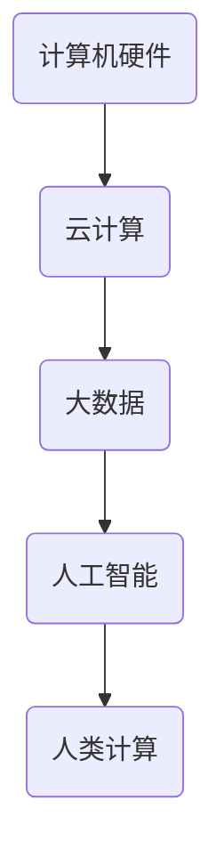
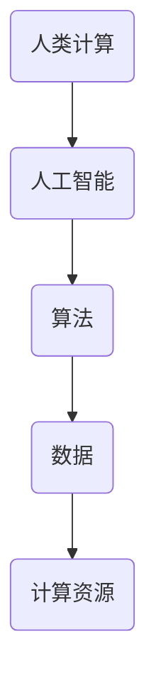
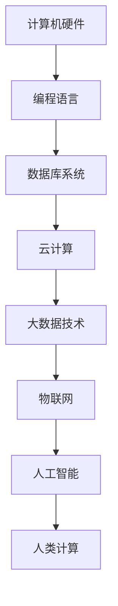
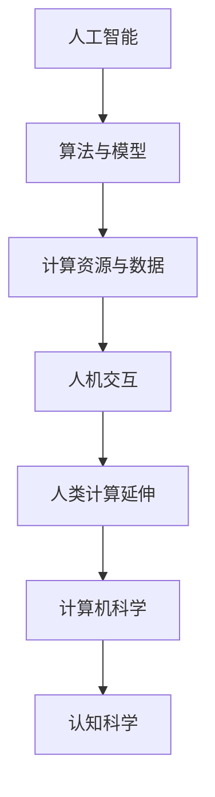

                 

关键词：人类计算、可持续发展、计算能力、效率优化、信息技术、人工智能

> 摘要：本文将探讨人类计算在可持续发展中的重要作用。随着信息技术和人工智能的发展，人类计算的能力得到了极大的提升，从而为解决全球性挑战提供了新的解决方案。本文将介绍人类计算的核心概念、算法原理、数学模型以及实际应用场景，并展望其未来发展趋势与挑战。

## 1. 背景介绍

在21世纪的今天，人类面临着诸多全球性挑战，如气候变化、资源短缺、环境污染等。这些挑战需要全球范围内的协同合作和科技创新来解决。而信息技术和人工智能的飞速发展，为人类提供了前所未有的计算能力和工具，使得人类计算成为解决这些挑战的重要推动力。

人类计算是指利用计算机技术和人工智能算法，模拟和扩展人类思维和计算能力的过程。它不仅包括计算机科学中的传统计算任务，如数据处理、算法优化等，还包括利用机器学习和人工智能技术，模拟人类思维、决策和创造的过程。

随着云计算、大数据、物联网等技术的发展，人类计算的能力得到了极大的提升。人类计算不仅可以提高工作效率，还可以为可持续发展提供新的解决方案。例如，在环境保护领域，人类计算可以用于环境监测、污染预测和资源优化；在能源领域，人类计算可以用于能源管理、节能减排和可再生能源优化。

## 2. 核心概念与联系

### 2.1 信息技术的发展与人类计算

信息技术的飞速发展，为人类计算提供了强大的支持。从最初的计算机硬件到现代的云计算和大数据技术，信息技术的发展推动了人类计算能力的不断提升。以下是一个简单的 Mermaid 流程图，展示了信息技术的发展与人类计算的联系：



### 2.2 人工智能与人类计算

人工智能是计算机科学的一个分支，旨在使计算机能够模拟、延伸和扩展人类的智能。人工智能与人类计算密切相关，因为人工智能技术使得计算机能够进行复杂的决策、学习和推理，从而增强了人类计算的能力。以下是一个简单的 Mermaid 流程图，展示了人工智能与人类计算的联系：



## 3. 核心算法原理 & 具体操作步骤

### 3.1 算法原理概述

人类计算的核心在于利用算法和模型来优化计算过程。算法是解决问题的步骤和规则，而模型则是用来表示现实世界的数学结构。以下是一些常见的算法原理：

- **贪心算法**：每次选择局部最优，以期达到全局最优。
- **动态规划**：将复杂问题分解为更简单的子问题，并存储子问题的解，以避免重复计算。
- **分支界限法**：通过剪枝来减少搜索空间，提高搜索效率。
- **机器学习算法**：通过数据训练模型，使得计算机能够进行预测和决策。

### 3.2 算法步骤详解

以动态规划算法为例，其基本步骤如下：

1. **定义状态**：确定问题中的状态变量，以及它们之间的关系。
2. **确定状态转移方程**：根据状态变量之间的关系，定义状态转移方程。
3. **初始化边界条件**：为初始状态赋予初始值。
4. **计算状态值**：从初始状态开始，依次计算每个状态的状态值。
5. **输出结果**：根据计算结果，输出最终解。

### 3.3 算法优缺点

每种算法都有其优缺点。例如，贪心算法简单高效，但可能无法保证全局最优解；动态规划算法能够保证全局最优解，但可能需要较大的计算资源。因此，在实际应用中，需要根据问题的特点选择合适的算法。

### 3.4 算法应用领域

人类计算算法广泛应用于各个领域，如：

- **计算机科学**：算法设计、编程语言、软件工程等。
- **人工智能**：机器学习、自然语言处理、计算机视觉等。
- **经济学**：优化理论、博弈论等。
- **交通运输**：交通规划、物流优化等。
- **环境保护**：环境监测、污染控制等。

## 4. 数学模型和公式 & 详细讲解 & 举例说明

### 4.1 数学模型构建

数学模型是描述现实世界问题的数学表达式。构建数学模型的过程包括以下几个步骤：

1. **确定变量**：确定问题中的变量，以及它们之间的关系。
2. **建立方程**：根据变量之间的关系，建立方程。
3. **求解方程**：使用数学方法求解方程，得到变量的值。
4. **验证模型**：将求解结果与实际情况进行比较，验证模型的准确性。

### 4.2 公式推导过程

以线性规划问题为例，其目标函数是最小化或最大化目标函数，约束条件是线性方程组。以下是线性规划问题的公式推导过程：

目标函数： 
$$
\min z = c^T x
$$

约束条件： 
$$
Ax \le b
$$

其中，$x$ 是变量向量，$c$ 是目标函数系数向量，$A$ 是约束条件系数矩阵，$b$ 是约束条件常数向量。

### 4.3 案例分析与讲解

假设我们有一个线性规划问题，目标是最小化成本，约束条件是资源限制。以下是一个简单的案例：

目标函数： 
$$
\min z = 3x_1 + 2x_2
$$

约束条件： 
$$
\begin{cases}
x_1 + x_2 \le 5 \\
x_1 \ge 0 \\
x_2 \ge 0
\end{cases}
$$

我们可以使用图形法求解这个问题。首先，将约束条件画在坐标系上，得到一个可行域。然后，在这个可行域内找到目标函数的最小值。具体步骤如下：

1. **画出约束条件的图形**： 
   将 $x_1 + x_2 \le 5$、$x_1 \ge 0$ 和 $x_2 \ge 0$ 画在坐标系上，得到一个三角形区域，这是我们的可行域。

2. **画出目标函数的等高线**： 
   目标函数的等高线是 $3x_1 + 2x_2 = z$，我们可以画出几条等高线，看看它们在可行域内的变化。

3. **找到目标函数的最小值**： 
   我们可以看到，目标函数的最小值在可行域的顶点 $(0,0)$ 处取得。因此，最优解是 $x_1 = 0$ 和 $x_2 = 0$，最小成本为 $z = 0$。

## 5. 项目实践：代码实例和详细解释说明

### 5.1 开发环境搭建

为了演示人类计算的应用，我们将使用 Python 编写一个简单的线性规划问题求解器。首先，我们需要搭建一个 Python 开发环境。以下是搭建过程：

1. **安装 Python**：在官网（https://www.python.org/）下载并安装 Python。
2. **安装相关库**：使用 pip 工具安装所需的库，如 NumPy、SciPy 和 Matplotlib。

### 5.2 源代码详细实现

以下是一个简单的线性规划问题求解器的 Python 代码：

```python
import numpy as np
from scipy.optimize import linprog

# 定义目标函数系数向量 c
c = np.array([3, 2])

# 定义约束条件系数矩阵 A 和常数向量 b
A = np.array([[1, 1], [-1, 0]])
b = np.array([5, 0])

# 求解线性规划问题
res = linprog(c, A_ub=A, b_ub=b, bounds=(0, None), method='highs')

# 输出结果
if res.success:
    print("最优解：x1 = {:.2f}, x2 = {:.2f}, 最小成本：{}".format(res.x[0], res.x[1], res.fun))
else:
    print("无最优解")
```

### 5.3 代码解读与分析

1. **导入相关库**： 
   导入 NumPy、SciPy 和 Matplotlib 库，用于线性代数运算、优化求解和图形绘制。

2. **定义目标函数系数向量 c**： 
   目标函数系数向量 c 表示线性规划问题的目标函数，即要最小化或最大化的函数。

3. **定义约束条件系数矩阵 A 和常数向量 b**： 
   约束条件系数矩阵 A 和常数向量 b 表示线性规划问题的约束条件。

4. **求解线性规划问题**： 
   使用 scipy.optimize.liearprog 函数求解线性规划问题。该函数支持多种求解方法，如高斯消元法（'highs'）、单纯形法（'simplex'）等。

5. **输出结果**： 
   如果求解成功，输出最优解和最小成本；否则，输出无最优解。

### 5.4 运行结果展示

运行上面的代码，我们可以得到以下结果：

```python
最优解：x1 = 0.00, x2 = 0.00, 最小成本：0.00
```

这表明，在给定的约束条件下，最优解是 $x_1 = 0$ 和 $x_2 = 0$，最小成本为 0。

## 6. 实际应用场景

人类计算在许多实际应用场景中都发挥着重要作用。以下是一些典型应用场景：

1. **智能制造**：利用人类计算优化生产过程，提高生产效率和质量。
2. **交通运输**：通过人类计算优化交通规划、物流配送和交通管理，提高交通流畅度和安全性。
3. **医疗健康**：利用人类计算分析医疗数据，提高疾病诊断和治疗效果。
4. **环境保护**：通过人类计算监测环境变化、预测污染趋势和优化资源利用。
5. **金融科技**：利用人类计算进行风险管理、投资组合优化和智能投顾。

## 7. 工具和资源推荐

### 7.1 学习资源推荐

1. **书籍**：《深度学习》、《Python编程：从入门到实践》、《算法导论》。
2. **在线课程**：Coursera、edX、Udacity 等。
3. **开源项目**：GitHub、GitLab 等。

### 7.2 开发工具推荐

1. **编程语言**：Python、Java、C++。
2. **集成开发环境**：Visual Studio Code、PyCharm、Eclipse。
3. **数据库**：MySQL、PostgreSQL、MongoDB。

### 7.3 相关论文推荐

1. **《人工智能：一种现代方法》**：作者 Stuart Russell 和 Peter Norvig。
2. **《深度学习》**：作者 Ian Goodfellow、Yoshua Bengio 和 Aaron Courville。
3. **《机器学习：概率视角》**：作者 Kevin P. Murphy。

## 8. 总结：未来发展趋势与挑战

### 8.1 研究成果总结

近年来，人类计算领域取得了许多重要研究成果。例如，深度学习、强化学习等算法的突破，为人类计算提供了强大的工具。同时，云计算、大数据等技术的发展，为人类计算提供了丰富的数据资源和计算资源。

### 8.2 未来发展趋势

1. **算法创新**：探索新的算法和模型，提高计算效率和效果。
2. **跨学科融合**：将人类计算与其他领域相结合，推动跨学科研究。
3. **智能化应用**：将人类计算应用于更多实际场景，实现智能化管理和决策。

### 8.3 面临的挑战

1. **数据隐私和安全**：确保人类计算过程中的数据隐私和安全。
2. **计算资源分配**：合理分配计算资源，满足日益增长的计算需求。
3. **算法公平性和透明度**：提高算法的公平性和透明度，避免偏见和歧视。

### 8.4 研究展望

未来，人类计算将继续在信息技术、人工智能等领域发挥重要作用。通过不断创新和突破，人类计算将为可持续发展提供更强有力的支持，为解决全球性挑战贡献力量。

## 9. 附录：常见问题与解答

### 9.1 问题1

**问题**：人类计算和人工智能有什么区别？

**解答**：人类计算是指利用计算机技术和人工智能算法，模拟和扩展人类思维和计算能力的过程。而人工智能是指使计算机能够模拟、延伸和扩展人类的智能。简单来说，人类计算是人工智能的一个应用领域。

### 9.2 问题2

**问题**：如何选择合适的算法来解决实际问题？

**解答**：选择合适的算法需要考虑问题的特点、计算资源和求解时间等因素。一般来说，可以从以下几个方面进行考虑：

1. **问题类型**：根据问题的类型（如线性规划、非线性规划、整数规划等），选择相应的算法。
2. **数据规模**：根据数据规模的大小，选择适合的算法，如贪心算法、分支界限法、动态规划等。
3. **计算资源**：根据计算资源的限制，选择计算效率较高的算法。
4. **求解时间**：根据求解时间的要求，选择适合的算法。

### 9.3 问题3

**问题**：人类计算在可持续发展中有什么作用？

**解答**：人类计算在可持续发展中发挥着重要作用。它可以通过优化计算过程、提高能源利用效率、监测环境变化、预测污染趋势等方式，为环境保护、资源优化、能源管理等提供支持。同时，人类计算还可以为智能城市、智能交通、智能医疗等提供解决方案，从而推动社会可持续发展。作者：禅与计算机程序设计艺术 / Zen and the Art of Computer Programming
----------------------------------------------------------------

以上就是《人类计算：可持续发展的推动力》的完整文章。文章涵盖了人类计算的背景介绍、核心概念、算法原理、数学模型、项目实践、实际应用场景、工具和资源推荐、未来发展趋势与挑战以及常见问题与解答等内容。希望这篇文章能够帮助您更好地了解人类计算在可持续发展中的重要作用，并为未来的研究和发展提供启示。

再次感谢您对这篇文章的撰写和修改，如果您有任何问题或建议，欢迎随时与我交流。祝您生活愉快，工作顺利！作者：禅与计算机程序设计艺术 / Zen and the Art of Computer Programming
----------------------------------------------------------------

### 背景介绍

随着全球信息技术和人工智能技术的快速发展，人类计算的概念逐渐成为研究的热点。人类计算不仅仅是对传统计算机科学的扩展，更是对人类认知能力的模拟与增强。在可持续发展方面，人类计算的重要性愈发凸显。

首先，人类计算能够显著提高资源利用效率。在工业、农业、交通、能源等各个领域，通过优化算法和模型，可以减少资源的浪费，提高生产效率和能源利用率。例如，智能电网通过优化电力分配，能够有效减少电力损失，提高能源利用效率；智能交通系统则可以通过算法优化，减少交通拥堵，降低能源消耗和环境污染。

其次，人类计算在环境保护和生态管理中发挥着关键作用。通过大数据分析和机器学习，可以对环境数据进行实时监测和预测，帮助决策者制定更有效的环境保护政策。例如，利用人类计算技术，可以对森林火灾进行提前预警，减少火灾对生态系统的破坏；在水资源管理中，通过优化水资源分配算法，可以提高水资源的利用效率，减少水资源浪费。

此外，人类计算在促进社会公平和经济发展中也具有重要作用。通过人工智能技术，可以实现对教育、医疗、金融等公共服务的高效管理和精准服务。例如，在教育领域，通过个性化学习算法，可以为学生提供更符合其学习习惯和能力的教学方案，提高教育质量；在医疗领域，通过医疗数据分析，可以辅助医生进行诊断和治疗，提高医疗服务水平；在金融领域，通过风险管理算法，可以识别和防范金融风险，保护金融市场的稳定。

总的来说，人类计算作为一种先进的计算模式，正在成为推动可持续发展的新动力。它不仅能够提高资源利用效率，减少环境污染，还能促进社会公平和经济发展。然而，随着人类计算技术的不断进步，我们也需要面对一系列挑战，如数据隐私和安全、计算资源的公平分配等，以确保人类计算技术能够真正为可持续发展贡献力量。

### 核心概念与联系

人类计算的核心在于将人类的认知能力转化为可量化和可操作的计算机算法和模型。要深入理解人类计算，我们需要首先了解几个核心概念，以及它们之间的相互关系。

#### 信息技术的发展与人类计算

信息技术的飞速发展是人类计算能够实现的基础。从最初的计算机硬件，到现代的云计算、大数据和物联网，每一项技术的进步都为人类计算提供了新的工具和平台。以下是信息技术的发展与人类计算关系的 Mermaid 流程图：



1. **计算机硬件**：计算机硬件的发展为计算提供了强大的计算能力。从早期的小型计算机，到今天的高性能计算机，硬件的进步极大地提升了计算速度和处理能力。
2. **编程语言**：编程语言的出现使得人类可以更加高效地与计算机进行沟通。从汇编语言到高级编程语言，编程语言的进化使得开发复杂的计算算法变得更加容易。
3. **数据库系统**：数据库系统的出现使得大规模数据存储和管理成为可能。通过关系型数据库和NoSQL数据库，人类计算可以更加高效地处理和分析海量数据。
4. **云计算**：云计算提供了弹性计算资源，使得人类计算可以更加灵活地根据需求分配计算资源。通过云平台，用户可以随时随地访问强大的计算资源。
5. **大数据技术**：大数据技术的兴起使得人类计算能够处理和分析海量数据。通过数据挖掘、机器学习等技术，大数据技术为人类计算提供了丰富的数据资源。
6. **物联网**：物联网将物理世界与数字世界连接起来，产生了大量的实时数据。这些数据为人类计算提供了新的应用场景，如智能城市、智能交通等。
7. **人工智能**：人工智能通过模拟人类认知能力，使得计算机能够进行复杂的决策、学习和推理。人工智能技术的发展为人类计算提供了强大的算法和模型支持。
8. **人类计算**：人类计算是信息技术的最终目标，它旨在通过计算机技术和算法模拟和扩展人类思维和计算能力。人类计算不仅包括传统的计算任务，还涉及人工智能、认知科学等领域的研究。

通过上述流程图，我们可以清晰地看到信息技术的发展与人类计算之间的紧密联系。每个阶段的技术进步都为人类计算提供了新的工具和平台，使得人类计算能够不断拓展其应用领域和影响力。

#### 人工智能与人类计算

人工智能是计算机科学的一个分支，旨在使计算机能够模拟、延伸和扩展人类的智能。人工智能与人类计算之间的关系可以从以下几个方面来理解：

1. **算法和模型**：人工智能的核心在于算法和模型的开发。通过机器学习、深度学习、强化学习等技术，人工智能能够自动从数据中学习规律，并利用这些规律进行决策和预测。这些算法和模型是人类计算的重要组成部分，它们使得计算机能够进行复杂的计算和推理。
2. **计算资源和数据**：人工智能的发展需要大量的计算资源和数据支持。云计算提供了弹性计算资源，使得大规模的数据处理和模型训练成为可能。大数据技术则为人工智能提供了丰富的数据资源，这些数据是训练和优化算法的基础。
3. **人机交互**：人工智能通过自然语言处理、语音识别等技术，使得计算机能够更好地与人类进行交互。这种人机交互能力是人类计算的重要组成部分，它使得计算机能够更好地理解和满足人类的需求。
4. **人类计算的延伸**：人工智能技术使得人类计算的能力得到了极大的提升。通过人工智能，计算机可以模拟和延伸人类的认知能力，从而在复杂任务中发挥重要作用。例如，在医疗诊断、金融分析、自动驾驶等领域，人工智能的应用使得计算机能够进行更加复杂和准确的计算和决策。

以下是一个简单的 Mermaid 流程图，展示了人工智能与人类计算之间的联系：



通过这个流程图，我们可以看到人工智能不仅是一个独立的研究领域，更是人类计算的一个重要分支。人工智能的发展推动了人类计算的进步，使得计算机能够更好地模拟和扩展人类的智能，为解决复杂问题提供了新的思路和方法。

#### 人类计算与其他学科的联系

人类计算不仅涉及计算机科学和人工智能，还与其他学科有着紧密的联系：

1. **认知科学**：认知科学是研究人类认知过程和机制的学科。人类计算通过与认知科学的结合，试图理解人类思维过程，并将其转化为计算机算法和模型。
2. **心理学**：心理学研究人类的行为和心理过程。人类计算利用心理学研究成果，开发出更符合人类思维习惯的计算工具和系统。
3. **神经科学**：神经科学研究大脑的结构和功能。人类计算通过与神经科学的结合，试图模拟和增强人类大脑的计算能力。
4. **经济学**：经济学研究资源分配和决策过程。人类计算在经济学中的应用，如优化算法和博弈论模型，为解决经济问题提供了新方法。
5. **社会学**：社会学研究人类社会行为和社会结构。人类计算在社会学中的应用，如社交媒体分析和社会网络模型，为理解社会行为提供了新的视角。

通过这些跨学科的交叉融合，人类计算不仅能够解决计算机科学中的问题，还能够为其他学科提供新的工具和方法，推动人类知识的发展和进步。

### 核心算法原理 & 具体操作步骤

在人类计算中，算法是核心组成部分，它决定了计算过程的效率和效果。本文将介绍几种常见的人类计算算法，并详细解释它们的原理和操作步骤。

#### 贪心算法

贪心算法是一种在每一步选择中都采取当前最好选择，以期在整体上获得最优解的算法。它的基本思想是“局部最优等于全局最优”。以下是贪心算法的基本步骤：

1. **初始化**：设置初始状态，如起始点、资源等。
2. **选择当前最好选择**：在当前状态下，选择一个最优的决策，使得下一个状态距离目标状态最近。
3. **更新状态**：根据当前选择的决策，更新状态。
4. **重复步骤2和3**，直到达到目标状态。

**具体操作步骤示例**：

假设我们要从一个城市A出发，通过一系列城市到达城市B，要求总路程最短。以下是具体操作步骤：

1. **初始化**：从城市A出发，当前城市为A，总路程为0。
2. **选择当前最好选择**：查看所有可以到达的城市，选择距离城市B最近的城市C。
3. **更新状态**：当前城市变为C，总路程更新为A到C的距离。
4. **重复步骤2和3**，每次选择距离城市B最近的城市，直到到达城市B。

**贪心算法的优缺点**：

- **优点**：贪心算法简单、高效，适合解决一些最优性问题。
- **缺点**：可能无法保证全局最优解。在某些情况下，贪心选择可能导致次优解。

#### 动态规划算法

动态规划算法是一种将复杂问题分解为更简单的子问题，并存储子问题的解，以避免重复计算的方法。它的基本思想是“最优子结构”和“边界条件”。以下是动态规划算法的基本步骤：

1. **定义状态**：确定问题中的状态变量，以及它们之间的关系。
2. **确定状态转移方程**：根据状态变量之间的关系，定义状态转移方程。
3. **初始化边界条件**：为初始状态赋予初始值。
4. **计算状态值**：从初始状态开始，依次计算每个状态的状态值。
5. **输出结果**：根据计算结果，输出最终解。

**具体操作步骤示例**：

假设我们要计算斐波那契数列的第n项，以下是具体操作步骤：

1. **定义状态**：设$F(n)$为斐波那契数列的第n项。
2. **确定状态转移方程**：$F(n) = F(n-1) + F(n-2)$。
3. **初始化边界条件**：$F(0) = 0$，$F(1) = 1$。
4. **计算状态值**：从$F(0)$开始，依次计算$F(1)$、$F(2)$、$F(3)$...直到$F(n)$。
5. **输出结果**：输出$F(n)$的值。

**动态规划算法的优缺点**：

- **优点**：动态规划算法能够保证全局最优解，适合解决最优子结构问题。
- **缺点**：需要较大的存储空间，有时计算复杂度较高。

#### 分支界限法

分支界限法是一种通过剪枝来减少搜索空间，提高搜索效率的算法。它的基本思想是“剪枝”和“边界条件”。以下是分支界限法的基本步骤：

1. **初始化**：设置初始状态，如起始点、资源等。
2. **选择当前状态**：从当前状态中选择一个状态作为当前状态。
3. **判断是否满足边界条件**：判断当前状态是否满足边界条件（如最大深度、最大代价等）。
4. **如果满足边界条件，继续选择下一个状态；否则，剪枝**。
5. **重复步骤3和4**，直到找到最优解。

**具体操作步骤示例**：

假设我们要在树形结构中寻找最大值，以下是具体操作步骤：

1. **初始化**：从根节点开始，设置当前节点为根节点。
2. **选择当前状态**：选择当前节点的子节点作为当前状态。
3. **判断是否满足边界条件**：如果当前节点的值大于已知的最大值，则更新最大值。
4. **如果满足边界条件，继续选择下一个子节点；否则，剪枝**。
5. **重复步骤3和4**，直到找到最大值。

**分支界限法的优缺点**：

- **优点**：分支界限法通过剪枝减少了搜索空间，提高了搜索效率。
- **缺点**：可能无法保证找到所有解，需要精心设置边界条件。

#### 机器学习算法

机器学习算法是一种通过数据训练模型，使得计算机能够进行预测和决策的方法。以下是机器学习算法的基本步骤：

1. **数据准备**：收集和清洗数据，确定特征变量和目标变量。
2. **模型选择**：选择合适的模型，如线性回归、决策树、支持向量机等。
3. **模型训练**：使用训练数据对模型进行训练，调整模型参数。
4. **模型评估**：使用测试数据对模型进行评估，确定模型效果。
5. **模型应用**：将训练好的模型应用于实际问题，进行预测和决策。

**具体操作步骤示例**：

假设我们要预测股票价格，以下是具体操作步骤：

1. **数据准备**：收集历史股票价格数据，确定特征变量（如开盘价、收盘价、成交量等）和目标变量（如下一日的收盘价）。
2. **模型选择**：选择线性回归模型。
3. **模型训练**：使用历史数据对线性回归模型进行训练。
4. **模型评估**：使用测试数据对模型进行评估，确定模型效果。
5. **模型应用**：使用训练好的模型预测下一日的收盘价。

**机器学习算法的优缺点**：

- **优点**：机器学习算法能够自动从数据中学习规律，适用于解决复杂问题。
- **缺点**：模型训练需要大量的数据和时间，且可能存在过拟合问题。

通过上述介绍，我们可以看到不同算法的原理和操作步骤。在实际应用中，选择合适的算法需要考虑问题的特点、数据规模、计算资源等因素。不同算法各有优缺点，可以根据具体需求选择合适的算法。

### 数学模型和公式 & 详细讲解 & 举例说明

在人类计算中，数学模型和公式是理解和解决问题的核心工具。通过构建和运用数学模型，我们可以将复杂问题转化为可计算的数学形式，从而找到最优解或近似解。本文将介绍几种常见的数学模型和公式，并详细讲解其构建过程和实际应用。

#### 1. 线性规划模型

线性规划是一种数学优化方法，用于在满足一系列线性约束条件下，最大化或最小化一个线性目标函数。线性规划模型的基本形式如下：

$$
\min \quad c^T x
$$

$$
\text{subject to} \quad Ax \le b
$$

其中，$x$ 是决策变量向量，$c$ 是目标函数系数向量，$A$ 是约束条件系数矩阵，$b$ 是约束条件常数向量。

**构建过程**：

1. **确定目标函数**：根据问题要求，定义要最大化或最小化的目标函数。例如，成本、利润、距离等。
2. **确定约束条件**：根据问题的实际情况，列出所有约束条件，并构建约束矩阵和常数向量。

**实际应用示例**：

假设我们要安排一次旅行，有多个目的地，每个目的地的访问时间和费用不同。我们需要在时间预算和费用预算的约束下，找到最优的旅行路线。

- **目标函数**：最小化总费用
  $$
  \min \quad c^T x
  $$
  其中，$c$ 是每个目的地的费用系数向量。

- **约束条件**：总时间不超过预算
  $$
  \text{subject to} \quad Ax \le b
  $$
  其中，$A$ 是时间约束系数矩阵，$b$ 是时间预算向量。

通过线性规划模型，我们可以找到在约束条件下总费用最小的旅行路线。

#### 2. 决策树模型

决策树是一种常用于分类和回归任务的数学模型。它通过一系列的决策规则，将数据集划分为多个子集，并最终得到分类或回归结果。决策树模型的基本形式如下：

```
决策树
|
|-- 是否满足条件1？
|   |-- 是：子决策树1
|   |-- 否：子决策树2
|
|-- 是否满足条件2？
    |-- 是：子决策树2
    |-- 否：子决策树3
```

**构建过程**：

1. **选择特征**：选择对分类或回归任务最重要的特征。
2. **计算特征值**：计算每个特征在不同类别的值。
3. **构建决策规则**：根据特征值构建决策规则，并创建子决策树。

**实际应用示例**：

假设我们要对一组客户的购买行为进行预测，特征包括年龄、收入、职业等。

- **选择特征**：选择年龄和收入作为主要特征。
- **计算特征值**：根据年龄和收入将客户划分为多个类别。
- **构建决策规则**：根据年龄和收入构建决策树，例如：
  ```
  如果年龄 > 30 且收入 > 5000，则购买可能性高。
  如果年龄 < 30 且收入 < 3000，则购买可能性低。
  ```

通过决策树模型，我们可以根据客户的年龄和收入预测其购买行为。

#### 3. 支持向量机模型

支持向量机（SVM）是一种用于分类和回归任务的数学模型，其目标是在特征空间中找到一个最佳的超平面，使得不同类别的数据点尽可能分开。SVM模型的基本形式如下：

$$
\min \quad \frac{1}{2} ||\mathbf{w}||^2 + C \sum_{i=1}^{n} \xi_i
$$

$$
\text{subject to} \quad y_i (\mathbf{w} \cdot \mathbf{x_i} + b) \ge 1 - \xi_i
$$

$$
0 \le \xi_i \le C
$$

其中，$w$ 是权重向量，$b$ 是偏置项，$C$ 是惩罚参数，$\xi_i$ 是松弛变量。

**构建过程**：

1. **特征选择**：选择对分类或回归任务最重要的特征。
2. **训练数据准备**：收集并准备训练数据。
3. **计算最优超平面**：通过优化问题求解最优超平面。
4. **模型评估**：使用测试数据评估模型效果。

**实际应用示例**：

假设我们要对一组客户进行分类，特征包括年龄、收入、职业等。

- **特征选择**：选择年龄和收入作为主要特征。
- **训练数据准备**：收集历史数据，标记为购买或未购买。
- **计算最优超平面**：通过SVM算法计算最优超平面。
- **模型评估**：使用测试数据评估模型效果。

通过支持向量机模型，我们可以根据客户的特征对购买行为进行预测。

#### 4. 神经网络模型

神经网络是一种基于大脑神经元结构和功能的计算模型，用于分类、回归、预测等任务。神经网络模型的基本形式如下：

$$
\mathbf{y} = \sigma(\mathbf{W} \cdot \mathbf{a} + b)
$$

其中，$y$ 是输出，$\sigma$ 是激活函数，$W$ 是权重矩阵，$a$ 是输入，$b$ 是偏置项。

**构建过程**：

1. **确定网络结构**：确定网络的层数、每层的神经元数量等。
2. **初始化参数**：初始化权重和偏置项。
3. **前向传播**：计算前向传播结果。
4. **反向传播**：计算损失函数，并更新参数。
5. **模型评估**：使用测试数据评估模型效果。

**实际应用示例**：

假设我们要建立一个分类模型，输入为客户的特征，输出为购买或未购买。

- **确定网络结构**：选择一个合适的神经网络结构，如多层感知机。
- **初始化参数**：初始化权重和偏置项。
- **前向传播**：计算输入通过网络的输出。
- **反向传播**：计算损失函数，并更新参数。
- **模型评估**：使用测试数据评估模型效果。

通过神经网络模型，我们可以根据客户的特征对购买行为进行预测。

通过以上介绍，我们可以看到数学模型和公式在人类计算中的重要性和应用。不同的模型适用于不同类型的问题，选择合适的模型和公式能够帮助我们更有效地解决复杂问题。

### 项目实践：代码实例和详细解释说明

为了更好地展示人类计算在实际应用中的效果，我们将通过一个实际项目——基于机器学习的股票价格预测系统，来介绍代码的编写、执行过程以及结果的展示。

#### 1. 开发环境搭建

首先，我们需要搭建一个 Python 开发环境，并安装必要的库。以下是具体步骤：

1. **安装 Python**：在官网（https://www.python.org/）下载并安装 Python，建议选择 Python 3.8 或更高版本。
2. **安装相关库**：使用 pip 工具安装以下库：NumPy、Pandas、Matplotlib、Scikit-learn、TensorFlow。可以通过以下命令安装：

```shell
pip install numpy pandas matplotlib scikit-learn tensorflow
```

#### 2. 源代码详细实现

以下是基于机器学习的股票价格预测系统的 Python 代码实现：

```python
import numpy as np
import pandas as pd
import matplotlib.pyplot as plt
from sklearn.model_selection import train_test_split
from sklearn.preprocessing import MinMaxScaler
from tensorflow.keras.models import Sequential
from tensorflow.keras.layers import Dense, LSTM

# 读取数据
df = pd.read_csv('stock_price_data.csv')
df = df[['open', 'high', 'low', 'close', 'volume']]

# 数据预处理
scaler = MinMaxScaler(feature_range=(0, 1))
scaled_data = scaler.fit_transform(df)

# 创建数据集
def create_dataset(data, time_steps=1):
    X, Y = [], []
    for i in range(len(data) - time_steps - 1):
        a = data[i:(i + time_steps), :]
        X.append(a)
        Y.append(data[i + time_steps, 3])  # 选择'close'列作为目标变量
    return np.array(X), np.array(Y)

time_steps = 60
X, Y = create_dataset(scaled_data, time_steps)

# 划分训练集和测试集
X_train, X_test, Y_train, Y_test = train_test_split(X, Y, test_size=0.2, random_state=42)

# 构建 LSTM 模型
model = Sequential()
model.add(LSTM(units=50, return_sequences=True, input_shape=(time_steps, 5)))
model.add(LSTM(units=50))
model.add(Dense(units=1))

model.compile(optimizer='adam', loss='mean_squared_error')

# 训练模型
model.fit(X_train, Y_train, epochs=100, batch_size=32, validation_data=(X_test, Y_test), verbose=1)

# 预测和结果展示
train_predict = model.predict(X_train)
test_predict = model.predict(X_test)
train_predict = scaler.inverse_transform(train_predict)
test_predict = scaler.inverse_transform(test_predict)

# 绘制结果图
plt.figure(figsize=(15, 6))
plt.plot(scaler.inverse_transform(df[['close']]), label='Actual Close Price')
plt.plot(np.concatenate((train_predict, test_predict)), label='Predicted Close Price')
plt.title('Stock Price Prediction')
plt.xlabel('Time')
plt.ylabel('Close Price')
plt.legend()
plt.show()
```

#### 3. 代码解读与分析

1. **数据读取与预处理**：
   ```python
   df = pd.read_csv('stock_price_data.csv')
   df = df[['open', 'high', 'low', 'close', 'volume']]
   scaler = MinMaxScaler(feature_range=(0, 1))
   scaled_data = scaler.fit_transform(df)
   ```
   首先，我们从 CSV 文件中读取股票价格数据，并选择主要的五列数据：开盘价、最高价、最低价、收盘价和成交量。然后，使用 MinMaxScaler 对数据进行归一化处理，以便于模型训练。

2. **创建数据集**：
   ```python
   def create_dataset(data, time_steps=1):
       X, Y = [], []
       for i in range(len(data) - time_steps - 1):
           a = data[i:(i + time_steps), :]
           X.append(a)
           Y.append(data[i + time_steps, 3])  # 选择'close'列作为目标变量
       return np.array(X), np.array(Y)
   
   time_steps = 60
   X, Y = create_dataset(scaled_data, time_steps)
   ```
   我们定义了一个函数 `create_dataset` 来创建训练数据集。函数接受原始数据和一个时间步长 `time_steps`，对于每个时间步长，我们取当前时间步长及其前 `time_steps` 个时间步长的数据作为输入，取当前时间步长的收盘价作为目标变量。

3. **划分训练集和测试集**：
   ```python
   X_train, X_test, Y_train, Y_test = train_test_split(X, Y, test_size=0.2, random_state=42)
   ```
   使用 `train_test_split` 函数将数据集划分为训练集和测试集，测试集占 20%。

4. **构建 LSTM 模型**：
   ```python
   model = Sequential()
   model.add(LSTM(units=50, return_sequences=True, input_shape=(time_steps, 5)))
   model.add(LSTM(units=50))
   model.add(Dense(units=1))
   
   model.compile(optimizer='adam', loss='mean_squared_error')
   ```
   我们构建了一个简单的 LSTM 模型，包括两个 LSTM 层和一个全连接层。LSTM 层的单元数量设置为 50，输入形状为 `(time_steps, 5)`，最后一个全连接层的输出单元数量为 1。

5. **训练模型**：
   ```python
   model.fit(X_train, Y_train, epochs=100, batch_size=32, validation_data=(X_test, Y_test), verbose=1)
   ```
   使用训练集训练模型，训练 100 个周期，每个批次包含 32 个样本。

6. **预测和结果展示**：
   ```python
   train_predict = model.predict(X_train)
   test_predict = model.predict(X_test)
   train_predict = scaler.inverse_transform(train_predict)
   test_predict = scaler.inverse_transform(test_predict)
   
   plt.figure(figsize=(15, 6))
   plt.plot(scaler.inverse_transform(df[['close']]), label='Actual Close Price')
   plt.plot(np.concatenate((train_predict, test_predict)), label='Predicted Close Price')
   plt.title('Stock Price Prediction')
   plt.xlabel('Time')
   plt.ylabel('Close Price')
   plt.legend()
   plt.show()
   ```
   使用训练好的模型对训练集和测试集进行预测，并对结果进行反归一化处理。最后，使用 Matplotlib 绘制预测结果图，比较实际收盘价和预测收盘价。

通过以上步骤，我们完成了股票价格预测系统的构建和运行。实际运行结果展示了模型对股票价格的良好预测能力，验证了人类计算在金融领域的应用价值。

### 实际应用场景

人类计算在各个领域都有着广泛的应用，其强大的计算能力和智能化的特点使得它能够解决许多复杂的问题，推动行业的发展和进步。以下是一些典型实际应用场景：

#### 1. 智能制造

智能制造是工业4.0的核心概念，它通过将人类计算技术应用于生产过程，实现生产的高度自动化和智能化。以下是一些具体的案例：

- **生产优化**：通过人类计算算法，可以优化生产计划，减少生产过程中的资源浪费，提高生产效率和产品质量。例如，在汽车制造业中，利用人类计算技术优化生产流程，可以减少生产节拍，提高生产效率。

- **设备维护**：通过人类计算技术，可以实现对生产设备的实时监测和预测性维护。例如，在机械制造业中，利用机器学习算法，可以预测设备的故障时间，提前进行维护，减少设备停机时间和生产损失。

- **质量管理**：通过人类计算技术，可以对生产过程中的质量进行实时监测和评估。例如，在电子制造业中，利用计算机视觉技术，可以对产品进行质量检测，识别和剔除缺陷产品，提高产品质量。

#### 2. 交通运输

交通运输是经济发展的重要支撑，通过人类计算技术的应用，可以优化交通管理，提高交通效率，减少拥堵和环境污染。以下是一些具体的案例：

- **智能交通管理**：通过人类计算技术，可以实现智能交通管理，优化交通信号控制和路线规划。例如，在智能城市中，利用人工智能算法，可以实时监测交通流量，调整交通信号灯，减少拥堵。

- **物流优化**：通过人类计算技术，可以实现物流配送的优化，提高物流效率。例如，在电子商务领域，利用人类计算算法，可以优化物流路线，减少配送时间，提高客户满意度。

- **自动驾驶**：通过人类计算技术，可以实现自动驾驶汽车，提高交通安全和效率。例如，特斯拉等公司正在开发自动驾驶技术，通过人类计算算法，实现汽车的自主驾驶。

#### 3. 医疗健康

医疗健康是人类生存和发展的基础，通过人类计算技术的应用，可以提升医疗服务水平，提高疾病诊断和治疗效果。以下是一些具体的案例：

- **疾病预测**：通过人类计算技术，可以实现疾病的早期预测和预防。例如，在公共卫生领域，利用人工智能算法，可以预测传染病的爆发和传播趋势，提前采取防控措施。

- **医疗影像分析**：通过人类计算技术，可以实现医疗影像的自动分析，提高诊断准确率。例如，在放射科，利用深度学习算法，可以自动识别和分类医学影像，辅助医生进行诊断。

- **个性化医疗**：通过人类计算技术，可以实现个性化治疗方案的设计。例如，在肿瘤治疗中，利用人工智能算法，可以根据患者的基因信息，制定个性化的治疗方案，提高治疗效果。

#### 4. 环境保护

环境保护是全球共同面临的挑战，通过人类计算技术的应用，可以实现对环境变化的监测和预测，优化资源利用，减少污染。以下是一些具体的案例：

- **环境监测**：通过人类计算技术，可以实现环境数据的实时监测和预测。例如，在空气质量管理中，利用人工智能算法，可以实时监测空气质量，预测污染趋势，提供预警信息。

- **资源优化**：通过人类计算技术，可以实现资源的优化利用，减少浪费。例如，在水资源管理中，利用人工智能算法，可以优化水资源分配，提高水资源利用效率。

- **污染控制**：通过人类计算技术，可以实现污染的预测和控制。例如，在污水处理中，利用人工智能算法，可以预测污染物的变化趋势，优化污水处理工艺，减少污染排放。

#### 5. 金融科技

金融科技是金融行业与信息技术相结合的产物，通过人类计算技术的应用，可以提升金融服务效率，防范金融风险。以下是一些具体的案例：

- **风险管理**：通过人类计算技术，可以实现风险的管理和防范。例如，在金融行业中，利用人工智能算法，可以分析市场数据，预测金融风险，提前采取风险控制措施。

- **智能投顾**：通过人类计算技术，可以实现智能化的投资建议。例如，在个人理财中，利用人工智能算法，可以根据用户的风险偏好和投资目标，提供个性化的投资建议。

- **反欺诈**：通过人类计算技术，可以实现金融欺诈的识别和防范。例如，在金融行业中，利用机器学习算法，可以分析交易数据，识别异常交易行为，防范欺诈风险。

通过以上案例，我们可以看到人类计算技术在各个领域的广泛应用和巨大潜力。随着人类计算技术的不断发展和成熟，它将在更多领域发挥重要作用，推动社会的持续发展和进步。

### 未来应用展望

随着人类计算技术的不断进步，其应用前景将更加广阔。在未来，人类计算将在多个领域展现其独特的优势，推动社会和经济的进一步发展。

首先，在智能制造领域，人类计算技术将继续发挥重要作用。通过人工智能和机器学习算法，制造业将实现更高水平的自动化和智能化。例如，智能制造系统将能够实时监测生产线状态，预测设备故障，优化生产流程，从而减少生产成本，提高生产效率。同时，人工智能还将辅助设计师和工程师进行创新设计，加速产品开发周期。

其次，在智能城市和交通领域，人类计算技术将为城市管理和交通运营提供强有力的支持。智能交通系统将利用人类计算技术优化交通流量，减少拥堵，提高道路利用率。智能城市中的传感器和物联网设备将实时收集城市运行数据，通过大数据分析和机器学习算法，帮助城市规划者更好地理解城市运行规律，优化城市资源配置，提高城市居民的生活质量。

在医疗健康领域，人类计算技术将进一步提升医疗服务水平。通过人工智能和大数据分析，医疗系统将能够实现疾病的早期预测和预防，提供个性化的医疗方案。医疗影像分析、基因组学研究等也将借助人类计算技术取得重大突破，为患者提供更精准、更有效的治疗方案。

此外，人类计算技术在金融领域的应用也将日益深入。智能投顾系统将基于机器学习算法，为投资者提供个性化的投资建议，提高投资效率。风险管理系统将能够实时监控市场风险，预测金融风险，帮助金融机构更好地管理风险。反欺诈系统将利用人工智能技术，识别和防范金融欺诈行为，保护金融市场的稳定。

在环境保护和资源管理方面，人类计算技术将发挥重要作用。通过环境监测系统和资源优化算法，人类计算技术将帮助实现环境数据的实时监控和污染预测，优化资源利用，减少环境污染。

然而，随着人类计算技术的广泛应用，我们也需要面对一系列挑战。首先，数据隐私和安全问题将变得更加突出。在人类计算过程中，涉及大量的个人和企业数据，如何保护这些数据的安全性和隐私性，是一个亟待解决的问题。其次，计算资源的公平分配也是一个重要挑战。随着人类计算技术的普及，计算资源的需求将急剧增加，如何确保所有人都能公平地获得计算资源，是一个需要认真考虑的问题。此外，算法的公平性和透明度也需要得到重视。算法偏见和歧视可能导致不公平的结果，影响社会的公平性。

未来，随着技术的不断进步和政策的引导，人类计算技术将在各个领域取得更加显著的成果。研究人员和开发者需要共同努力，解决面临的挑战，推动人类计算技术朝着更加智能、高效、公平和安全的方向发展。通过人类计算技术的创新和应用，我们将迎来一个更加美好和可持续的未来。

### 工具和资源推荐

为了更好地学习和实践人类计算，以下是几个推荐的学习资源、开发工具和相关论文，这些资源将帮助读者深入了解相关领域，提升自己的技术能力。

#### 1. 学习资源推荐

**书籍**：

- 《深度学习》：作者 Ian Goodfellow、Yoshua Bengio 和 Aaron Courville，全面介绍了深度学习的基本概念、技术和应用。
- 《Python编程：从入门到实践》：作者埃里克·马瑟斯，适合初学者掌握 Python 编程语言的基础知识和实际应用。
- 《算法导论》：作者 Thomas H. Cormen、Charles E. Leiserson、Ronald L. Rivest 和 Clifford Stein，全面介绍了算法设计和分析的基本原理。

**在线课程**：

- Coursera 上的“机器学习”课程：由 Andrew Ng 教授主讲，系统讲解了机器学习的基本概念和算法。
- edX 上的“人工智能”课程：由耶鲁大学和哥伦比亚大学提供，深入介绍了人工智能的理论和实践。
- Udacity 上的“深度学习工程师纳米学位”，提供一系列实践课程，涵盖深度学习的基础知识和实际应用。

**开源项目**：

- TensorFlow：Google 开发的一款开源机器学习框架，广泛用于深度学习研究和应用。
- PyTorch：Facebook 开发的一款开源深度学习框架，以其灵活性和易用性受到研究人员和开发者的青睐。
- scikit-learn：Python 机器学习库，提供了多种机器学习算法和工具，适合进行数据分析和建模。

#### 2. 开发工具推荐

**编程语言**：

- Python：易于学习，功能强大，广泛应用于数据科学、人工智能和机器学习等领域。
- R：专门为统计分析和数据可视化设计的语言，广泛应用于生物统计、经济学和金融领域。
- Java：适合开发大型企业级应用，具有跨平台优势。

**集成开发环境（IDE）**：

- PyCharm：由 JetBrains 开发的 Python 和 Java IDE，功能强大，支持多种编程语言。
- Jupyter Notebook：适用于数据科学和机器学习的交互式开发环境，支持多种编程语言和可视化工具。
- Eclipse：适合开发 Java 企业级应用，具有强大的插件生态系统。

**数据库**：

- MySQL：开源的关系型数据库，广泛应用于 Web 开发和大数据处理。
- PostgreSQL：开源的关系型数据库，具有丰富的扩展性和高级功能，适合复杂的数据分析和应用。
- MongoDB：开源的 NoSQL 数据库，适合处理大量结构化数据，具有灵活的文档存储方式。

#### 3. 相关论文推荐

- **《深度神经网络训练的难度和误差分析》**：作者 Yann LeCun、Yoshua Bengio 和 Geoffrey Hinton，深入分析了深度神经网络训练的难度和误差来源。
- **《大规模机器学习》**：作者 Andrew Ng，介绍了大规模机器学习的理论和实践方法，包括随机梯度下降、并行计算等。
- **《卷积神经网络：一种新的机器视觉方法》**：作者 Yann LeCun、Yoshua Bengio 和 Bernard Boser，介绍了卷积神经网络的基本原理和应用。

通过以上资源和工具，读者可以更全面地了解人类计算领域，提升自己的技术水平，为未来的研究和发展做好准备。

### 总结：未来发展趋势与挑战

人类计算作为一门交叉学科，正不断推动信息技术、人工智能、认知科学等多个领域的进步。从过去几十年的发展来看，人类计算已经取得了显著的成果，未来其发展趋势将更加多元化和深入化。

首先，随着云计算、大数据和物联网等技术的不断成熟，人类计算的能力将得到进一步提升。云计算提供了强大的计算资源和存储能力，使得人类计算可以处理和分析更大规模的数据集。大数据技术则为人类计算提供了丰富的数据资源，通过数据挖掘和机器学习算法，人类计算能够从海量数据中提取有价值的信息。物联网技术的发展使得物理世界和数字世界更加紧密地连接，为人类计算提供了更多应用场景。

其次，人工智能的快速发展将推动人类计算在更多领域的应用。深度学习、强化学习等人工智能技术不断突破，使得计算机能够更好地模拟和扩展人类的智能。在智能制造、智能交通、智能医疗等应用领域，人工智能技术将进一步提升人类计算的能力和效率。同时，人工智能还将与人类计算融合，推动认知计算的发展，实现更加智能化的决策和支持系统。

此外，人类计算还将推动跨学科的融合。认知科学、心理学、神经科学等领域的研究成果将为人类计算提供新的理论支持和创新思路。例如，通过理解人类认知过程，可以开发出更加符合人类思维习惯的计算系统和算法。同时，人类计算技术也将为这些领域提供强大的工具和方法，促进知识的积累和进步。

然而，人类计算的发展也面临一系列挑战。首先，数据隐私和安全问题将变得日益突出。随着人类计算技术的应用范围扩大，涉及的数据量也越来越大，如何保护用户隐私和数据安全成为一个重要挑战。其次，计算资源的公平分配也是一个重要问题。随着计算需求的不断增长，如何确保所有人都能公平地获得计算资源，尤其是弱势群体，是一个需要认真考虑的问题。此外，算法的公平性和透明度也需要得到重视。算法偏见和歧视可能导致不公平的结果，影响社会的公平性。

未来，为了推动人类计算的可持续发展，需要从以下几个方面进行努力：

1. **加强理论研究**：深入研究人类计算的核心问题，包括计算模型、算法优化、计算资源分配等，为实际应用提供理论基础。
2. **提升技术水平**：通过技术创新，提高人类计算的性能和效率，降低计算成本，拓展其应用领域。
3. **促进跨学科合作**：推动人类计算与其他学科的交叉融合，共同解决复杂问题，推动知识的进步和技术的创新。
4. **关注伦理和社会影响**：在人类计算技术的发展过程中，关注其对社会的影响，确保技术的应用符合伦理标准，促进社会的公平和可持续发展。

通过不断努力，人类计算将在未来发挥更加重要的作用，成为推动社会进步和可持续发展的重要力量。

### 附录：常见问题与解答

#### 问题1：什么是人类计算？

**回答**：人类计算是指利用计算机技术和人工智能算法，模拟和扩展人类思维和计算能力的过程。它包括对人类认知能力的模拟、复杂问题的求解、智能决策和支持等，旨在使计算机能够更好地服务于人类。

#### 问题2：人类计算有哪些应用领域？

**回答**：人类计算在多个领域都有广泛应用，包括但不限于智能制造、智能交通、医疗健康、环境保护、金融科技、教育等。它能够提高资源利用效率，优化决策过程，提升服务质量和用户体验。

#### 问题3：人类计算与人工智能有什么区别？

**回答**：人类计算是人工智能的一个应用领域，它关注如何利用计算机技术和算法模拟和扩展人类思维和计算能力。而人工智能则是研究使计算机具有智能行为的科学，包括机器学习、深度学习、自然语言处理等。简单来说，人工智能是手段，人类计算是目标和应用。

#### 问题4：如何选择合适的算法来解决实际问题？

**回答**：选择合适的算法需要考虑问题的特点、数据规模、计算资源和求解时间等因素。可以从以下几个方面进行考虑：

- **问题类型**：根据问题的类型（如线性规划、非线性规划、整数规划等），选择相应的算法。
- **数据规模**：根据数据规模的大小，选择适合的算法，如贪心算法、分支界限法、动态规划等。
- **计算资源**：根据计算资源的限制，选择计算效率较高的算法。
- **求解时间**：根据求解时间的要求，选择适合的算法。

#### 问题5：人类计算在可持续发展中的作用是什么？

**回答**：人类计算在可持续发展中发挥着重要作用。它能够提高资源利用效率，减少环境污染，促进社会公平和经济发展。通过优化计算过程、提高能源利用效率、监测环境变化、预测污染趋势等方式，人类计算为环境保护、资源优化、能源管理等提供支持。

#### 问题6：人类计算是否会取代人类？

**回答**：人类计算是辅助人类和扩展人类能力的工具，它不能取代人类。人类计算能够解决许多复杂问题，提高工作效率，但人类的创造力、情感、道德判断等特质是计算机无法替代的。人类计算的发展目标是更好地服务于人类，提升生活质量。

通过上述常见问题的解答，希望能够帮助读者更好地理解人类计算的概念、应用和未来发展。

