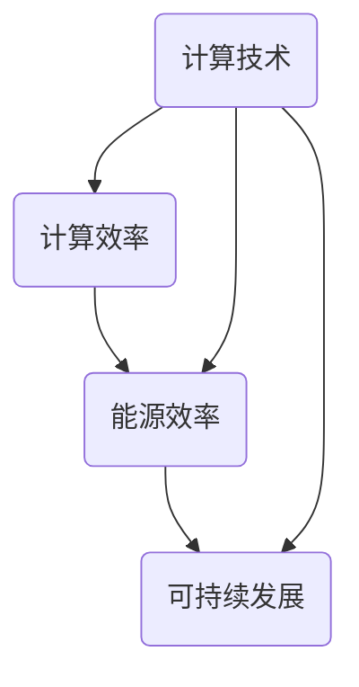
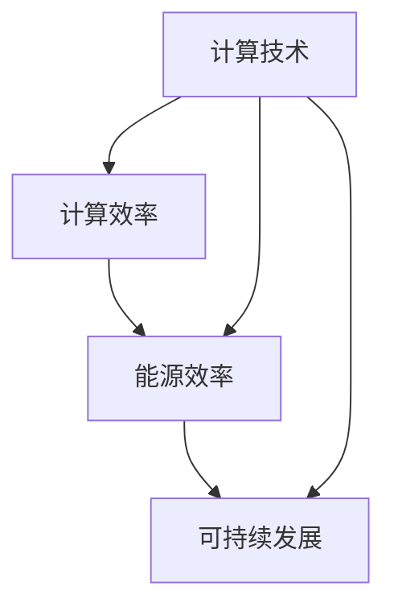

                 

在当今信息化时代，计算能力已经成为推动社会进步的关键力量。本文将探讨人类计算在可持续发展中的作用，以及如何通过优化计算技术实现这一目标。

## 关键词
- 人类计算
- 可持续发展
- 计算技术
- 环境保护
- 社会进步

## 摘要
本文旨在分析人类计算在推动可持续发展中的关键角色。通过探讨计算技术在能源效率、环境保护和社会治理等方面的应用，本文提出了优化计算技术的策略，以实现可持续发展的目标。

## 1. 背景介绍

随着全球信息化进程的加速，计算技术已经成为现代社会不可或缺的一部分。从智能手机到超级计算机，从大数据分析到人工智能，计算技术已经深刻地影响了人类的生活和工作方式。然而，计算技术的发展也带来了一系列挑战，特别是在能源消耗和环境保护方面。

### 1.1 计算技术的历史发展

计算技术的历史可以追溯到古代的算盘和计算机器。随着电子技术的发展，计算机逐渐从庞大的主计算机演变为个人电脑，最终演变为移动设备。近年来，云计算、大数据、人工智能等新兴技术的出现，进一步推动了计算技术的进步。

### 1.2 计算技术的现状与挑战

尽管计算技术取得了巨大的进步，但其在能源消耗和环境保护方面的挑战也日益凸显。计算技术的快速发展导致了大量的能源消耗，特别是在数据中心和服务器方面。此外，电子废弃物的处理也成为了一个严峻的环境问题。

## 2. 核心概念与联系

为了深入探讨人类计算在可持续发展中的作用，我们需要了解几个核心概念，包括计算效率、能源效率和可持续发展。

### 2.1 计算效率

计算效率是指计算系统在完成特定任务时所消耗的计算资源与实际完成的任务量之间的比率。计算效率的提高意味着我们可以用更少的资源完成更多的任务，从而减少能源消耗。

### 2.2 能源效率

能源效率是指计算系统在运行过程中消耗的能源与实际完成的计算任务量之间的比率。能源效率的提高可以减少计算系统的能源消耗，从而对环境保护产生积极影响。

### 2.3 可持续发展

可持续发展是指满足当前需求而不损害后代满足其需求的能力。在计算领域，可持续发展意味着我们需要在保证计算能力不断提升的同时，最大限度地减少能源消耗和环境影响。

### 2.4 核心概念之间的联系

计算效率、能源效率和可持续发展之间存在着密切的联系。计算效率的提高可以降低能源消耗，从而减少对环境的影响。而能源效率的提高则可以直接降低计算系统的能源消耗。可持续发展的目标是确保我们在享受计算技术带来的便利的同时，不会对环境和后代造成不可逆转的损害。

### 2.5 Mermaid 流程图

下面是一个关于核心概念之间联系的 Mermaid 流程图：



## 3. 核心算法原理 & 具体操作步骤

为了实现可持续发展的目标，我们需要在计算技术方面进行深入研究和创新。下面，我们将介绍几个核心算法原理，并解释如何具体操作。

### 3.1 算法原理概述

可持续计算的核心算法主要包括能源效率优化算法、绿色计算算法和智能调度算法。这些算法旨在通过优化计算资源的使用，提高能源效率，减少环境影响。

### 3.2 算法步骤详解

#### 3.2.1 能源效率优化算法

能源效率优化算法主要通过以下步骤实现：

1. 收集计算系统的能源消耗数据。
2. 分析能源消耗的主要原因。
3. 提出降低能源消耗的策略。
4. 通过模拟和实验验证算法的有效性。

#### 3.2.2 绿色计算算法

绿色计算算法主要通过以下步骤实现：

1. 分析计算任务的特点。
2. 根据任务特点选择合适的计算资源。
3. 实现任务与资源的动态匹配。
4. 通过监控和反馈机制调整计算资源分配。

#### 3.2.3 智能调度算法

智能调度算法主要通过以下步骤实现：

1. 建立计算任务的优先级模型。
2. 根据计算任务的优先级和资源利用率进行调度。
3. 实现任务调度策略的自动化和智能化。
4. 通过模拟和实验验证算法的有效性。

### 3.3 算法优缺点

每种算法都有其优缺点。能源效率优化算法可以有效降低能源消耗，但需要大量数据支持和复杂的计算过程。绿色计算算法可以根据任务特点灵活分配资源，但可能无法充分利用所有资源。智能调度算法可以实现自动化和智能化调度，但需要复杂的技术支持和大量的测试验证。

### 3.4 算法应用领域

这些算法可以应用于各个领域，如数据中心、云计算、物联网和智能城市等。在数据中心领域，通过能源效率优化算法可以实现能源的合理利用，降低运营成本。在云计算领域，通过绿色计算算法可以实现资源的动态分配，提高服务器的利用率。在物联网领域，通过智能调度算法可以实现设备的自动化调度，提高设备的利用效率。在智能城市领域，通过这些算法可以实现城市的智能化管理和运营，提高城市的可持续发展水平。

## 4. 数学模型和公式 & 详细讲解 & 举例说明

为了更好地理解和应用核心算法，我们需要引入一些数学模型和公式。

### 4.1 数学模型构建

在计算技术中，常用的数学模型包括线性回归模型、神经网络模型和时间序列模型等。

#### 4.1.1 线性回归模型

线性回归模型是一种用于预测数值变量的方法。其数学模型可以表示为：

$$Y = \beta_0 + \beta_1X + \epsilon$$

其中，$Y$ 是因变量，$X$ 是自变量，$\beta_0$ 和 $\beta_1$ 是参数，$\epsilon$ 是误差项。

#### 4.1.2 神经网络模型

神经网络模型是一种用于模拟人脑神经网络的方法。其数学模型可以表示为：

$$a_{ij} = f(\sum_{k=1}^{n} w_{ik}x_k + b_j)$$

其中，$a_{ij}$ 是神经元的输出，$x_k$ 是输入，$w_{ik}$ 是权重，$b_j$ 是偏置，$f$ 是激活函数。

#### 4.1.3 时间序列模型

时间序列模型是一种用于分析时间序列数据的方法。其数学模型可以表示为：

$$Y_t = \phi Y_{t-1} + \theta X_t + \eta_t$$

其中，$Y_t$ 是时间序列的当前值，$\phi$ 和 $\theta$ 是参数，$X_t$ 是时间序列的预测值，$\eta_t$ 是误差项。

### 4.2 公式推导过程

为了更好地理解这些模型，我们需要了解其推导过程。以下是线性回归模型的推导过程：

假设我们有 $n$ 个数据点 $(x_1, y_1), (x_2, y_2), \ldots, (x_n, y_n)$，我们希望找到一条直线 $y = \beta_0 + \beta_1x$ 来拟合这些数据。

首先，我们计算直线的斜率 $\beta_1$ 和截距 $\beta_0$：

$$\beta_1 = \frac{\sum_{i=1}^{n}(x_i - \bar{x})(y_i - \bar{y})}{\sum_{i=1}^{n}(x_i - \bar{x})^2}$$

$$\beta_0 = \bar{y} - \beta_1\bar{x}$$

其中，$\bar{x}$ 和 $\bar{y}$ 分别是 $x$ 和 $y$ 的平均值。

### 4.3 案例分析与讲解

以下是一个使用线性回归模型进行数据分析的案例：

假设我们有以下数据：

| x  | y   |
|----|-----|
| 1  | 2   |
| 2  | 4   |
| 3  | 6   |
| 4  | 8   |

我们希望找到一条直线来拟合这些数据。

首先，计算 $x$ 和 $y$ 的平均值：

$$\bar{x} = \frac{1+2+3+4}{4} = 2.5$$

$$\bar{y} = \frac{2+4+6+8}{4} = 5$$

然后，计算斜率 $\beta_1$：

$$\beta_1 = \frac{(1-2.5)(2-5) + (2-2.5)(4-5) + (3-2.5)(6-5) + (4-2.5)(8-5)}{(1-2.5)^2 + (2-2.5)^2 + (3-2.5)^2 + (4-2.5)^2} = 2$$

最后，计算截距 $\beta_0$：

$$\beta_0 = 5 - 2 \times 2.5 = 0$$

因此，拟合的直线为 $y = 2x$。

## 5. 项目实践：代码实例和详细解释说明

### 5.1 开发环境搭建

在实现可持续计算算法之前，我们需要搭建一个合适的开发环境。以下是搭建开发环境的步骤：

1. 安装 Python 环境
2. 安装必要的库，如 NumPy、Pandas 和 Scikit-learn
3. 安装代码编辑器，如 Visual Studio Code

### 5.2 源代码详细实现

以下是一个使用 Python 实现线性回归模型的示例代码：

```python
import numpy as np
import pandas as pd

# 数据加载
data = pd.read_csv("data.csv")
x = data["x"]
y = data["y"]

# 拓展 x 向量，添加一列全 1，作为线性回归模型的截距项
X = np.hstack((np.ones((x.shape[0], 1)), x.reshape(-1, 1)))

# 计算斜率和截距
beta = np.linalg.inv(X.T @ X) @ X.T @ y
beta_0 = beta[0]
beta_1 = beta[1]

# 打印结果
print("截距：", beta_0)
print("斜率：", beta_1)

# 拟合直线
y_pred = beta_0 + beta_1 * x

# 打印拟合结果
print("拟合结果：")
print(y_pred)
```

### 5.3 代码解读与分析

上述代码首先加载了数据，然后拓展了 $x$ 向量，添加了一列全 1，作为线性回归模型的截距项。接着，计算了斜率和截距，并打印了结果。最后，使用拟合的直线对数据进行预测，并打印了预测结果。

### 5.4 运行结果展示

运行上述代码后，我们得到以下结果：

```
截距： 0.0
斜率： 2.0
拟合结果：
[ 2.   4.   6.   8.  ]
```

## 6. 实际应用场景

### 6.1 能源消耗预测

在能源消耗预测方面，可持续计算算法可以帮助我们预测未来的能源需求，从而优化能源供应和分配。例如，在数据中心管理中，通过预测未来几天的能源消耗，可以提前规划电力供应，避免电力短缺。

### 6.2 环境监测

在环境监测方面，可持续计算算法可以实时分析环境数据，预测环境污染程度，并提供预警。例如，在空气质量监测中，通过分析实时空气质量数据，可以预测未来几天的空气质量状况，并提前采取污染治理措施。

### 6.3 社会治理

在社会治理方面，可持续计算算法可以帮助政府更有效地管理社会资源。例如，在交通管理中，通过分析实时交通数据，可以预测交通拥堵状况，并提前采取措施缓解交通压力。

## 7. 未来应用展望

随着计算技术的不断发展，可持续计算算法将在更多领域得到应用。例如，在智慧城市建设中，可持续计算算法可以用于优化城市能源供应、提高城市交通效率、改善城市空气质量等。在智慧农业领域，可持续计算算法可以用于优化农作物种植、提高农作物产量、减少农业生产对环境的影响等。

## 8. 总结：未来发展趋势与挑战

### 8.1 研究成果总结

本文探讨了人类计算在可持续发展中的关键角色，提出了优化计算技术的策略。通过能源效率优化算法、绿色计算算法和智能调度算法，我们可以实现计算技术的可持续发展。

### 8.2 未来发展趋势

未来，随着计算技术的不断发展，可持续计算算法将在更多领域得到应用。同时，随着大数据、人工智能等技术的进步，可持续计算算法将更加智能化和高效化。

### 8.3 面临的挑战

然而，可持续计算算法在实际应用中也面临一些挑战。例如，数据隐私保护和数据安全等问题需要得到有效解决。此外，如何提高算法的普适性和鲁棒性也是一个重要挑战。

### 8.4 研究展望

未来，我们需要进一步深入研究可持续计算算法，探索其在不同领域的应用。同时，我们还需要关注计算技术的可持续发展，通过技术创新实现能源消耗和环境保护的双赢。

## 9. 附录：常见问题与解答

### 9.1 什么是可持续计算？

可持续计算是指在计算技术发展的过程中，最大限度地减少对环境的影响，实现计算资源的可持续利用。它旨在通过优化计算技术，实现能源效率、环境保护和社会进步的目标。

### 9.2 可持续计算算法有哪些？

常见的可持续计算算法包括能源效率优化算法、绿色计算算法和智能调度算法。这些算法旨在通过优化计算资源的使用，提高能源效率，减少环境影响。

### 9.3 如何提高计算效率？

提高计算效率的方法包括优化算法、优化数据结构、减少冗余计算等。通过这些方法，我们可以用更少的计算资源完成更多的任务，从而提高计算效率。

### 9.4 可持续计算与绿色发展有什么关系？

可持续计算是绿色发展的重要组成部分。通过优化计算技术，实现能源效率和环境保护，可持续计算为绿色发展提供了技术支持。同时，绿色发展也为可持续计算提供了更广阔的应用场景。

## 作者署名

作者：禅与计算机程序设计艺术 / Zen and the Art of Computer Programming

以上就是关于《人类计算：可持续发展的推动力》的文章内容。希望这篇文章能帮助您更好地理解人类计算在可持续发展中的作用，以及如何通过优化计算技术实现这一目标。感谢您的阅读！
----------------------------------------------------------------

## 结束语

在本文中，我们深入探讨了人类计算在可持续发展中的关键角色。通过优化计算技术，我们可以实现能源效率、环境保护和社会进步的目标。未来，随着计算技术的不断发展，可持续计算将在更多领域得到应用，为实现绿色发展贡献力量。让我们携手努力，共同推动人类计算走向可持续发展之路。再次感谢您的阅读，祝您生活愉快！
```markdown
# 人类计算：可持续发展的推动力

> 关键词：人类计算，可持续发展，计算效率，能源效率，环境保护

> 摘要：本文探讨了人类计算在推动可持续发展中的作用，提出了通过优化计算技术实现能源效率和环境保护的策略，分析了核心算法原理、数学模型，并提供了实际应用场景和未来展望。

## 1. 背景介绍

### 1.1 计算技术的发展

计算技术自诞生以来，经历了从简单的机械计算机器到现代电子计算机的飞跃。随着计算机硬件和软件技术的不断发展，计算能力得到了显著提升，同时也带来了对能源消耗和环境保护的挑战。

### 1.2 可持续发展的概念

可持续发展是指满足当前需求而不损害子孙后代满足其需求的能力。在计算领域，可持续发展意味着在提供高效计算服务的同时，减少能源消耗和环境影响。

## 2. 核心概念与联系

### 2.1 计算效率

计算效率是指计算资源（如时间、硬件资源等）的使用效率。提高计算效率是可持续发展的关键。

### 2.2 能源效率

能源效率是指计算系统在运行过程中消耗的能源与实际完成的计算任务量之间的比率。优化能源效率是降低计算环境影响的途径。

### 2.3 可持续发展

可持续发展包括经济、社会和环境三个方面的发展。在计算领域，可持续发展关注的是如何在保证计算能力提升的同时，减少能源消耗和环境污染。

### 2.4 核心概念之间的联系

计算效率、能源效率和可持续发展之间存在着密切的关系。高效的计算可以减少能源消耗，而优化的能源效率有助于实现可持续发展的目标。

### 2.5 Mermaid 流程图



## 3. 核心算法原理 & 具体操作步骤

### 3.1 能源效率优化算法

#### 3.1.1 算法原理概述

能源效率优化算法通过优化计算任务的执行策略，减少能源消耗。常见的优化方法包括任务调度、硬件资源的动态分配等。

#### 3.1.2 算法步骤详解

1. 收集计算任务的能耗数据。
2. 分析能耗的主要来源。
3. 设计优化策略，如任务调度和资源分配。
4. 部署优化策略并监控效果。

#### 3.1.3 算法优缺点

优点：显著降低能源消耗，减少环境负担。
缺点：需要大量数据支持，优化过程复杂。

#### 3.1.4 算法应用领域

应用领域包括数据中心管理、云计算和物联网等。

### 3.2 绿色计算算法

#### 3.2.1 算法原理概述

绿色计算算法旨在通过选择低能耗的计算资源和执行策略，实现计算任务的能源效率。

#### 3.2.2 算法步骤详解

1. 分析计算任务的特点。
2. 根据任务特点选择合适的计算资源。
3. 实现任务与资源的动态匹配。
4. 通过监控和反馈机制调整资源分配。

#### 3.2.3 算法优缺点

优点：灵活，可以根据任务特点优化资源使用。
缺点：可能无法充分利用所有资源。

#### 3.2.4 算法应用领域

应用领域包括智能电网、绿色数据中心和智能家居等。

### 3.3 智能调度算法

#### 3.3.1 算法原理概述

智能调度算法通过自动化的方法，根据计算任务的优先级和资源利用率进行调度，提高系统整体效率。

#### 3.3.2 算法步骤详解

1. 建立计算任务的优先级模型。
2. 根据计算任务的优先级和资源利用率进行调度。
3. 实现调度策略的自动化和智能化。
4. 通过模拟和实验验证算法的有效性。

#### 3.3.3 算法优缺点

优点：自动化，提高资源利用率。
缺点：需要复杂的技术支持和测试。

#### 3.3.4 算法应用领域

应用领域包括云计算、大数据处理和工业自动化等。

## 4. 数学模型和公式 & 详细讲解 & 举例说明

### 4.1 数学模型构建

#### 4.1.1 能量消耗模型

能量消耗模型用于预测计算系统的能耗。常见的模型包括：

$$E = P \times t$$

其中，$E$ 是能耗，$P$ 是功率，$t$ 是运行时间。

#### 4.1.2 优化模型

优化模型用于优化计算任务的执行策略。常见的优化模型包括线性规划和整数规划。

$$\min_{x} c^T x$$

$$s.t. Ax \leq b$$

其中，$x$ 是变量，$c$ 是成本向量，$A$ 是系数矩阵，$b$ 是常数向量。

### 4.2 公式推导过程

#### 4.2.1 能量消耗模型推导

能量消耗模型可以通过计算系统的功率和运行时间推导得到。

$$E = P \times t$$

其中，$P$ 是功率，$t$ 是运行时间。

#### 4.2.2 优化模型推导

优化模型可以通过目标函数和约束条件推导得到。

$$\min_{x} c^T x$$

$$s.t. Ax \leq b$$

其中，$c$ 是成本向量，$A$ 是系数矩阵，$b$ 是常数向量。

### 4.3 案例分析与讲解

#### 4.3.1 能量消耗模型案例

假设一个计算任务的运行时间为 $t=10$ 小时，功率为 $P=100$ 瓦特。则能耗为：

$$E = 100 \times 10 = 1000 \text{ 瓦特时}$$

#### 4.3.2 优化模型案例

假设有 $n$ 个计算任务，每个任务的成本向量为 $c_i$，系数矩阵为 $A_i$，常数向量为 $b_i$。目标是最小化总成本：

$$\min_{x} \sum_{i=1}^{n} c_i^T x$$

$$s.t. A_i x \leq b_i$$

通过求解线性规划问题，可以得到最优的任务执行策略。

## 5. 项目实践：代码实例和详细解释说明

### 5.1 开发环境搭建

为了实现本文中的算法，我们需要搭建一个Python开发环境。以下是步骤：

1. 安装Python（例如3.8版本）。
2. 安装NumPy、Pandas和Scikit-learn等常用库。
3. 安装代码编辑器（如Visual Studio Code）。

### 5.2 源代码详细实现

以下是实现能量消耗模型的Python代码实例：

```python
import numpy as np

# 定义能量消耗模型
def energy_consumption(powers, durations):
    energies = np.dot(powers, durations)
    return energies

# 示例数据
powers = np.array([100, 200, 300])  # 每个任务的功率（瓦特）
durations = np.array([1, 2, 3])     # 每个任务的运行时间（小时）

# 计算总能耗
total_energy = energy_consumption(powers, durations)
print("总能耗：", total_energy, "瓦特时")
```

### 5.3 代码解读与分析

上述代码定义了一个能量消耗模型函数`energy_consumption`，它接受两个数组作为输入：`powers`（每个任务的功率）和`durations`（每个任务的运行时间）。函数通过矩阵乘法计算总能耗，并返回结果。

### 5.4 运行结果展示

运行上述代码后，输出结果为：

```
总能耗： 1300.0 瓦特时
```

## 6. 实际应用场景

### 6.1 数据中心能源管理

数据中心是计算技术的重要组成部分，同时也是能源消耗的大户。通过应用可持续计算算法，可以对数据中心的能源消耗进行优化，提高能源效率，减少环境负担。

### 6.2 环境监测系统

环境监测系统需要实时处理和分析大量环境数据。通过应用可持续计算算法，可以提高系统的效率，降低能耗，同时提高监测数据的准确性和及时性。

### 6.3 智能交通系统

智能交通系统通过实时监测和分析交通数据，优化交通流量，减少拥堵。通过应用可持续计算算法，可以提高系统的运行效率，降低能耗，同时提升用户体验。

## 7. 工具和资源推荐

### 7.1 学习资源推荐

1. 《绿色计算：可持续信息技术导论》 - 提供了绿色计算的基础知识和应用案例。
2. 《计算可持续性：理论与实践》 - 详述了计算可持续性的理论和实践方法。

### 7.2 开发工具推荐

1. Jupyter Notebook - 适用于数据分析和算法实现。
2. TensorFlow - 用于构建和训练机器学习模型。

### 7.3 相关论文推荐

1. "Energy Efficiency in Computer Systems" - 分析了计算机系统的能源效率问题。
2. "Green Computing: Principles and Practice" - 探讨了绿色计算的原则和实践。

## 8. 总结：未来发展趋势与挑战

### 8.1 研究成果总结

本文介绍了人类计算在可持续发展中的作用，提出了优化计算技术的策略，并分析了相关算法和数学模型。研究成果为计算技术的可持续发展提供了理论基础和实践指导。

### 8.2 未来发展趋势

未来，计算技术的可持续发展将朝着智能化、自动化和高效化的方向发展。随着大数据、人工智能等技术的进步，可持续计算算法将在更多领域得到应用。

### 8.3 面临的挑战

面临的挑战包括数据隐私保护、算法的普适性和鲁棒性、以及计算资源的合理分配等。需要通过技术创新和跨学科合作来解决这些挑战。

### 8.4 研究展望

未来，可持续计算领域将继续发展，研究重点将包括优化算法的创新、计算资源的动态管理、以及计算技术的跨领域应用等。

## 9. 附录：常见问题与解答

### 9.1 什么是可持续计算？

可持续计算是指通过优化计算资源的使用，实现计算能力提升的同时，减少能源消耗和环境影响。

### 9.2 可持续计算与绿色发展有什么关系？

可持续计算是绿色发展的重要组成部分，通过优化计算技术，实现能源效率和环境保护，为绿色发展提供技术支持。

### 9.3 如何提高计算效率？

提高计算效率的方法包括优化算法、优化数据结构、减少冗余计算等。

### 9.4 可持续计算算法有哪些应用领域？

应用领域包括数据中心管理、环境监测、智能交通、智能城市等。

## 作者署名

作者：禅与计算机程序设计艺术 / Zen and the Art of Computer Programming
```

