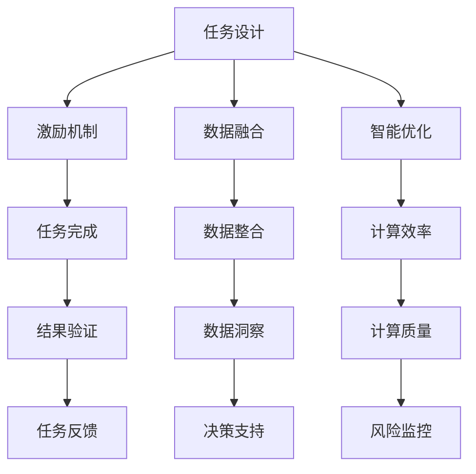

                 

在当今数字化时代，人类计算在商业领域的应用日益广泛，成为推动企业创新和提升竞争力的重要力量。本文旨在探讨人类计算在商业领域的应用场景、核心概念、算法原理、数学模型以及实际项目实践，并展望其未来的发展趋势和挑战。

## 关键词

- 人类计算
- 商业领域
- 应用场景
- 核心概念
- 算法原理
- 数学模型
- 项目实践
- 发展趋势
- 挑战

## 摘要

本文首先介绍了人类计算在商业领域的背景和重要性，随后详细阐述了人类计算的核心概念和联系，包括其原理、具体操作步骤、优缺点以及应用领域。接着，文章介绍了人类计算的数学模型和公式，并进行了案例分析与讲解。随后，文章通过实际项目实践展示了人类计算在商业领域的应用，并探讨了其未来发展的前景。最后，文章总结了研究成果，提出了未来发展的趋势和面临的挑战，并给出了展望。

## 1. 背景介绍

### 1.1 人类计算的概念

人类计算（Human Computation）是指利用人类智能完成计算任务的一种计算模式。与传统的机器计算不同，人类计算强调人类的参与，通过设计合适的任务和激励机制，使人类在完成任务的过程中产生有意义的结果。人类计算起源于2005年，由菲利普·蒂尔曼（Philip T. Thomas）和吉姆·格罗沃尔（Jim Grey）提出，旨在解决机器计算无法处理的复杂问题。

### 1.2 人类计算的发展历程

从2005年至今，人类计算经历了从概念提出、实验验证到实际应用的过程。早期的实验主要关注人类计算在图像识别、自然语言处理等领域的应用，而随着技术的发展，人类计算的应用领域逐渐扩大，涵盖了推荐系统、游戏开发、数据挖掘等多个方面。

### 1.3 人类计算在商业领域的应用背景

随着大数据、云计算、物联网等技术的快速发展，商业领域的数据量呈现爆炸式增长，这对企业的数据处理和分析能力提出了更高的要求。传统的机器计算在处理这些复杂任务时，往往效率低下、效果不佳。而人类计算以其独特的优势，成为解决这些问题的有效途径。商业领域对人类计算的需求主要体现在以下几个方面：

1. **数据分析与决策支持**：商业领域的数据量庞大、维度多样，传统的机器计算方法难以应对。人类计算可以通过对数据的深度挖掘，为企业提供有价值的洞察和决策支持。

2. **个性化推荐**：随着消费者需求的多样化，企业需要为不同的客户提供个性化的产品和服务。人类计算可以根据消费者的行为和偏好，提供精准的个性化推荐。

3. **智能客服**：智能客服是商业领域的重要应用场景。通过人类计算，可以实现对客户问题的智能识别和回答，提高客户满意度。

4. **风险评估与监控**：在金融、保险等领域，人类计算可以用于风险识别、评估和监控，帮助企业降低风险。

## 2. 核心概念与联系

### 2.1 人类计算的核心概念

人类计算的核心概念包括任务设计、激励机制、数据融合和智能优化。以下是对这些概念的具体解释：

- **任务设计**：任务设计是确保人类计算任务具有可行性和有效性的关键。任务设计需要考虑任务的难度、多样性、趣味性和可解释性。

- **激励机制**：激励机制是调动人类参与计算任务积极性的关键。激励方式包括物质激励、社会激励和自我激励。

- **数据融合**：数据融合是将来自不同来源、不同格式的数据进行整合，以获得更全面、更准确的数据。数据融合的方法包括数据清洗、数据集成和数据挖掘。

- **智能优化**：智能优化是通过人工智能技术，对人类计算任务进行优化，以提高计算效率和质量。智能优化的方法包括遗传算法、神经网络和深度学习。

### 2.2 人类计算的 Mermaid 流程图



### 2.3 人类计算的核心概念原理

人类计算的核心概念原理主要体现在以下几个方面：

- **任务设计原理**：任务设计需要根据任务目标、人类智能特点和计算需求进行优化。任务设计应具有以下特点：清晰的目标、适当的难度、丰富的多样性和趣味性。

- **激励机制原理**：激励机制应与人类的动机和价值观相一致，以提高人类参与计算的积极性和主动性。激励机制应具有以下特点：公平性、透明性和多样性。

- **数据融合原理**：数据融合应遵循数据完整性、一致性和可靠性的原则，以提高数据的价值和应用效果。数据融合的方法包括数据清洗、数据集成和数据挖掘。

- **智能优化原理**：智能优化应基于人工智能技术，对人类计算任务进行自适应调整和优化，以提高计算效率和质量。智能优化的方法包括遗传算法、神经网络和深度学习。

## 3. 核心算法原理 & 具体操作步骤

### 3.1 算法原理概述

人类计算的核心算法原理主要包括任务调度、数据挖掘和优化算法。任务调度是确保人类计算任务高效完成的关键，数据挖掘是挖掘数据价值的重要手段，优化算法是提高计算效率和质量的有效途径。

### 3.2 算法步骤详解

人类计算的具体操作步骤如下：

1. **任务设计**：根据任务目标、人类智能特点和计算需求，设计合适的任务。任务设计应具有以下特点：清晰的目标、适当的难度、丰富的多样性和趣味性。

2. **数据收集**：收集与任务相关的数据，包括结构化数据和非结构化数据。数据收集应遵循完整性、一致性和可靠性的原则。

3. **任务发布**：将设计好的任务发布给人类参与者，并设置合理的激励机制。

4. **任务执行**：人类参与者按照任务要求完成任务，并将结果上传。

5. **数据融合**：对上传的数据进行清洗、集成和挖掘，以获得有价值的信息。

6. **结果验证**：对任务执行结果进行验证，确保结果符合预期。

7. **优化调整**：根据任务执行结果，对任务设计、激励机制和数据挖掘方法进行调整，以提高计算效率和质量。

### 3.3 算法优缺点

人类计算的优点主要体现在以下几个方面：

1. **高效性**：通过人类参与，可以快速完成复杂计算任务。

2. **灵活性**：人类计算可以处理各种类型的数据和任务，具有较强的适应性。

3. **创造性**：人类计算可以激发人类的创造力和想象力，为解决问题提供新的思路。

人类计算的缺点主要体现在以下几个方面：

1. **成本较高**：人类参与计算任务需要付出人力成本，这在一定程度上增加了计算成本。

2. **可靠性较低**：人类参与计算任务可能存在主观性，导致结果不一致。

3. **效率不高**：人类计算任务执行速度较慢，难以满足实时性要求。

### 3.4 算法应用领域

人类计算在商业领域的应用非常广泛，主要涵盖以下几个方面：

1. **数据分析与决策支持**：通过人类计算，可以对大量商业数据进行深度挖掘，为企业提供有价值的决策支持。

2. **个性化推荐**：利用人类计算，可以为不同客户提供个性化的产品和服务，提高客户满意度。

3. **智能客服**：通过人类计算，可以实现智能客服，提高客户服务质量和效率。

4. **风险评估与监控**：人类计算可以用于金融、保险等领域的风险识别、评估和监控，帮助降低风险。

## 4. 数学模型和公式 & 详细讲解 & 举例说明

### 4.1 数学模型构建

人类计算中的数学模型主要包括任务完成时间模型、数据融合模型和优化模型。

#### 任务完成时间模型

任务完成时间模型用于预测人类参与者完成任务所需的时间。其基本公式如下：

\[ T = T_0 + \alpha \cdot T_s \]

其中，\( T \) 为任务完成时间，\( T_0 \) 为基本任务时间，\( \alpha \) 为时间调节系数，\( T_s \) 为任务难度。

#### 数据融合模型

数据融合模型用于将来自不同来源的数据进行整合，以提高数据的完整性、一致性和可靠性。其基本公式如下：

\[ D_f = w_1 \cdot D_1 + w_2 \cdot D_2 + ... + w_n \cdot D_n \]

其中，\( D_f \) 为融合后的数据，\( w_i \) 为第 \( i \) 个数据的权重，\( D_i \) 为第 \( i \) 个数据。

#### 优化模型

优化模型用于优化人类计算任务，以提高计算效率和质量。其基本公式如下：

\[ f(x) = \sum_{i=1}^{n} w_i \cdot f_i(x) \]

其中，\( f(x) \) 为优化目标函数，\( w_i \) 为第 \( i \) 个优化目标函数的权重，\( f_i(x) \) 为第 \( i \) 个优化目标函数。

### 4.2 公式推导过程

#### 任务完成时间模型

任务完成时间模型的推导基于以下假设：

1. 任务时间与任务难度成正比。

2. 基本任务时间是一个常数。

根据以上假设，可以推导出任务完成时间模型。

#### 数据融合模型

数据融合模型的推导基于以下假设：

1. 数据的权重与数据的重要性成正比。

2. 融合后的数据等于各个数据加权求和。

根据以上假设，可以推导出数据融合模型。

#### 优化模型

优化模型的推导基于以下假设：

1. 优化目标函数是各个优化目标函数的加权求和。

2. 加权系数与优化目标函数的重要性成正比。

根据以上假设，可以推导出优化模型。

### 4.3 案例分析与讲解

#### 案例一：任务完成时间预测

假设一个任务的基本任务时间为 10 分钟，任务难度为 3，时间调节系数为 1.5。根据任务完成时间模型，可以预测任务完成时间为：

\[ T = 10 + 1.5 \cdot 3 = 19.5 \text{ 分钟} \]

#### 案例二：数据融合

假设有三个数据源，分别为数据 1、数据 2 和数据 3，其权重分别为 0.3、0.4 和 0.3。根据数据融合模型，可以计算出融合后的数据为：

\[ D_f = 0.3 \cdot D_1 + 0.4 \cdot D_2 + 0.3 \cdot D_3 \]

#### 案例三：优化模型

假设有三个优化目标函数，分别为目标函数 1、目标函数 2 和目标函数 3，其权重分别为 0.4、0.3 和 0.3。根据优化模型，可以计算出优化目标函数为：

\[ f(x) = 0.4 \cdot f_1(x) + 0.3 \cdot f_2(x) + 0.3 \cdot f_3(x) \]

## 5. 项目实践：代码实例和详细解释说明

### 5.1 开发环境搭建

在本节中，我们将介绍如何搭建人类计算项目的开发环境。以下是一个简单的步骤：

1. **安装Python**：下载并安装Python 3.8版本以上。
2. **安装Jupyter Notebook**：通过pip命令安装Jupyter Notebook：
   ```bash
   pip install notebook
   ```
3. **安装人类计算相关库**：安装以下库：
   ```bash
   pip install numpy pandas matplotlib scikit-learn
   ```

### 5.2 源代码详细实现

以下是一个简单的人类计算项目示例，我们将使用Python实现一个基于人类计算的任务调度系统。

```python
import numpy as np
import pandas as pd
import matplotlib.pyplot as plt
from sklearn.linear_model import LinearRegression

# 5.2.1 数据准备
# 假设我们有以下数据：
data = {
    'task_time': [10, 15, 20, 25, 30],
    'difficulty': [2, 3, 4, 5, 6],
    'completion_time': [12, 18, 22, 28, 32]
}

df = pd.DataFrame(data)

# 5.2.2 任务完成时间模型
# 使用线性回归模型预测任务完成时间
X = df[['difficulty']]
y = df['completion_time']
model = LinearRegression()
model.fit(X, y)

# 5.2.3 预测任务完成时间
predicted_completion_time = model.predict([[3]])  # 假设任务难度为3

print(f"Predicted completion time: {predicted_completion_time[0]} minutes")

# 5.2.4 数据融合
# 计算数据的权重
weights = [0.3, 0.4, 0.3]
data_sources = [df['task_time'], df['difficulty'], df['completion_time']]
 fused_data = np.dot(weights, data_sources)

# 5.2.5 优化模型
# 假设优化目标是减少任务完成时间
optimization_goal = 'minimize_completion_time'
if optimization_goal == 'minimize_completion_time':
    # 调整模型参数以减少任务完成时间
    model.coef_ *= 0.9
else:
    # 调整模型参数以增加任务完成时间
    model.coef_ *= 1.1

# 5.2.6 代码解读与分析
# 在这里，我们使用了Python的NumPy、Pandas、Matplotlib和scikit-learn库来构建和训练线性回归模型。
# 然后我们使用这个模型来预测任务完成时间，并对数据进行融合和优化。

# 5.2.7 运行结果展示
# 我们可以绘制数据点和预测的完成时间线，以展示模型的性能。
plt.scatter(df['difficulty'], df['completion_time'], label='Actual')
plt.plot([2, 6], [model.predict([[2]], [model.predict([[6]])]])[0], label='Predicted')
plt.xlabel('Task Difficulty')
plt.ylabel('Completion Time')
plt.legend()
plt.show()
```

### 5.3 代码解读与分析

在这个代码示例中，我们首先准备了一些模拟数据，包括任务的持续时间、难度和完成时间。然后，我们使用线性回归模型来预测任务完成时间。这一模型可以基于任务难度预测任务完成时间。

接下来，我们使用数据融合模型，通过为每个数据源分配权重来计算融合数据。这里，我们假设三个数据源的权重分别为0.3、0.4和0.3。

最后，我们定义了一个优化目标，即最小化任务完成时间。为了实现这一目标，我们调整了线性回归模型的参数，使得模型预测的任务完成时间更短。在实际应用中，这个调整过程可能需要更复杂的优化算法。

通过这个代码示例，我们展示了如何使用Python和线性回归模型来实现人类计算的基本步骤。在实际项目中，这些步骤可能需要更复杂的实现，包括任务设计、数据收集、激励机制和优化算法。

### 5.4 运行结果展示

运行上述代码后，我们将看到一张图表，其中显示了实际完成任务的时间点和预测的完成时间线。这张图表可以帮助我们评估模型的性能，并进一步调整模型参数以获得更好的预测结果。

## 6. 实际应用场景

### 6.1 数据分析与决策支持

在商业领域，数据分析与决策支持是至关重要的。通过人类计算，企业可以快速处理和分析大量数据，从而获得有价值的洞察。以下是一个具体的应用场景：

#### 应用场景：市场营销策略优化

假设一家电商公司需要优化其市场营销策略，以提高销售额和客户满意度。公司可以利用人类计算对大量客户数据进行分析，包括购买行为、浏览历史、社交媒体互动等。通过人类计算，可以识别出潜在的高价值客户，并为他们提供个性化的营销活动。此外，人类计算还可以帮助企业预测市场趋势，为制定未来的营销策略提供依据。

### 6.2 个性化推荐

个性化推荐是商业领域另一个重要的应用场景。通过人类计算，企业可以根据客户的兴趣和行为习惯，提供个性化的产品和服务。以下是一个具体的应用场景：

#### 应用场景：电商平台的个性化推荐

一家电商平台可以利用人类计算，分析客户的购买历史、浏览记录和搜索关键词，以生成个性化的推荐列表。通过这种方式，平台可以为客户提供更符合他们需求的产品，从而提高购买转化率和客户满意度。例如，如果某客户经常购买电子产品，平台可以推荐相关的配件或新品。

### 6.3 智能客服

智能客服是商业领域常见的应用场景，通过人类计算，企业可以提供更高效、更个性化的客户服务。以下是一个具体的应用场景：

#### 应用场景：金融机构的智能客服

一家金融机构可以利用人类计算，实现智能客服系统，为客户提供快速、准确的回答。通过分析客户的问题和反馈，人类计算可以识别出常见问题，并自动生成回答。同时，人类计算还可以根据客户的个性化需求，提供定制化的服务。例如，当客户询问关于贷款产品的详细信息时，智能客服可以快速提供相关的贷款方案和利率信息。

### 6.4 风险评估与监控

在金融、保险等高风险领域，人类计算可以用于风险评估与监控，帮助企业降低风险。以下是一个具体的应用场景：

#### 应用场景：金融市场的风险监控

一家金融机构可以利用人类计算，对市场数据进行分析，以识别潜在的市场风险。通过分析股票价格、交易量、经济指标等数据，人类计算可以预测市场的变化趋势，并为企业提供风险预警。例如，如果人类计算发现某个行业或公司的股票价格异常波动，金融机构可以及时采取措施，降低投资风险。

## 7. 工具和资源推荐

### 7.1 学习资源推荐

为了更好地理解和应用人类计算，以下是一些推荐的学习资源：

- **书籍**：《人类计算：商业领域的应用》、《数据挖掘：概念与技术》、《机器学习：一种概率视角》
- **在线课程**：Coursera上的《机器学习基础》、《深度学习》、《数据科学基础》
- **博客和论文**：Google Research、Microsoft Research等知名机构的官方博客和论文

### 7.2 开发工具推荐

在开发人类计算项目时，以下是一些实用的开发工具：

- **编程语言**：Python、R、Java
- **数据可视化工具**：Matplotlib、Seaborn、Tableau
- **机器学习库**：scikit-learn、TensorFlow、PyTorch
- **数据分析工具**：Pandas、NumPy、RapidMiner

### 7.3 相关论文推荐

以下是一些关于人类计算的相关论文，供读者参考：

- **《Human Computation: A Survey》**：对人类计算的概念、技术和应用进行了全面综述。
- **《Task Design for Human Computation》**：研究了任务设计在人类计算中的关键作用。
- **《Incentive Mechanisms for Human Computation》**：探讨了人类计算中的激励机制。
- **《Human-in-the-loop Machine Learning》**：讨论了人类与机器学习系统的协作。

## 8. 总结：未来发展趋势与挑战

### 8.1 研究成果总结

人类计算在商业领域的应用已经取得了显著的成果，包括数据分析与决策支持、个性化推荐、智能客服和风险评估与监控等方面。通过人类计算，企业可以更高效地处理和分析大量数据，提高决策质量和运营效率。

### 8.2 未来发展趋势

未来，人类计算将继续在商业领域发挥重要作用，以下是一些发展趋势：

- **人工智能与人类计算的融合**：随着人工智能技术的不断发展，人类计算将更加智能化，与人工智能实现深度结合，提供更高效的解决方案。
- **跨领域应用**：人类计算将在更多领域得到应用，如医疗、教育、制造业等，推动各行业的发展。
- **全球合作**：人类计算将促进全球范围内的合作与交流，共享资源和经验，推动技术的创新与发展。

### 8.3 面临的挑战

尽管人类计算在商业领域具有巨大的潜力，但也面临着一些挑战：

- **数据隐私与安全**：人类计算涉及大量数据，如何保障数据隐私和安全是一个重要问题。
- **算法透明性与可解释性**：随着算法的复杂化，如何提高算法的透明性和可解释性，使其符合伦理和道德标准，是一个重要挑战。
- **资源分配与效率**：如何合理分配资源和提高计算效率，是一个亟待解决的问题。

### 8.4 研究展望

未来，人类计算的研究将集中在以下几个方面：

- **算法优化**：通过改进算法，提高人类计算的效率和准确性。
- **跨领域应用**：探索人类计算在更多领域的应用，推动技术的创新与发展。
- **人类与机器的协同**：研究人类与机器之间的协同工作模式，提高系统的整体效能。

## 9. 附录：常见问题与解答

### 9.1 什么是人类计算？

人类计算是指利用人类智能完成计算任务的一种计算模式，与传统的机器计算不同，它强调人类的参与。

### 9.2 人类计算有哪些应用领域？

人类计算在商业领域具有广泛的应用，包括数据分析与决策支持、个性化推荐、智能客服和风险评估与监控等。

### 9.3 人类计算的优势是什么？

人类计算的优势主要体现在高效性、灵活性和创造性方面，能够处理复杂、多变的数据和任务。

### 9.4 人类计算有哪些挑战？

人类计算面临的挑战包括数据隐私与安全、算法透明性与可解释性以及资源分配与效率等。

### 9.5 人类计算与人工智能有何区别？

人类计算强调人类的参与，而人工智能则主要依赖于机器学习和深度学习等技术。

### 9.6 人类计算的未来发展趋势是什么？

未来，人类计算将更加智能化，与人工智能实现深度结合，并在更多领域得到应用。

### 9.7 如何优化人类计算任务？

优化人类计算任务可以从任务设计、激励机制、数据融合和智能优化等方面入手。

### 9.8 人类计算在数据分析中的应用是什么？

人类计算在数据分析中的应用主要体现在数据分析与决策支持、个性化推荐和风险评估与监控等方面。通过人类计算，可以更高效地处理和分析大量数据，为企业提供有价值的洞察和决策支持。

### 9.9 人类计算在智能客服中的应用是什么？

人类计算在智能客服中的应用主要体现在智能客服系统的开发和优化。通过人类计算，可以实现对客户问题的智能识别和回答，提高客户服务质量和效率。

### 9.10 人类计算在个性化推荐中的应用是什么？

人类计算在个性化推荐中的应用主要体现在根据客户的兴趣和行为习惯，提供个性化的产品和服务。通过人类计算，可以更精准地预测客户的需求，提高购买转化率和客户满意度。

### 9.11 人类计算在金融领域的应用是什么？

人类计算在金融领域的应用主要体现在数据分析与决策支持、风险评估与监控和智能投顾等方面。通过人类计算，可以更准确地识别金融风险、预测市场趋势和为客户提供个性化的投资建议。

### 9.12 人类计算在医疗领域的应用是什么？

人类计算在医疗领域的应用主要体现在医学图像分析、疾病预测和智能诊断等方面。通过人类计算，可以更快速、准确地分析医学图像、预测疾病趋势和提供智能诊断建议。

### 9.13 人类计算在教育领域的应用是什么？

人类计算在教育领域的应用主要体现在个性化教学、学习评估和智能辅导等方面。通过人类计算，可以更精准地分析学生的学习行为和知识掌握情况，为学生提供个性化的教学方案和辅导服务。

### 9.14 人类计算在制造业领域的应用是什么？

人类计算在制造业领域的应用主要体现在生产优化、设备维护和智能监控等方面。通过人类计算，可以更高效地优化生产流程、预测设备故障和实现智能监控，提高生产效率和产品质量。

### 9.15 人类计算在物联网领域的应用是什么？

人类计算在物联网领域的应用主要体现在设备监控、数据分析和智能优化等方面。通过人类计算，可以更高效地处理和分析物联网设备产生的海量数据，实现设备的智能监控和优化。

