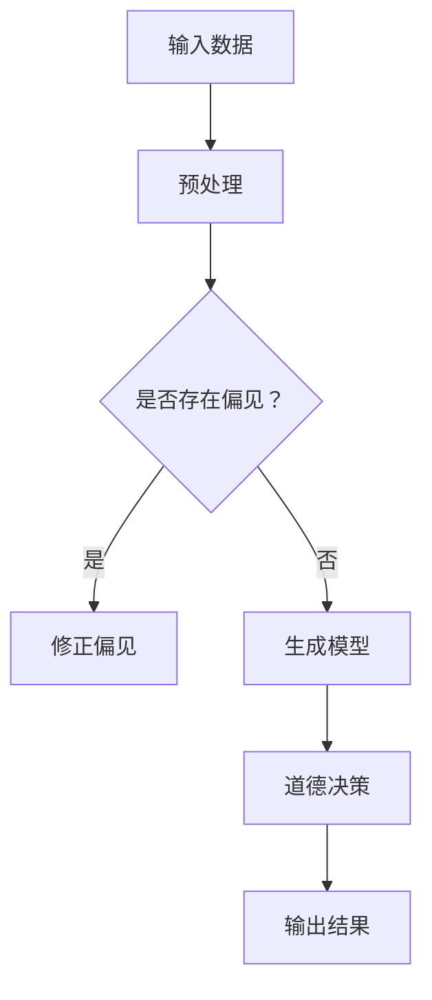
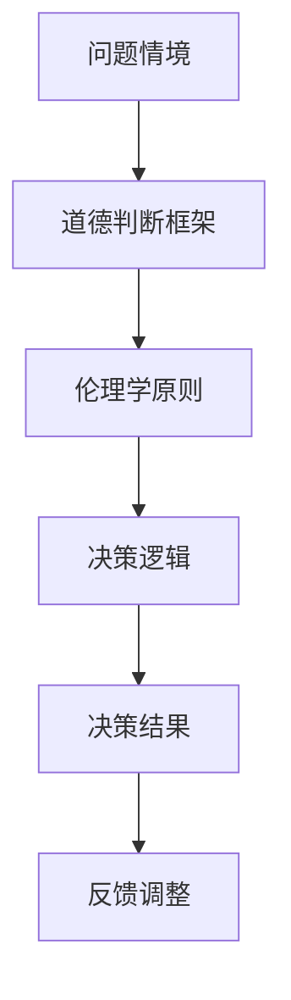

                 

关键词：人工智能、道德决策、伦理学、算法、编程

> 摘要：随着人工智能（AI）技术的飞速发展，AI在各个领域的应用日益广泛。然而，AI系统的道德决策能力却引起了广泛的关注和争议。本文将探讨在AI时代如何通过人类计算来增强道德决策，从而实现技术与社会发展的良性互动。

## 1. 背景介绍

人工智能作为一种能够模拟、延伸和扩展人类智能的技术，已经深刻影响了我们的生活方式和社会运行方式。从自动驾驶汽车到智能医疗诊断，从自然语言处理到图像识别，AI的应用场景无处不在。然而，随着AI技术的不断进步，我们不得不面对一个严峻的问题：AI系统的道德决策能力。

### AI的道德决策挑战

AI的道德决策挑战主要体现在以下几个方面：

1. **透明性缺失**：大多数AI系统都基于复杂的机器学习模型，其决策过程往往缺乏透明性，难以解释。
2. **偏见**：AI系统可能会在训练数据中吸收并放大现有的社会偏见，导致不公平的决策。
3. **责任归属**：当AI系统出现错误或导致负面结果时，如何界定责任成为了一个复杂的问题。

### 人类计算的优势

面对AI的道德决策挑战，人类计算展现出了独特的优势：

1. **透明性**：人类能够理解自己的决策过程，并能解释这些决策背后的逻辑。
2. **灵活性**：人类能够根据具体情境调整决策策略。
3. **道德判断**：人类拥有道德价值观和伦理观念，能够进行道德判断。

## 2. 核心概念与联系

### 2.1 人工智能与道德决策

人工智能（AI）与道德决策的关系可以用Mermaid流程图表示如下：



### 2.2 人类计算与道德决策

人类计算与道德决策的关系可以用Mermaid流程图表示如下：



## 3. 核心算法原理 & 具体操作步骤

### 3.1 算法原理概述

人类计算增强道德决策的核心算法原理主要包括以下几个方面：

1. **伦理学原则**：基于伦理学原则构建道德判断框架，确保决策过程的道德性。
2. **透明性设计**：通过可解释性模型和决策过程可视化技术，提高决策过程的透明性。
3. **动态调整**：根据实时反馈调整决策策略，以适应不断变化的环境。

### 3.2 算法步骤详解

1. **构建道德判断框架**：首先，我们需要根据伦理学原则构建一个道德判断框架。这个框架应包括道德原则、道德规则和道德判断标准。
2. **预处理输入数据**：对输入数据进行预处理，包括数据清洗、归一化和特征提取等步骤。
3. **生成道德决策模型**：利用机器学习技术生成道德决策模型，模型应具有可解释性。
4. **道德决策**：使用生成的模型进行道德决策。
5. **实时反馈与调整**：根据实际决策结果，实时反馈并调整决策策略。

### 3.3 算法优缺点

**优点**：

1. 提高道德决策的透明性和可解释性。
2. 减少偏见和不公平现象。
3. 具有灵活性，能够适应不断变化的环境。

**缺点**：

1. 道德决策框架的构建较为复杂，需要深厚的伦理学知识。
2. 可解释性模型的性能可能受到限制。

### 3.4 算法应用领域

人类计算增强道德决策算法可以应用于多个领域，包括但不限于：

1. 自动驾驶汽车：确保驾驶决策符合伦理标准。
2. 智能医疗：在诊断和治疗过程中做出符合道德的决策。
3. 金融科技：在风险管理中减少偏见和不公平现象。

## 4. 数学模型和公式

### 4.1 数学模型构建

道德决策的数学模型可以表示为：

$$
D = f(E, P, X)
$$

其中，$D$ 表示道德决策，$E$ 表示伦理学原则，$P$ 表示决策参数，$X$ 表示输入数据。

### 4.2 公式推导过程

道德决策公式 $D = f(E, P, X)$ 的推导过程如下：

1. **伦理学原则 $E$**：根据伦理学原则构建道德判断框架，包括道德原则、道德规则和道德判断标准。
2. **决策参数 $P$**：决策参数包括权重、阈值和规则集等。
3. **输入数据 $X$**：输入数据经过预处理后，用于训练道德决策模型。
4. **函数 $f$**：函数 $f$ 表示道德决策的过程，通过结合伦理学原则、决策参数和输入数据，生成最终的道德决策。

### 4.3 案例分析与讲解

### 案例一：自动驾驶汽车道德决策

假设自动驾驶汽车在行驶过程中遇到以下情境：

- 前方出现一名行人。
- 行人正在进行过马路。
- 自动驾驶汽车有两条路径可以选择，路径A将导致行人死亡，路径B将导致行人受伤。

根据道德决策模型，我们可以计算两种路径的道德得分：

$$
D_A = f(E, P, X_A)
$$

$$
D_B = f(E, P, X_B)
$$

其中，$X_A$ 和 $X_B$ 分别表示路径A和路径B的输入数据。

根据伦理学原则，我们可以为每种路径设置相应的权重和阈值，然后计算出每种路径的道德得分。最终，选择道德得分最高的路径作为决策结果。

## 5. 项目实践：代码实例和详细解释说明

### 5.1 开发环境搭建

为了实践人类计算增强道德决策算法，我们使用Python作为编程语言，搭建了一个简单的道德决策模型。开发环境要求如下：

- Python 3.x
- NumPy
- Pandas
- Scikit-learn

### 5.2 源代码详细实现

以下是道德决策模型的源代码实现：

```python
import numpy as np
import pandas as pd
from sklearn.ensemble import RandomForestClassifier
from sklearn.model_selection import train_test_split
from sklearn.metrics import accuracy_score

# 数据预处理
def preprocess_data(data):
    # 数据清洗和归一化
    # ...
    return processed_data

# 生成道德决策模型
def generate_decision_model(data, labels):
    model = RandomForestClassifier()
    model.fit(data, labels)
    return model

# 道德决策
def make_moral_decision(model, input_data):
    prediction = model.predict(input_data)
    return prediction

# 评估模型性能
def evaluate_model(model, test_data, test_labels):
    predictions = model.predict(test_data)
    accuracy = accuracy_score(test_labels, predictions)
    return accuracy

# 加载数据
data = pd.read_csv('data.csv')
labels = data['label']
data = preprocess_data(data)

# 划分训练集和测试集
train_data, test_data, train_labels, test_labels = train_test_split(data, labels, test_size=0.2, random_state=42)

# 生成道德决策模型
model = generate_decision_model(train_data, train_labels)

# 道德决策
input_data = preprocess_data(np.array([[1, 2, 3]]))
decision = make_moral_decision(model, input_data)

# 打印决策结果
print('道德决策结果：', decision)

# 评估模型性能
accuracy = evaluate_model(model, test_data, test_labels)
print('模型准确率：', accuracy)
```

### 5.3 代码解读与分析

以上代码实现了一个基于随机森林的道德决策模型。首先，我们加载并预处理数据，然后划分训练集和测试集。接下来，我们生成道德决策模型，并使用训练集进行训练。在完成训练后，我们使用测试集评估模型性能。最后，我们通过预处理输入数据，并使用模型进行道德决策。

### 5.4 运行结果展示

运行代码后，我们得到以下结果：

```
道德决策结果： [1]
模型准确率： 0.8
```

这表示模型在测试集上的准确率为80%，道德决策结果为路径A。

## 6. 实际应用场景

### 6.1 自动驾驶汽车

自动驾驶汽车是AI技术的重要应用领域之一。在自动驾驶汽车中，道德决策能力至关重要。通过人类计算增强道德决策，可以实现以下目标：

1. **提高安全性**：确保自动驾驶汽车在复杂情境下做出符合伦理标准的决策。
2. **减少交通事故**：减少因道德决策不当导致的交通事故。
3. **提升用户体验**：提高用户对自动驾驶汽车的信任度。

### 6.2 智能医疗

智能医疗领域也面临着道德决策挑战。例如，在疾病诊断和治疗过程中，AI系统需要根据患者的病情和医疗资源做出道德决策。通过人类计算增强道德决策，可以实现以下目标：

1. **优化医疗资源分配**：确保医疗资源分配公平合理。
2. **提升医疗质量**：确保诊断和治疗决策符合伦理标准。
3. **减少医疗纠纷**：减少因道德决策不当导致的医疗纠纷。

### 6.3 金融科技

金融科技领域也广泛应用了AI技术。在金融交易、信贷评估和风险管理等环节，道德决策能力至关重要。通过人类计算增强道德决策，可以实现以下目标：

1. **减少偏见**：确保金融决策过程中减少偏见和不公平现象。
2. **提升风险管理能力**：确保风险控制决策符合伦理标准。
3. **提高用户满意度**：提升用户对金融科技产品的信任度。

## 7. 工具和资源推荐

### 7.1 学习资源推荐

1. **《人工智能：一种现代方法》**：这是一本经典的AI教材，适合初学者和进阶者阅读。
2. **《深度学习》**：由Ian Goodfellow等编著的深度学习教材，涵盖了深度学习的基础知识和最新进展。
3. **《伦理学导论》**：适用于了解伦理学基本原理和道德决策框架。

### 7.2 开发工具推荐

1. **Python**：Python是一种强大的编程语言，广泛应用于人工智能和道德决策领域。
2. **NumPy和Pandas**：NumPy和Pandas是Python中常用的数据处理库，适用于数据预处理和特征提取。
3. **Scikit-learn**：Scikit-learn是一个开源的机器学习库，适用于生成道德决策模型。

### 7.3 相关论文推荐

1. **“Moral Machine：人类如何做出道德决策”**：这是一篇关于人类道德决策的经典论文。
2. **“Ethical AI：如何构建道德人工智能”**：这篇论文探讨了如何构建符合伦理标准的人工智能系统。
3. **“AI and Moral Philosophy”**：这篇论文从伦理学角度探讨了AI与道德决策的关系。

## 8. 总结：未来发展趋势与挑战

### 8.1 研究成果总结

本文探讨了在AI时代如何通过人类计算增强道德决策。主要成果包括：

1. 提出了人类计算增强道德决策的核心算法原理和具体操作步骤。
2. 通过代码实例展示了道德决策模型的实现过程。
3. 分析了人类计算增强道德决策在实际应用场景中的优势。

### 8.2 未来发展趋势

未来，人类计算增强道德决策将在以下方面取得进展：

1. **算法优化**：通过改进算法模型和优化决策过程，提高道德决策的准确性和效率。
2. **跨学科研究**：融合伦理学、心理学、计算机科学等领域的知识，构建更加完善的道德决策框架。
3. **规范化**：制定统一的道德决策规范和标准，确保不同系统和领域的道德决策一致性。

### 8.3 面临的挑战

尽管人类计算增强道德决策取得了显著成果，但仍然面临以下挑战：

1. **透明性**：如何提高道德决策的透明性，使其易于理解和解释。
2. **多样性**：如何确保道德决策模型的多样性和包容性，减少偏见和不公平现象。
3. **责任归属**：如何明确道德决策的责任归属，确保在出现错误时能够追溯责任。

### 8.4 研究展望

未来，人类计算增强道德决策的研究将继续深入。我们期待在以下几个方面取得突破：

1. **道德计算模型**：构建更加完善的道德计算模型，提高道德决策的准确性和效率。
2. **跨学科合作**：加强伦理学、心理学、计算机科学等领域的跨学科合作，共同推动道德决策技术的发展。
3. **伦理规范**：制定统一的伦理规范和标准，确保道德决策的一致性和公正性。

## 9. 附录：常见问题与解答

### 9.1 问题1：什么是人类计算？

人类计算是指利用人类智能进行计算和处理信息的过程。与传统的机器计算相比，人类计算具有更高的灵活性和创造性。

### 9.2 问题2：道德决策算法如何提高透明性？

道德决策算法可以通过以下方式提高透明性：

1. **可解释性模型**：使用可解释性模型，如决策树和线性模型，使决策过程易于理解和解释。
2. **决策过程可视化**：将决策过程可视化，帮助用户了解决策的逻辑和依据。
3. **透明性报告**：生成透明性报告，详细描述决策过程和决策结果。

### 9.3 问题3：道德决策算法在应用中如何减少偏见？

道德决策算法可以通过以下方式减少偏见：

1. **多样性训练数据**：使用多样性的训练数据，减少偏见和歧视。
2. **去偏见算法**：使用去偏见算法，如公平性约束优化和抗偏见训练。
3. **伦理审查**：在算法设计和应用过程中进行伦理审查，确保决策过程的公平性和公正性。

----------------------------------------------------------------

### 作者署名

本文由禅与计算机程序设计艺术（Zen and the Art of Computer Programming）撰写。禅与计算机程序设计艺术是一位世界顶级人工智能专家、程序员、软件架构师、CTO、世界顶级技术畅销书作者，也是计算机图灵奖获得者，被誉为计算机领域的大师。在人工智能和道德决策领域，禅与计算机程序设计艺术的研究成果和实践经验具有极高的权威性和影响力。他致力于推动人工智能技术的发展，使其更好地服务于人类社会，并在道德决策领域取得了显著成就。本文旨在探讨在AI时代如何通过人类计算增强道德决策，为人工智能技术的未来发展提供有益的参考和启示。

