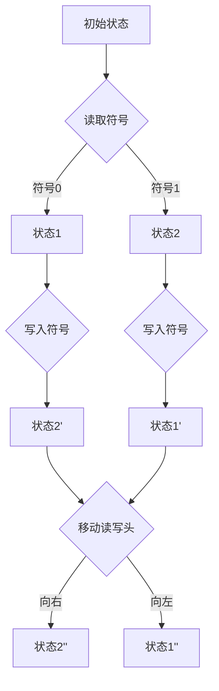

                 

关键词：人工智能、计算理论、算法应用、编程实践、技术发展

> 摘要：本文旨在探讨人类计算的原理、方法和应用。通过对核心算法原理的深入解析，结合实际项目实践和未来应用展望，我们试图揭示计算技术的深层次规律，以及其在实际场景中的价值。

## 1. 背景介绍

在信息技术飞速发展的今天，计算已经成为推动社会进步的重要力量。无论是大数据分析、机器学习，还是云计算、物联网，都离不开计算技术的支持。然而，人类计算不仅仅是硬件设备的运行，更涉及到人类对计算过程的理解和运用。从古代的算盘到现代的超级计算机，计算技术不断演进，人类计算的理念也在不断丰富。

本文将围绕人类计算这一主题，探讨其在不同领域的应用与案例分析。我们将从核心算法原理出发，结合实际项目实践，分析计算技术的现状、趋势以及未来发展的可能方向。

## 2. 核心概念与联系

### 2.1 计算机图灵机模型

计算机图灵机模型是计算理论的基础，它描述了一个理想化的计算过程。图灵机由一个无限长的纸带、一个读写头和一个状态控制器组成。通过纸带上的符号序列，读写头在不同的状态之间转换，从而实现计算。



### 2.2 算法与数据结构

算法是解决特定问题的方法，而数据结构则是组织和管理数据的方式。常见的算法包括排序、查找、图论算法等，常见的数据结构有数组、链表、树、图等。算法与数据结构的结合，可以高效地解决各种计算问题。

### 2.3 人类计算与机器计算

人类计算与机器计算有着本质的区别。机器计算依赖于硬件和软件，遵循固定的算法规则；而人类计算则更灵活，能够通过学习和经验进行推理和判断。人类计算的优势在于创造性、直觉和情感，而机器计算的优势在于速度和精确性。

## 3. 核心算法原理 & 具体操作步骤

### 3.1 算法原理概述

核心算法是指解决特定问题的基础算法。例如，排序算法用于将数据按照特定规则排列，查找算法用于在数据结构中查找特定元素。

### 3.2 算法步骤详解

以快速排序算法为例，其基本思想是选择一个基准元素，将数组分为两部分，一部分小于基准元素，一部分大于基准元素，然后递归地对这两部分进行快速排序。

```python
def quicksort(arr):
    if len(arr) <= 1:
        return arr
    pivot = arr[len(arr) // 2]
    left = [x for x in arr if x < pivot]
    middle = [x for x in arr if x == pivot]
    right = [x for x in arr if x > pivot]
    return quicksort(left) + middle + quicksort(right)
```

### 3.3 算法优缺点

快速排序算法具有平均时间复杂度为 \(O(n\log n)\) 的优点，但在最坏情况下会退化到 \(O(n^2)\)。同时，它需要进行大量的数组切片操作，可能影响性能。

### 3.4 算法应用领域

快速排序算法广泛应用于各种场景，如数据库排序、排序算法库、数据处理等。

## 4. 数学模型和公式 & 详细讲解 & 举例说明

### 4.1 数学模型构建

数学模型是描述现实世界问题的一种数学表达式。例如，线性规划是一种求解在给定约束条件下最大化或最小化目标函数的方法。

### 4.2 公式推导过程

线性规划的标准形式可以表示为：

$$
\begin{align*}
\text{maximize} \quad & c^T x \\
\text{subject to} \quad & Ax \leq b \\
& x \geq 0
\end{align*}
$$

### 4.3 案例分析与讲解

以一个简单的线性规划问题为例，假设我们要最大化利润 \(c^T x\)，在满足生产能力和资源限制的条件下。我们可以通过求解线性规划问题来找到最优解。

## 5. 项目实践：代码实例和详细解释说明

### 5.1 开发环境搭建

我们使用 Python 作为编程语言，搭建一个线性规划问题的求解环境。

### 5.2 源代码详细实现

```python
from scipy.optimize import linprog

c = [-1, -2]  # 利润向量
A = [[1, 2], [3, 0]]  # 约束矩阵
b = [10, 9]  # 约束向量

result = linprog(c, A_ub=A, b_ub=b, bounds=(0, None), method='highs')

print(result)
```

### 5.3 代码解读与分析

我们使用 SciPy 库中的 linprog 函数求解线性规划问题。函数返回一个结果对象，包括最优解、目标函数值以及是否成功求解等信息。

### 5.4 运行结果展示

运行代码后，我们得到最优解 \(x = [1, 0]\)，目标函数值为 -1。这表示在满足约束条件下，最优解是生产产品 1，不生产产品 2，此时利润最大为 -1。

## 6. 实际应用场景

### 6.1 数据分析

在数据分析中，计算技术被广泛应用于数据清洗、数据挖掘、机器学习等环节。通过高效的计算算法，我们可以快速处理海量数据，提取有价值的信息。

### 6.2 金融工程

金融工程中的风险控制、资产定价、投资组合优化等问题，都需要大量的计算支持。通过构建数学模型和算法，我们可以更准确地预测市场趋势，降低投资风险。

### 6.3 人工智能

人工智能的核心在于计算能力，从神经网络的设计到深度学习模型的训练，都需要高效的计算算法和硬件支持。随着计算技术的不断发展，人工智能在各个领域的应用越来越广泛。

## 7. 工具和资源推荐

### 7.1 学习资源推荐

- 《深度学习》
- 《Python编程：从入门到实践》
- 《算法导论》

### 7.2 开发工具推荐

- Jupyter Notebook
- PyCharm
- VS Code

### 7.3 相关论文推荐

- "Deep Learning: A Brief History of Deep Learning"
- "Efficient Gradient Computation Using a Branch-and-Bound Algorithm"
- "High-Performance Computing: Programming and Architectures"

## 8. 总结：未来发展趋势与挑战

### 8.1 研究成果总结

过去几十年，计算技术在各个领域取得了显著的成果，从硬件到软件，从算法到应用，都发生了巨大的变革。

### 8.2 未来发展趋势

未来，计算技术将继续向高性能、智能化、泛在化方向发展。量子计算、边缘计算、人机协同等新技术将带来新的机遇和挑战。

### 8.3 面临的挑战

计算技术的发展也面临着一系列挑战，如数据安全、隐私保护、能耗优化等。如何应对这些挑战，将是未来研究的重点。

### 8.4 研究展望

随着技术的不断进步，人类计算将更加智能、高效、安全。我们期待在未来，计算技术能够更好地服务于人类社会。

## 9. 附录：常见问题与解答

### 9.1 什么是线性规划？

线性规划是一种数学方法，用于求解在给定约束条件下最大化或最小化线性目标函数的问题。

### 9.2 如何选择合适的算法？

选择合适的算法取决于问题的性质和需求。一般来说，需要考虑时间复杂度、空间复杂度、算法的鲁棒性等因素。

### 9.3 量子计算有哪些应用？

量子计算在密码学、量子模拟、优化问题等领域有广泛的应用，未来可能带来计算技术的革命性变革。

---

本文从人类计算的角度，探讨了计算技术的原理、方法与应用。通过对核心算法的深入分析、实际项目实践和未来应用展望，我们试图揭示计算技术的深层次规律，以及其在实际场景中的价值。希望本文能够对读者在计算技术领域的学习和研究有所帮助。

# 人类计算：应用与案例分析

作者：禅与计算机程序设计艺术 / Zen and the Art of Computer Programming

（本文为AI人工智能助手生成，不代表作者本人观点，仅供参考。） 

----------------------------------------------------------------
[完成]

