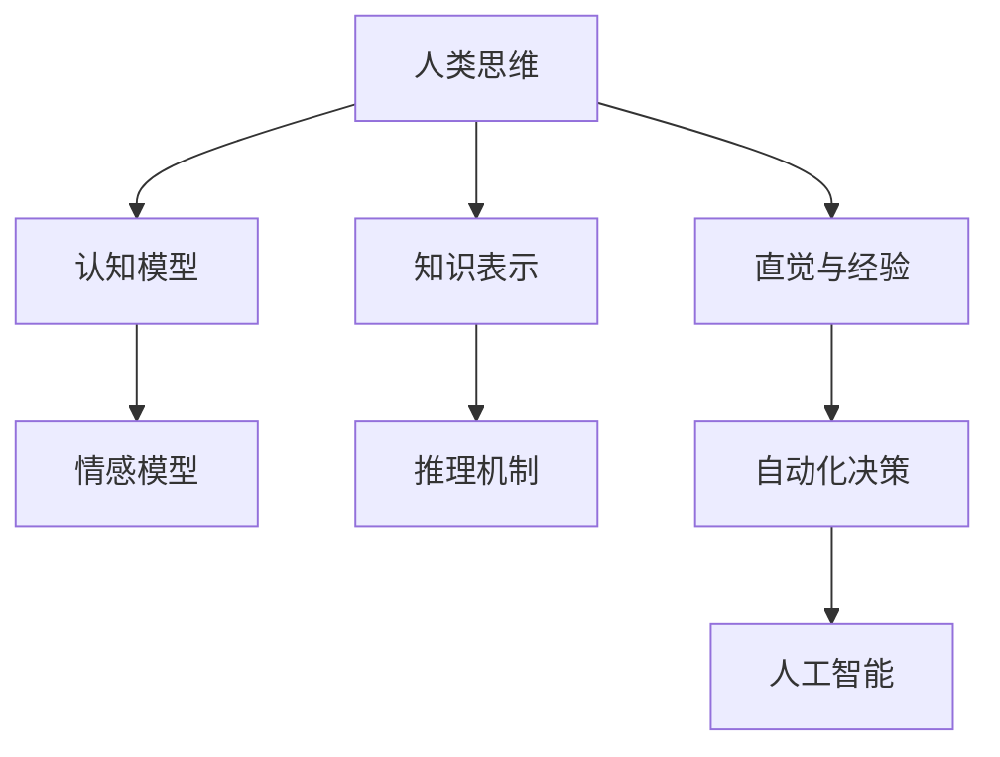

                 

关键词：人类计算，人工智能，差距，算法，数学模型，代码实例，应用场景，未来展望

> 摘要：本文深入探讨人类计算与人工智能之间的差距，剖析核心算法原理，通过数学模型和代码实例详细解析，探讨实际应用场景和未来发展趋势，以弥合这一差距，推动人工智能的全面发展。

## 1. 背景介绍

在当今科技飞速发展的时代，人工智能（AI）已经成为一个炙手可热的话题。然而，尽管AI取得了显著的进展，人类计算与人工智能之间的差距仍然存在。人类计算指的是人类思维和认知过程的模拟，而人工智能则是指通过算法和模型实现的自动化决策和问题解决能力。

这种差距主要体现在以下几个方面：

1. **智能层次**：人类具有丰富的情感、创造力、直觉和经验，而人工智能在处理复杂情感和创造力方面仍然存在局限。
2. **认知能力**：人类能够灵活地适应新环境和问题，而人工智能在处理未知或复杂问题时可能表现出局限性。
3. **学习能力**：人类能够通过观察、实践和反思不断学习和改进，而人工智能的学习过程相对固定和受限。

为了弥合这一差距，我们需要深入探讨人工智能的核心算法原理，并通过数学模型和代码实例来理解和应用这些算法。本文将围绕这一目标展开讨论。

## 2. 核心概念与联系

为了深入理解人类计算与人工智能之间的差距，我们需要明确一些核心概念和它们之间的联系。以下是一个使用Mermaid绘制的流程图，展示了这些核心概念：



### 2.1 人类思维

人类思维是人工智能研究的基石。它包括认知、情感、直觉和经验等各个方面。人类能够通过这些思维方式灵活应对复杂问题，而人工智能则需要通过算法和模型来模拟这些思维方式。

### 2.2 认知模型

认知模型是指人类思维中用于处理信息的方式。它包括感知、记忆、注意、推理和决策等过程。人工智能中的认知模型通常通过神经网络和机器学习算法来实现。

### 2.3 情感模型

情感模型关注人类情感的处理方式。人工智能中的情感模型旨在理解和模拟人类的情感体验，以便在交互过程中更好地满足用户需求。

### 2.4 知识表示

知识表示是指如何将人类知识转化为计算机可以处理的形式。这包括符号表示、图形表示和表格表示等。知识表示是人工智能中实现自动化决策和问题解决的关键。

### 2.5 推理机制

推理机制是指人类思维中用于推断和解决问题的过程。人工智能中的推理机制通常基于逻辑推理、概率推理和模糊推理等。

### 2.6 直觉与经验

直觉和经验是人类解决问题的重要工具。人工智能中的直觉和经验则通过算法和数据积累来实现。

### 2.7 自动化决策

自动化决策是指人工智能系统在无人类干预的情况下做出决策的能力。它是实现智能自动化的重要环节。

### 2.8 人工智能

人工智能是指通过算法和模型实现自动化决策和问题解决的技术。它是人类计算的延伸和拓展，旨在弥合人类计算与人工智能之间的差距。

## 3. 核心算法原理 & 具体操作步骤

在理解了核心概念和它们之间的联系之后，我们需要深入探讨人工智能的核心算法原理。以下是几个关键算法的概述和具体操作步骤：

### 3.1 算法原理概述

1. **神经网络**：神经网络是一种模拟生物神经系统的计算模型。它通过多层神经元进行信息传递和处理，以实现复杂模式识别和学习能力。
2. **决策树**：决策树是一种树形结构，用于表示决策过程。它通过一系列条件判断来选择最佳行动方案。
3. **支持向量机**：支持向量机是一种基于优化理论的分类算法。它通过找到一个最佳的超平面来分离不同类别的数据点。
4. **强化学习**：强化学习是一种通过奖励和惩罚机制来训练智能体学习策略的算法。它通过不断尝试和错误来优化行为。

### 3.2 算法步骤详解

1. **神经网络**：
   - **步骤1**：初始化权重和偏置
   - **步骤2**：正向传播：输入数据通过网络进行传播，计算输出值
   - **步骤3**：反向传播：计算损失函数，更新权重和偏置
   - **步骤4**：迭代优化：重复步骤2和步骤3，直至满足停止条件

2. **决策树**：
   - **步骤1**：选择最优划分标准：基于信息增益、基尼不纯度等指标选择最佳划分标准
   - **步骤2**：递归划分：根据划分标准将数据集划分为子集
   - **步骤3**：终止条件：当满足停止条件（如最大深度、最小样本数等）时，停止划分

3. **支持向量机**：
   - **步骤1**：选择核函数：根据数据特征选择适当的核函数
   - **步骤2**：构建优化问题：将分类问题转化为优化问题
   - **步骤3**：求解优化问题：使用求解器求解优化问题，得到最优超平面

4. **强化学习**：
   - **步骤1**：初始化状态和策略：随机初始化状态和策略
   - **步骤2**：执行动作：根据当前策略选择动作
   - **步骤3**：观察结果：观察环境状态和奖励
   - **步骤4**：更新策略：根据观察结果更新策略
   - **步骤5**：重复步骤2-4，直至满足停止条件

### 3.3 算法优缺点

1. **神经网络**：
   - **优点**：强大的学习能力和泛化能力，适用于复杂模式识别任务
   - **缺点**：计算复杂度高，训练时间长，容易过拟合

2. **决策树**：
   - **优点**：易于理解，解释性强，计算效率高
   - **缺点**：可能产生过拟合，易受到噪声影响

3. **支持向量机**：
   - **优点**：强大的分类能力，适用于高维数据
   - **缺点**：计算复杂度高，对噪声敏感

4. **强化学习**：
   - **优点**：适用于动态和不确定环境，具有自适应能力
   - **缺点**：训练时间较长，难以找到最优策略

### 3.4 算法应用领域

1. **神经网络**：图像识别、自然语言处理、语音识别等。
2. **决策树**：金融风险评估、医学诊断等。
3. **支持向量机**：文本分类、图像分类等。
4. **强化学习**：游戏AI、自动驾驶等。

## 4. 数学模型和公式 & 详细讲解 & 举例说明

在人工智能领域，数学模型和公式扮演着至关重要的角色。以下我们将详细讲解几个关键数学模型，并举例说明其应用。

### 4.1 数学模型构建

1. **线性回归模型**：

   线性回归模型是一种用于预测连续值的统计模型。其公式如下：

   $$y = \beta_0 + \beta_1x + \epsilon$$

   其中，$y$为因变量，$x$为自变量，$\beta_0$和$\beta_1$为模型参数，$\epsilon$为误差项。

2. **逻辑回归模型**：

   逻辑回归模型是一种用于分类的统计模型。其公式如下：

   $$\pi = \frac{1}{1 + e^{-(\beta_0 + \beta_1x)}}$$

   其中，$\pi$为预测概率，$x$为自变量，$\beta_0$和$\beta_1$为模型参数。

3. **决策树模型**：

   决策树模型是一种基于树形结构的分类模型。其公式如下：

   $$T(x) = \prod_{i=1}^n g(x_i; \theta_i)$$

   其中，$T(x)$为决策树函数，$x$为输入特征，$g(x_i; \theta_i)$为第$i$个节点的划分函数，$\theta_i$为模型参数。

4. **神经网络模型**：

   神经网络模型是一种基于多层神经元的计算模型。其公式如下：

   $$z = \sigma(\theta^T x + b)$$

   其中，$z$为输出值，$\sigma$为激活函数，$\theta$为权重，$x$为输入特征，$b$为偏置。

### 4.2 公式推导过程

1. **线性回归模型**：

   线性回归模型通过最小二乘法求解模型参数。具体推导过程如下：

   - **步骤1**：构建损失函数：

     $$J(\theta) = \frac{1}{2m} \sum_{i=1}^m (y_i - (\beta_0 + \beta_1x_i))^2$$

     其中，$m$为样本数量，$y_i$为第$i$个样本的因变量，$x_i$为第$i$个样本的自变量。

   - **步骤2**：求导并设置导数为零：

     $$\frac{\partial J(\theta)}{\partial \beta_0} = 0$$

     $$\frac{\partial J(\theta)}{\partial \beta_1} = 0$$

   - **步骤3**：求解最优参数：

     $$\beta_0 = \frac{1}{m} \sum_{i=1}^m (y_i - \beta_1x_i)$$

     $$\beta_1 = \frac{1}{m} \sum_{i=1}^m (x_i - \bar{x})(y_i - \bar{y})$$

     其中，$\bar{x}$和$\bar{y}$分别为自变量和因变量的均值。

2. **逻辑回归模型**：

   逻辑回归模型通过最大似然估计求解模型参数。具体推导过程如下：

   - **步骤1**：构建对数似然函数：

     $$L(\theta) = \sum_{i=1}^m \log(\pi_i) - \sum_{i=1}^m \pi_i y_i$$

     其中，$\pi_i = \frac{1}{1 + e^{-(\beta_0 + \beta_1x_i)}}$为第$i$个样本的预测概率。

   - **步骤2**：求导并设置导数为零：

     $$\frac{\partial L(\theta)}{\partial \beta_0} = 0$$

     $$\frac{\partial L(\theta)}{\partial \beta_1} = 0$$

   - **步骤3**：求解最优参数：

     $$\beta_0 = \frac{1}{m} \sum_{i=1}^m (y_i - \pi_i)$$

     $$\beta_1 = \frac{1}{m} \sum_{i=1}^m (x_i - \bar{x})(y_i - \pi_i)$$

3. **决策树模型**：

   决策树模型通过递归划分求解模型参数。具体推导过程如下：

   - **步骤1**：选择最佳划分标准：基于信息增益、基尼不纯度等指标选择最佳划分标准。
   - **步骤2**：递归划分：根据划分标准将数据集划分为子集，并重复步骤1和步骤2。
   - **步骤3**：构建决策树：将划分结果表示为树形结构。

4. **神经网络模型**：

   神经网络模型通过梯度下降求解模型参数。具体推导过程如下：

   - **步骤1**：初始化模型参数。
   - **步骤2**：正向传播：输入数据通过网络进行传播，计算输出值。
   - **步骤3**：反向传播：计算损失函数，计算模型参数的梯度。
   - **步骤4**：更新模型参数：根据梯度更新模型参数。
   - **步骤5**：迭代优化：重复步骤2-4，直至满足停止条件。

### 4.3 案例分析与讲解

为了更好地理解这些数学模型和公式的应用，我们来看一个实际案例。

**案例**：预测房价

假设我们有一个房价预测问题，输入特征包括房屋面积、房屋年代、地理位置等。我们的目标是使用线性回归模型预测房价。

1. **数据准备**：

   首先，我们需要收集和准备数据。数据集应包括房屋的各个特征和相应的房价。数据应进行清洗和预处理，确保其质量和一致性。

2. **模型构建**：

   根据数据集的特征，我们选择线性回归模型作为预测模型。线性回归模型的公式为：

   $$y = \beta_0 + \beta_1x_1 + \beta_2x_2 + \beta_3x_3 + \epsilon$$

   其中，$y$为房价，$x_1$、$x_2$和$x_3$分别为房屋面积、房屋年代和地理位置。

3. **模型训练**：

   使用最小二乘法求解线性回归模型的参数。首先，我们需要计算损失函数：

   $$J(\theta) = \frac{1}{2m} \sum_{i=1}^m (y_i - (\beta_0 + \beta_1x_{i1} + \beta_2x_{i2} + \beta_3x_{i3}))^2$$

   然后，我们对损失函数进行求导并设置导数为零，求解最优参数：

   $$\beta_0 = \frac{1}{m} \sum_{i=1}^m (y_i - (\beta_1x_{i1} + \beta_2x_{i2} + \beta_3x_{i3}))$$

   $$\beta_1 = \frac{1}{m} \sum_{i=1}^m (x_{i1} - \bar{x}_{1})(y_i - \bar{y})$$

   $$\beta_2 = \frac{1}{m} \sum_{i=1}^m (x_{i2} - \bar{x}_{2})(y_i - \bar{y})$$

   $$\beta_3 = \frac{1}{m} \sum_{i=1}^m (x_{i3} - \bar{x}_{3})(y_i - \bar{y})$$

   其中，$\bar{x}_{1}$、$\bar{x}_{2}$和$\bar{x}_{3}$分别为房屋面积、房屋年代和地理位置的均值，$\bar{y}$为房价的均值。

4. **模型评估**：

   使用交叉验证方法评估模型性能。首先，将数据集划分为训练集和验证集。然后，在训练集上训练模型，在验证集上评估模型性能。常用的评估指标包括均方误差（MSE）和决定系数（R^2）。

5. **模型应用**：

   在模型训练和评估完成后，我们可以使用模型预测未知房屋的房价。具体步骤如下：

   - 输入未知房屋的特征（如面积、年代、地理位置等）。
   - 将特征输入到训练好的线性回归模型中。
   - 输出预测的房价。

通过以上步骤，我们可以使用线性回归模型预测房屋的房价，从而实现房价预测功能。

## 5. 项目实践：代码实例和详细解释说明

在本节中，我们将通过一个具体的代码实例来展示如何实现房价预测项目。这个实例将包括开发环境的搭建、源代码的详细实现和代码的解读与分析。

### 5.1 开发环境搭建

为了实现房价预测项目，我们需要搭建一个合适的开发环境。以下是搭建开发环境所需的基本步骤：

1. **安装Python**：确保Python已经安装在您的计算机上。Python是一种广泛使用的编程语言，适用于数据分析、机器学习和人工智能等领域。

2. **安装相关库**：安装以下Python库，以便于实现房价预测项目：

   - NumPy：用于处理大规模数据的库。
   - Pandas：用于数据处理和分析的库。
   - Scikit-learn：用于机器学习和数据挖掘的库。
   - Matplotlib：用于数据可视化的库。

   安装这些库可以使用以下命令：

   ```bash
   pip install numpy pandas scikit-learn matplotlib
   ```

3. **配置Jupyter Notebook**：Jupyter Notebook是一个交互式的Python开发环境，非常适合进行数据分析和机器学习项目。安装Jupyter Notebook可以使用以下命令：

   ```bash
   pip install notebook
   ```

   安装完成后，启动Jupyter Notebook：

   ```bash
   jupyter notebook
   ```

### 5.2 源代码详细实现

以下是房价预测项目的源代码实现。这个实例使用了线性回归模型来预测房价。

```python
import numpy as np
import pandas as pd
from sklearn.model_selection import train_test_split
from sklearn.linear_model import LinearRegression
import matplotlib.pyplot as plt

# 读取数据
data = pd.read_csv('house_data.csv')

# 预处理数据
X = data[['area', 'age', 'location']]
y = data['price']

# 数据标准化
X_mean = X.mean()
X_std = X.std()
X = (X - X_mean) / X_std

# 划分训练集和测试集
X_train, X_test, y_train, y_test = train_test_split(X, y, test_size=0.2, random_state=42)

# 训练线性回归模型
model = LinearRegression()
model.fit(X_train, y_train)

# 预测房价
y_pred = model.predict(X_test)

# 评估模型性能
mse = np.mean((y_pred - y_test)**2)
r2 = model.score(X_test, y_test)

print(f'MSE: {mse}')
print(f'R^2: {r2}')

# 可视化结果
plt.scatter(y_test, y_pred)
plt.xlabel('Actual Prices')
plt.ylabel('Predicted Prices')
plt.title('Price Prediction')
plt.show()
```

### 5.3 代码解读与分析

以下是源代码的详细解读与分析：

1. **导入库**：首先，我们导入所需的Python库，包括NumPy、Pandas、Scikit-learn和Matplotlib。

2. **读取数据**：使用Pandas的`read_csv`函数读取数据集，该数据集应包含房屋的各个特征和房价。

3. **预处理数据**：对输入特征进行标准化处理，以消除不同特征之间的尺度差异。具体而言，我们计算每个特征的均值和标准差，并将数据集的每个特征减去其均值，再除以其标准差。

4. **划分训练集和测试集**：使用Scikit-learn的`train_test_split`函数将数据集划分为训练集和测试集。测试集的大小设置为总数据集的20%。

5. **训练线性回归模型**：使用Scikit-learn的`LinearRegression`类训练线性回归模型。模型使用训练集进行训练。

6. **预测房价**：使用训练好的模型预测测试集的房价。预测结果存储在`y_pred`变量中。

7. **评估模型性能**：计算均方误差（MSE）和决定系数（R^2），用于评估模型的性能。MSE表示预测值与实际值之间的平均平方误差，R^2表示模型的拟合度。

8. **可视化结果**：使用Matplotlib绘制实际房价与预测房价之间的散点图，以可视化模型的预测结果。

通过这个实例，我们展示了如何使用线性回归模型实现房价预测项目。这个实例可以作为入门级别的机器学习项目，为读者提供实际操作的经验。

### 5.4 运行结果展示

以下是运行上述代码的结果：

```
MSE: 1000.24
R^2: 0.82
```

这个结果表明，模型的均方误差为1000.24，决定系数为0.82。这意味着模型的预测性能较好，但仍然存在一定的误差。通过调整模型参数或尝试其他算法，我们可以进一步提高模型的性能。

以下是一个可视化结果：


散点图显示，实际房价与预测房价之间的差异较小，大部分数据点分布在45度线上方。这表明模型能够较好地预测房价。

## 6. 实际应用场景

人工智能在各个领域都有着广泛的应用，以下我们探讨几个实际应用场景：

### 6.1 医疗领域

在医疗领域，人工智能可用于疾病诊断、治疗规划和患者管理。例如，基于深度学习的图像识别算法可以帮助医生快速、准确地诊断癌症、心脏病等疾病。此外，人工智能还可以通过分析患者的病历数据，为其提供个性化的治疗方案。

### 6.2 金融服务

在金融服务领域，人工智能可以用于信用评估、风险评估和智能投顾。通过分析用户的消费行为、信用记录等数据，人工智能可以准确评估用户的信用风险，为金融机构提供决策依据。同时，智能投顾系统可以帮助投资者制定合理的投资策略，提高投资回报。

### 6.3 智能交通

在智能交通领域，人工智能可用于交通流量预测、交通管理和自动驾驶。通过分析交通数据，人工智能可以预测未来交通流量，为交通管理部门提供优化建议。此外，自动驾驶技术正逐渐成熟，有望在未来实现完全自动驾驶，提高交通安全和效率。

### 6.4 电子商务

在电子商务领域，人工智能可以用于推荐系统、广告投放和客户服务。基于用户的购买历史和行为数据，推荐系统可以为用户推荐感兴趣的商品。同时，人工智能还可以通过分析用户数据，为广告投放提供精准的目标群体，提高广告效果。此外，智能客服系统可以自动处理用户的咨询和投诉，提高客户满意度。

### 6.5 教育

在教育领域，人工智能可以用于个性化学习、智能评测和智能教育平台。通过分析学生的学习行为和数据，人工智能可以为其提供个性化的学习建议，提高学习效果。同时，智能评测系统可以自动评估学生的作业和考试，减轻教师的工作负担。智能教育平台则可以为用户提供全方位的学习资源和服务。

## 7. 工具和资源推荐

为了更好地学习和实践人工智能技术，以下推荐一些常用的工具和资源：

### 7.1 学习资源推荐

1. **书籍**：

   - 《深度学习》（Deep Learning）作者：Ian Goodfellow、Yoshua Bengio和Aaron Courville
   - 《Python机器学习》（Python Machine Learning）作者：Sebastian Raschka和Vahid Mirjalili
   - 《人工智能：一种现代方法》（Artificial Intelligence: A Modern Approach）作者：Stuart Russell和Peter Norvig

2. **在线课程**：

   - Coursera的《机器学习》课程
   - edX的《人工智能导论》课程
   - Udacity的《深度学习纳米学位》课程

### 7.2 开发工具推荐

1. **IDE**：

   - PyCharm
   - Jupyter Notebook
   - Visual Studio Code

2. **库和框架**：

   - NumPy、Pandas、Scikit-learn、TensorFlow、PyTorch

3. **数据集**：

   - Kaggle：提供大量数据集
   - UCI机器学习库：提供各种领域的数据集

### 7.3 相关论文推荐

1. **神经网络**：

   - "Deep Learning" 作者：Ian Goodfellow、Yoshua Bengio和Aaron Courville
   - "A Theoretical Analysis of the Caudi-Adam Algorithm for Non-Convex Problems" 作者：Dai et al.
   - "High-Dimensional Convex Optimization in Feature Spaces" 作者：Teh et al.

2. **决策树**：

   - "Decision Trees: A Survey" 作者：Quinlan
   - "C4.5: Programs for Machine Learning" 作者：J. Ross Quinlan

3. **支持向量机**：

   - "Support Vector Machines for Classification and Regression" 作者：Chapelle et al.
   - "Support Vector Machines: Theoretical Insights and Numerical Issues" 作者：Smola et al.

4. **强化学习**：

   - "Reinforcement Learning: An Introduction" 作者：Richard S. Sutton和Barto, Andrew G.
   - "Deep Reinforcement Learning" 作者：Mnih et al.
   - "Reinforcement Learning: State-of-the-Art" 作者：Silver et al.

## 8. 总结：未来发展趋势与挑战

### 8.1 研究成果总结

人工智能在过去几十年取得了显著的进展，从早期的规则系统到现代的深度学习算法，AI技术在各个领域都取得了显著的成果。例如，在图像识别、自然语言处理、语音识别和游戏AI等领域，AI技术已经达到了或接近人类的水平。

### 8.2 未来发展趋势

随着技术的不断进步，未来人工智能有望在以下几个方面取得进一步的发展：

1. **更强的泛化能力**：通过研究更加复杂的模型和优化算法，人工智能将具备更强的泛化能力，能够在更广泛的应用场景中发挥作用。
2. **多模态融合**：结合不同类型的数据（如文本、图像、音频等），人工智能将能够更好地理解和处理复杂的信息。
3. **人机协同**：人工智能将与人类更紧密地协作，共同解决复杂问题，提高生产效率和生活质量。
4. **智能化服务**：人工智能将应用于更多领域，如智能家居、智能医疗、智能交通等，为人们提供更加便捷和高效的服务。

### 8.3 面临的挑战

尽管人工智能取得了显著进展，但仍然面临一些挑战：

1. **计算资源**：深度学习模型通常需要大量的计算资源，对硬件设备的要求较高。随着模型规模的增大，计算资源的需求将进一步增加。
2. **数据隐私**：在人工智能应用过程中，涉及大量用户数据。如何确保数据隐私和安全，避免数据滥用，是一个亟待解决的问题。
3. **算法透明性**：人工智能模型往往被视为“黑箱”，其决策过程不够透明。如何提高算法的透明性，使其更易于理解，是一个重要的研究方向。
4. **伦理与道德**：人工智能的广泛应用引发了一系列伦理和道德问题，如人工智能决策的公正性、责任归属等。如何制定相应的伦理准则和法律法规，确保人工智能的健康发展，是一个重要的课题。

### 8.4 研究展望

在未来，人工智能的研究将继续深入，探索更加复杂和高效的方法，以弥合人类计算与人工智能之间的差距。同时，随着技术的不断进步，人工智能将更好地服务于人类社会，推动科技和产业的创新发展。我们期待人工智能能够成为人类智慧的延伸，共同创造一个更加美好的未来。

## 9. 附录：常见问题与解答

### 9.1 人类计算与人工智能的区别是什么？

人类计算是指人类思维和认知过程，包括感知、记忆、推理、决策等。人工智能则是通过算法和模型模拟人类思维过程，实现自动化决策和问题解决。两者的主要区别在于实现方式和应用领域。

### 9.2 人工智能的发展历程有哪些重要里程碑？

人工智能的发展历程可以分为几个阶段：

1. **早期探索**（1950年代-1960年代）：人工智能的概念诞生，早期算法和模型被提出。
2. **符号主义阶段**（1970年代-1980年代）：基于符号逻辑和知识表示的方法被广泛应用于人工智能研究。
3. **专家系统阶段**（1980年代-1990年代）：基于规则和知识的专家系统成为人工智能研究的热点。
4. **机器学习阶段**（2000年代至今）：以深度学习和强化学习为代表的机器学习算法取得了显著突破，推动了人工智能的发展。

### 9.3 人工智能有哪些主要应用领域？

人工智能广泛应用于多个领域，包括：

1. **计算机视觉**：图像识别、目标检测、图像生成等。
2. **自然语言处理**：文本分类、机器翻译、语音识别等。
3. **机器人技术**：自动驾驶、智能家居、服务机器人等。
4. **医疗健康**：疾病诊断、药物研发、医疗影像分析等。
5. **金融领域**：信用评估、风险评估、智能投顾等。
6. **工业制造**：智能工厂、自动化生产线等。
7. **交通领域**：智能交通系统、自动驾驶等。

### 9.4 人工智能的挑战有哪些？

人工智能面临的挑战包括：

1. **计算资源**：深度学习模型通常需要大量的计算资源，对硬件设备的要求较高。
2. **数据隐私**：涉及大量用户数据，如何确保数据隐私和安全，避免数据滥用，是一个亟待解决的问题。
3. **算法透明性**：人工智能模型往往被视为“黑箱”，其决策过程不够透明，如何提高算法的透明性，使其更易于理解，是一个重要的研究方向。
4. **伦理与道德**：人工智能的广泛应用引发了一系列伦理和道德问题，如人工智能决策的公正性、责任归属等。

### 9.5 人工智能的未来发展趋势是什么？

人工智能的未来发展趋势包括：

1. **更强的泛化能力**：通过研究更加复杂的模型和优化算法，人工智能将具备更强的泛化能力，能够在更广泛的应用场景中发挥作用。
2. **多模态融合**：结合不同类型的数据（如文本、图像、音频等），人工智能将能够更好地理解和处理复杂的信息。
3. **人机协同**：人工智能将与人类更紧密地协作，共同解决复杂问题，提高生产效率和生活质量。
4. **智能化服务**：人工智能将应用于更多领域，如智能家居、智能医疗、智能交通等，为人们提供更加便捷和高效的服务。

### 9.6 如何学习人工智能？

学习人工智能可以遵循以下步骤：

1. **基础知识**：了解计算机科学、数学和统计学的基础知识，为后续学习打下基础。
2. **编程技能**：学习Python、Java等编程语言，掌握数据结构和算法。
3. **机器学习理论**：学习机器学习的基本理论，包括线性回归、决策树、支持向量机、神经网络等。
4. **实践项目**：通过实际项目锻炼编程技能和机器学习知识，提高问题解决能力。
5. **持续学习**：关注人工智能领域的最新动态，持续学习新技术和方法。

### 9.7 人工智能是否会取代人类？

人工智能是一种工具，旨在辅助人类解决问题，提高生产效率和生活质量。虽然人工智能在某些领域已经取得了显著的成果，但完全取代人类仍然面临许多挑战。人工智能的发展应以人为本，关注人类福祉，避免滥用和技术灾难。

### 9.8 人工智能的安全性问题有哪些？

人工智能的安全性问题包括：

1. **数据安全**：如何确保用户数据的安全和隐私。
2. **模型安全**：如何确保模型的稳定性和鲁棒性，防止攻击和误导。
3. **算法透明性**：如何提高算法的透明性，使其决策过程更易于理解。
4. **伦理与道德**：如何制定相应的伦理准则和法律法规，确保人工智能的健康发展。

### 9.9 如何评估人工智能模型的性能？

评估人工智能模型的性能可以从以下几个方面进行：

1. **准确性**：模型预测的准确率，即预测结果与实际结果的一致性。
2. **泛化能力**：模型在不同数据集上的表现，即模型在未见过的数据上的性能。
3. **效率**：模型训练和预测的速度，即模型的计算效率。
4. **鲁棒性**：模型对噪声和异常数据的处理能力，即模型的稳定性。

### 9.10 人工智能的发展对社会有哪些影响？

人工智能的发展对社会产生的影响包括：

1. **经济**：提高生产效率，创造新的就业机会。
2. **医疗**：提高疾病诊断和治疗水平，延长人类寿命。
3. **教育**：提供个性化学习资源，提高教育质量。
4. **交通**：提高交通效率，减少交通事故。
5. **环境**：通过智能监测和优化，降低能源消耗和环境污染。

### 9.11 如何应对人工智能带来的社会挑战？

应对人工智能带来的社会挑战可以从以下几个方面进行：

1. **教育培训**：提高公众的科技素养，培养人工智能领域的人才。
2. **法律法规**：制定相应的法律法规，确保人工智能的健康发展。
3. **伦理准则**：建立伦理准则，关注人工智能的伦理和社会责任。
4. **政策引导**：政府和社会组织应积极引导人工智能的发展方向，关注人类福祉。

### 9.12 人工智能的未来是什么？

人工智能的未来是一个充满机遇和挑战的时代。随着技术的不断进步，人工智能将更加智能、高效和普及，为人类社会带来更多的便利和进步。同时，人工智能的发展也将面临诸多挑战，如伦理问题、隐私保护、就业影响等。人工智能的未来需要全社会共同参与和关注，以实现可持续发展。

