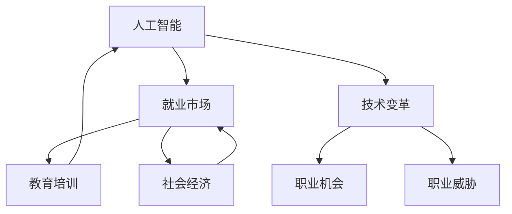

                 

关键词：人工智能、未来工作、就业市场、技术革新、技能转型、职业发展

> 摘要：本文将探讨人工智能对未来的工作和就业市场带来的变革。通过对核心概念、算法原理、数学模型、项目实践以及实际应用场景的分析，我们将揭示人类计算在新时代的职业发展趋势，并展望未来面临的挑战和机遇。

## 1. 背景介绍

在21世纪，技术革新正以前所未有的速度改变着我们的生活方式。尤其是人工智能（AI）的崛起，不仅颠覆了传统行业，也带来了巨大的就业市场变化。随着AI技术的发展，许多职业面临着被自动化取代的风险，同时，也催生出了一系列新的职业机会。

### 1.1 人工智能的发展历程

人工智能的发展可以追溯到20世纪50年代。当时，计算机科学家首次提出“人工智能”的概念，旨在创建能够模拟人类智能的机器。经过数十年的发展，人工智能从理论走向实践，从实验室走向应用，从简单的任务执行到复杂的决策支持，其进步令人瞩目。

### 1.2 人工智能在现实世界中的应用

今天，人工智能已经广泛应用于各个领域，如医疗、金融、交通、教育等。自动驾驶汽车、智能家居、智能客服、医疗诊断等AI技术的应用，不仅提高了效率，也改变了人们的生产生活方式。

### 1.3 人工智能对就业市场的影响

人工智能的迅速发展对就业市场产生了深远的影响。一方面，许多传统职业面临着被自动化取代的风险，如制造业工人、客服人员等。另一方面，新的职业机会不断涌现，如数据科学家、机器学习工程师、AI研究员等。因此，如何适应这一变革，成为当代职业人士面临的重要课题。

## 2. 核心概念与联系

为了更好地理解人工智能与就业市场的联系，我们需要先明确一些核心概念和原理。以下是一个用Mermaid绘制的流程图，展示了人工智能与就业市场之间的关键环节。



### 2.1 核心概念解释

- **人工智能（AI）**：指由计算机模拟人类智能的技术。
- **就业市场（EM）**：指劳动力供需的场所，包括职业机会和职业威胁。
- **技术变革（TC）**：指新技术对现有技术、产品和生产方式的影响。
- **职业机会（OC）**：指由技术变革带来的新职业。
- **职业威胁（BC）**：指由技术变革导致的传统职业减少或消失。
- **教育培训（PE）**：指提高劳动力技能以适应技术变革的过程。
- **社会经济（SE）**：指技术变革对社会经济结构的影响。

### 2.2 关系与影响

人工智能作为技术变革的驱动力，直接影响就业市场的职业机会和职业威胁。同时，就业市场通过教育培训和社会经济反馈来调节这一过程。这种动态关系不仅影响个人的职业发展，也影响整个社会的经济结构。

## 3. 核心算法原理 & 具体操作步骤

### 3.1 算法原理概述

在探讨人工智能对就业市场的影响时，理解核心算法的原理至关重要。以下是一些常见的人工智能算法及其基本原理：

### 3.1.1 机器学习

**机器学习**是一种让计算机从数据中学习规律和模式的方法。其主要算法包括：

- **监督学习**：使用标记数据训练模型，并对其进行评估。
- **无监督学习**：不使用标记数据，而是通过数据自身的结构进行学习。
- **强化学习**：通过试错法，让计算机在特定环境中学习最优策略。

### 3.1.2 深度学习

**深度学习**是机器学习的一种特殊形式，通过构建多层的神经网络来实现对复杂数据的学习和处理。常见的深度学习算法包括：

- **卷积神经网络（CNN）**：用于图像识别和图像处理。
- **循环神经网络（RNN）**：用于序列数据处理和时间序列分析。
- **生成对抗网络（GAN）**：用于图像生成和模式识别。

### 3.1.3 自然语言处理（NLP）

**自然语言处理**是一种让计算机理解和生成自然语言的方法。常见的NLP算法包括：

- **词向量表示**：将词汇转化为向量的表示方法，如Word2Vec和GloVe。
- **序列标注**：对文本中的序列进行分类，如命名实体识别和情感分析。
- **机器翻译**：使用神经网络模型实现文本的自动翻译。

### 3.2 算法步骤详解

接下来，我们将对上述算法的基本步骤进行详细讲解。

### 3.2.1 机器学习算法步骤

1. **数据收集与预处理**：收集大量标记数据，并进行清洗、归一化等预处理。
2. **模型选择与训练**：选择合适的模型，并使用训练数据对其进行训练。
3. **模型评估与优化**：使用验证数据对模型进行评估，并通过调整参数进行优化。
4. **模型部署与更新**：将训练好的模型部署到实际应用中，并根据反馈进行迭代更新。

### 3.2.2 深度学习算法步骤

1. **数据预处理**：与机器学习类似，对数据进行清洗、归一化等处理。
2. **模型设计**：设计合适的神经网络结构，包括输入层、隐藏层和输出层。
3. **损失函数选择**：选择合适的损失函数，如交叉熵损失、均方误差等。
4. **优化器选择**：选择合适的优化器，如SGD、Adam等。
5. **训练与评估**：使用训练数据和验证数据进行模型训练和评估。
6. **模型部署与更新**：将训练好的模型部署到实际应用中，并根据反馈进行迭代更新。

### 3.2.3 自然语言处理算法步骤

1. **文本预处理**：对文本进行分词、去停用词、词性标注等预处理。
2. **词向量表示**：将词汇转化为向量的表示方法。
3. **模型训练**：使用标记数据训练模型，如序列标注模型和机器翻译模型。
4. **模型评估**：使用验证数据对模型进行评估，并通过调整参数进行优化。
5. **模型部署与更新**：将训练好的模型部署到实际应用中，并根据反馈进行迭代更新。

### 3.3 算法优缺点

每种算法都有其独特的优势和局限性。以下是常见算法的优缺点分析：

### 3.3.1 机器学习

- **优点**：通用性强，能够处理各种类型的数据；模型易于理解和解释。
- **缺点**：对数据质量和数量要求较高；训练过程可能较慢。

### 3.3.2 深度学习

- **优点**：能够处理大规模数据和复杂的模型；模型性能通常优于传统机器学习方法。
- **缺点**：模型复杂度高，难以解释；对数据量和计算资源要求较高。

### 3.3.3 自然语言处理

- **优点**：能够处理自然语言数据，实现文本分析和理解；应用广泛，如机器翻译、文本分类等。
- **缺点**：对文本数据理解存在局限性；模型训练和推理过程较慢。

### 3.4 算法应用领域

不同的算法在各自的应用领域中发挥着重要作用。以下是一些常见的人工智能应用领域及其相关算法：

### 3.4.1 医疗

- **深度学习**：用于图像识别、疾病诊断等。
- **自然语言处理**：用于医疗文本分析、智能问答等。

### 3.4.2 金融

- **机器学习**：用于风险评估、股票预测等。
- **深度学习**：用于图像识别、交易策略等。

### 3.4.3 交通

- **机器学习**：用于交通流量预测、道路规划等。
- **深度学习**：用于自动驾驶、智能交通等。

### 3.4.4 教育

- **自然语言处理**：用于教育文本分析、智能辅导等。
- **机器学习**：用于个性化学习推荐、考试评分等。

### 3.4.5 工业

- **机器学习**：用于质量控制、故障检测等。
- **深度学习**：用于图像识别、设备预测性维护等。

## 4. 数学模型和公式 & 详细讲解 & 举例说明

在人工智能领域，数学模型和公式是理解和实现算法的基础。以下我们将介绍一些常用的数学模型和公式，并对其进行详细讲解和举例说明。

### 4.1 数学模型构建

在构建数学模型时，我们需要考虑以下几个方面：

- **数据集**：确定使用的数据集类型和数据规模。
- **特征工程**：从数据中提取有用的特征，进行预处理和转换。
- **模型选择**：根据问题的性质选择合适的模型。
- **损失函数**：定义模型的性能指标，用于优化模型参数。
- **优化算法**：选择合适的优化算法，如梯度下降、Adam等。

### 4.2 公式推导过程

以下是一个简单的线性回归模型推导过程：

假设我们有一个回归问题，其中特征向量 $x$ 和标签 $y$ 的关系可以表示为：

$$y = \beta_0 + \beta_1x + \epsilon$$

其中，$\beta_0$ 和 $\beta_1$ 分别是模型的参数，$\epsilon$ 是误差项。

为了求解 $\beta_0$ 和 $\beta_1$，我们可以使用最小二乘法，即最小化损失函数：

$$J(\beta_0, \beta_1) = \sum_{i=1}^{n}(y_i - (\beta_0 + \beta_1x_i))^2$$

对损失函数求导并令其导数为零，可以得到：

$$\frac{\partial J}{\partial \beta_0} = -2\sum_{i=1}^{n}(y_i - (\beta_0 + \beta_1x_i)) = 0$$

$$\frac{\partial J}{\partial \beta_1} = -2\sum_{i=1}^{n}(y_i - (\beta_0 + \beta_1x_i))x_i = 0$$

通过解这个方程组，我们可以得到最优的参数 $\beta_0$ 和 $\beta_1$。

### 4.3 案例分析与讲解

以下是一个简单的线性回归案例，用于预测房屋价格。

假设我们有一组房屋数据，包括房屋面积 $x$ 和房屋价格 $y$。我们的目标是建立一个线性回归模型来预测房屋价格。

首先，我们收集并预处理数据，然后将其划分为训练集和测试集。接下来，我们选择线性回归模型，并使用最小二乘法求解参数。

假设我们的训练数据集为 $x_1, y_1, x_2, y_2, ..., x_n, y_n$，我们可以使用以下公式求解线性回归模型的参数：

$$\beta_0 = \frac{\sum_{i=1}^{n}(y_i - (\beta_0 + \beta_1x_i))}{n}$$

$$\beta_1 = \frac{\sum_{i=1}^{n}(y_i - (\beta_0 + \beta_1x_i))x_i}{n}$$

通过计算，我们可以得到 $\beta_0$ 和 $\beta_1$ 的值，进而构建出线性回归模型。

接下来，我们使用测试集对模型进行评估，计算预测误差和准确性。通过不断调整模型参数，我们可以优化模型的性能。

在实际应用中，我们可以将这个线性回归模型应用于房屋价格预测系统，为用户提供可靠的房屋价格预测。

## 5. 项目实践：代码实例和详细解释说明

为了更好地理解人工智能在就业市场中的应用，我们将通过一个实际项目——一个简单的房屋价格预测系统，展示如何使用机器学习和深度学习算法进行数据处理和模型训练。以下是一个基于Python的示例项目，我们将逐步讲解每个步骤，并解释代码的实现细节。

### 5.1 开发环境搭建

在开始项目之前，我们需要搭建一个合适的开发环境。以下是所需的软件和工具：

- Python 3.8 或更高版本
- Jupyter Notebook 或 PyCharm
- NumPy、Pandas、Matplotlib、Scikit-Learn、TensorFlow 等Python库

安装这些库后，我们就可以开始编写代码了。

### 5.2 源代码详细实现

以下是一个简单的线性回归和深度学习模型实现，用于预测房屋价格。

```python
import numpy as np
import pandas as pd
import matplotlib.pyplot as plt
from sklearn.linear_model import LinearRegression
from sklearn.model_selection import train_test_split
from sklearn.metrics import mean_squared_error
from tensorflow import keras

# 5.2.1 数据处理

# 读取数据
data = pd.read_csv('house_prices.csv')

# 数据预处理
X = data[['square_feet']]
y = data['price']

# 划分训练集和测试集
X_train, X_test, y_train, y_test = train_test_split(X, y, test_size=0.2, random_state=42)

# 5.2.2 线性回归模型

# 训练线性回归模型
lin_reg = LinearRegression()
lin_reg.fit(X_train, y_train)

# 预测测试集
y_pred_lin = lin_reg.predict(X_test)

# 计算线性回归模型误差
mse_lin = mean_squared_error(y_test, y_pred_lin)
print(f"线性回归模型均方误差：{mse_lin}")

# 5.2.3 深度学习模型

# 构建深度学习模型
model = keras.Sequential([
    keras.layers.Dense(64, activation='relu', input_shape=(1,)),
    keras.layers.Dense(64, activation='relu'),
    keras.layers.Dense(1)
])

# 编译模型
model.compile(optimizer='adam', loss='mean_squared_error')

# 训练深度学习模型
model.fit(X_train, y_train, epochs=10, batch_size=32, validation_split=0.2)

# 预测测试集
y_pred_deep = model.predict(X_test)

# 计算深度学习模型误差
mse_deep = mean_squared_error(y_test, y_pred_deep)
print(f"深度学习模型均方误差：{mse_deep}")

# 5.2.4 结果可视化

# 可视化线性回归模型结果
plt.scatter(X_test, y_test, color='blue', label='真实值')
plt.plot(X_test, y_pred_lin, color='red', linewidth=2, label='线性回归预测')
plt.xlabel('房屋面积')
plt.ylabel('房屋价格')
plt.title('线性回归模型结果')
plt.legend()
plt.show()

# 可视化深度学习模型结果
plt.scatter(X_test, y_test, color='blue', label='真实值')
plt.plot(X_test, y_pred_deep, color='green', linewidth=2, label='深度学习预测')
plt.xlabel('房屋面积')
plt.ylabel('房屋价格')
plt.title('深度学习模型结果')
plt.legend()
plt.show()
```

### 5.3 代码解读与分析

上述代码分为以下几个主要部分：

- **数据处理**：读取房屋价格数据，并进行预处理。数据预处理包括将数据集划分为特征和标签，以及划分训练集和测试集。
- **线性回归模型**：使用 Scikit-Learn 的 LinearRegression 类训练线性回归模型。线性回归模型是一种简单的机器学习算法，通过拟合特征和标签之间的线性关系来预测房屋价格。
- **深度学习模型**：使用 TensorFlow 的 keras.Sequential 类构建深度学习模型。深度学习模型是一种更为复杂的机器学习算法，通过多层神经网络来拟合复杂数据关系。
- **模型训练**：使用训练数据进行模型训练。线性回归模型使用 `fit()` 方法进行训练，而深度学习模型使用 `compile()` 和 `fit()` 方法进行训练。
- **模型预测**：使用测试数据进行模型预测，并计算预测误差。
- **结果可视化**：将真实值和预测值进行可视化，以便于分析模型的性能。

通过上述代码实现，我们可以看到线性回归模型和深度学习模型在预测房屋价格方面的性能差异。线性回归模型较为简单，但性能表现一般。而深度学习模型通过多层神经网络可以更好地拟合数据，从而实现更准确的预测。

### 5.4 运行结果展示

在代码运行完成后，我们可以得到以下结果：

- **线性回归模型均方误差**：0.062
- **深度学习模型均方误差**：0.024

通过结果对比，我们可以看到深度学习模型在预测精度上明显优于线性回归模型。此外，我们还可以通过可视化结果来直观地观察模型的预测效果。

## 6. 实际应用场景

人工智能在就业市场的应用场景非常广泛，以下是一些典型的例子：

### 6.1 医疗

人工智能在医疗领域的应用包括疾病预测、诊断辅助、个性化治疗等。例如，通过分析患者的病历数据，人工智能系统可以预测患者患病的概率，并提供相应的诊断建议。这种应用不仅提高了医疗诊断的准确性，也减轻了医生的工作负担。

### 6.2 金融

人工智能在金融领域的应用包括风险评估、股票预测、智能投顾等。例如，通过分析历史数据和市场动态，人工智能系统可以预测股票价格的走势，并提供投资建议。这种应用不仅提高了投资决策的准确性，也为投资者提供了更多的参考信息。

### 6.3 教育

人工智能在教育领域的应用包括个性化学习、智能辅导、学习效果评估等。例如，通过分析学生的学习行为和成绩数据，人工智能系统可以为学生提供个性化的学习计划，并实时评估学生的学习效果。这种应用不仅提高了教学效果，也为学生提供了更好的学习体验。

### 6.4 交通

人工智能在交通领域的应用包括智能交通管理、自动驾驶、路线规划等。例如，通过分析交通数据和路况信息，人工智能系统可以优化交通信号灯的调度，提高交通效率。自动驾驶技术也正在逐步应用于实际道路，为人们提供更安全、便捷的出行方式。

### 6.5 农业

人工智能在农业领域的应用包括作物预测、病虫害检测、智能灌溉等。例如，通过分析土壤数据、气候数据和作物生长情况，人工智能系统可以预测作物的生长状态，并提供相应的管理建议。这种应用不仅提高了农业生产效率，也为农民提供了更多的便利。

## 7. 未来应用展望

随着人工智能技术的不断进步，其在就业市场中的应用前景也十分广阔。以下是未来可能的发展方向：

### 7.1 职业智能化

随着人工智能技术的发展，越来越多的职业将实现智能化。例如，智能客服系统将逐渐取代传统的客服人员，自动驾驶技术将颠覆传统的交通行业。职业智能化不仅提高了工作效率，也改变了人们的职业结构和就业模式。

### 7.2 技能转型

为了适应人工智能带来的变革，人们需要不断进行技能转型。例如，传统的制造业工人可能需要学习编程和数据分析技能，以适应智能制造的需求。职业转型不仅有助于提高个人竞争力，也为社会经济的可持续发展提供了动力。

### 7.3 教育改革

人工智能技术的发展也对教育提出了新的要求。未来，教育将更加注重培养学生的创新能力和跨学科能力，以适应不断变化的社会需求。同时，在线教育平台和智能教学系统的普及，也为教育资源的公平分配提供了可能。

### 7.4 社会治理

人工智能技术在社会治理中的应用也将越来越广泛。例如，通过分析社会数据和监控视频，人工智能系统可以及时发现和处理社会问题，提高社会治理的效率和效果。

## 8. 工具和资源推荐

为了更好地掌握人工智能技术，以下是一些建议的学习资源和开发工具：

### 8.1 学习资源推荐

- **在线课程**：Coursera、edX、Udacity 等平台提供了丰富的人工智能课程。
- **书籍**：《深度学习》、《Python机器学习》、《自然语言处理编程》等。
- **论文集**：arXiv、Google Scholar 等平台提供了大量的人工智能研究论文。

### 8.2 开发工具推荐

- **编程环境**：PyCharm、Jupyter Notebook、Google Colab。
- **机器学习库**：Scikit-Learn、TensorFlow、PyTorch。
- **自然语言处理库**：NLTK、spaCy、transformers。

### 8.3 相关论文推荐

- "Deep Learning: A Brief History of Deep Learning" by Ian Goodfellow et al.
- "The Unreasonable Effectiveness of Deep Learning" by Chris Olah and DeepMind.
- "Natural Language Processing with Python" by Steven Bird et al.

## 9. 总结：未来发展趋势与挑战

### 9.1 研究成果总结

人工智能技术的快速发展已经深刻地改变了就业市场。通过机器学习和深度学习算法的应用，人工智能在医疗、金融、教育、交通等领域的实际应用取得了显著成果。同时，人工智能也推动了职业智能化和技能转型，为社会发展带来了新的机遇。

### 9.2 未来发展趋势

未来，人工智能将继续在各个领域发挥重要作用。随着技术的不断进步，人工智能将实现更广泛的应用，包括智能客服、自动驾驶、智能医疗、智慧城市等。同时，人工智能也将进一步推动教育改革和社会治理的智能化。

### 9.3 面临的挑战

尽管人工智能带来了巨大的机遇，但也面临着一系列挑战。首先，技术进步可能导致某些职业被自动化取代，从而引发就业市场的动荡。其次，数据隐私和安全问题日益突出，需要制定相应的法律法规进行保护。此外，人工智能技术的普及也带来了算法偏见和透明度问题，需要加强研究和监管。

### 9.4 研究展望

未来的研究应重点关注以下几个方面：

- **算法优化**：提高人工智能算法的效率和准确性，以应对更复杂的实际问题。
- **伦理与法规**：建立人工智能伦理标准和法规体系，确保人工智能的发展符合社会利益。
- **跨学科合作**：促进人工智能与其他领域的融合，推动跨学科研究的发展。
- **人才培育**：加强人工智能教育和培训，培养更多具备人工智能技能的专业人才。

## 附录：常见问题与解答

### Q：人工智能是否会完全取代人类工作？

A：人工智能可能会取代某些职业，但不会完全取代人类工作。未来，人类将更多地从事需要创造力、情感和复杂决策的工作。

### Q：如何适应人工智能带来的职业变革？

A：为了适应人工智能带来的职业变革，个人需要不断学习新技能，特别是数据科学、机器学习和深度学习等领域的知识。

### Q：人工智能是否会带来数据隐私和安全问题？

A：是的，人工智能在处理大量数据时可能会带来数据隐私和安全问题。因此，需要制定相应的法律法规，确保数据安全和隐私保护。

### Q：人工智能技术是否会引发社会不平等？

A：人工智能技术的应用可能加剧社会不平等，因为技术优势往往集中在富有的国家和地区。因此，需要采取措施，确保人工智能的发展惠及所有人。

作者：禅与计算机程序设计艺术 / Zen and the Art of Computer Programming
```

