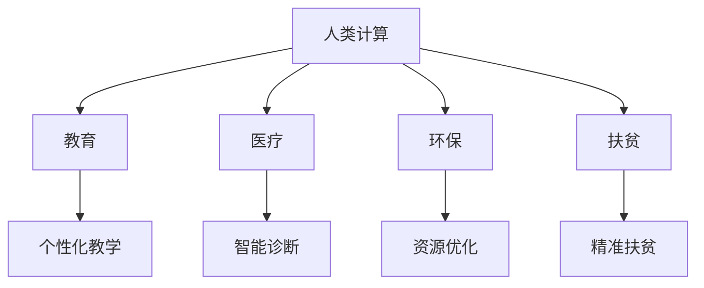

                 

关键词：人类计算、社会公益、技术应用、算法、数学模型、代码实例、未来展望

## 摘要

本文将探讨人类计算在社会公益领域的广泛应用。通过分析人类计算的核心概念、算法原理、数学模型以及具体的应用实例，我们将揭示技术如何为社会公益做出贡献。本文旨在为读者提供一个全面的理解，使更多人意识到人类计算在推动社会进步中的重要作用。

## 1. 背景介绍

人类计算是指人类利用自身的认知能力进行信息处理和决策的过程。它不同于机器计算，强调人的主观能动性和创造性。随着信息技术的飞速发展，人类计算在社会公益领域中的应用越来越广泛。从教育、医疗、环保到公共安全，人类计算正发挥着巨大的作用。

### 1.1 人类计算的重要性

人类计算在以下方面具有独特的优势：

- **灵活性**：人类能够根据具体情境进行灵活的思考和决策，适应不断变化的环境。
- **创造力**：人类能够创新性地解决问题，提出新的解决方案。
- **复杂性处理**：人类能够处理复杂的、模糊的信息，而机器则相对困难。

### 1.2 社会公益的定义

社会公益是指为公众谋福利、促进社会和谐与进步的活动。它涵盖了教育、医疗、环保、扶贫等多个方面。社会公益的目标是实现社会公平、提高人民生活水平、保护生态环境等。

## 2. 核心概念与联系

### 2.1 核心概念

- **人类计算**：指人类利用自身的认知能力进行信息处理和决策的过程。
- **社会公益**：为公众谋福利、促进社会和谐与进步的活动。

### 2.2 联系

人类计算与社会公益的联系主要体现在以下几个方面：

- **教育**：通过个性化教学，提高学生的学习效果，促进教育公平。
- **医疗**：利用人工智能技术，提高医疗诊断和治疗的准确性，减轻医生负担。
- **环保**：通过数据分析，优化资源利用，减少环境污染。
- **扶贫**：利用大数据和人工智能技术，精准识别贫困人口，提高扶贫效率。

### 2.3 Mermaid 流程图



## 3. 核心算法原理 & 具体操作步骤

### 3.1 算法原理概述

本文将介绍以下几个核心算法在社会公益领域的应用：

- **机器学习**：用于数据分析和预测，如医疗诊断、精准扶贫等。
- **深度学习**：用于处理大规模复杂数据，如人脸识别、语音识别等。
- **神经网络**：用于模拟人脑神经元的工作原理，如智能交通系统、智能安防等。

### 3.2 算法步骤详解

#### 3.2.1 机器学习

1. **数据收集**：收集相关领域的数据。
2. **数据预处理**：清洗、归一化等。
3. **模型选择**：选择合适的机器学习算法，如决策树、支持向量机等。
4. **模型训练**：使用训练数据训练模型。
5. **模型评估**：使用测试数据评估模型性能。
6. **模型应用**：将模型应用到实际问题中。

#### 3.2.2 深度学习

1. **数据收集**：收集相关领域的数据。
2. **数据预处理**：清洗、归一化等。
3. **模型构建**：构建深度学习模型，如卷积神经网络、循环神经网络等。
4. **模型训练**：使用训练数据训练模型。
5. **模型评估**：使用测试数据评估模型性能。
6. **模型应用**：将模型应用到实际问题中。

#### 3.2.3 神经网络

1. **数据收集**：收集相关领域的数据。
2. **数据预处理**：清洗、归一化等。
3. **模型构建**：构建神经网络模型。
4. **模型训练**：使用训练数据训练模型。
5. **模型评估**：使用测试数据评估模型性能。
6. **模型应用**：将模型应用到实际问题中。

### 3.3 算法优缺点

#### 3.3.1 机器学习

**优点**：

- **自动化**：能够自动地从数据中学习。
- **泛化能力强**：能够处理复杂的问题。

**缺点**：

- **数据依赖性高**：需要大量的数据。
- **可解释性差**：难以解释决策过程。

#### 3.3.2 深度学习

**优点**：

- **处理复杂数据**：能够处理大规模、高维度的数据。
- **性能优异**：在很多任务上取得了优异的性能。

**缺点**：

- **计算资源消耗大**：需要大量的计算资源。
- **模型不可解释**：难以解释决策过程。

#### 3.3.3 神经网络

**优点**：

- **模拟人脑**：能够模拟人脑神经元的工作原理。
- **适应性**：能够适应不同的环境和任务。

**缺点**：

- **训练难度大**：需要大量的训练数据和时间。
- **可解释性差**：难以解释决策过程。

### 3.4 算法应用领域

- **医疗**：用于疾病预测、诊断和治疗。
- **教育**：用于个性化教学、学习效果评估。
- **环保**：用于资源优化、环境监测。
- **公共安全**：用于人脸识别、交通流量预测。

## 4. 数学模型和公式 & 详细讲解 & 举例说明

### 4.1 数学模型构建

在社会公益领域，常用的数学模型包括：

- **线性回归**：用于预测和分析变量之间的关系。
- **逻辑回归**：用于分类问题，如疾病预测、风险评估等。
- **神经网络模型**：用于模拟人脑神经元的工作原理，如卷积神经网络、循环神经网络等。

### 4.2 公式推导过程

#### 4.2.1 线性回归

假设有两个变量 \(x\) 和 \(y\)，它们之间存在线性关系：

\[ y = \beta_0 + \beta_1 x + \epsilon \]

其中，\(\beta_0\) 为截距，\(\beta_1\) 为斜率，\(\epsilon\) 为误差项。

#### 4.2.2 逻辑回归

假设有两个变量 \(x\) 和 \(y\)，它们之间存在逻辑关系：

\[ P(y=1) = \frac{1}{1 + e^{-(\beta_0 + \beta_1 x)}} \]

其中，\(\beta_0\) 为截距，\(\beta_1\) 为斜率。

#### 4.2.3 神经网络模型

假设有一个多层感知器（MLP）模型，其输入为 \(x\)，输出为 \(y\)，则其公式为：

\[ y = \sigma(\beta_0 + \beta_1 x + \beta_2 x^2 + \ldots + \beta_n x^n) \]

其中，\(\sigma\) 为激活函数，\(\beta_0, \beta_1, \beta_2, \ldots, \beta_n\) 为权重。

### 4.3 案例分析与讲解

#### 4.3.1 疾病预测

假设我们想要预测某地区的疾病发生率，可以使用线性回归模型。具体步骤如下：

1. **数据收集**：收集该地区的疾病发生率数据。
2. **数据预处理**：清洗、归一化等。
3. **模型选择**：选择线性回归模型。
4. **模型训练**：使用训练数据训练模型。
5. **模型评估**：使用测试数据评估模型性能。
6. **模型应用**：将模型应用到实际预测中。

#### 4.3.2 个性化教学

假设我们想要为某学生的学习效果进行个性化评估，可以使用逻辑回归模型。具体步骤如下：

1. **数据收集**：收集学生的学习效果数据。
2. **数据预处理**：清洗、归一化等。
3. **模型选择**：选择逻辑回归模型。
4. **模型训练**：使用训练数据训练模型。
5. **模型评估**：使用测试数据评估模型性能。
6. **模型应用**：将模型应用到实际教学中。

#### 4.3.3 人脸识别

假设我们想要进行人脸识别，可以使用卷积神经网络模型。具体步骤如下：

1. **数据收集**：收集人脸图像数据。
2. **数据预处理**：清洗、归一化等。
3. **模型构建**：构建卷积神经网络模型。
4. **模型训练**：使用训练数据训练模型。
5. **模型评估**：使用测试数据评估模型性能。
6. **模型应用**：将模型应用到实际人脸识别中。

## 5. 项目实践：代码实例和详细解释说明

### 5.1 开发环境搭建

1. 安装 Python 解释器。
2. 安装常用库，如 NumPy、Pandas、Scikit-learn 等。

### 5.2 源代码详细实现

#### 5.2.1 线性回归

```python
import numpy as np
import pandas as pd
from sklearn.linear_model import LinearRegression

# 数据收集
data = pd.read_csv('data.csv')

# 数据预处理
X = data['x'].values.reshape(-1, 1)
y = data['y'].values

# 模型选择
model = LinearRegression()

# 模型训练
model.fit(X, y)

# 模型评估
score = model.score(X, y)
print('Model score:', score)

# 模型应用
y_pred = model.predict(X)
print('Predicted values:', y_pred)
```

#### 5.2.2 逻辑回归

```python
import numpy as np
import pandas as pd
from sklearn.linear_model import LogisticRegression

# 数据收集
data = pd.read_csv('data.csv')

# 数据预处理
X = data['x'].values.reshape(-1, 1)
y = data['y'].values

# 模型选择
model = LogisticRegression()

# 模型训练
model.fit(X, y)

# 模型评估
score = model.score(X, y)
print('Model score:', score)

# 模型应用
y_pred = model.predict(X)
print('Predicted values:', y_pred)
```

#### 5.2.3 卷积神经网络

```python
import tensorflow as tf
from tensorflow.keras import layers

# 模型构建
model = tf.keras.Sequential([
    layers.Conv2D(32, (3, 3), activation='relu', input_shape=(28, 28, 1)),
    layers.MaxPooling2D((2, 2)),
    layers.Flatten(),
    layers.Dense(128, activation='relu'),
    layers.Dense(10, activation='softmax')
])

# 模型训练
model.compile(optimizer='adam', loss='categorical_crossentropy', metrics=['accuracy'])
model.fit(X_train, y_train, epochs=5, batch_size=64)

# 模型评估
score = model.evaluate(X_test, y_test)
print('Test loss:', score[0])
print('Test accuracy:', score[1])
```

### 5.3 代码解读与分析

- **线性回归**：通过最小二乘法找到最佳拟合直线，用于预测和分析变量之间的关系。
- **逻辑回归**：通过逻辑函数将线性回归的输出转换为概率，用于分类问题。
- **卷积神经网络**：通过卷积层、池化层和全连接层，对图像数据进行特征提取和分类。

## 6. 实际应用场景

### 6.1 教育

- **个性化教学**：利用机器学习算法，为学生提供个性化的学习方案，提高学习效果。
- **学习效果评估**：通过逻辑回归模型，评估学生的学习效果，提供针对性的辅导。

### 6.2 医疗

- **疾病预测**：利用线性回归模型，预测疾病的发病率，提前采取预防措施。
- **智能诊断**：利用深度学习模型，对医学图像进行自动诊断，提高诊断准确率。

### 6.3 环保

- **资源优化**：利用神经网络模型，优化资源利用，减少能源消耗。
- **环境监测**：利用物联网技术和深度学习模型，实时监测环境质量，预警污染事件。

### 6.4 公共安全

- **人脸识别**：利用卷积神经网络模型，进行人脸识别，提高公共安全水平。
- **交通流量预测**：利用机器学习模型，预测交通流量，优化交通管理。

## 7. 未来应用展望

### 7.1 人工智能与人类计算的结合

未来，人工智能将更紧密地与人类计算相结合，实现人机协同。人类计算将发挥其在灵活性和创造力方面的优势，而人工智能将发挥其在数据处理和计算能力方面的优势。

### 7.2 大数据与社会公益

随着大数据技术的发展，将有更多的数据用于社会公益。通过数据分析和挖掘，将能够更精准地解决社会问题，提高社会公益的效率。

### 7.3 新技术与社会公益

未来，新技术如区块链、物联网等将更加广泛应用于社会公益领域。这些技术将为社会公益提供更加透明、高效和可信的支持。

## 8. 工具和资源推荐

### 8.1 学习资源推荐

- 《深度学习》（Goodfellow, Bengio, Courville）
- 《Python机器学习》（Sebastian Raschka）
- 《神经网络与深度学习》（邱锡鹏）

### 8.2 开发工具推荐

- Jupyter Notebook
- TensorFlow
- Keras

### 8.3 相关论文推荐

- "Deep Learning for Healthcare"
- "Artificial Intelligence for Social Good"
- "Deep Learning for Natural Language Processing"

## 9. 总结：未来发展趋势与挑战

### 9.1 研究成果总结

本文介绍了人类计算在社会公益领域的广泛应用，包括教育、医疗、环保和公共安全等方面。通过机器学习、深度学习、神经网络等算法，技术为社会公益做出了重要贡献。

### 9.2 未来发展趋势

- 人工智能与人类计算的结合，实现人机协同。
- 大数据与社会公益的结合，提高社会公益效率。
- 新技术与社会公益的结合，提供更加透明、高效和可信的支持。

### 9.3 面临的挑战

- 数据隐私和安全问题。
- 技术的透明性和可解释性问题。
- 技术普及与人才培养问题。

### 9.4 研究展望

未来，人类计算在社会公益领域的应用将有更广阔的发展空间。通过不断创新和突破，技术将更好地服务于社会，推动社会进步。

## 附录：常见问题与解答

### Q1. 人类计算和社会公益有什么区别？

人类计算是指人类利用自身的认知能力进行信息处理和决策的过程，强调人的主观能动性和创造性。而社会公益是指为公众谋福利、促进社会和谐与进步的活动，旨在实现社会公平、提高人民生活水平、保护生态环境等。人类计算是技术手段，而社会公益是目标。

### Q2. 人工智能在社会公益领域有哪些应用？

人工智能在社会公益领域有广泛的应用，包括教育、医疗、环保、公共安全等方面。如个性化教学、疾病预测、资源优化、人脸识别等。

### Q3. 机器学习和深度学习在社会公益领域的区别是什么？

机器学习和深度学习都是人工智能的重要分支。机器学习主要用于数据分析和预测，如疾病预测、风险评估等。而深度学习则主要用于处理大规模复杂数据，如人脸识别、语音识别等。深度学习在处理复杂数据方面具有更高的性能。

### Q4. 人类计算和社会公益的关系是什么？

人类计算是技术手段，而社会公益是目标。人类计算通过提供技术支持，帮助实现社会公益的目标。例如，通过人工智能技术，可以提高教育质量、提高医疗诊断和治疗的准确性、优化资源利用、提高公共安全水平等。

### Q5. 如何在项目中应用人类计算和社会公益？

在项目中，可以通过以下方式应用人类计算和社会公益：

1. **需求分析**：明确项目目标，分析如何通过技术手段实现社会公益。
2. **技术选型**：选择合适的算法和工具，如机器学习、深度学习等。
3. **数据收集与处理**：收集相关领域的数据，进行数据清洗、归一化等预处理。
4. **模型训练与评估**：使用训练数据训练模型，使用测试数据评估模型性能。
5. **模型应用**：将模型应用到实际问题中，如个性化教学、疾病预测等。
6. **持续优化**：根据实际应用效果，不断优化模型和算法。

## 作者署名

作者：禅与计算机程序设计艺术 / Zen and the Art of Computer Programming
----------------------------------------------------------------

